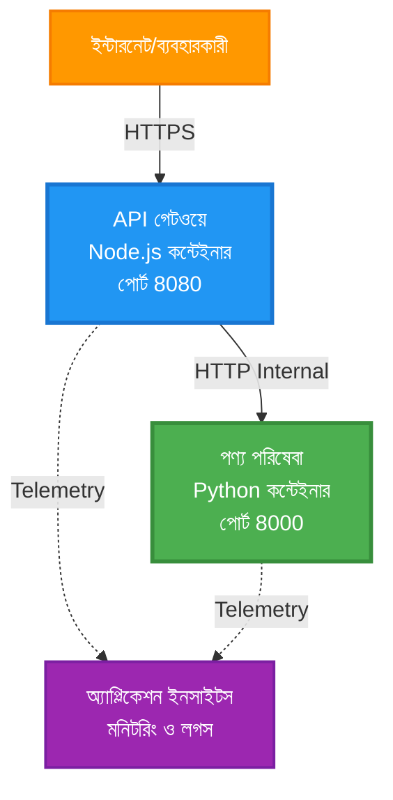
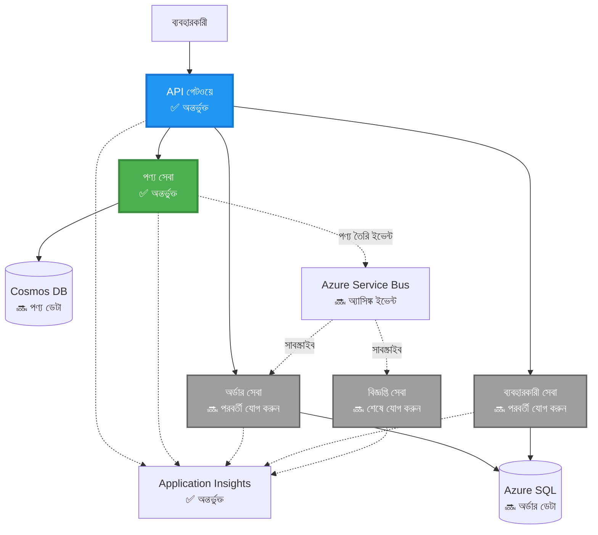
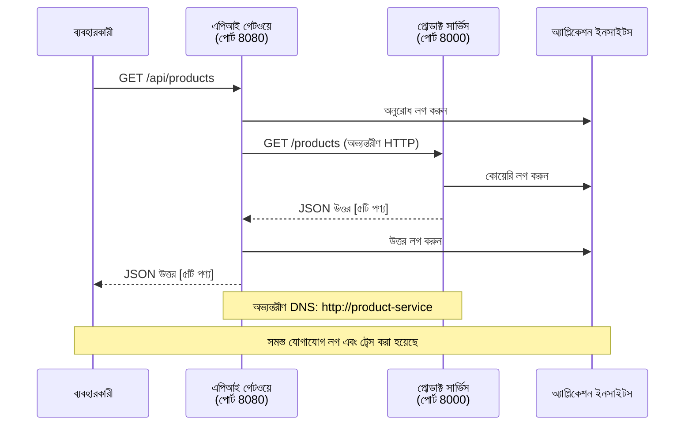

# Microservices Architecture - Container App Example

⏱️ **Estimated Time**: 25-35 minutes | 💰 **Estimated Cost**: ~$50-100/month | ⭐ **Complexity**: Advanced

**📚 শেখার পথ:**
- ← পূর্ববর্তী: [Simple Flask API](../../../../examples/container-app/simple-flask-api) - একক কনটেইনার মৌলিক বিষয়াবলী
- 🎯 **আপনি এখানে আছেন**: Microservices Architecture (2-service foundation)
- → পরবর্তী: [AI Integration](../../../../docs/ai-foundry) - আপনার সার্ভিসগুলিতে বুদ্ধিমত্তা যোগ করুন
- 🏠 [কোর্স হোম](../../README.md)

---

একটি **সরলীকৃত কিন্তু কার্যকরী** মাইক্রোসার্ভিস স্থাপত্য যা AZD CLI ব্যবহার করে Azure Container Apps-এ ডেপ্লয় করা হয়েছে। এই উদাহরণটি সার্ভিস-টু-সার্ভিস যোগাযোগ, কনটেইনার অর্কেস্ট্রেশন, এবং পর্যবেক্ষণের একটি ব্যবহারিক 2-সার্ভিস সেটআপ প্রদর্শন করে।

> **📚 শেখার পদ্ধতি**: এই উদাহরণটি একটি ন্যূনতম 2-সার্ভিস স্থাপত্য (API Gateway + Backend Service) দিয়ে শুরু করে যা আপনি সত্যিই ডেপ্লয় করে শিখতে পারেন। এই ভিত্তি আয়ত্ব করার পরে, আমরা একটি সম্পূর্ণ মাইক্রোসার্ভিস ইকোসিস্টেমে সম্প্রসারণের নির্দেশনা প্রদান করি।

## আপনি কী শিখবেন

এই উদাহরণ সম্পন্ন করে আপনি:
- একাধিক কনটেইনার Azure Container Apps-এ ডেপ্লয় করবেন
- অভ্যন্তরীণ নেটওয়ার্কিং ব্যবহার করে সার্ভিস-টু-সার্ভিস যোগাযোগ বাস্তবায়ন করবেন
- পরিবেশ-ভিত্তিক স্কেলিং এবং হেলথ চেক কনফিগার করবেন
- Application Insights দিয়ে বিতরিত অ্যাপ্লিকেশন মনিটর করবেন
- মাইক্রোসার্ভিস ডেপ্লয়মেন্ট প্যাটার্ন এবং সেরা অনুশীলন সম্পর্কে বুঝতে পারবেন
- সরল থেকে জটিল স্থাপত্যের দিকে ধীরে ধীরে সম্প্রসারণ শিখবেন

## স্থাপত্য

### ধাপ 1: আমরা যা তৈরি করছি (এই উদাহরণে অন্তর্ভুক্ত)


```mermaid
graph TB
    Internet[ইন্টারনেট/ব্যবহারকারী]
    Gateway[API গেটওয়ে<br/>Node.js কন্টেইনার<br/>পোর্ট 8080]
    Product[পণ্য পরিষেবা<br/>Python কন্টেইনার<br/>পোর্ট 8000]
    AppInsights[অ্যাপ্লিকেশন ইনসাইটস<br/>মনিটরিং ও লগস]
    
    Internet -->|HTTPS| Gateway
    Gateway -->|HTTP Internal| Product
    Gateway -.->|Telemetry| AppInsights
    Product -.->|Telemetry| AppInsights
    
    style Gateway fill:#2196F3,stroke:#1976D2,stroke-width:3px,color:#fff
    style Product fill:#4CAF50,stroke:#388E3C,stroke-width:3px,color:#fff
    style Internet fill:#FF9800,stroke:#F57C00,stroke-width:2px,color:#fff
    style AppInsights fill:#9C27B0,stroke:#7B1FA2,stroke-width:2px,color:#fff
```
**কম্পোনেন্ট বিবরণ:**

| Component | Purpose | Access | Resources |
|-----------|---------|--------|-----------|
| **API Gateway** | বাহ্যিক অনুরোধগুলোকে ব্যাকএন্ড সার্ভিসে রুট করে | Public (HTTPS) | 1 vCPU, 2GB RAM, 2-20 replicas |
| **Product Service** | ইন-মেমরি ডেটা দিয়ে পণ্যের ক্যাটালগ পরিচালনা করে | Internal only | 0.5 vCPU, 1GB RAM, 1-10 replicas |
| **Application Insights** | কেন্দ্রীভূত লগিং এবং বিতরিত ট্রেসিং | Azure Portal | 1-2 GB/month data ingestion |

**কেন সরল থেকে শুরু করবেন?**
- ✅ দ্রুত ডেপ্লয় এবং বুঝে নেওয়া (25-35 মিনিট)
- ✅ জটিলতা ছাড়া মাইক্রোসার্ভিস মূল কৌশল শিখুন
- ✅ কাজ করা কোড যা আপনি পরিবর্তন ও পরীক্ষা করতে পারেন
- ✅ শেখার জন্য কম খরচ (~$50-100/month বনাম $300-1400/month)
- ✅ ডাটাবেস এবং ম্যাসেজ কিউ যোগ করার আগে আত্মবিশ্বাস তৈরি করুন

**উপমা**: এটা এমনভাবে ভাবুন যেন গাড়ি চালানো শেখা। আপনি একটি খালি পার্কিং লটে (2 সার্ভিস) শুরু করেন, মৌলিকগুলিতে দক্ষ হন, তারপর শহরের ট্র্যাফিকে (5+ সার্ভিস সহ ডাটাবেস) অগ্রসর হন।

### ধাপ 2: ভবিষ্যৎ সম্প্রসারণ (রেফারেন্স স্থাপত্য)

একবার আপনি 2-সার্ভিস স্থাপত্য আয়ত্ব করলে, আপনি সম্প্রসারণ করতে পারেন:


```mermaid
graph TB
    User[ব্যবহারকারী]
    Gateway[API গেটওয়ে<br/>✅ অন্তর্ভুক্ত]
    Product[পণ্য সেবা<br/>✅ অন্তর্ভুক্ত]
    Order[অর্ডার সেবা<br/>🔜 পরবর্তী যোগ করুন]
    UserSvc[ব্যবহারকারী সেবা<br/>🔜 পরবর্তী যোগ করুন]
    Notify[বিজ্ঞপ্তি সেবা<br/>🔜 শেষে যোগ করুন]
    
    CosmosDB[(Cosmos DB<br/>🔜 পণ্য ডেটা)]
    AzureSQL[(Azure SQL<br/>🔜 অর্ডার ডেটা)]
    ServiceBus[Azure Service Bus<br/>🔜 অ্যাসিঙ্ক ইভেন্ট]
    AppInsights[Application Insights<br/>✅ অন্তর্ভুক্ত]
    
    User --> Gateway
    Gateway --> Product
    Gateway --> Order
    Gateway --> UserSvc
    
    Product --> CosmosDB
    Order --> AzureSQL
    UserSvc --> AzureSQL
    
    Product -.->|পণ্য তৈরি ইভেন্ট| ServiceBus
    ServiceBus -.->|সাবস্ক্রাইব| Notify
    ServiceBus -.->|সাবস্ক্রাইব| Order
    
    Gateway -.-> AppInsights
    Product -.-> AppInsights
    Order -.-> AppInsights
    UserSvc -.-> AppInsights
    Notify -.-> AppInsights
    
    style Product fill:#4CAF50,stroke:#388E3C,stroke-width:3px,color:#fff
    style Gateway fill:#2196F3,stroke:#1976D2,stroke-width:3px,color:#fff
    style Order fill:#9E9E9E,stroke:#616161,stroke-width:2px,color:#fff
    style UserSvc fill:#9E9E9E,stroke:#616161,stroke-width:2px,color:#fff
    style Notify fill:#9E9E9E,stroke:#616161,stroke-width:2px,color:#fff
```
শেষে "Expansion Guide" অংশে স্টেপ-বাই-স্টেপ নির্দেশাবলী দেখুন।

## অন্তর্ভুক্ত বৈশিষ্ট্যসমূহ

✅ **Service Discovery**: কনটেইনারগুলির মধ্যে স্বয়ংক্রিয় DNS-ভিত্তিক ডিসকভারি  
✅ **Load Balancing**: রেপ্লিকার মধ্যে বিল্ট-ইন লোড ব্যালান্সিং  
✅ **Auto-scaling**: HTTP অনুরোধের ভিত্তিতে সার্ভিসভিত্তিক স্বাধীন স্কেলিং  
✅ **Health Monitoring**: উভয় সার্ভিসের জন্য লিভনেস এবং রিডিনেস probes  
✅ **Distributed Logging**: Application Insights দিয়ে কেন্দ্রীভূত লগিং  
✅ **Internal Networking**: নিরাপদ সার্ভিস-টু-সার্ভিস যোগাযোগ  
✅ **Container Orchestration**: স্বয়ংক্রিয় ডেপ্লয়মেন্ট এবং স্কেলিং  
✅ **Zero-Downtime Updates**: রিলিং আপডেটস সহ রেভিশন ম্যানেজমেন্ট  

## পূর্বশর্ত

### প্রয়োজনীয় টুলসমূহ

শুরু করার আগে নিশ্চিত করুন যে আপনার কাছে এই টুলগুলো ইনস্টল করা আছে:

1. **[Azure Developer CLI (azd)](https://learn.microsoft.com/azure/developer/azure-developer-cli/install-azd)** (সংস্করণ 1.0.0 বা এর উপরে)
   ```bash
   azd version
   # প্রত্যাশিত আউটপুট: azd সংস্করণ 1.0.0 বা তার উপরের
   ```

2. **[Azure CLI](https://learn.microsoft.com/cli/azure/install-azure-cli)** (সংস্করণ 2.50.0 বা এর উপরে)
   ```bash
   az --version
   # প্রত্যাশিত আউটপুট: azure-cli 2.50.0 বা তার বেশি
   ```

3. **[Docker](https://www.docker.com/get-started)** (লোকাল ডেভেলপমেন্ট/টেস্টিং এর জন্য - ঐচ্ছিক)
   ```bash
   docker --version
   # প্রত্যাশিত আউটপুট: Docker সংস্করণ 20.10 বা তার উচ্চতর
   ```

### আপনার সেটআপ যাচাই করুন

এগুলি চালিয়ে নিশ্চিত করুন যে আপনি প্রস্তুত:

```bash
# Azure Developer CLI পরীক্ষা করুন
azd version
# ✅ প্রত্যাশিত: azd সংস্করণ 1.0.0 বা তার বেশি

# Azure CLI পরীক্ষা করুন
az --version
# ✅ প্রত্যাশিত: azure-cli সংস্করণ 2.50.0 বা তার বেশি

# Docker পরীক্ষা করুন (ঐচ্ছিক)
docker --version
# ✅ প্রত্যাশিত: Docker সংস্করণ 20.10 বা তার বেশি
```

**সাফল্য মানদণ্ড**: সব কমান্ডগুলো মিনিমাম ভার্সন বা তার উপরে ভার্সন নম্বর রিটার্ন করবে।

### Azure প্রয়োজনীয়তাসমূহ

- একটি সক্রিয় **Azure subscription** ([create a free account](https://azure.microsoft.com/free/))
- আপনার সাবস্ক্রিপশনে রিসোর্স তৈরি করার অনুমতি
- সাবস্ক্রিপশন বা রিসোর্স গ্রুপে **Contributor** ভূমিকা

### জ্ঞানগত পূর্বশর্ত

এটি একটি **উচ্চ-স্তরের** উদাহরণ। আপনার থাকা উচিত:
- [Simple Flask API example](../../../../examples/container-app/simple-flask-api) সম্পন্ন করা
- মাইক্রোসার্ভিস স্থাপত্যের মৌলিক ধারণা
- REST APIs এবং HTTP সম্পর্কে পরিচিতি
- কনটেইনার ধারণাগুলির বোঝাপড়া

**Container Apps-এ নতুন?** প্রথমে [Simple Flask API example](../../../../examples/container-app/simple-flask-api) থেকে শুরু করুন মৌলিক বিষয়গুলো শিখতে।

## দ্রুত শুরু (ধাপে ধাপে)

### ধাপ 1: ক্লোন এবং নেভিগেট করুন

```bash
git clone https://github.com/microsoft/AZD-for-beginners.git
cd AZD-for-beginners/examples/microservices
```

**✓ সাফল্য চেক**: যাচাই করুন আপনি `azure.yaml` দেখছেন:
```bash
ls
# প্রত্যাশিত: README.md, azure.yaml, infra/, src/
```

### ধাপ 2: Azure-এ Authenticate করুন

```bash
azd auth login
```

এটি আপনার ব্রাউজার খুলবে Azure authentication-এর জন্য। আপনার Azure ক্রেডেনশিয়াল দিয়ে সাইন ইন করুন।

**✓ সাফল্য চেক**: আপনি দেখতে পাবেন:
```
Logged in to Azure.
```

### ধাপ 3: পরিবেশ ইনিশিয়ালাইজ করুন

```bash
azd init
```

**আপনি যে প্রম্পটগুলো দেখতে পাবেন**:
- **Environment name**: একটি সংক্ষিপ্ত নাম দিন (উদাহরণ: `microservices-dev`)
- **Azure subscription**: আপনার সাবস্ক্রিপশন নির্বাচন করুন
- **Azure location**: একটি অঞ্চল নির্বাচন করুন (উদাহরণ: `eastus`, `westeurope`)

**✓ সাফল্য চেক**: আপনি দেখতে পাবেন:
```
SUCCESS: New project initialized!
```

### ধাপ 4: অবকাঠামো এবং সার্ভিসগুলো ডেপ্লয় করুন

```bash
azd up
```

**কি ঘটে** (প্রায় 8-12 মিনিট সময় লাগতে পারে):


```mermaid
graph LR
    A[azd আপ] --> B[রিসোর্স গ্রুপ তৈরি করুন]
    B --> C[কনটেইনার রেজিস্ট্রি ডিপ্লয় করুন]
    C --> D[লগ অ্যানালিটিক্স ডিপ্লয় করুন]
    D --> E[অ্যাপ ইনসাইটস ডিপ্লয় করুন]
    E --> F[কনটেইনার পরিবেশ তৈরি করুন]
    F --> G[API গেটওয়ে ইমেজ বিল্ড করুন]
    F --> H[প্রোডাক্ট সার্ভিস ইমেজ বিল্ড করুন]
    G --> I[রেজিস্ট্রিতে পুশ করুন]
    H --> I
    I --> J[API গেটওয়ে ডিপ্লয় করুন]
    I --> K[প্রোডাক্ট সার্ভিস ডিপ্লয় করুন]
    J --> L[ইনগ্রেস ও হেলথ চেক কনফিগার করুন]
    K --> L
    L --> M[ডিপ্লয়মেন্ট সম্পন্ন ✓]
    
    style A fill:#2196F3,stroke:#1976D2,stroke-width:3px,color:#fff
    style M fill:#4CAF50,stroke:#388E3C,stroke-width:3px,color:#fff
```
**✓ সাফল্য চেক**: আপনি দেখতে পাবেন:
```
SUCCESS: Your application was deployed to Azure in X minutes Y seconds.
Endpoint: https://api-gateway-<unique-id>.azurecontainerapps.io
```

**⏱️ সময়**: 8-12 মিনিট

### ধাপ 5: ডেপ্লয়মেন্ট পরীক্ষা করুন

```bash
# গেটওয়ে এন্ডপয়েন্ট পান
GATEWAY_URL=$(azd env get-values | grep API_GATEWAY_URL | cut -d '=' -f2 | tr -d '"')

# API গেটওয়ের স্বাস্থ্য পরীক্ষা করুন
curl $GATEWAY_URL/health
```

**✅ প্রত্যাশিত আউটপুট:**
```json
{
  "status": "healthy",
  "service": "api-gateway",
  "timestamp": "2025-11-19T10:30:00Z"
}
```

**Gateway দিয়ে product service পরীক্ষা করুন**:
```bash
# পণ্যসমূহ তালিকাভুক্ত করুন
curl $GATEWAY_URL/api/products
```

**✅ প্রত্যাশিত আউটপুট:**
```json
[
  {"id":1,"name":"Laptop","price":999.99,"stock":50},
  {"id":2,"name":"Mouse","price":29.99,"stock":200},
  {"id":3,"name":"Keyboard","price":79.99,"stock":150}
]
```

**✓ সাফল্য চেক**: উভয় এন্ডপয়েন্ট থেকে কোনো ত্রুটি ছাড়া JSON ডেটা রিটার্ন হবে।

---

**🎉 অভিনন্দন!** আপনি Azure-এ একটি মাইক্রোসার্ভিস স্থাপত্য ডেপ্লয় করেছেন!

## প্রকল্প কাঠামো

সমস্ত ইমপ্লিমেন্টেশন ফাইল অন্তর্ভুক্ত—এটি একটি সম্পূর্ণ, কাজ করা উদাহরণ:

```
microservices/
│
├── README.md                         # This file
├── azure.yaml                        # AZD configuration
├── .gitignore                        # Git ignore patterns
│
├── infra/                           # Infrastructure as Code (Bicep)
│   ├── main.bicep                   # Main orchestration
│   ├── abbreviations.json           # Naming conventions
│   ├── core/                        # Shared infrastructure
│   │   ├── container-apps-environment.bicep  # Container environment + registry
│   │   └── monitor.bicep            # Application Insights + Log Analytics
│   └── app/                         # Service definitions
│       ├── api-gateway.bicep        # API Gateway container app
│       └── product-service.bicep    # Product Service container app
│
└── src/                             # Application source code
    ├── api-gateway/                 # Node.js API Gateway
    │   ├── app.js                   # Express server with routing
    │   ├── package.json             # Node dependencies
    │   └── Dockerfile               # Container definition
    └── product-service/             # Python Product Service
        ├── main.py                  # Flask API with product data
        ├── requirements.txt         # Python dependencies
        └── Dockerfile               # Container definition
```

**প্রতিটি কম্পোনেন্ট কী করে:**

**Infrastructure (infra/)**:
- `main.bicep`: সমস্ত Azure রিসোর্স এবং তাদের নির্ভরশীলতা অর্কেস্ট্রেট করে
- `core/container-apps-environment.bicep`: Container Apps environment এবং Azure Container Registry তৈরি করে
- `core/monitor.bicep`: বিতরিত লগিং-এর জন্য Application Insights সেটআপ করে
- `app/*.bicep`: স্কেলিং এবং হেলথ চেক সহ পৃথক কনটেইনার অ্যাপ ডেফিনিশন

**API Gateway (src/api-gateway/)**:
- পাবলিক-ফেসিং সার্ভিস যা রিকোয়েস্টগুলোকে ব্যাকএন্ড সার্ভিসে রুট করে
- লগিং, ত্রুটি হ্যান্ডলিং, এবং রিকোয়েস্ট ফরওয়ার্ডিং বাস্তবায়ন করে
- সার্ভিস-টু-সার্ভিস HTTP যোগাযোগ উদাহরণ দেখায়

**Product Service (src/product-service/)**:
- ইন-মেমরি পণ্যের ক্যাটালগ সহ ইনটার্নাল সার্ভিস
- হেলথ চেকসহ REST API
- ব্যাকএন্ড মাইক্রোসার্ভিস প্যাটার্নের উদাহরণ

## সার্ভিসসমূহের ওভারভিউ

### API Gateway (Node.js/Express)

**Port**: 8080  
**Access**: Public (external ingress)  
**Purpose**: ইনকামিং রিকোয়েস্টগুলোকে উপযুক্ত ব্যাকএন্ড সার্ভিসে রুট করে  

**Endpoints**:
- `GET /` - সার্ভিস তথ্য
- `GET /health` - হেলথ চেক এন্ডপয়েন্ট
- `GET /api/products` - product service-এ ফরওয়ার্ড করে (সব লিস্ট)
- `GET /api/products/:id` - product service-এ ফরওয়ার্ড করে (ID অনুযায়ী পাওয়া)

**মূল বৈশিষ্ট্যগুলো**:
- axios দিয়ে রিকোয়েস্ট রাউটিং
- কেন্দ্রীভূত লগিং
- ত্রুটি হ্যান্ডলিং এবং টাইমআউট ম্যানেজমেন্ট
- এনভায়রনমেন্ট ভেরিয়েবল মাধ্যমে সার্ভিস ডিসকভারি
- Application Insights ইন্টিগ্রেশন

**কোড হাইলাইট** (`src/api-gateway/app.js`):
```javascript
// অভ্যন্তরীণ সেবা যোগাযোগ
app.get('/api/products', async (req, res) => {
  const response = await axios.get(`${PRODUCT_SERVICE_URL}/products`, {
    timeout: 5000
  });
  res.json(response.data);
});
```

### Product Service (Python/Flask)

**Port**: 8000  
**Access**: Internal only (no external ingress)  
**Purpose**: ইন-মেমরি ডেটা দিয়ে পণ্যের ক্যাটালগ পরিচালনা করে  

**Endpoints**:
- `GET /` - সার্ভিস তথ্য
- `GET /health` - হেলথ চেক এন্ডপয়েন্ট
- `GET /products` - সকল পণ্য তালিকা
- `GET /products/<id>` - ID অনুযায়ী পণ্য পান

**মূল বৈশিষ্ট্যগুলো**:
- Flask দিয়ে RESTful API
- ইন-মেমরি প্রোডাক্ট স্টোর (সরল, ডাটাবেসের প্রয়োজন নেই)
- probes সহ হেলথ মনিটরিং
- স্ট্রাকচার্ড লগিং
- Application Insights ইন্টিগ্রেশন

**ডেটা মডেল**:
```python
{
  "id": 1,
  "name": "Laptop",
  "description": "High-performance laptop",
  "price": 999.99,
  "stock": 50
}
```

**কেন কেবল ইন্টারনাল?**
Product service পাবলিকভাবে প্রকাশ করা হয়নি। সব রিকোয়েস্ট API Gateway-এর মাধ্যমে যেতে হবে, যা প্রদান করে:
- সিকিউরিটি: নিয়ন্ত্রিত অ্যাক্সেস পয়েন্ট
- নমনীয়তা: ব্যাকএন্ড পরিবর্তন করলে ক্লায়েন্টদের প্রভাব পড়ে না
- পর্যবেক্ষণ: কেন্দ্রীভূত রিকোয়েস্ট লগিং

## সার্ভিস যোগাযোগ বোঝা

### সার্ভিসগুলো কীভাবে একে অপরের সাথে কথা বলে


```mermaid
sequenceDiagram
    participant User as ব্যবহারকারী
    participant Gateway as এপিআই গেটওয়ে<br/>(পোর্ট 8080)
    participant Product as প্রোডাক্ট সার্ভিস<br/>(পোর্ট 8000)
    participant AI as অ্যাপ্লিকেশন ইনসাইটস
    
    User->>Gateway: GET /api/products
    Gateway->>AI: অনুরোধ লগ করুন
    Gateway->>Product: GET /products (অভ্যন্তরীণ HTTP)
    Product->>AI: কোয়েরি লগ করুন
    Product-->>Gateway: JSON উত্তর [৫টি পণ্য]
    Gateway->>AI: উত্তর লগ করুন
    Gateway-->>User: JSON উত্তর [৫টি পণ্য]
    
    Note over Gateway,Product: অভ্যন্তরীণ DNS: http://product-service
    Note over User,AI: সমস্ত যোগাযোগ লগ এবং ট্রেস করা হয়েছে
```
এই উদাহরণে, API Gateway Product Service-এর সাথে যোগাযোগ করে **অভ্যন্তরীণ HTTP কল** ব্যবহার করে:

```javascript
// এপিআই গেটওয়ে (src/api-gateway/app.js)
const PRODUCT_SERVICE_URL = process.env.PRODUCT_SERVICE_URL;

// অভ্যন্তরীণ HTTP অনুরোধ করুন
const response = await axios.get(`${PRODUCT_SERVICE_URL}/products`);
```

**মূল পয়েন্টসমূহ**:

1. **DNS-ভিত্তিক ডিসকভারি**: Container Apps স্বয়ংক্রিয়ভাবে অভ্যন্তরীণ সার্ভিসগুলির জন্য DNS প্রদান করে
   - Product Service FQDN: `product-service.internal.<environment>.azurecontainerapps.io`
   - সহজভাবে: `http://product-service` (Container Apps এটি রেজলভ করে)

2. **কোনো পাবলিক এক্সপোজার নেই**: Product Service-এ Bicep-এ `external: false` আছে
   - কেবলমাত্র Container Apps পরিবেশের ভিতরেই অ্যাক্সেসযোগ্য
   - ইন্টারনেট থেকে পৌঁছানো যায় না

3. **পরিবেশ ভেরিয়েবল**: সার্ভিস URL গুলো ডেপ্লয়মেন্ট সময় ইনজেক্ট করা হয়
   - Bicep গেটওয়েতে অভ্যন্তরীণ FQDN পাস করে
   - অ্যাপ্লিকেশন কোডে হার্ডকোডেড URL নেই

**উপমা**: এটাকে একটি অফিসরুম হিসেবে ভাবুন। API Gateway রিসেপশন ডেস্ক (পাবলিক-ফেসিং), এবং Product Service একটি অফিস রুম (শুধুমাত্র ইন্টারনাল)। দর্শককে কোনো অফিসে পৌঁছাতে রিসেপশনের মাধ্যমে যেতে হবে।

## ডেপ্লয়মেন্ট অপশনসমূহ

### সম্পূর্ণ ডেপ্লয়মেন্ট (প্রস্তাবিত)

```bash
# ইনফ্রাস্ট্রাকচার এবং উভয় সার্ভিস মোতায়েন করুন
azd up
```

এটি ডেপ্লয় করে:
1. Container Apps environment
2. Application Insights
3. Container Registry
4. API Gateway কনটেইনার
5. Product Service কনটেইনার

**সময়**: 8-12 মিনিট

### পৃথক সার্ভিস ডেপ্লয় করুন

```bash
# প্রাথমিক azd up চালানোর পর শুধুমাত্র একটি সার্ভিস মোতায়েন করুন
azd deploy api-gateway

# অথবা product সার্ভিস মোতায়েন করুন
azd deploy product-service
```

**ব্যবহার কেস**: যখন আপনি একটি সার্ভিসে কোড আপডেট করেছেন এবং শুধু ওই সার্ভিসটি পুনরায় ডেপ্লয় করতে চান।

### কনফিগারেশন আপডেট করুন

```bash
# স্কেলিং প্যারামিটার পরিবর্তন করুন
azd env set GATEWAY_MAX_REPLICAS 30

# নতুন কনফিগারেশন দিয়ে পুনরায় ডিপ্লয় করুন
azd up
```

## কনফিগারেশন

### স্কেলিং কনফিগারেশন

উভয় সার্ভিস তাদের Bicep ফাইলগুলিতে HTTP-ভিত্তিক অটোস্কেলিং সহ কনফিগার করা রয়েছে:

**API Gateway**:
- Min replicas: 2 (উপলব্ধতার জন্য সর্বদা অন্তত 2)
- Max replicas: 20
- স্কেল ট্রিগার: প্রতি রেপ্লিকা 50 কনকারেন্ট অনুরোধ

**Product Service**:
- Min replicas: 1 (প্রয়োজনে জিরো পর্যন্ত স্কেল করতে পারে)
- Max replicas: 10
- স্কেল ট্রিগার: প্রতি রেপ্লিকা 100 কনকারেন্ট অনুরোধ

**স্কেলিং কাস্টমাইজ করুন** (in `infra/app/*.bicep`):
```bicep
scale: {
  minReplicas: 1
  maxReplicas: 10
  rules: [
    {
      name: 'http-scale-rule'
      http: {
        metadata: {
          concurrentRequests: '100'  // Adjust this
        }
      }
    }
  ]
}
```

### রিসোর্স বরাদ্দ

**API Gateway**:
- CPU: 1.0 vCPU
- Memory: 2 GiB
- কারণ: সব বহির্গত ট্র্যাফিক হ্যান্ডেল করে

**Product Service**:
- CPU: 0.5 vCPU
- Memory: 1 GiB
- কারণ: লাইটওয়েট ইন-মেমরি অপারেশন

### হেলথ চেকস

উভয় সার্ভিসে লিভনেস এবং রিডিনেস probes অন্তর্ভুক্ত:

```bicep
probes: [
  {
    type: 'Liveness'
    httpGet: {
      path: '/health'
      port: 8080
    }
    initialDelaySeconds: 10
    periodSeconds: 30
  }
  {
    type: 'Readiness'
    httpGet: {
      path: '/health'
      port: 8080
    }
    initialDelaySeconds: 5
    periodSeconds: 10
  }
]
```

**এর অর্থ কী**:
- **Liveness**: যদি হেলথ চেক ব্যর্থ হয়, Container Apps কনটেইনার রিস্টার্ট করে
- **Readiness**: যদি রেডি না থাকে, Container Apps ঐ রেপ্লিকাতে ট্রাফিক রুট করা বন্ধ করে

## মনিটরিং ও অবজার্ভেবিলিটি

### সার্ভিস লগ দেখুন

```bash
# azd monitor ব্যবহার করে লগ দেখুন
azd monitor --logs

# অথবা নির্দিষ্ট Container Apps-এর জন্য Azure CLI ব্যবহার করুন:
# API Gateway থেকে লগ স্ট্রিম করুন
az containerapp logs show --name api-gateway --resource-group $RG_NAME --follow

# সাম্প্রতিক product service-এর লগ দেখুন
az containerapp logs show --name product-service --resource-group $RG_NAME --tail 100
```

**প্রত্যাশিত আউটপুট**:
```
[api-gateway] API Gateway listening on port 8080
[api-gateway] Product Service URL: http://product-service
[api-gateway] GET /api/products 200 - 45ms
[product-service] Retrieved 5 products
```

### Application Insights কুয়েরি

Azure Portal-এ Application Insights অ্যাক্সেস করুন, তারপর এই কুয়েরিগুলো চালান:

**ধীর অনুরোধ খুঁজুন**:
```kusto
requests
| where timestamp > ago(1h)
| where duration > 1000  // Requests taking >1 second
| summarize count() by name, cloud_RoleName
| order by count_ desc
```

**সার্ভিস-টু-সার্ভিস কল ট্র্যাক করুন**:
```kusto
dependencies
| where timestamp > ago(1h)
| where type == "Http"
| project timestamp, name, target, duration, success
| order by timestamp desc
```

**সার্ভিস অনুযায়ী ত্রুটি হার**:
```kusto
exceptions
| where timestamp > ago(24h)
| summarize errorCount = count() by cloud_RoleName, type
| order by errorCount desc
```

**সময় অনুযায়ী রিকোয়েস্ট ভলিউম**:
```kusto
requests
| where timestamp > ago(1h)
| summarize requestCount = count() by bin(timestamp, 5m), cloud_RoleName
| render timechart
```

### মনিটরিং ড্যাশবোর্ড অ্যাক্সেস করুন

```bash
# Application Insights-এর বিবরণ নিন
azd env get-values | grep APPLICATIONINSIGHTS

# Azure Portal-এ মনিটরিং খুলুন
az monitor app-insights component show \
  --app $(azd env get-values | grep APPLICATIONINSIGHTS_CONNECTION_STRING | cut -d '=' -f2) \
  --resource-group $(azd env get-values | grep AZURE_RESOURCE_GROUP | cut -d '=' -f2) \
  --query "appId" -o tsv
```

### লাইভ মেট্রিক্স

1. Azure Portal-এ Application Insights-এ যান
2. "Live Metrics" ক্লিক করুন
3. রিয়েল-টাইম রিকোয়েস্ট, ফেলিওর, এবং পারফরম্যান্স দেখুন
4. টেস্ট করতে চালান: `curl $(azd env get-values | grep API_GATEWAY_URL | cut -d '=' -f2 | tr -d '"')/api/products`

## ব্যবহারিক অনুশীলন

### অনুশীলন 1: একটি নতুন Product Endpoint যোগ করুন ⭐ (সহজ)

**লক্ষ্য**: নতুন পণ্য তৈরি করার জন্য একটি POST এন্ডপয়েন্ট যোগ করা

**শুরুস্থল**: `src/product-service/main.py`

**ধাপসমূহ**:

1. `get_product` ফাংশনের পরে `main.py`-তে এই এন্ডপয়েন্টটি যোগ করুন:

```python
@app.route('/products', methods=['POST'])
def create_product():
    """Create a new product"""
    data = request.get_json()
    
    # প্রয়োজনীয় ফিল্ডগুলো যাচাই করুন
    if not data or 'name' not in data or 'price' not in data:
        return jsonify({'error': 'Missing required fields: name, price'}), 400
    
    new_id = max(p['id'] for p in products) + 1
    new_product = {
        'id': new_id,
        'name': data['name'],
        'description': data.get('description', ''),
        'price': float(data['price']),
        'stock': int(data.get('stock', 0))
    }
    products.append(new_product)
    logger.info(f"Created product {new_id}")
    return jsonify(new_product), 201
```

2. API Gateway-এ POST রুট যোগ করুন (`src/api-gateway/app.js`):

```javascript
// GET /api/products রুটের পরে এটি যোগ করুন
app.post('/api/products', async (req, res) => {
  try {
    console.log(`Forwarding POST request to ${PRODUCT_SERVICE_URL}/products`);
    const response = await axios.post(`${PRODUCT_SERVICE_URL}/products`, req.body, {
      timeout: 5000
    });
    res.status(201).json(response.data);
  } catch (error) {
    console.error('Error calling product service:', error.message);
    res.status(503).json({
      error: 'Product service unavailable',
      message: error.message
    });
  }
});
```

3. উভয় সার্ভিস পুনরায় ডিপ্লয় করুন:

```bash
azd deploy product-service
azd deploy api-gateway
```

4. নতুন এন্ডপয়েন্ট পরীক্ষা করুন:

```bash
GATEWAY_URL=$(azd env get-values | grep API_GATEWAY_URL | cut -d '=' -f2 | tr -d '"')

# একটি নতুন পণ্য তৈরি করুন
curl -X POST $GATEWAY_URL/api/products \
  -H "Content-Type: application/json" \
  -d '{"name":"USB Cable","price":9.99,"stock":500}'
```

**✅ প্রত্যাশিত আউটপুট:**
```json
{"id":6,"name":"USB Cable","description":"","price":9.99,"stock":500}
```

5. তালিকায় এটি প্রদর্শিত হচ্ছে কি না যাচাই করুন:

```bash
curl $GATEWAY_URL/api/products
# এখন নতুন USB ক্যাবলসহ ৬টি পণ্য দেখানো উচিত
```

**সফলতার মানদণ্ড**:
- ✅ POST অনুরোধ HTTP 201 ফেরত দেয়
- ✅ নতুন পণ্য GET /api/products তালিকায় প্রদর্শিত হয়
- ✅ পণ্যের ID স্বয়ংক্রিয়ভাবে ইনক্রিমেন্ট হয়েছে

**সময়**: 10-15 মিনিট

---

### অনুশীলন 2: অটোস্কেলিং নিয়ম পরিবর্তন করুন ⭐⭐ (মধ্যম)

**লক্ষ্য**: Product Service-কে আরও আগ্রাসীভাবে স্কেল করার জন্য

**শুরু বিন্দু**: `infra/app/product-service.bicep`

**ধাপ**:

1. `infra/app/product-service.bicep` খুলুন এবং `scale` ব্লকটি খুঁজে নিন (প্রায় লাইন 95)

2. থেকে পরিবর্তন করুন:
```bicep
scale: {
  minReplicas: 1
  maxReplicas: 10
  rules: [
    {
      name: 'http-scale-rule'
      http: {
        metadata: {
          concurrentRequests: '100'  // OLD
        }
      }
    }
  ]
}
```

এতে:
```bicep
scale: {
  minReplicas: 2  // Always have 2 running
  maxReplicas: 20  // Allow more scaling
  rules: [
    {
      name: 'http-scale-rule'
      http: {
        metadata: {
          concurrentRequests: '20'  // Scale at lower threshold
        }
      }
    }
  ]
}
```

3. ইনফ্রাস্ট্রাকচার পুনরায় ডিপ্লয় করুন:

```bash
azd up
```

4. নতুন স্কেলিং কনফিগারেশন যাচাই করুন:

```bash
az containerapp show \
  --name $(azd env get-values | grep PRODUCT_SERVICE | head -1 | cut -d '/' -f5) \
  --resource-group $(azd env get-values | grep AZURE_RESOURCE_GROUP | cut -d '=' -f2 | tr -d '"') \
  --query "properties.template.scale" -o json
```

**✅ প্রত্যাশিত আউটপুট:**
```json
{
  "minReplicas": 2,
  "maxReplicas": 20,
  "rules": [...]
}
```

5. লোড দিয়ে অটোস্কেলিং পরীক্ষা করুন:

```bash
# সমান্তরাল অনুরোধ তৈরি করুন
for i in {1..500}; do curl $GATEWAY_URL/api/products & done

# Azure CLI ব্যবহার করে স্কেলিং পর্যবেক্ষণ করুন
az containerapp logs show --name product-service --resource-group $RG_NAME --follow
# অনুসন্ধান করুন: Container Apps-এর স্কেলিং ইভেন্টগুলো
```

**সফলতার মানদণ্ড**:
- ✅ Product Service সর্বদা কমপক্ষে 2টি রেপ্লিকা চালায়
- ✅ লোডে, 2টির বেশি রেপ্লিকায় স্কেল করে
- ✅ Azure Portal নতুন স্কেলিং নিয়মগুলো দেখায়

**সময়**: 15-20 মিনিট

---

### অনুশীলন 3: কাস্টম মনিটরিং কুয়েরি যোগ করুন ⭐⭐ (মধ্যম)

**লক্ষ্য**: product API পারফরম্যান্স ট্র্যাক করার জন্য একটি কাস্টম Application Insights কুয়েরি তৈরি করা

**ধাপ**:

1. Azure Portal-এ Application Insights-এ যান:
   - Azure Portal-এ যান
   - আপনার resource group (rg-microservices-*) খুঁজুন
   - Application Insights রিসোর্সে ক্লিক করুন

2. বাম মেনুতে "Logs" এ ক্লিক করুন

3. এই কুয়েরিটি তৈরি করুন:

```kusto
requests
| where timestamp > ago(1h)
| where name contains "products"
| summarize 
    RequestCount = count(),
    AvgDuration = avg(duration),
    P95Duration = percentile(duration, 95),
    SuccessRate = 100.0 * countif(success == true) / count()
  by bin(timestamp, 5m)
| render timechart
```

4. কুয়েরি 실행 করতে "Run" এ ক্লিক করুন

5. কুয়েরি সংরক্ষণ করুন:
   - "Save" এ ক্লিক করুন
   - নাম: "Product API Performance"
   - বিভাগ: "Performance"

6. টেস্ট ট্রাফিক জেনারেট করুন:

```bash
for i in {1..100}; do curl $GATEWAY_URL/api/products; sleep 1; done
```

7. ডেটা দেখতে কুয়েরিটি রিফ্রেশ করুন

**✅ প্রত্যাশিত আউটপুট:**
- সময়ের সঙ্গে অনুরোধের সংখ্যা দেখানো চার্ট
- গড় সময় < 500ms
- সফলতার হার = 100%
- 5 মিনিটের টাইম-বিন

**সফলতার মানদণ্ড**:
- ✅ কুয়েরি 100+ অনুরোধ দেখায়
- ✅ সফলতার হার 100%
- ✅ গড় সময় < 500ms
- ✅ চার্টে 5-মিনিট টাইম-বিন দেখায়

**শিক্ষার ফলাফল**: কাস্টম কুয়েরি দিয়ে সার্ভিস পারফরম্যান্স মনিটর করা কিভাবে জানবেন

**সময়**: 10-15 মিনিট

---

### অনুশীলন 4: রিট্রাই লজিক বাস্তবায়ন করুন ⭐⭐⭐ (উন্নত)

**লক্ষ্য**: Product Service সাময়িকভাবে অনুপলব্ধ হলে API Gateway-এ রিট্রাই লজিক যোগ করুন

**শুরু বিন্দু**: `src/api-gateway/app.js`

**ধাপ**:

1. retry লাইব্রেরি ইনস্টল করুন:

```bash
cd src/api-gateway
npm install axios-retry --save
cd ../..
```

2. `src/api-gateway/app.js` আপডেট করুন (axios ইম্পোর্টের পরে যোগ করুন):

```javascript
const axiosRetry = require('axios-retry');

// পুনরায় চেষ্টা করার লজিক কনফিগার করুন
axiosRetry(axios, {
  retries: 3,
  retryDelay: (retryCount) => {
    return retryCount * 1000; // 1 সেকেন্ড, 2 সেকেন্ড, 3 সেকেন্ড
  },
  retryCondition: (error) => {
    // নেটওয়ার্ক ত্রুটি বা 5xx রেসপন্সে পুনরায় চেষ্টা করুন
    return axiosRetry.isNetworkOrIdempotentRequestError(error) ||
           (error.response && error.response.status >= 500);
  }
});

console.log('Retry logic configured: 3 retries with exponential backoff');
```

3. API Gateway পুনরায় ডিপ্লয় করুন:

```bash
azd deploy api-gateway
```

4. সার্ভিস ব্যর্থতা সিমুলেট করে রিট্রাই আচরণ পরীক্ষা করুন:

```bash
# পণ্য সার্ভিসকে 0-এ স্কেল করুন (ব্যর্থতা সিমুলেট করুন)
az containerapp update \
  --name $(azd env get-values | grep PRODUCT_SERVICE | head -1 | cut -d '/' -f5) \
  --resource-group $(azd env get-values | grep AZURE_RESOURCE_GROUP | cut -d '=' -f2 | tr -d '"') \
  --min-replicas 0 \
  --max-replicas 0

# পণ্যে অ্যাক্সেস করার চেষ্টা করুন (৩ বার পুনরায় চেষ্টা করবে)
time curl -v $GATEWAY_URL/api/products
# পর্যবেক্ষণ: প্রতিক্রিয়া লাগে প্রায় ৬ সেকেন্ড (১ সেকেন্ড + ২ সেকেন্ড + ৩ সেকেন্ড পুনরায়চেষ্টা)

# পণ্য সার্ভিস পুনরায় চালু করুন
az containerapp update \
  --name $(azd env get-values | grep PRODUCT_SERVICE | head -1 | cut -d '/' -f5) \
  --resource-group $(azd env get-values | grep AZURE_RESOURCE_GROUP | cut -d '=' -f2 | tr -d '"') \
  --min-replicas 1 \
  --max-replicas 10
```

5. রিট্রাই লগ দেখুন:

```bash
az containerapp logs show --name api-gateway --resource-group $RG_NAME --tail 50
# খুঁজুন: পুনরায় চেষ্টা করার বার্তাগুলো
```

**✅ প্রত্যাশিত আচরণ:**
- অনুরোধ ব্যর্থ হওয়ার আগে 3 বার রিট্রাই করে
- প্রতিটি রিট্রাই ধীরে ধীরে বেশি অপেক্ষা করে (1s, 2s, 3s)
- সার্ভিস রিস্টার্টের পরে অনুরোধ সফল হয়
- লগগুলো রিট্রাই চেষ্টা দেখায়

**সফলতার মানদণ্ড**:
- ✅ অনুরোধ ব্যর্থ হওয়ার আগে 3 বার রিট্রাই করে
- ✅ প্রতিটি রিট্রাই ধীরে ধীরে বেশি অপেক্ষা করে (exponential backoff)
- ✅ সার্ভিস রিস্টার্টের পরে অনুরোধ সফল হয়
- ✅ লগগুলো রিট্রাই চেষ্টা দেখায়

**শিক্ষার ফলাফল**: মাইক্রোসার্ভিসে রেজিলিয়েন্স প্যাটার্ন (circuit breakers, retries, timeouts) বোঝা

**সময়**: 20-25 মিনিট

---

## জ্ঞান যাচাই

এই উদাহরণটি সম্পন্ন করার পরে আপনার বোঝা যাচাই করুন:

### 1. সার্ভিস যোগাযোগ ✓

আপনার জ্ঞান পরীক্ষা করুন:
- [ ] আপনি ব্যাখ্যা করতে পারেন কীভাবে API Gateway Product Service আবিষ্কার করে? (DNS-ভিত্তিক সার্ভিস ডিসকভারি)
- [ ] Product Service ডাউন হলে কি হয়? (Gateway 503 error দেয়)
- [ ] আপনি তৃতীয় সার্ভিস কিভাবে যোগ করবেন? (নতুন Bicep ফাইল তৈরি করুন, main.bicep-এ যোগ করুন, src ফোল্ডার তৈরি করুন)

**হ্যান্ডস-অন যাচাই:**
```bash
# সেবা ব্যর্থতা অনুকরণ করুন
az containerapp update --name <product-service-name> --min-replicas 0 --max-replicas 0
curl $GATEWAY_URL/api/products
# ✅ প্রত্যাশিত: 503 সেবা অনুপলব্ধ

# সেবা পুনরুদ্ধার করুন
az containerapp update --name <product-service-name> --min-replicas 1 --max-replicas 10
```

### 2. মনিটরিং ও অবজারভেবিলিটি ✓

আপনার জ্ঞান পরীক্ষা করুন:
- [ ] আপনি বিতরণকৃত লগ কোথায় দেখেন? (Azure Portal-এ Application Insights)
- [ ] আপনি ধীর অনুরোধ কিভাবে ট্র্যাক করবেন? (Kusto কুয়েরি: `requests | where duration > 1000`)
- [ ] আপনি কোন সার্ভিস ত্রুটি ঘটিয়েছে সনাক্ত করতে পারবেন? (লগে `cloud_RoleName` ফিল্ড দেখুন)

**হ্যান্ডস-অন যাচাই:**
```bash
# একটি ধীর অনুরোধ সিমুলেশন তৈরি করুন
curl "$GATEWAY_URL/api/products?delay=2000"

# ধীর অনুরোধগুলির জন্য Application Insights-এ কুয়েরি চালান
# Azure Portal → Application Insights → Logs এ যান
# চালান: requests | where duration > 1000 | project timestamp, name, duration, cloud_RoleName
```

### 3. স্কেলিং ও পারফরম্যান্স ✓

আপনার জ্ঞান পরীক্ষা করুন:
- [ ] অটোস্কেলিং কী ট্রিগার করে? (HTTP concurrent request নিয়ম: gateway-এর জন্য 50, product-এর জন্য 100)
- [ ] এখন কতটি রেপ্লিকা চলছে? (`az containerapp revision list` দিয়ে পরীক্ষা করুন)
- [ ] আপনি কিভাবে Product Service কে 5টি রেপ্লিকায় স্কেল করবেন? (Bicep-এ minReplicas আপডেট করুন)

**হ্যান্ডস-অন যাচাই:**
```bash
# অটোস্কেলিং পরীক্ষা করার জন্য লোড তৈরি করুন
for i in {1..1000}; do curl $GATEWAY_URL/api/products & done

# Azure CLI ব্যবহার করে রেপ্লিকা বাড়তে দেখুন
az containerapp logs show --name api-gateway --resource-group $RG_NAME --follow
# ✅ প্রত্যাশিত: লগগুলোতে স্কেলিং ইভেন্ট দেখা যাবে
```

**সফলতার মানদণ্ড**: আপনি সব প্রশ্নের উত্তর দিতে পারবেন এবং হ্যান্ডস-অন কমান্ড দিয়ে যাচাই করতে পারবেন।

---

## খরচ বিশ্লেষণ

### অনুমানিত মাসিক খরচ (এই 2-সার্ভিস উদাহরণটির জন্য)

| রিসোর্স | কনফিগারেশন | অনুমানিত খরচ |
|----------|--------------|----------------|
| API Gateway | 2-20 replicas, 1 vCPU, 2GB RAM | $30-150 |
| Product Service | 1-10 replicas, 0.5 vCPU, 1GB RAM | $15-75 |
| Container Registry | Basic tier | $5 |
| Application Insights | 1-2 GB/month | $5-10 |
| Log Analytics | 1 GB/month | $3 |
| **মোট** | | **$58-243/month** |

### ব্যবহারের ভিত্তিতে খরচের ভাঙন

**কম ট্র্যাফিক** (পরীক্ষা/শেখা): ~$60/month
- API Gateway: 2 রেপ্লিকা × 24/7 = $30
- Product Service: 1 রেপ্লিকা × 24/7 = $15
- মনিটরিং + রেজিস্ট্রি = $13

**মাঝারি ট্র্যাফিক** (ছোট প্রোডাকশন): ~$120/month
- API Gateway: গড় 5 রেপ্লিকা = $75
- Product Service: গড় 3 রেপ্লিকা = $45
- মনিটরিং + রেজিস্ট্রি = $13

**উচ্চ ট্র্যাফিক** (ব্যস্ত সময়): ~$240/month
- API Gateway: গড় 15 রেপ্লিকা = $225
- Product Service: গড় 8 রেপ্লিকা = $120
- মনিটরিং + রেজিস্ট্রি = $13

### খরচ অপ্টিমাইজ করার টিপস

1. **ডেভেলপমেন্টের জন্য জিরো পর্যন্ত স্কেল করুন**:
   ```bicep
   scale: {
     minReplicas: 0  // Save $30-40/month when not in use
     maxReplicas: 10
   }
   ```

2. **Cosmos DB-এর জন্য Consumption Plan ব্যবহার করুন** (যখন আপনি এটি যোগ করবেন):
   - আপনি যা ব্যবহার করবেন মাত্র তার জন্যই পে করুন
   - কোনও ন্যূনতম চার্জ নেই

3. **Application Insights স্যাম্পলিং সেট করুন**:
   ```javascript
   appInsights.defaultClient.config.samplingPercentage = 50; // অনুরোধগুলোর ৫০% নমুনা নিন
   ```

4. **প্রয়োজন না হলে পরিষ্কার করে ফেলুন**:
   ```bash
   azd down --force --purge
   ```

### ফ্রি টিয়ার অপশন

শিক্ষা/পরীক্ষার জন্য, বিবেচনা করুন:
- ✅ Azure ফ্রি ক্রেডিট ব্যবহার করুন (নতুন অ্যাকাউন্টের জন্য প্রথম 30 দিনে $200)
- ✅ ন্যূনতম রেপ্লিকায় রাখুন (প্রায় 50% খরচ বাঁচে)
- ✅ পরীক্ষার পরে মোছা/ডিলিট করুন (কোনও চলমান চার্জ নেই)
- ✅ শেখার সেশনের মধ্যে জিরো পর্যন্ত স্কেল করুন

**উদাহরণ**: এই উদাহরণটি প্রতিদিন 2 ঘন্টা × 30 দিন চালালে ≈ $5/মাস হবে যা $60/মাসের পরিবর্তে

---

## ট্রাবলশুটিং দ্রুত রেফারেন্স

### সমস্যা: `azd up` ব্যর্থ হয় "Subscription not found"

**সমাধান**:
```bash
# স্পষ্ট সাবস্ক্রিপশন দিয়ে আবার লগইন করুন
az account set --subscription <your-subscription-id>
azd env set AZURE_SUBSCRIPTION_ID <your-subscription-id>
azd up
```

### সমস্যা: API Gateway 503 "Product service unavailable" রিটার্ন করে

**সমস্যা নির্ণয়**:
```bash
# Azure CLI ব্যবহার করে পণ্য সেবার লগ পরীক্ষা করুন
az containerapp logs show --name product-service --resource-group $RG_NAME --tail 50

# পণ্য সেবার স্বাস্থ্য পরীক্ষা করুন
az containerapp show \
  --name $(azd env get-values | grep PRODUCT_SERVICE | head -1 | cut -d '/' -f5) \
  --resource-group $(azd env get-values | grep AZURE_RESOURCE_GROUP | cut -d '=' -f2 | tr -d '"') \
  --query "properties.runningStatus"
```

**সাধারণ কারণগুলো**:
1. Product service শুরু হয়নি (Python ত্রুটির জন্য লগ চেক করুন)
2. হেলথ চেক ব্যর্থ হচ্ছে (`/health` এন্ডপয়েন্টটি কাজ করছে কি না যাচাই করুন)
3. কনটেইনার ইমেজ বিল্ড ব্যর্থ হয়েছে (রেজিস্ট্রিতে ইমেজ চেক করুন)

### সমস্যা: অটোস্কেলিং কাজ করছে না

**সমস্যা নির্ণয়**:
```bash
# বর্তমান রেপ্লিকা সংখ্যা পরীক্ষা করুন
az containerapp revision list \
  --name $(azd env get-values | grep API_GATEWAY | head -1 | cut -d '/' -f5) \
  --resource-group $(azd env get-values | grep AZURE_RESOURCE_GROUP | cut -d '=' -f2 | tr -d '"') \
  --query "[].properties.replicas"

# পরীক্ষার জন্য লোড তৈরি করুন
for i in {1..1000}; do curl $GATEWAY_URL/api/products & done

# Azure CLI ব্যবহার করে স্কেলিং ইভেন্টগুলো পর্যবেক্ষণ করুন
az containerapp logs show --name api-gateway --resource-group $RG_NAME --follow | grep -i scale
```

**সাধারণ কারণগুলো**:
1. স্কেল রুল ট্রিগার করার জন্য লোড যথেষ্ট নয় (প্রয়োজন >50 concurrent requests)
2. সর্বোচ্চ রেপ্লিকা ইতিমধ্যে পৌঁছে গেছে (Bicep কনফিগারেশন চেক করুন)
3. Bicep-এ স্কেল রুল ভুল কনফিগার হয়েছে (concurrentRequests মান যাচাই করুন)

### সমস্যা: Application Insights লগ দেখাচ্ছে না

**সমস্যা নির্ণয়**:
```bash
# সংযোগ স্ট্রিং সেট আছে কি তা যাচাই করুন
azd env get-values | grep APPLICATIONINSIGHTS

# পরীক্ষা করুন সার্ভিসগুলো টেলিমেট্রি পাঠাচ্ছে কিনা
az monitor app-insights component show \
  --app $(azd env get-values | grep APPLICATIONINSIGHTS_NAME | cut -d '=' -f2 | tr -d '"') \
  --resource-group $(azd env get-values | grep AZURE_RESOURCE_GROUP | cut -d '=' -f2 | tr -d '"') \
  --query "properties.InstrumentationKey"
```

**সাধারণ কারণগুলো**:
1. কানেকশন স্ট্রিং কনটেইনারে পাঠানো হয়নি (environment variables চেক করুন)
2. Application Insights SDK কনফিগার করা নেই (কোডে imports যাচাই করুন)
3. ফায়ারওয়াল টেলিমেট্রি ব্লক করছে (অস্বাভাবিক, নেটওয়ার্ক নিয়ম চেক করুন)

### সমস্যা: Docker বিল্ড লোকালভাবে ব্যর্থ হয়

**সমস্যা নির্ণয়**:
```bash
# API গেটওয়ে বিল্ড পরীক্ষা
cd src/api-gateway
docker build -t test-gateway .

# প্রোডাক্ট সার্ভিস বিল্ড পরীক্ষা
cd ../product-service
docker build -t test-product .
```

**সাধারণ কারণগুলো**:
1. package.json/requirements.txt-এ ডিপেন্ডেন্সি অনুপস্থিত
2. Dockerfile সিনট্যাক্স ত্রুটি
3. ডিপেনডেন্সি ডাউনলোডে নেটওয়ার্ক সমস্যা

**এখনও আটকে আছেন?** দেখুন [Common Issues Guide](../../docs/chapter-07-troubleshooting/common-issues.md) বা [Azure Container Apps Troubleshooting](https://learn.microsoft.com/azure/container-apps/troubleshooting)

---

## ক্লিনআপ

চলমান চার্জ এড়াতে, সব রিসোর্স মুছে ফেলুন:

```bash
azd down --force --purge
```

**নিশ্চিতকরণ প্রম্পট**:
```
? Total resources to delete: 6, are you sure you want to continue? (y/N)
```

নিশ্চিত করতে `y` টাইপ করুন।

**কী মুছে ফেলা হবে**:
- Container Apps Environment
- উভয় Container Apps (gateway & product service)
- Container Registry
- Application Insights
- Log Analytics Workspace
- Resource Group

**✓ ক্লিনআপ যাচাই করুন**:
```bash
az group list --query "[?starts_with(name,'rg-microservices')]" --output table
```

ফলাফল শূন্য হওয়া উচিত।

---

## এক্সপ্যানশন গাইড: 2 থেকে 5+ সার্ভিসে কিভাবে বাড়াবেন

একবার আপনি এই 2-সার্ভিস আর্কিটেকচার আয়ত্ত করলে, বাড়ানোর উপায়গুলো নিচে:

### ধাপ 1: ডাটাবেস পার্সিস্টেন্স যোগ করুন (পরবর্তী ধাপ)

**Product Service-এর জন্য Cosmos DB যোগ করুন**:

1. `infra/core/cosmos.bicep` তৈরি করুন:
   ```bicep
   resource cosmosAccount 'Microsoft.DocumentDB/databaseAccounts@2023-04-15' = {
     name: name
     location: location
     kind: 'GlobalDocumentDB'
     properties: {
       databaseAccountOfferType: 'Standard'
       consistencyPolicy: { defaultConsistencyLevel: 'Session' }
       locations: [{ locationName: location, failoverPriority: 0 }]
     }
   }
   ```

2. ইন-মেমোরি ডেটার বদলে Product service-কে Azure Cosmos DB Python SDK ব্যবহার করতে আপডেট করুন

3. আনুমানিক অতিরিক্ত খরচ: ~ $25/মাস (serverless)

### ধাপ 2: তৃতীয় সার্ভিস যোগ করুন (অর্ডার ম্যানেজমেন্ট)

**Order Service তৈরি করুন**:

1. নতুন ফোল্ডার: `src/order-service/` (Python/Node.js/C#)
2. নতুন Bicep: `infra/app/order-service.bicep`
3. API Gateway আপডেট করুন যাতে `/api/orders` রুট করে
4. অর্ডার পার্সিস্টেন্সের জন্য Azure SQL Database যোগ করুন

**আর্কিটেকচার হয়ে যায়**:
```
API Gateway → Product Service (Cosmos DB)
           → Order Service (Azure SQL)
```

### ধাপ 3: অ্যাসিঙ্ক কমিউনিকেশন যোগ করুন (Service Bus)

**ইভেন্ট-চালিত আর্কিটেকচার বাস্তবায়ন করুন**:

1. Azure Service Bus যোগ করুন: `infra/core/servicebus.bicep`
2. Product Service "ProductCreated" ইভেন্ট প্রকাশ করে
3. Order Service প্রোডাক্ট ইভেন্ট সাবস্ক্রাইব করে
4. ইভেন্ট প্রসেস করতে Notification Service যোগ করুন

**প্যাটার্ন**: Request/Response (HTTP) + Event-Driven (Service Bus)

### ধাপ 4: ইউজার অটেনটিকেশন যোগ করুন

**User Service বাস্তবায়ন করুন**:

1. `src/user-service/` তৈরি করুন (Go/Node.js)
2. Azure AD B2C বা কাস্টম JWT অটেনটিকেশন যোগ করুন
3. API Gateway রুটের আগে টোকেন ভ্যালিডেট করে
4. সার্ভিসগুলো ইউজারের অনুমতি চেক করে

### ধাপ 5: প্রোডাকশন-রেডিনেস

**এই কম্পোনেন্টগুলো যোগ করুন**:
- ✅ Azure Front Door (গ্লোবাল লোড ব্যালান্সিং)
- ✅ Azure Key Vault (সিক্রেট ম্যানেজমেন্ট)
- ✅ Azure Monitor Workbooks (কাস্টম ড্যাশবোর্ড)
- ✅ CI/CD Pipeline (GitHub Actions)
- ✅ Blue-Green Deployments
- ✅ সকল সার্ভিসের জন্য Managed Identity

**পূর্ণ প্রোডাকশন আর্কিটেকচার খরচ**: ~ $300-1,400/মাস

---

## আরও জানুন

### সংশ্লিষ্ট ডকুমেন্টেশন
- [Azure Container Apps ডকুমেন্টেশন](https://learn.microsoft.com/azure/container-apps/)
- [Microservices আর্কিটেকচার গাইড](https://learn.microsoft.com/azure/architecture/guide/architecture-styles/microservices)
- [Application Insights for Distributed Tracing](https://learn.microsoft.com/azure/azure-monitor/app/distributed-tracing)
- [Azure Developer CLI ডকুমেন্টেশন](https://learn.microsoft.com/azure/developer/azure-developer-cli/)

### কোর্সে পরবর্তী ধাপগুলো
- ← পূর্ববর্তী: [Simple Flask API](../../../../examples/container-app/simple-flask-api) - শুরু স্তরের একক-কনটেইনার উদাহরণ
- → পরবর্তী: [AI Integration Guide](../../../../docs/ai-foundry) - AI ক্ষমতা যোগ করুন
- 🏠 [কোর্স হোম](../../README.md)

### তুলনা: কখন কোনটি ব্যবহার করবেন

| ফিচার | একক কনটেইনার | মাইক্রোসার্ভিস (এটা) | Kubernetes (AKS) |
|---------|-----------------|---------------------|------------------|
| **Use Case** | সরল অ্যাপ | জটিল অ্যাপ | এন্টারপ্রাইজ অ্যাপ |
| **Scalability** | একক সার্ভিস | সার্ভিস-প্রতি স্কেলিং | সর্বোচ্চ নমনীয়তা |
| **Complexity** | কম | মধ্যম | উচ্চ |
| **Team Size** | 1-3 developers | 3-10 developers | 10+ developers |
| **Cost** | ~$15-50/month | ~$60-250/month | ~$150-500/month |
| **Deployment Time** | 5-10 minutes | 8-12 minutes | 15-30 minutes |
| **Best For** | MVPs, prototypes | Production apps | Multi-cloud, advanced networking |

**Recommendation**: Container Apps দিয়ে শুরু করুন (এই উদাহরণ), কেবল তখনই AKS-এ যান যদি Kubernetes-নির্দিষ্ট বৈশিষ্ট্যের প্রয়োজন হয়।

---

## প্রায়শই জিজ্ঞাসিত প্রশ্ন

**Q: কেন 5+ এর বদলে শুধুমাত্র 2টি সার্ভিস?**  
A: শিক্ষামূলক ধারাবিকতা। জটিলতা যোগ করার আগে একটি সহজ উদাহরণের মাধ্যমে মৌলিক বিষয়গুলো (service communication, monitoring, scaling) আয়ত্ত করুন। এখানে শেখা প্যাটার্নগুলো 100-সার্ভিস স্থাপত্যেও প্রযোজ্য।

**Q: আমি কি নিজে আরও সার্ভিস যোগ করতে পারি?**  
A: অবশ্যই! উপরের বিস্তারের নির্দেশিকা অনুসরণ করুন। প্রতিটি নতুন সার্ভিস একই প্যাটার্ন অনুসরণ করে: src ফোল্ডার তৈরি করুন, Bicep ফাইল তৈরি করুন, azure.yaml আপডেট করুন, ডিপ্লয় করুন।

**Q: এটা প্রোডাকশনের জন্য প্রস্তুত কি?**  
A: এটি একটি শক্তভিত্তি। প্রোডাকশনের জন্য যোগ করুন: managed identity, Key Vault, স্থায়ী ডাটাবেস, CI/CD পাইপলাইন, মনিটরিং অ্যালার্ট, এবং ব্যাকআপ কৌশল।

**Q: কেন Dapr বা অন্য সার্ভিস মেশ ব্যবহার করা হবে না?**  
A: শেখার জন্য সহজ রাখুন। একবার আপনি নেটিভ Container Apps নেটওয়ার্কিং বুঝে গেলে, উন্নত পরিস্থিতির জন্য (state management, pub/sub, bindings) Dapr যোগ করতে পারবেন।

**Q: আমি লোকালি কীভাবে ডিবাগ করবো?**  
A: Docker দিয়ে লোকালি সার্ভিসগুলো চালান:  
```bash
cd src/api-gateway
docker build -t local-gateway .
docker run -p 8080:8080 -e PRODUCT_SERVICE_URL=http://localhost:8000 local-gateway
```

**Q: আমি কি ভিন্ন প্রোগ্রামিং ভাষা ব্যবহার করতে পারি?**  
A: হ্যাঁ! এই উদাহরণে Node.js (gateway) + Python (product service) দেখানো হয়েছে। আপনি কনটেইনারে চলা যেকোনো ভাষা মিশ্রিত করতে পারেন: C#, Go, Java, Ruby, PHP, ইত্যাদি।

**Q: যদি আমার কাছে Azure ক্রেডিট না থাকে তাহলে কি করবো?**  
A: Azure ফ্রি টিয়ার ব্যবহার করুন (নতুন অ্যাকাউন্টে প্রথম 30 দিনে $200 ক্রেডিট মেলে) অথবা সংক্ষিপ্ত পরীক্ষার জন্য ডিপ্লয় করে দ্রুত মুছে দিন। এই উদাহরণটির খরচ প্রায় $2/দিন।

**Q: এটা Azure Kubernetes Service (AKS)-এর থেকে কীভাবে ভিন্ন?**  
A: Container Apps সহজ (Kubernetes জ্ঞানের প্রয়োজন নেই) কিন্তু কম নমনীয়। AKS আপনাকে পূর্ণ Kubernetes নিয়ন্ত্রণ দেয় কিন্তু আরও দক্ষতা প্রয়োজন। Container Apps দিয়ে শুরু করুন, প্রয়োজন হলে AKS-এ যান।

**Q: আমি কি এটা বিদ্যমান Azure সার্ভিসগুলোর সঙ্গে ব্যবহার করতে পারি?**  
A: হ্যাঁ! আপনি বিদ্যমান ডাটাবেস, স্টোরেজ অ্যাকাউন্ট, Service Bus ইত্যাদির সাথে সংযুক্ত করতে পারেন। নতুন রিসোর্স তৈরি করার পরিবর্তে বিদ্যমান রিসোর্সগুলিকে রেফারেন্স করতে Bicep ফাইলগুলো আপডেট করুন।

---

> **🎓 Learning Path Summary**: আপনি স্বয়ংক্রিয় স্কেলিং, অভ্যন্তরীণ নেটওয়ার্কিং, কেন্দ্রীভূত মনিটরিং, এবং প্রোডাকশন-রেডি প্যাটার্ন সহ একটি মাল্টি-সার্ভিস আর্কিটেকচার ডিপ্লয় করা শিখেছেন। এই ভিত্তি আপনাকে জটিল বিতরণকৃত সিস্টেম এবং এন্টারপ্রাইজ মাইক্রোসার্ভিস আর্কিটেকচারের জন্য প্রস্তুত করে।

**📚 Course Navigation:**
- ← Previous: [সহজ Flask API](../../../../examples/container-app/simple-flask-api)
- → Next: [ডাটাবেস ইন্টিগ্রেশন উদাহরণ](../../../../database-app)
- 🏠 [কোর্স হোম](../../README.md)
- 📖 [Container Apps সেরা অনুশীলন](../../docs/chapter-04-infrastructure/deployment-guide.md)

---

**✨ Congratulations!** আপনি মাইক্রোসার্ভিস উদাহরণটি সম্পন্ন করেছেন। এখন আপনি বুঝতে পারবেন কীভাবে Azure Container Apps-এ বিতরণকৃত অ্যাপ্লিকেশনগুলি তৈরি, ডিপ্লয় এবং মনিটর করতে হয়। AI সক্ষমতা যোগ করতে প্রস্তুত? দেখুন [AI ইন্টিগ্রেশন গাইড](../../../../docs/ai-foundry)!

---

<!-- CO-OP TRANSLATOR DISCLAIMER START -->
**অস্বীকৃতি**:
এই নথিটি AI অনুবাদ সেবা [Co-op Translator](https://github.com/Azure/co-op-translator) ব্যবহার করে অনূদিত হয়েছে। যদিও আমরা সঠিকতার জন্য চেষ্টা করি, অনুগ্রহ করে মনে রাখবেন যে স্বয়ংক্রিয় অনুবাদে ভুল বা অমিল থাকতে পারে। মূল নথিটি তার নিজ ভাষায়ই কর্তৃত্বপূর্ণ উৎস হিসেবে বিবেচনা করা উচিত। গুরুত্বপূর্ণ তথ্যের জন্য পেশাদার মানব অনুবাদ গ্রহণের পরামর্শ দেওয়া হয়। এই অনুবাদ ব্যবহারের ফলে সৃষ্টি হওয়া কোনো ভুল বোঝাবুঝি বা ভুল ব্যাখ্যার জন্য আমরা দায়ী নই।
<!-- CO-OP TRANSLATOR DISCLAIMER END -->