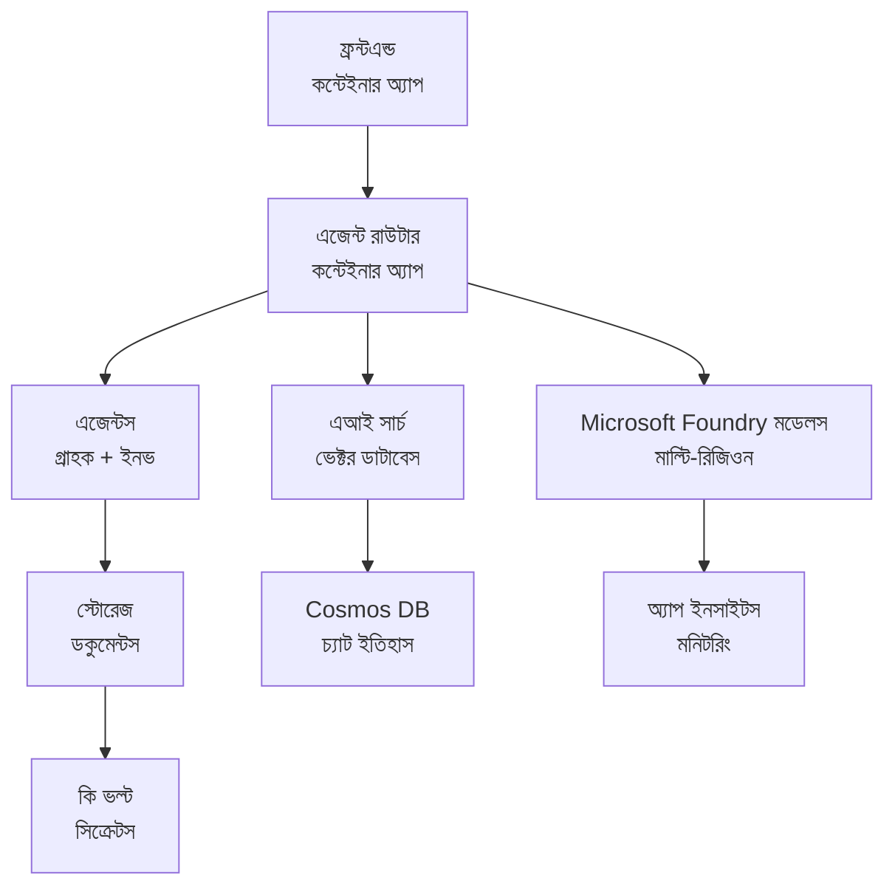

# রিটেইল মাল্টি-এজেন্ট সলিউশন - ইনফ্রাস্ট্রাকচার টেমপ্লেট

**অধ্যায় ৫: প্রোডাকশন ডিপ্লয়মেন্ট প্যাকেজ**
- **📚 কোর্স হোম**: [AZD For Beginners](../../README.md)
- **📖 সম্পর্কিত অধ্যায়**: [অধ্যায় ৫: মাল্টি-এজেন্ট AI সলিউশন](../../README.md#-chapter-5-multi-agent-ai-solutions-advanced)
- **📝 সিনারিও গাইড**: [Complete Architecture](../retail-scenario.md)
- **🎯 দ্রুত ডিপ্লয়**: [এক-ক্লিক ডিপ্লয়মেন্ট](../../../../examples/retail-multiagent-arm-template)

> **⚠️ শুধুমাত্র ইনফ্রাস্ট্রাকচার টেমপ্লেট**  
> এই ARM টেমপ্লেটটি একটি মাল্টি-এজেন্ট সিস্টেমের জন্য **Azure রিসোর্স** ডিপ্লয় করে।  
>  
> **কী ডিপ্লয় হবে (১৫-২৫ মিনিট):**
> - ✅ Microsoft Foundry Models (gpt-4.1, gpt-4.1-mini, embeddings ৩টি অঞ্চলে)
> - ✅ AI Search সার্ভিস (খালি, ইনডেক্স তৈরির জন্য প্রস্তুত)
> - ✅ Container Apps (প্লেসহোল্ডার ইমেজ, আপনার কোডের জন্য প্রস্তুত)
> - ✅ Storage, Cosmos DB, Key Vault, Application Insights
>  
> **কী অন্তর্ভুক্ত নয় (ডেভেলপমেন্ট প্রয়োজন):**
> - ❌ এজেন্ট ইমপ্লিমেন্টেশন কোড (Customer Agent, Inventory Agent)
> - ❌ রাউটিং লজিক এবং API এন্ডপয়েন্ট
> - ❌ ফ্রন্টএন্ড চ্যাট UI
> - ❌ সার্চ ইনডেক্স স্কিমা এবং ডেটা পাইপলাইন
> - ❌ **অনুমানিক ডেভেলপমেন্ট সময়: ৮০-১২০ ঘন্টা**
>  
> **এই টেমপ্লেট ব্যবহার করুন যদি:**
> - ✅ আপনি মাল্টি-এজেন্ট প্রজেক্টের জন্য Azure ইনফ্রাস্ট্রাকচার প্রদান করতে চান
> - ✅ আপনি আলাদাভাবে এজেন্ট ইমপ্লিমেন্টেশন ডেভেলপ করতে যাচ্ছেন
> - ✅ আপনি প্রোডাকশন-রেডি ইনফ্রাস্ট্রাকচার বেসলাইন চান
>  
> **ব্যবহার না করুন যদি:**
> - ❌ আপনি অবিলম্বে একটি কাজ করা মাল্টি-এজেন্ট ডেমো আশা করেন
> - ❌ আপনি সম্পূর্ণ অ্যাপ্লিকেশন কোড উদাহরণ খুঁজছেন

## সারসংক্ষেপ

এই ডিরেক্টরিটি একটি ব্যাপ্তিগত Azure Resource Manager (ARM) টেমপ্লেট ধারণ করে যা একটি মাল্টি-এজেন্ট কাস্টমার সাপোর্ট সিস্টেমের **ইনফ্রাস্ট্রাকচার ফাউন্ডেশন** ডিপ্লয় করে। টেমপ্লেটটি সমস্ত প্রয়োজনীয় Azure সার্ভিস প্রোভিশন করে, সঠিকভাবে কনফিগার করা এবং আন্তঃসংযুক্তভাবে, আপনার অ্যাপ্লিকেশন ডেভেলপমেন্টের জন্য প্রস্তুত।

**ডিপ্লয়মেন্টের পরে আপনার কাছে থাকবে:** প্রোডাকশন-রেডি Azure ইনফ্রাস্ট্রাকচার  
**সিস্টেম সম্পূর্ণ করতে আপনার যা প্রয়োজন:** এজেন্ট কোড, ফ্রন্টএন্ড UI, এবং ডেটা কনফিগারেশন (দেখুন [Architecture Guide](../retail-scenario.md))

## 🎯 কী ডিপ্লয় হবে

### মূল ইনফ্রাস্ট্রাকচার (ডিপ্লয়মেন্টের পর অবস্থা)

✅ **Microsoft Foundry Models সার্ভিসসমূহ** (API কলের জন্য প্রস্তুত)
  - প্রধান অঞ্চল: gpt-4.1 ডেপ্লয়মেন্ট (20K TPM ক্ষমতা)
  - সেকেন্ডারি অঞ্চল: gpt-4.1-mini ডেপ্লয়মেন্ট (10K TPM ক্ষমতা)
  - তৃতীয় অঞ্চল: টেক্সট এমবেডিংস মডেল (30K TPM ক্ষমতা)
  - মূল্যায়ন অঞ্চল: gpt-4.1 গ্রেডার মডেল (15K TPM ক্ষমতা)
  - **অবস্থা:** সম্পূর্ণ কার্যকর - অবিলম্বে API কল করতে পারে

✅ **Azure AI Search** (খালি - কনফিগারেশনের জন্য প্রস্তুত)
  - ভেক্টর সার্চ সক্ষমতা সক্রিয়
  - স্ট্যান্ডার্ড টিয়ার with 1 partition, 1 replica
  - **অবস্থা:** সার্ভিস চালু, কিন্তু ইনডেক্স তৈরির প্রয়োজন
  - **প্রয়োজনীয় কাজ:** আপনার স্কিমা অনুযায়ী সার্চ ইনডেক্স তৈরি করুন

✅ **Azure Storage Account** (খালি - আপলোডের জন্য প্রস্তুত)
  - বাল্ব কন্টেইনার: `documents`, `uploads`
  - সিকিউর কনফিগারেশন (শুধুমাত্র HTTPS, পাবলিক এক্সেস নেই)
  - **অবস্থা:** ফাইল গ্রহণের জন্য প্রস্তুত
  - **প্রয়োজনীয় কাজ:** আপনার প্রোডাক্ট ডেটা এবং ডকুমেন্ট আপলোড করুন

⚠️ **Container Apps Environment** (প্লেসহোল্ডার ইমেজ ডিপ্লয় করা হয়েছে)
  - এজেন্ট রাউটার অ্যাপ (nginx ডিফল্ট ইমেজ)
  - ফ্রন্টএন্ড অ্যাপ (nginx ডিফল্ট ইমেজ)
  - অটো-স্কেলিং কনফিগার করা (0-10 ইনস্ট্যান্স)
  - **অবস্থা:** প্লেসহোল্ডার কনটেইনারগুলি চলমান
  - **প্রয়োজনীয় কাজ:** আপনার এজেন্ট অ্যাপ্লিকেশন বিল্ড এবং ডিপ্লয় করুন

✅ **Azure Cosmos DB** (খালি - ডেটার জন্য প্রস্তুত)
  - ডাটাবেস এবং কন্টেইনার প্রি-কনফিগার করা
  - লো-লেটেন্সির অপারেশনের জন্য অপ্টিমাইজড
  - TTL সক্রিয় স্বয়ংক্রিয় ক্লিনআপের জন্য
  - **অবস্থা:** চ্যাট ইতিহাস সংরক্ষণের জন্য প্রস্তুত

✅ **Azure Key Vault** (ঐচ্ছিক - সিক্রেট স্টোর করার জন্য প্রস্তুত)
  - Soft delete সক্রিয়
  - RBAC ম্যানেজড আইডেনটিটিসের জন্য কনফিগার করা
  - **অবস্থা:** API কী এবং সংযোগ স্ট্রিং সংরক্ষণের জন্য প্রস্তুত

✅ **Application Insights** (ঐচ্ছিক - মনিটরিং সক্রিয়)
  - Log Analytics ওয়ার্কস্পেসের সাথে সংযুক্ত
  - কাস্টম মেট্রিকস এবং অ্যালার্ট কনফিগার করা
  - **অবস্থা:** আপনার অ্যাপ থেকে টেলিমেট্রি গ্রহণের জন্য প্রস্তুত

✅ **Document Intelligence** (API কলের জন্য প্রস্তুত)
  - প্রোডাকশনের ওয়ার্কলোডের জন্য S0 টিয়ার
  - **অবস্থা:** আপলোড করা ডকুমেন্ট প্রক্রিয়াকরণে প্রস্তুত

✅ **Bing Search API** (API কলের জন্য প্রস্তুত)
  - রিয়েল-টাইম সার্চের জন্য S1 টিয়ার
  - **অবস্থা:** ওয়েব সার্চ কুয়েরির জন্য প্রস্তুত

### ডিপ্লয়মেন্ট মোডসমূহ

| Mode | OpenAI Capacity | Container Instances | Search Tier | Storage Redundancy | Best For |
|------|-----------------|---------------------|-------------|-------------------|----------|
| **Minimal** | 10K-20K TPM | 0-2 replicas | Basic | LRS (Local) | Dev/test, learning, proof-of-concept |
| **Standard** | 30K-60K TPM | 2-5 replicas | Standard | ZRS (Zone) | Production, moderate traffic (<10K users) |
| **Premium** | 80K-150K TPM | 5-10 replicas, zone-redundant | Premium | GRS (Geo) | Enterprise, high traffic (>10K users), 99.99% SLA |

**খরচের প্রভাব:**
- **Minimal → Standard:** প্রায় ৪ গুণ খরচ বৃদ্ধি ($100-370/mo → $420-1,450/mo)
- **Standard → Premium:** প্রায় ৩ গুণ খরচ বৃদ্ধি ($420-1,450/mo → $1,150-3,500/mo)
- **বেছে নিন নির্ভর করে:** প্রত্যাশিত লোড, SLA প্রয়োজনীয়তা, বাজেট সীমা

**ক্যাপাসিটি পরিকল্পনা:**
- **TPM (Tokens Per Minute):** সমস্ত মডেল ডিপ্লয়মেন্ট জুড়ে মোট
- **Container Instances:** অটো-স্কেলিং রেঞ্জ (মিন-ম্যাক্স রিপ্লিকা)
- **Search Tier:** কুয়েরি পারফরম্যান্স এবং ইনডেক্স সাইজ সীমা প্রভাবিত করে

## 📋 প্রাকশর্ত

### প্রয়োজনীয় টুলস
1. **Azure CLI** (সংস্করণ 2.50.0 বা তার উপরে)
   ```bash
   az --version  # সংস্করণ পরীক্ষা করুন
   az login      # প্রমাণীকরণ করুন
   ```

2. **কার্যকর Azure সাবস্ক্রিপশন** যার Owner বা Contributor অ্যাক্সেস রয়েছে
   ```bash
   az account show  # সাবস্ক্রিপশন যাচাই করুন
   ```

### প্রয়োজনীয় Azure কোটা

ডিপ্লয়মেন্টের আগে, আপনার টার্গেট অঞ্চলে পর্যাপ্ত কোটা আছে কিনা যাচাই করুন:

```bash
# আপনার অঞ্চলে Microsoft Foundry মডেলগুলির উপলব্ধতা পরীক্ষা করুন
az cognitiveservices account list-skus \
  --kind OpenAI \
  --location eastus2

# OpenAI কোটা যাচাই করুন (gpt-4.1-এর উদাহরণ)
az cognitiveservices usage list \
  --location eastus2 \
  --query "[?name.value=='OpenAI.Standard.gpt-4.1']"

# Container Apps-এর কোটা যাচাই করুন
az provider show \
  --namespace Microsoft.App \
  --query "resourceTypes[?resourceType=='managedEnvironments'].locations"
```

**ন্যূনতম প্রয়োজনীয় কোটা:**
- **Microsoft Foundry Models:** বিভিন্ন অঞ্চলে ৩-৪ মডেল ডেপ্লয়মেন্ট
  - gpt-4.1: 20K TPM (Tokens Per Minute)
  - gpt-4.1-mini: 10K TPM
  - text-embedding-ada-002: 30K TPM
  - **নোট:** gpt-4.1 কিছু অঞ্চলে ওয়েটলিস্টে থাকতে পারে - দেখুন [model availability](https://learn.microsoft.com/azure/ai-services/openai/concepts/models)
- **Container Apps:** Managed environment + 2-10 container instances
- **AI Search:** Standard টিয়ার (ভেক্টর সার্চের জন্য Basic অপর্যাপ্ত)
- **Cosmos DB:** Standard provisioned throughput

**যদি কোটা পর্যাপ্ত না হয়:**
1. Azure Portal → Quotas → Request increase-এ যান
2. অথবা Azure CLI ব্যবহার করুন:
   ```bash
   az support tickets create \
     --ticket-name "OpenAI-Quota-Increase" \
     --severity "minimal" \
     --description "Request quota increase for Microsoft Foundry Models gpt-4.1 in eastus2"
   ```
3. অ্যাভেইলেবল অঞ্চলে বিকল্প অঞ্চল বিবেচনা করুন

## 🚀 দ্রুত ডিপ্লয়মেন্ট

### বিকল্প ১: Azure CLI ব্যবহার করে

```bash
# টেমপ্লেট ফাইলগুলি ক্লোন করুন অথবা ডাউনলোড করুন
git clone <repository-url>
cd examples/retail-multiagent-arm-template

# ডিপ্লয়মেন্ট স্ক্রিপ্টটিকে চালনাযোগ্য করুন
chmod +x deploy.sh

# ডিফল্ট সেটিংস ব্যবহার করে ডিপ্লয় করুন
./deploy.sh -g myResourceGroup

# প্রোডাকশনের জন্য প্রিমিয়াম ফিচারসহ ডিপ্লয় করুন
./deploy.sh -g myProdRG -e prod -m premium -l eastus2
```

### বিকল্প ২: Azure পোর্টাল ব্যবহার করে

[](https://portal.azure.com/#create/Microsoft.Template/uri/https%3A%2F%2Fraw.githubusercontent.com%2Fmicrosoft%2Fazd-for-beginners%2Fmain%2Fexamples%2Fretail-multiagent-arm-template%2Fazuredeploy.json)

### বিকল্প ৩: সরাসরি Azure CLI ব্যবহার করে

```bash
# রিসোর্স গ্রুপ তৈরি করুন
az group create --name myResourceGroup --location eastus2

# টেমপ্লেট প্রয়োগ করুন
az deployment group create \
  --resource-group myResourceGroup \
  --template-file azuredeploy.json \
  --parameters azuredeploy.parameters.json
```

## ⏱️ ডিপ্লয়মেন্ট টাইমলাইন

### কী প্রত্যাশা করবেন

| Phase | Duration | What Happens |
|-------|----------|--------------||
| **Template Validation** | 30-60 seconds | Azure validates ARM template syntax and parameters |
| **Resource Group Setup** | 10-20 seconds | Creates resource group (if needed) |
| **OpenAI Provisioning** | 5-8 minutes | Creates 3-4 OpenAI accounts and deploys models |
| **Container Apps** | 3-5 minutes | Creates environment and deploys placeholder containers |
| **Search & Storage** | 2-4 minutes | Provisions AI Search service and storage accounts |
| **Cosmos DB** | 2-3 minutes | Creates database and configures containers |
| **Monitoring Setup** | 2-3 minutes | Sets up Application Insights and Log Analytics |
| **RBAC Configuration** | 1-2 minutes | Configures managed identities and permissions |
| **Total Deployment** | **15-25 minutes** | Complete infrastructure ready |

**ডিপ্লয়মেন্টের পরে:**
- ✅ **ইনফ্রাস্ট্রাকচার প্রস্তুত:** সমস্ত Azure সার্ভিস প্রোভিশন ও চালু
- ⏱️ **অ্যাপ্লিকেশন ডেভেলপমেন্ট:** ৮০-১২০ ঘন্টা (আপনার দায়িত্ব)
- ⏱️ **ইনডেক্স কনফিগারেশন:** ১৫-৩০ মিনিট (আপনার স্কিমা প্রয়োজন)
- ⏱️ **ডেটা আপলোড:** ডেটাসেট আকার অনুযায়ী পরিবর্তনশীল
- ⏱️ **পরীক্ষা ও যাচাইকরণ:** ২-৪ ঘন্টা

---

## ✅ ডিপ্লয়মেন্ট সাফল্য যাচাই করুন

### ধাপ ১: রিসোর্স প্রোভিশনিং চেক করুন (২ মিনিট)

```bash
# সমস্ত রিসোর্স সফলভাবে স্থাপন হয়েছে কি না যাচাই করুন
az resource list \
  --resource-group myResourceGroup \
  --query "[?provisioningState!='Succeeded'].{Name:name, Status:provisioningState, Type:type}" \
  --output table
```

**প্রত্যাশিত:** খালি টেবিল (সকল রিসোর্সে "Succeeded" স্টেটাস দেখাবে)

### ধাপ ২: Microsoft Foundry Models ডেপ্লয়মেন্ট যাচাই করুন (৩ মিনিট)

```bash
# সমস্ত OpenAI অ্যাকাউন্ট তালিকাভুক্ত করুন
az cognitiveservices account list \
  --resource-group myResourceGroup \
  --query "[?kind=='OpenAI'].{Name:name, Location:location, Status:properties.provisioningState}" \
  --output table

# প্রাথমিক অঞ্চলের জন্য মডেল ডিপ্লয়মেন্টগুলো পরীক্ষা করুন
OPENAI_NAME=$(az cognitiveservices account list \
  --resource-group myResourceGroup \
  --query "[?kind=='OpenAI'] | [0].name" -o tsv)

az cognitiveservices account deployment list \
  --name $OPENAI_NAME \
  --resource-group myResourceGroup \
  --output table
```

**প্রত্যাশিত:** 
- ৩-৪ OpenAI অ্যাকাউন্ট (প্রাইমারি, সেকেন্ডারি, তৃতীয়, মূল্যায়ন অঞ্চলে)
- প্রতিটি অ্যাকাউন্টে ১-২ মডেল ডেপ্লয়মেন্ট (gpt-4.1, gpt-4.1-mini, text-embedding-ada-002)

### ধাপ ৩: ইনফ্রাস্ট্রাকচার এন্ডপয়েন্ট টেস্ট করুন (৫ মিনিট)

```bash
# কনটেইনার অ্যাপের URL গুলো পান
az containerapp list \
  --resource-group myResourceGroup \
  --query "[].{Name:name, URL:properties.configuration.ingress.fqdn, Status:properties.runningStatus}" \
  --output table

# রাউটার এন্ডপয়েন্ট পরীক্ষা করুন (প্লেসহোল্ডার ইমেজ সাড়া দেবে)
ROUTER_URL=$(az containerapp show \
  --name retail-router \
  --resource-group myResourceGroup \
  --query "properties.configuration.ingress.fqdn" -o tsv)

echo "Testing: https://$ROUTER_URL"
curl -I https://$ROUTER_URL || echo "Container running (placeholder image - expected)"
```

**প্রত্যাশিত:** 
- Container Apps "Running" স্ট্যাটাস দেখায়
- প্লেসহোল্ডার nginx HTTP 200 বা 404 সহ প্রতিক্রিয়া করে (এখনও অ্যাপ্লিকেশন কোড নেই)

### ধাপ ৪: Microsoft Foundry Models API অ্যাক্সেস যাচাই করুন (৩ মিনিট)

```bash
# OpenAI এন্ডপয়েন্ট এবং কী পান
OPENAI_ENDPOINT=$(az cognitiveservices account show \
  --name $OPENAI_NAME \
  --resource-group myResourceGroup \
  --query "properties.endpoint" -o tsv)

OPENAI_KEY=$(az cognitiveservices account keys list \
  --name $OPENAI_NAME \
  --resource-group myResourceGroup \
  --query "key1" -o tsv)

# gpt-4.1 ডিপ্লয়মেন্ট পরীক্ষা করুন
curl "${OPENAI_ENDPOINT}openai/deployments/gpt-4.1/chat/completions?api-version=2024-08-01-preview" \
  -H "Content-Type: application/json" \
  -H "api-key: $OPENAI_KEY" \
  -d '{
    "messages": [{"role": "user", "content": "Say hello"}],
    "max_tokens": 10
  }'
```

**প্রত্যাশিত:** JSON রেসপন্স সহ চ্যাট কমপ্লিশন (OpenAI কার্যকর আছে কিনা নিশ্চিত করে)

### কী কাজ করে বনাম কী কাজ করে না

**✅ ডিপ্লয়মেন্টের পরে কাজ করছে:**
- Microsoft Foundry Models মডেলগুলি ডেপ্লয় করা এবং API কল গ্রহণ করছে
- AI Search সার্ভিস চলছে (খালি, এখনও ইনডেক্স নেই)
- Container Apps চলছে (প্লেসহোল্ডার nginx ইমেজ)
- Storage অ্যাকাউন্ট অ্যাক্সেসযোগ্য এবং আপলোডের জন্য প্রস্তুত
- Cosmos DB ডেটা অপারেশনের জন্য প্রস্তুত
- Application Insights ইনফ্রাস্ট্রাকচার টেলিমেট্রি সংগ্রহ করছে
- Key Vault সিক্রেট স্টোরের জন্য প্রস্তুত

**❌ এখনো কাজ করছে না (ডেভেলপমেন্ট প্রয়োজন):**
- এজেন্ট এন্ডপয়েন্ট (কোনো অ্যাপ্লিকেশন কোড ডিপ্লয় করা হয়নি)
- চ্যাট কার্যকারিতা (ফ্রন্টএন্ড + ব্যাকএন্ড ইমপ্লিমেন্টেশন প্রয়োজন)
- সার্চ কুয়েরি (কোনো সার্চ ইনডেক্স এখনও তৈরি করা হয়নি)
- ডকুমেন্ট প্রসেসিং পাইপলাইন (কোনো ডেটা আপলোড করা হয়নি)
- কাস্টম টেলিমেট্রি (অ্যাপ্লিকেশন ইনস্ট্রুমেন্টেশন প্রয়োজন)

**পরবর্তী ধাপ:** আপনার অ্যাপ্লিকেশন ডেভেলপ এবং ডিপ্লয় করতে দেখুন [Post-Deployment Configuration](../../../../examples/retail-multiagent-arm-template)

---

## ⚙️ কনফিগারেশন বিকল্প

### টেমপ্লেট প্যারামিটারসমূহ

| Parameter | Type | Default | Description |
|-----------|------|---------|-------------|
| `projectName` | string | "retail" | সব রিসোর্স নামের জন্য প্রিফিক্স |
| `location` | string | Resource group location | প্রাইমারি ডিপ্লয়মেন্ট অঞ্চল |
| `secondaryLocation` | string | "westus2" | মাল্টি-রিজিওন ডিপ্লয়মেন্টের জন্য সেকেন্ডারি অঞ্চল |
| `tertiaryLocation` | string | "francecentral" | এমবেডিং মডেলের জন্য অঞ্চল |
| `environmentName` | string | "dev" | এনভায়রনমেন্ট নির্ধারণ (dev/staging/prod) |
| `deploymentMode` | string | "standard" | ডিপ্লয়মেন্ট কনফিগারেশন (minimal/standard/premium) |
| `enableMultiRegion` | bool | true | মাল্টি-রিজিওন ডিপ্লয়মেন্ট সক্রিয় করুন |
| `enableMonitoring` | bool | true | Application Insights এবং লগিং সক্রিয় করুন |
| `enableSecurity` | bool | true | Key Vault এবং উন্নত সিকিউরিটি সক্রিয় করুন |

### প্যারামিটার কাস্টমাইজ করা

এডিট করুন `azuredeploy.parameters.json`:

```json
{
  "$schema": "https://schema.management.azure.com/schemas/2019-04-01/deploymentParameters.json#",
  "contentVersion": "1.0.0.0",
  "parameters": {
    "projectName": {
      "value": "mycompany"
    },
    "environmentName": {
      "value": "prod"
    },
    "deploymentMode": {
      "value": "premium"
    },
    "location": {
      "value": "eastus2"
    }
  }
}
```

## 🏗️ আর্কিটেকচার ওভারভিউ


## 📖 ডিপ্লয়মেন্ট স্ক্রিপ্ট ব্যবহার

`deploy.sh` স্ক্রিপ্ট একটি ইন্টারেক্টিভ ডিপ্লয়মেন্ট অভিজ্ঞতা প্রদান করে:

```bash
# সহায়তা দেখান
./deploy.sh --help

# মৌলিক স্থাপন
./deploy.sh -g myResourceGroup

# কাস্টম সেটিংস সহ উন্নত স্থাপন
./deploy.sh \
  -g myProductionRG \
  -p companyname \
  -e prod \
  -m premium \
  -l eastus2

# বহু-অঞ্চল ছাড়া ডেভেলপমেন্ট স্থাপন
./deploy.sh \
  -g myDevRG \
  -e dev \
  -m minimal \
  --no-multi-region \
  --no-security
```

### স্ক্রিপ্ট ফিচারসমূহ

- ✅ **প্রাকশর্ত যাচাই** (Azure CLI, লগইন স্ট্যাটাস, টেমপ্লেট ফাইল)
- ✅ **রিসোর্স গ্রুপ ম্যানেজমেন্ট** (অ্যাভেইলেবল না থাকলে তৈরি করে)
- ✅ **টেমপ্লেট ভ্যালিডেশন** ডিপ্লয়মেন্টের আগে
- ✅ **প্রগ্রেস মনিটরিং** রঙিন আউটপুট সহ
- ✅ **ডিপ্লয়মেন্ট আউটপুট** প্রদর্শন
- ✅ **পোস্ট-ডিপ্লয়মেন্ট গাইডেন্স**

## 📊 ডিপ্লয়মেন্ট মনিটরিং

### ডিপ্লয়মেন্ট স্ট্যাটাস চেক করুন

```bash
# ডিপ্লয়মেন্টগুলো তালিকাভুক্ত করুন
az deployment group list --resource-group myResourceGroup --output table

# ডিপ্লয়মেন্টের বিবরণ পান
az deployment group show \
  --resource-group myResourceGroup \
  --name retail-deployment-YYYYMMDD-HHMMSS

# ডিপ্লয়মেন্টের অগ্রগতি পর্যবেক্ষণ করুন
az deployment group create \
  --resource-group myResourceGroup \
  --template-file azuredeploy.json \
  --parameters azuredeploy.parameters.json \
  --verbose
```

### ডিপ্লয়মেন্ট আউটপুটসমূহ

সফল ডিপ্লয়মেন্টের পরে, নিম্নলিখিত আউটপুট উপলব্ধ থাকবে:

- **Frontend URL**: ওয়েব ইন্টারফেসের পাবলিক এন্ডপয়েন্ট
- **Router URL**: এজেন্ট রাউটারের API এন্ডপয়েন্ট
- **OpenAI Endpoints**: প্রাইমারি এবং সেকেন্ডারি OpenAI সার্ভিস এন্ডপয়েন্ট
- **Search Service**: Azure AI Search সার্ভিস এন্ডপয়েন্ট
- **Storage Account**: ডকুমেন্টগুলির জন্য স্টোরেজ অ্যাকাউন্টের নাম
- **Key Vault**: Key Vault-এর নাম (যদি সক্ষম করা হয়)
- **Application Insights**: মনিটরিং সার্ভিসের নাম (যদি সক্ষম করা হয়)

## 🔧 পোস্ট-ডিপ্লয়মেন্ট: পরবর্তী ধাপ
> **📝 маңызды:** অবকাঠামো স্থাপন করা হয়েছে, কিন্তু আপনাকে অ্যাপ্লিকেশন কোডটি ডেভেলপ এবং ডিপ্লয় করতে হবে।

### Phase 1: Develop Agent Applications (Your Responsibility)

The ARM template creates **empty Container Apps** with placeholder nginx images. You must:

**Required Development:**
1. **Agent Implementation** (30-40 hours)
   - Customer service agent with gpt-4.1 integration
   - Inventory agent with gpt-4.1-mini integration
   - Agent routing logic

2. **Frontend Development** (20-30 hours)
   - Chat interface UI (React/Vue/Angular)
   - File upload functionality
   - Response rendering and formatting

3. **Backend Services** (12-16 hours)
   - FastAPI or Express router
   - Authentication middleware
   - Telemetry integration

**See:** [Architecture Guide](../retail-scenario.md) for detailed implementation patterns and code examples

### Phase 2: Configure AI Search Index (15-30 minutes)

Create a search index matching your data model:

```bash
# সার্চ সার্ভিসের বিবরণ পান
SEARCH_NAME=$(az search service list \
  --resource-group myResourceGroup \
  --query "[0].name" -o tsv)

SEARCH_KEY=$(az search admin-key show \
  --service-name $SEARCH_NAME \
  --resource-group myResourceGroup \
  --query "primaryKey" -o tsv)

# আপনার স্কিমা অনুযায়ী ইনডেক্স তৈরি করুন (উদাহরণ)
curl -X POST "https://${SEARCH_NAME}.search.windows.net/indexes?api-version=2023-11-01" \
  -H "Content-Type: application/json" \
  -H "api-key: ${SEARCH_KEY}" \
  -d '{
    "name": "products",
    "fields": [
      {"name": "id", "type": "Edm.String", "key": true},
      {"name": "title", "type": "Edm.String", "searchable": true},
      {"name": "content", "type": "Edm.String", "searchable": true},
      {"name": "category", "type": "Edm.String", "filterable": true},
      {"name": "content_vector", "type": "Collection(Edm.Single)", 
       "searchable": true, "dimensions": 1536, "vectorSearchProfile": "default"}
    ],
    "vectorSearch": {
      "algorithms": [{"name": "default", "kind": "hnsw"}],
      "profiles": [{"name": "default", "algorithm": "default"}]
    }
  }'
```

**Resources:**
- [AI Search Index Schema Design](https://learn.microsoft.com/azure/search/search-what-is-an-index)
- [Vector Search Configuration](https://learn.microsoft.com/azure/search/vector-search-how-to-create-index)

### Phase 3: Upload Your Data (Time varies)

Once you have product data and documents:

```bash
# স্টোরেজ অ্যাকাউন্টের বিবরণ নিন
STORAGE_NAME=$(az storage account list \
  --resource-group myResourceGroup \
  --query "[0].name" -o tsv)

STORAGE_KEY=$(az storage account keys list \
  --account-name $STORAGE_NAME \
  --resource-group myResourceGroup \
  --query "[0].value" -o tsv)

# আপনার নথি আপলোড করুন
az storage blob upload-batch \
  --destination documents \
  --source /path/to/your/product/docs \
  --account-name $STORAGE_NAME \
  --account-key $STORAGE_KEY

# উদাহরণ: একটি ফাইল আপলোড করুন
az storage blob upload \
  --container-name documents \
  --name "product-manual.pdf" \
  --file /path/to/product-manual.pdf \
  --account-name $STORAGE_NAME \
  --account-key $STORAGE_KEY
```

### Phase 4: Build and Deploy Your Applications (8-12 hours)

Once you've developed your agent code:

```bash
# 1. Azure Container Registry তৈরি করুন (প্রয়োজন হলে)
az acr create \
  --name myregistry \
  --resource-group myResourceGroup \
  --sku Basic

# 2. এজেন্ট রাউটার ইমেজ তৈরি করে পুশ করুন
docker build -t myregistry.azurecr.io/agent-router:v1 /path/to/your/router/code
az acr login --name myregistry
docker push myregistry.azurecr.io/agent-router:v1

# 3. ফ্রন্টএন্ড ইমেজ তৈরি করে পুশ করুন
docker build -t myregistry.azurecr.io/frontend:v1 /path/to/your/frontend/code
docker push myregistry.azurecr.io/frontend:v1

# 4. Container Apps-গুলোকে আপনার ইমেজ দিয়ে আপডেট করুন
az containerapp update \
  --name retail-router \
  --resource-group myResourceGroup \
  --image myregistry.azurecr.io/agent-router:v1

az containerapp update \
  --name retail-frontend \
  --resource-group myResourceGroup \
  --image myregistry.azurecr.io/frontend:v1

# 5. পরিবেশ ভেরিয়েবলগুলো কনফিগার করুন
az containerapp update \
  --name retail-router \
  --resource-group myResourceGroup \
  --set-env-vars \
    OPENAI_ENDPOINT=secretref:openai-endpoint \
    OPENAI_KEY=secretref:openai-key \
    SEARCH_ENDPOINT=secretref:search-endpoint \
    SEARCH_KEY=secretref:search-key
```

### Phase 5: Test Your Application (2-4 hours)

```bash
# আপনার অ্যাপ্লিকেশনের URL পান
ROUTER_URL=$(az containerapp show \
  --name retail-router \
  --resource-group myResourceGroup \
  --query "properties.configuration.ingress.fqdn" -o tsv)

# এজেন্ট এন্ডপয়েন্ট পরীক্ষা করুন (একবার আপনার কোড ডিপ্লয় হয়ে গেলে)
curl -X POST "https://${ROUTER_URL}/chat" \
  -H "Content-Type: application/json" \
  -d '{
    "message": "Hello, I need help with my order",
    "agent": "customer"
  }'

# অ্যাপ্লিকেশনের লগ পরীক্ষা করুন
az containerapp logs show \
  --name retail-router \
  --resource-group myResourceGroup \
  --follow
```

### Implementation Resources

**Architecture & Design:**
- 📖 [Complete Architecture Guide](../retail-scenario.md) - বিস্তারিত ইমপ্লিমেন্টেশন প্যাটার্নসমূহ
- 📖 [Multi-Agent Design Patterns](https://learn.microsoft.com/azure/architecture/ai-ml/guide/multi-agent-systems)

**Code Examples:**
- 🔗 [Microsoft Foundry Models Chat Sample](https://github.com/Azure-Samples/azure-search-openai-demo) - RAG প্যাটার্ন
- 🔗 [Semantic Kernel](https://github.com/microsoft/semantic-kernel) - Agent framework (C#)
- 🔗 [LangChain Azure](https://github.com/langchain-ai/langchain) - Agent orchestration (Python)
- 🔗 [AutoGen](https://github.com/microsoft/autogen) - মাল্টি-এজেন্ট কথোপকথন

**Estimated Total Effort:**
- Infrastructure deployment: 15-25 minutes (✅ সম্পন্ন)
- Application development: 80-120 hours (🔨 আপনার কাজ)
- Testing and optimization: 15-25 hours (🔨 আপনার কাজ)

## 🛠️ Troubleshooting

### Common Issues

#### 1. Microsoft Foundry Models Quota Exceeded

```bash
# বর্তমান কোটার ব্যবহার পরীক্ষা করুন
az cognitiveservices usage list --location eastus2

# কোটা বাড়ানোর অনুরোধ করুন
az support tickets create \
  --ticket-name "OpenAI-Quota-Increase" \
  --severity "minimal" \
  --description "Request quota increase for Microsoft Foundry Models in region X"
```

#### 2. Container Apps Deployment Failed

```bash
# কনটেইনার অ্যাপের লগ পরীক্ষা করুন
az containerapp logs show \
  --name retail-router \
  --resource-group myResourceGroup \
  --follow

# কনটেইনার অ্যাপ পুনরায় চালু করুন
az containerapp revision restart \
  --name retail-router \
  --resource-group myResourceGroup
```

#### 3. Search Service Initialization

```bash
# অনুসন্ধান পরিষেবার স্থিতি যাচাই করুন
az search service show \
  --name <search-service-name> \
  --resource-group myResourceGroup

# অনুসন্ধান পরিষেবার সংযোগ পরীক্ষা করুন
curl -X GET "https://<search-service-name>.search.windows.net/indexes?api-version=2023-11-01" \
  -H "api-key: <search-admin-key>"
```

### Deployment Validation

```bash
# সমস্ত রিসোর্স তৈরি হয়েছে কি না যাচাই করুন
az resource list \
  --resource-group myResourceGroup \
  --output table

# রিসোর্সের স্বাস্থ্য পরীক্ষা করুন
az resource list \
  --resource-group myResourceGroup \
  --query "[?provisioningState!='Succeeded'].{Name:name, Status:provisioningState, Type:type}" \
  --output table
```

## 🔐 Security Considerations

### Key Management
- All secrets are stored in Azure Key Vault (when enabled)
- Container apps use managed identity for authentication
- Storage accounts have secure defaults (HTTPS only, no public blob access)

### Network Security
- Container apps use internal networking where possible
- Search service configured with private endpoints option
- Cosmos DB configured with minimal necessary permissions

### RBAC Configuration
```bash
# ম্যানেজড আইডেন্টিটির জন্য প্রয়োজনীয় ভূমিকা বরাদ্দ করুন
az role assignment create \
  --assignee <container-app-managed-identity> \
  --role "Cognitive Services OpenAI User" \
  --scope <openai-resource-id>
```

## 💰 Cost Optimization

### Cost Estimates (Monthly, USD)

| মোড | OpenAI | Container Apps | Search | Storage | মোট অনুমান |
|------|--------|----------------|--------|---------|------------|
| ন্যূনতম | $50-200 | $20-50 | $25-100 | $5-20 | $100-370 |
| স্ট্যান্ডার্ড | $200-800 | $100-300 | $100-300 | $20-50 | $420-1450 |
| প্রিমিয়াম | $500-2000 | $300-800 | $300-600 | $50-100 | $1150-3500 |

### Cost Monitoring

```bash
# বাজেট সতর্কতা সেট করুন
az consumption budget create \
  --account-name <subscription-id> \
  --budget-name "retail-budget" \
  --amount 500 \
  --time-grain Monthly \
  --start-date 2024-01-01 \
  --end-date 2024-12-31
```

## 🔄 Updates and Maintenance

### Template Updates
- Version control the ARM template files
- Test changes in development environment first
- Use incremental deployment mode for updates

### Resource Updates
```bash
# নতুন প্যারামিটার দিয়ে হালনাগাদ করুন
az deployment group create \
  --resource-group myResourceGroup \
  --template-file azuredeploy.json \
  --parameters azuredeploy.parameters.json \
  --mode Incremental
```

### Backup and Recovery
- Cosmos DB automatic backup enabled
- Key Vault soft delete enabled
- Container app revisions maintained for rollback

## 📞 Support

- **Template Issues**: [GitHub Issues](https://github.com/microsoft/azd-for-beginners/issues)
- **Azure Support**: [Azure Support Portal](https://portal.azure.com/#blade/Microsoft_Azure_Support/HelpAndSupportBlade)
- **Community**: [Azure AI Discord](https://discord.gg/microsoft-azure)

---

**⚡ কি আপনার মাল্টি-এজেন্ট সমাধান ডিপ্লয় করতে প্রস্তুত?**

Start with: `./deploy.sh -g myResourceGroup`

---

<!-- CO-OP TRANSLATOR DISCLAIMER START -->
দায়-অস্বীকার:
এই নথিটি AI অনুবাদ সেবা [Co-op Translator](https://github.com/Azure/co-op-translator) ব্যবহার করে অনূদিত হয়েছে। আমরা যথাসাধ্য সঠিকতার চেষ্টা করি; তবুও অনুগ্রহ করে লক্ষ্য করুন যে স্বয়ংক্রিয় অনুবাদে ত্রুটি বা অসত্যতা থাকতে পারে। মূল নথিটি তার মাতৃভাষায়ই সিদ্ধান্তমূলক উৎস হিসেবে গণ্য করা উচিত। গুরুতর বা সমালোচনামূলক তথ্যের ক্ষেত্রে পেশাদার মানব অনুবাদের পরামর্শ দেওয়া হয়। এই অনুবাদ ব্যবহারের ফলে যে কোনও ভুল বোঝাবুঝি বা ভুল ব্যাখ্যার জন্য আমরা দায়ভার বহন করতে পারি না।
<!-- CO-OP TRANSLATOR DISCLAIMER END -->