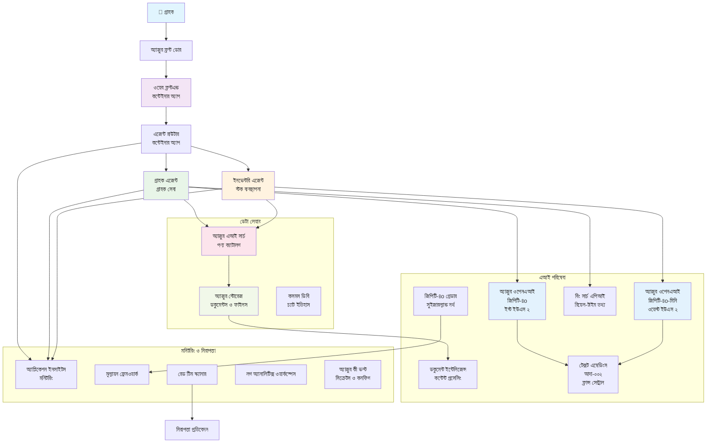

# মাল্টি-এজেন্ট কাস্টমার সাপোর্ট সলিউশন - রিটেইলার সিনারিও

**অধ্যায় ৫: মাল্টি-এজেন্ট এআই সলিউশন**
- **📚 কোর্স হোম**: [AZD ফর বিগিনারস](../README.md)
- **📖 বর্তমান অধ্যায়**: [অধ্যায় ৫: মাল্টি-এজেন্ট এআই সলিউশন](../README.md#-chapter-5-multi-agent-ai-solutions-advanced)
- **⬅️ পূর্বশর্ত**: [অধ্যায় ২: এআই-ফার্স্ট ডেভেলপমেন্ট](../docs/ai-foundry/azure-ai-foundry-integration.md)
- **➡️ পরবর্তী অধ্যায়**: [অধ্যায় ৬: প্রি-ডিপ্লয়মেন্ট ভ্যালিডেশন](../docs/pre-deployment/capacity-planning.md)
- **🚀 এআরএম টেমপ্লেটস**: [ডিপ্লয়মেন্ট প্যাকেজ](retail-multiagent-arm-template/README.md)

> **⚠️ আর্কিটেকচার গাইড - কার্যকরী ইমপ্লিমেন্টেশন নয়**  
> এই ডকুমেন্টটি একটি **সম্পূর্ণ আর্কিটেকচার ব্লুপ্রিন্ট** প্রদান করে মাল্টি-এজেন্ট সিস্টেম তৈরির জন্য।  
> **যা বিদ্যমান:** ইনফ্রাস্ট্রাকচার ডিপ্লয়মেন্টের জন্য এআরএম টেমপ্লেট (Azure OpenAI, AI Search, Container Apps, ইত্যাদি)  
> **যা তৈরি করতে হবে:** এজেন্ট কোড, রাউটিং লজিক, ফ্রন্টএন্ড UI, ডেটা পাইপলাইন (প্রায় ৮০-১২০ ঘণ্টা)  
>  
> **এটি ব্যবহার করুন:**
> - ✅ আপনার নিজস্ব মাল্টি-এজেন্ট প্রজেক্টের জন্য আর্কিটেকচার রেফারেন্স হিসেবে
> - ✅ মাল্টি-এজেন্ট ডিজাইন প্যাটার্ন শেখার গাইড হিসেবে
> - ✅ Azure রিসোর্স ডিপ্লয় করার জন্য ইনফ্রাস্ট্রাকচার টেমপ্লেট হিসেবে
> - ❌ প্রস্তুত-চালানোর অ্যাপ্লিকেশন নয় (উল্লেখযোগ্য ডেভেলপমেন্ট প্রয়োজন)

## ওভারভিউ

**শিক্ষার লক্ষ্য:** একটি প্রোডাকশন-রেডি মাল্টি-এজেন্ট কাস্টমার সাপোর্ট চ্যাটবট তৈরির জন্য আর্কিটেকচার, ডিজাইন সিদ্ধান্ত এবং ইমপ্লিমেন্টেশন পদ্ধতি বোঝা। এই চ্যাটবটের উন্নত এআই ক্ষমতা থাকবে, যেমন ইনভেন্টরি ম্যানেজমেন্ট, ডকুমেন্ট প্রসেসিং এবং বুদ্ধিমান কাস্টমার ইন্টারঅ্যাকশন।

**সময় প্রয়োজন:** পড়া + বোঝা (২-৩ ঘণ্টা) | সম্পূর্ণ ইমপ্লিমেন্টেশন তৈরি (৮০-১২০ ঘণ্টা)

**আপনি যা শিখবেন:**
- মাল্টি-এজেন্ট আর্কিটেকচার প্যাটার্ন এবং ডিজাইন নীতিমালা
- মাল্টি-রিজিওন Azure OpenAI ডিপ্লয়মেন্ট কৌশল
- RAG (Retrieval-Augmented Generation) সহ AI Search ইন্টিগ্রেশন
- এজেন্ট ইভালুয়েশন এবং সিকিউরিটি টেস্টিং ফ্রেমওয়ার্ক
- প্রোডাকশন ডিপ্লয়মেন্ট বিবেচনা এবং খরচ অপ্টিমাইজেশন

## আর্কিটেকচার লক্ষ্য

**শিক্ষামূলক ফোকাস:** এই আর্কিটেকচার মাল্টি-এজেন্ট সিস্টেমের জন্য এন্টারপ্রাইজ প্যাটার্ন প্রদর্শন করে।

### সিস্টেমের প্রয়োজনীয়তা (আপনার ইমপ্লিমেন্টেশনের জন্য)

একটি প্রোডাকশন কাস্টমার সাপোর্ট সলিউশনের জন্য প্রয়োজন:
- **বিভিন্ন কাস্টমার প্রয়োজনের জন্য একাধিক বিশেষায়িত এজেন্ট** (কাস্টমার সার্ভিস + ইনভেন্টরি ম্যানেজমেন্ট)
- **মাল্টি-মডেল ডিপ্লয়মেন্ট** যথাযথ ক্যাপাসিটি প্ল্যানিং সহ (GPT-4o, GPT-4o-mini, এমবেডিংস বিভিন্ন অঞ্চলে)
- **ডায়নামিক ডেটা ইন্টিগ্রেশন** AI Search এবং ফাইল আপলোডের সাথে (ভেক্টর সার্চ + ডকুমেন্ট প্রসেসিং)
- **সম্পূর্ণ মনিটরিং** এবং ইভালুয়েশন ক্ষমতা (Application Insights + কাস্টম মেট্রিকস)
- **প্রোডাকশন-গ্রেড সিকিউরিটি** রেড টিমিং ভ্যালিডেশন সহ (ভালনারেবিলিটি স্ক্যানিং + এজেন্ট ইভালুয়েশন)

### এই গাইড যা প্রদান করে

✅ **আর্কিটেকচার প্যাটার্ন** - স্কেলযোগ্য মাল্টি-এজেন্ট সিস্টেমের জন্য প্রমাণিত ডিজাইন  
✅ **ইনফ্রাস্ট্রাকচার টেমপ্লেটস** - Azure সার্ভিস ডিপ্লয় করার জন্য এআরএম টেমপ্লেট  
✅ **কোড উদাহরণ** - মূল উপাদানের জন্য রেফারেন্স ইমপ্লিমেন্টেশন  
✅ **কনফিগারেশন নির্দেশিকা** - ধাপে ধাপে সেটআপ নির্দেশনা  
✅ **সেরা অনুশীলন** - সিকিউরিটি, মনিটরিং, খরচ অপ্টিমাইজেশন কৌশল  

❌ **অন্তর্ভুক্ত নয়** - সম্পূর্ণ কার্যকরী অ্যাপ্লিকেশন (ডেভেলপমেন্ট প্রচেষ্টা প্রয়োজন)

## 🗺️ ইমপ্লিমেন্টেশন রোডম্যাপ

### ধাপ ১: আর্কিটেকচার অধ্যয়ন (২-৩ ঘণ্টা) - এখানে শুরু করুন

**লক্ষ্য:** সিস্টেম ডিজাইন এবং উপাদান ইন্টারঅ্যাকশন বোঝা

- [ ] এই সম্পূর্ণ ডকুমেন্ট পড়ুন
- [ ] আর্কিটেকচার ডায়াগ্রাম এবং উপাদান সম্পর্ক পর্যালোচনা করুন
- [ ] মাল্টি-এজেন্ট প্যাটার্ন এবং ডিজাইন সিদ্ধান্ত বোঝা
- [ ] এজেন্ট টুল এবং রাউটিংয়ের জন্য কোড উদাহরণ অধ্যয়ন করুন
- [ ] খরচ অনুমান এবং ক্যাপাসিটি প্ল্যানিং নির্দেশিকা পর্যালোচনা করুন

**ফলাফল:** আপনি যা তৈরি করতে হবে তার একটি স্পষ্ট ধারণা

### ধাপ ২: ইনফ্রাস্ট্রাকচার ডিপ্লয় করুন (৩০-৪৫ মিনিট)

**লক্ষ্য:** এআরএম টেমপ্লেট ব্যবহার করে Azure রিসোর্স প্রভিশন করা

```bash
cd retail-multiagent-arm-template
./deploy.sh -g myResourceGroup -m standard
```

**যা ডিপ্লয় হয়:**
- ✅ Azure OpenAI (৩ অঞ্চল: GPT-4o, GPT-4o-mini, এমবেডিংস)
- ✅ AI Search সার্ভিস (খালি, ইনডেক্স কনফিগারেশন প্রয়োজন)
- ✅ Container Apps পরিবেশ (প্লেসহোল্ডার ইমেজ)
- ✅ Storage accounts, Cosmos DB, Key Vault
- ✅ Application Insights মনিটরিং

**যা অনুপস্থিত:**
- ❌ এজেন্ট ইমপ্লিমেন্টেশন কোড
- ❌ রাউটিং লজিক
- ❌ ফ্রন্টএন্ড UI
- ❌ সার্চ ইনডেক্স স্কিমা
- ❌ ডেটা পাইপলাইন

### ধাপ ৩: অ্যাপ্লিকেশন তৈরি করুন (৮০-১২০ ঘণ্টা)

**লক্ষ্য:** এই আর্কিটেকচারের উপর ভিত্তি করে মাল্টি-এজেন্ট সিস্টেম ইমপ্লিমেন্ট করা

1. **এজেন্ট ইমপ্লিমেন্টেশন** (৩০-৪০ ঘণ্টা)
   - বেস এজেন্ট ক্লাস এবং ইন্টারফেস
   - GPT-4o সহ কাস্টমার সার্ভিস এজেন্ট
   - GPT-4o-mini সহ ইনভেন্টরি এজেন্ট
   - টুল ইন্টিগ্রেশন (AI Search, Bing, ফাইল প্রসেসিং)

2. **রাউটিং সার্ভিস** (১২-১৬ ঘণ্টা)
   - রিকোয়েস্ট ক্লাসিফিকেশন লজিক
   - এজেন্ট নির্বাচন এবং অর্কেস্ট্রেশন
   - FastAPI/Express ব্যাকএন্ড

3. **ফ্রন্টএন্ড ডেভেলপমেন্ট** (২০-৩০ ঘণ্টা)
   - চ্যাট ইন্টারফেস UI
   - ফাইল আপলোড ফাংশনালিটি
   - রেসপন্স রেন্ডারিং

4. **ডেটা পাইপলাইন** (৮-১২ ঘণ্টা)
   - AI Search ইনডেক্স তৈরি
   - Document Intelligence সহ ডকুমেন্ট প্রসেসিং
   - এমবেডিং জেনারেশন এবং ইনডেক্সিং

5. **মনিটরিং এবং ইভালুয়েশন** (১০-১৫ ঘণ্টা)
   - কাস্টম টেলিমেট্রি ইমপ্লিমেন্টেশন
   - এজেন্ট ইভালুয়েশন ফ্রেমওয়ার্ক
   - রেড টিম সিকিউরিটি স্ক্যানার

### ধাপ ৪: ডিপ্লয় এবং টেস্ট করুন (৮-১২ ঘণ্টা)

- সমস্ত সার্ভিসের জন্য Docker ইমেজ তৈরি করুন
- Azure Container Registry-তে পুশ করুন
- Container Apps-এ রিয়েল ইমেজ আপডেট করুন
- এনভায়রনমেন্ট ভ্যারিয়েবল এবং সিক্রেট কনফিগার করুন
- ইভালুয়েশন টেস্ট স্যুট চালান
- সিকিউরিটি স্ক্যানিং সম্পন্ন করুন

**মোট আনুমানিক প্রচেষ্টা:** অভিজ্ঞ ডেভেলপারদের জন্য ৮০-১২০ ঘণ্টা

## সলিউশন আর্কিটেকচার

### আর্কিটেকচার ডায়াগ্রাম


### উপাদান ওভারভিউ

| উপাদান | উদ্দেশ্য | প্রযুক্তি | অঞ্চল |
|-----------|---------|------------|---------|
| **ওয়েব ফ্রন্টএন্ড** | কাস্টমার ইন্টারঅ্যাকশনের জন্য ইউজার ইন্টারফেস | Container Apps | প্রাইমারি অঞ্চল |
| **এজেন্ট রাউটার** | সঠিক এজেন্টে রিকোয়েস্ট রাউট করে | Container Apps | প্রাইমারি অঞ্চল |
| **কাস্টমার এজেন্ট** | কাস্টমার সার্ভিস প্রশ্ন পরিচালনা করে | Container Apps + GPT-4o | প্রাইমারি অঞ্চল |
| **ইনভেন্টরি এজেন্ট** | স্টক এবং ফিলফিলমেন্ট পরিচালনা করে | Container Apps + GPT-4o-mini | প্রাইমারি অঞ্চল |
| **Azure OpenAI** | এজেন্টের জন্য LLM ইনফারেন্স | Cognitive Services | মাল্টি-রিজিওন |
| **AI Search** | ভেক্টর সার্চ এবং RAG | AI Search সার্ভিস | প্রাইমারি অঞ্চল |
| **Storage Account** | ফাইল আপলোড এবং ডকুমেন্ট | Blob Storage | প্রাইমারি অঞ্চল |
| **Application Insights** | মনিটরিং এবং টেলিমেট্রি | Monitor | প্রাইমারি অঞ্চল |
| **Grader Model** | এজেন্ট ইভালুয়েশন সিস্টেম | Azure OpenAI | সেকেন্ডারি অঞ্চল |

## 📁 প্রজেক্ট স্ট্রাকচার

> **📍 স্ট্যাটাস লেজেন্ড:**  
> ✅ = রিপোজিটরিতে বিদ্যমান  
> 📝 = রেফারেন্স ইমপ্লিমেন্টেশন (এই ডকুমেন্টে কোড উদাহরণ)  
> 🔨 = আপনাকে এটি তৈরি করতে হবে

```
retail-multiagent-solution/              🔨 Your project directory
├── .azure/                              🔨 Azure environment configs
│   ├── config.json                      🔨 Global config
│   └── env/
│       ├── .env.development             🔨 Dev environment
│       ├── .env.staging                 🔨 Staging environment
│       └── .env.production              🔨 Production environment
│
├── azure.yaml                          🔨 AZD main configuration
├── azure.parameters.json               🔨 Deployment parameters
├── README.md                           🔨 Solution documentation
│
├── infra/                              🔨 Infrastructure as Code (you create)
│   ├── main.bicep                      🔨 Main Bicep template (optional, ARM exists)
│   ├── main.parameters.json            🔨 Parameters file
│   ├── modules/                        📝 Bicep modules (reference examples below)
│   │   ├── ai-services.bicep           📝 Azure OpenAI deployments
│   │   ├── search.bicep                📝 AI Search configuration
│   │   ├── storage.bicep               📝 Storage accounts
│   │   ├── container-apps.bicep        📝 Container Apps environment
│   │   ├── monitoring.bicep            📝 Application Insights
│   │   ├── security.bicep              📝 Key Vault and RBAC
│   │   └── networking.bicep            📝 Virtual networks and DNS
│   ├── arm-template/                   ✅ ARM template version (EXISTS)
│   │   ├── azuredeploy.json            ✅ ARM main template (retail-multiagent-arm-template/)
│   │   └── azuredeploy.parameters.json ✅ ARM parameters
│   └── scripts/                        ✅/🔨 Deployment scripts
│       ├── deploy.sh                   ✅ Main deployment script (EXISTS)
│       ├── setup-data.sh               🔨 Data setup script (you create)
│       └── configure-rbac.sh           🔨 RBAC configuration (you create)
│
├── src/                                🔨 Application source code (YOU BUILD THIS)
│   ├── agents/                         📝 Agent implementations (examples below)
│   │   ├── base/                       🔨 Base agent classes
│   │   │   ├── agent.py                🔨 Abstract agent class
│   │   │   └── tools.py                🔨 Tool interfaces
│   │   ├── customer/                   🔨 Customer service agent
│   │   │   ├── agent.py                📝 Customer agent implementation (see below)
│   │   │   ├── prompts.py              🔨 System prompts
│   │   │   └── tools/                  🔨 Agent-specific tools
│   │   │       ├── search_tool.py      📝 AI Search integration (example below)
│   │   │       ├── bing_tool.py        📝 Bing Search integration (example below)
│   │   │       └── file_tool.py        🔨 File processing tool
│   │   └── inventory/                  🔨 Inventory management agent
│   │       ├── agent.py                🔨 Inventory agent implementation
│   │       ├── prompts.py              🔨 System prompts
│   │       └── tools/                  🔨 Agent-specific tools
│   │           ├── inventory_search.py 🔨 Inventory search tool
│   │           └── database_tool.py    🔨 Database query tool
│   │
│   ├── router/                         🔨 Agent routing service (you build)
│   │   ├── main.py                     🔨 FastAPI router application
│   │   ├── routing_logic.py            🔨 Request routing logic
│   │   └── middleware.py               🔨 Authentication & logging
│   │
│   ├── frontend/                       🔨 Web user interface (you build)
│   │   ├── Dockerfile                  🔨 Container configuration
│   │   ├── package.json                🔨 Node.js dependencies
│   │   ├── src/                        🔨 React/Vue source code
│   │   │   ├── components/             🔨 UI components
│   │   │   ├── pages/                  🔨 Application pages
│   │   │   ├── services/               🔨 API services
│   │   │   └── styles/                 🔨 CSS and themes
│   │   └── public/                     🔨 Static assets
│   │
│   ├── shared/                         🔨 Shared utilities (you build)
│   │   ├── config.py                   🔨 Configuration management
│   │   ├── telemetry.py                📝 Telemetry utilities (example below)
│   │   ├── security.py                 🔨 Security utilities
│   │   └── models.py                   🔨 Data models
│   │
│   └── evaluation/                     🔨 Evaluation and testing (you build)
│       ├── evaluator.py                📝 Agent evaluator (example below)
│       ├── red_team_scanner.py         📝 Security scanner (example below)
│       ├── test_cases.json             📝 Evaluation test cases (example below)
│       └── reports/                    🔨 Generated reports
│
├── data/                               🔨 Data and configuration (you create)
│   ├── search-schema.json              📝 AI Search index schema (example below)
│   ├── initial-docs/                   🔨 Initial document corpus
│   │   ├── product-manuals/            🔨 Product documentation (your data)
│   │   ├── policies/                   🔨 Company policies (your data)
│   │   └── faqs/                       🔨 Frequently asked questions (your data)
│   ├── fine-tuning/                    🔨 Fine-tuning datasets (optional)
│   │   ├── training.jsonl              🔨 Training data
│   │   └── validation.jsonl            🔨 Validation data
│   └── evaluation/                     🔨 Evaluation datasets
│       ├── test-conversations.json     📝 Test conversation data (example below)
│       └── ground-truth.json           🔨 Expected responses
│
├── scripts/                            # Utility scripts
│   ├── setup/                          # Setup scripts
│   │   ├── bootstrap.sh                # Initial environment setup
│   │   ├── install-dependencies.sh     # Install required tools
│   │   └── configure-env.sh            # Environment configuration
│   ├── data-management/                # Data management scripts
│   │   ├── upload-documents.py         # Document upload utility
│   │   ├── create-search-index.py      # Search index creation
│   │   └── sync-data.py                # Data synchronization
│   ├── deployment/                     # Deployment automation
│   │   ├── deploy-agents.sh            # Agent deployment
│   │   ├── update-frontend.sh          # Frontend updates
│   │   └── rollback.sh                 # Rollback procedures
│   └── monitoring/                     # Monitoring scripts
│       ├── health-check.py             # Health monitoring
│       ├── performance-test.py         # Performance testing
│       └── security-scan.py            # Security scanning
│
├── tests/                              # Test suites
│   ├── unit/                           # Unit tests
│   │   ├── test_agents.py              # Agent unit tests
│   │   ├── test_router.py              # Router unit tests
│   │   └── test_tools.py               # Tool unit tests
│   ├── integration/                    # Integration tests
│   │   ├── test_end_to_end.py          # E2E test scenarios
│   │   └── test_api.py                 # API integration tests
│   └── load/                           # Load testing
│       ├── load_test_config.yaml       # Load test configuration
│       └── scenarios/                  # Load test scenarios
│
├── docs/                               # Documentation
│   ├── architecture.md                 # Architecture documentation
│   ├── deployment-guide.md             # Deployment instructions
│   ├── agent-configuration.md          # Agent setup guide
│   ├── troubleshooting.md              # Troubleshooting guide
│   └── api/                            # API documentation
│       ├── agent-api.md                # Agent API reference
│       └── router-api.md               # Router API reference
│
├── hooks/                              # AZD lifecycle hooks
│   ├── preprovision.sh                 # Pre-provisioning tasks
│   ├── postprovision.sh                # Post-provisioning setup
│   ├── prepackage.sh                   # Pre-packaging tasks
│   └── postdeploy.sh                   # Post-deployment validation
│
└── .github/                            # GitHub workflows
    └── workflows/
        ├── ci-cd.yml                   # CI/CD pipeline
        ├── security-scan.yml           # Security scanning
        └── performance-test.yml        # Performance testing
```

---

## 🚀 দ্রুত শুরু: আপনি এখনই কী করতে পারেন

### অপশন ১: শুধুমাত্র ইনফ্রাস্ট্রাকচার ডিপ্লয় করুন (৩০ মিনিট)

**আপনি যা পাবেন:** সমস্ত Azure সার্ভিস প্রভিশন করা এবং ডেভেলপমেন্টের জন্য প্রস্তুত

```bash
# রিপোজিটরি ক্লোন করুন
git clone https://github.com/microsoft/AZD-for-beginners.git
cd AZD-for-beginners/examples/retail-multiagent-arm-template

# অবকাঠামো স্থাপন করুন
./deploy.sh -g myResourceGroup -m standard

# স্থাপনা যাচাই করুন
az resource list --resource-group myResourceGroup --output table
```

**প্রত্যাশিত ফলাফল:**
- ✅ Azure OpenAI সার্ভিস ডিপ্লয় (৩ অঞ্চল)
- ✅ AI Search সার্ভিস তৈরি (খালি)
- ✅ Container Apps পরিবেশ প্রস্তুত
- ✅ Storage, Cosmos DB, Key Vault কনফিগার করা
- ❌ কার্যকরী এজেন্ট নেই (শুধুমাত্র ইনফ্রাস্ট্রাকচার)

### অপশন ২: আর্কিটেকচার অধ্যয়ন করুন (২-৩ ঘণ্টা)

**আপনি যা পাবেন:** মাল্টি-এজেন্ট প্যাটার্নের গভীর ধারণা

1. এই সম্পূর্ণ ডকুমেন্ট পড়ুন
2. প্রতিটি উপাদানের জন্য কোড উদাহরণ পর্যালোচনা করুন
3. ডিজাইন সিদ্ধান্ত এবং ট্রেড-অফ বোঝা
4. খরচ অপ্টিমাইজেশন কৌশল অধ্যয়ন করুন
5. আপনার ইমপ্লিমেন্টেশন পদ্ধতি পরিকল্পনা করুন

**প্রত্যাশিত ফলাফল:**
- ✅ সিস্টেম আর্কিটেকচারের স্পষ্ট মানসিক মডেল
- ✅ প্রয়োজনীয় উপাদান বোঝা
- ✅ বাস্তবসম্মত প্রচেষ্টা অনুমান
- ✅ ইমপ্লিমেন্টেশন পরিকল্পনা

### অপশন ৩: সম্পূর্ণ সিস্টেম তৈরি করুন (৮০-১২০ ঘণ্টা)

**আপনি যা পাবেন:** প্রোডাকশন-রেডি মাল্টি-এজেন্ট সলিউশন

1. **ধাপ ১:** ইনফ্রাস্ট্রাকচার ডিপ্লয় করুন (উপরে সম্পন্ন)
2. **ধাপ ২:** নিচের কোড উদাহরণ ব্যবহার করে এজেন্ট ইমপ্লিমেন্ট করুন (৩০-৪০ ঘণ্টা)
3. **ধাপ ৩:** রাউটিং সার্ভিস তৈরি করুন (১২-১৬ ঘণ্টা)
4. **ধাপ ৪:** ফ্রন্টএন্ড UI তৈরি করুন (২০-৩০ ঘণ্টা)
5. **ধাপ ৫:** ডেটা পাইপলাইন কনফিগার করুন (৮-১২ ঘণ্টা)
6. **ধাপ ৬:** মনিটরিং এবং ইভালুয়েশন যোগ করুন (১০-১৫ ঘণ্টা)

**প্রত্যাশিত ফলাফল:**
- ✅ সম্পূর্ণ কার্যকরী মাল্টি-এজেন্ট সিস্টেম
- ✅ প্রোডাকশন-গ্রেড মনিটরিং
- ✅ সিকিউরিটি ভ্যালিডেশন
- ✅ খরচ-অপ্টিমাইজড ডিপ্লয়মেন্ট

---

## 📚 আর্কিটেকচার রেফারেন্স এবং ইমপ্লিমেন্টেশন গাইড

পরবর্তী অংশগুলো বিস্তারিত আর্কিটেকচার প্যাটার্ন, কনফিগারেশন উদাহরণ এবং রেফারেন্স কোড প্রদান করে যা আপনার ইমপ্লিমেন্টেশনকে গাইড করবে।
## ✅ প্রস্তুত-প্রস্তুত ARM টেমপ্লেট

> **✨ এটি বাস্তব এবং কার্যকর!**  
> উপরের ধারণাগত কোড উদাহরণগুলোর বিপরীতে, এই ARM টেমপ্লেটটি একটি **বাস্তব, কার্যকরী অবকাঠামো স্থাপন** যা এই রিপোজিটরিতে অন্তর্ভুক্ত।

### এই টেমপ্লেটটি কী করে

[`retail-multiagent-arm-template/`](../../../examples/retail-multiagent-arm-template) এ থাকা ARM টেমপ্লেটটি **মাল্টি-এজেন্ট সিস্টেমের জন্য প্রয়োজনীয় সমস্ত Azure অবকাঠামো** স্থাপন করে। এটি **একমাত্র প্রস্তুত-চালানোর উপাদান** - বাকি সবকিছু উন্নয়ন প্রয়োজন।

### ARM টেমপ্লেটে কী অন্তর্ভুক্ত

[`retail-multiagent-arm-template/`](../../../examples/retail-multiagent-arm-template) এ থাকা ARM টেমপ্লেটটি অন্তর্ভুক্ত:

#### **সম্পূর্ণ অবকাঠামো**
- ✅ **মাল্টি-রিজিওন Azure OpenAI** স্থাপন (GPT-4o, GPT-4o-mini, embeddings, grader)
- ✅ **Azure AI Search** ভেক্টর সার্চ ক্ষমতা সহ
- ✅ **Azure Storage** ডকুমেন্ট এবং আপলোড কন্টেইনার সহ
- ✅ **Container Apps Environment** অটো-স্কেলিং সহ
- ✅ **Agent Router & Frontend** কন্টেইনার অ্যাপস
- ✅ **Cosmos DB** চ্যাট ইতিহাস সংরক্ষণের জন্য
- ✅ **Application Insights** বিস্তৃত পর্যবেক্ষণের জন্য
- ✅ **Key Vault** নিরাপদ সিক্রেট ব্যবস্থাপনার জন্য
- ✅ **Document Intelligence** ফাইল প্রক্রিয়াকরণের জন্য
- ✅ **Bing Search API** রিয়েল-টাইম তথ্যের জন্য

#### **ডিপ্লয়মেন্ট মোড**
| মোড | ব্যবহার | রিসোর্স | আনুমানিক খরচ/মাস |
|------|----------|-----------|---------------------|
| **মিনিমাল** | উন্নয়ন, টেস্টিং | বেসিক SKUs, একক রিজিওন | $100-370 |
| **স্ট্যান্ডার্ড** | প্রোডাকশন, মাঝারি স্কেল | স্ট্যান্ডার্ড SKUs, মাল্টি-রিজিওন | $420-1,450 |
| **প্রিমিয়াম** | এন্টারপ্রাইজ, উচ্চ স্কেল | প্রিমিয়াম SKUs, HA সেটআপ | $1,150-3,500 |

### 🎯 দ্রুত ডিপ্লয়মেন্ট অপশন

#### অপশন ১: এক-ক্লিক Azure ডিপ্লয়মেন্ট

[](https://portal.azure.com/#create/Microsoft.Template/uri/https%3A%2F%2Fraw.githubusercontent.com%2Fmicrosoft%2Fazd-for-beginners%2Fmain%2Fexamples%2Fretail-multiagent-arm-template%2Fazuredeploy.json)

#### অপশন ২: Azure CLI ডিপ্লয়মেন্ট

```bash
# রিপোজিটরি ক্লোন করুন
git clone https://github.com/microsoft/azd-for-beginners.git
cd azd-for-beginners/examples/retail-multiagent-arm-template

# ডিপ্লয়মেন্ট স্ক্রিপ্ট কার্যকর করুন
chmod +x deploy.sh

# ডিফল্ট সেটিংস দিয়ে ডিপ্লয় করুন (স্ট্যান্ডার্ড মোড)
./deploy.sh -g myResourceGroup

# প্রিমিয়াম বৈশিষ্ট্য সহ প্রোডাকশনের জন্য ডিপ্লয় করুন
./deploy.sh -g myProdRG -e prod -m premium -l eastus2

# ডেভেলপমেন্টের জন্য মিনিমাল ভার্সন ডিপ্লয় করুন
./deploy.sh -g myDevRG -e dev -m minimal --no-multi-region
```

#### অপশন ৩: সরাসরি ARM টেমপ্লেট ডিপ্লয়মেন্ট

```bash
# রিসোর্স গ্রুপ তৈরি করুন
az group create --name myResourceGroup --location eastus2

# টেমপ্লেট সরাসরি ডিপ্লয় করুন
az deployment group create \
  --resource-group myResourceGroup \
  --template-file azuredeploy.json \
  --parameters azuredeploy.parameters.json \
  --parameters projectName=retail environmentName=prod
```

### টেমপ্লেট আউটপুট

সফল ডিপ্লয়মেন্টের পর, আপনি পাবেন:

```json
{
  "frontendUrl": "https://retail-frontend-abc123.azurecontainerapps.io",
  "routerUrl": "https://retail-router-abc123.azurecontainerapps.io",
  "openAiEndpointPrimary": "https://retail-openai-primary-abc123.openai.azure.com/",
  "searchServiceEndpoint": "https://retail-search-abc123.search.windows.net",
  "storageAccountName": "retailstorage123abc",
  "keyVaultName": "retail-kv-abc123",
  "applicationInsightsName": "retail-ai-abc123"
}
```

### 🔧 ডিপ্লয়মেন্ট পরবর্তী কনফিগারেশন

ARM টেমপ্লেট অবকাঠামো স্থাপন পরিচালনা করে। ডিপ্লয়মেন্টের পর:

1. **সার্চ ইনডেক্স কনফিগার করুন**:
   ```bash
   # প্রদত্ত অনুসন্ধান স্কিমা ব্যবহার করুন
   curl -X POST "${SEARCH_ENDPOINT}/indexes?api-version=2023-11-01" \
     -H "Content-Type: application/json" \
     -H "api-key: ${SEARCH_KEY}" \
     -d @../data/search-schema.json
   ```

2. **প্রাথমিক ডকুমেন্ট আপলোড করুন**:
   ```bash
   # পণ্য ম্যানুয়াল এবং জ্ঞানভিত্তিক আপলোড করুন
   az storage blob upload-batch \
     --destination documents \
     --source ../data/initial-docs \
     --account-name ${STORAGE_ACCOUNT}
   ```

3. **এজেন্ট কোড ডিপ্লয় করুন**:
   ```bash
   # প্রকৃত এজেন্ট অ্যাপ্লিকেশন তৈরি এবং স্থাপন করুন
   docker build -t myregistry.azurecr.io/agent-router:latest ./src/router
   az containerapp update \
     --name retail-router \
     --resource-group myResourceGroup \
     --image myregistry.azurecr.io/agent-router:latest
   ```

### 🎛️ কাস্টমাইজেশন অপশন

আপনার ডিপ্লয়মেন্ট কাস্টমাইজ করতে `azuredeploy.parameters.json` সম্পাদনা করুন:

```json
{
  "projectName": {"value": "mycompany"},
  "environmentName": {"value": "prod"},
  "deploymentMode": {"value": "premium"},
  "location": {"value": "eastus2"},
  "enableMultiRegion": {"value": true},
  "enableMonitoring": {"value": true},
  "enableSecurity": {"value": true}
}
```

### 📊 ডিপ্লয়মেন্ট বৈশিষ্ট্য

- ✅ **প্রি-রেকুইজিট যাচাই** (Azure CLI, কোটা, অনুমতি)
- ✅ **মাল্টি-রিজিওন উচ্চ প্রাপ্যতা** স্বয়ংক্রিয় ফেইলওভার সহ
- ✅ **বিস্তৃত পর্যবেক্ষণ** Application Insights এবং Log Analytics সহ
- ✅ **নিরাপত্তা সেরা অনুশীলন** Key Vault এবং RBAC সহ
- ✅ **খরচ অপ্টিমাইজেশন** কনফিগারযোগ্য ডিপ্লয়মেন্ট মোড সহ
- ✅ **স্বয়ংক্রিয় স্কেলিং** চাহিদার প্যাটার্ন অনুযায়ী
- ✅ **জিরো-ডাউনটাইম আপডেট** Container Apps রিভিশন সহ

### 🔍 পর্যবেক্ষণ এবং ব্যবস্থাপনা

ডিপ্লয় করার পর, আপনার সমাধান পর্যবেক্ষণ করুন:

- **Application Insights**: পারফরম্যান্স মেট্রিক, ডিপেনডেন্সি ট্র্যাকিং, এবং কাস্টম টেলিমেট্রি
- **Log Analytics**: সমস্ত উপাদান থেকে কেন্দ্রীভূত লগিং
- **Azure Monitor**: রিসোর্স স্বাস্থ্য এবং প্রাপ্যতা পর্যবেক্ষণ
- **Cost Management**: রিয়েল-টাইম খরচ ট্র্যাকিং এবং বাজেট অ্যালার্ট

---

## 📚 সম্পূর্ণ বাস্তবায়ন গাইড

এই দৃশ্যপট ডকুমেন্ট এবং ARM টেমপ্লেট একটি প্রোডাকশন-প্রস্তুত মাল্টি-এজেন্ট কাস্টমার সাপোর্ট সমাধান স্থাপনের জন্য প্রয়োজনীয় সবকিছু প্রদান করে। বাস্তবায়ন অন্তর্ভুক্ত:

✅ **আর্কিটেকচার ডিজাইন** - উপাদান সম্পর্ক সহ বিস্তৃত সিস্টেম ডিজাইন  
✅ **অবকাঠামো স্থাপন** - এক-ক্লিক ডিপ্লয়মেন্টের জন্য সম্পূর্ণ ARM টেমপ্লেট  
✅ **এজেন্ট কনফিগারেশন** - কাস্টমার এবং ইনভেন্টরি এজেন্টের বিস্তারিত সেটআপ  
✅ **মাল্টি-মডেল ডিপ্লয়মেন্ট** - রিজিওন জুড়ে কৌশলগত মডেল প্লেসমেন্ট  
✅ **সার্চ ইন্টিগ্রেশন** - ভেক্টর ক্ষমতা এবং ডেটা ইনডেক্সিং সহ AI সার্চ  
✅ **নিরাপত্তা বাস্তবায়ন** - রেড টিমিং, দুর্বলতা স্ক্যানিং, এবং নিরাপদ অনুশীলন  
✅ **পর্যবেক্ষণ ও মূল্যায়ন** - বিস্তৃত টেলিমেট্রি এবং এজেন্ট মূল্যায়ন ফ্রেমওয়ার্ক  
✅ **প্রোডাকশন প্রস্তুতি** - HA এবং ডিজাস্টার রিকভারি সহ এন্টারপ্রাইজ-গ্রেড ডিপ্লয়মেন্ট  
✅ **খরচ অপ্টিমাইজেশন** - বুদ্ধিমান রাউটিং এবং ব্যবহার-ভিত্তিক স্কেলিং  
✅ **সমস্যা সমাধান গাইড** - সাধারণ সমস্যাগুলো এবং সমাধান কৌশল

---

## 📊 সারাংশ: আপনি কী শিখলেন

### আর্কিটেকচার প্যাটার্ন কভার করা হয়েছে

✅ **মাল্টি-এজেন্ট সিস্টেম ডিজাইন** - বিশেষায়িত এজেন্ট (কাস্টমার + ইনভেন্টরি) নির্ধারিত মডেল সহ  
✅ **মাল্টি-রিজিওন ডিপ্লয়মেন্ট** - খরচ অপ্টিমাইজেশন এবং রিডান্ডেন্সির জন্য কৌশলগত মডেল প্লেসমেন্ট  
✅ **RAG আর্কিটেকচার** - ভেক্টর এমবেডিং সহ AI সার্চ ইন্টিগ্রেশন  
✅ **এজেন্ট মূল্যায়ন** - গুণমান মূল্যায়নের জন্য নির্ধারিত গ্রেডার মডেল  
✅ **নিরাপত্তা ফ্রেমওয়ার্ক** - রেড টিমিং এবং দুর্বলতা স্ক্যানিং প্যাটার্ন  
✅ **খরচ অপ্টিমাইজেশন** - মডেল রাউটিং এবং ক্যাপাসিটি প্ল্যানিং কৌশল  
✅ **প্রোডাকশন পর্যবেক্ষণ** - কাস্টম টেলিমেট্রি সহ Application Insights  

### এই ডকুমেন্ট কী প্রদান করে

| উপাদান | অবস্থা | কোথায় পাওয়া যাবে |
|-----------|--------|------------------|
| **অবকাঠামো টেমপ্লেট** | ✅ প্রস্তুত ডিপ্লয় | [`retail-multiagent-arm-template/`](../../../examples/retail-multiagent-arm-template) |
| **আর্কিটেকচার ডায়াগ্রাম** | ✅ সম্পূর্ণ | উপরের Mermaid ডায়াগ্রাম |
| **কোড উদাহরণ** | ✅ রেফারেন্স ইমপ্লিমেন্টেশন | এই ডকুমেন্ট জুড়ে |
| **কনফিগারেশন প্যাটার্ন** | ✅ বিস্তারিত নির্দেশনা | উপরের ১-১০ সেকশন |
| **এজেন্ট ইমপ্লিমেন্টেশন** | 🔨 আপনি এটি তৈরি করবেন | ~৪০ ঘণ্টা উন্নয়ন |
| **ফ্রন্টএন্ড UI** | 🔨 আপনি এটি তৈরি করবেন | ~২৫ ঘণ্টা উন্নয়ন |
| **ডেটা পাইপলাইন** | 🔨 আপনি এটি তৈরি করবেন | ~১০ ঘণ্টা উন্নয়ন |

### বাস্তবতা: কী আসলে বিদ্যমান

**রিপোজিটরিতে (এখনই প্রস্তুত):**
- ✅ ARM টেমপ্লেট যা ১৫+ Azure সার্ভিস ডিপ্লয় করে (azuredeploy.json)
- ✅ ডিপ্লয়মেন্ট স্ক্রিপ্ট যাচাই সহ (deploy.sh)
- ✅ প্যারামিটার কনফিগারেশন (azuredeploy.parameters.json)

**ডকুমেন্টে উল্লেখিত (আপনি তৈরি করবেন):**
- 🔨 এজেন্ট ইমপ্লিমেন্টেশন কোড (~৩০-৪০ ঘণ্টা)
- 🔨 রাউটিং সার্ভিস (~১২-১৬ ঘণ্টা)
- 🔨 ফ্রন্টএন্ড অ্যাপ্লিকেশন (~২০-৩০ ঘণ্টা)
- 🔨 ডেটা সেটআপ স্ক্রিপ্ট (~৮-১২ ঘণ্টা)
- 🔨 পর্যবেক্ষণ ফ্রেমওয়ার্ক (~১০-১৫ ঘণ্টা)

### আপনার পরবর্তী পদক্ষেপ

#### যদি আপনি অবকাঠামো ডিপ্লয় করতে চান (৩০ মিনিট)
```bash
cd retail-multiagent-arm-template
./deploy.sh -g myResourceGroup
```

#### যদি আপনি সম্পূর্ণ সিস্টেম তৈরি করতে চান (৮০-১২০ ঘণ্টা)
1. ✅ এই আর্কিটেকচার ডকুমেন্ট পড়ুন এবং বুঝুন (২-৩ ঘণ্টা)
2. ✅ ARM টেমপ্লেট ব্যবহার করে অবকাঠামো ডিপ্লয় করুন (৩০ মিনিট)
3. 🔨 রেফারেন্স কোড প্যাটার্ন ব্যবহার করে এজেন্ট তৈরি করুন (~৪০ ঘণ্টা)
4. 🔨 FastAPI/Express দিয়ে রাউটিং সার্ভিস তৈরি করুন (~১৫ ঘণ্টা)
5. 🔨 React/Vue দিয়ে ফ্রন্টএন্ড UI তৈরি করুন (~২৫ ঘণ্টা)
6. 🔨 ডেটা পাইপলাইন এবং সার্চ ইনডেক্স কনফিগার করুন (~১০ ঘণ্টা)
7. 🔨 পর্যবেক্ষণ এবং মূল্যায়ন যোগ করুন (~১৫ ঘণ্টা)
8. ✅ টেস্ট, নিরাপত্তা এবং অপ্টিমাইজ করুন (~১০ ঘণ্টা)

#### যদি আপনি মাল্টি-এজেন্ট প্যাটার্ন শিখতে চান (স্টাডি)
- 📖 আর্কিটেকচার ডায়াগ্রাম এবং উপাদান সম্পর্ক পর্যালোচনা করুন
- 📖 SearchTool, BingTool, AgentEvaluator এর কোড উদাহরণ অধ্যয়ন করুন
- 📖 মাল্টি-রিজিওন ডিপ্লয়মেন্ট কৌশল বুঝুন
- 📖 মূল্যায়ন এবং নিরাপত্তা ফ্রেমওয়ার্ক শিখুন
- 📖 আপনার নিজস্ব প্রকল্পে প্যাটার্ন প্রয়োগ করুন

### মূল বিষয়গুলো

1. **অবকাঠামো বনাম অ্যাপ্লিকেশন** - ARM টেমপ্লেট অবকাঠামো প্রদান করে; এজেন্ট তৈরি প্রয়োজন
2. **মাল্টি-রিজিওন কৌশল** - কৌশলগত মডেল প্লেসমেন্ট খরচ কমায় এবং নির্ভরযোগ্যতা বৃদ্ধি করে
3. **মূল্যায়ন ফ্রেমওয়ার্ক** - নির্ধারিত গ্রেডার মডেল ক্রমাগত গুণমান মূল্যায়ন সক্ষম করে
4. **নিরাপত্তা প্রথম** - রেড টিমিং এবং দুর্বলতা স্ক্যানিং প্রোডাকশনের জন্য অপরিহার্য
5. **খরচ অপ্টিমাইজেশন** - GPT-4o এবং GPT-4o-mini এর মধ্যে বুদ্ধিমান রাউটিং ৬০-৮০% সঞ্চয় করে

### আনুমানিক খরচ

| ডিপ্লয়মেন্ট মোড | অবকাঠামো/মাস | উন্নয়ন (এককালীন) | প্রথম মাসের মোট |
|-----------------|---------------------|------------------------|-------------------|
| **মিনিমাল** | $100-370 | $15K-25K (৮০-১২০ ঘণ্টা) | $15.1K-25.4K |
| **স্ট্যান্ডার্ড** | $420-1,450 | $15K-25K (একই প্রচেষ্টা) | $15.4K-26.5K |
| **প্রিমিয়াম** | $1,150-3,500 | $15K-25K (একই প্রচেষ্টা) | $16.2K-28.5K |

**নোট:** নতুন বাস্তবায়নের জন্য অবকাঠামো মোট খরচের <৫%। উন্নয়ন প্রচেষ্টা প্রধান বিনিয়োগ।

### সম্পর্কিত রিসোর্স

- 📚 [ARM টেমপ্লেট ডিপ্লয়মেন্ট গাইড](retail-multiagent-arm-template/README.md) - অবকাঠামো সেটআপ
- 📚 [Azure OpenAI সেরা অনুশীলন](https://learn.microsoft.com/azure/ai-services/openai/) - মডেল ডিপ্লয়মেন্ট
- 📚 [AI সার্চ ডকুমেন্টেশন](https://learn.microsoft.com/azure/search/) - ভেক্টর সার্চ কনফিগারেশন
- 📚 [কন্টেইনার অ্যাপস প্যাটার্ন](https://learn.microsoft.com/azure/container-apps/) - মাইক্রোসার্ভিস ডিপ্লয়মেন্ট
- 📚 [Application Insights](https://learn.microsoft.com/azure/azure-monitor/app/app-insights-overview) - পর্যবেক্ষণ সেটআপ

### প্রশ্ন বা সমস্যা?

- 🐛 [সমস্যা রিপোর্ট করুন](https://github.com/microsoft/AZD-for-beginners/issues) - টেমপ্লেট বাগ বা ডকুমেন্টেশন ত্রুটি
- 💬 [GitHub আলোচনা](https://github.com/microsoft/AZD-for-beginners/discussions) - আর্কিটেকচার প্রশ্ন
- 📖 [FAQ](../../resources/faq.md) - সাধারণ প্রশ্নের উত্তর
- 🔧 [সমস্যা সমাধান গাইড](../../docs/troubleshooting/common-issues.md) - ডিপ্লয়মেন্ট সমস্যা

---

**এই বিস্তৃত দৃশ্যপট একটি এন্টারপ্রাইজ-গ্রেড আর্কিটেকচার ব্লুপ্রিন্ট প্রদান করে মাল্টি-এজেন্ট AI সিস্টেমের জন্য, অবকাঠামো টেমপ্লেট, বাস্তবায়ন নির্দেশিকা, এবং Azure Developer CLI ব্যবহার করে উন্নত কাস্টমার সাপোর্ট সমাধান তৈরির জন্য প্রোডাকশন সেরা অনুশীলন সহ।**

---

<!-- CO-OP TRANSLATOR DISCLAIMER START -->
**অস্বীকৃতি**:  
এই নথিটি AI অনুবাদ পরিষেবা [Co-op Translator](https://github.com/Azure/co-op-translator) ব্যবহার করে অনুবাদ করা হয়েছে। আমরা যথাসাধ্য সঠিকতার জন্য চেষ্টা করি, তবে অনুগ্রহ করে মনে রাখবেন যে স্বয়ংক্রিয় অনুবাদে ত্রুটি বা অসঙ্গতি থাকতে পারে। মূল ভাষায় থাকা নথিটিকে প্রামাণিক উৎস হিসেবে বিবেচনা করা উচিত। গুরুত্বপূর্ণ তথ্যের জন্য, পেশাদার মানব অনুবাদ সুপারিশ করা হয়। এই অনুবাদ ব্যবহারের ফলে কোনো ভুল বোঝাবুঝি বা ভুল ব্যাখ্যা হলে আমরা দায়ী থাকব না।
<!-- CO-OP TRANSLATOR DISCLAIMER END -->