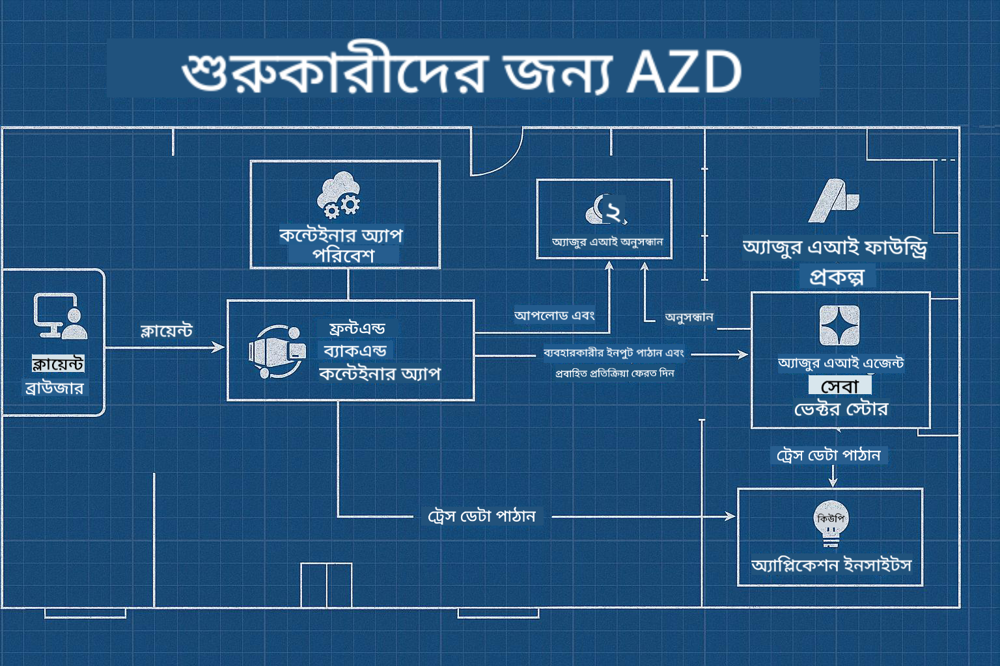

<!--
CO_OP_TRANSLATOR_METADATA:
{
  "original_hash": "245d24997bbcf2bae93bb2a503845d37",
  "translation_date": "2025-09-23T11:48:32+00:00",
  "source_file": "workshop/README.md",
  "language_code": "bn"
}
-->
# AZD for AI Developers Workshop

## AZD টেমপ্লেট

আপনার নির্দিষ্ট পরিস্থিতির জন্য একটি এন্টারপ্রাইজ-গ্রেড AI অ্যাপ্লিকেশন সমাধান তৈরি করা অনেকটা নিজের বাড়ি তৈরি করার মতো। আপনি নিজেই এটি ডিজাইন করতে পারেন, ইট-ইট করে তৈরি করতে পারেন এবং নিশ্চিত করতে পারেন যে এটি সমস্ত শাসন এবং উন্নয়ন নির্দেশিকা পূরণ করছে।

**অথবা ....**

আপনি একজন স্থপতির সাথে কাজ করতে পারেন যিনি আপনাকে একটি _ব্লুপ্রিন্ট_ দিতে পারেন একটি স্টার্টার হোমের জন্য, এবং তারপর আপনার প্রয়োজন অনুযায়ী এটি _কাস্টমাইজ_ করতে সাহায্য করতে পারেন। এটি আপনাকে **আপনার বাড়িকে** বিশেষ করে তোলার উপর মনোযোগ দিতে দেয়, এবং ভিতরের তার, পাইপলাইন এবং অন্যান্য নির্ভরশীলতাগুলি বিশেষজ্ঞদের দ্বারা পরিচালিত হয়।

**এটি [AI App Templates](https://ai.azure.com/templates) এর পেছনের ধারণা** - বিভিন্ন ধরণের AI অ্যাপ্লিকেশন "বাড়ি" তৈরির জন্য ব্লুপ্রিন্টের একটি সিরিজ, যা আপনার মূল প্রয়োজন এবং নির্ভরশীলতার উপর ভিত্তি করে।

## টেমপ্লেট কাস্টমাইজেশন

এই টেমপ্লেটগুলি [Azure AI Foundry](https://ai.azure.com) এর সাথে কাজ করার জন্য ডিজাইন করা হয়েছে। এই প্ল্যাটফর্মটিকে আপনার "বিল্ডিং কন্ট্রাক্টর" হিসেবে ভাবুন, যার কাছে সমস্ত সম্পদ, সরঞ্জাম এবং দক্ষতা রয়েছে যা আপনার কাজ সম্পন্ন করতে সাহায্য করবে!

আপনার যা করতে হবে তা হল [আপনার স্টার্টার টেমপ্লেট](https://learn.microsoft.com/en-us/azure/ai-foundry/how-to/develop/ai-template-get-started) নির্বাচন করা। উদাহরণস্বরূপ, আমরা _Get Started with AI Agents_ টেমপ্লেটের উপর ফোকাস করব, যা আপনাকে একটি "Agentic AI Home" তৈরি করতে সাহায্য করবে, যেখানে AI Search, Red Teaming, Evaluations, Tracing, Monitoring এবং আরও অনেক বৈশিষ্ট্য অন্তর্ভুক্ত থাকবে!



আপনার যা দরকার তা হল স্থপতির সাথে সময় বুক করা, যিনি আপনাকে কাস্টমাইজেশন প্রক্রিয়ার মাধ্যমে গাইড করবেন। [GitHub Copilot for Azure](https://learn.microsoft.com/en-us/azure/developer/github-copilot-azure/get-started) সেই গাইড হতে পারে। শুধু "চ্যাট করুন" এবং 

- আপনার টেমপ্লেটে Azure বৈশিষ্ট্য সম্পর্কে জানুন
- Azure সম্পদ ডিপ্লয় করুন
- আপনার ডিপ্লয়মেন্ট সম্পর্কে তথ্য পান
- সমস্যা নির্ণয় এবং সমাধান করুন!

এই ওয়ার্কশপে, আমরা বিদ্যমান টেমপ্লেটটি _ডিকন্সট্রাক্ট_ করতে শিখব (এটি কী প্রদান করে তা জানতে), তারপর এটি _কাস্টমাইজ_ করব (আমাদের প্রয়োজনীয়তা পূরণ করতে) - এক ধাপে এক ধাপে।

AI টেমপ্লেটগুলি **কাজ করে** - ওয়ার্কশপটি সম্পন্ন করে আপনি শিখবেন কীভাবে এটি **আপনার নিজের করে তুলবেন**

----

**ওয়ার্কশপ নেভিগেশন**
- **📚 কোর্স হোম**: [AZD For Beginners](../README.md)
- **📖 সম্পর্কিত অধ্যায়**: অন্তর্ভুক্ত [Chapter 1](../README.md#-chapter-1-foundation--quick-start), [Chapter 2](../README.md#-chapter-2-ai-first-development-recommended-for-ai-developers), এবং [Chapter 5](../README.md#-chapter-5-multi-agent-ai-solutions-advanced)
- **🛠️ হ্যান্ডস-অন ল্যাব**: [AI Workshop Lab](../docs/ai-foundry/ai-workshop-lab.md)
- **🚀 পরবর্তী ধাপ**: [Workshop Lab Modules](../../../workshop)

Azure Developer CLI (AZD) শিখতে এবং AI অ্যাপ্লিকেশন ডিপ্লয়মেন্টে ফোকাস করতে এই হ্যান্ডস-অন ওয়ার্কশপে আপনাকে স্বাগতম। এই ওয়ার্কশপটি আপনাকে AZD এর বেসিক থেকে প্রোডাকশন-রেডি AI সমাধান ডিপ্লয়মেন্ট পর্যন্ত নিয়ে যাবে।

## ওয়ার্কশপ ওভারভিউ

**সময়কাল:** ২-৩ ঘণ্টা  
**স্তর:** বিগিনার থেকে ইন্টারমিডিয়েট  
**প্রয়োজনীয়তা:** Azure, কমান্ড লাইন টুল এবং AI ধারণার মৌলিক জ্ঞান

### আপনি যা শিখবেন

- **AZD মৌলিক বিষয়**: AZD এর মাধ্যমে Infrastructure as Code বোঝা
- 🤖 **AI সার্ভিস ইন্টিগ্রেশন**: Azure OpenAI, AI Search এবং অন্যান্য AI সার্ভিস ডিপ্লয় করা
- **কন্টেইনার ডিপ্লয়মেন্ট**: AI অ্যাপ্লিকেশনের জন্য Azure Container Apps ব্যবহার করা
- **সিকিউরিটি বেস্ট প্র্যাকটিস**: Managed Identity এবং সুরক্ষিত কনফিগারেশন বাস্তবায়ন
- **মনিটরিং এবং অবজারভেবিলিটি**: AI ওয়ার্কলোডের জন্য Application Insights সেটআপ করা
- **প্রোডাকশন প্যাটার্নস**: এন্টারপ্রাইজ-রেডি ডিপ্লয়মেন্ট কৌশল

## ওয়ার্কশপ কাঠামো

### মডিউল ১: AZD ফাউন্ডেশনস (৩০ মিনিট)
- AZD ইনস্টল এবং কনফিগার করা
- AZD প্রজেক্ট স্ট্রাকচার বোঝা
- আপনার প্রথম AZD ডিপ্লয়মেন্ট
- **ল্যাব**: একটি সাধারণ ওয়েব অ্যাপ্লিকেশন ডিপ্লয় করুন

### মডিউল ২: Azure OpenAI ইন্টিগ্রেশন (৪৫ মিনিট)
- Azure OpenAI সম্পদ সেটআপ করা
- মডেল ডিপ্লয়মেন্ট কৌশল
- API অ্যাক্সেস এবং অথেনটিকেশন কনফিগার করা
- **ল্যাব**: GPT-4 সহ একটি চ্যাট অ্যাপ্লিকেশন ডিপ্লয় করুন

### মডিউল ৩: RAG অ্যাপ্লিকেশন (৪৫ মিনিট)
- Azure AI Search ইন্টিগ্রেশন
- Azure Document Intelligence দিয়ে ডকুমেন্ট প্রসেসিং
- ভেক্টর এমবেডিং এবং সেমান্টিক সার্চ
- **ল্যাব**: একটি ডকুমেন্ট Q&A সিস্টেম তৈরি করুন

### মডিউল ৪: প্রোডাকশন ডিপ্লয়মেন্ট (৩০ মিনিট)
- কন্টেইনার অ্যাপস কনফিগারেশন
- স্কেলিং এবং পারফরম্যান্স অপটিমাইজেশন
- মনিটরিং এবং লগিং
- **ল্যাব**: অবজারভেবিলিটি সহ প্রোডাকশনে ডিপ্লয় করুন

### মডিউল ৫: অ্যাডভান্সড প্যাটার্নস (১৫ মিনিট)
- মাল্টি-এনভায়রনমেন্ট ডিপ্লয়মেন্ট
- CI/CD ইন্টিগ্রেশন
- খরচ অপটিমাইজেশন কৌশল
- **সারাংশ**: প্রোডাকশন রেডিনেস চেকলিস্ট

## প্রয়োজনীয়তা

### প্রয়োজনীয় টুলস

ওয়ার্কশপের আগে এই টুলগুলি ইনস্টল করুন:

```bash
# Azure Developer CLI
curl -fsSL https://aka.ms/install-azd.sh | bash

# Azure CLI
curl -sL https://aka.ms/InstallAzureCLIDeb | sudo bash

# Git
sudo apt-get install git

# Docker
curl -fsSL https://get.docker.com -o get-docker.sh
sudo sh get-docker.sh

# Python 3.10+
sudo apt-get install python3.10 python3.10-venv python3-pip
```

### Azure অ্যাকাউন্ট সেটআপ

1. **Azure সাবস্ক্রিপশন**: [ফ্রি সাইন আপ করুন](https://azure.microsoft.com/free/)
2. **Azure OpenAI অ্যাক্সেস**: [অ্যাক্সেসের জন্য অনুরোধ করুন](https://aka.ms/oai/access)
3. **প্রয়োজনীয় অনুমতি**:
   - সাবস্ক্রিপশন বা রিসোর্স গ্রুপে Contributor রোল
   - User Access Administrator (RBAC অ্যাসাইনমেন্টের জন্য)

### প্রয়োজনীয়তা যাচাই করুন

আপনার সেটআপ যাচাই করতে এই স্ক্রিপ্টটি চালান:

```bash
#!/bin/bash
echo "Verifying workshop prerequisites..."

# Check AZD installation
if command -v azd &> /dev/null; then
    echo "✅ Azure Developer CLI: $(azd --version)"
else
    echo "❌ Azure Developer CLI not found"
fi

# Check Azure CLI
if command -v az &> /dev/null; then
    echo "✅ Azure CLI: $(az --version | head -n1)"
else
    echo "❌ Azure CLI not found"
fi

# Check Docker
if command -v docker &> /dev/null; then
    echo "✅ Docker: $(docker --version)"
else
    echo "❌ Docker not found"
fi

# Check Python
if command -v python3 &> /dev/null; then
    echo "✅ Python: $(python3 --version)"
else
    echo "❌ Python 3 not found"
fi

# Check Azure login
if az account show &> /dev/null; then
    echo "✅ Azure: Logged in as $(az account show --query user.name -o tsv)"
else
    echo "❌ Azure: Not logged in (run 'az login')"
fi

echo "Setup verification complete!"
```

## ওয়ার্কশপ উপকরণ

### ল্যাব অনুশীলন

প্রতিটি মডিউলে স্টার্টার কোড এবং ধাপে ধাপে নির্দেশনা সহ হ্যান্ডস-অন ল্যাব অন্তর্ভুক্ত রয়েছে:

- **[lab-1-azd-basics/](../../../workshop/lab-1-azd-basics)** - আপনার প্রথম AZD ডিপ্লয়মেন্ট
- **[lab-2-openai-chat/](../../../workshop/lab-2-openai-chat)** - Azure OpenAI সহ চ্যাট অ্যাপ্লিকেশন
- **[lab-3-rag-search/](../../../workshop/lab-3-rag-search)** - AI Search সহ RAG অ্যাপ্লিকেশন
- **[lab-4-production/](../../../workshop/lab-4-production)** - প্রোডাকশন ডিপ্লয়মেন্ট প্যাটার্নস
- **[lab-5-advanced/](../../../workshop/lab-5-advanced)** - অ্যাডভান্সড ডিপ্লয়মেন্ট পরিস্থিতি

### রেফারেন্স উপকরণ

- **[AI Foundry Integration Guide](../docs/ai-foundry/azure-ai-foundry-integration.md)** - বিস্তৃত ইন্টিগ্রেশন প্যাটার্নস
- **[AI Model Deployment Guide](../docs/ai-foundry/ai-model-deployment.md)** - মডেল ডিপ্লয়মেন্টের সেরা পদ্ধতি
- **[Production AI Practices](../docs/ai-foundry/production-ai-practices.md)** - এন্টারপ্রাইজ ডিপ্লয়মেন্ট প্যাটার্নস
- **[AI Troubleshooting Guide](../docs/troubleshooting/ai-troubleshooting.md)** - সাধারণ সমস্যা এবং সমাধান

### স্যাম্পল টেমপ্লেট

সাধারণ AI পরিস্থিতির জন্য দ্রুত শুরু টেমপ্লেট:

```
workshop/templates/
├── minimal-chat/          # Basic OpenAI chat app
├── rag-application/       # RAG with AI Search
├── multi-model/          # Multiple AI services
└── production-ready/     # Enterprise template
```

## শুরু করা

### অপশন ১: GitHub Codespaces (প্রস্তাবিত)

ওয়ার্কশপ শুরু করার দ্রুততম উপায়:

[](https://github.com/codespaces/new?hide_repo_select=true&ref=main&repo=YOUR_REPO_ID)

### অপশন ২: লোকাল ডেভেলপমেন্ট

1. **ওয়ার্কশপ রিপোজিটরি ক্লোন করুন:**
```bash
git clone https://github.com/YOUR_ORG/AZD-for-beginners.git
cd AZD-for-beginners/workshop
```

2. **Azure-এ লগইন করুন:**
```bash
az login
azd auth login
```

3. **ল্যাব ১ দিয়ে শুরু করুন:**
```bash
cd lab-1-azd-basics
cat README.md  # Follow the instructions
```

### অপশন ৩: ইনস্ট্রাক্টর-লেড ওয়ার্কশপ

যদি আপনি একটি ইনস্ট্রাক্টর-লেড সেশনে অংশগ্রহণ করেন:

- 🎥 **ওয়ার্কশপ রেকর্ডিং**: [অন-ডিমান্ড উপলব্ধ](https://aka.ms/azd-ai-workshop)
- 💬 **Discord কমিউনিটি**: [লাইভ সাপোর্টের জন্য যোগ দিন](https://aka.ms/foundry/discord)
- **ওয়ার্কশপ ফিডব্যাক**: [আপনার অভিজ্ঞতা শেয়ার করুন](https://aka.ms/azd-workshop-feedback)

## ওয়ার্কশপ টাইমলাইন

### সেলফ-পেসড লার্নিং (৩ ঘণ্টা)

```
⏰ 00:00 - 00:30  Module 1: AZD Foundations
⏰ 00:30 - 01:15  Module 2: Azure OpenAI Integration
⏰ 01:15 - 02:00  Module 3: RAG Applications
⏰ 02:00 - 02:30  Module 4: Production Deployment
⏰ 02:30 - 02:45  Module 5: Advanced Patterns
⏰ 02:45 - 03:00  Q&A and Next Steps
```

### ইনস্ট্রাক্টর-লেড সেশন (২.৫ ঘণ্টা)

```
⏰ 00:00 - 00:15  Welcome & Prerequisites Check
⏰ 00:15 - 00:40  Module 1: Live Demo + Lab
⏰ 00:40 - 01:20  Module 2: OpenAI Integration
⏰ 01:20 - 01:30  Break
⏰ 01:30 - 02:10  Module 3: RAG Applications
⏰ 02:10 - 02:30  Module 4: Production Patterns
⏰ 02:30 - 02:45  Module 5: Advanced Topics
⏰ 02:45 - 03:00  Q&A and Resources
```

## সফলতার মানদণ্ড

ওয়ার্কশপ শেষে আপনি সক্ষম হবেন:

✅ **AI অ্যাপ্লিকেশন ডিপ্লয় করুন** AZD টেমপ্লেট ব্যবহার করে  
✅ **Azure OpenAI কনফিগার করুন** সঠিক নিরাপত্তা সহ  
✅ **RAG অ্যাপ্লিকেশন তৈরি করুন** Azure AI Search ইন্টিগ্রেশন সহ  
✅ **প্রোডাকশন প্যাটার্নস বাস্তবায়ন করুন** এন্টারপ্রাইজ AI ওয়ার্কলোডের জন্য  
✅ **মনিটর এবং সমস্যা সমাধান করুন** AI অ্যাপ্লিকেশন ডিপ্লয়মেন্ট  
✅ **খরচ অপটিমাইজেশন কৌশল প্রয়োগ করুন** AI ওয়ার্কলোডের জন্য  

## কমিউনিটি এবং সাপোর্ট

### ওয়ার্কশপ চলাকালীন

- 🙋 **প্রশ্ন**: ওয়ার্কশপ চ্যাট ব্যবহার করুন বা হাত তুলুন
- 🐛 **সমস্যা**: [ট্রাবলশুটিং গাইড](../docs/troubleshooting/ai-troubleshooting.md) দেখুন
- **টিপস**: অন্যান্য অংশগ্রহণকারীদের সাথে আবিষ্কার শেয়ার করুন

### ওয়ার্কশপের পরে

- 💬 **Discord**: [Azure AI Foundry কমিউনিটি](https://aka.ms/foundry/discord)
- **GitHub Issues**: [টেমপ্লেট সমস্যাগুলি রিপোর্ট করুন](https://github.com/YOUR_ORG/AZD-for-beginners/issues)
- 📧 **ফিডব্যাক**: [ওয়ার্কশপ মূল্যায়ন ফর্ম](https://aka.ms/azd-workshop-feedback)

## পরবর্তী ধাপ

### শেখা চালিয়ে যান

1. **অ্যাডভান্সড পরিস্থিতি**: [মাল্টি-রিজিয়ন ডিপ্লয়মেন্ট](../docs/ai-foundry/production-ai-practices.md#multi-region-deployment) অন্বেষণ করুন
2. **CI/CD ইন্টিগ্রেশন**: [GitHub Actions ওয়ার্কফ্লো](../docs/deployment/github-actions.md) সেটআপ করুন
3. **কাস্টম টেমপ্লেট**: [AZD টেমপ্লেট তৈরি করুন](../docs/getting-started/custom-templates.md)

### আপনার প্রকল্পে প্রয়োগ করুন

1. **মূল্যায়ন**: আমাদের [রেডিনেস চেকলিস্ট](./production-readiness-checklist.md) ব্যবহার করুন
2. **টেমপ্লেট**: আমাদের [AI-নির্দিষ্ট টেমপ্লেট](../../../workshop/templates) দিয়ে শুরু করুন
3. **সাপোর্ট**: [Azure AI Foundry Discord](https://aka.ms/foundry/discord) এ যোগ দিন

### আপনার সফলতা শেয়ার করুন

- ⭐ **রিপোজিটরি স্টার দিন** যদি এই ওয়ার্কশপটি আপনাকে সাহায্য করে
- 🐦 **সোশ্যাল মিডিয়ায় শেয়ার করুন** #AzureDeveloperCLI #AzureAI দিয়ে
- 📝 **একটি ব্লগ পোস্ট লিখুন** আপনার AI ডিপ্লয়মেন্ট যাত্রা সম্পর্কে

---

## ওয়ার্কশপ ফিডব্যাক

আপনার ফিডব্যাক আমাদের ওয়ার্কশপ অভিজ্ঞতা উন্নত করতে সাহায্য করে:

| দিক | রেটিং (১-৫) | মন্তব্য |
|--------|--------------|----------|
| বিষয়বস্তুর গুণমান | ⭐⭐⭐⭐⭐ | |
| হ্যান্ডস-অন ল্যাব | ⭐⭐⭐⭐⭐ | |
| ডকুমেন্টেশন | ⭐⭐⭐⭐⭐ | |
| কঠিনতার স্তর | ⭐⭐⭐⭐⭐ | |
| সামগ্রিক অভিজ্ঞতা | ⭐⭐⭐⭐⭐ | |

**ফিডব্যাক জমা দিন**: [ওয়ার্কশপ মূল্যায়ন ফর্ম](https://aka.ms/azd-workshop-feedback)

---

**পূর্ববর্তী:** [AI Troubleshooting Guide](../docs/troubleshooting/ai-troubleshooting.md) | **পরবর্তী:** শুরু করুন [Lab 1: AZD Basics](../../../workshop/lab-1-azd-basics)

**AZD দিয়ে AI অ্যাপ্লিকেশন তৈরি করতে প্রস্তুত?**

[Lab 1: AZD Foundations →](./lab-1-azd-basics/README.md)

---

