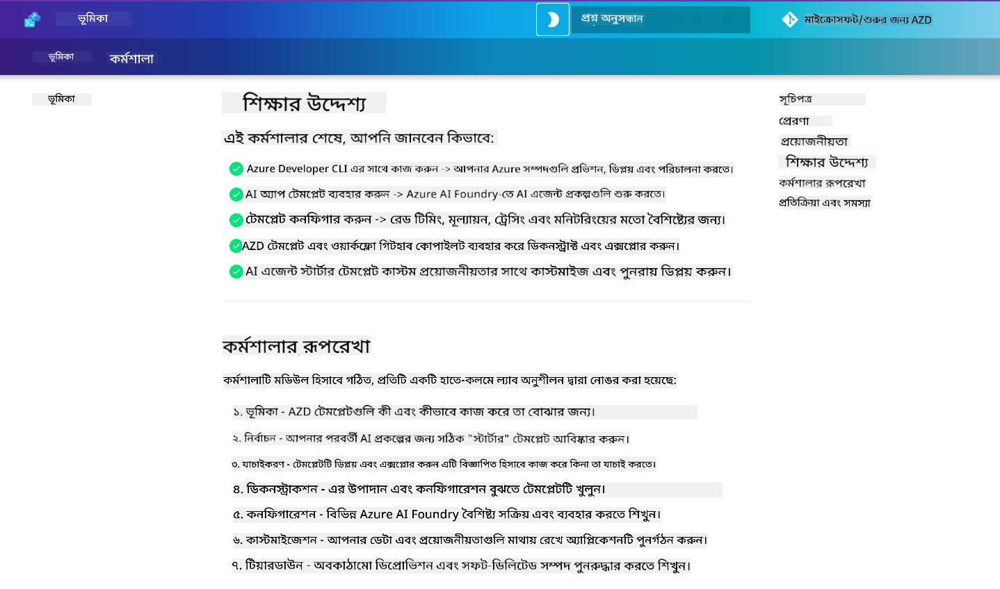

<!--
CO_OP_TRANSLATOR_METADATA:
{
  "original_hash": "9cc966416ab431c38b2ab863884b196c",
  "translation_date": "2025-09-24T13:21:35+00:00",
  "source_file": "workshop/README.md",
  "language_code": "bn"
}
-->
# AZD for AI Developers Workshop

Azure Developer CLI (AZD) ব্যবহার করে AI অ্যাপ্লিকেশন ডিপ্লয়মেন্ট শেখার জন্য হাতে-কলমে এই কর্মশালায় আপনাকে স্বাগতম। এই কর্মশালা আপনাকে AZD টেমপ্লেট সম্পর্কে তিনটি ধাপে ব্যবহারিক ধারণা অর্জনে সহায়তা করবে:

1. **অন্বেষণ** - আপনার জন্য সঠিক টেমপ্লেটটি খুঁজুন।
1. **ডিপ্লয়মেন্ট** - ডিপ্লয় করুন এবং নিশ্চিত করুন যে এটি কাজ করছে।
1. **কাস্টমাইজেশন** - এটি আপনার প্রয়োজন অনুযায়ী পরিবর্তন করুন এবং পুনরাবৃত্তি করুন!

এই কর্মশালার সময়, আপনাকে মূল ডেভেলপার টুল এবং ওয়ার্কফ্লো সম্পর্কেও পরিচিত করা হবে, যা আপনার সম্পূর্ণ ডেভেলপমেন্ট যাত্রাকে সহজতর করতে সাহায্য করবে।

<br/>

## ব্রাউজার-ভিত্তিক গাইড

কর্মশালার পাঠ্যাংশগুলো Markdown-এ লেখা। আপনি সেগুলো সরাসরি GitHub-এ দেখতে পারেন - অথবা নিচের স্ক্রিনশট অনুযায়ী ব্রাউজার-ভিত্তিক প্রিভিউ চালু করতে পারেন।



এই অপশনটি ব্যবহার করতে - রিপোজিটরিটি আপনার প্রোফাইলে ফর্ক করুন এবং GitHub Codespaces চালু করুন। একবার VS Code টার্মিনাল সক্রিয় হলে, এই কমান্ডটি টাইপ করুন:

```bash title="" linenums="0"
mkdocs serve > /dev/null 2>&1 &
```

কয়েক সেকেন্ডের মধ্যে একটি পপ-আপ ডায়ালগ দেখতে পাবেন। `Open in browser` অপশনটি নির্বাচন করুন। ওয়েব-ভিত্তিক গাইডটি এখন একটি নতুন ব্রাউজার ট্যাবে খুলবে। এই প্রিভিউয়ের কিছু সুবিধা:

1. **বিল্ট-ইন সার্চ** - দ্রুত কীওয়ার্ড বা পাঠ্যাংশ খুঁজুন।
1. **কপি আইকন** - কোডব্লকের উপর মাউস রাখলে এই অপশনটি দেখুন।
1. **থিম টগল** - ডার্ক এবং লাইট থিমের মধ্যে পরিবর্তন করুন।
1. **সহায়তা পান** - ফুটারে Discord আইকনে ক্লিক করে যোগ দিন!

<br/>

## কর্মশালার সংক্ষিপ্ত বিবরণ

**সময়কাল:** ৩-৪ ঘণ্টা  
**স্তর:** প্রাথমিক থেকে মধ্যম  
**প্রয়োজনীয়তা:** Azure, AI ধারণা, VS Code এবং কমান্ড-লাইন টুল সম্পর্কে পরিচিতি।

এটি একটি হাতে-কলমে কর্মশালা যেখানে আপনি কাজ করে শিখবেন। একবার আপনি অনুশীলনগুলো সম্পন্ন করলে, আমরা আপনাকে AZD For Beginners কারিকুলাম পর্যালোচনা করার পরামর্শ দিই, যাতে আপনি সিকিউরিটি এবং প্রোডাক্টিভিটি সেরা অনুশীলন সম্পর্কে আরও শিখতে পারেন।

| সময় | মডিউল  | লক্ষ্য |
|:---|:---|:---|
| ১৫ মিনিট | [ভূমিকা](docs/instructions/0-Introduction.md) | লক্ষ্যগুলো বুঝুন এবং প্রস্তুতি নিন |
| ৩০ মিনিট | [AI টেমপ্লেট নির্বাচন](docs/instructions/1-Select-AI-Template.md) | অপশনগুলো অন্বেষণ করুন এবং স্টার্টার বাছুন | 
| ৩০ মিনিট | [AI টেমপ্লেট যাচাই](docs/instructions/2-Validate-AI-Template.md) | ডিফল্ট সলিউশন Azure-এ ডিপ্লয় করুন |
| ৩০ মিনিট | [AI টেমপ্লেট বিশ্লেষণ](docs/instructions/3-Deconstruct-AI-Template.md) | গঠন এবং কনফিগারেশন অন্বেষণ করুন |
| ৩০ মিনিট | [AI টেমপ্লেট কনফিগার করুন](docs/instructions/4-Configure-AI-Template.md) | উপলব্ধ ফিচারগুলো সক্রিয় করুন এবং চেষ্টা করুন |
| ৩০ মিনিট | [AI টেমপ্লেট কাস্টমাইজ করুন](docs/instructions/5-Customize-AI-Template.md) | আপনার প্রয়োজন অনুযায়ী টেমপ্লেটটি পরিবর্তন করুন |
| ৩০ মিনিট | [ইনফ্রাস্ট্রাকচার সরিয়ে ফেলুন](docs/instructions/6-Teardown-Infrastructure.md) | রিসোর্সগুলো পরিষ্কার করুন এবং মুক্ত করুন |
| ১৫ মিনিট | [সমাপ্তি এবং পরবর্তী পদক্ষেপ](docs/instructions/7-Wrap-up.md) | শেখার রিসোর্স এবং কর্মশালা চ্যালেঞ্জ |

<br/>

## আপনি কী শিখবেন

AZD টেমপ্লেটকে একটি শেখার স্যান্ডবক্স হিসেবে ভাবুন, যেখানে Azure AI Foundry-তে এন্ড-টু-এন্ড ডেভেলপমেন্টের বিভিন্ন ক্ষমতা এবং টুল অন্বেষণ করা যায়। এই কর্মশালার শেষে, আপনি এই প্রসঙ্গে বিভিন্ন টুল এবং ধারণার জন্য একটি স্বজ্ঞাত ধারণা অর্জন করবেন।

| ধারণা  | লক্ষ্য |
|:---|:---|
| **Azure Developer CLI** | টুলের কমান্ড এবং ওয়ার্কফ্লো বুঝুন |
| **AZD টেমপ্লেট**| প্রজেক্টের গঠন এবং কনফিগারেশন বুঝুন |
| **Azure AI Agent**| Azure AI Foundry প্রজেক্ট প্রভিশন এবং ডিপ্লয় করুন |
| **Azure AI Search**| এজেন্টের সাথে কনটেক্সট ইঞ্জিনিয়ারিং সক্রিয় করুন |
| **অবজারভেবিলিটি**| ট্রেসিং, মনিটরিং এবং মূল্যায়ন অন্বেষণ করুন |
| **রেড টিমিং**| প্রতিকূল পরীক্ষণ এবং প্রতিরোধ অন্বেষণ করুন |

<br/>

## কর্মশালার গঠন

কর্মশালাটি টেমপ্লেট অন্বেষণ, ডিপ্লয়মেন্ট, বিশ্লেষণ এবং কাস্টমাইজেশনের একটি যাত্রায় সাজানো হয়েছে - যেখানে অফিসিয়াল [Getting Started with AI Agents](https://github.com/Azure-Samples/get-started-with-ai-agents) স্টার্টার টেমপ্লেটটি ভিত্তি হিসেবে ব্যবহার করা হয়েছে।

### [মডিউল ১: AI টেমপ্লেট নির্বাচন](docs/instructions/1-Select-AI-Template.md) (৩০ মিনিট)

- AI টেমপ্লেট কী?
- AI টেমপ্লেট কোথায় পাওয়া যায়?
- AI এজেন্ট তৈরি শুরু করার উপায় কী?
- **ল্যাব**: GitHub Codespaces দিয়ে দ্রুত শুরু করুন

### [মডিউল ২: AI টেমপ্লেট যাচাই](docs/instructions/2-Validate-AI-Template.md) (৩০ মিনিট)

- AI টেমপ্লেট আর্কিটেকচার কী?
- AZD ডেভেলপমেন্ট ওয়ার্কফ্লো কী?
- AZD ডেভেলপমেন্টে সাহায্য পাওয়ার উপায় কী?
- **ল্যাব**: AI এজেন্ট টেমপ্লেট ডিপ্লয় এবং যাচাই করুন

### [মডিউল ৩: AI টেমপ্লেট বিশ্লেষণ](docs/instructions/3-Deconstruct-AI-Template.md) (৩০ মিনিট)

- `.azure/` এ আপনার পরিবেশ অন্বেষণ করুন 
- `infra/` এ আপনার রিসোর্স সেটআপ অন্বেষণ করুন 
- `azure.yaml` এ আপনার AZD কনফিগারেশন অন্বেষণ করুন
- **ল্যাব**: পরিবেশ ভেরিয়েবল পরিবর্তন করুন এবং পুনরায় ডিপ্লয় করুন

### [মডিউল ৪: AI টেমপ্লেট কনফিগার করুন](docs/instructions/4-Configure-AI-Template.md) (৩০ মিনিট)
- অন্বেষণ করুন: Retrieval Augmented Generation
- অন্বেষণ করুন: এজেন্ট মূল্যায়ন এবং রেড টিমিং
- অন্বেষণ করুন: ট্রেসিং এবং মনিটরিং
- **ল্যাব**: AI এজেন্ট + অবজারভেবিলিটি অন্বেষণ করুন 

### [মডিউল ৫: AI টেমপ্লেট কাস্টমাইজ করুন](docs/instructions/5-Customize-AI-Template.md) (৩০ মিনিট)
- সংজ্ঞায়িত করুন: PRD (প্রোডাক্ট রিকোয়ারমেন্টস ডকুমেন্ট) সহ দৃশ্যকল্পের প্রয়োজনীয়তা
- কনফিগার করুন: AZD-এর জন্য পরিবেশ ভেরিয়েবল
- বাস্তবায়ন করুন: অতিরিক্ত কাজের জন্য লাইফসাইকেল হুক
- **ল্যাব**: আমার দৃশ্যকল্পের জন্য টেমপ্লেট কাস্টমাইজ করুন

### [মডিউল ৬: ইনফ্রাস্ট্রাকচার সরিয়ে ফেলুন](docs/instructions/6-Teardown-Infrastructure.md) (৩০ মিনিট)
- পুনরায় আলোচনা: AZD টেমপ্লেট কী?
- পুনরায় আলোচনা: Azure Developer CLI কেন ব্যবহার করবেন?
- পরবর্তী পদক্ষেপ: একটি ভিন্ন টেমপ্লেট চেষ্টা করুন!
- **ল্যাব**: ইনফ্রাস্ট্রাকচার ডিপ্রোভিশন এবং পরিষ্কার করুন

<br/>

## কর্মশালা চ্যালেঞ্জ

নিজেকে আরও চ্যালেঞ্জ করতে চান? এখানে কিছু প্রজেক্টের পরামর্শ দেওয়া হলো - অথবা আপনার আইডিয়া আমাদের সাথে শেয়ার করুন!!

| প্রজেক্ট | বিবরণ |
|:---|:---|
|১. **একটি জটিল AI টেমপ্লেট বিশ্লেষণ করুন** | আমরা যে ওয়ার্কফ্লো এবং টুলগুলো উল্লেখ করেছি তা ব্যবহার করে দেখুন আপনি একটি ভিন্ন AI সলিউশন টেমপ্লেট ডিপ্লয়, যাচাই এবং কাস্টমাইজ করতে পারেন কিনা। _আপনি কী শিখলেন?_|
|২. **আপনার দৃশ্যকল্প দিয়ে কাস্টমাইজ করুন**  | একটি ভিন্ন দৃশ্যকল্পের জন্য একটি PRD (প্রোডাক্ট রিকোয়ারমেন্টস ডকুমেন্ট) লেখার চেষ্টা করুন। তারপর আপনার টেমপ্লেট রিপোতে GitHub Copilot ব্যবহার করুন এজেন্ট মডেলে - এবং এটি আপনাকে একটি কাস্টমাইজেশন ওয়ার্কফ্লো তৈরি করতে বলুন। _আপনি কী শিখলেন? আপনি কীভাবে এই পরামর্শগুলো উন্নত করতে পারেন?_|
| | |

## মতামত আছে?

1. এই রিপোতে একটি ইস্যু পোস্ট করুন - `Workshop` ট্যাগ দিন সুবিধার জন্য।
1. Azure AI Foundry Discord-এ যোগ দিন - আপনার সহকর্মীদের সাথে সংযুক্ত হন!


| | | 
|:---|:---|
| **📚 কোর্স হোম**| [AZD For Beginners](../README.md)|
| **📖 ডকুমেন্টেশন** | [AI টেমপ্লেট দিয়ে শুরু করুন](https://learn.microsoft.com/en-us/azure/ai-foundry/how-to/develop/ai-template-get-started)|
| **🛠️AI টেমপ্লেট** | [Azure AI Foundry Templates](https://ai.azure.com/templates) |
|**🚀 পরবর্তী পদক্ষেপ** | [চ্যালেঞ্জ গ্রহণ করুন](../../../workshop) |
| | |

<br/>

---

**পূর্ববর্তী:** [AI সমস্যার সমাধানের গাইড](../docs/troubleshooting/ai-troubleshooting.md) | **পরবর্তী:** শুরু করুন [ল্যাব ১: AZD বেসিকস](../../../workshop/lab-1-azd-basics)

**AZD দিয়ে AI অ্যাপ্লিকেশন তৈরি শুরু করতে প্রস্তুত?**

[ল্যাব ১: AZD Foundations →](./lab-1-azd-basics/README.md)

---

