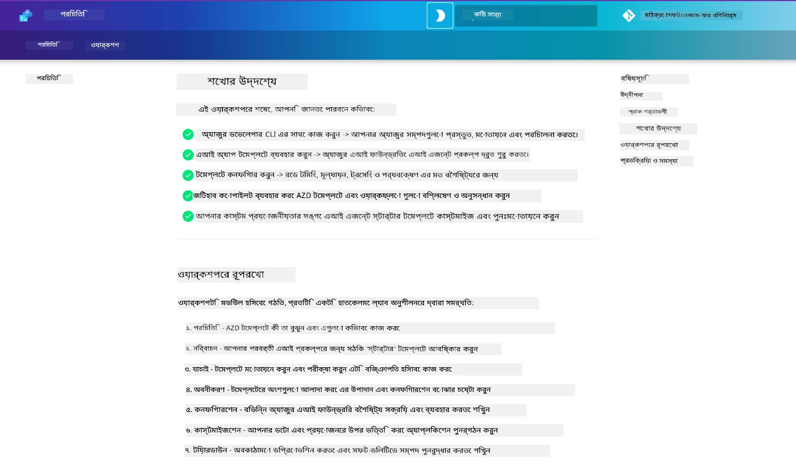

<div align="center">
  <div style="background: linear-gradient(135deg, #0078d4, #106ebe); border-radius: 10px; padding: 20px; margin: 20px 0; box-shadow: 0 4px 15px rgba(0, 120, 212, 0.3); border: 2px solid #005a9e;">
    <h2 style="color: white; margin: 0; font-size: 24px; text-shadow: 1px 1px 2px rgba(0,0,0,0.3);">
      🎯 AI ডেভেলপারদের জন্য AZD কর্মশালা
    </h2>
    <p style="color: white; margin: 10px 0 0 0; font-size: 16px; text-shadow: 1px 1px 2px rgba(0,0,0,0.3);">
      <strong>Azure Developer CLI ব্যবহার করে AI অ্যাপ্লিকেশন তৈরির জন্য একটি হ্যান্ডস-অন কর্মশালা।</strong><br>
      AZD টেমপ্লেট এবং AI ডিপ্লয়মেন্ট ওয়ার্কফ্লো মাস্টার করতে ৭টি মডিউল সম্পন্ন করুন।
    </p>
    <div style="margin-top: 15px;">
      <span style="background: rgba(255,255,255,0.2); padding: 5px 10px; border-radius: 15px; color: white; font-size: 14px;">
        📅 সর্বশেষ আপডেটঃ মার্চ ২০২৬
      </span>
    </div>
  </div>
</div>

# AI ডেভেলপারদের জন্য AZD কর্মশালা

Azure Developer CLI (AZD) শেখার জন্য একটি হ্যান্ডস-অন কর্মশালায় আপনাকে স্বাগতম, যা AI অ্যাপ্লিকেশন ডিপ্লয়মেন্টে কেন্দ্রিত। এই কর্মশালার মাধ্যমে আপনি ৩ ধাপে AZD টেমপ্লেটের ব্যবহারিক বোঝাপড়া অর্জন করবেন:

1. **আবিষ্কার** - আপনার জন্য সঠিক টেমপ্লেট খুঁজে বের করুন।
1. **ডিপ্লয়মেন্ট** - ডিপ্লয় করুন এবং যাচাই করুন এটি কাজ করছে কিনা।
1. **অভিনবীকরণ** - পরিবর্তন করুন এবং নিজের মতো করে উন্নত করুন!

এই কর্মশালার সময় আপনি মূল ডেভেলপার টুলস এবং ওয়ার্কফ্লো সম্বন্ধেও পরিচিত হবেন, যা পুরো ডেভেলপমেন্ট যাত্রাকে সরল ও কার্যকর করবে।

<br/>

## ব্রাউজার-ভিত্তিক গাইড

কর্মশালা পাঠগুলি Markdown-এ রয়েছে। আপনি সরাসরি GitHub-এ নেভিগেট করতে পারেন - অথবা নিচের স্ক্রিনশটে দেখানো মতো একটি ব্রাউজার ভিত্তিক প্রিভিউ চালু করতে পারেন।



এটি ব্যবহারের জন্য - রিপোজিটরি আপনার প্রোফাইলে <em>fork</em> করুন, এবং GitHub Codespaces চালু করুন। VS Code টার্মিনাল চালু হলে নিম্নলিখিত কমান্ড টাইপ করুন:

এই ব্রাউজার প্রিভিউ GitHub Codespaces, ডেভ কন্টেইনার অথবা Python ও MkDocs ইনস্টল করা লোকাল ক্লোনে কাজ করে।

```bash title="" linenums="0"
mkdocs serve > /dev/null 2>&1 &
```
  
কয়েক সেকেন্ডের মধ্যে একটি পপ-আপ ডায়ালগ দেখতে পাবেন। বিকল্প হিসেবে `Open in browser` নির্বাচন করুন। ওয়েব-ভিত্তিক গাইডটি একটি নতুন ব্রাউজার টাবে খুলবে। এই প্রিভিউয়ের কিছু সুবিধা:

1. **নির্মিত সার্চ** - কীওয়ার্ড বা পাঠ দ্রুত খুঁজে পান।
1. **কপি আইকন** - কোডব্লকের উপর হোভার করলে এই বিকল্পটি দেখতে পাবেন
1. **থিম টগল** - ডার্ক এবং লাইট থিমের মধ্যে পরিবর্তন করুন
1. **সাহায্য পান** - ফুটারে থাকা Discord আইকনে ক্লিক করে যুক্ত হোন!

<br/>

## কর্মশালা সংক্ষিপ্ত বিবরণ

**সময়কাল:** ৩-৪ ঘণ্টা  
**স্তর:** প্রারম্ভিক থেকে মধ্যবর্তী  
**পূর্বশর্ত:** Azure, AI ধারণা, VS Code ও কমান্ড লাইন টুলের পরিচিতি।

এটি একটি হ্যান্ডস-অন কর্মশালা যেখানে আপনি কাজ করে শিখবেন। কাজগুলি সম্পন্ন করার পর, আপনাকে AZD ফর বিগিনার্স কারিকুলাম পর্যালোচনা করার পরামর্শ দেওয়া হয়, যাতে আপনি সিকিউরিটি ও প্রোডাকটিভিটি সেরা অনুশীলনের দিকে উন্নতি করতে পারেন।

| সময়| মডিউল  | লক্ষ্য |
|:---|:---|:---|
| ১৫ মিনিট | [পরিচিতি](docs/instructions/0-Introduction.md) | সূচনা, উদ্দেশ্য বোঝা |
| ৩০ মিনিট | [AI টেমপ্লেট বাছাই](docs/instructions/1-Select-AI-Template.md) | অপশন অনুসন্ধান ও শুরু করার জন্য নির্বাচন | 
| ৩০ মিনিট | [AI টেমপ্লেট যাচাই](docs/instructions/2-Validate-AI-Template.md) | Azure-এ ডিফল্ট সলিউশন ডিপ্লয়মেন্ট |
| ৩০ মিনিট | [AI টেমপ্লেট বিশ্লেষণ](docs/instructions/3-Deconstruct-AI-Template.md) | কাঠামো ও কনফিগারেশন অন্বেষণ |
| ৩০ মিনিট | [AI টেমপ্লেট কনফিগার](docs/instructions/4-Configure-AI-Template.md) | উপলব্ধ ফিচার সক্রিয় করা এবং পরীক্ষা |
| ৩০ মিনিট | [AI টেমপ্লেট কাস্টমাইজ](docs/instructions/5-Customize-AI-Template.md) | আপনার প্রয়োজন অনুযায়ী টেমপ্লেট অভিযোজন |
| ৩০ মিনিট | [ইনফ্রাস্ট্রাকচার সরানো](docs/instructions/6-Teardown-Infrastructure.md) | ক্লিনআপ এবং রিসোর্স মুক্তি |
| ১৫ মিনিট | [সমাপ্তি ও পরবর্তী ধাপ](docs/instructions/7-Wrap-up.md) | শেখার সম্পদ, কর্মশালা চ্যালেঞ্জ |

<br/>

## আপনি যা শিখবেন

AZD টেমপ্লেটকে একটি শেখার স্যান্ডবক্স হিসাবে ভাবুন, যা Microsoft Foundry-তে শেষ থেকে শেষ পর্যন্ত ডেভেলপমেন্টের জন্য বিভিন্ন ক্ষমতা ও টুল অন্বেষণের সুযোগ দেয়। এই কর্মশালা শেষে, আপনি এই প্রসঙ্গে বিভিন্ন টুল ও ধারণার জন্য একটি স্বাভাবিক বোধ পাবেন।

| ধারণা  | লক্ষ্য |
|:---|:---|
| **Azure Developer CLI** | টুল কমান্ড এবং ওয়ার্কফ্লো বোঝা |
| **AZD টেমপ্লেটস** | প্রকল্প কাঠামো এবং কনফিগারেশন বোঝা |
| **Azure AI Agent** | Microsoft Foundry প্রকল্প প্রোভিশন ও ডিপ্লয়মেন্ট |
| **Azure AI Search** | এজেন্ট এর মাধ্যমে প্রসঙ্গ প্রকৌশল সক্ষম করা |
| **পর্যবেক্ষণযোগ্যতা** | ট্রেসিং, মনিটরিং ও মূল্যায়ন অন্বেষণ |
| **রেড টিমিং** | বিরোধী পরীক্ষণ ও প্রতিরোধ অন্বেষণ |

<br/>

## কর্মশালা কাঠামো

কর্মশালাটি আপনাকে একটি যাত্রায় নিয়ে যেতে পরিকল্পিত, যেখানে টেমপ্লেট আবিষ্কার থেকে শুরু করে ডিপ্লয়মেন্ট, বিশ্লেষণ ও কাস্টমাইজেশনে পৌঁছানো হয় - অফিসিয়াল [Getting Started with AI Agents](https://github.com/Azure-Samples/get-started-with-ai-agents) স্টার্টার টেমপ্লেট ব্যবহার করে।

### [মডিউল ১: AI টেমপ্লেট বাছাই](docs/instructions/1-Select-AI-Template.md) (৩০ মিনিট)

- AI টেমপ্লেট কী?
- AI টেমপ্লেট কোথায় পাওয়া যায়?
- কীভাবে AI এজেন্ট তৈরি শুরু করবো?
- **ল্যাব:** Codespaces বা ডেভ কন্টেইনারে দ্রুত শুরু

### [মডিউল ২: AI টেমপ্লেট যাচাই](docs/instructions/2-Validate-AI-Template.md) (৩০ মিনিট)

- AI টেমপ্লেট আর্কিটেকচার কী?
- AZD ডেভেলপমেন্ট ওয়ার্কফ্লো কী?
- AZD ডেভেলপমেন্টে সাহায্য কিভাবে পাবো?
- **ল্যাব:** AI এজেন্ট টেমপ্লেট ডিপ্লয় ও যাচাই

### [মডিউল ৩: AI টেমপ্লেট বিশ্লেষণ](docs/instructions/3-Deconstruct-AI-Template.md) (৩০ মিনিট)

- `.azure/` এ আপনার পরিবেশ আবিষ্কার করুন
- `infra/` এ আপনার রিসোর্স সেটআপ দেখুন
- `azure.yaml` গুলোতে AZD কনফিগারেশন অন্বেষণ করুন
- **ল্যাব:** পরিবেশ ভেরিয়েবল পরিবর্তন ও পুনরায় ডিপ্লয়

### [মডিউল ৪: AI টেমপ্লেট কনফিগার](docs/instructions/4-Configure-AI-Template.md) (৩০ মিনিট)
- অন্বেষণ: রিট্রিভাল অগমেন্টেড জেনারেশন
- অন্বেষণ: এজেন্ট মূল্যায়ন ও রেড টিমিং
- অন্বেষণ: ট্রেসিং ও মনিটরিং
- **ল্যাব:** AI এজেন্ট + পর্যবেক্ষণযোগ্যতা অন্বেষণ

### [মডিউল ৫: AI টেমপ্লেট কাস্টমাইজ](docs/instructions/5-Customize-AI-Template.md) (৩০ মিনিট)
- সংজ্ঞায়িত করুন: সিনারিও চাহিদাসহ PRD
- কনফিগার করুন: AZD এর জন্য পরিবেশ ভেরিয়েবল
- বাস্তবায়ন: অতিরিক্ত টাস্কের জন্য লাইফসাইকেল হুক
- **ল্যাব:** আমার সিনারিও অনুযায়ী টেমপ্লেট কাস্টমাইজ

### [মডিউল ৬: ইনফ্রাস্ট্রাকচার সরানো](docs/instructions/6-Teardown-Infrastructure.md) (৩০ মিনিট)
- পুনর্বিবেচনা: AZD টেমপ্লেট কী?
- পুনর্বিবেচনা: কেন Azure Developer CLI ব্যবহার করবেন?
- পরবর্তী ধাপ: অন্য টেমপ্লেট চেষ্টা করুন!
- **ল্যাব:** ইনফ্রাস্ট্রাকচার ডিপ্রোভিশন ও ক্লিনআপ

<br/>

## কর্মশালা চ্যালেঞ্জ

আপনি কি নিজেকে আরও চ্যালেঞ্জ করতে চান? এখানে কিছু প্রকল্পের পরামর্শ দেওয়া হল - অথবা আমাদের সাথে আপনার আইডিয়া শেয়ার করুন!!

| প্রকল্প | বিবরণ |
|:---|:---|
|1. **একটি জটিল AI টেমপ্লেট বিশ্লেষণ করুন** | আমরা যে ওয়ার্কফ্লো ও টুলস বর্ণনা করেছি তা ব্যবহার করে দেখুন আপনি কি বিভিন্ন AI সলিউশন টেমপ্লেট ডিপ্লয়, যাচাই ও কাস্টমাইজ করতে পারেন। _আপনি কী শিখলেন?_|
|2. **আপনার সিনারিও অনুসারে কাস্টমাইজ করুন**  | একটি ভিন্ন সিনারিওর জন্য PRD (প্রোডাক্ট প্রয়োজনীয়তা ডকুমেন্ট) লিখে দেখুন। তারপর GitHub Copilot ব্যবহার করে আপনার টেমপ্লেট রিপোজিটরিতে এজেন্ট মডেলে একটি কাস্টমাইজেশন ওয়ার্কফ্লো তৈরি করতে বলুন। _আপনি কী শিখলেন? আপনি কীভাবে এই পরামর্শগুলো উন্নত করতে পারেন?_|
| | |

## মতামত আছে?

1. এই রিপোজিটরিতে একটি ইস্যু পোস্ট করুন - সুবিধার জন্য ট্যাগ দিন `Workshop`।
1. Microsoft Foundry Discord-এ যোগ দিন - সহকর্মীদের সাথে সংযুক্ত হন!


| | | 
|:---|:---|
| **📚 কোর্স হোম**| [AZD ফর বিগিনার্স](../README.md)|
| **📖 ডকুমেন্টেশন** | [AI টেমপ্লেট দিয়ে শুরু করুন](https://learn.microsoft.com/en-us/azure/ai-foundry/how-to/develop/ai-template-get-started)|
| **🛠️AI টেমপ্লেটস** | [Microsoft Foundry টেমপ্লেটস](https://ai.azure.com/templates) |
|**🚀 পরবর্তী ধাপ** | [কর্মশালা শুরু করুন](#কর্মশালা-সংক্ষিপ্ত-বিবরণ) |
| | |

<br/>

---

**নেভিগেশন:** [মেইন কোর্স](../README.md) | [পরিচিতি](docs/instructions/0-Introduction.md) | [মডিউল ১: টেমপ্লেট বাছাই](docs/instructions/1-Select-AI-Template.md)

**AZD দিয়ে AI অ্যাপ্লিকেশন তৈরি শুরু করতে প্রস্তুত?**

[কর্মশালা শুরু করুন: পরিচিতি →](docs/instructions/0-Introduction.md)

---

<!-- CO-OP TRANSLATOR DISCLAIMER START -->
**অস্বীকৃতি**:  
এই দলিলটি AI অনুবাদ সেবা [Co-op Translator](https://github.com/Azure/co-op-translator) ব্যবহার করে অনূদিত হয়েছে। আমরা সঠিকতার জন্য চেষ্টা করি, তবে দয়া করে সচেতন থাকুন যে স্বয়ংক্রিয় অনুবাদে ত্রুটি বা ভুল ধারণা থাকতে পারে। মূল দলিলটির স্থানীয় ভাষায় সংস্করণই কর্তৃপক্ষের সর্বোচ্চ উৎস হিসেবে বিবেচিত হওয়া উচিত। গুরুত্বপূর্ণ তথ্যের জন্য পেশাদার মানুষের অনুবাদ সুপারিশ করা হয়। এই অনুবাদের ব্যবহারে যে কোনো ভুল বোঝাবুঝি বা ভুল ব্যাখ্যার জন্য আমরা দায়ী নই।
<!-- CO-OP TRANSLATOR DISCLAIMER END -->