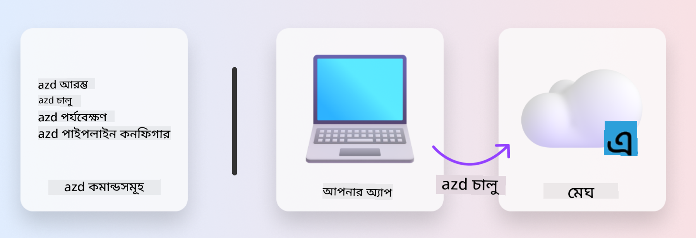

<!--
CO_OP_TRANSLATOR_METADATA:
{
  "original_hash": "06d6207eff634aefcaa41739490a5324",
  "translation_date": "2025-09-24T13:42:09+00:00",
  "source_file": "workshop/docs/instructions/1-Select-AI-Template.md",
  "language_code": "bn"
}
-->
# 1. একটি টেমপ্লেট নির্বাচন করুন

!!! tip "এই মডিউল শেষে আপনি সক্ষম হবেন"

    - [ ] AZD টেমপ্লেট কী তা ব্যাখ্যা করতে
    - [ ] AI এর জন্য AZD টেমপ্লেট খুঁজে বের করতে এবং ব্যবহার করতে
    - [ ] AI Agents টেমপ্লেট দিয়ে শুরু করতে
    - [ ] **ল্যাব ১:** GitHub Codespaces দিয়ে AZD Quickstart

---

## 1. একটি নির্মাণের উপমা

শূন্য থেকে একটি আধুনিক এন্টারপ্রাইজ-প্রস্তুত AI অ্যাপ্লিকেশন তৈরি করা বেশ কঠিন হতে পারে। এটি অনেকটা নিজের হাতে ইট দিয়ে নতুন বাড়ি তৈরি করার মতো। হ্যাঁ, এটি সম্ভব! কিন্তু এটি কাঙ্ক্ষিত ফলাফল পাওয়ার সবচেয়ে কার্যকর উপায় নয়!

পরিবর্তে, আমরা সাধারণত একটি বিদ্যমান _ডিজাইন ব্লুপ্রিন্ট_ দিয়ে শুরু করি এবং একজন স্থপতির সাথে কাজ করে সেটিকে আমাদের ব্যক্তিগত প্রয়োজন অনুযায়ী কাস্টমাইজ করি। এবং বুদ্ধিমান অ্যাপ্লিকেশন তৈরি করার সময় ঠিক এই পদ্ধতিই গ্রহণ করা উচিত। প্রথমে, এমন একটি ভালো ডিজাইন আর্কিটেকচার খুঁজুন যা আপনার সমস্যার ক্ষেত্রের সাথে মানানসই। তারপর একজন সলিউশন আর্কিটেক্টের সাথে কাজ করে সেটিকে আপনার নির্দিষ্ট পরিস্থিতির জন্য কাস্টমাইজ এবং উন্নত করুন।

কিন্তু আমরা এই ডিজাইন ব্লুপ্রিন্টগুলো কোথায় খুঁজে পাব? এবং কীভাবে এমন একজন আর্কিটেক্ট খুঁজে পাবেন যিনি আমাদের শেখাতে ইচ্ছুক যে কীভাবে এই ব্লুপ্রিন্টগুলো কাস্টমাইজ এবং ডিপ্লয় করতে হয়? এই কর্মশালায়, আমরা তিনটি প্রযুক্তি পরিচয় করিয়ে দিয়ে এই প্রশ্নগুলোর উত্তর দেব:

1. [Azure Developer CLI](https://aka.ms/azd) - একটি ওপেন-সোর্স টুল যা স্থানীয় ডেভেলপমেন্ট (বিল্ড) থেকে ক্লাউড ডিপ্লয়মেন্ট (শিপ) পর্যন্ত ডেভেলপার পথকে ত্বরান্বিত করে।
1. [Azure AI Foundry Templates](https://ai.azure.com/templates) - স্ট্যান্ডার্ডাইজড ওপেন-সোর্স রিপোজিটরি যা AI সলিউশন আর্কিটেকচারের জন্য নমুনা কোড, অবকাঠামো এবং কনফিগারেশন ফাইল ধারণ করে।
1. [GitHub Copilot Agent Mode](https://code.visualstudio.com/docs/copilot/chat/chat-agent-mode) - একটি কোডিং এজেন্ট যা Azure জ্ঞানের উপর ভিত্তি করে তৈরি, যা আমাদের কোডবেস নেভিগেট করতে এবং পরিবর্তন করতে প্রাকৃতিক ভাষা ব্যবহার করে গাইড করতে পারে।

এই টুলগুলো হাতে থাকলে, আমরা এখন _সঠিক টেমপ্লেট খুঁজে বের করতে_, _ডিপ্লয় করতে_ এবং _কাস্টমাইজ করতে_ পারি আমাদের নির্দিষ্ট পরিস্থিতির জন্য। চলুন, এগুলো কীভাবে কাজ করে তা শিখি।

---

## 2. Azure Developer CLI

[Azure Developer CLI](https://learn.microsoft.com/en-us/azure/developer/azure-developer-cli/) (বা `azd`) একটি ওপেন-সোর্স কমান্ডলাইন টুল যা আপনার কোড-টু-ক্লাউড যাত্রাকে ত্বরান্বিত করতে পারে এমন ডেভেলপার-বন্ধুত্বপূর্ণ কমান্ডের একটি সেট দিয়ে, যা আপনার IDE (ডেভেলপমেন্ট) এবং CI/CD (ডেভঅপস) পরিবেশে ধারাবাহিকভাবে কাজ করে।

`azd` ব্যবহার করে আপনার ডিপ্লয়মেন্ট যাত্রা হতে পারে খুবই সহজ:

- `azd init` - একটি বিদ্যমান AZD টেমপ্লেট থেকে একটি নতুন AI প্রকল্প আরম্ভ করে।
- `azd up` - অবকাঠামো প্রস্তুত করে এবং এক ধাপে আপনার অ্যাপ্লিকেশন ডিপ্লয় করে।
- `azd monitor` - আপনার ডিপ্লয় করা অ্যাপ্লিকেশনের জন্য রিয়েল-টাইম মনিটরিং এবং ডায়াগনস্টিকস পান।
- `azd pipeline config` - Azure-এ ডিপ্লয়মেন্ট অটোমেট করতে CI/CD পাইপলাইন সেটআপ করুন।

**🎯 | অনুশীলন**: <br/> 
আপনার GitHub Codespaces পরিবেশে `azd` কমান্ডলাইন টুলটি অন্বেষণ করুন। এই কমান্ডটি টাইপ করে শুরু করুন এবং দেখুন টুলটি কী করতে পারে:

```bash title="" linenums="0"
azd help
```



---

## 3. AZD টেমপ্লেট

`azd` এটি অর্জন করতে হলে, তাকে জানতে হবে কোন অবকাঠামো প্রস্তুত করতে হবে, কোন কনফিগারেশন সেটিংস প্রয়োগ করতে হবে, এবং কোন অ্যাপ্লিকেশন ডিপ্লয় করতে হবে। এখানেই [AZD টেমপ্লেট](https://learn.microsoft.com/en-us/azure/developer/azure-developer-cli/azd-templates?tabs=csharp) গুরুত্বপূর্ণ ভূমিকা পালন করে।

AZD টেমপ্লেট হলো ওপেন-সোর্স রিপোজিটরি যা নমুনা কোডের সাথে অবকাঠামো এবং কনফিগারেশন ফাইলগুলোকে একত্রিত করে, যা সলিউশন আর্কিটেকচার ডিপ্লয় করার জন্য প্রয়োজনীয়।
_Infrastructure-as-Code_ (IaC) পদ্ধতি ব্যবহার করে, এগুলো টেমপ্লেট রিসোর্স ডেফিনিশন এবং কনফিগারেশন সেটিংসকে ভার্সন-কন্ট্রোল করতে সক্ষম করে (যেমন অ্যাপ সোর্স কোড) - যা প্রকল্পের ব্যবহারকারীদের মধ্যে পুনরায় ব্যবহারযোগ্য এবং ধারাবাহিক কর্মপ্রবাহ তৈরি করে।

আপনার পরিস্থিতির জন্য একটি AZD টেমপ্লেট তৈরি বা পুনরায় ব্যবহার করার সময় এই প্রশ্নগুলো বিবেচনা করুন:

1. আপনি কী তৈরি করছেন? → এমন কোনো টেমপ্লেট আছে কি যা সেই পরিস্থিতির জন্য স্টার্টার কোড ধারণ করে?
1. আপনার সলিউশন কীভাবে আর্কিটেক্ট করা হয়েছে? → এমন কোনো টেমপ্লেট আছে কি যা প্রয়োজনীয় রিসোর্স ধারণ করে?
1. আপনার সলিউশন কীভাবে ডিপ্লয় করা হয়েছে? → ভাবুন `azd deploy` প্রি/পোস্ট-প্রসেসিং হুক সহ!
1. আপনি কীভাবে এটি আরও উন্নত করতে পারেন? → ভাবুন বিল্ট-ইন মনিটরিং এবং অটোমেশন পাইপলাইন!

**🎯 | অনুশীলন**: <br/> 
[Awesome AZD](https://azure.github.io/awesome-azd/) গ্যালারি পরিদর্শন করুন এবং ফিল্টার ব্যবহার করে বর্তমানে উপলব্ধ ২৫০+ টেমপ্লেট অন্বেষণ করুন। দেখুন আপনি এমন কোনো টেমপ্লেট খুঁজে পান কি না যা _আপনার_ পরিস্থিতির প্রয়োজনের সাথে মানানসই।


---

## 4. AI অ্যাপ টেমপ্লেট

---

