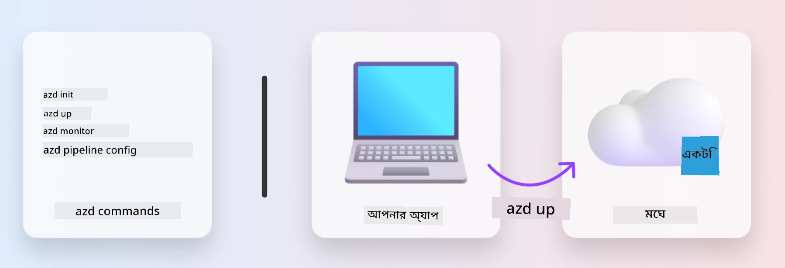
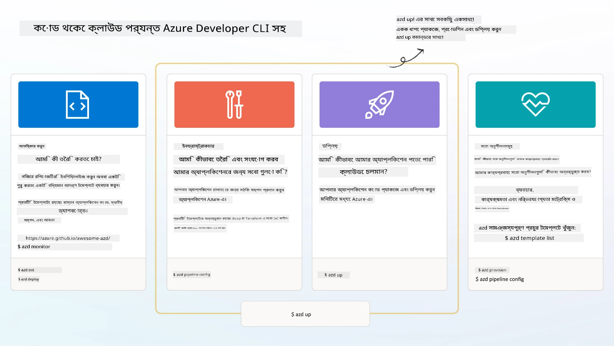

# 1. একটি টেমপ্লেট নির্বাচন করুন

!!! tip "এই মডিউলের শেষে আপনি সক্ষম হবেন"

    - [ ] AZD টেমপ্লেটগুলো কী তা বর্ণনা করতে
    - [ ] AI-এর জন্য AZD টেমপ্লেট আবিষ্কার এবং ব্যবহার করতে
    - [ ] AI Agents টেমপ্লেট দিয়ে শুরু করতে
    - [ ] **ল্যাব 1:** AZD Quickstart with GitHub Codespaces

---

## 1. একজন নির্মাতার উপমা

একটি আধুনিক এন্টারপ্রাইজ-তায়ার AI অ্যাপ্লিকেশন _শূন্য থেকে_ তৈরি করা ভয়ঙ্কর হতে পারে। এটি একটু এমনই, যেমন আপনি নিজের ঘরটি ইট-বাই-ইট করে নিজে বানাচ্ছেন। হ্যাঁ, এটা সম্ভব! কিন্তু এটি কাঙ্ক্ষিত চূড়ান্ত ফলাফল পাওয়ার সবচেয়ে কার্যকর উপায় নয়!

বরং, আমরা প্রায়ই একটি বিদ্যমান _ডিজাইন ব্লুপ্রিন্ট_ দিয়ে শুরু করি, এবং একটি আর্কিটেক্টের সাথে কাজ করে এটাকে আমাদের ব্যক্তিগত চাহিদা অনুযায়ী কাস্টমাইজ করি। এবং বুদ্ধিমান অ্যাপ্লিকেশন তৈরি করার ক্ষেত্রেও একই পদ্ধতি গ্রহণ করা উচিত। প্রথমে, এমন একটি ভাল ডিজাইন আর্কিটেকচার খুঁজুন যা আপনার সমস্যা ক্ষেত্রের সঙ্গে মিলে। তারপর আপনার নির্দিষ্ট পরিস্থিতির জন্য সমাধানটি কাস্টমাইজ এবং ডেভেলপ করার জন্য একজন সলিউশন আর্কিটেক্টের সাথে কাজ করুন।

কিন্তু আমরা এই ডিজাইন ব্লুপ্রিন্ট কোথায় পাব? এবং কিভাবে এমন একজন আর্কিটেক্ট পাব যিনি আমাদের শিখাতে ইচ্ছুক কিভাবে এই ব্লুপ্রিন্টগুলো কাস্টমাইজ ও ডিপ্লয় করবেন? এই ওয়ার্কশপে, আমরা তিনটি প্রযুক্তি পরিচয় করিয়ে দিয়ে এই প্রশ্নগুলোর উত্তর দিই:

1. [Azure Developer CLI](https://aka.ms/azd) - একটি ওপেন-সোর্স টুল যা স্থানীয় ডেভেলপমেন্ট (build) থেকে ক্লাউড ডিপ্লয়মেন্ট (ship) পর্যন্ত ডেভেলপার পথকে দ্রুততর করে।
1. [Microsoft Foundry Templates](https://ai.azure.com/templates) - স্ট্যান্ডার্ডাইজড ওপেন-সোর্স রেপোজিটরি যা AI সলিউশন আর্কিটেকচার ডিপ্লয় করার জন্য নমুনা কোড, ইনফ্রাস্ট্রাকচার এবং কনফিগারেশন ফাইলগুলো ধারণ করে।
1. [GitHub Copilot Agent Mode](https://code.visualstudio.com/docs/copilot/chat/chat-agent-mode) - Azure জ্ঞানে ভিত্তি করে একটি কোডিং এজেন্ট, যা ন্যাচারাল ল্যাঙ্গুয়েজ ব্যবহার করে কোডবেস নেভিগেট এবং পরিবর্তন করার ক্ষেত্রে আমাদের গাইড করতে পারে।

এই টুলগুলো হাতে থাকলে, আমরা এখন সঠিক টেমপ্লেটটি _আবিষ্কার_ করতে পারি, এটি কাজ করে কিনা যাচাই করতে _ডিপ্লয়_ করতে পারি, এবং আমাদের নির্দিষ্ট পরিস্থিতির জন্য এটিকে _কাস্টমাইজ_ করতে পারি। চলুন ডুব দি এবং শিখি কিভাবে এগুলো কাজ করে।


---

## 2. Azure Developer CLI

The [Azure Developer CLI](https://learn.microsoft.com/en-us/azure/developer/azure-developer-cli/) (or `azd`) একটি ওপেন-সোর্স কমান্ডলাইন টুল যা ডেভেলপার-বন্ধু কমান্ডগুলোর একটি সেট নিয়ে আপনার কোড-টু-ক্লাউড যাত্রাকে দ্রুত করতে পারে এবং যা আপনার IDE (development) এবং CI/CD (devops) পরিবেশে সামঞ্জস্যপূর্ণভাবে কাজ করে।

`azd` দিয়ে আপনার ডিপ্লয়মেন্ট যাত্রা এত সহজ হতে পারে:

- `azd init` - একটি বিদ্যমান AZD টেমপ্লেট থেকে একটি নতুন AI প্রকল্প আরম্ভ করে।
- `azd up` - এক ধাপে ইনফ্রাস্ট্রাকচার প্রদান করে এবং আপনার অ্যাপ্লিকেশন ডিপ্লয় করে।
- `azd monitor` - আপনার ডিপ্লয় করা অ্যাপ্লিকেশনের জন্য রিয়েল-টাইম মনিটরিং এবং ডায়াগনস্টিক্স পেতে।
- `azd pipeline config` - Azure-এ ডিপ্লয়মেন্ট অটোমেট করতে CI/CD পাইপলাইন সেটআপ করে।

**🎯 | EXERCISE**: <br/> আপনার GitHub Codespaces পরিবেশে এখনই `azd` কমান্ডলাইন টুলটি অন্বেষণ করুন। কি করতে পারে তা দেখতে এই কমান্ডটি টাইপ করে শুরু করুন:

```bash title="" linenums="0"
azd help
```



---

## 3. AZD টেমপ্লেট

`azd` যেন এটি করতে পারে, সেটির জন্য এটি জানতে হবে কোন ইনফ্রাস্ট্রাকচার প্রদান করতে হবে, কোন কনফিগারেশন সেটিংস প্রযোজ্য করতে হবে, এবং কোন অ্যাপ্লিকেশন ডিপ্লয় করতে হবে। এখানেই [AZD templates](https://learn.microsoft.com/en-us/azure/developer/azure-developer-cli/azd-templates?tabs=csharp) সাহায্য করে। 

AZD টেমপ্লেটগুলো ওপেন-সোর্স রেপোজিটরি যা নমুনা কোডকে ইনফ্রাস্ট্রাকচার এবং কনফিগারেশন ফাইলগুলোর সাথে মিলিয়ে সমাধান আর্কিটেকচার ডিপ্লয় করার জন্য প্রয়োজনীয় সব কিছু একত্রিত করে রাখে।
একটি _Infrastructure-as-Code_ (IaC) পদ্ধতি ব্যবহার করে, এগুলো টেমপ্লেট রিসোর্স ডিফিনিশন এবং কনফিগারেশন সেটিংসগুলোকে সংস্করণ-নিয়ন্ত্রিত (অ্যাপ সোার্স কোডের মতো) রাখে - ফলে ওই প্রকল্পের ব্যবহারকারীদের মধ্যে পুনঃব্যবহারযোগ্য এবং ধারাবাহিক ওয়ার্কফ্লো তৈরি হয়।

আপনার পরিস্থিতির জন্য একটি AZD টেমপ্লেট তৈরি বা পুনঃব্যবহার করার সময় এই প্রশ্নগুলো বিবেচনা করুন:

1. আপনি কী তৈরি করছেন? → ওই পরিস্থিতির জন্য কি একটি স্টার্টার কোডসহ টেমপ্লেট আছে?
1. আপনার সমাধানটি কীভাবে আর্কিটেকচার করা হয়েছে? → দরকারি রিসোর্সগুলো আছে কি এমন একটি টেমপ্লেট আছে?
1. আপনার সমাধানটি কীভাবে ডিপ্লয় করা হয়? → প্রি/পোস্ট-প্রসেসিং হুক সহ `azd deploy` চিন্তা করুন!
1. আপনি কীভাবে এটিকে আরও অপ্টিমাইজ করতে পারেন? → বিল্ট-ইন মনিটরিং এবং অটোমেশন পাইপলাইনগুলি চিন্তা করুন!

**🎯 | EXERCISE**: <br/> 
ভিজিট করুন [Awesome AZD](https://azure.github.io/awesome-azd/) গ্যালারি এবং ফিল্টার ব্যবহার করে বর্তমানে উপলব্ধ 250+ টেমপ্লেট অন্বেষণ করুন। দেখুন আপনি কি এমন কোনো টেমপ্লেট খুঁজে পান যা _আপনার_ পরিস্থিতির চাহিদার সাথে খাপ খায়।



---

## 4. AI অ্যাপ টেমপ্লেট

AI-চালিত অ্যাপ্লিকেশনগুলোর জন্য, Microsoft বিশেষায়িত টেমপ্লেট প্রদান করে যা **Microsoft Foundry** এবং **Foundry Agents** অন্তর্ভুক্ত করে। এই টেমপ্লেটগুলো বুদ্ধিমান, প্রোডাকশন-রেডি অ্যাপ্লিকেশন তৈরি করার পথ দ্রুততর করে।

### Microsoft Foundry & Foundry Agents টেমপ্লেট

নীচ থেকে একটি টেমপ্লেট নির্বাচন করে ডিপ্লয় করুন। প্রতিটি টেমপ্লেট [Awesome AZD](https://azure.github.io/awesome-azd/) এ উপলব্ধ এবং একটি কমান্ডে ইনিশিয়ালাইজ করা যায়।

| Template | Description | Deploy Command |
|----------|-------------|----------------|
| **[RAG সহ AI চ্যাট](https://azure.github.io/awesome-azd/?tags=ai&tags=rag)** | Microsoft Foundry ব্যবহার করে Retrieval Augmented Generation সহ চ্যাট অ্যাপ্লিকেশন | `azd init -t azure-samples/azure-search-openai-demo` |
| **[Foundry Agent সার্ভিস স্টার্টার](https://azure.github.io/awesome-azd/?tags=ai&tags=agents)** | Foundry Agents ব্যবহার করে স্বয়ংক্রিয় টাস্ক এক্সিকিউশনের জন্য AI এজেন্ট তৈরির স্টার্টার | `azd init -t azure-samples/foundry-agent-service-starter` |
| **[মাল্টি-এজেন্ট অর্কেস্ট্রেশন](https://azure.github.io/awesome-azd/?tags=ai&tags=agents)** | জটিল ওয়ার্কফ্লোয়ের জন্য একাধিক Foundry Agent সমন্বয় করা | `azd init -t azure-samples/multi-agent-orchestration` |
| **[AI ডকুমেন্ট ইন্টেলিজেন্স](https://azure.github.io/awesome-azd/?tags=ai&tags=document)** | Microsoft Foundry মডেল ব্যবহার করে ডকুমেন্ট এক্সট্র্যাক্ট এবং বিশ্লেষণ | `azd init -t azure-samples/ai-document-processing` |
| **[কনভারসেশনাল AI বট](https://azure.github.io/awesome-azd/?tags=ai&tags=bot)** | Microsoft Foundry ইন্টিগ্রেশনের সঙ্গে বুদ্ধিমান চ্যাটবট নির্মাণ | `azd init -t azure-samples/ai-chat-protocol` |
| **[AI ইমেজ জেনারেশন](https://azure.github.io/awesome-azd/?tags=ai&tags=dalle)** | Microsoft Foundry ব্যবহার করে DALL-E মাধ্যমে ইমেজ জেনারেট করা | `azd init -t azure-samples/ai-image-generation` |
| **[Semantic Kernel এজেন্ট](https://azure.github.io/awesome-azd/?tags=ai&tags=semantic-kernel)** | Foundry Agents সহ Semantic Kernel ব্যবহার করে AI এজেন্ট | `azd init -t azure-samples/semantic-kernel-agent` |
| **[AutoGen মাল্টি-এজেন্ট](https://azure.github.io/awesome-azd/?tags=ai&tags=autogen)** | AutoGen ফ্রেমওয়ার্ক ব্যবহার করে মাল্টি-এজেন্ট সিস্টেম | `azd init -t azure-samples/autogen-multi-agent` |

### দ্রুত শুরু

1. **টেমপ্লেট ব্রাউজ করুন**: ভিজিট করুন [https://azure.github.io/awesome-azd/](https://azure.github.io/awesome-azd/) এবং `AI`, `Agents`, বা `Microsoft Foundry` দ্বারা ফিল্টার করুন
2. **আপনার টেমপ্লেট নির্বাচন করুন**: আপনার ইউজ কেসের সাথে মিলে এমন একটি নির্বাচন করুন
3. **ইনিশিয়ালাইজ করুন**: আপনার নির্বাচিত টেমপ্লেটের জন্য `azd init` কমান্ড চালান
4. **ডিপ্লয় করুন**: প্রভিশন এবং ডিপ্লয় করতে `azd up` চালান

**🎯 | EXERCISE**: <br/>
নিচের টেমপ্লেটগুলোর মধ্যে আপনার পরিস্থিতির ভিত্তিতে একটি নির্বাচন করুন:

- **চ্যাটবট তৈরি করছেন?** → **RAG সহ AI চ্যাট** বা **কনভারসেশনাল AI বট** দিয়ে শুরু করুন
- **স্বায়ত্তশাসিত এজেন্ট দরকার?** → **Foundry Agent সার্ভিস স্টার্টার** বা **মাল্টি-এজেন্ট অর্কেস্ট্রেশন** চেষ্টা করুন
- **ডকুমেন্ট প্রক্রিয়াকরণ করছেন?** → **AI ডকুমেন্ট ইন্টেলিজেন্স** ব্যবহার করুন
- **AI কোডিং সহায়তা চান?** → **Semantic Kernel এজেন্ট** বা **AutoGen মাল্টি-এজেন্ট** অন্বেষণ করুন

```bash title="Example: Deploy the AI Chat with RAG template" linenums="0"
azd init -t azure-samples/azure-search-openai-demo
azd up
```

!!! info "আরও টেমপ্লেট অন্বেষণ করুন"
    The [Awesome AZD Gallery](https://azure.github.io/awesome-azd/) contains 250+ templates. Use the filters to find templates matching your specific requirements for language, framework, and Azure services.

---

<!-- CO-OP TRANSLATOR DISCLAIMER START -->
দায়মুক্তি:
এই দলিলটি AI অনুবাদ সেবা Co-op Translator (https://github.com/Azure/co-op-translator) ব্যবহার করে অনুবাদ করা হয়েছে। যদিও আমরা যথাসাধ্য সঠিকতার চেষ্টা করি, স্বয়ংক্রিয় অনুবাদে ভুল বা অসঙ্গতি থাকতে পারে বলে অনুগ্রহ করে সচেতন থাকুন। মূল ভাষায় থাকা অরিজিনাল দলিলটিকেই কর্তৃত্বপূর্ণ উৎস হিসেবে বিবেচনা করা উচিত। গুরুত্বপূর্ণ তথ্যের জন্য পেশাদার মানব অনুবাদের পরামর্শ দেওয়া হচ্ছে। এই অনুবাদ ব্যবহারের ফলে যে কোনো বিভ্রান্তি বা ভুল ব্যাখ্যার জন্য আমরা দায়ী নই।
<!-- CO-OP TRANSLATOR DISCLAIMER END -->