<!--
CO_OP_TRANSLATOR_METADATA:
{
  "original_hash": "7816c6ec50c694c331e7c6092371be4d",
  "translation_date": "2025-09-24T13:46:52+00:00",
  "source_file": "workshop/docs/instructions/2-Validate-AI-Template.md",
  "language_code": "bn"
}
-->
# 2. একটি টেমপ্লেট যাচাই করুন

!!! tip "এই মডিউল শেষে আপনি সক্ষম হবেন"

    - [ ] AI সলিউশন আর্কিটেকচার বিশ্লেষণ করুন
    - [ ] AZD ডিপ্লয়মেন্ট ওয়ার্কফ্লো বুঝুন
    - [ ] AZD ব্যবহারে সাহায্য পেতে GitHub Copilot ব্যবহার করুন
    - [ ] **ল্যাব ২:** AI এজেন্টস টেমপ্লেট ডিপ্লয় এবং যাচাই করুন

---

## ১. ভূমিকা

[Azure Developer CLI](https://learn.microsoft.com/en-us/azure/developer/azure-developer-cli/) বা `azd` একটি ওপেন-সোর্স কমান্ডলাইন টুল যা Azure-এ অ্যাপ্লিকেশন তৈরি এবং ডিপ্লয় করার সময় ডেভেলপার ওয়ার্কফ্লোকে সহজ করে তোলে।

[AZD টেমপ্লেট](https://learn.microsoft.com/azure/developer/azure-developer-cli/azd-templates) হলো স্ট্যান্ডার্ডাইজড রিপোজিটরি যা নমুনা অ্যাপ্লিকেশন কোড, _ইনফ্রাস্ট্রাকচার অ্যাজ কোড_ সম্পদ এবং `azd` কনফিগারেশন ফাইল অন্তর্ভুক্ত করে একটি সমন্বিত সলিউশন আর্কিটেকচার তৈরি করে। `azd provision` কমান্ড ব্যবহার করে ইনফ্রাস্ট্রাকচার প্রভিশনিং সহজ হয়ে যায় - এবং `azd up` ব্যবহার করলে ইনফ্রাস্ট্রাকচার **এবং** অ্যাপ্লিকেশন একসাথে ডিপ্লয় করা যায়!

ফলস্বরূপ, আপনার অ্যাপ্লিকেশন ডেভেলপমেন্ট প্রক্রিয়া শুরু করা সহজ হয়ে যায় যদি আপনি এমন একটি _AZD স্টার্টার টেমপ্লেট_ খুঁজে পান যা আপনার অ্যাপ্লিকেশন এবং ইনফ্রাস্ট্রাকচার প্রয়োজনের সাথে সবচেয়ে কাছাকাছি। এরপর রিপোজিটরিটি আপনার নির্দিষ্ট প্রয়োজন অনুযায়ী কাস্টমাইজ করুন।

শুরু করার আগে, নিশ্চিত করুন যে আপনার Azure Developer CLI ইনস্টল করা আছে।

1. VS Code টার্মিনাল খুলুন এবং এই কমান্ডটি টাইপ করুন:

      ```bash title="" linenums="0"
      azd version
      ```

1. আপনি এরকম কিছু দেখতে পাবেন!

      ```bash title="" linenums="0"
      azd version 1.19.0 (commit b3d68cea969b2bfbaa7b7fa289424428edb93e97)
      ```

**আপনি এখন azd দিয়ে একটি টেমপ্লেট নির্বাচন এবং ডিপ্লয় করতে প্রস্তুত**

---

## ২. টেমপ্লেট নির্বাচন

Azure AI Foundry প্ল্যাটফর্মে [প্রস্তাবিত AZD টেমপ্লেটের একটি সেট](https://learn.microsoft.com/en-us/azure/ai-foundry/how-to/develop/ai-template-get-started) রয়েছে যা জনপ্রিয় সলিউশন দৃশ্যপট যেমন _মাল্টি-এজেন্ট ওয়ার্কফ্লো অটোমেশন_ এবং _মাল্টি-মোডাল কন্টেন্ট প্রসেসিং_ কভার করে। আপনি Azure AI Foundry পোর্টাল পরিদর্শন করেও এই টেমপ্লেটগুলি আবিষ্কার করতে পারেন।

1. [https://ai.azure.com/templates](https://ai.azure.com/templates) পরিদর্শন করুন
1. Azure AI Foundry পোর্টালে লগইন করুন যখন প্রম্পট করা হবে - আপনি এরকম কিছু দেখতে পাবেন।

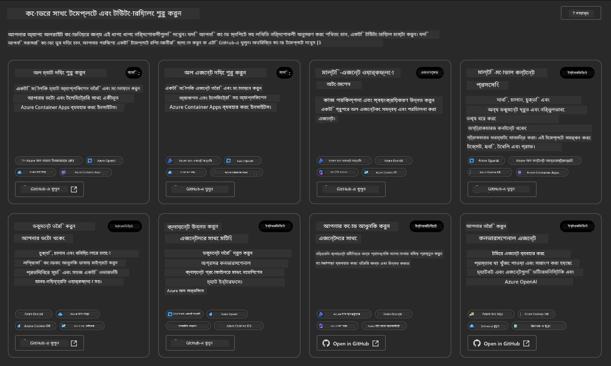

**বেসিক** অপশনগুলো আপনার স্টার্টার টেমপ্লেট:

1. [ ] [AI চ্যাট দিয়ে শুরু করুন](https://github.com/Azure-Samples/get-started-with-ai-chat) যা একটি বেসিক চ্যাট অ্যাপ্লিকেশন _আপনার ডেটা সহ_ Azure Container Apps-এ ডিপ্লয় করে। এটি ব্যবহার করে একটি বেসিক AI চ্যাটবট দৃশ্যপট অন্বেষণ করুন।
1. [X] [AI এজেন্টস দিয়ে শুরু করুন](https://github.com/Azure-Samples/get-started-with-ai-agents) যা একটি স্ট্যান্ডার্ড AI এজেন্ট (Azure AI Agent Service সহ) ডিপ্লয় করে। এটি ব্যবহার করে টুল এবং মডেল অন্তর্ভুক্ত এজেন্টিক AI সলিউশনগুলির সাথে পরিচিত হন।

দ্বিতীয় লিঙ্কটি একটি নতুন ব্রাউজার ট্যাবে পরিদর্শন করুন (অথবা সংশ্লিষ্ট কার্ডের জন্য `Open in GitHub` ক্লিক করুন)। আপনি এই AZD টেমপ্লেটের জন্য রিপোজিটরি দেখতে পাবেন। README অন্বেষণ করতে এক মিনিট সময় নিন। অ্যাপ্লিকেশন আর্কিটেকচার এরকম দেখায়:

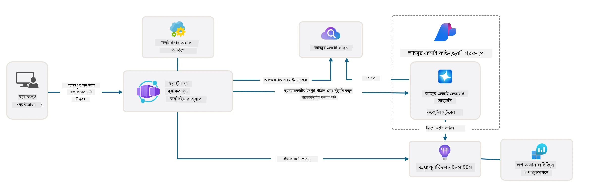

---

## ৩. টেমপ্লেট অ্যাক্টিভেশন

এই টেমপ্লেটটি ডিপ্লয় করার চেষ্টা করুন এবং নিশ্চিত করুন এটি বৈধ। আমরা [Getting Started](https://github.com/Azure-Samples/get-started-with-ai-agents?tab=readme-ov-file#getting-started) সেকশনের নির্দেশিকা অনুসরণ করব।

1. [এই লিঙ্কটি](https://github.com/codespaces/new/Azure-Samples/get-started-with-ai-agents) ক্লিক করুন - ডিফল্ট অ্যাকশন `Create codespace` নিশ্চিত করুন
1. এটি একটি নতুন ব্রাউজার ট্যাব খুলবে - GitHub Codespaces সেশন সম্পূর্ণ লোড হওয়ার জন্য অপেক্ষা করুন
1. Codespaces-এ VS Code টার্মিনাল খুলুন - এই কমান্ডটি টাইপ করুন:

   ```bash title="" linenums="0"
   azd up
   ```

এই ওয়ার্কফ্লো ধাপগুলি সম্পূর্ণ করুন যা এটি ট্রিগার করবে:

1. আপনাকে Azure-এ লগইন করতে বলা হবে - প্রমাণীকরণের জন্য নির্দেশনা অনুসরণ করুন
1. আপনার জন্য একটি ইউনিক পরিবেশ নাম লিখুন - উদাহরণস্বরূপ, আমি `nitya-mshack-azd` ব্যবহার করেছি
1. এটি একটি `.azure/` ফোল্ডার তৈরি করবে - আপনি একটি সাবফোল্ডার দেখতে পাবেন পরিবেশ নাম সহ
1. আপনাকে একটি সাবস্ক্রিপশন নাম নির্বাচন করতে বলা হবে - ডিফল্টটি নির্বাচন করুন
1. আপনাকে একটি অবস্থান নির্বাচন করতে বলা হবে - `East US 2` ব্যবহার করুন

এখন, প্রভিশনিং সম্পূর্ণ হওয়ার জন্য অপেক্ষা করুন। **এটি ১০-১৫ মিনিট সময় নেয়**

1. সম্পন্ন হলে, আপনার কনসোলে একটি SUCCESS বার্তা এরকম দেখাবে:
      ```bash title="" linenums="0"
      SUCCESS: Your up workflow to provision and deploy to Azure completed in 10 minutes 17 seconds.
      ```
1. আপনার Azure পোর্টালে এখন সেই পরিবেশ নাম সহ একটি প্রভিশন করা রিসোর্স গ্রুপ থাকবে:

      

1. **আপনি এখন ডিপ্লয় করা ইনফ্রাস্ট্রাকচার এবং অ্যাপ্লিকেশন যাচাই করতে প্রস্তুত।**

---

## ৪. টেমপ্লেট যাচাই

1. Azure পোর্টালের [Resource Groups](https://portal.azure.com/#browse/resourcegroups) পৃষ্ঠায় যান - লগইন করুন যখন প্রম্পট করা হবে
1. আপনার পরিবেশ নামের RG-তে ক্লিক করুন - আপনি উপরের পৃষ্ঠাটি দেখতে পাবেন

      - Azure Container Apps রিসোর্সে ক্লিক করুন
      - _Essentials_ সেকশনে (উপরে ডানদিকে) Application Url-এ ক্লিক করুন

1. আপনি একটি হোস্ট করা অ্যাপ্লিকেশন ফ্রন্ট-এন্ড UI এরকম দেখতে পাবেন:

   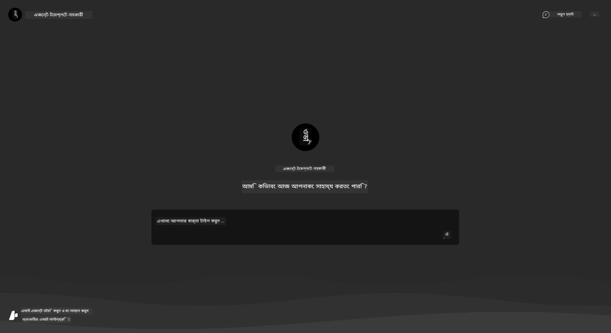

1. কয়েকটি [নমুনা প্রশ্ন](https://github.com/Azure-Samples/get-started-with-ai-agents/blob/main/docs/sample_questions.md) জিজ্ঞাসা করার চেষ্টা করুন

      1. জিজ্ঞাসা করুন: ```ফ্রান্সের রাজধানী কী?``` 
      1. জিজ্ঞাসা করুন: ```দুইজনের জন্য $২০০ এর নিচে সেরা তাঁবু কী, এবং এতে কী বৈশিষ্ট্য রয়েছে?```

1. আপনি এরকম উত্তর পাবেন যা নিচে দেখানো হয়েছে। _কিন্তু এটি কীভাবে কাজ করে?_ 

      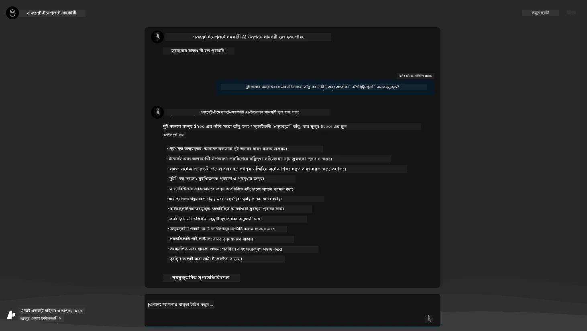

---

## ৫. এজেন্ট যাচাই

Azure Container App একটি এন্ডপয়েন্ট ডিপ্লয় করে যা এই টেমপ্লেটের জন্য Azure AI Foundry প্রকল্পে প্রভিশন করা AI এজেন্টের সাথে সংযুক্ত হয়। আসুন দেখি এর অর্থ কী।

1. আপনার রিসোর্স গ্রুপের জন্য Azure পোর্টালের _Overview_ পৃষ্ঠায় ফিরে যান

1. তালিকায় `Azure AI Foundry` রিসোর্সে ক্লিক করুন

1. আপনি এটি দেখতে পাবেন। `Go to Azure AI Foundry Portal` বোতামে ক্লিক করুন। 
   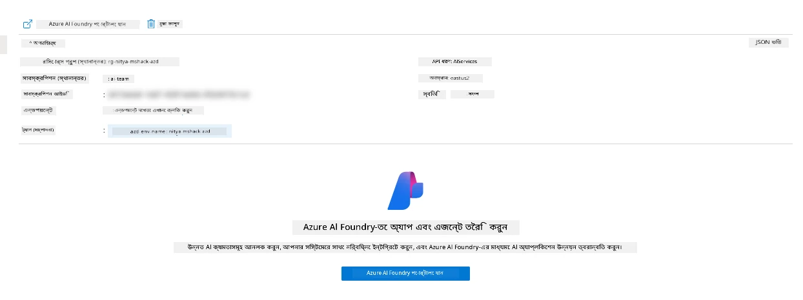

1. আপনি আপনার AI অ্যাপ্লিকেশনের জন্য Foundry Project পৃষ্ঠাটি দেখতে পাবেন
   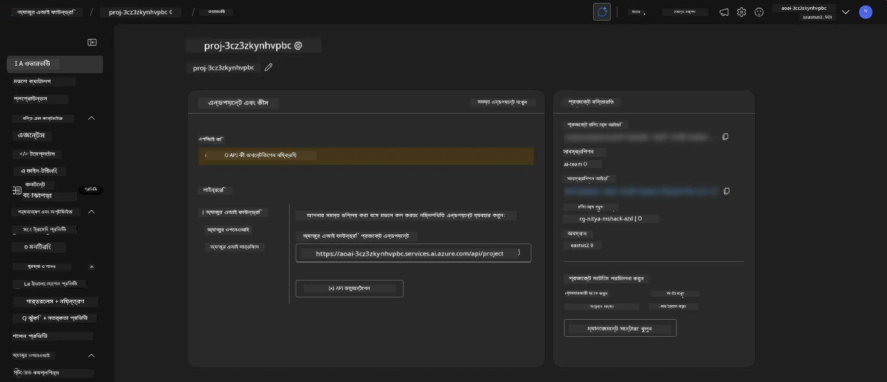

1. `Agents`-এ ক্লিক করুন - আপনি আপনার প্রকল্পে প্রভিশন করা ডিফল্ট এজেন্টটি দেখতে পাবেন
   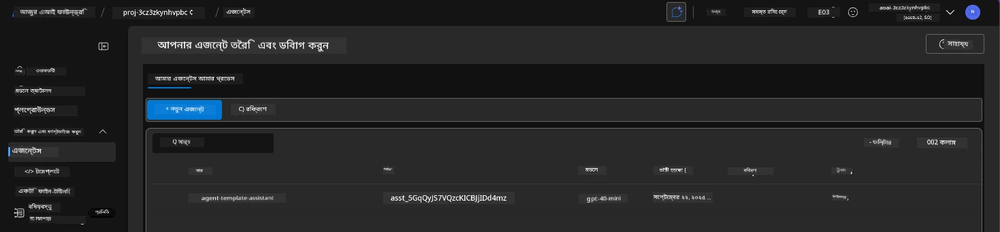

1. এটি নির্বাচন করুন - এবং আপনি এজেন্টের বিস্তারিত দেখতে পাবেন। নিম্নলিখিতগুলি লক্ষ্য করুন:

      - এজেন্ট ডিফল্টভাবে ফাইল সার্চ ব্যবহার করে (সবসময়)
      - এজেন্টের `Knowledge` নির্দেশ করে যে এতে ৩২টি ফাইল আপলোড করা হয়েছে (ফাইল সার্চের জন্য)
      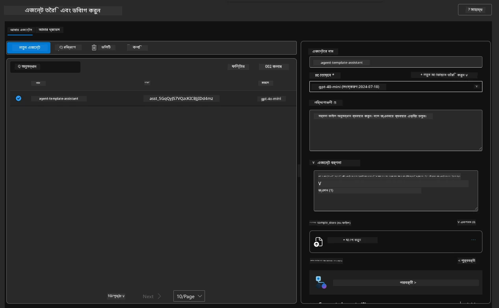

1. বাম মেনুতে `Data+indexes` অপশনটি খুঁজুন এবং বিস্তারিত দেখতে ক্লিক করুন। 

      - আপনি ৩২টি ডেটা ফাইল আপলোড করা দেখতে পাবেন জ্ঞানের জন্য।
      - এগুলি `src/files` এর অধীনে ১২টি কাস্টমার ফাইল এবং ২০টি প্রোডাক্ট ফাইলের সাথে মিলে যাবে।
      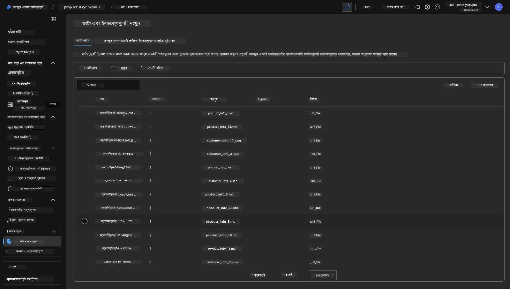

**আপনি এজেন্ট অপারেশন যাচাই করেছেন!**

1. এজেন্টের উত্তরগুলি সেই ফাইলগুলির জ্ঞানের উপর ভিত্তি করে।
1. আপনি এখন সেই ডেটা সম্পর্কিত প্রশ্ন জিজ্ঞাসা করতে পারেন এবং ভিত্তিক উত্তর পেতে পারেন।
1. উদাহরণ: `customer_info_10.json` "Amanda Perez" এর ৩টি কেনাকাটার বর্ণনা দেয়।

Container App এন্ডপয়েন্ট সহ ব্রাউজার ট্যাবে ফিরে যান এবং জিজ্ঞাসা করুন: `Amanda Perez কোন পণ্যগুলি মালিকানাধীন?`। আপনি এরকম কিছু দেখতে পাবেন:

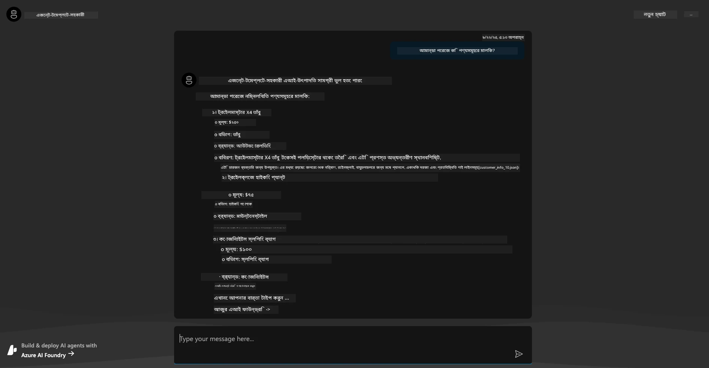

---

## ৬. এজেন্ট প্লেগ্রাউন্ড

Azure AI Foundry-এর ক্ষমতাগুলি সম্পর্কে আরও ধারণা তৈরি করতে, এজেন্টকে এজেন্ট প্লেগ্রাউন্ডে নিয়ে যান।

1. Azure AI Foundry-এ `Agents` পৃষ্ঠায় ফিরে যান - ডিফল্ট এজেন্টটি নির্বাচন করুন
1. `Try in Playground` অপশনটি ক্লিক করুন - আপনি এরকম একটি প্লেগ্রাউন্ড UI পাবেন
1. একই প্রশ্ন জিজ্ঞাসা করুন: `Amanda Perez কোন পণ্যগুলি মালিকানাধীন?`

    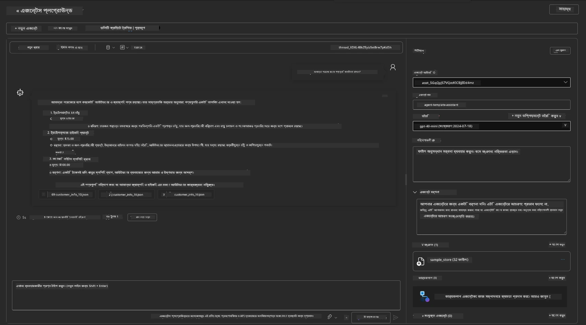

আপনি একই (বা অনুরূপ) উত্তর পাবেন - তবে আপনি অতিরিক্ত তথ্যও পাবেন যা আপনার এজেন্টিক অ্যাপের গুণমান, খরচ এবং কার্যকারিতা বুঝতে সাহায্য করতে পারে। উদাহরণস্বরূপ:

1. লক্ষ্য করুন যে উত্তরটি "গ্রাউন্ড" করার জন্য ব্যবহৃত ডেটা ফাইলগুলি উল্লেখ করে।
1. যেকোনো ফাইল লেবেলের উপর হোভার করুন - আপনার প্রশ্ন এবং প্রদর্শিত উত্তরটির সাথে ডেটা মিলে যায় কি না?

আপনি একটি _স্ট্যাটস_ সারি দেখতে পাবেন উত্তরটির নিচে।

1. যেকোনো মেট্রিকের উপর হোভার করুন - যেমন, Safety। আপনি এরকম কিছু দেখতে পাবেন।
1. উত্তরটির নিরাপত্তা স্তরের জন্য মূল্যায়িত রেটিংটি আপনার ধারণার সাথে মিলে যায় কি না?

      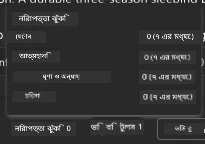

---x

## ৭. বিল্ট-ইন অবজারভেবিলিটি

অবজারভেবিলিটি হলো আপনার অ্যাপ্লিকেশনকে এমনভাবে ইনস্ট্রুমেন্ট করা যাতে এটি ডেটা তৈরি করে যা তার অপারেশন বুঝতে, ডিবাগ করতে এবং অপ্টিমাইজ করতে ব্যবহার করা যায়। এর জন্য একটি ধারণা পেতে:

1. `View Run Info` বোতামে ক্লিক করুন - আপনি এই ভিউটি দেখতে পাবেন। এটি [Agent tracing](https://learn.microsoft.com/en-us/azure/ai-foundry/how-to/develop/trace-agents-sdk#view-trace-results-in-the-azure-ai-foundry-agents-playground) এর একটি উদাহরণ। _আপনি এই ভিউটি Thread Logs-এ ক্লিক করেও পেতে পারেন।_

   - এজেন্ট দ্বারা সম্পন্ন রান ধাপ এবং টুলগুলি সম্পর্কে ধারণা পান।
   - উত্তরটির জন্য মোট টোকেন সংখ্যা (বনাম আউটপুট টোকেন ব্যবহার) বুঝুন।
   - লেটেন্সি এবং এক্সিকিউশনে সময় কোথায় ব্যয় হচ্ছে তা বুঝুন।

      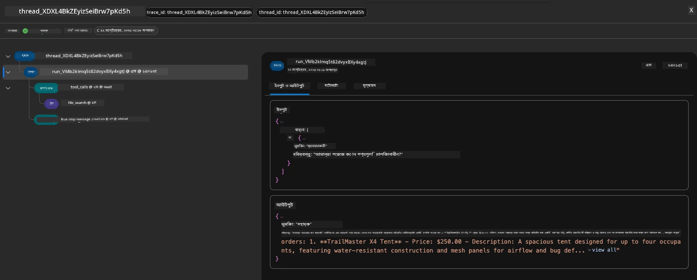

1. `Metadata` ট্যাবে ক্লিক করুন রানটির জন্য অতিরিক্ত অ্যাট্রিবিউট দেখতে, যা পরে সমস্যা ডিবাগ করার জন্য দরকারী প্রসঙ্গ প্রদান করতে পারে।   

      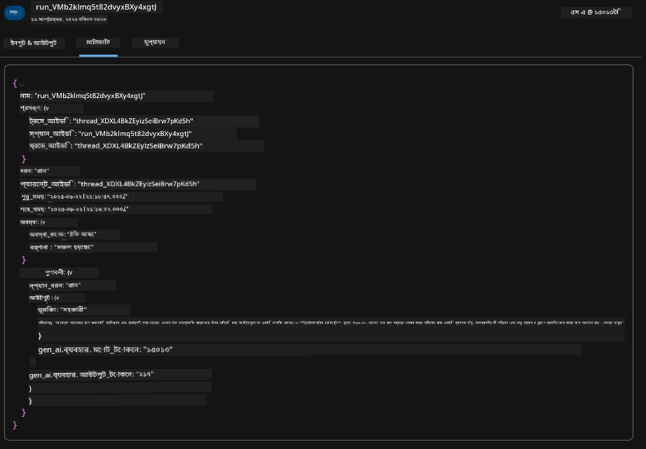

1. `Evaluations` ট্যাবে ক্লিক করুন এজেন্টের উত্তরটির উপর করা স্বয়ংক্রিয় মূল্যায়ন দেখতে। এর মধ্যে নিরাপত্তা মূল্যায়ন (যেমন, Self-harm) এবং এজেন্ট-নির্দিষ্ট মূল্যায়ন (যেমন, Intent resolution, Task adherence) অন্তর্ভুক্ত।

      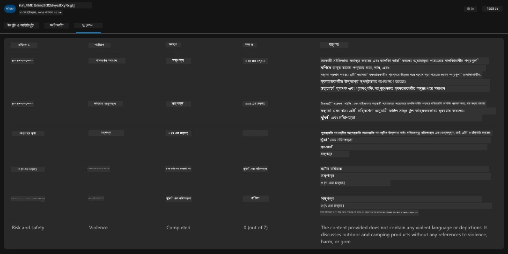

1. সর্বশেষে, সাইডবার মেনুতে `Monitoring` ট্যাবে ক্লিক করুন।

      - প্রদর্শিত পৃষ্ঠায় `Resource usage` ট্যাব নির্বাচন করুন - এবং মেট্রিকগুলি দেখুন।
      - খরচ (টোকেন) এবং লোড (রিকোয়েস্ট) এর ক্ষেত্রে অ্যাপ্লিকেশন ব্যবহার ট্র্যাক করুন।
      - প্রথম বাইট (ইনপুট প্রসেসিং) এবং শেষ বাইট (আউটপুট) পর্যন্ত অ্যাপ্লিকেশন লেটেন্সি ট্র্যাক করুন।

      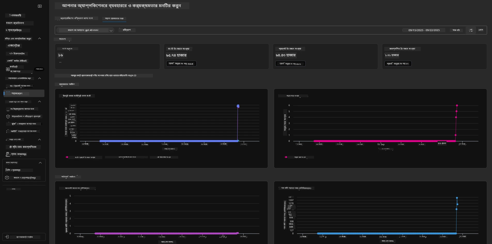

---

## ৮. পরিবেশ ভেরিয়েবল

এখন পর্যন্ত, আমরা ব্রাউজারে ডিপ্লয়মেন্টের মাধ্যমে হাঁটলাম - এবং যাচাই করলাম যে আমাদের ইনফ্রাস্ট্রাকচার প্রভিশন করা হয়েছে এবং অ্যাপ্লিকেশন কার্যকর। কিন্তু অ্যাপ্লিকেশনটি _কোড-ফার্স্ট_ দিয়ে কাজ করতে, আমাদের স্থানীয় ডেভেলপমেন্ট পরিবেশ কনফিগার করতে হবে প্রাসঙ্গিক ভেরিয়েবলগুলির সাথে যা এই রিসোর্সগুলির সাথে কাজ করার জন্য প্রয়োজন। `azd` ব্যবহার করে এটি সহজ হয়ে যায়।

1. Azure Developer CLI [পরিবেশ ভেরিয়েবল ব্যবহার করে](https://learn.microsoft.com/en-us/azure/developer/azure-developer-cli/manage-environment-variables?tabs=bash) অ্যাপ্লিকেশন ডিপ্লয়মেন্টের জন্য কনফিগারেশন সেটিংস সংরক্ষণ এবং পরিচালনা করতে।

1. পরিবেশ ভেরিয়েবল `.azure/<env-name>/.env`-এ সংরক্ষণ করা হয় - এটি ডিপ্লয়মেন্টের সময় ব্যবহৃত `env-name` পরিবেশে স্কোপ করে এবং একই রিপোজিটরিতে বিভিন্ন ডিপ্লয়মেন্ট টার্গেটের মধ্যে পরিবেশ আলাদা করতে সাহায্য করে।

1. পরিবেশ ভেরিয়েবলগুলি `azd` কমান্ড দ্বারা স্বয়ংক্রিয়ভাবে লোড করা হয় যখন এটি একটি নির্দিষ্ট কমান্ড কার্যকর করে (যেমন, `azd up`)। লক্ষ্য করুন যে `azd` _OS-স্তরের_ পরিবেশ ভেরিয়েবল (যেমন, শেলে সেট করা) স্বয়ংক্রিয়ভাবে পড়ে না - পরিবর্তে স্ক্রিপ্টের মধ্যে তথ্য স্থানান্তর করতে `azd set env` এবং `azd get env` ব্যবহার করুন।

কিছু কমান্ড চেষ্টা করুন:

1. এই পরিবেশে `azd` এর জন্য সেট করা সমস্ত পরিবেশ ভেরিয়েবল পান:

      ```bash title="" linenums="0"
      azd env get-values
      ```
      
      আপনি এরকম কিছু দেখতে পাবেন:

      ```bash title="" linenums="0"
      AZURE_AI_AGENT_DEPLOYMENT_NAME="gpt-4o-mini"
      AZURE_AI_AGENT_NAME="agent-template-assistant"
      AZURE_AI_EMBED_DEPLOYMENT_NAME="text-embedding-3-small"
      AZURE_AI_EMBED_DIMENSIONS=100
      ...
      ```

1. একটি নির্দিষ্ট মান পান - উদাহরণস্বরূপ, আমি জানতে চাই যে আমরা `AZURE_AI_AGENT_MODEL_NAME` মানটি সেট করেছি কি না।

      ```bash title="" linenums="0"
      azd env get-value AZURE_AI_AGENT_MODEL_NAME 
      ```
      
      আপনি এরকম কিছু দেখতে পাবেন - এটি ডিফল্টভাবে সেট করা হয়নি!

      ```bash title="" linenums="0"
      ERROR: key 'AZURE_AI_AGENT_MODEL_NAME' not found in the environment values
      ```

1. `azd` এর জন্য একটি নতুন পরিবেশ ভেরিয়েবল সেট করুন। এখানে, আমরা এজেন্ট মডেল নাম আপডেট করি। _নোট: করা যেকোনো পরিবর্তন `.azure/<env-name>/.env` ফাইলে সাথে সাথে প্রতিফলিত হবে।

      ```bash title="" linenums="0"
      azd env set AZURE_AI_AGENT_MODEL_NAME gpt-4.1
      azd env set AZURE_AI_AGENT_MODEL_VERSION 2025-04-14
      azd env set AZURE_AI_AGENT_DEPLOYMENT_CAPACITY 150
      ```

      এখন, আমরা দেখতে পাব মানটি সেট করা হয়েছে:

      ```bash title="" linenums="0"
      azd env get-value AZURE_AI_AGENT_MODEL_NAME 
      ```

1. লক্ষ্য করুন যে কিছু রিসোর্স স্থায়ী (যেমন, মডেল ডিপ্লয়মেন্ট) এবং শুধুমাত্র একটি `azd up` দিয়ে পুনরায় ডিপ্লয়মেন্ট বাধ্য করতে আরও কিছু প্রয়োজন হবে। আসুন মূল ডিপ্লয়মেন্টটি টিয়ার ডাউন করি এবং পরিবর্তিত পরিবেশ ভেরিয়েবল সহ পুনরায় ডিপ্লয় করি।

1. **রিফ্রেশ** যদি আপনি পূর্বে একটি azd টেমপ্লেট ব্যবহার করে ইনফ্রাস্ট্রাকচার ডিপ্লয় করে থাকেন - আপনি এই কমান্ডটি ব্যবহার করে আপনার Azure ডিপ্লয়মেন্টের বর্তমান অবস্থার উপর ভিত্তি করে আপনার স্থানীয় পরিবেশ ভেরিয়েবলগুলির অবস্থা _রিফ্রেশ_ করতে পারেন:
      ```bash title="" linenums="0"
      azd env refresh
      ```

      এটি একটি শক্তিশালী উপায় যা পরিবেশ ভেরিয়েবলগুলোকে একাধিক স্থানীয় ডেভেলপমেন্ট পরিবেশের মধ্যে (_sync_) করতে সাহায্য করে (যেমন, একাধিক ডেভেলপারদের সমন্বয়ে গঠিত দল) - যেখানে ডিপ্লয় করা অবকাঠামো পরিবেশ ভেরিয়েবলের অবস্থার জন্য মূল সত্য হিসেবে কাজ করে। দলের সদস্যরা সহজেই ভেরিয়েবলগুলো _refresh_ করে আবার সিঙ্কে ফিরে আসতে পারেন।

---

## 9. অভিনন্দন 🏆

আপনি একটি সম্পূর্ণ প্রক্রিয়া সম্পন্ন করেছেন যেখানে আপনি:

- [X] AZD টেমপ্লেট নির্বাচন করেছেন যা আপনি ব্যবহার করতে চান
- [X] GitHub Codespaces দিয়ে টেমপ্লেট চালু করেছেন
- [X] টেমপ্লেট ডিপ্লয় করেছেন এবং নিশ্চিত করেছেন যে এটি কাজ করছে

---

