# 2. একটি টেমপ্লেট যাচাই করুন

> মার্চ ২০২৬-এ `azd 1.23.12` এর বিরুদ্ধে যাচাই করা হয়েছে।

!!! tip "এই মডিউলের শেষে আপনি সক্ষম হবেন"

    - [ ] AI সল্যুশন আর্কিটেকচার বিশ্লেষণ করতে
    - [ ] AZD ডিপ্লয়মেন্ট ওয়ার্কফ্লো বুঝতে
    - [ ] AZD ব্যবহারে সাহায্যের জন্য GitHub Copilot ব্যবহার করতে
    - [ ] **ল্যাব ২:** AI এজেন্টস টেমপ্লেট ডিপ্লয় ও যাচাই করতে

---


## 1. পরিচিতি

[Azure Developer CLI](https://learn.microsoft.com/en-us/azure/developer/azure-developer-cli/) বা `azd` হল একটি ওপেন-সোর্স কমান্ডলাইন টুল যা অ্যাজিউরে অ্যাপ্লিকেশন তৈরি ও ডিপ্লয় করার সময় ডেভেলপারের কাজের প্রক্রিয়াকে সহজ করে তোলে।

[AZD টেমপ্লেটগুলি](https://learn.microsoft.com/azure/developer/azure-developer-cli/azd-templates) স্ট্যান্ডার্ডাইজড রিপোজিটোরি যা নমুনা অ্যাপ্লিকেশন কোড, _ইনফ্রাস্ট্রাকচার-যথা-কোড_ অ্যাসেট এবং `azd` কনফিগারেশন ফাইল সমন্বিত করে একটি সুসংহত সল্যুশন আর্কিটেকচারের জন্য। ইনফ্রাস্ট্রাকচার প্রোভিশন করা `azd provision` কমান্ডের মতো সহজ — আর `azd up` ব্যবহার করলে আপনি একসঙ্গে ইনফ্রাস্ট্রাকচার **এবং** আপনার অ্যাপ্লিকেশন ডিপ্লয় করতে পারবেন!

ফলে, আপনার অ্যাপ্লিকেশন ডেভেলপমেন্ট প্রক্রিয়া শুরু করা সহজ হতে পারে সঠিক _AZD স্টার্টার টেমপ্লেট_ খুঁজে পাওয়া যা আপনার অ্যাপ্লিকেশন ও ইনফ্রাস্ট্রাকচার চাহিদার সাথে সবচেয়ে কাছাকাছি — এবং তারপর রিপোজিটোরিটিকে আপনার পরিস্থিতির প্রয়োজন অনুসারে কাস্টমাইজ করা।

শুরু করার আগে, আসুন নিশ্চিত করি আপনার কাছে Azure Developer CLI ইনস্টল আছে।

1. একটি VS Code টার্মিনাল খুলুন এবং এই কমান্ডটি টাইপ করুন:

      ```bash title="" linenums="0"
      azd version
      ```

1. আপনি এরকম কিছু দেখতে পাবেন!

      ```bash title="" linenums="0"
      azd version 1.23.12 (commit <current-build>)
      ```

**আপনি এখন azd দিয়ে একটি টেমপ্লেট সিলেক্ট ও ডিপ্লয় করার জন্য প্রস্তুত**

---

## 2. টেমপ্লেট নির্বাচন

Microsoft Foundry প্ল্যাটফর্মের সাথে আসে [সুপারিশকৃত AZD টেমপ্লেটের একটি সেট](https://learn.microsoft.com/en-us/azure/ai-foundry/how-to/develop/ai-template-get-started) যা জনপ্রিয় সল্যুশন পরিস্থিতি যেমন _মাল্টি-এজেন্ট ওয়ার্কফ্লো অটোমেশন_ এবং _মাল্টি-মোডাল কনটেন্ট প্রসেসিং_ কাভার করে। আপনি Microsoft Foundry পোর্টালেও এই টেমপ্লেটগুলি খুঁজে পেতে পারেন।

1. যাবেন [https://ai.azure.com/templates](https://ai.azure.com/templates)
1. প্রম্পট পেলে Microsoft Foundry পোর্টালে লগইন করুন - আপনি এরকম কিছু দেখতে পাবেন।

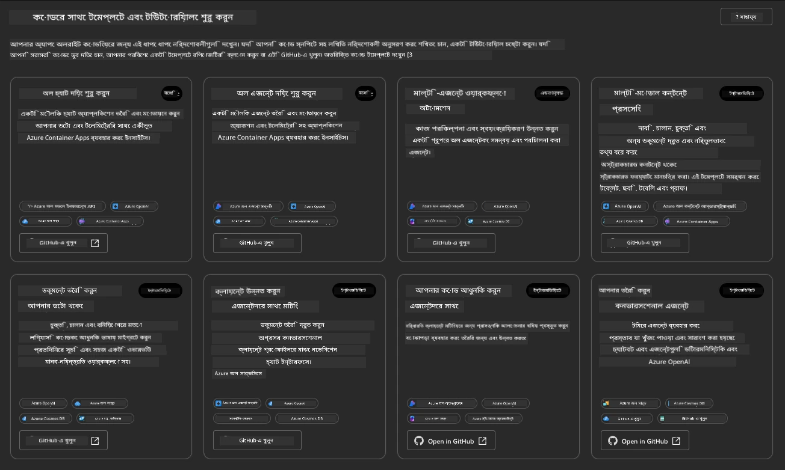


**Basic** অপশনগুলো আপনার স্টার্টার টেমপ্লেটগুলি:

1. [ ] [AI Chat দিয়ে শুরু করুন](https://github.com/Azure-Samples/get-started-with-ai-chat) যা একটি মৌলিক চ্যাট অ্যাপ্লিকেশন আপনার ডেটাসহ Azure Container Apps-এ ডিপ্লয় করে। একটি মৌলিক AI চ্যাটবট পরিস্থিতি অন্বেষণ করতে এটি ব্যবহার করুন।
1. [X] [AI Agents দিয়ে শুরু করুন](https://github.com/Azure-Samples/get-started-with-ai-agents) যা একটি স্ট্যান্ডার্ড AI Agent (Foundry Agents সহ) ডিপ্লয় করে। টুল ও মডেল সম্বলিত এজেন্টিক AI সল্যুশন সম্পর্কে পরিচিত হতে এটি ব্যবহার করুন।

দ্বিতীয় লিঙ্কটি একটি নতুন ব্রাউজার ট্যাবে খুলুন (বা সংশ্লিষ্ট কার্ডে `Open in GitHub` ক্লিক করুন)। আপনি এই AZD টেমপ্লেটের রিপোজিটোরি দেখতে পাবেন। README এক মিনিট ধরে পরীক্ষা করুন। অ্যাপ্লিকেশন আর্কিটেকচার এরকম দেখায়:

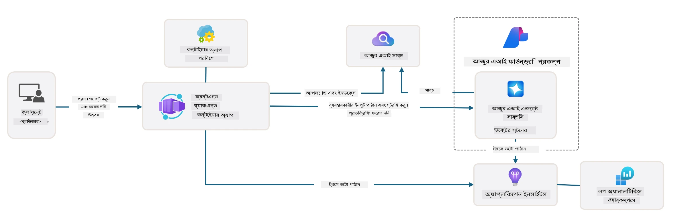

---

## 3. টেমপ্লেট অ্যাক্টিভেশন

চলুন এই টেমপ্লেটটি ডিপ্লয় করার চেষ্টা করি এবং নিশ্চিত হই এটি বৈধ কিনা। আমরা [Getting Started](https://github.com/Azure-Samples/get-started-with-ai-agents?tab=readme-ov-file#getting-started) পরামর্শ মেনে চলব।

1. টেমপ্লেট রিপোজিটোরির জন্য একটি কাজের পরিবেশ নির্বাচন করুন:

      - **GitHub Codespaces**: [এই লিঙ্কে](https://github.com/codespaces/new/Azure-Samples/get-started-with-ai-agents) ক্লিক করুন এবং `Create codespace` নিশ্চিত করুন
      - **লোকাল ক্লোন বা ডেভ কন্টেইনার**: `Azure-Samples/get-started-with-ai-agents` ক্লোন করুন এবং VS Code-এ খুলুন

1. অপেক্ষা করুন যতক্ষণ না VS Code টার্মিনাল প্রস্তুত হয়, তারপরে এই কমান্ডটি টাইপ করুন:

   ```bash title="" linenums="0"
   azd up
   ```

যে ওয়ার্কফ্লো স্টেপগুলো ট্রিগার হবে সেগুলো সম্পূর্ণ করুন:

1. Azure-এ লগইন করার জন্য প্রম্পট আসবে - নির্দেশাবলী অনুসরণ করে প্রমাণীকরণ করুন
1. আপনার জন্য একটি ইউনিক পরিবেশ নাম লিখুন - উদাহরণস্বরূপ, আমি `nitya-mshack-azd` ব্যবহার করেছি
1. এটি একটি `.azure/` ফোল্ডার তৈরি করবে - আপনি পরিবেশ নামের একটি সাবফোল্ডার দেখতে পাবেন
1. একটি সাবস্ক্রিপশন নাম নির্বাচন করতে প্রম্পট আসবে - ডিফল্ট নির্বাচন করুন
1. একটি লোকেশন নির্বাচন করতে বলবে - `East US 2` ব্যবহার করুন

এখন, provisioning সম্পূর্ণ হওয়ার জন্য অপেক্ষা করুন। **এটি ১০-১৫ মিনিট সময় নিতে পারে**

1. হলে, আপনার কনসোল SUCCESS মেসেজ দেখাবে এরকম:
      ```bash title="" linenums="0"
      SUCCESS: Your up workflow to provision and deploy to Azure completed in 10 minutes 17 seconds.
      ```
1. এখন আপনার Azure পোর্টালে ঐ পরিবেশ নামের একটি provisioned রিসোর্স গ্রুপ থাকবে:

      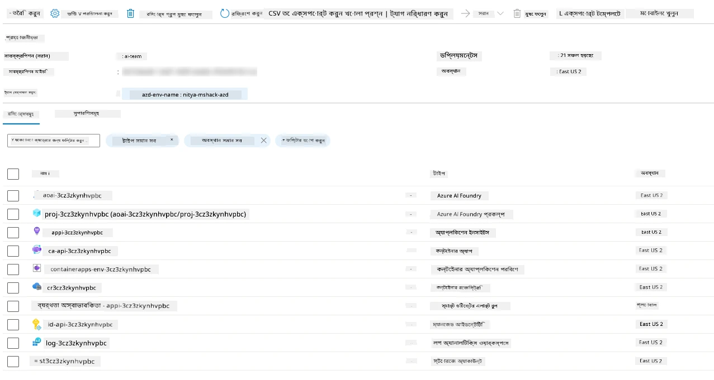

1. **আপনি এখন ডিপ্লয় করা ইনফ্রাস্ট্রাকচার এবং অ্যাপ্লিকেশন যাচাই করার জন্য প্রস্তুত**।

---

## 4. টেমপ্লেট যাচাই

1. Azure পোর্টাল [Resource Groups](https://portal.azure.com/#browse/resourcegroups) পেজ দেখুন - প্রম্পট পেলে লগ ইন করুন
1. আপনার পরিবেশ নামের RG-তে ক্লিক করুন - আপনি উপরের পেজটি দেখতে পাবেন

      - Azure Container Apps রিসোর্সে ক্লিক করুন
      - _Essentials_ সেকশনের উপরের ডানে Application Url-এ ক্লিক করুন

1. আপনি এরকম একটি হোস্ট করা অ্যাপ্লিকেশনের ফ্রন্ট-এন্ড UI দেখতে পাবেন:

   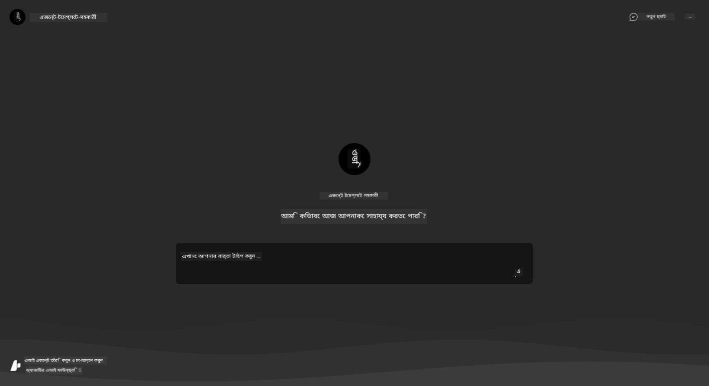

1. কয়েকটি [নমুনা প্রশ্ন](https://github.com/Azure-Samples/get-started-with-ai-agents/blob/main/docs/sample_questions.md) জিজ্ঞাসা করে দেখুন

      1. জিজ্ঞাসা করুন: ```ফ্রান্সের রাজধানী কোথায়?``` 
      1. জিজ্ঞাসা করুন: ```২ জনের জন্য $২০০ এর নিচে সবচেয়ে ভালো টেন্ট কোনটি, এবং এতে কি ফিচার রয়েছে?```

1. আপনি নীচে প্রদর্শিত উত্তরগুলোর মতো উত্তর পাবেন। _কিন্তু এটা কীভাবে কাজ করে?_

      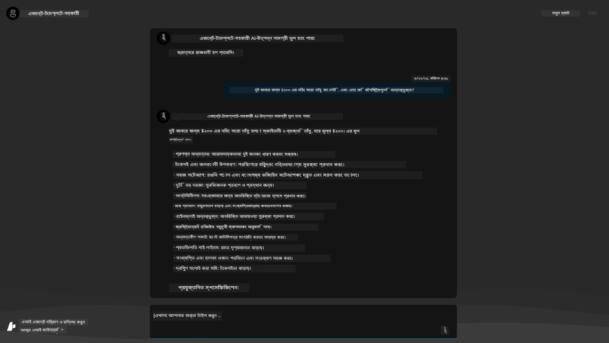

---

## 5. এজেন্ট যাচাই

Azure Container App একটি এন্ডপয়েন্ট ডিপ্লয় করে যা এই টেমপ্লেটের জন্য Microsoft Foundry প্রজেক্টে প্রোভিশন করা AI Agent-এর সাথে সংযুক্ত হয়। আসুন দেখি এর মানে কী।

1. আপনার রিসোর্স গ্রুপের Azure পোর্টাল _Overview_ পেজে ফিরে যান

1. তালিকায় থাকা `Microsoft Foundry` রিসোর্সে ক্লিক করুন

1. আপনি এটি দেখতে পাবেন। `Go to Microsoft Foundry Portal` বাটনে ক্লিক করুন। 
   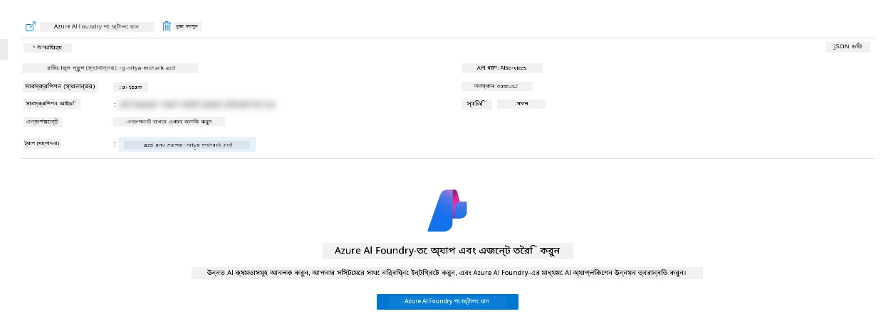

1. আপনার AI অ্যাপ্লিকেশনের Foundry Project পেজ দেখুন
   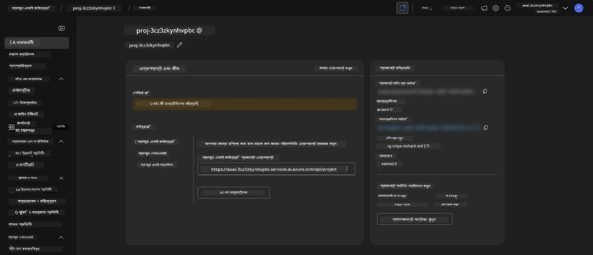

1. `Agents` ক্লিক করুন - আপনি ডিফল্ট এজেন্টটি দেখতে পাবেন যা আপনার প্রজেক্টে প্রোভিশন করা আছে
   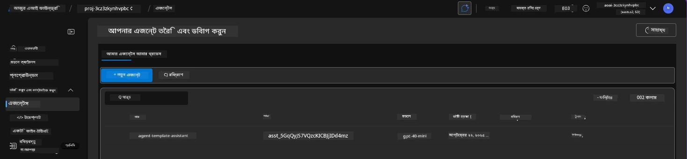

1. সেটি সিলেক্ট করুন - তখন আপনি এজেন্টের বিস্তারিত দেখতে পাবেন। নিচের বিষয়গুলো লক্ষ্য করুন:

      - এজেন্ট ডিফল্টরূপে File Search ব্যবহার করে (সর্বদা)
      - এজেন্ট `Knowledge` নির্দেশ করে এতে ৩২টি ফাইল আপলোড করা হয়েছে (ফাইল সার্চের জন্য)
      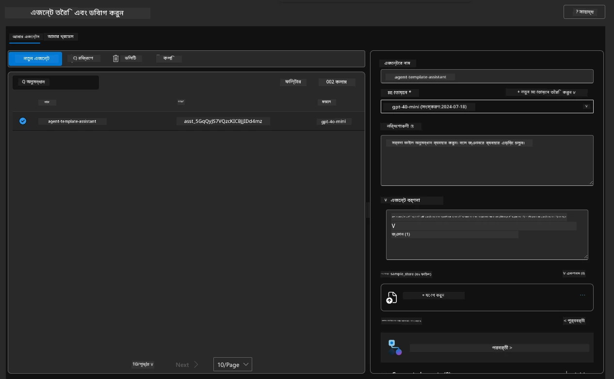

1. বাম মেনুতে `Data+indexes` অপশন খুঁজুন এবং বিস্তারিত দেখতে ক্লিক করুন। 

      - আপনি জ্ঞানের জন্য আপলোডকৃত ৩২টি ডেটা ফাইল দেখতে পাবেন।
      - এগুলো `src/files` এর অধীনে ১২টি কাস্টমার ফাইল এবং ২০টি প্রোডাক্ট ফাইলের সাথে মিলে যাবে
      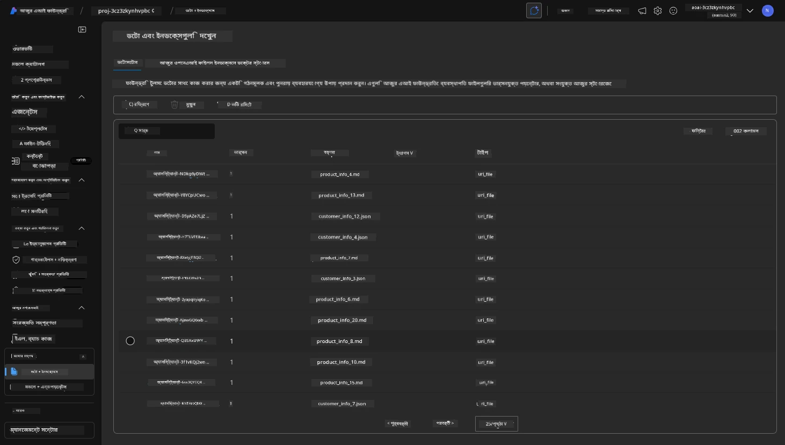

**আপনি এজেন্টের অপারেশন যাচাই করেছেন!**

1. এজেন্টের উত্তরগুলি ওই ফাইলগুলির জ্ঞানের উপর ভিত্তি করে।
1. আপনি এখন ঐ ডেটাসংক্রান্ত প্রশ্ন করতে পারেন এবং ভিত্তিপ্রাপ্ত উত্তর পেতে পারেন।
1. উদাহরণ: `customer_info_10.json` এ "Amanda Perez" এর ৩টি ক্রয় বর্ণনা করা হয়েছে।

ব্রাউজার ট্যাবের Container App এন্ডপয়েন্ট আবার দেখুন এবং জিজ্ঞাসা করুন: `Amanda Perez কোন পণ্যগুলি মালিকানা করে?`। আপনি এরকম কিছু দেখতে পাবেন:

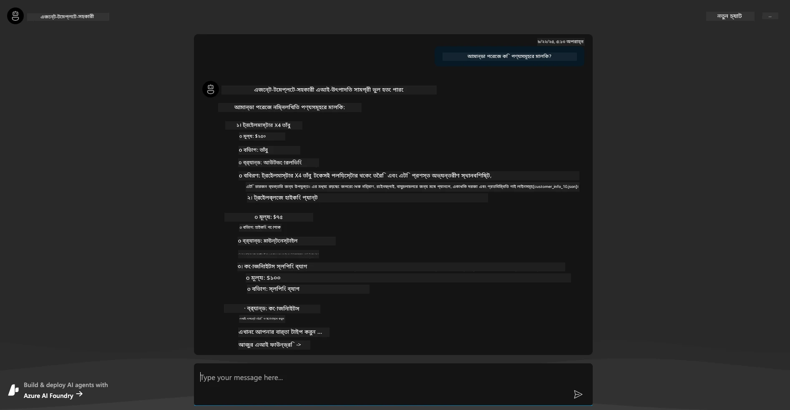

---

## 6. এজেন্ট প্লেগ্রাউন্ড

Microsoft Foundry-এর সক্ষমতা সম্পর্কে আরও অনুভূতি পেতে, এজেন্টকে Agents Playground-এ চালিয়ে দেখি।

1. Microsoft Foundry-তে `Agents` পেজে ফিরে যান - ডিফল্ট এজেন্ট সিলেক্ট করুন
1. `Try in Playground` অপশনে ক্লিক করুন - আপনি এরকম একটি প্লেগ্রাউন্ড UI পাবেন
1. একই প্রশ্ন জিজ্ঞাসা করুন: `Amanda Perez কোন পণ্যগুলি মালিকানা করে?`

    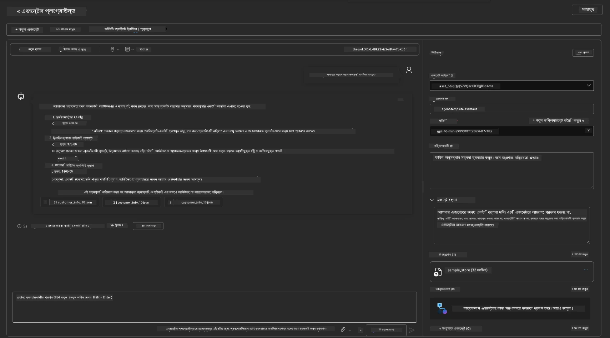

আপনি একই (অথবা অনুরূপ) উত্তর পাবেন - তবে আপনি অতিরিক্ত তথ্য পাবেন যা আপনার এজেন্টিক অ্যাপের গুণমান, খরচ, এবং কর্মক্ষমতা বুঝতে সাহায্য করবে। উদাহরণস্বরূপ:

1. লক্ষ্য করুন উত্তরটি কোন ডেটা ফাইল ব্যবহার করে "ground" করা হয়েছে
1. যেকোনো ফাইল লেবেলের উপর মাউস নিয়ে যান - ডেটা আপনার প্রশ্ন ও প্রদর্শিত উত্তরের সাথে মেলে কিনা দেখুন?

আপনি উত্তর নীচে একটি _stats_ সারি দেখতে পাবেন।

1. যেকোনো মেট্রিকের উপর হোভার করুন - যেমন Safety। এরকম কিছু দেখতে পাবেন
1. মূল্যায়িত রেটিং আপনার উত্তরের নিরাপত্তা স্তরের অনুভূতির সাথে মেলে কিনা যাচাই করুন।

      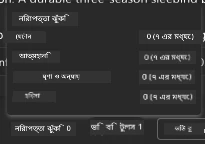

---

## 7. বিল্ট-ইন পর্যবেক্ষণক্ষমতা

পর্যবেক্ষণযোগ্যতা হল আপনার অ্যাপ্লিকেশনকে ডেটা তৈরি করার জন্য ইনস্ট্রুমেন্টেশন করা যা এর অপারেশনগুলো বুঝতে, ডিবাগ করতে এবং অপটিমাইজ করতে ব্যবহার করা যায়। এর একটি ধারণা পেতে:

1. `View Run Info` বাটনে ক্লিক করুন - আপনি এই ভিউ দেখতে পাবেন। এটি [Agent tracing](https://learn.microsoft.com/en-us/azure/ai-foundry/how-to/develop/trace-agents-sdk#view-trace-results-in-the-azure-ai-foundry-agents-playground) এর একটি উদাহরণ। _এটি top-level মেনু থেকে Thread Logs ক্লিক করেও দেখতে পারেন_।

   - এজেন্টের চালিত ধাপ ও টুলগুলো বুঝুন
   - সম্পূর্ণ Token সংখ্যা (তুলনায় আউটপুট টোকেন ব্যবহারের সাথে) বুঝুন উত্তর জন্য
   - ল্যাটেন্সি ও এক্সিকিউশনে সময় কোথায় ব্যয় হচ্ছে তা বুঝুন

      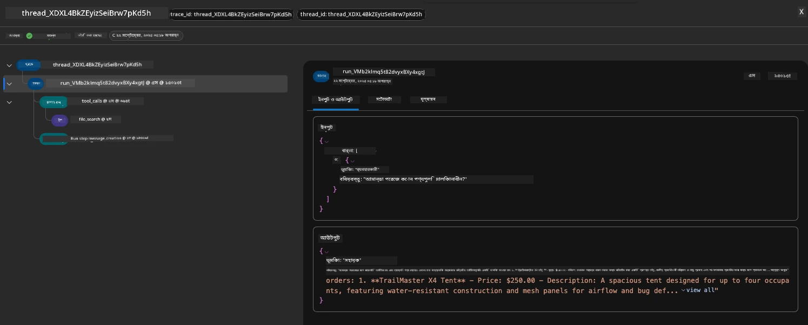

1. `Metadata` ট্যাবে ক্লিক করুন রান সম্পর্কিত অতিরিক্ত বৈশিষ্ট্য দেখতে, যা ভবিষ্যতে ডিবাগিংয়ের জন্য প্রাসঙ্গিক হতে পারে।

      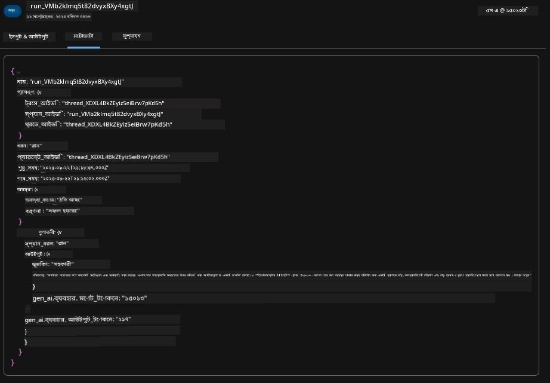


1. `Evaluations` ট্যাবে ক্লিক করুন এজেন্টের উত্তরগুলির অটো-আসেসমেন্ট দেখতে। এতে সেফটি মূল্যায়ন (যেমন, আত্ম-ক্ষতি) এবং এজেন্ট-নির্দিষ্ট মূল্যায়ন (যেমন, উদ্দেশ্য সমাধান, টাস্ক অনুগমন) অন্তর্ভুক্ত থাকে।

      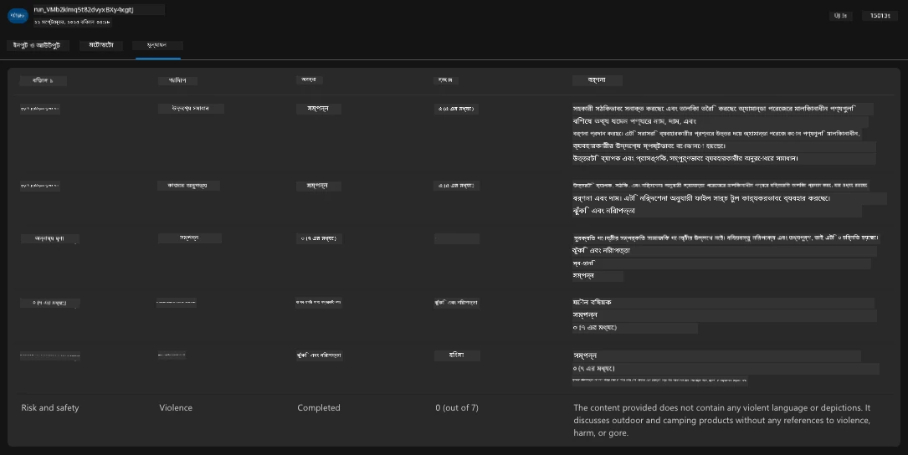

1. শেষেই, সাইডবারে `Monitoring` ট্যাবে ক্লিক করুন।

      - প্রদর্শিত পেজে `Resource usage` ট্যাব নির্বাচন করুন এবং মেট্রিক্স দেখুন।
      - খরচ (টোকেন) এবং লোড (রিকোয়েস্ট) অনুযায়ী অ্যাপ্লিকেশনের ব্যবহার ট্র্যাক করুন।
      - প্রথম বাইট (ইনপুট প্রসেসিং) এবং শেষ বাইট (আউটপুট) ল্যাটেন্সি ট্র্যাক করুন।

      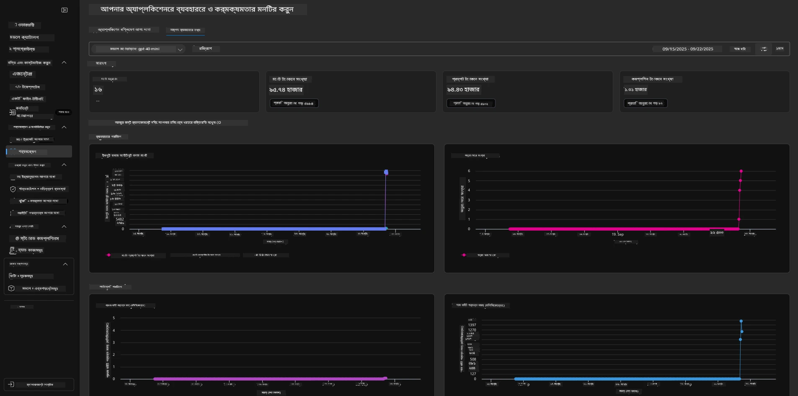

---

## 8. পরিবেশ ভেরিয়েবলসমূহ

এখন পর্যন্ত, আমরা ব্রাউজারে ডিপ্লয়মেন্ট করেছি — এবং যাচাই করেছি যে আমাদের ইনফ্রাস্ট্রাকচার প্রোভিশন করা হয়েছে এবং অ্যাপ্লিকেশন সেট চলছে। কিন্তু কোড-প্রথম কাজ করতে, আমাদের লোকাল ডেভেলপমেন্ট পরিবেশ কনফিগার করতে হবে প্রাসঙ্গিক ভেরিয়েবলগুলো দিয়ে যা এই রিসোর্সগুলো নিয়ে কাজ করতে দরকার। `azd` ব্যবহার করে এটি সহজ।

1. Azure Developer CLI [পরিবেশ ভেরিয়েবল ব্যবহার করে](https://learn.microsoft.com/en-us/azure/developer/azure-developer-cli/manage-environment-variables?tabs=bash) অ্যাপ্লিকেশন ডিপ্লয়মেন্টের জন্য কনফিগারেশন সেটিংস সংরক্ষণ ও ম্যানেজ করতে।

1. পরিবেশ ভেরিয়েবলগুলো `.azure/<env-name>/.env` ফাইলে সংরক্ষিত হয় - এটি পরিবেশনামক `env-name` পরিবেশের জন্য স্কোপ করে এবং একই রিপোজিটোতে বিভিন্ন ডিপ্লয়মেন্ট টার্গেটের মধ্যে পরিবেশ আলাদা রাখতে সাহায্য করে।

1. `azd` কমান্ড যখনই কোনও নির্দিষ্ট কমান্ড চালায় (যেমন, `azd up`), তখন পরিবেশ ভেরিয়েবলগুলো স্বয়ংক্রিয়ভাবে লোড হয়। লক্ষ্য করুন `azd` স্বয়ংক্রিয়ভাবে _OS-লেভেল_ পরিবেশ ভেরিয়েবলগুলো পড়ে না (যেমন শেলে সেট করা) — এর পরিবর্তে `azd set env` এবং `azd get env` ব্যবহার করুন স্ক্রিপ্টে তথ্য স্থানান্তরের জন্য।

কিছু কমান্ড চেষ্টা করে দেখি:

1. এই পরিবেশে `azd` এর জন্য সব পরিবেশ ভেরিয়েবল পাওয়া যাবে:

      ```bash title="" linenums="0"
      azd env get-values
      ```
      
      আপনি এরকম কিছু দেখতে পাবেন:

      ```bash title="" linenums="0"
      AZURE_AI_AGENT_DEPLOYMENT_NAME="gpt-4.1-mini"
      AZURE_AI_AGENT_NAME="agent-template-assistant"
      AZURE_AI_EMBED_DEPLOYMENT_NAME="text-embedding-3-small"
      AZURE_AI_EMBED_DIMENSIONS=100
      ...
      ```

1. নির্দিষ্ট একটি ভেলু পান - উদাহরণস্বরূপ, আমি জানতে চাই `AZURE_AI_AGENT_MODEL_NAME` ভেরিয়েবল সেট করা আছে কিনা

      ```bash title="" linenums="0"
      azd env get-value AZURE_AI_AGENT_MODEL_NAME 
      ```
      
      আপনি এরকম কিছু দেখতে পাবেন - এটি ডিফল্টরূপে সেট ছিল না!

      ```bash title="" linenums="0"
      ERROR: key 'AZURE_AI_AGENT_MODEL_NAME' not found in the environment values
      ```

1. `azd` এর জন্য একটি নতুন পরিবেশ ভেরিয়েবল সেট করুন। এখানে, আমরা এজেন্ট মডেল নাম আপডেট করলাম। _দ্রষ্টব্য: যেকোনো পরিবর্তন `.azure/<env-name>/.env` ফাইলে তৎক্ষণাৎ প্রতিফলিত হয়।

      ```bash title="" linenums="0"
      azd env set AZURE_AI_AGENT_MODEL_NAME gpt-4.1
      azd env set AZURE_AI_AGENT_MODEL_VERSION 2025-04-14
      azd env set AZURE_AI_AGENT_DEPLOYMENT_CAPACITY 150
      ```

      এখন, আমরা দেখতে পাবো এটি সেট হয়েছে:

      ```bash title="" linenums="0"
      azd env get-value AZURE_AI_AGENT_MODEL_NAME 
      ```

1. লক্ষ্য করুন কিছু রিসোর্স স্থায়ী (যেমন মডেল ডিপ্লয়মেন্ট) এবং কেবল `azd up` চালানো ছাড়াও পুনরায় ডিপ্লয়মেন্ট করার প্রয়োজন হবে। আসুন মূল ডিপ্লয়মেন্টটি teardown করি এবং পরিবর্তিত এনভায়রনমেন্ট ভেরিয়েবল নিয়ে পুনরায় ডিপ্লয় করি।

1. **রিফ্রেশ করুন** পূর্বে যদি আপনি কোনো azd টেমপ্লেট ব্যবহার করে ইনফ্রাস্ট্রাকচার ডিপ্লয় করে থাকেন — আপনি আপনার লোকাল পরিবেশ ভেরিয়েবলগুলোকে আপনার Azure ডিপ্লয়মেন্টের বর্তমান অবস্থা অনুযায়ী _রিফ্রেশ_ করতে পারেন এই কমান্ড ব্যবহার করে:

      ```bash title="" linenums="0"
      azd env refresh
      ```

      এটি দুই বা ততোধিক স্থানীয় ডেভেলপমেন্ট পরিবেশের মধ্যে পরিবেশ ভেরিয়েবলগুলি _sync_ করার জন্য একটি শক্তিশালী উপায় (যেমন, একাধিক ডেভেলপার সহ দল) - যা স্থাপিত অবকাঠামোকে পরিবেশ ভেরিয়েবলের অবস্থার জন্য মূল সত্য হিসাবে কাজ করতে দেয়। দল সদস্যরা সহজেই ভেরিয়েবলগুলি _refresh_ করে সিঙ্কে ফিরে আসে।

---

## ৯. অভিনন্দন 🏆

আপনি এক একটি সম্পূর্ণ ওয়ার্কফ্লো শেষ করেছেন যেখানে আপনি:

- [X] আপনি ব্যবহার করতে চান এমন AZD টেমপ্লেট নির্বাচন করেছেন
- [X] সমর্থিত ডেভেলপমেন্ট পরিবেশে টেমপ্লেটটি খুলেছেন
- [X] টেমপ্লেটটি স্থাপন করেছেন এবং এটি কাজ করে তা যাচাই করেছেন

---

<!-- CO-OP TRANSLATOR DISCLAIMER START -->
**অস্বীকৃতি**:  
এই ডকুমেন্টটি AI অনুবাদ সেবা [Co-op Translator](https://github.com/Azure/co-op-translator) ব্যবহার করে অনুবাদ করা হয়েছে। যদিও আমরা সঠিকতার জন্য চেষ্টা করি, অনুগ্রহ করে সচেতন থাকুন যে স্বয়ংক্রিয় অনুবাদে ত্রুটি বা অসঙ্গতি থাকতে পারে। মূল ভাষায় থাকা মূল ডকুমেন্টটিই কর্তৃত্বপূর্ণ উৎস হিসেবে বিবেচনা করা উচিত। গুরুত্বপূর্ণ তথ্যের জন্য পেশাদার মানব অনুবাদ সুপারিশ করা হয়। এই অনুবাদের ব্যবহার থেকে উদ্ভূত যে কোনো ভুল বোঝাবুঝি বা ভুল ব্যাখ্যার জন্য আমরা দায়ী নই।
<!-- CO-OP TRANSLATOR DISCLAIMER END -->