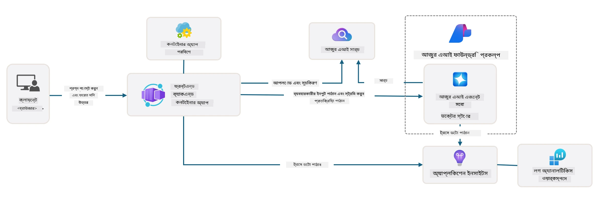

# ৩. একটি টেমপ্লেট বিশ্লেষণ করুন

!!! tip "এই মডিউল শেষে আপনি সক্ষম হবেন"

    - [ ] আইটেম
    - [ ] আইটেম
    - [ ] আইটেম
    - [ ] **ল্যাব ৩:** 

---

AZD টেমপ্লেট এবং Azure Developer CLI (`azd`) ব্যবহার করে আমরা দ্রুত আমাদের AI ডেভেলপমেন্ট যাত্রা শুরু করতে পারি। এটি স্ট্যান্ডার্ডাইজড রিপোজিটরি প্রদান করে যেখানে নমুনা কোড, অবকাঠামো এবং কনফিগারেশন ফাইল থাকে - যা একটি প্রস্তুত-প্রস্তুত _স্টার্টার_ প্রকল্প আকারে থাকে।

**কিন্তু এখন, আমাদের প্রকল্পের কাঠামো এবং কোডবেস বুঝতে হবে - এবং AZD টেমপ্লেট কাস্টমাইজ করতে সক্ষম হতে হবে - AZD সম্পর্কে পূর্ব অভিজ্ঞতা বা জ্ঞান ছাড়াই!**

---

## ১. GitHub Copilot সক্রিয় করুন

### ১.১ GitHub Copilot Chat ইনস্টল করুন

এবার [GitHub Copilot with Agent Mode](https://code.visualstudio.com/docs/copilot/chat/chat-agent-mode) অন্বেষণ করার সময়। এখন আমরা আমাদের কাজটি উচ্চ স্তরে বর্ণনা করতে পারি এবং কার্যকরী সহায়তা পেতে পারি। এই ল্যাবের জন্য, আমরা [Copilot Free plan](https://github.com/github-copilot/signup) ব্যবহার করব, যা সম্পন্ন এবং চ্যাট ইন্টারঅ্যাকশনের জন্য মাসিক সীমা রয়েছে।

এক্সটেনশনটি মার্কেটপ্লেস থেকে ইনস্টল করা যেতে পারে, তবে এটি আপনার Codespaces পরিবেশে ইতিমধ্যেই উপলব্ধ থাকা উচিত। _Copilot আইকনের ড্রপ-ডাউন থেকে `Open Chat` ক্লিক করুন - এবং একটি প্রম্পট টাইপ করুন যেমন `What can you do?`_ - আপনাকে লগইন করতে বলা হতে পারে। **GitHub Copilot Chat প্রস্তুত।**

### ১.২ MCP সার্ভার ইনস্টল করুন

Agent মোড কার্যকর হতে, এটি সঠিক টুলগুলির অ্যাক্সেস প্রয়োজন যা এটি জ্ঞান পুনরুদ্ধার বা কার্য সম্পাদনে সহায়তা করতে পারে। এখানে MCP সার্ভারগুলি সহায়ক। আমরা নিম্নলিখিত সার্ভারগুলি কনফিগার করব:

1. [Azure MCP Server](../../../../../workshop/docs/instructions)
1. [Microsoft Docs MCP Server](../../../../../workshop/docs/instructions)

এগুলি সক্রিয় করতে:

1. `.vscode/mcp.json` নামে একটি ফাইল তৈরি করুন যদি এটি না থাকে
1. নিম্নলিখিত কোডটি সেই ফাইলে কপি করুন - এবং সার্ভারগুলি চালু করুন!
   ```json title=".vscode/mcp.json"
   {
      "servers": {
         "Azure MCP Server": {
            "command": "npx",
            "args": [
            "-y",
            "@azure/mcp@latest",
            "server",
            "start"
            ]
         },
         "microsoft.docs.mcp": {
            "type": "http",
            "url": "https://learn.microsoft.com/api/mcp"
         }
      }
   }
   ```

??? warning "আপনি `npx` ইনস্টল না হওয়ার একটি ত্রুটি পেতে পারেন (সমাধানের জন্য ক্লিক করুন)"

      এটি ঠিক করতে, `.devcontainer/devcontainer.json` ফাইলটি খুলুন এবং ফিচার সেকশনে এই লাইনটি যোগ করুন। তারপর কন্টেইনারটি পুনর্নির্মাণ করুন। এখন আপনার `npx` ইনস্টল হওয়া উচিত।

      ```title="" linenums="0"
         "features": {
            "ghcr.io/devcontainers/features/node:1": {},
            ...
         },
      ```

---

### ১.৩ GitHub Copilot Chat পরীক্ষা করুন

**প্রথমে `az login` ব্যবহার করে Azure-এ VS Code কমান্ড লাইন থেকে প্রমাণীকরণ করুন।**

এখন আপনি আপনার Azure সাবস্ক্রিপশন স্ট্যাটাস অনুসন্ধান করতে পারবেন এবং মোতায়েন করা রিসোর্স বা কনফিগারেশন সম্পর্কে প্রশ্ন করতে পারবেন। এই প্রম্পটগুলি চেষ্টা করুন:

1. `List my Azure resource groups`
1. `#foundry list my current deployments`

আপনি Azure ডকুমেন্টেশন সম্পর্কে প্রশ্ন করতে পারেন এবং Microsoft Docs MCP সার্ভার থেকে ভিত্তিক উত্তর পেতে পারেন। এই প্রম্পটগুলি চেষ্টা করুন:

1. `#microsoft_docs_search What is Azure Developer CLI?`
1. `#microsoft_docs_search Show me a Python tutorial to chat with deployed model`

অথবা আপনি একটি কাজ সম্পন্ন করার জন্য কোড স্নিপেট চাইতে পারেন। এই প্রম্পটটি চেষ্টা করুন:

1. `Give me a Python code example that uses AAD for an interactive chat client`

`Ask` মোডে, এটি কোড প্রদান করবে যা আপনি কপি-পেস্ট করে চেষ্টা করতে পারেন। `Agent` মোডে, এটি আরও এক ধাপ এগিয়ে যেতে পারে এবং আপনার জন্য প্রাসঙ্গিক রিসোর্স তৈরি করতে পারে - যার মধ্যে সেটআপ স্ক্রিপ্ট এবং ডকুমেন্টেশন অন্তর্ভুক্ত থাকবে - যা আপনাকে সেই কাজটি সম্পাদনে সহায়তা করবে।

**আপনি এখন টেমপ্লেট রিপোজিটরি অন্বেষণ শুরু করতে প্রস্তুত।**

---

## ২. আর্কিটেকচার বিশ্লেষণ

??? prompt "ASK: docs/images/architecture.png-এ অ্যাপ্লিকেশন আর্কিটেকচার ১ অনুচ্ছেদে ব্যাখ্যা করুন"

      এই অ্যাপ্লিকেশনটি একটি Azure-ভিত্তিক AI-চালিত চ্যাট অ্যাপ্লিকেশন যা একটি আধুনিক এজেন্ট-ভিত্তিক আর্কিটেকচার প্রদর্শন করে। সমাধানটি একটি Azure Container App-এর চারপাশে কেন্দ্রীভূত যা প্রধান অ্যাপ্লিকেশন কোড হোস্ট করে, যা ব্যবহারকারীর ইনপুট প্রক্রিয়া করে এবং একটি AI এজেন্টের মাধ্যমে বুদ্ধিমান প্রতিক্রিয়া তৈরি করে।

      আর্কিটেকচারটি Azure AI Foundry Project-কে AI সক্ষমতার ভিত্তি হিসেবে ব্যবহার করে, Azure AI Services-এর সাথে সংযুক্ত থাকে যা অন্তর্নিহিত ভাষার মডেল (যেমন GPT-4o-mini) এবং এজেন্ট কার্যকারিতা প্রদান করে। ব্যবহারকারীর ইন্টারঅ্যাকশন একটি React-ভিত্তিক ফ্রন্টএন্ড থেকে একটি FastAPI ব্যাকএন্ডে প্রবাহিত হয় যা প্রসঙ্গগত প্রতিক্রিয়া তৈরি করতে AI এজেন্ট সার্ভিসের সাথে যোগাযোগ করে।

      সিস্টেমটি ফাইল অনুসন্ধান বা Azure AI Search সার্ভিসের মাধ্যমে জ্ঞান পুনরুদ্ধারের ক্ষমতা অন্তর্ভুক্ত করে, যা এজেন্টকে আপলোড করা ডকুমেন্ট থেকে তথ্য অ্যাক্সেস এবং উদ্ধৃত করতে সক্ষম করে। অপারেশনাল উৎকর্ষতার জন্য, আর্কিটেকচারটি ট্রেসিং, লগিং এবং পারফরম্যান্স অপ্টিমাইজেশনের জন্য Application Insights এবং Log Analytics Workspace-এর মাধ্যমে ব্যাপক পর্যবেক্ষণ অন্তর্ভুক্ত করে।

      Azure Storage অ্যাপ্লিকেশন ডেটা এবং ফাইল আপলোডের জন্য ব্লব স্টোরেজ প্রদান করে, যখন Managed Identity Azure রিসোর্সগুলির মধ্যে নিরাপদ অ্যাক্সেস নিশ্চিত করে ক্রেডেনশিয়াল সংরক্ষণ ছাড়াই। পুরো সমাধানটি স্কেলযোগ্যতা এবং রক্ষণাবেক্ষণের জন্য ডিজাইন করা হয়েছে, যেখানে কন্টেইনারাইজড অ্যাপ্লিকেশনটি চাহিদার উপর ভিত্তি করে স্বয়ংক্রিয়ভাবে স্কেল করে এবং Azure-এর ম্যানেজড সার্ভিস ইকোসিস্টেমের মাধ্যমে বিল্ট-ইন নিরাপত্তা, পর্যবেক্ষণ এবং CI/CD ক্ষমতা প্রদান করে।



---

## ৩. রিপোজিটরি কাঠামো

!!! prompt "ASK: টেমপ্লেট ফোল্ডার কাঠামো ব্যাখ্যা করুন। একটি ভিজ্যুয়াল হায়ারারকিকাল ডায়াগ্রাম দিয়ে শুরু করুন।"

??? info "ANSWER: ভিজ্যুয়াল হায়ারারকিকাল ডায়াগ্রাম"

      ```bash title="" 
      get-started-with-ai-agents/
      ├── 📋 কনফিগারেশন ও সেটআপ
      │   ├── azure.yaml                    # Azure Developer CLI কনফিগারেশন
      │   ├── docker-compose.yaml           # লোকাল ডেভেলপমেন্ট কন্টেইনার
      │   ├── pyproject.toml                # Python প্রকল্প কনফিগারেশন
      │   ├── requirements-dev.txt          # ডেভেলপমেন্ট ডিপেনডেন্সি
      │   └── .devcontainer/                # VS Code ডেভ কন্টেইনার সেটআপ
      │
      ├── 🏗️ অবকাঠামো (infra/)
      │   ├── main.bicep                    # প্রধান অবকাঠামো টেমপ্লেট
      │   ├── api.bicep                     # API-নির্দিষ্ট রিসোর্স
      │   ├── main.parameters.json          # অবকাঠামো প্যারামিটার
      │   └── core/                         # মডুলার অবকাঠামো উপাদান
      │       ├── ai/                       # AI সার্ভিস কনফিগারেশন
      │       ├── host/                     # হোস্টিং অবকাঠামো
      │       ├── monitor/                  # পর্যবেক্ষণ ও লগিং
      │       ├── search/                   # Azure AI Search সেটআপ
      │       ├── security/                 # নিরাপত্তা ও পরিচয়
      │       └── storage/                  # স্টোরেজ অ্যাকাউন্ট কনফিগ
      │
      ├── 💻 অ্যাপ্লিকেশন সোর্স (src/)
      │   ├── api/                          # ব্যাকএন্ড API
      │   │   ├── main.py                   # FastAPI অ্যাপ্লিকেশন এন্ট্রি
      │   │   ├── routes.py                 # API রুট সংজ্ঞা
      │   │   ├── search_index_manager.py   # সার্চ কার্যকারিতা
      │   │   ├── data/                     # API ডেটা হ্যান্ডলিং
      │   │   ├── static/                   # স্ট্যাটিক ওয়েব অ্যাসেট
      │   │   └── templates/                # HTML টেমপ্লেট
      │   ├── frontend/                     # React/TypeScript ফ্রন্টএন্ড
      │   │   ├── package.json              # Node.js ডিপেনডেন্সি
      │   │   ├── vite.config.ts            # Vite বিল্ড কনফিগারেশন
      │   │   └── src/                      # ফ্রন্টএন্ড সোর্স কোড
      │   ├── data/                         # নমুনা ডেটা ফাইল
      │   │   └── embeddings.csv            # প্রি-কম্পিউটেড এম্বেডিংস
      │   ├── files/                        # জ্ঞানভিত্তিক ফাইল
      │   │   ├── customer_info_*.json      # গ্রাহক ডেটা নমুনা
      │   │   └── product_info_*.md         # পণ্য ডকুমেন্টেশন
      │   ├── Dockerfile                    # কন্টেইনার কনফিগারেশন
      │   └── requirements.txt              # Python ডিপেনডেন্সি
      │
      ├── 🔧 অটোমেশন ও স্ক্রিপ্ট (scripts/)
      │   ├── postdeploy.sh/.ps1           # পোস্ট-ডিপ্লয়মেন্ট সেটআপ
      │   ├── setup_credential.sh/.ps1     # ক্রেডেনশিয়াল কনফিগারেশন
      │   ├── validate_env_vars.sh/.ps1    # পরিবেশ যাচাই
      │   └── resolve_model_quota.sh/.ps1  # মডেল কোটার ব্যবস্থাপনা
      │
      ├── 🧪 টেস্টিং ও মূল্যায়ন
      │   ├── tests/                        # ইউনিট ও ইন্টিগ্রেশন টেস্ট
      │   │   └── test_search_index_manager.py
      │   ├── evals/                        # এজেন্ট মূল্যায়ন ফ্রেমওয়ার্ক
      │   │   ├── evaluate.py               # মূল্যায়ন রানার
      │   │   ├── eval-queries.json         # টেস্ট প্রশ্ন
      │   │   └── eval-action-data-path.json
      │   ├── sandbox/                      # ডেভেলপমেন্ট প্লেগ্রাউন্ড
      │   │   ├── 1-quickstart.py           # দ্রুত শুরু উদাহরণ
      │   │   └── aad-interactive-chat.py   # প্রমাণীকরণ উদাহরণ
      │   └── airedteaming/                 # AI নিরাপত্তা মূল্যায়ন
      │       └── ai_redteaming.py          # রেড টিম টেস্টিং
      │
      ├── 📚 ডকুমেন্টেশন (docs/)
      │   ├── deployment.md                 # ডিপ্লয়মেন্ট গাইড
      │   ├── local_development.md          # লোকাল সেটআপ নির্দেশিকা
      │   ├── troubleshooting.md            # সাধারণ সমস্যা ও সমাধান
      │   ├── azure_account_setup.md        # Azure পূর্বশর্ত
      │   └── images/                       # ডকুমেন্টেশন অ্যাসেট
      │
      └── 📄 প্রকল্প মেটাডেটা
         ├── README.md                     # প্রকল্প সংক্ষিপ্ত বিবরণ
         ├── CODE_OF_CONDUCT.md           # কমিউনিটি নির্দেশিকা
         ├── CONTRIBUTING.md              # অবদান গাইড
         ├── LICENSE                      # লাইসেন্স শর্তাবলী
         └── next-steps.md                # পোস্ট-ডিপ্লয়মেন্ট নির্দেশিকা
      ```

### ৩.১ মূল অ্যাপ আর্কিটেকচার

এই টেমপ্লেটটি একটি **ফুল-স্ট্যাক ওয়েব অ্যাপ্লিকেশন** প্যাটার্ন অনুসরণ করে:

- **ব্যাকএন্ড**: Python FastAPI Azure AI ইন্টিগ্রেশনের সাথে
- **ফ্রন্টএন্ড**: TypeScript/React Vite বিল্ড সিস্টেমের সাথে
- **অবকাঠামো**: Azure Bicep টেমপ্লেট ক্লাউড রিসোর্সের জন্য
- **কন্টেইনারাইজেশন**: Docker ধারাবাহিক মোতায়েনের জন্য

### ৩.২ কোড আকারে অবকাঠামো (bicep)

অবকাঠামো স্তরটি **Azure Bicep** টেমপ্লেট ব্যবহার করে মডুলারভাবে সংগঠিত:

   - **`main.bicep`**: সমস্ত Azure রিসোর্স পরিচালনা করে
   - **`core/` মডিউল**: বিভিন্ন সার্ভিসের জন্য পুনঃব্যবহারযোগ্য উপাদান
      - AI সার্ভিস (Azure OpenAI, AI Search)
      - কন্টেইনার হোস্টিং (Azure Container Apps)
      - পর্যবেক্ষণ (Application Insights, Log Analytics)
      - নিরাপত্তা (Key Vault, Managed Identity)

### ৩.৩ অ্যাপ্লিকেশন সোর্স (`src/`)

**ব্যাকএন্ড API (`src/api/`)**:

- FastAPI-ভিত্তিক REST API
- Azure AI এজেন্ট সার্ভিস ইন্টিগ্রেশন
- জ্ঞান পুনরুদ্ধারের জন্য সার্চ ইনডেক্স ব্যবস্থাপনা
- ফাইল আপলোড এবং প্রক্রিয়াকরণ ক্ষমতা

**ফ্রন্টএন্ড (`src/frontend/`)**:

- আধুনিক React/TypeScript SPA
- দ্রুত ডেভেলপমেন্ট এবং অপ্টিমাইজড বিল্ডের জন্য Vite
- এজেন্ট ইন্টারঅ্যাকশনের জন্য চ্যাট ইন্টারফেস

**জ্ঞানভিত্তিক ফাইল (`src/files/`)**:

- গ্রাহক এবং পণ্য ডেটার নমুনা
- ফাইল-ভিত্তিক জ্ঞান পুনরুদ্ধার প্রদর্শন করে
- JSON এবং Markdown ফরম্যাট উদাহরণ

### ৩.৪ DevOps ও অটোমেশন

**স্ক্রিপ্ট (`scripts/`)**:

- ক্রস-প্ল্যাটফর্ম PowerShell এবং Bash স্ক্রিপ্ট
- পরিবেশ যাচাই এবং সেটআপ
- পোস্ট-ডিপ্লয়মেন্ট কনফিগারেশন
- মডেল কোটার ব্যবস্থাপনা

**Azure Developer CLI ইন্টিগ্রেশন**:

- `azure.yaml` কনফিগারেশন `azd` ওয়ার্কফ্লো জন্য
- স্বয়ংক্রিয় প্রভিশনিং এবং ডিপ্লয়মেন্ট
- পরিবেশ ভেরিয়েবল ব্যবস্থাপনা

### ৩.৫ টেস্টিং ও গুণগত নিশ্চয়তা

**মূল্যায়ন ফ্রেমওয়ার্ক (`evals/`)**:

- এজেন্ট পারফরম্যান্স মূল্যায়ন
- প্রশ্ন-উত্তর গুণগত পরীক্ষা
- স্বয়ংক্রিয় মূল্যায়ন পাইপলাইন

**AI নিরাপত্তা (`airedteaming/`)**:

- AI নিরাপত্তার জন্য রেড টিম টেস্টিং
- নিরাপত্তা দুর্বলতা স্ক্যানিং
- দায়িত্বশীল AI অনুশীলন

---

## ৪. অভিনন্দন 🏆

আপনি সফলভাবে GitHub Copilot Chat MCP সার্ভারগুলির সাথে ব্যবহার করেছেন এবং রিপোজিটরি অন্বেষণ করেছেন।

- [X] Azure-এর জন্য GitHub Copilot সক্রিয় করেছেন
- [X] অ্যাপ্লিকেশন আর্কিটেকচার বুঝেছেন
- [X] AZD টেমপ্লেট কাঠামো অন্বেষণ করেছেন

এটি আপনাকে এই টেমপ্লেটের জন্য _কোড আকারে অবকাঠামো_ সম্পদের একটি ধারণা দেয়। পরবর্তী ধাপে আমরা AZD-এর কনফিগারেশন ফাইলটি দেখব।

---

