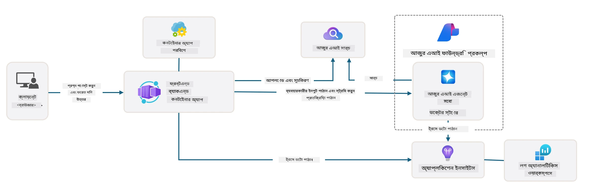

# 3. একটি টেমপ্লেট ডিকন্সট্রাক্ট করুন

!!! tip "এই মডিউল শেষ হলে আপনি সক্ষম হবেন"

    - [ ] MCP সার্ভারগুলোর সাথে GitHub Copilot সক্রিয় করে Azure সহায়তা গ্রহণ
    - [ ] AZD টেমপ্লেট ফোল্ডার স্ট্রাকচার এবং উপাদানগুলি বুঝতে পারা
    - [ ] ইনফ্রাস্ট্রাকচার-অ্যাজ-কোড (Bicep) সংগঠন প্যাটার্নগুলি অনুসন্ধান করা
    - [ ] **ল্যাব ৩:** GitHub Copilot ব্যবহার করে রেপোজিটরির স্থাপত্য অন্বেষণ ও বোঝা

---

AZD টেমপ্লেট এবং Azure Developer CLI (`azd`) এর মাধ্যমে আমরা দ্রুত আমাদের AI বিকাশ যাত্রা শুরু করতে পারি স্ট্যান্ডার্ডাইজড রেপোজিটরির মাধ্যমে যা নমুনা কোড, অবকাঠামো এবং কনফিগারেশন ফাইল সরবরাহ করে - এক ধরণের প্রস্তুত-প্রয়োগযোগ্য _স্টার্টার_ প্রকল্প আকারে।

**কিন্তু এখন, আমাদের প্রজেক্টের স্ট্রাকচার এবং কোডবেস বুঝতে হবে - এবং AZD টেমপ্লেট কাস্টমাইজ করতে সক্ষম হতে হবে - AZD সম্পর্কে কোনো পূর্ব অভিজ্ঞতা বা বোঝাপড়া ছাড়াই!**

---

## ১. GitHub Copilot সক্রিয় করুন

### ১.১ GitHub Copilot Chat ইনস্টল করুন

এখন [GitHub Copilot Agent Mode](https://code.visualstudio.com/docs/copilot/chat/chat-agent-mode) এক্সপ্লোর করার সময়। এখন, আমরা প্রাকৃত ভাষায় আমাদের কাজের বর্ণনা দিতে পারি উচ্চ স্তরে, এবং প্রয়োজনীয় সহায়তা পেতে পারি। এই ল্যাবের জন্য, আমরা [Copilot Free plan](https://github.com/github-copilot/signup) ব্যবহার করব যার মধ্যে মাসিক সীমানা রয়েছে সম্পূর্ণতা এবং চ্যাট ইন্টারেকশনের জন্য।

এই এক্সটেনশনটি মার্কেটপ্লেস থেকে ইনস্টল করা যেতে পারে এবং কোডস্পেস বা ডেভ কন্টেইনার পরিবেশে প্রায়শই আগে থেকেই পাওয়া যায়। _Copilot আইকনের ড্রপডাউন থেকে `Open Chat` ক্লিক করুন - এবং `What can you do?` এর মতো একটি প্রম্পট টাইপ করুন_ - লগইন করতে বলা হতে পারে। **GitHub Copilot Chat প্রস্তুত।**

### ১.২ MCP সার্ভার ইনস্টল করুন

Agent মোড কার্যকর হতে, এটি সঠিক সরঞ্জামগুলোর অ্যাক্সেস প্রয়োজন যাতে এটি জ্ঞান পুনঃপ্রাপ্তি করতে বা পদক্ষেপ নিতে পারে। এখানে MCP সার্ভারগুলি সাহায্য করতে পারে। আমরা নিম্নলিখিত সার্ভারগুলো কনফিগার করব:

1. [Azure MCP Server](../../../../../workshop/docs/instructions)
1. [Microsoft Docs MCP Server](../../../../../workshop/docs/instructions)

সক্রিয় করতে:

1. `.vscode/mcp.json` নামে একটি ফাইল তৈরি করুন যদি না থাকে
1. ঐ ফাইলে নিচের টেক্সট কপি করুন - এবং সার্ভার চালু করুন!
   ```json title=".vscode/mcp.json"
   {
      "servers": {
         "Azure MCP Server": {
            "command": "npx",
            "args": [
            "-y",
            "@azure/mcp@latest",
            "server",
            "start"
            ]
         },
         "microsoft.docs.mcp": {
            "type": "http",
            "url": "https://learn.microsoft.com/api/mcp"
         }
      }
   }
   ```

??? warning "আপনি একটি ত্রুটি পেতে পারেন যে `npx` ইনস্টল নেই (ফিক্সের জন্য ক্লিক করে দেখুন)"

      ফিক্স করার জন্য, `.devcontainer/devcontainer.json` ফাইলটি খুলুন এবং features অংশে নিচের লাইনটি যুক্ত করুন। তারপর কন্টেইনার পুনরায় তৈরি করুন। এবার `npx` ইনস্টল থাকা উচিত।

      ```title="" linenums="0"
         "features": {
            "ghcr.io/devcontainers/features/node:1": {},
            ...
         },
      ```

---

### ১.৩ GitHub Copilot Chat টেস্ট করুন

**প্রথমে `azd auth login` ব্যবহার করে VS Code কমান্ড লাইনে Azure অ্যাকাউন্টে লগইন করুন। সরাসরি Azure CLI কমান্ড চালাতে চাইলে `az login` ব্যবহার করুন।**

এখন আপনি আপনার Azure সাবস্ক্রিপশন স্ট্যাটাস জানতে এবং ডিপ্লয় করা রিসোর্স বা কনফিগারেশন সম্পর্কে প্রশ্ন করতে পারবেন। এই প্রম্পটগুলো ব্যবহার করে দেখুন:

1. `List my Azure resource groups`
1. `#foundry list my current deployments`

আপনি Azure ডকুমেন্টেশন সম্পর্কেও প্রশ্ন করতে পারেন এবং Microsoft Docs MCP সার্ভার থেকে উত্তর পেতে পারেন। এই প্রম্পটগুলো চেষ্টা করুন:

1. `#microsoft_docs_search What is Azure Developer CLI?`
1. `#microsoft_docs_search Show me a Python tutorial to chat with deployed model`

অথবা কোড স্নিপেট চেয়ে একটি কাজ সম্পন্ন করতে পারেন। এই প্রম্পটটি চেষ্টা করুন:

1. `Give me a Python code example that uses AAD for an interactive chat client`

`Ask` মোডে, এটি কোড দেবে যা আপনি কপি পেস্ট করে ব্যবহার করতে পারবেন। `Agent` মোডে, এটি আরও এগিয়ে সেই কাজের জন্য প্রাসঙ্গিক রিসোর্স তৈরি করতে পারে - সেটআপ স্ক্রিপ্ট এবং ডকুমেন্টেশন সহ - আপনার সহায়তার জন্য।

**আপনি এখন টেমপ্লেট রেপোজিটরি অন্বেষণ শুরু করতে প্রস্তুত।**

---

## ২. স্থাপত্য ডিকন্সট্রাক্ট করুন

??? prompt "ASK: docs/images/architecture.png এ অ্যাপ্লিকেশন স্থাপত্য ১ প্যারাগ্রাফে ব্যাখ্যা করুন"

      এই অ্যাপ্লিকেশনটি একটি এআই-চালিত চ্যাট অ্যাপ্লিকেশন যা Azure-এ নির্মিত এবং আধুনিক এজেন্ট-ভিত্তিক স্থাপত্য প্রদর্শন করে। সমাধানটি একটি Azure Container App এর চারপাশে গঠিত যা মূল অ্যাপ্লিকেশন কোড হোস্ট করে, যা ব্যবহারকারীর ইনপুট প্রক্রিয়া করে এবং এআই এজেন্টের মাধ্যমে বুদ্ধিমান প্রতিক্রিয়া তৈরি করে।
      
      স্থাপত্যটি AI সক্ষমতার জন্য Microsoft Foundry Project কে ভিত্তি হিসাবে ব্যবহার করে, যা Azure AI Services এর সাথে সংযুক্ত থাকে যেগুলো বেসিক ভাষার মডেলগুলি (যেমন gpt-4.1-mini) এবং এজেন্ট কার্যকারিতা প্রদান করে। ব্যবহারকারীর ইন্টারঅ্যাকশন React-ভিত্তিক ফ্রন্টএন্ড থেকে FastAPI ব্যাকএন্ডে প্রবাহিত হয় যা AI এজেন্ট সার্ভিসের সাথে যোগাযোগ করে প্রসঙ্গভিত্তিক উত্তর তৈরি করে।
      
      সিস্টেমে জ্ঞান পুনরুদ্ধার করার ক্ষমতা অন্তর্ভুক্ত রয়েছে, যা ফাইল অনুসন্ধান অথবা Azure AI Search সার্ভিসের মাধ্যমে কাজ করে, ফলে এজেন্ট আপলোড করা ডকুমেন্ট থেকে তথ্য গ্রহণ ও উদ্ধৃতি দিতে পারে।
      
      অপারেশনাল উৎকর্ষতার জন্য এই স্থাপত্য Application Insights এবং Log Analytics Workspace এর মাধ্যমে পর্যবেক্ষণ, লগিং এবং পারফরম্যান্স অপ্টিমাইজ করার ব্যবস্থা করে।
      
      Azure Storage blob স্টোরেজ সরবরাহ করে অ্যাপ্লিকেশন ডেটা ও ফাইল আপলোডের জন্য, এবং Managed Identity নিরাপদ অ্যাক্সেস নিশ্চিত করে Azure রিসোর্সগুলোর মধ্যে, তথ্য সংরক্ষণ ছাড়াই। পুরো সমাধানটি স্কেলেবল এবং রক্ষণাবেক্ষণযোগ্য, যেখানে কন্টেইনারাইজড অ্যাপ্লিকেশন চাহিদা অনুসারে স্বয়ংক্রিয়ভাবে স্কেল হয় এবং Azure এর ম্যানেজড সার্ভিস ইকোসিস্টেমের মাধ্যমে বিল্ট-ইন সিকিউরিটি, মনিটরিং, এবং CI/CD ক্ষমতা প্রদান করে।



---

## ৩. রেপোজিটরি স্ট্রাকচার

!!! prompt "ASK: টেমপ্লেট ফোল্ডার স্ট্রাকচার ব্যাখ্যা করুন। একটি ভিজ্যুয়াল হায়ারার্কিক্যাল ডায়াগ্রাম দিয়ে শুরু করুন।"

??? info "উত্তর: ভিজ্যুয়াল হায়ারার্কিক্যাল ডায়াগ্রাম"

      ```bash title="" 
      get-started-with-ai-agents/
      ├── 📋 Configuration & Setup
      │   ├── azure.yaml                    # Azure Developer CLI কনফিগারেশন
      │   ├── docker-compose.yaml          # লোকাল ডেভেলপমেন্ট কন্টেইনার
      │   ├── pyproject.toml               # পাইথন প্রকল্প কনফিগারেশন
      │   ├── requirements-dev.txt         # ডেভেলপমেন্ট ডিপেনডেন্সি
      │   └── .devcontainer/               # VS Code ডেভ কন্টেইনার সেটআপ
      │
      ├── 🏗️ Infrastructure (infra/)
      │   ├── main.bicep                   # মূল অবকাঠামো টেমপ্লেট
      │   ├── api.bicep                    # API-সংশ্লিষ্ট রিসোর্স
      │   ├── main.parameters.json        # অবকাঠামো প্যারামিটারস
      │   └── core/                       # মডুলার অবকাঠামো উপাদান
      │       ├── ai/                     # AI সার্ভিস কনফিগারেশন
      │       ├── host/                   # হোস্টিং অবকাঠামো
      │       ├── monitor/                # মনিটরিং এবং লগিং
      │       ├── search/                 # Azure AI Search সেটআপ
      │       ├── security/               # সিকিউরিটি এবং পরিচয়
      │       └── storage/                # স্টোরেজ একাউন্ট কনফিগ
      │
      ├── 💻 Application Source (src/)
      │   ├── api/                       # ব্যাকএন্ড API
      │   │   ├── main.py                # FastAPI অ্যাপ্লিকেশন এন্ট্রি
      │   │   ├── routes.py              # API রুট ডেফিনেশন
      │   │   ├── search_index_manager.py # সার্চ ফাংশনালিটি
      │   │   ├── data/                  # API ডেটা হ্যান্ডেলিং
      │   │   ├── static/                # স্ট্যাটিক ওয়েব অ্যাসেট
      │   │   └── templates/             # HTML টেমপ্লেট
      │   ├── frontend/                  # React/TypeScript ফ্রন্টএন্ড
      │   │   ├── package.json           # Node.js নির্ভরতা
      │   │   ├── vite.config.ts         # Vite বিল্ড কনফিগ
      │   │   └── src/                   # ফ্রন্টএন্ড সোর্স কোড
      │   ├── data/                      # নমুনা ডেটা ফাইল
      │   │   └── embeddings.csv         # প্রি-কম্পিউটেড এম্বেডিংস
      │   ├── files/                     # জ্ঞানভিত্তিক ফাইল
      │   │   ├── customer_info_*.json   # গ্রাহক তথ্য নমুনা
      │   │   └── product_info_*.md      # পণ্য ডকুমেন্টেশন
      │   ├── Dockerfile                 # কন্টেইনার কনফিগারেশন
      │   └── requirements.txt           # পাইথন নির্ভরতাগুলো
      │
      ├── 🔧 Automation & Scripts (scripts/)
      │   ├── postdeploy.sh/.ps1        # পোস্ট-ডিপ্লয়মেন্ট সেটআপ
      │   ├── setup_credential.sh/.ps1  # ক্রেডেনশিয়াল কনফিগারেশন
      │   ├── validate_env_vars.sh/.ps1 # এনভায়রনমেন্ট বৈধতা
      │   └── resolve_model_quota.sh/.ps1 # মডেল কোটা ম্যানেজমেন্ট
      │
      ├── 🧪 Testing & Evaluation
      │   ├── tests/                    # ইউনিট এবং ইন্টিগ্রেশন টেস্ট
      │   │   └── test_search_index_manager.py
      │   ├── evals/                    # এজেন্ট মূল্যায়ন ফ্রেমওয়ার্ক
      │   │   ├── evaluate.py           # মূল্যায়ন রানার
      │   │   ├── eval-queries.json     # টেস্ট কুয়ারি
      │   │   └── eval-action-data-path.json
      │   ├── sandbox/                  # ডেভেলপমেন্ট প্লেগ্রাউন্ড
      │   │   ├── 1-quickstart.py       # শুরু করার উদাহরণ
      │   │   └── aad-interactive-chat.py # অথেন্টিকেশন উদাহরণ
      │   └── airedteaming/             # AI সেফটি মূল্যায়ন
      │       └── ai_redteaming.py      # রেড টিম টেস্টিং
      │
      ├── 📚 Documentation (docs/)
      │   ├── deployment.md             # ডিপ্লয়মেন্ট গাইড
      │   ├── local_development.md      # লোকাল সেটআপ নির্দেশনা
      │   ├── troubleshooting.md       # সাধারণ সমস্যা ও সমাধান
      │   ├── azure_account_setup.md    # Azure পূর্বশর্ত
      │   └── images/                   # ডকুমেন্টেশন অ্যাসেট
      │
      └── 📄 Project Metadata
         ├── README.md                 # প্রকল্প সংক্ষিপ্ত বিবরণ
         ├── CODE_OF_CONDUCT.md       # কমিউনিটি নিয়মাবলী
         ├── CONTRIBUTING.md          # অবদান নির্দেশিকা
         ├── LICENSE                  # লাইসেন্স শর্তাবলী
         └── next-steps.md            # পোস্ট-ডিপ্লয়মেন্ট নির্দেশিকা
      ```

### ৩.১ কোর অ্যাপ্লিকেশন স্থাপত্য

এই টেমপ্লেটটি একটি **ফুল-স্ট্যাক ওয়েব অ্যাপ্লিকেশন** প্যাটার্ন অনুসরণ করে:

- **ব্যাকএন্ড**: Python FastAPI সহ Azure AI ইন্টিগ্রেশন
- **ফ্রন্টএন্ড**: TypeScript/React সহ Vite বিল্ড সিস্টেম
- **অবকাঠামো**: Azure Bicep টেমপ্লেট ক্লাউড রিসোর্সের জন্য
- **কন্টেইনারাইজেশন**: Docker দ্বারা ধারাবাহিক ডিপ্লয়মেন্ট

### ৩.২ ইনফ্রা অ্যাজ কোড (bicep)

অবকাঠামো স্তর ব্যবহার করে **Azure Bicep** টেমপ্লেট যা মডুলার ভাবে সংগঠিত:

   - **`main.bicep`**: সমস্ত Azure রিসোর্স পরিচালনা করে
   - **`core/` মডিউলসমূহ**: বিভিন্ন সার্ভিসের পুনঃব্যবহারযোগ্য উপাদান
      - AI সার্ভিস (Microsoft Foundry মডেল, AI Search)
      - কন্টেইনার হোস্টিং (Azure Container Apps)
      - মনিটরিং (Application Insights, Log Analytics)
      - সিকিউরিটি (Key Vault, Managed Identity)

### ৩.৩ অ্যাপ্লিকেশন সোর্স (`src/`)

**ব্যাকএন্ড API (`src/api/`)**:

- FastAPI-ভিত্তিক REST API
- Foundry এজেন্ট ইন্টিগ্রেশন
- জ্ঞান পুনরুদ্ধারের জন্য সার্চ ইন্ডেক্স ম্যানেজমেন্ট
- ফাইল আপলোড এবং প্রসেসিং সুবিধাসমূহ

**ফ্রন্টএন্ড (`src/frontend/`)**:

- আধুনিক React/TypeScript SPA
- দ্রুত ডেভেলপমেন্ট এবং অপ্টিমাইজড বিল্ডের জন্য Vite
- এজেন্ট ইন্টারঅ্যাকশনের জন্য চ্যাট ইন্টারফেস

**জ্ঞানভিত্তিক (`src/files/`)**:

- নমুনা গ্রাহক ও পণ্য ডেটা
- ফাইল-ভিত্তিক জ্ঞান পুনরুদ্ধার দেখায়
- JSON এবং Markdown ফরম্যাট উদাহরণ

### ৩.৪ ডেভঅপস ও অটোমেশান

**স্ক্রিপ্টসমূহ (`scripts/`)**:

- ক্রস-প্ল্যাটফর্ম PowerShell ও Bash স্ক্রিপ্ট
- এনভায়রনমেন্ট বৈধতা ও সেটআপ
- পোস্ট-ডিপ্লয়মেন্ট কনফিগারেশন
- মডেল কোটা ম্যানেজমেন্ট

**Azure Developer CLI ইন্টিগ্রেশন**:

- `azure.yaml` কনফিগারেশন `azd` ওয়ার্কফ্লোগুলোর জন্য
- স্বয়ংক্রিয় প্রোভিশনিং এবং ডিপ্লয়মেন্ট
- পরিবেশ ভেরিয়েবল ব্যবস্থাপনা

### ৩.৫ টেস্টিং ও মান নিশ্চিতকরণ

**মূল্যায়ন ফ্রেমওয়ার্ক (`evals/`)**:

- এজেন্ট পারফরম্যান্স মূল্যায়ন
- কুয়ারি-প্রতিক্রিয়া গুণগত মান পরীক্ষা
- স্বয়ংক্রিয় মূল্যায়ন পাইপলাইন

**AI সেফটি (`airedteaming/`)**:

- AI সেফটির জন্য রেড টিম টেস্টিং
- সিকিউরিটি দুর্বলতা স্ক্যানিং
- দায়িত্বশীল AI অনুশীলন

---

## ৪. অভিনন্দন 🏆

আপনি সফলভাবে MCP সার্ভারসহ GitHub Copilot Chat ব্যবহার করে রেপোজিটরি অনুসন্ধান করেছেন।

- [X] Azure জন্য GitHub Copilot সক্রিয় করেছেন
- [X] অ্যাপ্লিকেশন স্থাপত্য বুঝেছেন
- [X] AZD টেমপ্লেট স্ট্রাকচার অন্বেষণ করেছেন

এটি আপনাকে এই টেমপ্লেটের _infrastructure as code_ অ্যাসেটের ধারণা দেয়। পরবর্তীতে, আমরা AZD এর কনফিগারেশন ফাইল দেখব।

---

<!-- CO-OP TRANSLATOR DISCLAIMER START -->
**অস্বীকৃতি**:  
এই নথিটি AI অনুবাদ সেবা [Co-op Translator](https://github.com/Azure/co-op-translator) ব্যবহার করে অনূদিত হয়েছে। আমরা যথাসাধ্য সঠিকতার জন্য চেষ্টা করি, তবে স্বয়ংক্রিয় অনুবাদে ত্রুটি বা অমিল থাকতে পারে। মূল নথিটি তার নিজস্ব ভাষায় প্রামাণিক উৎস হিসেবে বিবেচিত হওয়া উচিত। গুরুত্বপূর্ণ তথ্যের জন্য পেশাদার মানব অনুবাদের পরামর্শ দেওয়া হয়। এই অনুবাদের ব্যবহার থেকে উদ্ভূত কোনো ভুলবোঝাবুঝি বা ভুল ব্যাখ্যার জন্য আমরা দায়বদ্ধ নই।
<!-- CO-OP TRANSLATOR DISCLAIMER END -->