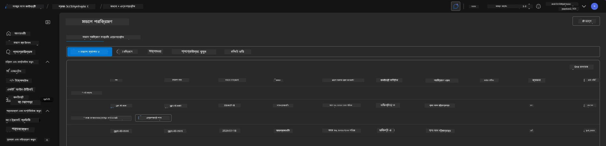

# 6. অবকাঠামো বন্ধ করা

!!! tip "এই মডিউল শেষে আপনি সক্ষম হবেন"

    - [ ] আইটেম
    - [ ] আইটেম
    - [ ] আইটেম

---

## অতিরিক্ত অনুশীলন

প্রকল্প বন্ধ করার আগে, কয়েক মিনিট সময় নিয়ে কিছু খোলা-প্রান্তের অনুসন্ধান করুন।

!!! danger "NITYA-TODO: চেষ্টা করার জন্য কিছু প্রস্তাবনা দিন"

---

## অবকাঠামো অপসারণ

1. অবকাঠামো বন্ধ করা খুবই সহজ:
      
      ```bash title="" linenums="0"
      azd down --purge
      ```
1. `--purge` ফ্ল্যাগ নিশ্চিত করে যে এটি সফট-ডিলিটেড Cognitive Service রিসোর্সগুলোকেও মুছে দেয়, যার ফলে এই রিসোর্সগুলোর দ্বারা ধরে রাখা কোটা মুক্ত হয়। সম্পন্ন হলে আপনি এরকম কিছু দেখতে পাবেন:
      
      ```bash title="" linenums="0"
      ? Total resources to delete: 11, are you sure you want to continue? Yes
      Deleting your resources can take some time.
      (✓) Done: Deleted resource group rg-nitya-mshack-azd
      (✓) Done: Purging Cognitive Account: aoai-3cz3zkynhvpbc

      SUCCESS: Your application was removed from Azure in 11 minutes 4 seconds.
      ```

1. (ঐচ্ছিক) যদি আপনি এখন `azd up` আবার চালান, আপনি লক্ষ্য করবেন যে gpt-4.1 মডেলটি ডিপ্লয় করা হয়েছে কারণ পরিবেশ পরিবর্তনশীলটি স্থানীয় `.azure` ফোল্ডারে পরিবর্তিত (এবং সংরক্ষিত) হয়েছে। 

      এখানে মডেল ডিপ্লয়মেন্ট **আগে**:

      

      এবং এটি **পরে**:
      

---

