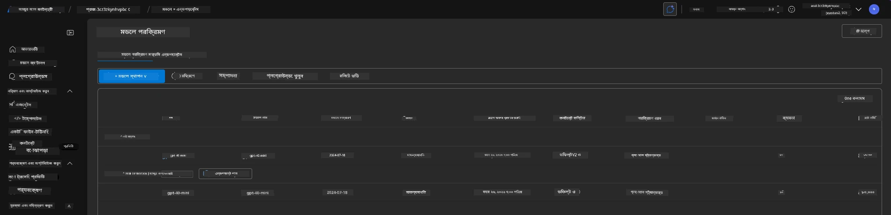
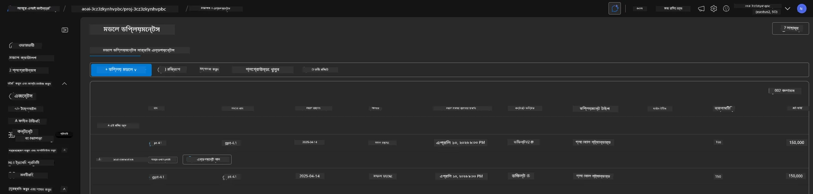

# 6. ইনফ্রাস্ট্রাকচার অপসারণ

!!! tip "এই মডিউলের শেষ পর্যন্ত আপনি সক্ষম হবেন"

    - [ ] রিসোর্স ক্লিনআপ এবং খরচ ব্যবস্থাপনার গুরুত্ব বোঝা
    - [ ] নিরাপদভাবে ইনফ্রাস্ট্রাকচার ডিপ্রোভিশন করতে `azd down` ব্যবহার করা
    - [ ] প্রয়োজনে সফট-ডিলিট হওয়া Cognitive Services পুনরুদ্ধার করা
    - [ ] **Lab 6:** Azure রিসোর্সগুলো পরিষ্কার করা এবং অপসারণ নিশ্চিত করা

---

## অতিরিক্ত অনুশীলন

প্রকল্পটি টিয়ারডাউন করার আগে, কিছু খোলা-সমাপ্ত অনুসন্ধান করার জন্য কয়েক মিনিট নিন।

!!! info "এই অনুসন্ধান প্রম্পটগুলো চেষ্টা করুন"

    **GitHub Copilot-এর সাথে পরীক্ষা-নিরীক্ষা:**
    
    1. Ask: `What other AZD templates could I try for multi-agent scenarios?`
    2. Ask: `How can I customize the agent instructions for a healthcare use case?`
    3. Ask: `What environment variables control cost optimization?`
    
    **Azure পোর্টাল অন্বেষণ করুন:**
    
    1. আপনার ডিপ্লয়মেন্টের জন্য Application Insights মেট্রিক পর্যালোচনা করুন
    2. প্রোভিশন করা রিসোর্সগুলোর জন্য খরচ বিশ্লেষণ পরীক্ষা করুন
    3. Microsoft Foundry পোর্টালের agent playground আরও একবার অন্বেষণ করুন

---

## ইনফ্রা ডিপ্রোভিশন

1. ইনফ্রাস্ট্রাকচার টিয়ারডাউন করা এতটা সহজ:
      
      ```bash title="" linenums="0"
      azd down --purge
      ```
1. The `--purge` flag ensures that it also purges soft-deleted Cognitive Service resources, thereby releasing quota held by these resources. Once complete you will see something like this:
      
      ```bash title="" linenums="0"
      ? Total resources to delete: 11, are you sure you want to continue? Yes
      Deleting your resources can take some time.
      (✓) Done: Deleted resource group rg-nitya-mshack-azd
      (✓) Done: Purging Cognitive Account: aoai-3cz3zkynhvpbc

      SUCCESS: Your application was removed from Azure in 11 minutes 4 seconds.
      ```

1. (ঐচ্ছিক) যদি এখন আপনি আবার `azd up` চালান, আপনি লক্ষ্য করবেন যে gpt-4.1 মডেল ডিপ্লয় হবে কারণ পরিবেশ ভেরিয়েবলটি স্থানীয় `.azure` ফোল্ডারে পরিবর্তিত (এবং সংরক্ষিত) হয়েছে। 

      নিচে মডেল ডিপ্লয়মেন্টগুলো **পূর্বে** ছিল:

      

      এবং এটি **পরে** এখানে আছে:
      

---

<!-- CO-OP TRANSLATOR DISCLAIMER START -->
দায়মুক্তি:
এই নথিটি এআই অনুবাদ সেবা Co-op Translator (https://github.com/Azure/co-op-translator) ব্যবহার করে অনুবাদ করা হয়েছে। আমরা সঠিকতার জন্য সর্বাত্মক চেষ্টা করি, তবে স্বয়ংক্রিয় অনুবাদে ত্রুটি বা অসঙ্গতি থাকতে পারে। জরুরি বা নীর্দিষ্ট তথ্যের ক্ষেত্রে মূল নথিটি তার আদি ভাষায়ই প্রামাণিক বলে ধরা উচিত এবং পেশাদার মানব অনুবাদ করা উচিত। এই অনুবাদের ব্যবহারের ফলে উদ্ভূত যেকোনো ভুল বোঝাবুঝি বা ভুল ব্যাখ্যার জন্য আমরা দায়ী নই।
<!-- CO-OP TRANSLATOR DISCLAIMER END -->