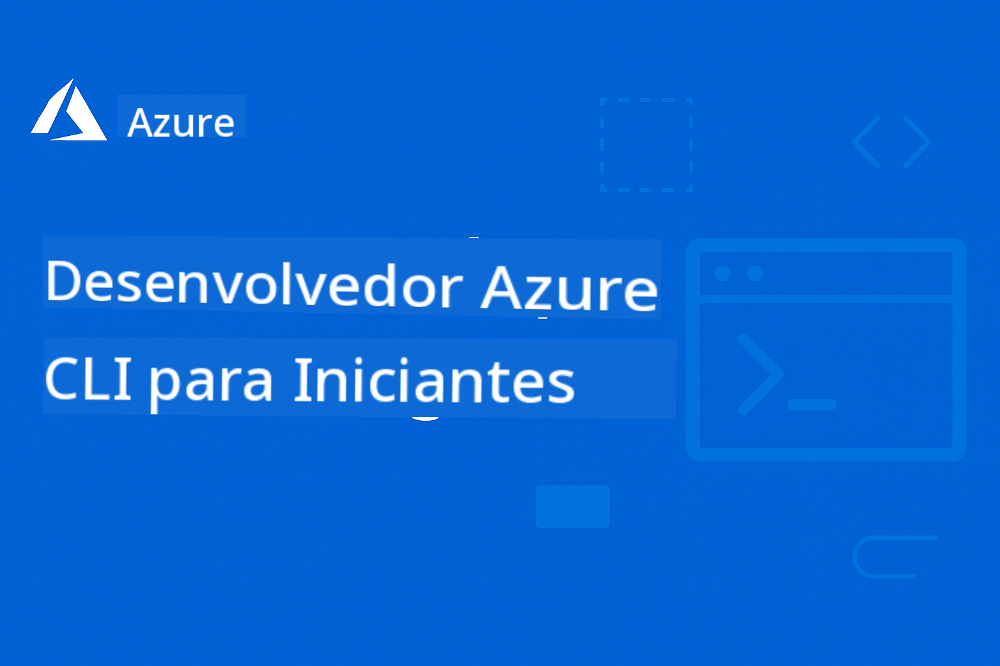

<!--
CO_OP_TRANSLATOR_METADATA:
{
  "original_hash": "c0984265b7a9357388f864c19606c80d",
  "translation_date": "2025-09-11T09:59:07+00:00",
  "source_file": "README.md",
  "language_code": "br"
}
-->
# AZD Para Iniciantes

 

Siga estas etapas para começar a usar esses recursos:
1. **Faça um Fork do Repositório**: Clique [](https://GitHub.com/microsoft/azd-for-beginners/fork)
2. **Clone o Repositório**:   `git clone https://github.com/microsoft/azd-for-beginners.git`
3. [**Participe das Comunidades do Azure no Discord e conecte-se com especialistas e outros desenvolvedores**](https://discord.com/invite/ByRwuEEgH4)

### 🌐 Suporte Multilíngue

#### Suportado via GitHub Action (Automatizado e Sempre Atualizado)

[Francês](../fr/README.md) | [Espanhol](../es/README.md) | [Alemão](../de/README.md) | [Russo](../ru/README.md) | [Árabe](../ar/README.md) | [Persa (Farsi)](../fa/README.md) | [Urdu](../ur/README.md) | [Chinês (Simplificado)](../zh/README.md) | [Chinês (Tradicional, Macau)](../mo/README.md) | [Chinês (Tradicional, Hong Kong)](../hk/README.md) | [Chinês (Tradicional, Taiwan)](../tw/README.md) | [Japonês](../ja/README.md) | [Coreano](../ko/README.md) | [Hindi](../hi/README.md) | [Bengali](../bn/README.md) | [Marathi](../mr/README.md) | [Nepali](../ne/README.md) | [Punjabi (Gurmukhi)](../pa/README.md) | [Português (Portugal)](../pt/README.md) | [Português (Brasil)](./README.md) | [Italiano](../it/README.md) | [Polonês](../pl/README.md) | [Turco](../tr/README.md) | [Grego](../el/README.md) | [Tailandês](../th/README.md) | [Sueco](../sv/README.md) | [Dinamarquês](../da/README.md) | [Norueguês](../no/README.md) | [Finlandês](../fi/README.md) | [Holandês](../nl/README.md) | [Hebraico](../he/README.md) | [Vietnamita](../vi/README.md) | [Indonésio](../id/README.md) | [Malaio](../ms/README.md) | [Tagalog (Filipino)](../tl/README.md) | [Suaíli](../sw/README.md) | [Húngaro](../hu/README.md) | [Tcheco](../cs/README.md) | [Eslovaco](../sk/README.md) | [Romeno](../ro/README.md) | [Búlgaro](../bg/README.md) | [Sérvio (Cirílico)](../sr/README.md) | [Croata](../hr/README.md) | [Esloveno](../sl/README.md) | [Ucraniano](../uk/README.md) | [Birmanês (Myanmar)](../my/README.md)

**Se você deseja ter suporte para idiomas adicionais, os idiomas disponíveis estão listados [aqui](https://github.com/Azure/co-op-translator/blob/main/getting_started/supported-languages.md)**

## Introdução

Bem-vindo ao guia completo para Azure Developer CLI (azd). Este repositório foi projetado para ajudar desenvolvedores de todos os níveis, desde estudantes até profissionais, a aprender e dominar o Azure Developer CLI para implantações eficientes na nuvem. Este recurso de aprendizado estruturado oferece experiência prática com implantações na nuvem Azure, solução de problemas comuns e implementação de melhores práticas para implantações bem-sucedidas de templates AZD.

## Objetivos de Aprendizado

Ao trabalhar com este repositório, você irá:
- Dominar os fundamentos e conceitos principais do Azure Developer CLI
- Aprender a implantar e provisionar recursos do Azure usando Infraestrutura como Código
- Desenvolver habilidades para solucionar problemas comuns de implantação AZD
- Compreender validações pré-implantação e planejamento de capacidade
- Implementar melhores práticas de segurança e estratégias de otimização de custos
- Ganhar confiança para implantar aplicações prontas para produção no Azure

## Resultados de Aprendizado

Após concluir este curso, você será capaz de:
- Instalar, configurar e usar o Azure Developer CLI com sucesso
- Criar e implantar aplicações usando templates AZD
- Solucionar problemas de autenticação, infraestrutura e implantação
- Realizar verificações pré-implantação, incluindo planejamento de capacidade e seleção de SKU
- Implementar melhores práticas de monitoramento, segurança e gerenciamento de custos
- Integrar fluxos de trabalho AZD em pipelines de CI/CD

## Índice

- [O que é Azure Developer CLI?](../..)
- [Início Rápido](../..)
- [Documentação](../..)
- [Exemplos e Templates](../..)
- [Recursos](../..)
- [Contribuindo](../..)

## O que é Azure Developer CLI?

Azure Developer CLI (azd) é uma interface de linha de comando voltada para desenvolvedores que acelera o processo de construção e implantação de aplicações no Azure. Ele oferece:

- **Implantações baseadas em templates** - Use templates pré-construídos para padrões comuns de aplicações
- **Infraestrutura como Código** - Gerencie recursos do Azure usando Bicep ou Terraform
- **Fluxos de trabalho integrados** - Provisione, implante e monitore aplicações de forma integrada
- **Amigável para desenvolvedores** - Otimizado para produtividade e experiência do desenvolvedor

## Início Rápido

### Pré-requisitos
- Assinatura do Azure
- Azure CLI instalado
- Git (para clonar templates)

### Instalação
```bash
# Windows (PowerShell)
powershell -ex AllSigned -c "Invoke-RestMethod 'https://aka.ms/install-azd.ps1' | Invoke-Expression"

# macOS/Linux
curl -fsSL https://aka.ms/install-azd.sh | bash
```

### Sua Primeira Implantação
```bash
# Initialize a new project
azd init --template todo-nodejs-mongo

# Provision Azure resources and deploy
azd up
```

## Documentação

### Primeiros Passos
- [**Noções Básicas do AZD**](docs/getting-started/azd-basics.md) - Conceitos e terminologia principais
- [**Instalação e Configuração**](docs/getting-started/installation.md) - Guias de instalação específicos para cada plataforma
- [**Configuração**](docs/getting-started/configuration.md) - Configuração de ambiente e autenticação
- [**Seu Primeiro Projeto**](docs/getting-started/first-project.md) - Tutorial passo a passo

### Implantação e Provisionamento
- [**Guia de Implantação**](docs/deployment/deployment-guide.md) - Fluxos de trabalho completos de implantação
- [**Provisionamento de Recursos**](docs/deployment/provisioning.md) - Gerenciamento de recursos do Azure

### Verificações Pré-Implantação
- [**Planejamento de Capacidade**](docs/pre-deployment/capacity-planning.md) - Validação de capacidade de recursos do Azure
- [**Seleção de SKU**](docs/pre-deployment/sku-selection.md) - Escolhendo os SKUs certos do Azure
- [**Verificações Pré-Implantação**](docs/pre-deployment/preflight-checks.md) - Scripts de validação automatizados

### Solução de Problemas
- [**Problemas Comuns**](docs/troubleshooting/common-issues.md) - Problemas frequentemente encontrados e soluções
- [**Guia de Depuração**](docs/troubleshooting/debugging.md) - Estratégias de depuração passo a passo

## Exemplos e Templates
- [**Exemplos**]([examples/README.md) - Exemplos práticos, templates e cenários reais para ajudar você a aprender Azure Developer CLI por meio de prática. Cada exemplo fornece código completo, templates de infraestrutura e instruções detalhadas para diferentes arquiteturas de aplicações e padrões de implantação.

### Laboratório Prático/Workshop
- [**AZD Para Iniciantes**](workshop/README.md) - Este workshop focará no template AZD Get Started with AI Agents e fornecerá práticas recomendadas para implantação de serviços de IA do Azure usando AZD

## Recursos

### Referências Rápidas
- [**Comandos Essenciais**](resources/cheat-sheet.md) - Comandos essenciais do azd
- [**Glossário**](resources/glossary.md) - Terminologia do Azure e azd
- [**FAQ**](resources/faq.md) - Perguntas frequentes
- [**Guia de Estudos**](resources/study-guide.md) - Objetivos de aprendizado abrangentes e exercícios práticos

### Recursos Externos
- [Documentação do Azure Developer CLI](https://learn.microsoft.com/en-us/azure/developer/azure-developer-cli/)
- [Centro de Arquitetura do Azure](https://learn.microsoft.com/en-us/azure/architecture/)
- [Calculadora de Preços do Azure](https://azure.microsoft.com/pricing/calculator/)
- [Status do Azure](https://status.azure.com/)

## Caminho de Aprendizado

### Para Estudantes e Iniciantes
1. Comece com [Noções Básicas do AZD](docs/getting-started/azd-basics.md)
2. Siga o [Guia de Instalação](docs/getting-started/installation.md)
3. Complete [Seu Primeiro Projeto](docs/getting-started/first-project.md)
4. Pratique com [Exemplo de Aplicativo Web Simples](../../examples/simple-web-app)

### Para Desenvolvedores
1. Revise o [Guia de Configuração](docs/getting-started/configuration.md)
2. Estude o [Guia de Implantação](docs/deployment/deployment-guide.md)
3. Trabalhe com [Exemplo de Aplicativo com Banco de Dados](../../examples/database-app)
4. Explore [Exemplo de Aplicativo em Contêiner](../../examples/container-app)

### Para Engenheiros de DevOps
1. Domine o [Provisionamento de Recursos](docs/deployment/provisioning.md)
2. Implemente [Verificações Pré-Implantação](docs/pre-deployment/preflight-checks.md)
3. Pratique [Planejamento de Capacidade](docs/pre-deployment/capacity-planning.md)
4. Avance com [Exemplo de Microsserviços](../../examples/microservices)

## Contribuindo

Contribuições são bem-vindas! Por favor, leia nosso [Guia de Contribuição](CONTRIBUTING.md) para detalhes sobre:
- Como enviar problemas e solicitações de recursos
- Diretrizes para contribuição de código
- Melhorias na documentação
- Padrões da comunidade

## Suporte

- **Problemas**: [Relate bugs e solicite recursos](https://github.com/microsoft/azd-for-beginners/issues)
- **Discussões**: [Comunidade Microsoft Azure no Discord para perguntas e discussões](https://discord.gg/microsoft-azure)
- **Email**: Para consultas privadas
- **Microsoft Learn**: [Documentação oficial do Azure Developer CLI](https://learn.microsoft.com/en-us/azure/developer/azure-developer-cli/)

## Licença

Este projeto está licenciado sob a Licença MIT - veja o arquivo [LICENSE](../../LICENSE) para detalhes.

## 🎒 Outros Cursos

Nossa equipe produz outros cursos! Confira:

- [**NOVO** Protocolo de Contexto de Modelo (MCP) Para Iniciantes](https://github.com/microsoft/mcp-for-beginners?WT.mc_id=academic-105485-koreyst)
- [Agentes de IA para Iniciantes](https://github.com/microsoft/ai-agents-for-beginners?WT.mc_id=academic-105485-koreyst)
- [IA Generativa para Iniciantes usando .NET](https://github.com/microsoft/Generative-AI-for-beginners-dotnet?WT.mc_id=academic-105485-koreyst)
- [IA Generativa para Iniciantes](https://github.com/microsoft/generative-ai-for-beginners?WT.mc_id=academic-105485-koreyst)
- [IA Generativa para Iniciantes usando Java](https://github.com/microsoft/generative-ai-for-beginners-java?WT.mc_id=academic-105485-koreyst)
- [ML para Iniciantes](https://aka.ms/ml-beginners?WT.mc_id=academic-105485-koreyst)
- [Ciência de Dados para Iniciantes](https://aka.ms/datascience-beginners?WT.mc_id=academic-105485-koreyst)
- [IA para Iniciantes](https://aka.ms/ai-beginners?WT.mc_id=academic-105485-koreyst)
- [Cibersegurança para Iniciantes](https://github.com/microsoft/Security-101??WT.mc_id=academic-96948-sayoung)
- [Desenvolvimento Web para Iniciantes](https://aka.ms/webdev-beginners?WT.mc_id=academic-105485-koreyst)
- [IoT para Iniciantes](https://aka.ms/iot-beginners?WT.mc_id=academic-105485-koreyst)  
- [Desenvolvimento XR para Iniciantes](https://github.com/microsoft/xr-development-for-beginners?WT.mc_id=academic-105485-koreyst)  
- [Dominando o GitHub Copilot para Programação em Par com IA](https://aka.ms/GitHubCopilotAI?WT.mc_id=academic-105485-koreyst)  
- [Dominando o GitHub Copilot para Desenvolvedores C#/.NET](https://github.com/microsoft/mastering-github-copilot-for-dotnet-csharp-developers?WT.mc_id=academic-105485-koreyst)  
- [Escolha Sua Própria Aventura com Copilot](https://github.com/microsoft/CopilotAdventures?WT.mc_id=academic-105485-koreyst)  

---

**Navegação**  
- **Próxima Aula**: [Noções Básicas do AZD](docs/getting-started/azd-basics.md)  

---

**Aviso Legal**:  
Este documento foi traduzido utilizando o serviço de tradução por IA [Co-op Translator](https://github.com/Azure/co-op-translator). Embora nos esforcemos para garantir a precisão, esteja ciente de que traduções automatizadas podem conter erros ou imprecisões. O documento original em seu idioma nativo deve ser considerado a fonte autoritativa. Para informações críticas, recomenda-se a tradução profissional realizada por humanos. Não nos responsabilizamos por quaisquer mal-entendidos ou interpretações incorretas decorrentes do uso desta tradução.