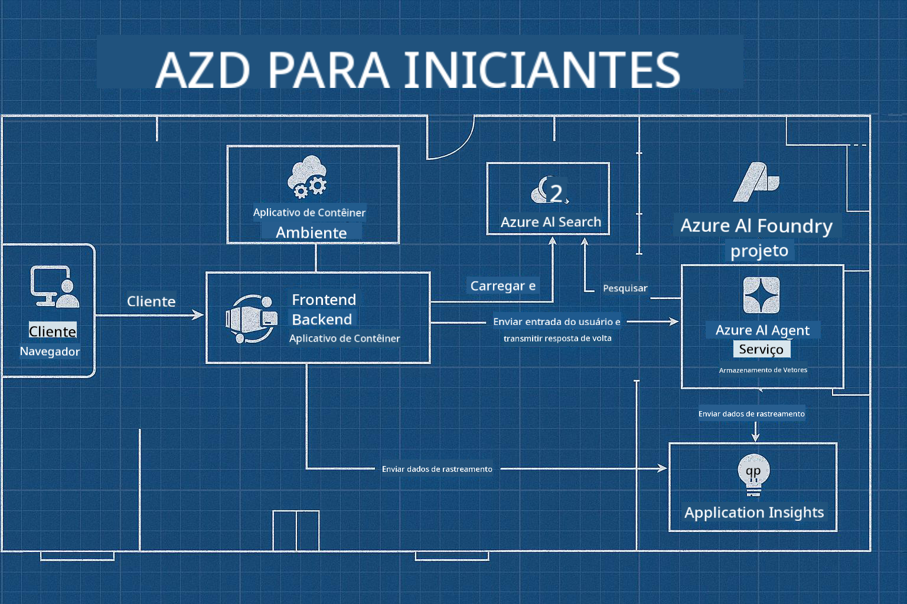

<!--
CO_OP_TRANSLATOR_METADATA:
{
  "original_hash": "245d24997bbcf2bae93bb2a503845d37",
  "translation_date": "2025-09-23T11:52:09+00:00",
  "source_file": "workshop/README.md",
  "language_code": "br"
}
-->
# Workshop AZD para Desenvolvedores de IA

## Modelos AZD

Construir uma solução de aplicação de IA de nível empresarial para o seu cenário específico é muito parecido com construir sua própria casa. Você pode projetá-la sozinho, construir tijolo por tijolo e assumir a responsabilidade de garantir que ela atenda a todas as diretrizes de governança e desenvolvimento.

**OU ....**

Você pode trabalhar com um arquiteto que lhe forneça um _projeto_ para uma casa inicial e, em seguida, trabalhe com você para _personalizá-la_ de acordo com suas necessidades. Isso permite que você se concentre no que torna **sua casa** especial, enquanto a fiação, encanamento e outras dependências são cuidados pelos especialistas.

**Essa é a abordagem por trás dos [Modelos de Aplicações de IA](https://ai.azure.com/templates)** - uma série de projetos para construir diferentes tipos de "casas" de aplicações de IA, dependendo das suas necessidades e dependências principais.

## Personalização de Modelos

Os modelos são projetados para funcionar com o [Azure AI Foundry](https://ai.azure.com). Pense nesta plataforma como seu "empreiteiro", com acesso a todos os recursos, ferramentas e expertise necessários para realizar o trabalho!

Tudo o que você precisa fazer é escolher [seus modelos iniciais](https://learn.microsoft.com/en-us/azure/ai-foundry/how-to/develop/ai-template-get-started). Por exemplo, focaremos no modelo _Get Started with AI Agents_ para construir uma "Casa de IA Agente" que já vem equipada com recursos como Pesquisa de IA, Red Teaming, Avaliações, Rastreamento, Monitoramento e muito mais!



Tudo o que você precisa é agendar um tempo com o arquiteto para guiá-lo no processo de personalização. O [GitHub Copilot for Azure](https://learn.microsoft.com/en-us/azure/developer/github-copilot-azure/get-started) pode ser esse guia. Basta "conversar com ele" para:

- Aprender sobre os recursos do Azure no seu modelo
- Implantar recursos do Azure
- Obter informações sobre sua implantação
- Diagnosticar e resolver problemas!

Neste workshop, aprenderemos a _desconstruir_ o modelo existente (para entender o que ele oferece) e, em seguida, _personalizá-lo_ (para atender aos nossos requisitos) - passo a passo.

Os Modelos de IA **fazem funcionar** - ao concluir o workshop, você aprenderá a **fazer dele seu**.

----

**Navegação do Workshop**
- **📚 Página Inicial do Curso**: [AZD Para Iniciantes](../README.md)
- **📖 Capítulos Relacionados**: Cobre [Capítulo 1](../README.md#-chapter-1-foundation--quick-start), [Capítulo 2](../README.md#-chapter-2-ai-first-development-recommended-for-ai-developers) e [Capítulo 5](../README.md#-chapter-5-multi-agent-ai-solutions-advanced)
- **🛠️ Laboratório Prático**: [Laboratório de IA](../docs/ai-foundry/ai-workshop-lab.md)
- **🚀 Próximos Passos**: [Módulos do Laboratório do Workshop](../../../workshop)

Bem-vindo ao workshop prático para aprender o Azure Developer CLI (AZD) com foco na implantação de aplicações de IA. Este workshop foi projetado para levá-lo dos fundamentos do AZD até a implantação de soluções de IA prontas para produção.

## Visão Geral do Workshop

**Duração:** 2-3 horas  
**Nível:** Iniciante a Intermediário  
**Pré-requisitos:** Conhecimento básico de Azure, ferramentas de linha de comando e conceitos de IA

### O que Você Vai Aprender

- **Fundamentos do AZD**: Compreendendo Infraestrutura como Código com AZD
- 🤖 **Integração de Serviços de IA**: Implantando Azure OpenAI, Pesquisa de IA e outros serviços de IA
- **Implantação de Contêineres**: Usando Azure Container Apps para aplicações de IA
- **Melhores Práticas de Segurança**: Implementando Identidade Gerenciada e configurações seguras
- **Monitoramento e Observabilidade**: Configurando Application Insights para cargas de trabalho de IA
- **Padrões de Produção**: Estratégias de implantação prontas para empresas

## Estrutura do Workshop

### Módulo 1: Fundamentos do AZD (30 minutos)
- Instalando e configurando o AZD
- Compreendendo a estrutura de projetos do AZD
- Sua primeira implantação com AZD
- **Laboratório**: Implante uma aplicação web simples

### Módulo 2: Integração com Azure OpenAI (45 minutos)
- Configurando recursos do Azure OpenAI
- Estratégias de implantação de modelos
- Configurando acesso à API e autenticação
- **Laboratório**: Implante uma aplicação de chat com GPT-4

### Módulo 3: Aplicações RAG (45 minutos)
- Integração com Pesquisa de IA do Azure
- Processamento de documentos com Azure Document Intelligence
- Embeddings vetoriais e busca semântica
- **Laboratório**: Construa um sistema de perguntas e respostas com documentos

### Módulo 4: Implantação em Produção (30 minutos)
- Configuração de Container Apps
- Otimização de desempenho e escalabilidade
- Monitoramento e registro de logs
- **Laboratório**: Implante em produção com observabilidade

### Módulo 5: Padrões Avançados (15 minutos)
- Implantações em múltiplos ambientes
- Integração com CI/CD
- Estratégias de otimização de custos
- **Encerramento**: Checklist de prontidão para produção

## Pré-requisitos

### Ferramentas Necessárias

Por favor, instale estas ferramentas antes do workshop:

```bash
# Azure Developer CLI
curl -fsSL https://aka.ms/install-azd.sh | bash

# Azure CLI
curl -sL https://aka.ms/InstallAzureCLIDeb | sudo bash

# Git
sudo apt-get install git

# Docker
curl -fsSL https://get.docker.com -o get-docker.sh
sudo sh get-docker.sh

# Python 3.10+
sudo apt-get install python3.10 python3.10-venv python3-pip
```

### Configuração da Conta Azure

1. **Assinatura do Azure**: [Inscreva-se gratuitamente](https://azure.microsoft.com/free/)
2. **Acesso ao Azure OpenAI**: [Solicite acesso](https://aka.ms/oai/access)
3. **Permissões Necessárias**:
   - Papel de Contribuidor na assinatura ou grupo de recursos
   - Administrador de Acesso de Usuário (para atribuições de RBAC)

### Verifique os Pré-requisitos

Execute este script para verificar sua configuração:

```bash
#!/bin/bash
echo "Verifying workshop prerequisites..."

# Check AZD installation
if command -v azd &> /dev/null; then
    echo "✅ Azure Developer CLI: $(azd --version)"
else
    echo "❌ Azure Developer CLI not found"
fi

# Check Azure CLI
if command -v az &> /dev/null; then
    echo "✅ Azure CLI: $(az --version | head -n1)"
else
    echo "❌ Azure CLI not found"
fi

# Check Docker
if command -v docker &> /dev/null; then
    echo "✅ Docker: $(docker --version)"
else
    echo "❌ Docker not found"
fi

# Check Python
if command -v python3 &> /dev/null; then
    echo "✅ Python: $(python3 --version)"
else
    echo "❌ Python 3 not found"
fi

# Check Azure login
if az account show &> /dev/null; then
    echo "✅ Azure: Logged in as $(az account show --query user.name -o tsv)"
else
    echo "❌ Azure: Not logged in (run 'az login')"
fi

echo "Setup verification complete!"
```

## Materiais do Workshop

### Exercícios de Laboratório

Cada módulo inclui laboratórios práticos com código inicial e instruções passo a passo:

- **[lab-1-azd-basics/](../../../workshop/lab-1-azd-basics)** - Sua primeira implantação com AZD
- **[lab-2-openai-chat/](../../../workshop/lab-2-openai-chat)** - Aplicação de chat com Azure OpenAI
- **[lab-3-rag-search/](../../../workshop/lab-3-rag-search)** - Aplicação RAG com Pesquisa de IA
- **[lab-4-production/](../../../workshop/lab-4-production)** - Padrões de implantação em produção
- **[lab-5-advanced/](../../../workshop/lab-5-advanced)** - Cenários avançados de implantação

### Materiais de Referência

- **[Guia de Integração com AI Foundry](../docs/ai-foundry/azure-ai-foundry-integration.md)** - Padrões abrangentes de integração
- **[Guia de Implantação de Modelos de IA](../docs/ai-foundry/ai-model-deployment.md)** - Melhores práticas de implantação de modelos
- **[Práticas de Produção de IA](../docs/ai-foundry/production-ai-practices.md)** - Padrões de implantação para empresas
- **[Guia de Solução de Problemas de IA](../docs/troubleshooting/ai-troubleshooting.md)** - Problemas comuns e soluções

### Modelos de Exemplo

Modelos de início rápido para cenários comuns de IA:

```
workshop/templates/
├── minimal-chat/          # Basic OpenAI chat app
├── rag-application/       # RAG with AI Search
├── multi-model/          # Multiple AI services
└── production-ready/     # Enterprise template
```

## Começando

### Opção 1: GitHub Codespaces (Recomendado)

A maneira mais rápida de começar o workshop:

[](https://github.com/codespaces/new?hide_repo_select=true&ref=main&repo=YOUR_REPO_ID)

### Opção 2: Desenvolvimento Local

1. **Clone o repositório do workshop:**
```bash
git clone https://github.com/YOUR_ORG/AZD-for-beginners.git
cd AZD-for-beginners/workshop
```

2. **Faça login no Azure:**
```bash
az login
azd auth login
```

3. **Comece com o Laboratório 1:**
```bash
cd lab-1-azd-basics
cat README.md  # Follow the instructions
```

### Opção 3: Workshop com Instrutor

Se você estiver participando de uma sessão com instrutor:

- 🎥 **Gravação do Workshop**: [Disponível sob demanda](https://aka.ms/azd-ai-workshop)
- 💬 **Comunidade no Discord**: [Participe para suporte ao vivo](https://aka.ms/foundry/discord)
- **Feedback do Workshop**: [Compartilhe sua experiência](https://aka.ms/azd-workshop-feedback)

## Cronograma do Workshop

### Aprendizado Autodirigido (3 horas)

```
⏰ 00:00 - 00:30  Module 1: AZD Foundations
⏰ 00:30 - 01:15  Module 2: Azure OpenAI Integration
⏰ 01:15 - 02:00  Module 3: RAG Applications
⏰ 02:00 - 02:30  Module 4: Production Deployment
⏰ 02:30 - 02:45  Module 5: Advanced Patterns
⏰ 02:45 - 03:00  Q&A and Next Steps
```

### Sessão com Instrutor (2,5 horas)

```
⏰ 00:00 - 00:15  Welcome & Prerequisites Check
⏰ 00:15 - 00:40  Module 1: Live Demo + Lab
⏰ 00:40 - 01:20  Module 2: OpenAI Integration
⏰ 01:20 - 01:30  Break
⏰ 01:30 - 02:10  Module 3: RAG Applications
⏰ 02:10 - 02:30  Module 4: Production Patterns
⏰ 02:30 - 02:45  Module 5: Advanced Topics
⏰ 02:45 - 03:00  Q&A and Resources
```

## Critérios de Sucesso

Ao final deste workshop, você será capaz de:

✅ **Implantar aplicações de IA** usando modelos AZD  
✅ **Configurar o Azure OpenAI** com segurança adequada  
✅ **Construir aplicações RAG** com integração ao Azure AI Search  
✅ **Implementar padrões de produção** para cargas de trabalho de IA empresariais  
✅ **Monitorar e solucionar problemas** em implantações de aplicações de IA  
✅ **Aplicar estratégias de otimização de custos** para cargas de trabalho de IA  

## Comunidade e Suporte

### Durante o Workshop

- 🙋 **Dúvidas**: Use o chat do workshop ou levante a mão
- 🐛 **Problemas**: Consulte o [guia de solução de problemas](../docs/troubleshooting/ai-troubleshooting.md)
- **Dicas**: Compartilhe descobertas com outros participantes

### Após o Workshop

- 💬 **Discord**: [Comunidade Azure AI Foundry](https://aka.ms/foundry/discord)
- **GitHub Issues**: [Relate problemas nos modelos](https://github.com/YOUR_ORG/AZD-for-beginners/issues)
- 📧 **Feedback**: [Formulário de avaliação do workshop](https://aka.ms/azd-workshop-feedback)

## Próximos Passos

### Continue Aprendendo

1. **Cenários Avançados**: Explore [implantações multi-região](../docs/ai-foundry/production-ai-practices.md#multi-region-deployment)
2. **Integração com CI/CD**: Configure [workflows do GitHub Actions](../docs/deployment/github-actions.md)
3. **Modelos Personalizados**: Crie seus próprios [modelos AZD](../docs/getting-started/custom-templates.md)

### Aplique em Seus Projetos

1. **Avaliação**: Use nosso [checklist de prontidão](./production-readiness-checklist.md)
2. **Modelos**: Comece com nossos [modelos específicos de IA](../../../workshop/templates)
3. **Suporte**: Participe do [Discord do Azure AI Foundry](https://aka.ms/foundry/discord)

### Compartilhe Seu Sucesso

- ⭐ **Dê uma estrela no repositório** se este workshop foi útil para você
- 🐦 **Compartilhe nas redes sociais** com #AzureDeveloperCLI #AzureAI
- 📝 **Escreva um post no blog** sobre sua jornada de implantação de IA

---

## Feedback do Workshop

Seu feedback nos ajuda a melhorar a experiência do workshop:

| Aspecto | Avaliação (1-5) | Comentários |
|---------|-----------------|-------------|
| Qualidade do Conteúdo | ⭐⭐⭐⭐⭐ | |
| Laboratórios Práticos | ⭐⭐⭐⭐⭐ | |
| Documentação | ⭐⭐⭐⭐⭐ | |
| Nível de Dificuldade | ⭐⭐⭐⭐⭐ | |
| Experiência Geral | ⭐⭐⭐⭐⭐ | |

**Envie seu feedback**: [Formulário de Avaliação do Workshop](https://aka.ms/azd-workshop-feedback)

---

**Anterior:** [Guia de Solução de Problemas de IA](../docs/troubleshooting/ai-troubleshooting.md) | **Próximo:** Comece com [Laboratório 1: Fundamentos do AZD](../../../workshop/lab-1-azd-basics)

**Pronto para começar a construir aplicações de IA com AZD?**

[Comece o Laboratório 1: Fundamentos do AZD →](./lab-1-azd-basics/README.md)

---

