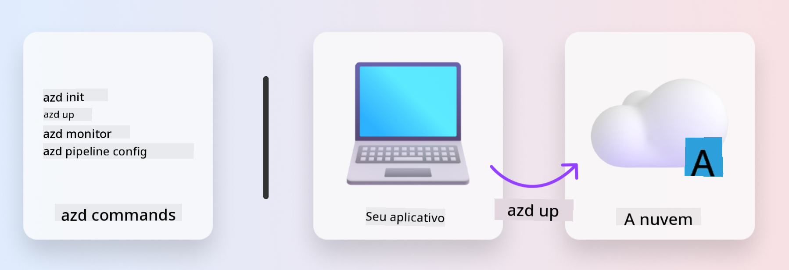
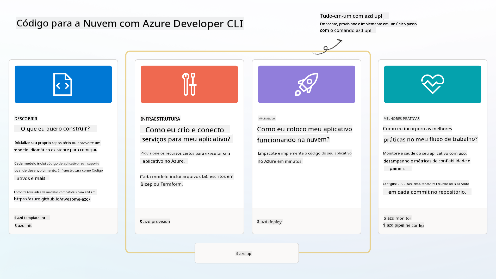

<!--
CO_OP_TRANSLATOR_METADATA:
{
  "original_hash": "06d6207eff634aefcaa41739490a5324",
  "translation_date": "2025-09-24T14:55:22+00:00",
  "source_file": "workshop/docs/instructions/1-Select-AI-Template.md",
  "language_code": "br"
}
-->
# 1. Selecionar um Template

!!! tip "AO FINAL DESTE MÓDULO, VOCÊ SERÁ CAPAZ DE"

    - [ ] Descrever o que são templates AZD
    - [ ] Descobrir e usar templates AZD para IA
    - [ ] Começar com o template de Agentes de IA
    - [ ] **Laboratório 1:** Introdução ao AZD com GitHub Codespaces

---

## 1. Uma Analogia de Construção

Construir uma aplicação moderna de IA pronta para empresas _do zero_ pode ser intimidador. É um pouco como construir sua nova casa sozinho, tijolo por tijolo. Sim, é possível! Mas não é a maneira mais eficaz de alcançar o resultado desejado!

Em vez disso, geralmente começamos com um _projeto arquitetônico_ existente e trabalhamos com um arquiteto para personalizá-lo de acordo com nossas necessidades. E é exatamente essa abordagem que devemos adotar ao construir aplicações inteligentes. Primeiro, encontre uma boa arquitetura de design que se encaixe no seu problema. Depois, trabalhe com um arquiteto de soluções para personalizar e desenvolver a solução para o seu cenário específico.

Mas onde podemos encontrar esses projetos arquitetônicos? E como encontrar um arquiteto disposto a nos ensinar como personalizar e implementar esses projetos por conta própria? Neste workshop, respondemos a essas perguntas apresentando três tecnologias:

1. [Azure Developer CLI](https://aka.ms/azd) - uma ferramenta de código aberto que acelera o caminho do desenvolvedor desde o desenvolvimento local (build) até a implantação na nuvem (ship).
1. [Azure AI Foundry Templates](https://ai.azure.com/templates) - repositórios padronizados de código aberto contendo código de exemplo, infraestrutura e arquivos de configuração para implementar uma arquitetura de solução de IA.
1. [GitHub Copilot Agent Mode](https://code.visualstudio.com/docs/copilot/chat/chat-agent-mode) - um agente de codificação baseado em conhecimento do Azure, que pode nos guiar na navegação pelo código e fazer alterações usando linguagem natural.

Com essas ferramentas em mãos, agora podemos _descobrir_ o template certo, _implantá-lo_ para validar seu funcionamento e _personalizá-lo_ para atender aos nossos cenários específicos. Vamos mergulhar e aprender como elas funcionam.

---

## 2. Azure Developer CLI

O [Azure Developer CLI](https://learn.microsoft.com/en-us/azure/developer/azure-developer-cli/) (ou `azd`) é uma ferramenta de linha de comando de código aberto que pode acelerar sua jornada de código para nuvem com um conjunto de comandos amigáveis ao desenvolvedor que funcionam de forma consistente em seu ambiente IDE (desenvolvimento) e CI/CD (devops).

Com o `azd`, sua jornada de implantação pode ser tão simples quanto:

- `azd init` - Inicializa um novo projeto de IA a partir de um template AZD existente.
- `azd up` - Provisiona infraestrutura e implanta sua aplicação em um único passo.
- `azd monitor` - Obtenha monitoramento em tempo real e diagnósticos para sua aplicação implantada.
- `azd pipeline config` - Configure pipelines de CI/CD para automatizar a implantação no Azure.

**🎯 | EXERCÍCIO**: <br/> Explore a ferramenta de linha de comando `azd` em seu ambiente GitHub Codespaces agora. Comece digitando este comando para ver o que a ferramenta pode fazer:

```bash title="" linenums="0"
azd help
```



---

## 3. O Template AZD

Para que o `azd` funcione, ele precisa saber qual infraestrutura provisionar, quais configurações aplicar e qual aplicação implantar. É aqui que entram os [templates AZD](https://learn.microsoft.com/en-us/azure/developer/azure-developer-cli/azd-templates?tabs=csharp).

Os templates AZD são repositórios de código aberto que combinam código de exemplo com arquivos de infraestrutura e configuração necessários para implementar a arquitetura da solução.
Ao usar uma abordagem de _Infraestrutura como Código_ (IaC), eles permitem que as definições de recursos do template e as configurações sejam controladas por versão (assim como o código-fonte da aplicação) - criando fluxos de trabalho reutilizáveis e consistentes entre os usuários daquele projeto.

Ao criar ou reutilizar um template AZD para _seu_ cenário, considere estas perguntas:

1. O que você está construindo? → Existe um template com código inicial para esse cenário?
1. Como sua solução está arquitetada? → Existe um template com os recursos necessários?
1. Como sua solução é implantada? → Pense em `azd deploy` com ganchos de pré/pós-processamento!
1. Como você pode otimizá-la ainda mais? → Pense em monitoramento integrado e pipelines de automação!

**🎯 | EXERCÍCIO**: <br/> 
Visite a galeria [Awesome AZD](https://azure.github.io/awesome-azd/) e use os filtros para explorar os mais de 250 templates disponíveis atualmente. Veja se consegue encontrar um que se alinhe aos requisitos do _seu_ cenário.



---

## 4. Templates de Aplicações de IA

---

