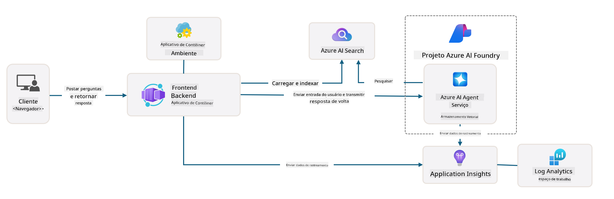

<!--
CO_OP_TRANSLATOR_METADATA:
{
  "original_hash": "4e403f041411361140d6beb88ab2a181",
  "translation_date": "2025-09-24T14:58:11+00:00",
  "source_file": "workshop/docs/instructions/3-Deconstruct-AI-Template.md",
  "language_code": "br"
}
-->
# 3. Deconstruir um Template

!!! tip "ATÉ O FINAL DESTE MÓDULO VOCÊ SERÁ CAPAZ DE"

    - [ ] Item
    - [ ] Item
    - [ ] Item
    - [ ] **Lab 3:** 

---

Com os templates do AZD e o Azure Developer CLI (`azd`), podemos iniciar rapidamente nossa jornada de desenvolvimento de IA com repositórios padronizados que fornecem código de exemplo, infraestrutura e arquivos de configuração - na forma de um projeto _starter_ pronto para ser implantado.

**Mas agora, precisamos entender a estrutura do projeto e a base de código - e ser capazes de personalizar o template do AZD - sem qualquer experiência ou conhecimento prévio do AZD!**

---

## 1. Ativar o GitHub Copilot

### 1.1 Instalar o GitHub Copilot Chat

É hora de explorar o [GitHub Copilot com o Modo Agente](https://code.visualstudio.com/docs/copilot/chat/chat-agent-mode). Agora, podemos usar linguagem natural para descrever nossa tarefa em um nível alto e obter assistência na execução. Para este laboratório, usaremos o [plano gratuito do Copilot](https://github.com/github-copilot/signup), que tem um limite mensal para conclusões e interações de chat.

A extensão pode ser instalada a partir do marketplace, mas já deve estar disponível no seu ambiente Codespaces. _Clique em `Open Chat` no menu suspenso do ícone do Copilot - e digite um prompt como `What can you do?`_ - você pode ser solicitado a fazer login. **O GitHub Copilot Chat está pronto**.

### 1.2. Instalar Servidores MCP

Para que o Modo Agente seja eficaz, ele precisa ter acesso às ferramentas certas para ajudar a recuperar conhecimento ou realizar ações. É aqui que os servidores MCP podem ajudar. Vamos configurar os seguintes servidores:

1. [Azure MCP Server](../../../../../workshop/docs/instructions)
1. [Microsoft Docs MCP Server](../../../../../workshop/docs/instructions)

Para ativá-los:

1. Crie um arquivo chamado `.vscode/mcp.json` se ele não existir
1. Copie o seguinte para esse arquivo - e inicie os servidores!
   ```json title=".vscode/mcp.json"
   {
      "servers": {
         "Azure MCP Server": {
            "command": "npx",
            "args": [
            "-y",
            "@azure/mcp@latest",
            "server",
            "start"
            ]
         },
         "microsoft.docs.mcp": {
            "type": "http",
            "url": "https://learn.microsoft.com/api/mcp"
         }
      }
   }
   ```

??? warning "Você pode receber um erro indicando que `npx` não está instalado (clique para expandir e corrigir)"

      Para corrigir isso, abra o arquivo `.devcontainer/devcontainer.json` e adicione esta linha à seção de recursos. Em seguida, reconstrua o contêiner. Agora você deve ter o `npx` instalado.

      ```title="" linenums="0"
         "features": {
            "ghcr.io/devcontainers/features/node:1": {},
            ...
         },
      ```

---

### 1.3. Testar o GitHub Copilot Chat

**Primeiro, use `az login` para autenticar com o Azure a partir do terminal do VS Code.**

Agora você deve ser capaz de consultar o status da sua assinatura do Azure e fazer perguntas sobre recursos implantados ou configurações. Experimente estes prompts:

1. `List my Azure resource groups`
1. `#foundry list my current deployments`

Você também pode fazer perguntas sobre a documentação do Azure e obter respostas baseadas no servidor Microsoft Docs MCP. Experimente estes prompts:

1. `#microsoft_docs_search What is Azure Developer CLI?`
1. `#microsoft_docs_search Show me a Python tutorial to chat with deployed model`

Ou você pode solicitar trechos de código para concluir uma tarefa. Experimente este prompt:

1. `Give me a Python code example that uses AAD for an interactive chat client`

No modo `Ask`, isso fornecerá código que você pode copiar e testar. No modo `Agent`, isso pode ir um passo além e criar os recursos relevantes para você - incluindo scripts de configuração e documentação - para ajudá-lo a executar a tarefa.

**Agora você está equipado para começar a explorar o repositório de templates**

---

## 2. Deconstruir Arquitetura

??? prompt "PERGUNTAR: Explique a arquitetura da aplicação em docs/images/architecture.png em 1 parágrafo"

      Esta aplicação é um chat com inteligência artificial construído no Azure que demonstra uma arquitetura moderna baseada em agentes. A solução é centrada em um Azure Container App que hospeda o código principal da aplicação, processando a entrada do usuário e gerando respostas inteligentes por meio de um agente de IA. 
      
      A arquitetura utiliza o Projeto Azure AI Foundry como base para as capacidades de IA, conectando-se aos Serviços de IA do Azure que fornecem os modelos de linguagem subjacentes (como GPT-4o-mini) e funcionalidades de agente. As interações do usuário fluem por um frontend baseado em React para um backend FastAPI que se comunica com o serviço de agente de IA para gerar respostas contextuais. 
      
      O sistema incorpora capacidades de recuperação de conhecimento por meio de busca em arquivos ou do serviço Azure AI Search, permitindo que o agente acesse e cite informações de documentos carregados. Para excelência operacional, a arquitetura inclui monitoramento abrangente por meio do Application Insights e do Log Analytics Workspace para rastreamento, registro e otimização de desempenho. 
      
      O Azure Storage fornece armazenamento de blobs para dados da aplicação e uploads de arquivos, enquanto o Managed Identity garante acesso seguro entre os recursos do Azure sem armazenar credenciais. Toda a solução é projetada para escalabilidade e manutenção, com a aplicação conteinerizada escalando automaticamente com base na demanda, enquanto oferece segurança integrada, monitoramento e capacidades de CI/CD por meio do ecossistema de serviços gerenciados do Azure.



---

## 3. Estrutura do Repositório

!!! prompt "PERGUNTAR: Explique a estrutura de pastas do template. Comece com um diagrama hierárquico visual."

??? info "RESPOSTA: Diagrama Hierárquico Visual"

      ```bash title="" 
      get-started-with-ai-agents/
      ├── 📋 Configuração & Setup
      │   ├── azure.yaml                    # Configuração do Azure Developer CLI
      │   ├── docker-compose.yaml           # Contêineres de desenvolvimento local
      │   ├── pyproject.toml                # Configuração do projeto Python
      │   ├── requirements-dev.txt          # Dependências de desenvolvimento
      │   └── .devcontainer/                # Configuração do contêiner de desenvolvimento do VS Code
      │
      ├── 🏗️ Infraestrutura (infra/)
      │   ├── main.bicep                    # Template principal de infraestrutura
      │   ├── api.bicep                     # Recursos específicos da API
      │   ├── main.parameters.json          # Parâmetros de infraestrutura
      │   └── core/                         # Componentes modulares de infraestrutura
      │       ├── ai/                       # Configurações de serviços de IA
      │       ├── host/                     # Infraestrutura de hospedagem
      │       ├── monitor/                  # Monitoramento e registro
      │       ├── search/                   # Configuração do Azure AI Search
      │       ├── security/                 # Segurança e identidade
      │       └── storage/                  # Configurações de conta de armazenamento
      │
      ├── 💻 Código Fonte da Aplicação (src/)
      │   ├── api/                          # API Backend
      │   │   ├── main.py                   # Entrada da aplicação FastAPI
      │   │   ├── routes.py                 # Definições de rotas da API
      │   │   ├── search_index_manager.py   # Funcionalidade de busca
      │   │   ├── data/                     # Manipulação de dados da API
      │   │   ├── static/                   # Recursos web estáticos
      │   │   └── templates/                # Templates HTML
      │   ├── frontend/                     # Frontend React/TypeScript
      │   │   ├── package.json              # Dependências do Node.js
      │   │   ├── vite.config.ts            # Configuração de build do Vite
      │   │   └── src/                      # Código fonte do frontend
      │   ├── data/                         # Arquivos de dados de exemplo
      │   │   └── embeddings.csv            # Embeddings pré-computados
      │   ├── files/                        # Arquivos da base de conhecimento
      │   │   ├── customer_info_*.json      # Exemplos de dados de clientes
      │   │   └── product_info_*.md         # Documentação de produtos
      │   ├── Dockerfile                    # Configuração do contêiner
      │   └── requirements.txt              # Dependências do Python
      │
      ├── 🔧 Automação & Scripts (scripts/)
      │   ├── postdeploy.sh/.ps1           # Configuração pós-implantação
      │   ├── setup_credential.sh/.ps1     # Configuração de credenciais
      │   ├── validate_env_vars.sh/.ps1    # Validação de variáveis de ambiente
      │   └── resolve_model_quota.sh/.ps1  # Gerenciamento de cota de modelo
      │
      ├── 🧪 Testes & Avaliação
      │   ├── tests/                        # Testes unitários e de integração
      │   │   └── test_search_index_manager.py
      │   ├── evals/                        # Framework de avaliação de agentes
      │   │   ├── evaluate.py               # Executor de avaliação
      │   │   ├── eval-queries.json         # Consultas de teste
      │   │   └── eval-action-data-path.json
      │   ├── sandbox/                      # Playground de desenvolvimento
      │   │   ├── 1-quickstart.py           # Exemplos de início rápido
      │   │   └── aad-interactive-chat.py   # Exemplos de autenticação
      │   └── airedteaming/                 # Avaliação de segurança de IA
      │       └── ai_redteaming.py          # Testes de red team
      │
      ├── 📚 Documentação (docs/)
      │   ├── deployment.md                 # Guia de implantação
      │   ├── local_development.md          # Instruções de configuração local
      │   ├── troubleshooting.md            # Problemas comuns e soluções
      │   ├── azure_account_setup.md        # Pré-requisitos do Azure
      │   └── images/                       # Recursos da documentação
      │
      └── 📄 Metadados do Projeto
         ├── README.md                     # Visão geral do projeto
         ├── CODE_OF_CONDUCT.md           # Diretrizes da comunidade
         ├── CONTRIBUTING.md              # Guia de contribuição
         ├── LICENSE                      # Termos de licença
         └── next-steps.md                # Orientação pós-implantação
      ```

### 3.1. Arquitetura Principal do App

Este template segue um padrão de **aplicação web full-stack** com:

- **Backend**: Python FastAPI com integração ao Azure AI
- **Frontend**: TypeScript/React com sistema de build Vite
- **Infraestrutura**: Templates Azure Bicep para recursos na nuvem
- **Containerização**: Docker para implantação consistente

### 3.2 Infraestrutura como Código (bicep)

A camada de infraestrutura utiliza templates **Azure Bicep** organizados de forma modular:

   - **`main.bicep`**: Orquestra todos os recursos do Azure
   - **Módulos `core/`**: Componentes reutilizáveis para diferentes serviços
      - Serviços de IA (Azure OpenAI, AI Search)
      - Hospedagem de contêineres (Azure Container Apps)
      - Monitoramento (Application Insights, Log Analytics)
      - Segurança (Key Vault, Managed Identity)

### 3.3 Código Fonte da Aplicação (`src/`)

**API Backend (`src/api/`)**:

- API REST baseada em FastAPI
- Integração com o serviço de agente de IA do Azure
- Gerenciamento de índice de busca para recuperação de conhecimento
- Capacidades de upload e processamento de arquivos

**Frontend (`src/frontend/`)**:

- SPA moderna em React/TypeScript
- Vite para desenvolvimento rápido e builds otimizados
- Interface de chat para interações com o agente

**Base de Conhecimento (`src/files/`)**:

- Exemplos de dados de clientes e produtos
- Demonstra recuperação de conhecimento baseada em arquivos
- Exemplos nos formatos JSON e Markdown

### 3.4 DevOps & Automação

**Scripts (`scripts/`)**:

- Scripts multiplataforma em PowerShell e Bash
- Validação e configuração de ambiente
- Configuração pós-implantação
- Gerenciamento de cota de modelo

**Integração com Azure Developer CLI**:

- Configuração `azure.yaml` para fluxos de trabalho `azd`
- Provisionamento e implantação automatizados
- Gerenciamento de variáveis de ambiente

### 3.5 Testes & Garantia de Qualidade

**Framework de Avaliação (`evals/`)**:

- Avaliação de desempenho do agente
- Testes de qualidade de consulta-resposta
- Pipeline de avaliação automatizado

**Segurança de IA (`airedteaming/`)**:

- Testes de red team para segurança de IA
- Escaneamento de vulnerabilidades de segurança
- Práticas de IA responsável

---

## 4. Parabéns 🏆

Você utilizou com sucesso o GitHub Copilot Chat com servidores MCP para explorar o repositório.

- [X] Ativou o GitHub Copilot para Azure
- [X] Entendeu a Arquitetura da Aplicação
- [X] Explorou a estrutura do template AZD

Isso lhe dá uma noção dos ativos de _infraestrutura como código_ deste template. A seguir, vamos analisar o arquivo de configuração do AZD.

---

