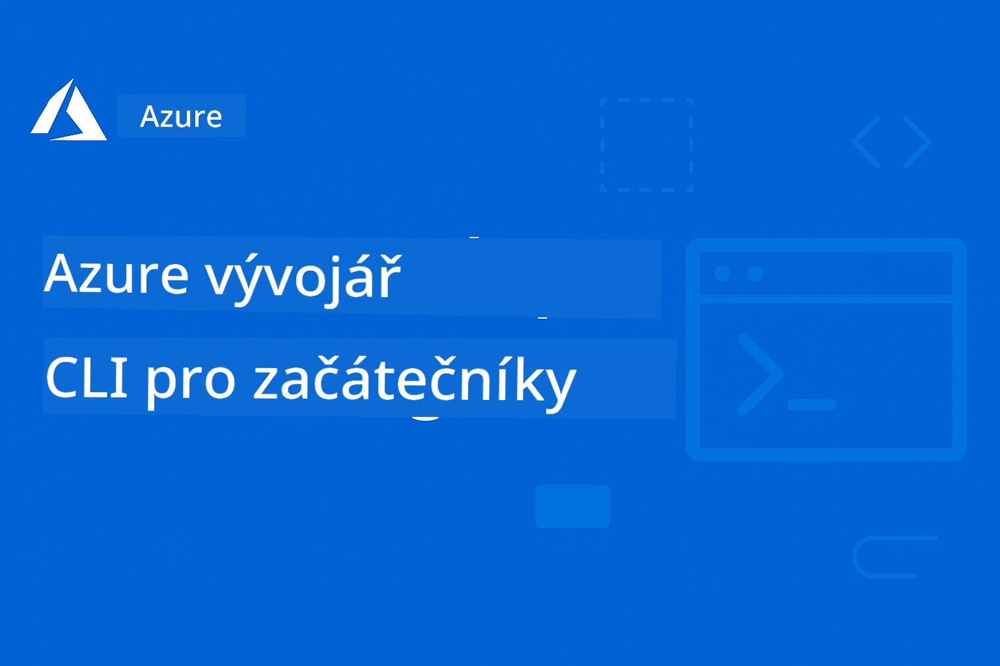

# AZD pro začátečníky: Strukturovaná vzdělávací cesta

 

[](https://GitHub.com/microsoft/azd-for-beginners/watchers/)
[](https://GitHub.com/microsoft/azd-for-beginners/network/)
[](https://GitHub.com/microsoft/azd-for-beginners/stargazers/)

[](https://discord.gg/microsoft-azure)
[](https://discord.gg/nTYy5BXMWG)

## Začínáme s tímto kurzem

Postupujte podle těchto kroků, abyste zahájili svou cestu učením AZD:

1. **Vytvořte fork repozitáře**: Klikněte na [](https://GitHub.com/microsoft/azd-for-beginners/fork)
2. **Naklonujte repozitář**: `git clone https://github.com/microsoft/azd-for-beginners.git`
3. **Připojte se ke komunitě**: [Azure Discord Communities](https://discord.com/invite/ByRwuEEgH4) pro odbornou podporu
4. **Vyberte si svou studijní cestu**: Vyberte kapitolu níže, která odpovídá vaší úrovni zkušeností

### Podpora více jazyků

#### Automatické překlady (vždy aktuální)

<!-- CO-OP TRANSLATOR LANGUAGES TABLE START -->
[Arabic](../ar/README.md) | [Bengali](../bn/README.md) | [Bulgarian](../bg/README.md) | [Burmese (Myanmar)](../my/README.md) | [Chinese (Simplified)](../zh-CN/README.md) | [Chinese (Traditional, Hong Kong)](../zh-HK/README.md) | [Chinese (Traditional, Macau)](../zh-MO/README.md) | [Chinese (Traditional, Taiwan)](../zh-TW/README.md) | [Croatian](../hr/README.md) | [Czech](./README.md) | [Danish](../da/README.md) | [Dutch](../nl/README.md) | [Estonian](../et/README.md) | [Finnish](../fi/README.md) | [French](../fr/README.md) | [German](../de/README.md) | [Greek](../el/README.md) | [Hebrew](../he/README.md) | [Hindi](../hi/README.md) | [Hungarian](../hu/README.md) | [Indonesian](../id/README.md) | [Italian](../it/README.md) | [Japanese](../ja/README.md) | [Kannada](../kn/README.md) | [Korean](../ko/README.md) | [Lithuanian](../lt/README.md) | [Malay](../ms/README.md) | [Malayalam](../ml/README.md) | [Marathi](../mr/README.md) | [Nepali](../ne/README.md) | [Nigerian Pidgin](../pcm/README.md) | [Norwegian](../no/README.md) | [Persian (Farsi)](../fa/README.md) | [Polish](../pl/README.md) | [Portuguese (Brazil)](../pt-BR/README.md) | [Portuguese (Portugal)](../pt-PT/README.md) | [Punjabi (Gurmukhi)](../pa/README.md) | [Romanian](../ro/README.md) | [Russian](../ru/README.md) | [Serbian (Cyrillic)](../sr/README.md) | [Slovak](../sk/README.md) | [Slovenian](../sl/README.md) | [Spanish](../es/README.md) | [Swahili](../sw/README.md) | [Swedish](../sv/README.md) | [Tagalog (Filipino)](../tl/README.md) | [Tamil](../ta/README.md) | [Telugu](../te/README.md) | [Thai](../th/README.md) | [Turkish](../tr/README.md) | [Ukrainian](../uk/README.md) | [Urdu](../ur/README.md) | [Vietnamese](../vi/README.md)

> **Raději klonovat lokálně?**

> Tento repozitář obsahuje 50+ jazykových překladů, což výrazně zvětšuje velikost stahování. Pro klonování bez překladů použijte sparsní checkout:
> ```bash
> git clone --filter=blob:none --sparse https://github.com/microsoft/AZD-for-beginners.git
> cd AZD-for-beginners
> git sparse-checkout set --no-cone '/*' '!translations' '!translated_images'
> ```
> Tím získáte vše potřebné pro dokončení kurzu s mnohem rychlejším stažením.
<!-- CO-OP TRANSLATOR LANGUAGES TABLE END -->

## Přehled kurzu

Osvojte si Azure Developer CLI (azd) prostřednictvím strukturovaných kapitol navržených pro postupné učení. **Zvláštní důraz na nasazení AI aplikací s integrací Microsoft Foundry.**

### Proč je tento kurz nezbytný pro moderní vývojáře

Na základě poznatků z komunity Microsoft Foundry Discord si **45 % vývojářů přeje používat AZD pro AI pracovní zátěže**, ale čelí výzvám:
- Složité AI architektury s více službami
- Nejlepší praktiky nasazení AI do produkce  
- Integrace a konfigurace Azure AI služeb
- Optimalizace nákladů pro AI pracovní zátěže
- Řešení problémů specifických pro AI nasazení

### Výukové cíle

Po dokončení tohoto strukturovaného kurzu budete:
- **Ovládat základy AZD**: Základní koncepty, instalace a konfigurace
- **Nasazovat AI aplikace**: Používat AZD se službami Microsoft Foundry
- **Implementovat infrastrukturu jako kód**: Správa Azure zdrojů s Bicep šablonami
- **Řešit problémy s nasazením**: Odstraňovat běžné chyby a ladit problémy
- **Optimalizovat pro produkci**: Bezpečnost, škálování, monitoring a správa nákladů
- **Vytvářet multi-agentní řešení**: Nasazení složitých AI architektur

## 📚 Výukové kapitoly

*Vyberte si studijní cestu podle úrovně zkušeností a cílů*

### 🚀 Kapitola 1: Základní informace a rychlý start
**Předpoklady**: Azure předplatné, základní znalost příkazové řádky  
**Délka**: 30-45 minut  
**Složitost**: ⭐

#### Co se naučíte
- Pochopení základů Azure Developer CLI
- Instalace AZD na vaší platformě
- Vaše první úspěšné nasazení

#### Výukové zdroje
- **🎯 Začněte zde**: [Co je Azure Developer CLI?](../..)
- **📖 Teorie**: [Základy AZD](docs/getting-started/azd-basics.md) - Klíčové koncepty a terminologie
- **⚙️ Nastavení**: [Instalace a nastavení](docs/getting-started/installation.md) - Průvodce pro danou platformu
- **🛠️ Prakticky**: [Váš první projekt](docs/getting-started/first-project.md) - Návod krok za krokem
- **📋 Rychlý přehled**: [Přehled příkazů](resources/cheat-sheet.md)

#### Praktická cvičení
```bash
# Rychlá kontrola instalace
azd version

# Nasadit vaši první aplikaci
azd init --template todo-nodejs-mongo
azd up
```

**💡 Výsledek kapitoly**: Úspěšné nasazení jednoduché webové aplikace do Azure pomocí AZD

**✅ Ověření úspěchu:**
```bash
# Po dokončení kapitoly 1 byste měli být schopni:
azd version              # Zobrazuje nainstalovanou verzi
azd init --template todo-nodejs-mongo  # Inicializuje projekt
azd up                  # Nasadí do Azure
azd show                # Zobrazí URL běžící aplikace
# Aplikace se otevře v prohlížeči a funguje
azd down --force --purge  # Odstraňuje zdroje
```

**📊 Časová náročnost:** 30-45 minut  
**📈 Úroveň po dokončení:** Může samostatně nasazovat základní aplikace

**✅ Ověření úspěchu:**
```bash
# Po dokončení kapitoly 1 byste měli být schopni:
azd version              # Zobrazuje nainstalovanou verzi
azd init --template todo-nodejs-mongo  # Inicializuje projekt
azd up                  # Nasazuje do Azure
azd show                # Zobrazuje URL běžící aplikace
# Aplikace se otevře v prohlížeči a funguje
azd down --force --purge  # Čistí zdroje
```

**📊 Časová náročnost:** 30-45 minut  
**📈 Úroveň po dokončení:** Může samostatně nasazovat základní aplikace

---

### 🤖 Kapitola 2: Vývoj zaměřený na AI (doporučeno pro AI vývojáře)
**Předpoklady**: Dokončená kapitola 1  
**Délka**: 1-2 hodiny  
**Složitost**: ⭐⭐

#### Co se naučíte
- Integrace Microsoft Foundry s AZD
- Nasazování aplikací s AI funkcemi
- Pochopení konfigurace AI služeb

#### Výukové zdroje
- **🎯 Začněte zde**: [Integrace Microsoft Foundry](docs/microsoft-foundry/microsoft-foundry-integration.md)
- **📖 Vzory**: [Nasazení AI modelu](docs/microsoft-foundry/ai-model-deployment.md) - Nasazení a správa AI modelů
- **🛠️ Workshop**: [AI workshop lab](docs/microsoft-foundry/ai-workshop-lab.md) - Připravte svá AI řešení pro AZD
- **🎥 Interaktivní průvodce**: [Materiály workshopu](workshop/README.md) - Výuka v prohlížeči s MkDocs * DevContainer prostředí
- **📋 Šablony**: [Šablony Microsoft Foundry](../..)
- **📝 Příklady**: [Příklady nasazení AZD](examples/README.md)

#### Praktická cvičení
```bash
# Nasadte svou první AI aplikaci
azd init --template azure-search-openai-demo
azd up

# Vyzkoušejte další AI šablony
azd init --template openai-chat-app-quickstart
azd init --template agent-openai-python-prompty
```

**💡 Výsledek kapitoly**: Nasadit a nakonfigurovat AI chatovací aplikaci s funkcí RAG

**✅ Ověření úspěchu:**
```bash
# Po druhé kapitole byste měli být schopni:
azd init --template azure-search-openai-demo
azd up
# Testovat rozhraní pro AI chat
# Pokládat otázky a získávat odpovědi poháněné AI včetně zdrojů
# Ověřit, že integrace vyhledávání funguje
azd monitor  # Zkontrolovat, že Application Insights zobrazuje telemetrii
azd down --force --purge
```

**📊 Časová náročnost:** 1-2 hodiny  
**📈 Úroveň po dokončení:** Může nasazovat a konfigurovat produkčně připravené AI aplikace  
**💰 Povědomí o nákladech:** Pochopení nákladů 80–150 USD/měsíčně pro vývoj, 300–3500 USD/měsíčně pro produkci

#### 💰 Úvahy o nákladech pro AI nasazení

**Vývojové prostředí (odhadem 80–150 USD/měsíčně):**
- Azure OpenAI (Pay-as-you-go): 0–50 USD/měsíčně (podle využití tokenů)
- AI Search (základní úroveň): 75 USD/měsíčně
- Container Apps (spotřeba): 0–20 USD/měsíčně
- Úložiště (standardní): 1–5 USD/měsíčně

**Produkční prostředí (odhadem 300–3 500+ USD/měsíčně):**
- Azure OpenAI (PTU pro konzistentní výkon): 3 000+ USD/měsíčně NEBO Pay-as-you-go při vysokém využití
- AI Search (standardní úroveň): 250 USD/měsíčně
- Container Apps (vyhrazené): 50–100 USD/měsíčně
- Application Insights: 5–50 USD/měsíčně
- Úložiště (prémiové): 10–50 USD/měsíčně

**💡 Tipy pro optimalizaci nákladů:**
- Využívejte **bezplatnou úroveň** Azure OpenAI pro učení (včetně 50 000 tokenů/měsíc)
- Používejte `azd down` pro uvolnění zdrojů, když nepracujete aktivně na vývoji
- Začněte s platbou dle spotřeby, upgrade na PTU pouze pro produkci
- Použijte `azd provision --preview` pro odhad nákladů před nasazením
- Zapněte automatické škálování: plaťte pouze za skutečné využití

**Sledování nákladů:**
```bash
# Zkontrolujte odhadované měsíční náklady
azd provision --preview

# Sledujte skutečné náklady v portálu Azure
az consumption budget list --resource-group <your-rg>
```

---

### ⚙️ Kapitola 3: Konfigurace a autentizace
**Předpoklady**: Dokončená kapitola 1  
**Délka**: 45-60 minut  
**Složitost**: ⭐⭐

#### Co se naučíte
- Konfigurace a správa prostředí
- Nejlepší postupy autentizace a zabezpečení
- Pojmenování a organizace zdrojů

#### Výukové zdroje
- **📖 Konfigurace**: [Průvodce konfigurací](docs/getting-started/configuration.md) - Nastavení prostředí
- **🔐 Zabezpečení**: [Autentizační vzory a spravovaná identita](docs/getting-started/authsecurity.md) - Vzory autentizace
- **📝 Příklady**: [Příklad databázové aplikace](examples/database-app/README.md) - Příklady s AZD a databází

#### Praktická cvičení
- Konfigurujte více prostředí (dev, staging, prod)
- Nastavte spravovanou identitu pro autentizaci
- Implementujte konfigurace specifické pro prostředí

**💡 Výsledek kapitoly**: Spravovat více prostředí se správnou autentizací a zabezpečením

---

### 🏗️ Kapitola 4: Infrastruktura jako kód a nasazení
**Předpoklady**: Dokončené kapitoly 1-3  
**Délka**: 1-1,5 hodiny  
**Složitost**: ⭐⭐⭐

#### Co se naučíte
- Pokročilé vzory nasazení
- Infrastruktura jako kód s Bicep
- Strategie provisioning zdrojů

#### Výukové zdroje
- **📖 Nasazení**: [Průvodce nasazením](docs/deployment/deployment-guide.md) - Kompletní workflow
- **🏗️ Provisioning**: [Provisioning zdrojů](docs/deployment/provisioning.md) - Správa Azure zdrojů
- **📝 Příklady**: [Příklad Container App](../../examples/container-app) - Nasazení kontejnerů

#### Praktická cvičení
- Vytvoříte vlastní Bicep šablony
- Nasadíte aplikace se více službami
- Implementujete blue-green deployment strategie

**💡 Výsledek kapitoly**: Nasazovat složité více-službové aplikace pomocí vlastních infrastrukturálních šablon

---

### 🎯 Kapitola 5: Multi-Agentní AI řešení (pokročilé)
**Předpoklady**: Dokončené kapitoly 1-2  
**Délka**: 2-3 hodiny  
**Složitost**: ⭐⭐⭐⭐
#### Co se naučíte
- Vzory víceagentní architektury
- Orchestrace a koordinace agentů
- Produkční připravené nasazení AI

#### Výukové zdroje
- **🤖 Doporučený projekt**: [Retail Multi-Agent Solution](examples/retail-scenario.md) – Kompletní implementace
- **🛠️ ARM šablony**: [ARM Template Package](../../examples/retail-multiagent-arm-template) – Jedno-klikové nasazení
- **📖 Architektura**: [Vzory koordinace více agentů](/docs/pre-deployment/coordination-patterns.md) – Vzory

#### Praktická cvičení
```bash
# Nasadit kompletní maloobchodní multi-agentní řešení
cd examples/retail-multiagent-arm-template
./deploy.sh

# Prozkoumat konfigurace agentů
az deployment group show --resource-group <rg-name> --name <deployment-name>
```

**💡 Výsledek kapitoly**: Nasadit a spravovat produkčně připravené víceagentní AI řešení s agenty Zákazník a Inventář

---

### 🔍 Kapitola 6: Validace a plánování před nasazením
**Předpoklady**: Kapitola 4 dokončena  
**Délka**: 1 hodina  
**Složitost**: ⭐⭐

#### Co se naučíte
- Plánování kapacity a validace zdrojů
- Strategie výběru SKU
- Kontroly před nasazením a automatizace

#### Výukové zdroje
- **📊 Plánování**: [Plánování kapacity](docs/pre-deployment/capacity-planning.md) – Validace zdrojů
- **💰 Výběr**: [Výběr SKU](docs/pre-deployment/sku-selection.md) – Nákladově efektivní volby
- **✅ Validace**: [Kontroly před nasazením](docs/pre-deployment/preflight-checks.md) – Automatizované skripty

#### Praktická cvičení
- Spustit skripty na validaci kapacity
- Optimalizovat výběr SKU pro nižší náklady
- Implementovat automatizované kontroly před nasazením

**💡 Výsledek kapitoly**: Validovat a optimalizovat nasazení před jejich provedením

---

### 🚨 Kapitola 7: Řešení problémů a ladění
**Předpoklady**: Dokončena libovolná kapitola o nasazení  
**Délka**: 1–1,5 hodiny  
**Složitost**: ⭐⭐

#### Co se naučíte
- Systematické přístupy k ladění
- Běžné problémy a jejich řešení
- Řešení problémů specifických pro AI

#### Výukové zdroje
- **🔧 Běžné problémy**: [Běžné problémy](docs/troubleshooting/common-issues.md) – FAQ a řešení
- **🕵️ Ladění**: [Průvodce laděním](docs/troubleshooting/debugging.md) – Krok za krokem strategie
- **🤖 AI problémy**: [Řešení AI problémů](docs/troubleshooting/ai-troubleshooting.md) – Problémy služeb AI

#### Praktická cvičení
- Diagnostikovat selhání nasazení
- Vyřešit problémy s autentizací
- Ladit konektivitu služby AI

**💡 Výsledek kapitoly**: Samostatně diagnostikovat a řešit běžné problémy s nasazením

---

### 🏢 Kapitola 8: Produkční a podnikové vzory
**Předpoklady**: Kapitoly 1–4 dokončeny  
**Délka**: 2–3 hodiny  
**Složitost**: ⭐⭐⭐⭐

#### Co se naučíte
- Strategie produkčního nasazení
- Podnikové bezpečnostní vzory
- Monitorování a optimalizace nákladů

#### Výukové zdroje
- **🏭 Produkce**: [Best practices produkční AI](docs/microsoft-foundry/production-ai-practices.md) – Podnikové vzory
- **📝 Příklady**: [Příklad mikroservis](../../examples/microservices) – Složitá architektura
- **📊 Monitoring**: [Integrace Application Insights](docs/pre-deployment/application-insights.md) – Monitorování

#### Praktická cvičení
- Implementovat podnikové bezpečnostní vzory
- Nastavit komplexní monitorování
- Nasadit do produkce s korektní správou

**💡 Výsledek kapitoly**: Nasadit podnikové aplikace s plnou produkční funkcionalitou

---

## 🎓 Přehled workshopu: Praktické vzdělávání

> **⚠️ STAV WORKSHOPU: Aktivní vývoj**  
> Materiály workshopu jsou právě vyvíjeny a zdokonalovány. Základní moduly fungují, ale některé pokročilé části nejsou dokončeny. Intenzivně pracujeme na dokončení veškerého obsahu. [Sledovat pokrok →](workshop/README.md)

### Interaktivní materiály workshopu
**Komplexní praktické učení s nástroji v prohlížeči a vedenými cvičeními**

Materiály workshopu poskytují strukturovaný interaktivní zážitek, který doplňuje výukový plán podle kapitol výše. Workshop je navržen jak pro samostatné učení, tak pro vedené lekce lektorem.

#### 🛠️ Vlastnosti workshopu
- **Prohlížečové rozhraní**: Kompletní workshop poháněný MkDocs s vyhledáváním, kopírováním a výběrem motivů
- **Integrace GitHub Codespaces**: Nastavení vývojového prostředí jedním kliknutím
- **Strukturovaná cesta učení**: 7 kroků vedených cvičení (celkem 3,5 hodiny)
- **Objevování → Nasazení → Přizpůsobení**: Progresivní metoda
- **Interaktivní DevContainer prostředí**: Přednastavené nástroje a závislosti

#### 📚 Struktura workshopu
Workshop následuje metodiku **Objevování → Nasazení → Přizpůsobení**:

1. **Fáze objevování** (45 min)  
   - Prozkoumat Microsoft Foundry šablony a služby  
   - Pochopit vzory víceagentní architektury  
   - Zhodnotit požadavky a předpoklady pro nasazení  

2. **Fáze nasazení** (2 hodiny)  
   - Praktické nasazení AI aplikací s AZD  
   - Konfigurace Azure AI služeb a koncových bodů  
   - Implementace bezpečnostních a autentizačních vzorů  

3. **Fáze přizpůsobení** (45 min)  
   - Úprava aplikací pro specifické případy použití  
   - Optimalizace pro produkční nasazení  
   - Implementace monitorování a řízení nákladů

#### 🚀 Začínáme s workshopem
```bash
# Možnost 1: GitHub Codespaces (doporučeno)
# Klikněte na "Code" → "Create codespace on main" v repozitáři

# Možnost 2: Lokální vývoj
git clone https://github.com/microsoft/azd-for-beginners.git
cd azd-for-beginners/workshop
# Postupujte podle pokynů ke konfiguraci v workshop/README.md
```

#### 🎯 Výsledky učení workshopu
Účastníci po dokončení workshopu budou umět:  
- **Nasadit produkční AI aplikace**: Použít AZD s Microsoft Foundry službami  
- **Ovládat víceagentní architekturu**: Implementovat koordinovaná AI agentová řešení  
- **Implementovat bezpečnostní best practices**: Konfigurovat autentizaci a řízení přístupu  
- **Optimalizovat pro škálování**: Navrhovat nákladově efektivní, výkonná nasazení  
- **Vyřešit problémy s nasazením**: Samostatně řešit běžné potíže

#### 📖 Zdroje workshopu
- **🎥 Interaktivní průvodce**: [Workshopové materiály](workshop/README.md) – Učební prostředí v prohlížeči  
- **📋 Pokyny krok za krokem**: [Vedená cvičení](../../workshop/docs/instructions) – Podrobné návody  
- **🛠️ AI workshop lab**: [AI workshop lab](docs/microsoft-foundry/ai-workshop-lab.md) – AI zaměřená cvičení  
- **💡 Rychlý start**: [Workshop Setup Guide](workshop/README.md#quick-start) – Konfigurace prostředí

**Ideální pro**: Firemní školení, univerzitní kurzy, samostudium a vývojářské bootcampy.

---

## 📖 Co je Azure Developer CLI?

Azure Developer CLI (azd) je vývojářsky orientované příkazové rozhraní, které urychluje proces vytváření a nasazování aplikací do Azure. Nabízí:

- **Nasazení založené na šablonách** – Použití předpřipravených šablon pro běžné aplikační vzory  
- **Infrastruktura jako kód** – Správa zdrojů Azure pomocí Bicep nebo Terraform  
- **Integrované pracovní postupy** – Plynulé provisionování, nasazování a monitorování aplikací  
- **Přátelské k vývojářům** – Optimalizováno pro efektivitu a zkušenost vývojářů

### **AZD + Microsoft Foundry: Perfektní pro AI nasazení**

**Proč AZD pro AI řešení?** AZD řeší hlavní výzvy, kterým čelí AI vývojáři:

- **Šablony připravené pro AI** – Předkonfigurované šablony pro Azure OpenAI, Cognitive Services a ML workloads  
- **Bezpečné AI nasazení** – Vestavěné bezpečnostní vzory pro AI služby, API klíče a modelové koncové body  
- **Produkční AI vzory** – Best practices pro škálovatelné a nákladově efektivní AI aplikace  
- **Koncový AI workflow** – Od vývoje modelu po produkční nasazení s adekvátním monitorováním  
- **Optimalizace nákladů** – Inteligentní alokace zdrojů a škálovací strategie pro AI workloads  
- **Integrace Microsoft Foundry** – Plynulé napojení na katalog modelů a koncové body Microsoft Foundry

---

## 🎯 Knihovna šablon a příkladů

### Doporučené: Microsoft Foundry šablony  
**Začněte zde, pokud nasazujete AI aplikace!**

> **Poznámka:** Tyto šablony demonstrují různé AI vzory. Některé jsou externí Azure Samples, jiné lokální implementace.

| Šablona | Kapitola | Složitost | Služby | Typ |
|---------|----------|-----------|--------|-----|
| [**Začínáme s AI chatem**](https://github.com/Azure-Samples/get-started-with-ai-chat) | Kapitola 2 | ⭐⭐ | AzureOpenAI + Azure AI Model Inference API + Azure AI Search + Azure Container Apps + Application Insights | Externí |
| [**Začínáme s AI agenty**](https://github.com/Azure-Samples/get-started-with-ai-agents) | Kapitola 2 | ⭐⭐ | Azure AI Agent Service + AzureOpenAI + Azure AI Search + Azure Container Apps + Application Insights| Externí |
| [**Azure Search + OpenAI Demo**](https://github.com/Azure-Samples/azure-search-openai-demo) | Kapitola 2 | ⭐⭐ | AzureOpenAI + Azure AI Search + App Service + Storage | Externí |
| [**OpenAI Chat App Quickstart**](https://github.com/Azure-Samples/openai-chat-app-quickstart) | Kapitola 2 | ⭐ | AzureOpenAI + Container Apps + Application Insights | Externí |
| [**Agent OpenAI Python Prompty**](https://github.com/Azure-Samples/agent-openai-python-prompty) | Kapitola 5 | ⭐⭐⭐ | AzureOpenAI + Azure Functions + Prompty | Externí |
| [**Contoso Chat RAG**](https://github.com/Azure-Samples/contoso-chat) | Kapitola 8 | ⭐⭐⭐⭐ | AzureOpenAI + AI Search + Cosmos DB + Container Apps | Externí |
| [**Retail Multi-Agent Solution**](examples/retail-scenario.md) | Kapitola 5 | ⭐⭐⭐⭐ | AzureOpenAI + AI Search + Storage + Container Apps + Cosmos DB | **Lokální** |

### Doporučené: Kompletní studijní scénáře  
**Šablony produkčně připravených aplikací mapované na učební kapitoly**

| Šablona | Studijní kapitola | Složitost | Klíčové učení |
|---------|-------------------|-----------|---------------|
| [**openai-chat-app-quickstart**](https://github.com/Azure-Samples/openai-chat-app-quickstart) | Kapitola 2 | ⭐ | Základní AI vzory nasazení |
| [**azure-search-openai-demo**](https://github.com/Azure-Samples/azure-search-openai-demo) | Kapitola 2 | ⭐⭐ | Implementace RAG s Azure AI Search |
| [**ai-document-processing**](https://github.com/Azure-Samples/ai-document-processing) | Kapitola 4 | ⭐⭐ | Integrace Document Intelligence |
| [**agent-openai-python-prompty**](https://github.com/Azure-Samples/agent-openai-python-prompty) | Kapitola 5 | ⭐⭐⭐ | Agent framework a volání funkcí |
| [**contoso-chat**](https://github.com/Azure-Samples/contoso-chat) | Kapitola 8 | ⭐⭐⭐ | Podniková orchestrace AI |
| [**retail-multi-agent-solution**](examples/retail-scenario.md) | Kapitola 5 | ⭐⭐⭐⭐ | Víceagentní architektura s agenty Zákazník a Inventář |

### Učení podle typu příkladu

> **📌 Lokální vs. Externí příklady:**  
> **Lokální příklady** (v tomto repozitáři) = Okamžitě připravené k použití  
> **Externí příklady** (Azure Samples) = Klonujte z přidružených repozitářů

#### Lokální příklady (okamžitě použitelné)
- [**Retail Multi-Agent Solution**](examples/retail-scenario.md) – Kompletní produkčně připravená implementace s ARM šablonami  
  - Víceagentní architektura (agent Zákazník + Inventář)  
  - Komplexní monitoring a vyhodnocování  
  - Jedno-klikové nasazení pomocí ARM šablony

#### Lokální příklady – kontejnerové aplikace (kapitoly 2–5)  
**Komplexní příklady nasazení kontejnerů v tomto repozitáři:**  
- [**Příklady Container App**](examples/container-app/README.md) – Kompletní průvodce nasazením kontejnerů  
  - [Jednoduché Flask API](../../examples/container-app/simple-flask-api) – Základní REST API s scale-to-zero  
  - [Mikroservisní architektura](../../examples/container-app/microservices) – Produkčně připravené multi-service nasazení  
  - Rychlý start, produkční a pokročilé vzory nasazení  
  - Návody na monitoring, zabezpečení a optimalizaci nákladů

#### Externí příklady – jednoduché aplikace (kapitoly 1–2)  
**Klonujte tyto repozitáře Azure Samples pro začátek:**  
- [Jednoduchá webová aplikace – Node.js + MongoDB](https://github.com/Azure-Samples/todo-nodejs-mongo) – Základní vzory nasazení  
- [Statická webová stránka – React SPA](https://github.com/Azure-Samples/todo-csharp-sql-swa-func) – Nasazení statického obsahu  
- [Container App – Python Flask](https://github.com/Azure-Samples/container-apps-store-api-microservice) – Nasazení REST API

#### Externí příklady – integrace databáze (kapitoly 3–4)  
- [Databázová aplikace – C# + SQL](https://github.com/Azure-Samples/todo-csharp-sql) – Vzory konektivity k databázi  
- [Functions + Cosmos DB](https://github.com/Azure-Samples/todo-python-mongo-swa-func) – Serverless datový workflow

#### Externí příklady – pokročilé vzory (kapitoly 4–8)  
- [Java mikroservisy](https://github.com/Azure-Samples/java-microservices-aca-lab) – Multi-service architektury  
- [Container Apps Jobs](https://github.com/Azure-Samples/container-apps-jobs) – Zpracování na pozadí  
- [Enterprise ML pipeline](https://github.com/Azure-Samples/mlops-v2) – Produkčně připravené ML vzory

### Externí kolekce šablon
- [**Oficiální AZD galerie šablon**](https://azure.github.io/awesome-azd/) – Kurátorovaná kolekce oficiálních a komunitních šablon
- [**Šablony Azure Developer CLI**](https://learn.microsoft.com/en-us/azure/developer/azure-developer-cli/azd-templates) - Dokumentace šablon Microsoft Learn
- [**Adresář příkladů**](examples/README.md) - Lokální výukové příklady s podrobnými vysvětleními

---

## 📚 Výukové zdroje a odkazy

### Rychlé odkazy
- [**Přehled příkazů**](resources/cheat-sheet.md) - Základní příkazy azd uspořádané podle kapitol
- [**Slovníček pojmů**](resources/glossary.md) - Terminologie Azure a azd  
- [**Často kladené otázky (FAQ)**](resources/faq.md) - Běžné otázky podle výukových kapitol
- [**Studijní průvodce**](resources/study-guide.md) - Komplexní cvičení na procvičení

### Praktické workshopy
- [**AI Workshop Lab**](docs/microsoft-foundry/ai-workshop-lab.md) - Umožněte nasazení vašich AI řešení pomocí AZD (2-3 hodiny)
- [**Interaktivní průvodce workshopem**](workshop/README.md) - Workshop v prohlížeči s MkDocs a prostředím DevContainer
- [**Strukturovaná výuková cesta**](../../workshop/docs/instructions) - Sedmistupňová vedená cvičení (Objevování → Nasazení → Přizpůsobení)
- [**Workshop AZD pro začátečníky**](workshop/README.md) - Kompletní materiály workshopu s integrací GitHub Codespaces

### Externí výukové zdroje
- Dokumentace Azure Developer CLI (https://learn.microsoft.com/en-us/azure/developer/azure-developer-cli/)
- Azure Architecture Center (https://learn.microsoft.com/en-us/azure/architecture/)
- Azure Pricing Calculator (https://azure.microsoft.com/pricing/calculator/)
- Status Azure (https://status.azure.com/)

---

## 🔧 Rychlý průvodce řešením problémů

**Běžné problémy, kterým začátečníci čelí, a rychlá řešení:**

### ❌ "azd: příkaz nebyl nalezen"

```bash
# Nejprve nainstalujte AZD
# Windows (PowerShell):
winget install microsoft.azd

# macOS:
brew tap azure/azd && brew install azd

# Linux:
curl -fsSL https://aka.ms/install-azd.sh | bash

# Ověřte instalaci
azd version
```

### ❌ „Nenalezena žádná předplatná“ nebo „Předplatné není nastaveno“

```bash
# Vypsat dostupná předplatná
az account list --output table

# Nastavit výchozí předplatné
az account set --subscription "<subscription-id-or-name>"

# Nastavit pro prostředí AZD
azd env set AZURE_SUBSCRIPTION_ID "<subscription-id>"

# Ověřit
az account show
```

### ❌ „Nedostatečná kvóta“ nebo „Kvóta překročena“

```bash
# Vyzkoušejte jiný region Azure
azd env set AZURE_LOCATION "westus2"
azd up

# Nebo použijte menší SKU při vývoji
# Upravte infra/main.parameters.json:
{
  "sku": "B1"  // Instead of "P1V2"
}
```

### ❌ „azd up“ selhává v polovině průběhu

```bash
# Možnost 1: Vyčistit a zkusit znovu
azd down --force --purge
azd up

# Možnost 2: Jen opravit infrastrukturu
azd provision

# Možnost 3: Zkontrolovat podrobné protokoly
azd show
azd logs
```

### ❌ „Autentizace selhala“ nebo „Platnost tokenu vypršela“

```bash
# Znovu ověřit
az logout
az login

azd auth logout
azd auth login

# Ověřit autentizaci
az account show
```

### ❌ „Zdroj již existuje“ nebo konflikty jmen

```bash
# AZD generuje unikátní jména, ale v případě konfliktu:
azd down --force --purge

# Pak to zkuste znovu s novým prostředím
azd env new dev-v2
azd up
```

### ❌ Nasazení šablony trvá příliš dlouho

**Běžná doba čekání:**
- Jednoduchá webová aplikace: 5-10 minut
- Aplikace s databází: 10-15 minut
- AI aplikace: 15-25 minut (provisioning OpenAI je pomalý)

```bash
# Zkontrolujte pokrok
azd show

# Pokud jste zaseknutí více než 30 minut, zkontrolujte Azure Portal:
azd monitor
# Hledejte neúspěšné nasazení
```

### ❌ „Přístup zamítnut“ nebo „Zakázáno“

```bash
# Zkontrolujte svou roli v Azure
az role assignment list --assignee $(az account show --query user.name -o tsv)

# Potřebujete alespoň roli "Přispěvatel"
# Požádejte svého administrátora Azure o udělení:
# - Přispěvatel (pro zdroje)
# - Správce přístupu uživatelů (pro přiřazování rolí)
```

### ❌ Nelze najít URL nasazené aplikace

```bash
# Zobrazit všechny koncové body služby
azd show

# Nebo otevřete Azure Portal
azd monitor

# Zkontrolovat konkrétní službu
azd env get-values
# Hledejte proměnné *_URL
```

### 📚 Kompletní zdroje pro řešení problémů

- **Průvodce běžnými problémy:** [Podrobné řešení](docs/troubleshooting/common-issues.md)
- **AI-specifické problémy:** [Řešení problémů AI](docs/troubleshooting/ai-troubleshooting.md)
- **Průvodce laděním:** [Krok za krokem ladění](docs/troubleshooting/debugging.md)
- **Získejte pomoc:** [Azure Discord](https://discord.gg/microsoft-azure) #azure-developer-cli

---

## 🔧 Rychlý průvodce řešením problémů

**Běžné problémy, kterým začátečníci čelí, a rychlá řešení:**

<details>
<summary><strong>❌ "azd: příkaz nebyl nalezen"</strong></summary>

```bash
# Nejprve nainstalujte AZD
# Windows (PowerShell):
winget install microsoft.azd

# macOS:
brew tap azure/azd && brew install azd

# Linux:
curl -fsSL https://aka.ms/install-azd.sh | bash

# Ověřte instalaci
azd version
```
</details>

<details>
<summary><strong>❌ „Nenalezena žádná předplatná“ nebo „Předplatné není nastaveno“</strong></summary>

```bash
# Vypište dostupné předplatné
az account list --output table

# Nastavte výchozí předplatné
az account set --subscription "<subscription-id-or-name>"

# Nastavit pro prostředí AZD
azd env set AZURE_SUBSCRIPTION_ID "<subscription-id>"

# Ověřit
az account show
```
</details>

<details>
<summary><strong>❌ „Nedostatečná kvóta“ nebo „Kvóta překročena“</strong></summary>

```bash
# Vyzkoušejte jiný region Azure
azd env set AZURE_LOCATION "westus2"
azd up

# Nebo použijte menší SKU ve vývoji
# Upravte infra/main.parameters.json:
{
  "sku": "B1"  // Instead of "P1V2"
}
```
</details>

<details>
<summary><strong>❌ „azd up“ selhává v polovině průběhu</strong></summary>

```bash
# Možnost 1: Vyčistit a zkusit znovu
azd down --force --purge
azd up

# Možnost 2: Opravit pouze infrastrukturu
azd provision

# Možnost 3: Zkontrolovat podrobné záznamy
azd show
azd logs
```
</details>

<details>
<summary><strong>❌ „Autentizace selhala“ nebo „Platnost tokenu vypršela“</strong></summary>

```bash
# Znovu ověřit
az logout
az login

azd auth logout
azd auth login

# Ověřit autentizaci
az account show
```
</details>

<details>
<summary><strong>❌ „Zdroj již existuje“ nebo konflikty jmen</strong></summary>

```bash
# AZD generuje unikátní názvy, ale pokud dojde ke konfliktu:
azd down --force --purge

# Pak to zkuste znovu s novým prostředím
azd env new dev-v2
azd up
```
</details>

<details>
<summary><strong>❌ Nasazení šablony trvá příliš dlouho</strong></summary>

**Běžná doba čekání:**
- Jednoduchá webová aplikace: 5-10 minut
- Aplikace s databází: 10-15 minut
- AI aplikace: 15-25 minut (provisioning OpenAI je pomalý)

```bash
# Zkontrolujte průběh
azd show

# Pokud je zaseknuto déle než 30 minut, zkontrolujte Azure Portal:
azd monitor
# Hledejte neúspěšné nasazení
```
</details>

<details>
<summary><strong>❌ „Přístup zamítnut“ nebo „Zakázáno“</strong></summary>

```bash
# Zkontrolujte svou roli v Azure
az role assignment list --assignee $(az account show --query user.name -o tsv)

# Potřebujete alespoň roli "Přispěvatel"
# Požádejte svého Azure administrátora o udělení:
# - Přispěvatel (pro zdroje)
# - Správce přístupu uživatelů (pro přiřazení rolí)
```
</details>

<details>
<summary><strong>❌ Nelze najít URL nasazené aplikace</strong></summary>

```bash
# Zobrazit všechny koncové body služby
azd show

# Nebo otevřete Azure Portal
azd monitor

# Zkontrolujte konkrétní službu
azd env get-values
# Hledejte proměnné *_URL
```
</details>

### 📚 Kompletní zdroje pro řešení problémů

- **Průvodce běžnými problémy:** [Podrobné řešení](docs/troubleshooting/common-issues.md)
- **AI-specifické problémy:** [Řešení problémů AI](docs/troubleshooting/ai-troubleshooting.md)
- **Průvodce laděním:** [Krok za krokem ladění](docs/troubleshooting/debugging.md)
- **Získejte pomoc:** [Azure Discord](https://discord.gg/microsoft-azure) #azure-developer-cli

---

## 🎓 Dokončení kurzu a certifikace

### Sledování pokroku
Sledujte svůj pokrok ve výuce v každé kapitole:

- [ ] **Kapitola 1**: Základy a rychlý start ✅
- [ ] **Kapitola 2**: AI-first vývoj ✅  
- [ ] **Kapitola 3**: Konfigurace a autentizace ✅
- [ ] **Kapitola 4**: Infrastruktura jako kód a nasazení ✅
- [ ] **Kapitola 5**: Víceagentová AI řešení ✅
- [ ] **Kapitola 6**: Validace a plánování před nasazením ✅
- [ ] **Kapitola 7**: Řešení problémů a ladění ✅
- [ ] **Kapitola 8**: Produkční a enterprise vzory ✅

### Ověření znalostí
Po dokončení každé kapitoly ověřte své znalosti:
1. **Praktické cvičení**: Dokončete praktické nasazení kapitoly
2. **Kontrola znalostí**: Projděte sekci FAQ pro vaši kapitolu
3. **Diskuse v komunitě**: Sdílejte své zkušenosti v Azure Discord
4. **Další kapitola**: Pokračujte na další úroveň složitosti

### Výhody dokončení kurzu
Po dokončení všech kapitol získáte:
- **Produkční zkušenosti**: Nasadili jste skutečné AI aplikace do Azure
- **Profesionální dovednosti**: Schopnost nasazení připraveného pro podnikové prostředí  
- **Uznání v komunitě**: Aktivní člen Azure developerské komunity
- **Kariérní růst**: Žádané znalosti nasazení AZD a AI

---

## 🤝 Komunita a podpora

### Získejte pomoc a podporu
- **Technické problémy**: [Nahlášení chyb a požadavky na funkce](https://github.com/microsoft/azd-for-beginners/issues)
- **Otázky k učení**: [Microsoft Azure Discord komunita](https://discord.gg/microsoft-azure) a [](https://discord.gg/nTYy5BXMWG)
- **Pomoc se specifiky AI**: Připojte se k [](https://discord.gg/nTYy5BXMWG)
- **Dokumentace**: [Oficiální dokumentace Azure Developer CLI](https://learn.microsoft.com/en-us/azure/developer/azure-developer-cli/)

### Přehled komunity z Microsoft Foundry Discordu

**Poslední výsledky ankety z kanálu #Azure:**
- **45 %** vývojářů chce používat AZD pro AI pracovní zátěže
- **Největší výzvy**: Nasazení více služeb, správa přihlašovacích údajů, připravenost do produkce  
- **Nejčastěji požadované**: AI-specifické šablony, průvodci řešením problémů, osvědčené postupy

**Přidejte se k naší komunitě, kde můžete:**
- Sdílet své zkušenosti s AZD + AI a získat pomoc
- Získat přístup k raným verzím nových AI šablon
- Přispívat k osvědčeným postupům AI nasazení
- Ovlivňovat budoucí vývoj funkcí AI + AZD

### Přispívání do kurzu
Vítáme vaše příspěvky! Přečtěte si náš [Průvodce přispíváním](CONTRIBUTING.md) pro podrobnosti o:
- **Vylepšení obsahu**: Zdokonalte stávající kapitoly a příklady
- **Nové příklady**: Přidejte reálné scénáře a šablony  
- **Překlady**: Pomozte udržovat podporu pro více jazyků
- **Hlásení chyb**: Zlepšete přesnost a srozumitelnost
- **Standardy komunity**: Dodržujte naše zásady inkluzivní komunity

---

## 📄 Informace o kurzu

### Licence
Tento projekt je licencován pod licencí MIT - podrobnosti naleznete v souboru [LICENSE](../../LICENSE).

### Související výukové zdroje Microsoft Learn

Náš tým vytváří i další komplexní výukové kurzy:

<!-- CO-OP TRANSLATOR OTHER COURSES START -->
### LangChain
[](https://aka.ms/langchain4j-for-beginners)
[](https://aka.ms/langchainjs-for-beginners?WT.mc_id=m365-94501-dwahlin)
[](https://github.com/microsoft/langchain-for-beginners?WT.mc_id=m365-94501-dwahlin)
---

### Azure / Edge / MCP / Agentů
[](https://github.com/microsoft/AZD-for-beginners?WT.mc_id=academic-105485-koreyst)
[](https://github.com/microsoft/edgeai-for-beginners?WT.mc_id=academic-105485-koreyst)
[](https://github.com/microsoft/mcp-for-beginners?WT.mc_id=academic-105485-koreyst)
[](https://github.com/microsoft/ai-agents-for-beginners?WT.mc_id=academic-105485-koreyst)

---
 
### Generativní AI série
[](https://github.com/microsoft/generative-ai-for-beginners?WT.mc_id=academic-105485-koreyst)
[-9333EA?style=for-the-badge&labelColor=E5E7EB&color=9333EA)](https://github.com/microsoft/Generative-AI-for-beginners-dotnet?WT.mc_id=academic-105485-koreyst)
[-C084FC?style=for-the-badge&labelColor=E5E7EB&color=C084FC)](https://github.com/microsoft/generative-ai-for-beginners-java?WT.mc_id=academic-105485-koreyst)
[-E879F9?style=for-the-badge&labelColor=E5E7EB&color=E879F9)](https://github.com/microsoft/generative-ai-with-javascript?WT.mc_id=academic-105485-koreyst)

---
 
### Základní výuka
[](https://aka.ms/ml-beginners?WT.mc_id=academic-105485-koreyst)
[](https://aka.ms/datascience-beginners?WT.mc_id=academic-105485-koreyst)
[](https://aka.ms/ai-beginners?WT.mc_id=academic-105485-koreyst)
[](https://github.com/microsoft/Security-101?WT.mc_id=academic-96948-sayoung)
[](https://aka.ms/webdev-beginners?WT.mc_id=academic-105485-koreyst)
[](https://aka.ms/iot-beginners?WT.mc_id=academic-105485-koreyst)
[](https://github.com/microsoft/xr-development-for-beginners?WT.mc_id=academic-105485-koreyst)

---
 
### Série Copilot
[](https://aka.ms/GitHubCopilotAI?WT.mc_id=academic-105485-koreyst)
[](https://github.com/microsoft/mastering-github-copilot-for-dotnet-csharp-developers?WT.mc_id=academic-105485-koreyst)
[](https://github.com/microsoft/CopilotAdventures?WT.mc_id=academic-105485-koreyst)
<!-- CO-OP TRANSLATOR OTHER COURSES END -->

---

## 🗺️ Navigace kurzem

**🚀 Připraven začít se učit?**

**Začátečníci**: Začněte s [Kapitola 1: Základy a rychlý start](../..)  
**Vývojáři AI**: Přeskočte na [Kapitola 2: Vývoj zaměřený na AI](../..)  
**Zkušení vývojáři**: Začněte s [Kapitola 3: Konfigurace a ověřování](../..)

**Další kroky**: [Začněte Kapitolu 1 - Základy AZD](docs/getting-started/azd-basics.md) →

---

<!-- CO-OP TRANSLATOR DISCLAIMER START -->
**Prohlášení o vyloučení odpovědnosti**:  
Tento dokument byl přeložen pomocí AI překladatelské služby [Co-op Translator](https://github.com/Azure/co-op-translator). Přestože usilujeme o přesnost, mějte prosím na paměti, že automatizované překlady mohou obsahovat chyby nebo nepřesnosti. Původní dokument v jeho rodném jazyce by měl být považován za závazný zdroj. Pro kritické informace se doporučuje využít profesionální lidský překlad. Neneseme odpovědnost za jakékoliv nedorozumění nebo chybné výklady vzniklé v důsledku používání tohoto překladu.
<!-- CO-OP TRANSLATOR DISCLAIMER END -->