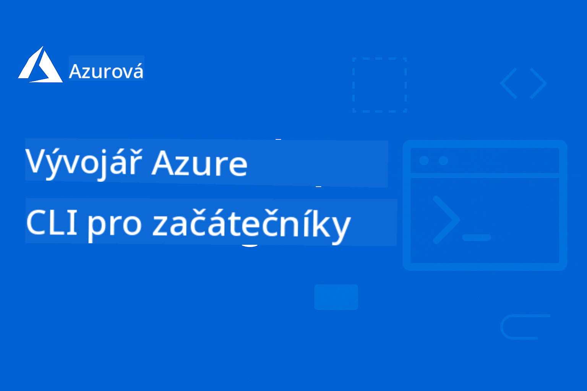

<!--
CO_OP_TRANSLATOR_METADATA:
{
  "original_hash": "6a804be263d09a0fd6f36d6ab251707a",
  "translation_date": "2025-11-25T12:25:22+00:00",
  "source_file": "README.md",
  "language_code": "cs"
}
-->
# AZD pro začátečníky: Strukturovaná cesta k učení

 

[](https://GitHub.com/microsoft/azd-for-beginners/watchers/)
[](https://GitHub.com/microsoft/azd-for-beginners/network/)
[](https://GitHub.com/microsoft/azd-for-beginners/stargazers/)

[](https://discord.gg/microsoft-azure)
[](https://discord.gg/nTYy5BXMWG)

## Začínáme s tímto kurzem

Postupujte podle těchto kroků a začněte svou cestu učením AZD:

1. **Forkněte repozitář**: Klikněte [](https://GitHub.com/microsoft/azd-for-beginners/fork)
2. **Naklonujte repozitář**: `git clone https://github.com/microsoft/azd-for-beginners.git`
3. **Připojte se ke komunitě**: [Azure Discord komunity](https://discord.com/invite/ByRwuEEgH4) pro odbornou podporu
4. **Vyberte si svou cestu učení**: Vyberte kapitolu níže, která odpovídá vaší úrovni zkušeností

### Podpora více jazyků

#### Automatické překlady (vždy aktuální)

[Arabština](../ar/README.md) | [Bengálština](../bn/README.md) | [Bulharština](../bg/README.md) | [Barmština (Myanmar)](../my/README.md) | [Čínština (zjednodušená)](../zh/README.md) | [Čínština (tradiční, Hongkong)](../hk/README.md) | [Čínština (tradiční, Macao)](../mo/README.md) | [Čínština (tradiční, Tchaj-wan)](../tw/README.md) | [Chorvatština](../hr/README.md) | [Čeština](./README.md) | [Dánština](../da/README.md) | [Nizozemština](../nl/README.md) | [Estonština](../et/README.md) | [Finština](../fi/README.md) | [Francouzština](../fr/README.md) | [Němčina](../de/README.md) | [Řečtina](../el/README.md) | [Hebrejština](../he/README.md) | [Hindština](../hi/README.md) | [Maďarština](../hu/README.md) | [Indonéština](../id/README.md) | [Italština](../it/README.md) | [Japonština](../ja/README.md) | [Kannadština](../kn/README.md) | [Korejština](../ko/README.md) | [Litevština](../lt/README.md) | [Malajština](../ms/README.md) | [Malajálamština](../ml/README.md) | [Maráthština](../mr/README.md) | [Nepálština](../ne/README.md) | [Nigerijský pidgin](../pcm/README.md) | [Norština](../no/README.md) | [Perština (Fársí)](../fa/README.md) | [Polština](../pl/README.md) | [Portugalština (Brazílie)](../br/README.md) | [Portugalština (Portugalsko)](../pt/README.md) | [Pándžábština (Gurmukhi)](../pa/README.md) | [Rumunština](../ro/README.md) | [Ruština](../ru/README.md) | [Srbština (cyrilice)](../sr/README.md) | [Slovenština](../sk/README.md) | [Slovinština](../sl/README.md) | [Španělština](../es/README.md) | [Svahilština](../sw/README.md) | [Švédština](../sv/README.md) | [Tagalog (Filipíny)](../tl/README.md) | [Tamilština](../ta/README.md) | [Telugština](../te/README.md) | [Thajština](../th/README.md) | [Turečtina](../tr/README.md) | [Ukrajinština](../uk/README.md) | [Urdu](../ur/README.md) | [Vietnamština](../vi/README.md)

## Přehled kurzu

Ovládněte Azure Developer CLI (azd) prostřednictvím strukturovaných kapitol navržených pro postupné učení. **Zvláštní důraz na nasazení AI aplikací s integrací Microsoft Foundry.**

### Proč je tento kurz nezbytný pro moderní vývojáře

Na základě poznatků z komunity Microsoft Foundry Discord **45 % vývojářů chce používat AZD pro AI pracovní zátěže**, ale naráží na problémy s:
- Složitými AI architekturami s více službami
- Nejlepšími postupy pro nasazení AI do produkce  
- Integrací a konfigurací Azure AI služeb
- Optimalizací nákladů na AI pracovní zátěže
- Řešením problémů specifických pro nasazení AI

### Cíle učení

Po dokončení tohoto strukturovaného kurzu budete:
- **Ovládat základy AZD**: Základní koncepty, instalace a konfigurace
- **Nasazovat AI aplikace**: Používat AZD s Microsoft Foundry službami
- **Implementovat infrastrukturu jako kód**: Spravovat Azure zdroje pomocí šablon Bicep
- **Řešit problémy s nasazením**: Řešit běžné problémy a ladit chyby
- **Optimalizovat pro produkci**: Bezpečnost, škálování, monitorování a řízení nákladů
- **Vytvářet multi-agentní řešení**: Nasazovat složité AI architektury

## 📚 Kapitoly kurzu

*Vyberte si svou cestu učení podle úrovně zkušeností a cílů*

### 🚀 Kapitola 1: Základy a rychlý start
**Předpoklady**: Azure předplatné, základní znalost příkazového řádku  
**Doba trvání**: 30-45 minut  
**Složitost**: ⭐

#### Co se naučíte
- Porozumění základům Azure Developer CLI
- Instalace AZD na vaší platformě
- Vaše první úspěšné nasazení

#### Výukové zdroje
- **🎯 Začněte zde**: [Co je Azure Developer CLI?](../..)
- **📖 Teorie**: [Základy AZD](docs/getting-started/azd-basics.md) - Základní koncepty a terminologie
- **⚙️ Nastavení**: [Instalace a nastavení](docs/getting-started/installation.md) - Průvodce pro konkrétní platformy
- **🛠️ Praktická část**: [Váš první projekt](docs/getting-started/first-project.md) - Krok za krokem
- **📋 Rychlý přehled**: [Přehled příkazů](resources/cheat-sheet.md)

#### Praktická cvičení
```bash
# Rychlá kontrola instalace
azd version

# Nasazení vaší první aplikace
azd init --template todo-nodejs-mongo
azd up
```

**💡 Výsledek kapitoly**: Úspěšně nasadíte jednoduchou webovou aplikaci na Azure pomocí AZD

**✅ Ověření úspěchu:**
```bash
# Po dokončení kapitoly 1 byste měli být schopni:
azd version              # Zobrazuje nainstalovanou verzi
azd init --template todo-nodejs-mongo  # Inicializuje projekt
azd up                  # Nasazuje na Azure
azd show                # Zobrazuje URL běžící aplikace
# Aplikace se otevře v prohlížeči a funguje
azd down --force --purge  # Uklízí zdroje
```

**📊 Časová investice:** 30-45 minut  
**📈 Úroveň dovedností po dokončení:** Schopnost samostatně nasazovat základní aplikace

**✅ Ověření úspěchu:**
```bash
# Po dokončení kapitoly 1 byste měli být schopni:
azd version              # Zobrazuje nainstalovanou verzi
azd init --template todo-nodejs-mongo  # Inicializuje projekt
azd up                  # Nasazuje na Azure
azd show                # Zobrazuje URL běžící aplikace
# Aplikace se otevře v prohlížeči a funguje
azd down --force --purge  # Vyčistí zdroje
```

**📊 Časová investice:** 30-45 minut  
**📈 Úroveň dovedností po dokončení:** Schopnost samostatně nasazovat základní aplikace

---

### 🤖 Kapitola 2: Vývoj zaměřený na AI (doporučeno pro AI vývojáře)
**Předpoklady**: Dokončená kapitola 1  
**Doba trvání**: 1-2 hodiny  
**Složitost**: ⭐⭐

#### Co se naučíte
- Integrace Microsoft Foundry s AZD
- Nasazování AI aplikací
- Porozumění konfiguracím AI služeb

#### Výukové zdroje
- **🎯 Začněte zde**: [Integrace Microsoft Foundry](docs/microsoft-foundry/microsoft-foundry-integration.md)
- **📖 Vzory**: [Nasazení AI modelů](docs/microsoft-foundry/ai-model-deployment.md) - Nasazení a správa AI modelů
- **🛠️ Workshop**: [AI Workshop Lab](docs/microsoft-foundry/ai-workshop-lab.md) - Připravte své AI řešení pro AZD
- **🎥 Interaktivní průvodce**: [Materiály workshopu](workshop/README.md) - Učení v prohlížeči s MkDocs * DevContainer prostředím
- **📋 Šablony**: [Šablony Microsoft Foundry](../..)
- **📝 Příklady**: [Příklady nasazení AZD](examples/README.md)

#### Praktická cvičení
```bash
# Nasazení vaší první AI aplikace
azd init --template azure-search-openai-demo
azd up

# Vyzkoušejte další AI šablony
azd init --template openai-chat-app-quickstart
azd init --template agent-openai-python-prompty
```

**💡 Výsledek kapitoly**: Nasadíte a nakonfigurujete AI chatovací aplikaci s funkcemi RAG

**✅ Ověření úspěchu:**
```bash
# Po kapitole 2 byste měli být schopni:
azd init --template azure-search-openai-demo
azd up
# Otestovat rozhraní AI chat
# Klást otázky a získávat odpovědi s podporou AI a zdroji
# Ověřit, že integrace vyhledávání funguje
azd monitor  # Zkontrolovat, že Application Insights ukazuje telemetrii
azd down --force --purge
```

**📊 Časová investice:** 1-2 hodiny  
**📈 Úroveň dovedností po dokončení:** Schopnost nasazovat a konfigurovat produkčně připravené AI aplikace  
**💰 Povědomí o nákladech:** Pochopení nákladů $80-150/měsíc pro vývoj, $300-3500/měsíc pro produkci

#### 💰 Úvahy o nákladech na nasazení AI

**Vývojové prostředí (odhad $80-150/měsíc):**
- Azure OpenAI (platba za použití): $0-50/měsíc (podle využití tokenů)
- AI Search (základní úroveň): $75/měsíc
- Container Apps (spotřeba): $0-20/měsíc
- Úložiště (standardní): $1-5/měsíc

**Produkční prostředí (odhad $300-3,500+/měsíc):**
- Azure OpenAI (PTU pro konzistentní výkon): $3,000+/měsíc NEBO platba za použití s vysokým objemem
- AI Search (standardní úroveň): $250/měsíc
- Container Apps (dedikované): $50-100/měsíc
- Application Insights: $5-50/měsíc
- Úložiště (prémiové): $10-50/měsíc

**💡 Tipy na optimalizaci nákladů:**
- Používejte **bezplatnou úroveň** Azure OpenAI pro učení (50,000 tokenů/měsíc zahrnuto)
- Spusťte `azd down`, abyste uvolnili zdroje, když aktivně nevyvíjíte
- Začněte s fakturací na základě spotřeby, přejděte na PTU pouze pro produkci
- Použijte `azd provision --preview` k odhadu nákladů před nasazením
- Aktivujte automatické škálování: plaťte pouze za skutečné využití

**Monitorování nákladů:**
```bash
# Zkontrolujte odhadované měsíční náklady
azd provision --preview

# Sledujte skutečné náklady v Azure Portálu
az consumption budget list --resource-group <your-rg>
```

---

### ⚙️ Kapitola 3: Konfigurace a autentizace
**Předpoklady**: Dokončená kapitola 1  
**Doba trvání**: 45-60 minut  
**Složitost**: ⭐⭐

#### Co se naučíte
- Konfigurace a správa prostředí
- Nejlepší postupy pro autentizaci a bezpečnost
- Pojmenování a organizace zdrojů

#### Výukové zdroje
- **📖 Konfigurace**: [Průvodce konfigurací](docs/getting-started/configuration.md) - Nastavení prostředí
- **🔐 Bezpečnost**: [Vzory autentizace a spravovaná identita](docs/getting-started/authsecurity.md) - Vzory autentizace
- **📝 Příklady**: [Příklad aplikace s databází](examples/database-app/README.md) - Příklady databází AZD

#### Praktická cvičení
- Konfigurace více prostředí (vývoj, testování, produkce)
- Nastavení autentizace pomocí spravované identity
- Implementace konfigurací specifických pro prostředí

**💡 Výsledek kapitoly**: Správa více prostředí s odpovídající autentizací a bezpečností

---

### 🏗️ Kapitola 4: Infrastruktura jako kód a nasazení
**Předpoklady**: Dokončené kapitoly 1-3  
**Doba trvání**: 1-1,5 hodiny  
**Složitost**: ⭐⭐⭐

#### Co se naučíte
- Pokročilé vzory nasazení
- Infrastruktura jako kód s Bicep
- Strategie pro zajištění zdrojů

#### Výukové zdroje
- **📖 Nasazení**: [Průvodce nasazením](docs/deployment/deployment-guide.md) - Kompletní pracovní postupy
- **🏗️ Zajištění zdrojů**: [Zajištění zdrojů](docs/deployment/provisioning.md) - Správa Azure zdrojů
- **📝 Příklady**: [Příklad aplikace s kontejnery](../../examples/container-app) - Nasazení kontejnerů

#### Praktická cvičení
- Vytvoření vlastních šablon Bicep
- Nasazení aplikací s více službami
- Implementace strategií modro-zeleného nasazení

**💡 Výsledek kapitoly**: Nasazení složitých aplikací s více službami pomocí vlastních šablon infrastruktury

---

### 🎯 Kapitola 5: Multi-agentní AI řešení (pokročilé)
**Předpoklady**: Dokončené kapitoly 1-2  
**Doba trvání**: 2-3 hodiny  
**Složitost**: ⭐⭐⭐⭐

#### Co se naučíte
- Vzory architektury s více agenty
- Orchestrace a koordinace agentů
- Produkčně připravená nasazení AI

#### Výukové zdroje
- **🤖 Doporučený projekt**: [Řešení pro maloobchod s více agenty](examples/retail-scenario.md) - Kompletní implementace
- **🛠️ ARM Šablony**: [Balíček ARM šablon](../../examples/retail-multiagent-arm-template) - Jednoduché nasazení jedním kliknutím  
- **📖 Architektura**: [Vzory koordinace více agentů](/docs/pre-deployment/coordination-patterns.md) - Vzory  

#### Praktická cvičení  
```bash
# Nasadit kompletní maloobchodní řešení s více agenty
cd examples/retail-multiagent-arm-template
./deploy.sh

# Prozkoumat konfigurace agentů
az deployment group show --resource-group <rg-name> --name <deployment-name>
```
  
**💡 Výsledek kapitoly**: Nasadit a spravovat produkčně připravené AI řešení s agenty pro zákazníky a inventář  

---

### 🔍 Kapitola 6: Validace a plánování před nasazením  
**Předpoklady**: Dokončená kapitola 4  
**Doba trvání**: 1 hodina  
**Složitost**: ⭐⭐  

#### Co se naučíte  
- Plánování kapacity a validace zdrojů  
- Strategie výběru SKU  
- Kontroly před nasazením a automatizace  

#### Výukové materiály  
- **📊 Plánování**: [Plánování kapacity](docs/pre-deployment/capacity-planning.md) - Validace zdrojů  
- **💰 Výběr**: [Výběr SKU](docs/pre-deployment/sku-selection.md) - Nákladově efektivní volby  
- **✅ Validace**: [Kontroly před nasazením](docs/pre-deployment/preflight-checks.md) - Automatizované skripty  

#### Praktická cvičení  
- Spustit skripty pro validaci kapacity  
- Optimalizovat výběr SKU z hlediska nákladů  
- Implementovat automatizované kontroly před nasazením  

**💡 Výsledek kapitoly**: Validovat a optimalizovat nasazení před jeho provedením  

---

### 🚨 Kapitola 7: Řešení problémů a ladění  
**Předpoklady**: Dokončená jakákoliv kapitola o nasazení  
**Doba trvání**: 1-1,5 hodiny  
**Složitost**: ⭐⭐  

#### Co se naučíte  
- Systematické přístupy k ladění  
- Běžné problémy a jejich řešení  
- Specifické ladění pro AI  

#### Výukové materiály  
- **🔧 Běžné problémy**: [Běžné problémy](docs/troubleshooting/common-issues.md) - FAQ a řešení  
- **🕵️ Ladění**: [Průvodce laděním](docs/troubleshooting/debugging.md) - Krok za krokem  
- **🤖 Problémy s AI**: [Ladění specifické pro AI](docs/troubleshooting/ai-troubleshooting.md) - Problémy s AI službami  

#### Praktická cvičení  
- Diagnostikovat chyby při nasazení  
- Řešit problémy s autentizací  
- Ladit konektivitu AI služeb  

**💡 Výsledek kapitoly**: Samostatně diagnostikovat a řešit běžné problémy při nasazení  

---

### 🏢 Kapitola 8: Produkční a podnikové vzory  
**Předpoklady**: Dokončené kapitoly 1-4  
**Doba trvání**: 2-3 hodiny  
**Složitost**: ⭐⭐⭐⭐  

#### Co se naučíte  
- Strategie nasazení do produkce  
- Podnikové bezpečnostní vzory  
- Monitorování a optimalizace nákladů  

#### Výukové materiály  
- **🏭 Produkce**: [Nejlepší praktiky pro produkční AI](docs/microsoft-foundry/production-ai-practices.md) - Podnikové vzory  
- **📝 Příklady**: [Příklad mikroservisů](../../examples/microservices) - Složitá architektura  
- **📊 Monitorování**: [Integrace Application Insights](docs/pre-deployment/application-insights.md) - Monitorování  

#### Praktická cvičení  
- Implementovat podnikové bezpečnostní vzory  
- Nastavit komplexní monitorování  
- Nasadit do produkce s odpovídající správou  

**💡 Výsledek kapitoly**: Nasadit aplikace připravené pro podnikové prostředí s plnými produkčními schopnostmi  

---

## 🎓 Přehled workshopu: Praktická výuková zkušenost  

> **⚠️ STAV WORKSHOPU: Aktivní vývoj**  
> Materiály workshopu jsou aktuálně ve vývoji a zdokonalování. Základní moduly jsou funkční, ale některé pokročilé sekce nejsou dokončené. Aktivně pracujeme na dokončení veškerého obsahu. [Sledovat pokrok →](workshop/README.md)  

### Interaktivní materiály workshopu  
**Komplexní praktické učení s nástroji v prohlížeči a vedenými cvičeními**  

Materiály workshopu poskytují strukturovanou, interaktivní výukovou zkušenost, která doplňuje kapitoly uvedené výše. Workshop je navržen jak pro samostatné studium, tak pro vedené lekce.  

#### 🛠️ Funkce workshopu  
- **Rozhraní v prohlížeči**: Kompletní workshop s podporou MkDocs, vyhledáváním, kopírováním a funkcemi témat  
- **Integrace GitHub Codespaces**: Nastavení vývojového prostředí jedním kliknutím  
- **Strukturovaná výuková cesta**: 7 kroků vedených cvičení (celkem 3,5 hodiny)  
- **Objevování → Nasazení → Přizpůsobení**: Progresivní metodologie  
- **Interaktivní prostředí DevContainer**: Předkonfigurované nástroje a závislosti  

#### 📚 Struktura workshopu  
Workshop sleduje metodologii **Objevování → Nasazení → Přizpůsobení**:  

1. **Fáze objevování** (45 minut)  
   - Prozkoumat šablony a služby Microsoft Foundry  
   - Porozumět architektonickým vzorům více agentů  
   - Přezkoumat požadavky na nasazení a předpoklady  

2. **Fáze nasazení** (2 hodiny)  
   - Praktické nasazení AI aplikací pomocí AZD  
   - Konfigurace Azure AI služeb a koncových bodů  
   - Implementace bezpečnostních a autentizačních vzorů  

3. **Fáze přizpůsobení** (45 minut)  
   - Úprava aplikací pro specifické případy použití  
   - Optimalizace pro produkční nasazení  
   - Implementace monitorování a správy nákladů  

#### 🚀 Začínáme s workshopem  
```bash
# Možnost 1: GitHub Codespaces (Doporučeno)
# Klikněte na "Code" → "Create codespace on main" v repozitáři

# Možnost 2: Lokální vývoj
git clone https://github.com/microsoft/azd-for-beginners.git
cd azd-for-beginners/workshop
# Postupujte podle pokynů k nastavení v workshop/README.md
```
  
#### 🎯 Výukové cíle workshopu  
Po dokončení workshopu účastníci:  
- **Nasadí produkční AI aplikace**: Použití AZD s Microsoft Foundry službami  
- **Ovládnou architektury více agentů**: Implementace koordinovaných AI řešení  
- **Implementují nejlepší bezpečnostní praktiky**: Konfigurace autentizace a řízení přístupu  
- **Optimalizují pro škálování**: Návrh nákladově efektivních a výkonných nasazení  
- **Řeší problémy při nasazení**: Samostatně řeší běžné problémy  

#### 📖 Materiály workshopu  
- **🎥 Interaktivní průvodce**: [Materiály workshopu](workshop/README.md) - Výukové prostředí v prohlížeči  
- **📋 Podrobné instrukce**: [Vedená cvičení](../../workshop/docs/instructions) - Detailní postupy  
- **🛠️ AI Workshop Lab**: [AI Workshop Lab](docs/microsoft-foundry/ai-workshop-lab.md) - Cvičení zaměřená na AI  
- **💡 Rychlý start**: [Průvodce nastavením workshopu](workshop/README.md#quick-start) - Konfigurace prostředí  

**Ideální pro**: Firemní školení, univerzitní kurzy, samostatné studium a vývojářské bootcampy.  

---

## 📖 Co je Azure Developer CLI?  

Azure Developer CLI (azd) je příkazový řádek zaměřený na vývojáře, který urychluje proces vytváření a nasazování aplikací na Azure. Nabízí:  

- **Nasazení na základě šablon** - Použití předem připravených šablon pro běžné aplikační vzory  
- **Infrastruktura jako kód** - Správa Azure zdrojů pomocí Bicep nebo Terraform  
- **Integrované pracovní postupy** - Plynulé zajištění, nasazení a monitorování aplikací  
- **Přátelské pro vývojáře** - Optimalizováno pro produktivitu a zkušenosti vývojářů  

### **AZD + Microsoft Foundry: Ideální pro AI nasazení**  

**Proč AZD pro AI řešení?** AZD řeší hlavní výzvy, kterým čelí AI vývojáři:  

- **Šablony připravené pro AI** - Předkonfigurované šablony pro Azure OpenAI, Cognitive Services a ML pracovní zátěže  
- **Bezpečné AI nasazení** - Vestavěné bezpečnostní vzory pro AI služby, API klíče a koncové body modelů  
- **Produkční AI vzory** - Nejlepší praktiky pro škálovatelné a nákladově efektivní nasazení AI aplikací  
- **Kompletní AI pracovní postupy** - Od vývoje modelů po produkční nasazení s odpovídajícím monitorováním  
- **Optimalizace nákladů** - Chytré přidělování zdrojů a strategie škálování pro AI pracovní zátěže  
- **Integrace Microsoft Foundry** - Plynulé propojení s katalogem modelů a koncovými body Microsoft Foundry  

---

## 🎯 Knihovna šablon a příkladů  

### Doporučené: Šablony Microsoft Foundry  
**Začněte zde, pokud nasazujete AI aplikace!**  

> **Poznámka:** Tyto šablony demonstrují různé AI vzory. Některé jsou externí Azure Samples, jiné jsou lokální implementace.  

| Šablona | Kapitola | Složitost | Služby | Typ |  
|----------|---------|------------|----------|------|  
| [**Začít s AI chatem**](https://github.com/Azure-Samples/get-started-with-ai-chat) | Kapitola 2 | ⭐⭐ | AzureOpenAI + Azure AI Model Inference API + Azure AI Search + Azure Container Apps + Application Insights | Externí |  
| [**Začít s AI agenty**](https://github.com/Azure-Samples/get-started-with-ai-agents) | Kapitola 2 | ⭐⭐ | Azure AI Agent Service + AzureOpenAI + Azure AI Search + Azure Container Apps + Application Insights| Externí |  
| [**Azure Search + OpenAI Demo**](https://github.com/Azure-Samples/azure-search-openai-demo) | Kapitola 2 | ⭐⭐ | AzureOpenAI + Azure AI Search + App Service + Storage | Externí |  
| [**OpenAI Chat App Quickstart**](https://github.com/Azure-Samples/openai-chat-app-quickstart) | Kapitola 2 | ⭐ | AzureOpenAI + Container Apps + Application Insights | Externí |  
| [**Agent OpenAI Python Prompty**](https://github.com/Azure-Samples/agent-openai-python-prompty) | Kapitola 5 | ⭐⭐⭐ | AzureOpenAI + Azure Functions + Prompty | Externí |  
| [**Contoso Chat RAG**](https://github.com/Azure-Samples/contoso-chat) | Kapitola 8 | ⭐⭐⭐⭐ | AzureOpenAI + AI Search + Cosmos DB + Container Apps | Externí |  
| [**Řešení pro více agentů v maloobchodu**](examples/retail-scenario.md) | Kapitola 5 | ⭐⭐⭐⭐ | AzureOpenAI + AI Search + Storage + Container Apps + Cosmos DB | **Lokální** |  

### Doporučené: Kompletní výukové scénáře  
**Šablony aplikací připravené pro produkci mapované na výukové kapitoly**  

| Šablona | Výuková kapitola | Složitost | Klíčové učení |  
|----------|------------------|------------|--------------|  
| [**openai-chat-app-quickstart**](https://github.com/Azure-Samples/openai-chat-app-quickstart) | Kapitola 2 | ⭐ | Základní vzory nasazení AI |  
| [**azure-search-openai-demo**](https://github.com/Azure-Samples/azure-search-openai-demo) | Kapitola 2 | ⭐⭐ | Implementace RAG s Azure AI Search |  
| [**ai-document-processing**](https://github.com/Azure-Samples/ai-document-processing) | Kapitola 4 | ⭐⭐ | Integrace Document Intelligence |  
| [**agent-openai-python-prompty**](https://github.com/Azure-Samples/agent-openai-python-prompty) | Kapitola 5 | ⭐⭐⭐ | Rámec agentů a volání funkcí |  
| [**contoso-chat**](https://github.com/Azure-Samples/contoso-chat) | Kapitola 8 | ⭐⭐⭐ | Orchestrace AI pro podniky |  
| [**řešení pro více agentů v maloobchodu**](examples/retail-scenario.md) | Kapitola 5 | ⭐⭐⭐⭐ | Architektura více agentů se zákaznickými a inventárními agenty |  

### Učení podle typu příkladu  

> **📌 Lokální vs. externí příklady:**  
> **Lokální příklady** (v tomto repozitáři) = Připravené k okamžitému použití  
> **Externí příklady** (Azure Samples) = Klonování z odkazovaných repozitářů  

#### Lokální příklady (Připravené k použití)  
- [**Řešení pro více agentů v maloobchodu**](examples/retail-scenario.md) - Kompletní produkčně připravená implementace s ARM šablonami  
  - Architektura více agentů (Zákazník + Inventář)  
  - Komplexní monitorování a hodnocení  
  - Jednoduché nasazení pomocí ARM šablony  

#### Lokální příklady - Kontejnerové aplikace (Kapitoly 2-5)  
**Komplexní příklady nasazení kontejnerů v tomto repozitáři:**  
- [**Příklady kontejnerových aplikací**](examples/container-app/README.md) - Kompletní průvodce nasazením kontejnerů  
  - [Jednoduché Flask API](../../examples/container-app/simple-flask-api) - Základní REST API se škálováním na nulu  
  - [Architektura mikroservisů](../../examples/container-app/microservices) - Produkčně připravené nasazení více služeb  
  - Rychlý start, produkce a pokročilé vzory nasazení  
  - Monitorování, bezpečnost a optimalizace nákladů  

#### Externí příklady - Jednoduché aplikace (Kapitoly 1-2)  
**Klonujte tyto repozitáře Azure Samples pro začátek:**  
- [Jednoduchá webová aplikace - Node.js + MongoDB](https://github.com/Azure-Samples/todo-nodejs-mongo) - Základní vzory nasazení  
- [Statická webová stránka - React SPA](https://github.com/Azure-Samples/todo-csharp-sql-swa-func) - Nasazení statického obsahu  
- [Kontejnerová aplikace - Python Flask](https://github.com/Azure-Samples/container-apps-store-api-microservice) - Nasazení REST API  

#### Externí příklady - Integrace databází (Kapitola 3-4)  
- [Databázová aplikace - C# + SQL](https://github.com/Azure-Samples/todo-csharp-sql) - Vzory připojení k databázi  
- [Functions + Cosmos DB](https://github.com/Azure-Samples/todo-python-mongo-swa-func) - Serverless datové workflow  

#### Externí příklady - Pokročilé vzory (Kapitoly 4-8)  
- [Java mikroservisy](https://github.com/Azure-Samples/java-microservices-aca-lab) - Architektury více služeb  
- [Jobs pro kontejnerové aplikace](https://github.com/Azure-Samples/container-apps-jobs) - Zpracování na pozadí  
- [Podniková ML pipeline](https://github.com/Azure-Samples/mlops-v2) - Produkčně připravené ML vzory  

### Kolekce externích šablon  
- [**Oficiální galerie šablon AZD**](https://azure.github.io/awesome-azd/) - Kurátorovaná kolekce oficiálních a komunitních šablon  
- [**Šablony Azure Developer CLI**](https://learn.microsoft.com/en-us/azure/developer/azure-developer-cli/azd-templates) - Dokumentace šablon na Microsoft Learn  
- [**Adresář příkladů**](examples/README.md) - Lokální výukové příklady s podrobnými vysvětleními  

---

## 📚 Výukové materiály a odkazy  

### Rychlé odkazy  
- [**Přehled příkazů**](resources/cheat-sheet.md) - Základní příkazy azd uspořádané podle kapitol
- [**Slovníček**](resources/glossary.md) - Terminologie Azure a azd  
- [**FAQ**](resources/faq.md) - Časté otázky uspořádané podle kapitol
- [**Studijní příručka**](resources/study-guide.md) - Komplexní praktická cvičení

### Praktické workshopy
- [**AI Workshop Lab**](docs/microsoft-foundry/ai-workshop-lab.md) - Udělejte své AI řešení připravené pro nasazení pomocí AZD (2-3 hodiny)
- [**Interaktivní průvodce workshopem**](workshop/README.md) - Workshop v prohlížeči s MkDocs a DevContainer prostředím
- [**Strukturovaná vzdělávací cesta**](../../workshop/docs/instructions) - 7 kroků vedených cvičení (Objevování → Nasazení → Přizpůsobení)
- [**Workshop AZD pro začátečníky**](workshop/README.md) - Kompletní materiály pro praktický workshop s integrací GitHub Codespaces

### Externí vzdělávací zdroje
- [Dokumentace Azure Developer CLI](https://learn.microsoft.com/en-us/azure/developer/azure-developer-cli/)
- [Centrum architektury Azure](https://learn.microsoft.com/en-us/azure/architecture/)
- [Kalkulačka cen Azure](https://azure.microsoft.com/pricing/calculator/)
- [Stav Azure](https://status.azure.com/)

---

## 🔧 Rychlý průvodce řešením problémů

**Běžné problémy, se kterými se začátečníci setkávají, a jejich okamžitá řešení:**

### ❌ "azd: příkaz nebyl nalezen"

```bash
# Nejprve nainstalujte AZD
# Windows (PowerShell):
winget install microsoft.azd

# macOS:
brew tap azure/azd && brew install azd

# Linux:
curl -fsSL https://aka.ms/install-azd.sh | bash

# Ověřte instalaci
azd version
```

### ❌ "Nebyla nalezena žádná předplatná" nebo "Předplatné není nastaveno"

```bash
# Seznam dostupných předplatných
az account list --output table

# Nastavit výchozí předplatné
az account set --subscription "<subscription-id-or-name>"

# Nastavit pro prostředí AZD
azd env set AZURE_SUBSCRIPTION_ID "<subscription-id>"

# Ověřit
az account show
```

### ❌ "Nedostatečná kvóta" nebo "Kvóta překročena"

```bash
# Zkuste jiný region Azure
azd env set AZURE_LOCATION "westus2"
azd up

# Nebo použijte menší SKU při vývoji
# Upravte infra/main.parameters.json:
{
  "sku": "B1"  // Instead of "P1V2"
}
```

### ❌ "azd up" selže v polovině procesu

```bash
# Možnost 1: Vyčistit a zkusit znovu
azd down --force --purge
azd up

# Možnost 2: Opravit pouze infrastrukturu
azd provision

# Možnost 3: Zkontrolovat podrobné logy
azd show
azd logs
```

### ❌ "Ověření selhalo" nebo "Token vypršel"

```bash
# Znovu se ověřte
az logout
az login

azd auth logout
azd auth login

# Ověřte autentizaci
az account show
```

### ❌ "Zdroj již existuje" nebo konflikty názvů

```bash
# AZD generuje jedinečné názvy, ale pokud dojde ke konfliktu:
azd down --force --purge

# Poté zkuste znovu s novým prostředím
azd env new dev-v2
azd up
```

### ❌ Nasazení šablony trvá příliš dlouho

**Obvyklé doby čekání:**
- Jednoduchá webová aplikace: 5-10 minut
- Aplikace s databází: 10-15 minut
- AI aplikace: 15-25 minut (provisioning OpenAI je pomalý)

```bash
# Zkontrolujte pokrok
azd show

# Pokud uvíznete >30 minut, zkontrolujte Azure Portal:
azd monitor
# Hledejte neúspěšné nasazení
```

### ❌ "Přístup odepřen" nebo "Zakázáno"

```bash
# Zkontrolujte svou roli v Azure
az role assignment list --assignee $(az account show --query user.name -o tsv)

# Potřebujete alespoň roli "Přispěvatel"
# Požádejte svého správce Azure o udělení:
# - Přispěvatel (pro zdroje)
# - Správce přístupu uživatelů (pro přiřazení rolí)
```

### ❌ Nelze najít URL nasazené aplikace

```bash
# Zobrazit všechny koncové body služeb
azd show

# Nebo otevřít Azure Portal
azd monitor

# Zkontrolovat konkrétní službu
azd env get-values
# Hledat proměnné *_URL
```

### 📚 Kompletní zdroje pro řešení problémů

- **Průvodce běžnými problémy:** [Podrobné řešení](docs/troubleshooting/common-issues.md)
- **Problémy specifické pro AI:** [Řešení problémů s AI](docs/troubleshooting/ai-troubleshooting.md)
- **Průvodce laděním:** [Krok za krokem ladění](docs/troubleshooting/debugging.md)
- **Získejte pomoc:** [Azure Discord](https://discord.gg/microsoft-azure) #azure-developer-cli

---

## 🔧 Rychlý průvodce řešením problémů

**Běžné problémy, se kterými se začátečníci setkávají, a jejich okamžitá řešení:**

<details>
<summary><strong>❌ "azd: příkaz nebyl nalezen"</strong></summary>

```bash
# Nejprve nainstalujte AZD
# Windows (PowerShell):
winget install microsoft.azd

# macOS:
brew tap azure/azd && brew install azd

# Linux:
curl -fsSL https://aka.ms/install-azd.sh | bash

# Ověřte instalaci
azd version
```
</details>

<details>
<summary><strong>❌ "Nebyla nalezena žádná předplatná" nebo "Předplatné není nastaveno"</strong></summary>

```bash
# Seznam dostupných předplatných
az account list --output table

# Nastavit výchozí předplatné
az account set --subscription "<subscription-id-or-name>"

# Nastavit pro prostředí AZD
azd env set AZURE_SUBSCRIPTION_ID "<subscription-id>"

# Ověřit
az account show
```
</details>

<details>
<summary><strong>❌ "Nedostatečná kvóta" nebo "Kvóta překročena"</strong></summary>

```bash
# Zkuste jiný region Azure
azd env set AZURE_LOCATION "westus2"
azd up

# Nebo použijte menší SKUs při vývoji
# Upravte infra/main.parameters.json:
{
  "sku": "B1"  // Instead of "P1V2"
}
```
</details>

<details>
<summary><strong>❌ "azd up" selže v polovině procesu"</strong></summary>

```bash
# Možnost 1: Vyčistit a zkusit znovu
azd down --force --purge
azd up

# Možnost 2: Opravit pouze infrastrukturu
azd provision

# Možnost 3: Zkontrolovat podrobné logy
azd show
azd logs
```
</details>

<details>
<summary><strong>❌ "Ověření selhalo" nebo "Token vypršel"</strong></summary>

```bash
# Znovu se ověřte
az logout
az login

azd auth logout
azd auth login

# Ověřte ověření
az account show
```
</details>

<details>
<summary><strong>❌ "Zdroj již existuje" nebo konflikty názvů"</strong></summary>

```bash
# AZD generuje jedinečné názvy, ale pokud dojde ke konfliktu:
azd down --force --purge

# Poté zkusit znovu s novým prostředím
azd env new dev-v2
azd up
```
</details>

<details>
<summary><strong>❌ Nasazení šablony trvá příliš dlouho"</strong></summary>

**Obvyklé doby čekání:**
- Jednoduchá webová aplikace: 5-10 minut
- Aplikace s databází: 10-15 minut
- AI aplikace: 15-25 minut (provisioning OpenAI je pomalý)

```bash
# Zkontrolujte pokrok
azd show

# Pokud uvíznete >30 minut, zkontrolujte Azure Portal:
azd monitor
# Hledejte neúspěšné nasazení
```
</details>

<details>
<summary><strong>❌ "Přístup odepřen" nebo "Zakázáno"</strong></summary>

```bash
# Zkontrolujte svou roli v Azure
az role assignment list --assignee $(az account show --query user.name -o tsv)

# Potřebujete alespoň roli "Přispěvatel"
# Požádejte svého správce Azure o udělení:
# - Přispěvatel (pro zdroje)
# - Správce přístupu uživatelů (pro přiřazení rolí)
```
</details>

<details>
<summary><strong>❌ Nelze najít URL nasazené aplikace"</strong></summary>

```bash
# Zobrazit všechny koncové body služeb
azd show

# Nebo otevřít Azure Portal
azd monitor

# Zkontrolovat konkrétní službu
azd env get-values
# Hledat proměnné *_URL
```
</details>

### 📚 Kompletní zdroje pro řešení problémů

- **Průvodce běžnými problémy:** [Podrobné řešení](docs/troubleshooting/common-issues.md)
- **Problémy specifické pro AI:** [Řešení problémů s AI](docs/troubleshooting/ai-troubleshooting.md)
- **Průvodce laděním:** [Krok za krokem ladění](docs/troubleshooting/debugging.md)
- **Získejte pomoc:** [Azure Discord](https://discord.gg/microsoft-azure) #azure-developer-cli

---

## 🎓 Dokončení kurzu a certifikace

### Sledování pokroku
Sledujte svůj pokrok v učení podle jednotlivých kapitol:

- [ ] **Kapitola 1**: Základy & Rychlý start ✅
- [ ] **Kapitola 2**: Vývoj zaměřený na AI ✅  
- [ ] **Kapitola 3**: Konfigurace & Ověření ✅
- [ ] **Kapitola 4**: Infrastruktura jako kód & Nasazení ✅
- [ ] **Kapitola 5**: AI řešení s více agenty ✅
- [ ] **Kapitola 6**: Validace před nasazením & Plánování ✅
- [ ] **Kapitola 7**: Řešení problémů & Ladění ✅
- [ ] **Kapitola 8**: Produkční & podnikové vzory ✅

### Ověření znalostí
Po dokončení každé kapitoly ověřte své znalosti:
1. **Praktické cvičení**: Dokončete praktické nasazení kapitoly
2. **Kontrola znalostí**: Projděte si sekci FAQ pro danou kapitolu
3. **Diskuze v komunitě**: Sdílejte své zkušenosti na Azure Discord
4. **Další kapitola**: Pokračujte na další úroveň složitosti

### Výhody dokončení kurzu
Po dokončení všech kapitol získáte:
- **Produkční zkušenosti**: Nasazení reálných AI aplikací na Azure
- **Profesionální dovednosti**: Schopnosti nasazení připravené pro podnikové prostředí  
- **Uznání v komunitě**: Aktivní člen Azure vývojářské komunity
- **Kariérní růst**: Žádané znalosti AZD a nasazení AI

---

## 🤝 Komunita & Podpora

### Získejte pomoc & podporu
- **Technické problémy**: [Nahlaste chyby a požádejte o funkce](https://github.com/microsoft/azd-for-beginners/issues)
- **Dotazy k učení**: [Komunita Microsoft Azure Discord](https://discord.gg/microsoft-azure) a [](https://discord.gg/nTYy5BXMWG)
- **Pomoc specifická pro AI**: Připojte se k [](https://discord.gg/nTYy5BXMWG)
- **Dokumentace**: [Oficiální dokumentace Azure Developer CLI](https://learn.microsoft.com/en-us/azure/developer/azure-developer-cli/)

### Komunitní poznatky z Microsoft Foundry Discord

**Nedávné výsledky ankety z kanálu #Azure:**
- **45 %** vývojářů chce používat AZD pro AI pracovní zátěže
- **Hlavní výzvy**: Nasazení více služeb, správa přihlašovacích údajů, připravenost na produkci  
- **Nejvíce požadované**: Šablony specifické pro AI, průvodce řešením problémů, osvědčené postupy

**Připojte se k naší komunitě a:**
- Sdílejte své zkušenosti s AZD + AI a získejte pomoc
- Získejte předběžný přístup k novým šablonám AI
- Přispějte k osvědčeným postupům nasazení AI
- Ovlivněte budoucí vývoj funkcí AI + AZD

### Přispívání do kurzu
Uvítáme vaše příspěvky! Přečtěte si náš [Průvodce přispíváním](CONTRIBUTING.md) pro podrobnosti o:
- **Vylepšení obsahu**: Zlepšení stávajících kapitol a příkladů
- **Nové příklady**: Přidání scénářů z reálného světa a šablon  
- **Překlady**: Pomozte udržovat podporu více jazyků
- **Hlášení chyb**: Zlepšení přesnosti a jasnosti
- **Standardy komunity**: Dodržujte naše inkluzivní komunitní zásady

---

## 📄 Informace o kurzu

### Licence
Tento projekt je licencován pod licencí MIT - podrobnosti najdete v souboru [LICENSE](../../LICENSE).

### Související vzdělávací zdroje od Microsoftu

Náš tým vytváří další komplexní vzdělávací kurzy:

<!-- CO-OP TRANSLATOR OTHER COURSES START -->
### Azure / Edge / MCP / Agenti
[](https://github.com/microsoft/AZD-for-beginners?WT.mc_id=academic-105485-koreyst)
[](https://github.com/microsoft/edgeai-for-beginners?WT.mc_id=academic-105485-koreyst)
[](https://github.com/microsoft/mcp-for-beginners?WT.mc_id=academic-105485-koreyst)
[](https://github.com/microsoft/ai-agents-for-beginners?WT.mc_id=academic-105485-koreyst)

---
 
### Generativní AI série
[](https://github.com/microsoft/generative-ai-for-beginners?WT.mc_id=academic-105485-koreyst)
[-9333EA?style=for-the-badge&labelColor=E5E7EB&color=9333EA)](https://github.com/microsoft/Generative-AI-for-beginners-dotnet?WT.mc_id=academic-105485-koreyst)
[-C084FC?style=for-the-badge&labelColor=E5E7EB&color=C084FC)](https://github.com/microsoft/generative-ai-for-beginners-java?WT.mc_id=academic-105485-koreyst)
[-E879F9?style=for-the-badge&labelColor=E5E7EB&color=E879F9)](https://github.com/microsoft/generative-ai-with-javascript?WT.mc_id=academic-105485-koreyst)

---
 
### Základní vzdělávání
[](https://aka.ms/ml-beginners?WT.mc_id=academic-105485-koreyst)
[](https://aka.ms/datascience-beginners?WT.mc_id=academic-105485-koreyst)
[](https://aka.ms/ai-beginners?WT.mc_id=academic-105485-koreyst)
[](https://github.com/microsoft/Security-101?WT.mc_id=academic-96948-sayoung)
[](https://aka.ms/webdev-beginners?WT.mc_id=academic-105485-koreyst)  
[](https://aka.ms/iot-beginners?WT.mc_id=academic-105485-koreyst)  
[](https://github.com/microsoft/xr-development-for-beginners?WT.mc_id=academic-105485-koreyst)

---

### Série Copilot  
[](https://aka.ms/GitHubCopilotAI?WT.mc_id=academic-105485-koreyst)  
[](https://github.com/microsoft/mastering-github-copilot-for-dotnet-csharp-developers?WT.mc_id=academic-105485-koreyst)  
[](https://github.com/microsoft/CopilotAdventures?WT.mc_id=academic-105485-koreyst)  
<!-- CO-OP TRANSLATOR OTHER COURSES END -->

---

## 🗺️ Navigace kurzem

**🚀 Připraven/a začít se učit?**

**Začátečníci**: Začněte s [Kapitola 1: Základy & Rychlý start](../..)  
**AI vývojáři**: Přeskočte na [Kapitola 2: Vývoj zaměřený na AI](../..)  
**Zkušení vývojáři**: Začněte s [Kapitola 3: Konfigurace & Autentizace](../..)

**Další kroky**: [Začněte Kapitolu 1 - Základy AZD](docs/getting-started/azd-basics.md) →

---

<!-- CO-OP TRANSLATOR DISCLAIMER START -->
**Prohlášení**:  
Tento dokument byl přeložen pomocí služby AI pro překlady [Co-op Translator](https://github.com/Azure/co-op-translator). I když se snažíme o přesnost, mějte prosím na paměti, že automatické překlady mohou obsahovat chyby nebo nepřesnosti. Původní dokument v jeho rodném jazyce by měl být považován za autoritativní zdroj. Pro důležité informace se doporučuje profesionální lidský překlad. Neodpovídáme za žádná nedorozumění nebo nesprávné interpretace vyplývající z použití tohoto překladu.
<!-- CO-OP TRANSLATOR DISCLAIMER END -->