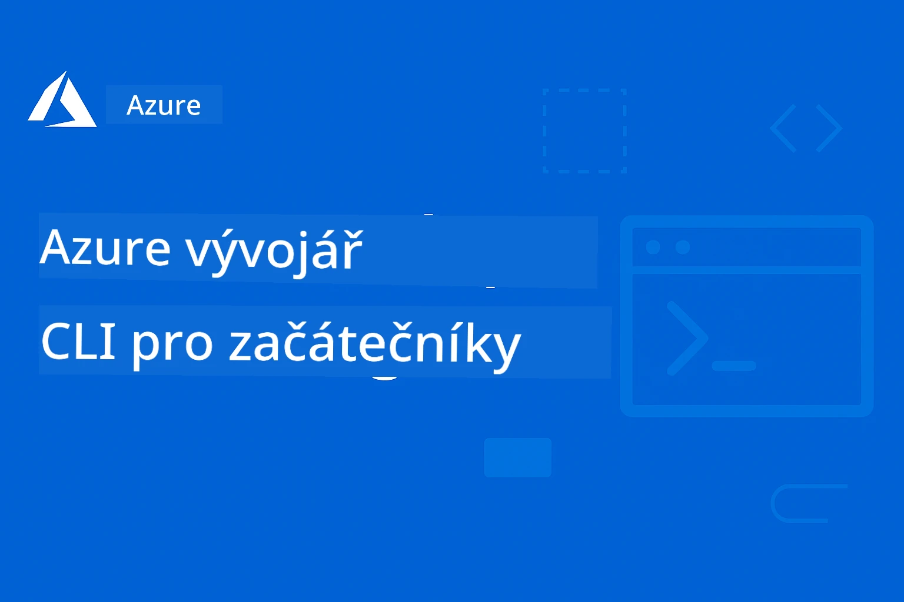

# AZD pro začátečníky: Strukturovaná cesta učení

 

[](https://GitHub.com/microsoft/azd-for-beginners/watchers/)
[](https://GitHub.com/microsoft/azd-for-beginners/network/)
[](https://GitHub.com/microsoft/azd-for-beginners/stargazers/)

[](https://discord.com/invite/nkVh3dp)
[](https://discord.gg/nTYy5BXMWG)

---

### Automatické překlady (vždy aktuální)

<!-- CO-OP TRANSLATOR LANGUAGES TABLE START -->
[Arabština](../ar/README.md) | [Bengálština](../bn/README.md) | [Bulharština](../bg/README.md) | [Barmština (Myanmar)](../my/README.md) | [Čínština (zjednodušená)](../zh-CN/README.md) | [Čínština (tradiční, Hongkong)](../zh-HK/README.md) | [Čínština (tradiční, Macau)](../zh-MO/README.md) | [Čínština (tradiční, Taiwan)](../zh-TW/README.md) | [Chorvatština](../hr/README.md) | [Čeština](./README.md) | [Dánština](../da/README.md) | [Nizozemština](../nl/README.md) | [Estonština](../et/README.md) | [Finština](../fi/README.md) | [Francouzština](../fr/README.md) | [Němčina](../de/README.md) | [Řečtina](../el/README.md) | [Hebrejština](../he/README.md) | [Hindština](../hi/README.md) | [Maďarština](../hu/README.md) | [Indonéština](../id/README.md) | [Italština](../it/README.md) | [Japonština](../ja/README.md) | [Kannada](../kn/README.md) | [Khmer](../km/README.md) | [Korejština](../ko/README.md) | [Litevština](../lt/README.md) | [Malajština](../ms/README.md) | [Malajálam](../ml/README.md) | [Maráthština](../mr/README.md) | [Nepálština](../ne/README.md) | [Nigerijský pidgin](../pcm/README.md) | [Norština](../no/README.md) | [Perština (Farsi)](../fa/README.md) | [Polština](../pl/README.md) | [Portugalština (Brazílie)](../pt-BR/README.md) | [Portugalština (Portugalsko)](../pt-PT/README.md) | [Punjabi (Gurmukhi)](../pa/README.md) | [Rumunština](../ro/README.md) | [Ruština](../ru/README.md) | [Srbština (cyrilice)](../sr/README.md) | [Slovenština](../sk/README.md) | [Slovinština](../sl/README.md) | [Španělština](../es/README.md) | [Svahilština](../sw/README.md) | [Švédština](../sv/README.md) | [Tagalog (Filipínština)](../tl/README.md) | [Tamil](../ta/README.md) | [Telugu](../te/README.md) | [Thajština](../th/README.md) | [Turečtina](../tr/README.md) | [Ukrajinština](../uk/README.md) | [Urdu](../ur/README.md) | [Vietnamština](../vi/README.md)

> **Raději klonovat lokálně?**
>
> Tento repozitář obsahuje více než 50 jazykových překladů, což výrazně zvětšuje velikost stahování. Pro klonování bez překladů použijte sparse checkout:
>
> **Bash / macOS / Linux:**
> ```bash
> git clone --filter=blob:none --sparse https://github.com/microsoft/AZD-for-beginners.git
> cd AZD-for-beginners
> git sparse-checkout set --no-cone '/*' '!translations' '!translated_images'
> ```
>
> **CMD (Windows):**
> ```cmd
> git clone --filter=blob:none --sparse https://github.com/microsoft/AZD-for-beginners.git
> cd AZD-for-beginners
> git sparse-checkout set --no-cone "/*" "!translations" "!translated_images"
> ```
>
> Získáte tak vše potřebné ke splnění kurzu s výrazně rychlejším stahováním.
<!-- CO-OP TRANSLATOR LANGUAGES TABLE END -->

## 🆕 Co je dnes nového v azd

Azure Developer CLI už není jen o tradičních webových aplikacích a API. Dnes je azd jediný nástroj pro nasazení **jakékoli** aplikace do Azure — včetně aplikací poháněných AI a inteligentních agentů.

Co to pro vás znamená:

- **AI agenti jsou nyní plnohodnotnými azd workloady.** Můžete inicializovat, nasadit a spravovat projekty AI agentů pomocí toho samého pracovního postupu `azd init` → `azd up`, který už znáte.
- **Integrace Microsoft Foundry** přináší nasazení modelu, hosting agentů a konfiguraci AI služeb přímo do ekosystému azd šablon.
- **Základní pracovní postup se nezměnil.** Ať už nasazujete todo aplikaci, mikroslužbu nebo řešení s vícero AI agenty, příkazy zůstávají stejné.

Pokud jste už azd používali, podpora AI je přirozeným rozšířením - ne samostatným nástrojem nebo pokročilou cestou. Pokud začínáte, naučíte se jeden pracovní proces, který funguje pro vše.

---

## 🚀 Co je Azure Developer CLI (azd)?

**Azure Developer CLI (azd)** je příkazový nástroj přátelský vývojářům, který zjednodušuje nasazení aplikací do Azure. Místo ručního vytváření a spojování desítek Azure zdrojů můžete nasadit celé aplikace jediným příkazem.

### Kouzlo příkazu `azd up`

```bash
# Tento jediný příkaz dělá vše:
# ✅ Vytvoří všechny Azure zdroje
# ✅ Konfiguruje síťování a zabezpečení
# ✅ Sestaví váš aplikační kód
# ✅ Nasadí do Azure
# ✅ Poskytne vám funkční URL
azd up
```

**To je vše!** Žádné klikání v Azure Portálu, žádné složité ARM šablony k předchozímu naučení, žádná ruční konfigurace – jen fungující aplikace na Azure.

---

## ❓ Azure Developer CLI vs Azure CLI: Jaký je rozdíl?

Toto je nejčastější otázka začátečníků. Zde je jednoduchá odpověď:

| Funkce | **Azure CLI (`az`)** | **Azure Developer CLI (`azd`)** |
|--------|---------------------|--------------------------------|
| **Účel** | Správa jednotlivých Azure zdrojů | Nasazení kompletních aplikací |
| **Přístup** | Zaměřeno na infrastrukturu | Zaměřeno na aplikace |
| **Příklad** | `az webapp create --name myapp...` | `azd up` |
| **Náročnost učení** | Nutnost znát Azure služby | Stačí znát vaši aplikaci |
| **Nejvhodnější pro** | DevOps, infrastruktura | Vývojáře, prototypování |

### Jednoduchá analogie

- **Azure CLI** je jako mít všechny nástroje na stavbu domu - kladiva, pily, hřebíky. Můžete postavit cokoliv, ale musíte znát stavebnictví.
- **Azure Developer CLI** je jako najmout si dodavatele - popíšete, co chcete, a on se postará o výstavbu.

### Kdy použít který nástroj

| Scénář | Použijte toto |
|--------|---------------|
| "Chci rychle nasadit svou webovou aplikaci" | `azd up` |
| "Potřebuji vytvořit jen účet pro úložiště" | `az storage account create` |
| "Stavuji plnou AI aplikaci" | `azd init --template azure-search-openai-demo` |
| "Potřebuji ladit konkrétní Azure zdroj" | `az resource show` |
| "Chci produkční nasazení za pár minut" | `azd up --environment production` |

### Spolupráce nástrojů!

AZD používá pod povrchem Azure CLI. Můžete používat oba:
```bash
# Nasadíte svou aplikaci pomocí AZD
azd up

# Poté dolaďte konkrétní zdroje pomocí Azure CLI
az webapp config set --name myapp --always-on true
```

---

## 🌟 Najděte šablony v Awesome AZD

Nezačínejte od nuly! **Awesome AZD** je komunitní sbírka připravených k nasazení šablon:

| Zdroj | Popis |
|--------|-------|
| 🔗 [**Awesome AZD Galerie**](https://azure.github.io/awesome-azd/) | Prohlédněte si více než 200 šablon s nasazením jedním kliknutím |
| 🔗 [**Přidejte šablonu**](https://github.com/Azure/awesome-azd/issues) | Přispějte svou vlastní šablonou komunitě |
| 🔗 [**GitHub Repozitář**](https://github.com/Azure/awesome-azd) | Přidejte hvězdu a prozkoumejte zdrojový kód |

### Oblíbené AI šablony z Awesome AZD

```bash
# RAG Chat s modely Microsoft Foundry + AI vyhledávání
azd init --template azure-search-openai-demo

# Rychlá AI chat aplikace
azd init --template openai-chat-app-quickstart

# AI agenti s Foundry agenty
azd init --template get-started-with-ai-agents
```

---

## 🎯 Začínáme ve 3 krocích

Než začnete, ujistěte se, že vaše zařízení je připraveno pro šablonu, kterou chcete nasadit:

**Windows:**
```powershell
.\validate-setup.ps1
```

**macOS / Linux:**
```bash
bash ./validate-setup.sh
```

Pokud některá kontrola selže, opravte ji nejdříve a pak pokračujte v rychlém startu.

### Krok 1: Instalace AZD (2 minuty)

**Windows:**
```powershell
winget install microsoft.azd
```

**macOS:**
```bash
brew tap azure/azd && brew install azd
```

**Linux:**
```bash
curl -fsSL https://aka.ms/install-azd.sh | bash
```

### Krok 2: Autentizace pro AZD

```bash
# Nepovinné, pokud plánujete používat příkazy Azure CLI přímo v tomto kurzu
az login

# Povinné pro pracovní postupy AZD
azd auth login
```

Pokud si nejste jistí, co potřebujete, postupujte podle kompletního nastavení v [Instalace a nastavení](docs/chapter-01-foundation/installation.md#authentication-setup).

### Krok 3: Nasazení první aplikace

```bash
# Inicializovat z šablony
azd init --template todo-nodejs-mongo

# Nasadit do Azure (vytvoří vše!)
azd up
```

**🎉 To je ono!** Vaše aplikace je nyní online na Azure.

### Úklid (nezapomeňte!)

```bash
# Odstraňte všechny zdroje po dokončení experimentování
azd down --force --purge
```

---

## 📚 Jak používat tento kurz

Tento kurz je navržen pro **postupné učení** – začněte tam, kde vám to vyhovuje, a postupujte dále:

| Vaše zkušenost | Začněte zde |
|-----------------|-------------|
| **Začátečník v Azure** | [Kapitola 1: Základy](#-chapter-1-foundation--quick-start) |
| **Znát Azure, ale ne AZD** | [Kapitola 1: Základy](#-chapter-1-foundation--quick-start) |
| **Chci nasadit AI aplikace** | [Kapitola 2: AI-první vývoj](#-chapter-2-ai-first-development-recommended-for-ai-developers) |
| **Chci si prakticky vyzkoušet** | [🎓 Interaktivní workshop](workshop/README.md) – 3-4 hodiny řízené laboratoře |
| **Potřebuji produkční vzory** | [Kapitola 8: Produkce a podnikové vzory](#-chapter-8-production--enterprise-patterns) |

### Rychlé nastavení

1. **Vytvořte Fork tohoto repozitáře**: [](https://GitHub.com/microsoft/azd-for-beginners/fork)
2. **Klonujte repozitář**: `git clone https://github.com/YOUR-USERNAME/azd-for-beginners.git`
3. **Získejte pomoc**: [Azure Discord komunita](https://discord.com/invite/ByRwuEEgH4)

> **Raději klonovat lokálně?**

> Tento repozitář obsahuje více než 50 jazykových překladů, což výrazně zvětšuje velikost stahování. Pro klonování bez překladů použijte sparse checkout:
> ```bash
> git clone --filter=blob:none --sparse https://github.com/microsoft/AZD-for-beginners.git
> cd AZD-for-beginners
> git sparse-checkout set --no-cone '/*' '!translations' '!translated_images'
> ```
> Získáte vše potřebné ke zvládnutí kurzu s mnohem rychlejším stahováním.


## Přehled kurzu

Ovládněte Azure Developer CLI (azd) pomocí strukturovaných kapitol navržených pro postupné učení. **Zvláštní důraz na nasazení AI aplikací s integrací Microsoft Foundry.**

### Proč je tento kurz nezbytný pro moderní vývojáře

Na základě komunitních analýz z Microsoft Foundry Discordu, **45 % vývojářů chce používat AZD pro AI workloady**, ale narážejí na problémy s:
- Složitými více-službovými AI architekturami
- Nejlepšími postupy produkčního nasazení AI  
- Integrací a konfigurací Azure AI služeb
- Optimalizací nákladů na AI workloady
- Řešením problémů specifických pro AI nasazení

### Cíle učení

Dokončením tohoto strukturovaného kurzu:
- **Ovládnete základní AZD principy**: hlavní koncepty, instalaci a konfiguraci
- **Nasadíte AI aplikace**: použijete AZD s Microsoft Foundry službami
- **Implementujete infrastrukturu jako kód**: spravujte Azure zdroje pomocí Bicep šablon
- **Řešíte problémy s nasazením**: řešíte běžné chyby a ladíte problémy
- **Optimalizujete pro produkci**: zabezpečení, škálování, monitorování a správa nákladů
- **Vyvíjíte řešení s vícero agenty**: nasadíte komplexní AI architektury

## Před začátkem: Účty, přístup a předpoklady

Než začnete Kapitolu 1, ujistěte se, že máte následující základy. Instalační kroky dále v průvodci předpokládají, že tyto jsou již připraveny.
- **Odběr Azure**: Můžete použít stávající odběr z práce nebo svého účtu, nebo si vytvořit [bezplatnou zkušební verzi](https://aka.ms/azurefreetrial) pro začátek.
- **Oprávnění k vytváření zdrojů Azure**: Pro většinu cvičení byste měli mít alespoň přístup **Přispěvatele** k cílovému odběru nebo skupině prostředků. Některé kapitoly také předpokládají, že můžete vytvářet skupiny prostředků, spravované identity a přiřazení RBAC.
- [**Účet GitHub**](https://github.com): Je užitečný pro forkování repozitáře, sledování vlastních změn a použití GitHub Codespaces pro workshop.
- **Požadavky na runtime šablon**: Některé šablony vyžadují místní nástroje jako Node.js, Python, Java nebo Docker. Před zahájením spusťte ověřovač nastavení, abyste brzy zachytili chybějící nástroje.
- **Základní znalost terminálu**: Nemusíte být expert, ale měli byste být pohodlní při spouštění příkazů jako `git clone`, `azd auth login` a `azd up`.

> **Pracujete v podnikových odběrech?**  
> Pokud vaše prostředí Azure spravuje správce, předem potvrďte, že můžete nasazovat zdroje v odběru nebo skupině prostředků, kterou plánujete použít. Pokud ne, požádejte o sandboxový odběr nebo přístup Přispěvatele před začátkem.

> **Jste v Azure noví?**  
> Začněte se svou vlastní zkušební nebo platbou podle použití na https://aka.ms/azurefreetrial, abyste mohli dokončit cvičení kompletně bez čekání na schválení na úrovni tenantů.

## 🗺️ Mapa kurzu: Rychlá navigace podle kapitoly

Každá kapitola má vlastní README s cíli učení, rychlými starty a cvičeními:

| Kapitola | Téma | Lekce | Doba trvání | Složitost |
|---------|-------|---------|----------|------------|
| **[Kap 1: Základy](docs/chapter-01-foundation/README.md)** | Začínáme | [Základy AZD](docs/chapter-01-foundation/azd-basics.md) &#124; [Instalace](docs/chapter-01-foundation/installation.md) &#124; [První projekt](docs/chapter-01-foundation/first-project.md) | 30-45 min | ⭐ |
| **[Kap 2: Vývoj AI](docs/chapter-02-ai-development/README.md)** | AI-prioritní aplikace | [Integrace Foundry](docs/chapter-02-ai-development/microsoft-foundry-integration.md) &#124; [AI agenti](docs/chapter-02-ai-development/agents.md) &#124; [Nasazení modelu](docs/chapter-02-ai-development/ai-model-deployment.md) &#124; [Workshop](docs/chapter-02-ai-development/ai-workshop-lab.md) | 1-2 hod | ⭐⭐ |
| **[Kap 3: Konfigurace](docs/chapter-03-configuration/README.md)** | Autentizace a zabezpečení | [Konfigurace](docs/chapter-03-configuration/configuration.md) &#124; [Autentizace a zabezpečení](docs/chapter-03-configuration/authsecurity.md) | 45-60 min | ⭐⭐ |
| **[Kap 4: Infrastruktura](docs/chapter-04-infrastructure/README.md)** | IaC a nasazení | [Průvodce nasazením](docs/chapter-04-infrastructure/deployment-guide.md) &#124; [Provisioning](docs/chapter-04-infrastructure/provisioning.md) | 1-1.5 hod | ⭐⭐⭐ |
| **[Kap 5: Multi-agent](docs/chapter-05-multi-agent/README.md)** | AI agentní řešení | [Retail scénář](examples/retail-scenario.md) &#124; [Koordinační vzory](docs/chapter-06-pre-deployment/coordination-patterns.md) | 2-3 hod | ⭐⭐⭐⭐ |
| **[Kap 6: Před nasazením](docs/chapter-06-pre-deployment/README.md)** | Plánování a ověření | [Předběžné kontroly](docs/chapter-06-pre-deployment/preflight-checks.md) &#124; [Plánování kapacity](docs/chapter-06-pre-deployment/capacity-planning.md) &#124; [Výběr SKU](docs/chapter-06-pre-deployment/sku-selection.md) &#124; [App Insights](docs/chapter-06-pre-deployment/application-insights.md) | 1 hod | ⭐⭐ |
| **[Kap 7: Řešení problémů](docs/chapter-07-troubleshooting/README.md)** | Ladění a opravy | [Časté problémy](docs/chapter-07-troubleshooting/common-issues.md) &#124; [Ladění](docs/chapter-07-troubleshooting/debugging.md) &#124; [AI problémy](docs/chapter-07-troubleshooting/ai-troubleshooting.md) | 1-1.5 hod | ⭐⭐ |
| **[Kap 8: Produkce](docs/chapter-08-production/README.md)** | Podnikové vzory | [Produkční praktiky](docs/chapter-08-production/production-ai-practices.md) | 2-3 hod | ⭐⭐⭐⭐ |
| **[🎓 Workshop](workshop/README.md)** | Praktická laboratoř | [Úvod](workshop/docs/instructions/0-Introduction.md) &#124; [Výběr](workshop/docs/instructions/1-Select-AI-Template.md) &#124; [Ověření](workshop/docs/instructions/2-Validate-AI-Template.md) &#124; [Rozebrání](workshop/docs/instructions/3-Deconstruct-AI-Template.md) &#124; [Konfigurace](workshop/docs/instructions/4-Configure-AI-Template.md) &#124; [Přizpůsobení](workshop/docs/instructions/5-Customize-AI-Template.md) &#124; [Ukončení](workshop/docs/instructions/6-Teardown-Infrastructure.md) &#124; [Závěr](workshop/docs/instructions/7-Wrap-up.md) | 3-4 hod | ⭐⭐ |

**Celková doba kurzu:** ~10-14 hodin | **Nárůst dovedností:** Začátečník → Produkčně připravený

---

## 📚 Výukové kapitoly

*Vyberte si výukovou cestu podle úrovně zkušeností a cílů*

### 🚀 Kapitola 1: Základy a rychlý start  
**Požadavky:** Azure odběr, základní znalost příkazové řádky  
**Doba trvání:** 30-45 minut  
**Složitost:** ⭐

#### Co se naučíte  
- Základy Azure Developer CLI  
- Instalace AZD na vaši platformu  
- Vaše první úspěšné nasazení  

#### Výukové zdroje  
- **🎯 Začněte zde**: [Co je Azure Developer CLI?](#what-is-azure-developer-cli)  
- **📖 Teorie**: [Základy AZD](docs/chapter-01-foundation/azd-basics.md) - Hlavní pojmy a terminologie  
- **⚙️ Nastavení**: [Instalace a nastavení](docs/chapter-01-foundation/installation.md) - Průvodce podle platformy  
- **🛠️ Prakticky**: [Váš první projekt](docs/chapter-01-foundation/first-project.md) - Krok za krokem  
- **📋 Rychlý přehled**: [Přehled příkazů](resources/cheat-sheet.md)

#### Praktická cvičení  
```bash
# Rychlá kontrola instalace
azd version

# Nasadíte svou první aplikaci
azd init --template todo-nodejs-mongo
azd up
```
  
**💡 Výsledek kapitoly**: Úspěšně nasadit jednoduchou webovou aplikaci do Azure pomocí AZD  

**✅ Ověření úspěchu:**  
```bash
# Po dokončení kapitoly 1 byste měli být schopni:
azd version              # Zobrazuje nainstalovanou verzi
azd init --template todo-nodejs-mongo  # Inicializuje projekt
azd up                  # Nasazuje do Azure
azd show                # Zobrazuje URL běžící aplikace
# Aplikace se otevře v prohlížeči a funguje
azd down --force --purge  # Uklízí zdroje
```
  
**📊 Časová náročnost:** 30-45 minut  
**📈 Úroveň po absolvování:** Dokáže samostatně nasadit základní aplikace

---

### 🤖 Kapitola 2: AI-prioritní vývoj (doporučeno pro AI vývojáře)  
**Požadavky:** Dokončená Kapitola 1  
**Doba trvání:** 1-2 hodiny  
**Složitost:** ⭐⭐

#### Co se naučíte  
- Integraci Microsoft Foundry s AZD  
- Nasazení aplikací s podporou AI  
- Pochopení konfigurací AI služeb  

#### Výukové zdroje  
- **🎯 Začněte zde**: [Integrace Microsoft Foundry](docs/chapter-02-ai-development/microsoft-foundry-integration.md)  
- **🤖 AI agenti**: [Průvodce AI agenty](docs/chapter-02-ai-development/agents.md) - Nasazení inteligentních agentů s AZD  
- **📖 Vzory**: [Nasazení AI modelu](docs/chapter-02-ai-development/ai-model-deployment.md) - Nasazení a správa AI modelů  
- **🛠️ Workshop**: [Laboratoř AI workshopu](docs/chapter-02-ai-development/ai-workshop-lab.md) - Připravte AI řešení pro AZD  
- **🎥 Interaktivní průvodce**: [Materiály workshopu](workshop/README.md) - Učení v prohlížeči s MkDocs * DevContainer prostředí  
- **📋 Šablony**: [Microsoft Foundry šablony](#zdroje-workshopu)  
- **📝 Příklady**: [Příklady nasazení AZD](examples/README.md)

#### Praktická cvičení  
```bash
# Nasazení vaší první AI aplikace
azd init --template azure-search-openai-demo
azd up

# Vyzkoušejte další AI šablony
azd init --template openai-chat-app-quickstart
azd init --template agent-openai-python-prompty
```
  
**💡 Výsledek kapitoly**: Nasadit a nakonfigurovat AI chatovací aplikaci s RAG schopnostmi  

**✅ Ověření úspěchu:**  
```bash
# Po kapitole 2 byste měli být schopni:
azd init --template azure-search-openai-demo
azd up
# Otestovat rozhraní chatu s umělou inteligencí
# Klást otázky a dostávat odpovědi poháněné umělou inteligencí s uvedením zdrojů
# Ověřit, že integrace vyhledávání funguje
azd monitor  # Zkontrolovat, zda Application Insights zobrazuje telemetrii
azd down --force --purge
```
  
**📊 Časová náročnost:** 1-2 hodiny  
**📈 Úroveň po absolvování:** Dokáže nasadit a konfigurovat produkčně připravené AI aplikace  
**💰 Povědomí o nákladech:** Porozumět nákladům 80-150 $/měsíc v dev prostředí, 300-3500 $/měsíc v produkci  

#### 💰 Náklady na AI nasazení  

**Vývojové prostředí (odhadem 80-150 $/měsíc):**  
- Modely Microsoft Foundry (Pay-as-you-go): 0-50 $/měsíc (dle využití tokenů)  
- AI Search (základní úroveň): 75 $/měsíc  
- Container Apps (spotřeba): 0-20 $/měsíc  
- Úložiště (standardní): 1-5 $/měsíc  

**Produkční prostředí (odhadem 300-3500+ $/měsíc):**  
- Modely Microsoft Foundry (PTU pro konzistentní výkon): 3000+ $/měsíc NEBO Pay-as-you-go pro vysoký objem  
- AI Search (standardní úroveň): 250 $/měsíc  
- Container Apps (vyhrazené): 50-100 $/měsíc  
- Application Insights: 5-50 $/měsíc  
- Úložiště (prémiové): 10-50 $/měsíc  

**💡 Tipy na optimalizaci nákladů:**  
- Používejte **Free Tier** modely Microsoft Foundry k učení (v Azure OpenAI je 50 000 tokenů měsíčně v ceně)  
- Použijte `azd down` k uvolnění prostředků, pokud nevyvíjíte aktivně  
- Začněte s účtováním podle spotřeby, přejděte na PTU pouze pro produkci  
- Použijte `azd provision --preview` k odhadu nákladů před nasazením  
- Povolit automatické škálování: platíte jen za skutečné použití  

**Sledování nákladů:**  
```bash
# Zkontrolujte odhadované měsíční náklady
azd provision --preview

# Sledujte skutečné náklady v Azure Portálu
az consumption budget list --resource-group <your-rg>
```
  
---

### ⚙️ Kapitola 3: Konfigurace a autentizace  
**Požadavky:** Dokončená Kapitola 1  
**Doba trvání:** 45-60 minut  
**Složitost:** ⭐⭐

#### Co se naučíte  
- Konfiguraci a správu prostředí  
- Nejlepší postupy autentizace a zabezpečení  
- Pojmenování a organizaci zdrojů  

#### Výukové zdroje  
- **📖 Konfigurace**: [Průvodce konfigurací](docs/chapter-03-configuration/configuration.md) - Nastavení prostředí  
- **🔐 Zabezpečení**: [Autentizační vzory a spravované identity](docs/chapter-03-configuration/authsecurity.md) - Autentizační vzory  
- **📝 Příklady**: [Příklad databázové aplikace](examples/database-app/README.md) - Příklady databází s AZD  

#### Praktická cvičení  
- Konfigurace více prostředí (vývoj, staging, produkce)  
- Nastavení autentizace spravovanou identitou  
- Implementace konfigurací specifických pro prostředí  

**💡 Výsledek kapitoly**: Spravovat více prostředí s správnou autentizací a zabezpečením  

---

### 🏗️ Kapitola 4: Infrastruktura jako kód a nasazení  
**Požadavky:** Dokončené kapitoly 1-3  
**Doba trvání:** 1-1.5 hodin  
**Složitost:** ⭐⭐⭐

#### Co se naučíte  
- Pokročilé vzory nasazení  
- Infrastruktura jako kód s Bicep  
- Strategie provisioningu zdrojů  

#### Výukové zdroje  
- **📖 Nasazení**: [Průvodce nasazením](docs/chapter-04-infrastructure/deployment-guide.md) - Kompletní workflow  
- **🏗️ Provisioning**: [Provisioning zdrojů](docs/chapter-04-infrastructure/provisioning.md) - Správa zdrojů Azure  
- **📝 Příklady**: [Příklad Container App](../../examples/container-app) - Kontejnerová nasazení  

#### Praktická cvičení  
- Vytvořit vlastní Bicep šablony  
- Nasadit multi-službové aplikace  
- Implementovat strategie blue-green nasazení  

**💡 Výsledek kapitoly**: Nasadit složité multi-službové aplikace pomocí vlastních šablon infrastruktury  

---

### 🎯 Kapitola 5: Multi-agentní AI řešení (pokročilé)  
**Požadavky:** Dokončené kapitoly 1-2  
**Doba trvání:** 2-3 hodiny  
**Složitost:** ⭐⭐⭐⭐

#### Co se naučíte  
- Architektonické vzory multi-agentů  
- Orchestrace a koordinace agentů  
- Produkčně připravené AI nasazení  

#### Výukové zdroje  
- **🤖 Doporučený projekt**: [Retail Multi-agent řešení](examples/retail-scenario.md) - Kompletní implementace  
- **🛠️ ARM šablony**: [Balíček ARM šablon](../../examples/retail-multiagent-arm-template) - Nasazení jedním klikem  
- **📖 Architektura**: [Vzory koordinace multi-agentů](docs/chapter-06-pre-deployment/coordination-patterns.md) - Vzory  

#### Praktická cvičení  
```bash
# Nasadit kompletní maloobchodní multi-agentní řešení
cd examples/retail-multiagent-arm-template
./deploy.sh

# Prozkoumat konfigurace agentů
az deployment group show --resource-group <rg-name> --name <deployment-name>
```
  
**💡 Výsledek kapitoly**: Nasadit a spravovat produkčně připravené multi-agentní AI řešení se zákaznickými a skladovými agenty  

---

### 🔍 Kapitola 6: Ověření a plánování před nasazením  
**Požadavky:** Dokončená Kapitola 4  
**Doba trvání:** 1 hodina  
**Složitost:** ⭐⭐
#### Co se naučíte
- Plánování kapacity a ověřování zdrojů
- Strategie výběru SKU
- Předběžné kontroly a automatizace

#### Výukové zdroje
- **📊 Plánování**: [Plánování kapacity](docs/chapter-06-pre-deployment/capacity-planning.md) - Ověření zdrojů
- **💰 Výběr**: [Výběr SKU](docs/chapter-06-pre-deployment/sku-selection.md) - Nákladově efektivní volby
- **✅ Ověření**: [Předběžné kontroly](docs/chapter-06-pre-deployment/preflight-checks.md) - Automatizované skripty

#### Praktická cvičení
- Spustit skripty pro ověření kapacity
- Optimalizovat výběr SKU pro náklady
- Implementovat automatizované předběžné kontroly nasazení

**💡 Výsledek kapitoly**: Ověřte a optimalizujte nasazení před vykonáním

---

### 🚨 Kapitola 7: Řešení problémů a ladění
**Předpoklady**: Dokončená libovolná kapitola o nasazení  
**Doba trvání**: 1-1,5 hodiny  
**Složitost**: ⭐⭐

#### Co se naučíte
- Systematické přístupy k ladění
- Běžné problémy a řešení
- Řešení problémů specifických pro AI

#### Výukové zdroje
- **🔧 Běžné problémy**: [Běžné problémy](docs/chapter-07-troubleshooting/common-issues.md) - FAQ a řešení
- **🕵️ Ladění**: [Průvodce laděním](docs/chapter-07-troubleshooting/debugging.md) - Postupné strategie
- **🤖 AI problémy**: [Řešení problémů s AI](docs/chapter-07-troubleshooting/ai-troubleshooting.md) - Problémy AI služeb

#### Praktická cvičení
- Diagnostikovat selhání nasazení
- Vyřešit problémy s autentizací
- Ladit připojení k AI službám

**💡 Výsledek kapitoly**: Samostatně diagnostikovat a řešit běžné problémy s nasazením

---

### 🏢 Kapitola 8: Produkční a podnikové vzory
**Předpoklady**: Kapitoly 1-4 dokončeny  
**Doba trvání**: 2-3 hodiny  
**Složitost**: ⭐⭐⭐⭐

#### Co se naučíte
- Strategie produkčního nasazení
- Podnikové bezpečnostní vzory
- Monitorování a optimalizace nákladů

#### Výukové zdroje
- **🏭 Produkce**: [Osvedčené postupy AI pro produkci](docs/chapter-08-production/production-ai-practices.md) - Podnikové vzory
- **📝 Příklady**: [Příklad mikroservisů](../../examples/microservices) - Komplexní architektury
- **📊 Monitorování**: [Integrace Application Insights](docs/chapter-06-pre-deployment/application-insights.md) - Monitorování

#### Praktická cvičení
- Implementovat podnikové bezpečnostní vzory
- Nastavit komplexní monitorování
- Nasadit do produkce s náležitou správou

**💡 Výsledek kapitoly**: Nasadit aplikace připravené pro podnik s plnou produkční funkcionalitou

---

## 🎓 Přehled workshopu: Praktické vzdělávání

> **⚠️ STAV WORKSHOPU: Aktivní vývoj**  
> Materiály workshopu jsou v současnosti vyvíjeny a zdokonalovány. Základní moduly jsou funkční, ale některé pokročilé části ještě nejsou kompletní. Aktivně pracujeme na dokončení veškerého obsahu. [Sledujte pokrok →](workshop/README.md)

### Interaktivní materiály workshopu
**Komplexní praktické učení s nástroji v prohlížeči a vedenými cvičeními**

Naše workshopové materiály poskytují strukturovaný, interaktivní zážitek z učení, který doplňuje výukový plán založený na kapitolách výše. Workshop je navržen pro samostudium i pro vedené lekce instruktorem.

#### 🛠️ Funkce workshopu
- **Rozhraní v prohlížeči**: Kompletní workshop založený na MkDocs s vyhledáváním, kopírováním a tématy
- **Integrace GitHub Codespaces**: Nastavení vývojového prostředí jedním kliknutím
- **Strukturovaná výuková cesta**: 8 modulů vedených cvičeními (celkem 3-4 hodiny)
- **Progresivní metoda**: Úvod → Výběr → Ověření → Rozebrání → Konfigurace → Přizpůsobení → Ukončení → Shrnutí
- **Interaktivní prostředí DevContainer**: Přednastavené nástroje a závislosti

#### 📚 Struktura modulů workshopu
Workshop sleduje **8 modulů progresivní metodiky**, které vás provedou od objevování k mistrovství nasazení:

| Modul | Téma | Co budete dělat | Doba trvání |
|--------|-------|----------------|----------|
| **0. Úvod** | Přehled workshopu | Porozumět cílům učení, předpokladům a struktuře workshopu | 15 min |
| **1. Výběr** | Objevování šablon | Prozkoumat šablony AZD a vybrat správnou AI šablonu pro váš scénář | 20 min |
| **2. Ověření** | Nasazení a ověření | Nasadit šablonu pomocí `azd up` a ověřit funkčnost infrastruktury | 30 min |
| **3. Rozebrání** | Pochopení struktury | Pomocí GitHub Copilot prozkoumat architekturu šablony, Bicep soubory a organizaci kódu | 30 min |
| **4. Konfigurace** | Hloubková znalost azure.yaml | Ovládnout konfiguraci `azure.yaml`, životní cykly háků a proměnné prostředí | 30 min |
| **5. Přizpůsobení** | Přizpůsobení sobě | Povolit AI Search, trasování, evaluaci a přizpůsobit scénář | 45 min |
| **6. Ukončení** | Úklid | Bezpečně odebrat zdroje příkazem `azd down --purge` | 15 min |
| **7. Shrnutí** | Další kroky | Zhodnotit dosažené výsledky, klíčové koncepty a pokračovat v učení | 15 min |

**Průběh workshopu:**  
```
Introduction → Selection → Validation → Deconstruction → Configuration → Customization → Teardown → Wrap-up
     ↓            ↓           ↓              ↓               ↓              ↓            ↓           ↓
  Overview    Find the     Deploy &      Explore        Master         Customize     Clean up    Review &
             right        verify        code &        azure.yaml      for your      resources   next steps
             template                   structure                     scenario
```
  
#### 🚀 Začínáme s workshopem  
```bash
# Možnost 1: GitHub Codespaces (doporučeno)
# Klikněte na "Code" → "Create codespace on main" v repozitáři

# Možnost 2: Lokální vývoj
git clone https://github.com/microsoft/azd-for-beginners.git
cd azd-for-beginners/workshop
# Postupujte podle pokynů pro nastavení v workshop/README.md
```
  
#### 🎯 Výukové výsledky workshopu  
Po dokončení workshopu účastníci:  
- **Nasadí produkční AI aplikace**: Použijí AZD s Microsoft Foundry službami  
- **Ovládnou architektury s více agenty**: Implementují koordinovaná AI agentní řešení  
- **Implementují bezpečnostní osvědčené postupy**: Nakonfigurují autentizaci a řízení přístupu  
- **Optimalizují pro škálování**: Navrhnou nákladově efektivní a výkonná nasazení  
- **Řeší problémy s nasazením**: Samostatně vyřeší běžné problémy

#### 📖 Zdroje workshopu
- **🎥 Interaktivní průvodce**: [Materiály workshopu](workshop/README.md) - Učební prostředí v prohlížeči  
- **📋 Instrukce modul po modulu**:  
  - [0. Úvod](workshop/docs/instructions/0-Introduction.md) - Přehled a cíle workshopu  
  - [1. Výběr](workshop/docs/instructions/1-Select-AI-Template.md) - Najít a vybrat AI šablony  
  - [2. Ověření](workshop/docs/instructions/2-Validate-AI-Template.md) - Nasadit a ověřit šablony  
  - [3. Rozebrání](workshop/docs/instructions/3-Deconstruct-AI-Template.md) - Prozkoumat architekturu šablon  
  - [4. Konfigurace](workshop/docs/instructions/4-Configure-AI-Template.md) - Ovládnout azure.yaml  
  - [5. Přizpůsobení](workshop/docs/instructions/5-Customize-AI-Template.md) - Přizpůsobit scénář  
  - [6. Ukončení](workshop/docs/instructions/6-Teardown-Infrastructure.md) - Úklid zdrojů  
  - [7. Shrnutí](workshop/docs/instructions/7-Wrap-up.md) - Zhodnocení a další kroky  
- **🛠️ AI Workshop Lab**: [AI Workshop Lab](docs/chapter-02-ai-development/ai-workshop-lab.md) - AI zaměřená cvičení  
- **💡 Rychlý start**: [Průvodce nastavením workshopu](workshop/README.md#quick-start) - Konfigurace prostředí

**Ideální pro**: Firemní školení, univerzitní kurzy, samostudium a bootcampy pro vývojáře.

---

## 📖 Hloubkový pohled: Schopnosti AZD

Kromě základů nabízí AZD silné funkce pro produkční nasazení:

- **Nasazení založené na šablonách** - Používejte předpřipravené šablony pro běžné vzory aplikací  
- **Infrastruktura jako kód** - Správa Azure zdrojů pomocí Bicep nebo Terraformu  
- **Integrované pracovní postupy** - Plynulé zřizování, nasazení a monitorování aplikací  
- **Přátelské k vývojářům** - Optimalizováno pro produktivitu a zkušenosti vývojářů

### **AZD + Microsoft Foundry: Dokonalé pro AI nasazení**

**Proč AZD pro AI řešení?** AZD řeší hlavní výzvy vývojářů AI:

- **AI připravené šablony** - Přednastavené šablony pro Microsoft Foundry modely, Cognitive Services a ML workloady  
- **Bezpečná AI nasazení** - Vnitřní bezpečnostní vzory pro AI služby, API klíče a koncové body modelů  
- **Produkční AI vzory** - Osvědčené postupy pro škálovatelná a nákladově efektivní AI nasazení  
- **End-to-End AI workflow** - Od vývoje modelu po produkční nasazení s patřičným monitorováním  
- **Optimalizace nákladů** - Inteligentní přidělování zdrojů a škálovací strategie pro AI workloady  
- **Integrace Microsoft Foundry** - Bezproblémové propojení s katalogem modelů a koncovými body Microsoft Foundry

---

## 🎯 Knihovna šablon a příkladů

### Doporučeno: Microsoft Foundry šablony
**Začněte zde, pokud nasazujete AI aplikace!**

> **Poznámka:** Tyto šablony ukazují různé AI vzory. Některé jsou externí Azure Samples, jiné místní implementace.

| Šablona | Kapitola | Složitost | Služby | Typ |
|----------|---------|----------|----------|------|
| [**Začínáme s AI chatem**](https://github.com/Azure-Samples/get-started-with-ai-chat) | Kapitola 2 | ⭐⭐ | AzureOpenAI + Azure AI Model Inference API + Azure AI Search + Azure Container Apps + Application Insights | Externí |
| [**Začínáme s AI agenty**](https://github.com/Azure-Samples/get-started-with-ai-agents) | Kapitola 2 | ⭐⭐ | Foundry Agents + AzureOpenAI + Azure AI Search + Azure Container Apps + Application Insights | Externí |
| [**Demo Azure Search + OpenAI**](https://github.com/Azure-Samples/azure-search-openai-demo) | Kapitola 2 | ⭐⭐ | AzureOpenAI + Azure AI Search + App Service + Storage | Externí |
| [**Rychlý start OpenAI Chat App**](https://github.com/Azure-Samples/openai-chat-app-quickstart) | Kapitola 2 | ⭐ | AzureOpenAI + Container Apps + Application Insights | Externí |
| [**Agent OpenAI Python Prompty**](https://github.com/Azure-Samples/agent-openai-python-prompty) | Kapitola 5 | ⭐⭐⭐ | AzureOpenAI + Azure Functions + Prompty | Externí |
| [**Contoso Chat RAG**](https://github.com/Azure-Samples/contoso-chat) | Kapitola 8 | ⭐⭐⭐⭐ | AzureOpenAI + AI Search + Cosmos DB + Container Apps | Externí |
| [**Retail Multi-Agent Solution**](examples/retail-scenario.md) | Kapitola 5 | ⭐⭐⭐⭐ | AzureOpenAI + AI Search + Storage + Container Apps + Cosmos DB | **Místní** |

### Doporučeno: Kompletní učební scénáře
**Produkčně připravené šablony aplikací namapované na učební kapitoly**

| Šablona | Učební kapitola | Složitost | Klíčové učení |
|----------|-----------------|------------|--------------|
| [**openai-chat-app-quickstart**](https://github.com/Azure-Samples/openai-chat-app-quickstart) | Kapitola 2 | ⭐ | Základní AI vzory nasazení |
| [**azure-search-openai-demo**](https://github.com/Azure-Samples/azure-search-openai-demo) | Kapitola 2 | ⭐⭐ | Implementace RAG s Azure AI Search |
| [**ai-document-processing**](https://github.com/Azure-Samples/ai-document-processing) | Kapitola 4 | ⭐⭐ | Integrace Document Intelligence |
| [**agent-openai-python-prompty**](https://github.com/Azure-Samples/agent-openai-python-prompty) | Kapitola 5 | ⭐⭐⭐ | Framework agentů a volání funkcí |
| [**contoso-chat**](https://github.com/Azure-Samples/contoso-chat) | Kapitola 8 | ⭐⭐⭐ | Podniková AI orchestrace |
| [**retail-multi-agent-solution**](examples/retail-scenario.md) | Kapitola 5 | ⭐⭐⭐⭐ | Architektura s více agenty (zákazník + inventář) |

### Učení podle typu příkladů

> **📌 Místní vs. externí příklady:**  
> **Místní příklady** (v tomto repozitáři) = Ihned připravené k použití  
> **Externí příklady** (Azure Samples) = Klonovat z propojených repozitářů

#### Místní příklady (ihned použitelné)
- [**Retail Multi-Agent Solution**](examples/retail-scenario.md) - Kompletní produkční implementace s ARM šablonami  
  - Architektura s více agenty (Zákazník + Inventář)  
  - Komplexní monitorování a hodnocení  
  - Nasazení jedním kliknutím přes ARM šablonu

#### Místní příklady - kontejnerové aplikace (Kapitoly 2-5)
**Komplexní příklady nasazení kontejnerů v tomto repozitáři:**  
- [**Příklady kontejnerových aplikací**](examples/container-app/README.md) - Kompletní průvodce nasazením kontejnerů  
  - [Jednoduché Flask API](../../examples/container-app/simple-flask-api) - Základní REST API se škálováním na nulu  
  - [Mikroservisní architektura](../../examples/container-app/microservices) - Produkční více-servisní nasazení  
  - Rychlý start, produkce a pokročilé vzory nasazení  
  - Doporučení k monitorování, bezpečnosti a optimalizaci nákladů

#### Externí příklady - jednoduché aplikace (Kapitoly 1-2)
**Klonujte tyto Azure Samples repozitáře pro začátek:**  
- [Jednoduchá webová aplikace - Node.js + MongoDB](https://github.com/Azure-Samples/todo-nodejs-mongo) - Základní vzory nasazení  
- [Statická webová stránka - React SPA](https://github.com/Azure-Samples/todo-csharp-sql-swa-func) - Nasazení statického obsahu  
- [Container App - Python Flask](https://github.com/Azure-Samples/container-apps-store-api-microservice) - Nasazení REST API

#### Externí příklady - integrace databází (Kapitola 3-4)
- [Databázová aplikace - C# + SQL](https://github.com/Azure-Samples/todo-csharp-sql) - Vzory pro připojení k databázi
- [Funkce + Cosmos DB](https://github.com/Azure-Samples/todo-python-mongo-swa-func) - Serverless datový workflow

#### Externí příklady - Pokročilé vzory (Kapitoly 4-8)
- [Java mikroservisy](https://github.com/Azure-Samples/java-microservices-aca-lab) - Architektury více služeb
- [Container Apps Jobs](https://github.com/Azure-Samples/container-apps-jobs) - Pozadí zpracování  
- [Enterprise ML Pipeline](https://github.com/Azure-Samples/mlops-v2) - Produkční vzory ML

### Externí kolekce šablon
- [**Oficiální galerie šablon AZD**](https://azure.github.io/awesome-azd/) - Kurátorská kolekce oficiálních a komunitních šablon
- [**Šablony Azure Developer CLI**](https://learn.microsoft.com/en-us/azure/developer/azure-developer-cli/azd-templates) - Dokumentace šablon Microsoft Learn
- [**Adresář příkladů**](examples/README.md) - Lokální studijní příklady s podrobnými vysvětleními

---

## 📚 Výukové zdroje a reference

### Rychlé reference
- [**Přehled příkazů**](resources/cheat-sheet.md) - Základní příkazy azd seskupené podle kapitol
- [**Glosář**](resources/glossary.md) - Terminologie Azure a azd  
- [**Často kladené otázky**](resources/faq.md) - Běžné otázky podle učebních kapitol
- [**Studijní průvodce**](resources/study-guide.md) - Komplexní praktická cvičení

### Praktické workshopy
- [**AI Workshop Lab**](docs/chapter-02-ai-development/ai-workshop-lab.md) - Učte se nasazovat AI řešení s AZD (2-3 hodiny)
- [**Interaktivní workshop**](workshop/README.md) - 8 modulů vedených cvičení s MkDocs a GitHub Codespaces
  - Postup: Úvod → Výběr → Ověření → Rozbor → Konfigurace → Přizpůsobení → Ukončení → Shrnutí

### Externí výukové zdroje
- Dokumentace Azure Developer CLI: https://learn.microsoft.com/en-us/azure/developer/azure-developer-cli/
- Centrum architektury Azure: https://learn.microsoft.com/en-us/azure/architecture/
- Kalkulačka cen Azure: https://azure.microsoft.com/pricing/calculator/
- Stav Azure: https://status.azure.com/

### Dovednosti AI agentů pro váš editor
- [**Dovednosti Microsoft Azure na skills.sh**](https://skills.sh/microsoft/github-copilot-for-azure) - 37 otevřených dovedností agentů pro Azure AI, Foundry, nasazení, diagnostiku, optimalizaci nákladů a další. Nainstalujte je do GitHub Copilot, Cursor, Claude Code nebo jakéhokoli podporovaného agenta:
  ```bash
  npx skills add microsoft/github-copilot-for-azure
  ```

---

## 🔧 Rychlý průvodce řešením problémů

**Nejčastější problémy začátečníků a rychlá řešení:**

<details>
<summary><strong>❌ "azd: příkaz nebyl nalezen"</strong></summary>

```bash
# Nejprve nainstalujte AZD
# Windows (PowerShell):
winget install microsoft.azd

# macOS:
brew tap azure/azd && brew install azd

# Linux:
curl -fsSL https://aka.ms/install-azd.sh | bash

# Ověřte instalaci
azd version
```
</details>

<details>
<summary><strong>❌ "Nenalezeno předplatné" nebo "Předplatné není nastaveno"</strong></summary>

```bash
# Vypsat dostupná předplatná
az account list --output table

# Nastavit výchozí předplatné
az account set --subscription "<subscription-id-or-name>"

# Nastavit pro prostředí AZD
azd env set AZURE_SUBSCRIPTION_ID "<subscription-id>"

# Ověřit
az account show
```
</details>

<details>
<summary><strong>❌ "Nedostatečná kvóta" nebo "Kvóta překročena"</strong></summary>

```bash
# Vyzkoušejte jiný Azure region
azd env set AZURE_LOCATION "westus2"
azd up

# Nebo použijte menší SKU během vývoje
# Upravte infra/main.parameters.json:
{
  "sku": "B1"  // Instead of "P1V2"
}
```
</details>

<details>
<summary><strong>❌ "azd up" selže v polovině běhu</strong></summary>

```bash
# Možnost 1: Vyčistit a zkusit znovu
azd down --force --purge
azd up

# Možnost 2: Jen opravit infrastrukturu
azd provision

# Možnost 3: Zkontrolovat podrobný stav
azd show

# Možnost 4: Zkontrolovat protokoly v Azure Monitoru
azd monitor --logs
```
</details>

<details>
<summary><strong>❌ "Autentizace selhala" nebo "Token vypršel"</strong></summary>

```bash
# Znovu se autentizujte pro AZD
azd auth logout
azd auth login

# Nepovinné: aktualizujte také Azure CLI, pokud používáte příkazy az
az logout
az login

# Ověřte autentizaci
az account show
```
</details>

<details>
<summary><strong>❌ "Zdroj již existuje" nebo konflikty názvů</strong></summary>

```bash
# AZD generuje jedinečná jména, ale pokud dojde ke konfliktu:
azd down --force --purge

# Pak znovu zkusí s novým prostředím
azd env new dev-v2
azd up
```
</details>

<details>
<summary><strong>❌ Šablona nasazení trvá příliš dlouho</strong></summary>

**Běžné doby čekání:**
- Jednoduchá webová aplikace: 5-10 minut
- Aplikace s databází: 10-15 minut
- AI aplikace: 15-25 minut (provisioning OpenAI je pomalý)

```bash
# Zkontrolujte průběh
azd show

# Pokud zůstanete zaseknutí více než 30 minut, zkontrolujte Azure Portal:
azd monitor --overview
# Hledejte neúspěšné nasazení
```
</details>

<details>
<summary><strong>❌ "Přístup odepřen" nebo "Zakázáno"</strong></summary>

```bash
# Zkontrolujte svou roli v Azure
az role assignment list --assignee $(az account show --query user.name -o tsv)

# Potřebujete minimálně roli "Přispěvatel"
# Požádejte správce Azure o přidělení:
# - Přispěvatel (pro zdroje)
# - Správce přístupu uživatelů (pro přiřazení rolí)
```
</details>

<details>
<summary><strong>❌ Nelze nalézt URL nasazené aplikace</strong></summary>

```bash
# Zobrazit všechny koncové body služby
azd show

# Nebo otevřete Azure Portal
azd monitor

# Zkontrolovat konkrétní službu
azd env get-values
# Hledat proměnné *_URL
```
</details>

### 📚 Kompletní zdroje k řešení problémů

- **Průvodce běžnými problémy:** [Podrobné řešení](docs/chapter-07-troubleshooting/common-issues.md)
- **Specifické problémy s AI:** [Řešení problémů u AI](docs/chapter-07-troubleshooting/ai-troubleshooting.md)
- **Průvodce laděním:** [Postup ladění krok za krokem](docs/chapter-07-troubleshooting/debugging.md)
- **Získejte pomoc:** [Azure Discord](https://discord.gg/microsoft-azure) #azure-developer-cli

---

## 🎓 Dokončení kurzu a certifikace

### Sledování pokroku
Sledujte svůj pokrok ve výuce v každé kapitole:

- [ ] **Kapitola 1**: Základy a rychlý start ✅
- [ ] **Kapitola 2**: Vývoj orientovaný na AI ✅  
- [ ] **Kapitola 3**: Konfigurace a autentifikace ✅
- [ ] **Kapitola 4**: Infrastruktura jako kód a nasazení ✅
- [ ] **Kapitola 5**: AI řešení s více agenty ✅
- [ ] **Kapitola 6**: Ověření a plánování před nasazením ✅
- [ ] **Kapitola 7**: Řešení problémů a ladění ✅
- [ ] **Kapitola 8**: Produkční a podnikové vzory ✅

### Ověření znalostí
Po dokončení každé kapitoly ověřte své znalosti:
1. **Praktické cvičení**: Dokončete praktické nasazení v kapitole
2. **Kontrola znalostí**: Projděte FAQ sekci příslušné kapitoly
3. **Diskuse v komunitě**: Sdílejte zkušenosti na Azure Discord
4. **Další kapitola**: Pokračujte na další úroveň složitosti

### Výhody dokončení kurzu
Po dokončení všech kapitol získáte:
- **Produkční zkušenosti**: Nasazené reálné AI aplikace do Azure
- **Profesní dovednosti**: Schopnost nasazení v produkčním prostředí  
- **Uznání v komunitě**: Aktivní člen komunity Azure vývojářů
- **Kariérní růst**: Žádané znalosti AZD a AI nasazení

---

## 🤝 Komunita a podpora

### Získejte pomoc a podporu
- **Technické problémy**: [Nahlášení chyb a požadavky na funkce](https://github.com/microsoft/azd-for-beginners/issues)
- **Otázky k učení**: [Microsoft Azure Discord komunita](https://discord.gg/microsoft-azure) a [](https://discord.gg/nTYy5BXMWG)
- **Pomoc specifická pro AI**: Přidejte se k [](https://discord.gg/nTYy5BXMWG)
- **Dokumentace**: [Oficiální dokumentace Azure Developer CLI](https://learn.microsoft.com/en-us/azure/developer/azure-developer-cli/)

### Poznatky z Microsoft Foundry Discord komunity

**Aktuální výsledky ankety z kanálu #Azure:**
- **45 %** vývojářů chce používat AZD pro AI pracovní zátěže
- **Hlavní výzvy**: Nasazení více služeb, správa přihlašovacích údajů, připravenost na produkci  
- **Nejčastější požadavky**: AI-specifické šablony, průvodci řešením problémů, osvědčené postupy

**Připojte se k naší komunitě a:**
- Sdílejte své zkušenosti s AZD + AI a získejte pomoc
- Přístup k raným verzím nových AI šablon
- Přispívejte k nejlepším postupům nasazení AI
- Ovlivňujte budoucí vývoj funkcí AI + AZD

### Přispívání do kurzu
Vítáme vaše příspěvky! Přečtěte si prosím náš [Průvodce přispěvateli](CONTRIBUTING.md) a zjistěte víc o:
- **Vylepšení obsahu**: Rozšiřte existující kapitoly a příklady
- **Nové příklady**: Přidejte scénáře z reálného světa a šablony  
- **Překlady**: Pomozte udržovat podporu vícejazyčnosti
- **Nahlášení chyb**: Zlepšete přesnost a srozumitelnost
- **Standardy komunity**: Dodržujte naše zásady inkluzivní komunity

---

## 📄 Informace o kurzu

### Licence
Tento projekt je licencován pod MIT licencí - podrobnosti najdete v souboru [LICENSE](../../LICENSE).

### Související výukové zdroje Microsoft Learn

Náš tým vytváří další komplexní vzdělávací kurzy:

<!-- CO-OP TRANSLATOR OTHER COURSES START -->
### LangChain
[](https://aka.ms/langchain4j-for-beginners)
[](https://aka.ms/langchainjs-for-beginners?WT.mc_id=m365-94501-dwahlin)
[](https://github.com/microsoft/langchain-for-beginners?WT.mc_id=m365-94501-dwahlin)
---

### Azure / Edge / MCP / Agenti
[](https://github.com/microsoft/AZD-for-beginners?WT.mc_id=academic-105485-koreyst)
[](https://github.com/microsoft/edgeai-for-beginners?WT.mc_id=academic-105485-koreyst)
[](https://github.com/microsoft/mcp-for-beginners?WT.mc_id=academic-105485-koreyst)
[](https://github.com/microsoft/ai-agents-for-beginners?WT.mc_id=academic-105485-koreyst)

---
 
### Séria Generativní AI
[](https://github.com/microsoft/generative-ai-for-beginners?WT.mc_id=academic-105485-koreyst)
[-9333EA?style=for-the-badge&labelColor=E5E7EB&color=9333EA)](https://github.com/microsoft/Generative-AI-for-beginners-dotnet?WT.mc_id=academic-105485-koreyst)
[-C084FC?style=for-the-badge&labelColor=E5E7EB&color=C084FC)](https://github.com/microsoft/generative-ai-for-beginners-java?WT.mc_id=academic-105485-koreyst)
[-E879F9?style=for-the-badge&labelColor=E5E7EB&color=E879F9)](https://github.com/microsoft/generative-ai-with-javascript?WT.mc_id=academic-105485-koreyst)

---
 
### Základní výuka
[](https://aka.ms/ml-beginners?WT.mc_id=academic-105485-koreyst)
[](https://aka.ms/datascience-beginners?WT.mc_id=academic-105485-koreyst)
[](https://aka.ms/ai-beginners?WT.mc_id=academic-105485-koreyst)
[](https://github.com/microsoft/Security-101?WT.mc_id=academic-96948-sayoung)
[](https://aka.ms/webdev-beginners?WT.mc_id=academic-105485-koreyst)
[](https://aka.ms/iot-beginners?WT.mc_id=academic-105485-koreyst)
[](https://github.com/microsoft/xr-development-for-beginners?WT.mc_id=academic-105485-koreyst)

---
 
### Série Copilot
[](https://aka.ms/GitHubCopilotAI?WT.mc_id=academic-105485-koreyst)
[](https://github.com/microsoft/mastering-github-copilot-for-dotnet-csharp-developers?WT.mc_id=academic-105485-koreyst)
[](https://github.com/microsoft/CopilotAdventures?WT.mc_id=academic-105485-koreyst)
<!-- CO-OP TRANSLATOR OTHER COURSES END -->

---

## 🗺️ Navigace kurzem

**🚀 Připraven začít se učit?**

**Začátečníci**: Začněte [Kapitola 1: Základy a rychlý start](#-chapter-1-foundation--quick-start)  
**Vývojáři AI**: Přejděte k [Kapitola 2: Vývoj s AI na prvním místě](#-chapter-2-ai-first-development-recommended-for-ai-developers)  
**Zkušení vývojáři**: Začněte s [Kapitola 3: Konfigurace a autentizace](#️-chapter-3-configuration--authentication)

**Další kroky**: [Začněte kapitolu 1 - Základy AZD](docs/chapter-01-foundation/azd-basics.md) →

---

<!-- CO-OP TRANSLATOR DISCLAIMER START -->
**Upozornění**:  
Tento dokument byl přeložen pomocí AI překladatelské služby [Co-op Translator](https://github.com/Azure/co-op-translator). Ačkoliv usilujeme o přesnost, mějte prosím na paměti, že automatizované překlady mohou obsahovat chyby nebo nepřesnosti. Původní dokument v jeho mateřském jazyce by měl být považován za autoritativní zdroj. Pro kritické informace se doporučuje profesionální lidský překlad. Nejsme odpovědní za jakékoli nedorozumění nebo chybné interpretace vyplývající z použití tohoto překladu.
<!-- CO-OP TRANSLATOR DISCLAIMER END -->