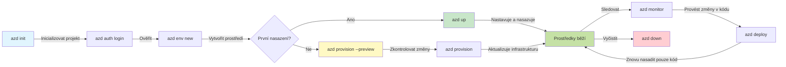
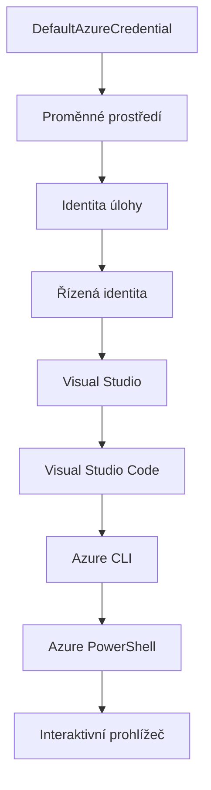

# AZD základy - Porozumění Azure Developer CLI

# AZD základy - Základní pojmy a principy

**Navigace kapitolou:**
- **📚 Domovská stránka kurzu**: [AZD pro začátečníky](../../README.md)
- **📖 Aktuální kapitola**: Kapitola 1 - Základy a rychlý start
- **⬅️ Předchozí**: [Přehled kurzu](../../README.md#-chapter-1-foundation--quick-start)
- **➡️ Další**: [Instalace a nastavení](installation.md)
- **🚀 Další kapitola**: [Kapitola 2: Vývoj orientovaný na AI](../chapter-02-ai-development/microsoft-foundry-integration.md)

## Úvod

Tato lekce vás seznámí s Azure Developer CLI (azd), výkonným příkazovým nástrojem, který zrychluje vaši cestu od lokálního vývoje k nasazení do Azure. Naučíte se základní pojmy, klíčové funkce a pochopíte, jak azd zjednodušuje nasazení cloud-native aplikací.

## Cíle učení

Na konci této lekce budete:
- Rozumět, co je Azure Developer CLI a jaký má primární účel
- Seznámit se s klíčovými pojmy jako šablony, prostředí a služby
- Prozkoumat hlavní funkce včetně vývoje řízeného šablonami a infrastruktury jako kódu
- Pochopit strukturu projektu azd a pracovní postup
- Být připraveni nainstalovat a nakonfigurovat azd pro vaše vývojové prostředí

## Výstupy učení

Po dokončení této lekce budete schopni:
- Vysvětlit roli azd v moderních cloudových vývojových postupech
- Identifikovat komponenty struktury projektu azd
- Popsat, jak spolupracují šablony, prostředí a služby
- Pochopit výhody infrastruktury jako kódu pomocí azd
- Rozpoznat různé příkazy azd a jejich účely

## Co je Azure Developer CLI (azd)?

Azure Developer CLI (azd) je příkazový nástroj navržený tak, aby zrychlil vaši cestu od lokálního vývoje k nasazení do Azure. Zjednodušuje proces vytváření, nasazování a správy cloud-native aplikací na Azure.

### Co můžete nasadit pomocí azd?

azd podporuje širokou škálu pracovních zatížení—a seznam se stále rozšiřuje. Dnes můžete pomocí azd nasadit:

| Typ pracovního zatížení | Příklady | Stejný pracovní postup? |
|------------------------|----------|------------------------|
| **Tradiční aplikace** | Webové aplikace, REST API, statické stránky | ✅ `azd up` |
| **Služby a mikroservisy** | Container Apps, Function Apps, víceslužbové backendy | ✅ `azd up` |
| **Aplikace poháněné AI** | Chatovací aplikace s Microsoft Foundry modely, RAG řešení s AI vyhledáváním | ✅ `azd up` |
| **Inteligentní agenti** | Agenti hostovaní v Foundry, vícero agentních orchestrací | ✅ `azd up` |

Klíčový závěr je, že **životní cyklus azd zůstává stejný bez ohledu na to, co nasazujete**. Inicializujete projekt, připravíte infrastrukturu, nasadíte kód, sledujete aplikaci a uklidíte—zda jde o jednoduchý web nebo sofistikovaného AI agenta.

Tato kontinuita je záměrná. azd považuje AI schopnosti za další druh služby, kterou může vaše aplikace využívat, nikoli něco zásadně odlišného. Chatovací endpoint podporovaný Microsoft Foundry modely je z pohledu azd jen další služba k nastavení a nasazení.

### 🎯 Proč používat AZD? Praktické porovnání

Pojďme porovnat nasazení jednoduché webové aplikace s databází:

#### ❌ BEZ AZD: Manuální nasazení do Azure (30+ minut)

```bash
# Krok 1: Vytvořit skupinu prostředků
az group create --name myapp-rg --location eastus

# Krok 2: Vytvořit plán služby App Service
az appservice plan create --name myapp-plan \
  --resource-group myapp-rg \
  --sku B1 --is-linux

# Krok 3: Vytvořit webovou aplikaci
az webapp create --name myapp-web-unique123 \
  --resource-group myapp-rg \
  --plan myapp-plan \
  --runtime "NODE:18-lts"

# Krok 4: Vytvořit účet Cosmos DB (10-15 minut)
az cosmosdb create --name myapp-cosmos-unique123 \
  --resource-group myapp-rg \
  --kind MongoDB

# Krok 5: Vytvořit databázi
az cosmosdb mongodb database create \
  --account-name myapp-cosmos-unique123 \
  --resource-group myapp-rg \
  --name tododb

# Krok 6: Vytvořit kolekci
az cosmosdb mongodb collection create \
  --account-name myapp-cosmos-unique123 \
  --resource-group myapp-rg \
  --database-name tododb \
  --name todos

# Krok 7: Získat připojovací řetězec
CONN_STR=$(az cosmosdb keys list \
  --name myapp-cosmos-unique123 \
  --resource-group myapp-rg \
  --type connection-strings \
  --query "connectionStrings[0].connectionString" -o tsv)

# Krok 8: Nakonfigurovat nastavení aplikace
az webapp config appsettings set \
  --name myapp-web-unique123 \
  --resource-group myapp-rg \
  --settings MONGODB_URI="$CONN_STR"

# Krok 9: Povolit protokolování
az webapp log config --name myapp-web-unique123 \
  --resource-group myapp-rg \
  --application-logging filesystem \
  --detailed-error-messages true

# Krok 10: Nastavit Application Insights
az monitor app-insights component create \
  --app myapp-insights \
  --location eastus \
  --resource-group myapp-rg

# Krok 11: Propojit App Insights s webovou aplikací
INSTRUMENTATION_KEY=$(az monitor app-insights component show \
  --app myapp-insights \
  --resource-group myapp-rg \
  --query "instrumentationKey" -o tsv)

az webapp config appsettings set \
  --name myapp-web-unique123 \
  --resource-group myapp-rg \
  --settings APPINSIGHTS_INSTRUMENTATIONKEY="$INSTRUMENTATION_KEY"

# Krok 12: Sestavit aplikaci lokálně
npm install
npm run build

# Krok 13: Vytvořit balíček nasazení
zip -r app.zip . -x "*.git*" "node_modules/*"

# Krok 14: Nasadit aplikaci
az webapp deployment source config-zip \
  --resource-group myapp-rg \
  --name myapp-web-unique123 \
  --src app.zip

# Krok 15: Čekat a modlit se, aby to fungovalo 🙏
# (Žádná automatická validace, je potřeba manuální testování)
```

**Problémy:**
- ❌ 15+ příkazů k zapamatování a následnému vykonání
- ❌ 30-45 minut manuální práce
- ❌ Jednoduché chyby (překlepy, špatné parametry)
- ❌ Přístupové řetězce viditelné v historii terminálu
- ❌ Žádný automatický rollback při chybě
- ❌ Těžké zopakovat pro členy týmu
- ❌ Každé nasazení jiné (neroz reprodukovatelné)

#### ✅ S AZD: Automatizované nasazení (5 příkazů, 10-15 minut)

```bash
# Krok 1: Inicializace z šablony
azd init --template todo-nodejs-mongo

# Krok 2: Ověření
azd auth login

# Krok 3: Vytvoření prostředí
azd env new dev

# Krok 4: Náhled změn (volitelné, ale doporučené)
azd provision --preview

# Krok 5: Nasazení všeho
azd up

# ✨ Hotovo! Vše je nasazeno, nakonfigurováno a monitorováno
```

**Výhody:**
- ✅ **5 příkazů** vs. 15+ manuálních kroků
- ✅ **10-15 minut** celkem (většinou čekání na Azure)
- ✅ **Méně manuálních chyb** – konzistentní workflow řízené šablonami
- ✅ **Bezpečné zacházení s tajnými údaji** – mnoho šablon používá Azure-managed ukládání tajemství
- ✅ **Opakovatelné nasazení** – stejný pracovní postup vždy
- ✅ **Plně reprodukovatelné** – stejný výsledek vždy
- ✅ **Připravené pro tým** – kdokoliv může nasadit stejnými příkazy
- ✅ **Infrastruktura jako kód** – verzované Bicep šablony
- ✅ **Vestavěný monitoring** – Application Insights je automaticky nastavený

### 📊 Čas a snížení chybovosti

| Metrika | Manuální nasazení | Nasazení AZD | Zlepšení |
|:--------|:------------------|:-------------|:---------|
| **Příkazy** | 15+ | 5 | o 67 % méně |
| **Čas** | 30-45 min | 10-15 min | o 60 % rychlejší |
| **Chybovost** | ~40 % | <5 % | o 88 % méně |
| **Konzistence** | Nízká (manuální) | 100 % (automatické) | Perfektní |
| **Zaškolení týmu** | 2-4 hodiny | 30 minut | o 75 % rychlejší |
| **Rollback čas** | 30+ minut (manuální) | 2 minuty (automatické) | o 93 % rychlejší |

## Základní pojmy

### Šablony
Šablony jsou základem azd. Obsahují:
- **Kód aplikace** – váš zdrojový kód a závislosti
- **Definice infrastruktury** – Azure zdroje definované v Bicep nebo Terraform
- **Konfigurační soubory** – nastavení a proměnné prostředí
- **Skripty nasazení** – automatizované pracovní postupy nasazení

### Prostředí
Prostředí představují různé cíle nasazení:
- **Vývojové** – pro testování a vývoj
- **Staging** – předprodukční prostředí
- **Produkční** – živé výrobní prostředí

Každé prostředí uchovává vlastní:
- Skupinu zdrojů Azure
- Konfigurační nastavení
- Stav nasazení

### Služby
Služby jsou stavebními kameny vaší aplikace:
- **Frontend** – webové aplikace, SPA
- **Backend** – API, mikroservisy
- **Databáze** – řešení pro ukládání dat
- **Úložiště** – ukládání souborů a blobů

## Klíčové funkce

### 1. Vývoj řízený šablonami
```bash
# Procházet dostupné šablony
azd template list

# Inicializovat ze šablony
azd init --template <template-name>
```

### 2. Infrastruktura jako kód
- **Bicep** – doménový jazyk Azure
- **Terraform** – multi-cloud nástroj pro infrastrukturu
- **ARM šablony** – Azure Resource Manager šablony

### 3. Integrované pracovní postupy
```bash
# Kompletní workflow nasazení
azd up            # Zajištění + nasazení, toto je bez zásahu pro první nastavení

# 🧪 NOVÉ: Náhled změn infrastruktury před nasazením (BEZPEČNÉ)
azd provision --preview    # Simulovat nasazení infrastruktury bez provedení změn

azd provision     # Vytvořit Azure zdroje, pokud aktualizujete infrastrukturu, použijte toto
azd deploy        # Nasadit aplikační kód nebo nasadit aplikační kód znovu po aktualizaci
azd down          # Vyčistit zdroje
```

#### 🛡️ Bezpečné plánování infrastruktury s náhledem
Příkaz `azd provision --preview` je průlom pro bezpečná nasazení:
- **Analýza suchého spuštění** – ukazuje, co bude vytvořeno, změněno nebo smazáno
- **Žádné riziko** – žádné skutečné změny v Azure nejsou provedeny
- **Spolupráce týmu** – sdílení výsledků náhledu před nasazením
- **Odhad nákladů** – porozumění nákladům zdrojů před závazkem

```bash
# Ukázkový náhledový pracovní postup
azd provision --preview           # Podívejte se, co se změní
# Zkontrolujte výstup, diskutujte s týmem
azd provision                     # Aplikujte změny s jistotou
```

### 📊 Vizualizace: Vývojový pracovní postup AZD


**Vysvětlení pracovního postupu:**
1. **Init** – začněte se šablonou nebo novým projektem
2. **Auth** – autentizujte se do Azure
3. **Prostředí** – vytvořte izolované nasazovací prostředí
4. **Preview** – 🆕 vždy nejprve zobrazte změny infrastruktury (bezpečné)
5. **Provision** – vytvořte nebo aktualizujte Azure zdroje
6. **Deploy** – nahrajte kód aplikace
7. **Monitor** – sledujte výkon aplikace
8. **Iterate** – provádějte změny a znovu nasazujte kód
9. **Cleanup** – odstraňte zdroje po dokončení

### 4. Správa prostředí
```bash
# Vytvářejte a spravujte prostředí
azd env new <environment-name>
azd env select <environment-name>
azd env list
```

### 5. Rozšíření a AI příkazy

azd využívá systém rozšíření pro přidávání schopností nad rámec základní CLI funkčnosti. To je zvláště užitečné pro AI pracovní zatížení:

```bash
# Vypište dostupná rozšíření
azd extension list

# Nainstalujte rozšíření agentů Foundry
azd extension install azure.ai.agents

# Inicializujte projekt agenta AI z manifestu
azd ai agent init -m agent-manifest.yaml

# Spusťte server MCP pro vývoj s asistencí AI (Alfa)
azd mcp start
```

> Rozšíření jsou podrobně popsána v [Kapitola 2: Vývoj orientovaný na AI](../chapter-02-ai-development/agents.md) a v referenci [AZD AI CLI příkazy](../chapter-08-production/production-ai-practices.md#azd-ai-cli-commands-and-extensions).

## 📁 Struktura projektu

Typická struktura projektu azd:
```
my-app/
├── .azd/                    # azd configuration
│   └── config.json
├── .azure/                  # Azure deployment artifacts
├── .devcontainer/          # Development container config
├── .github/workflows/      # GitHub Actions
├── .vscode/               # VS Code settings
├── infra/                 # Infrastructure code
│   ├── main.bicep        # Main infrastructure template
│   ├── main.parameters.json
│   └── modules/          # Reusable modules
├── src/                  # Application source code
│   ├── api/             # Backend services
│   └── web/             # Frontend application
├── azure.yaml           # azd project configuration
└── README.md
```

## 🔧 Konfigurační soubory

### azure.yaml
Hlavní konfigurační soubor projektu:
```yaml
name: my-awesome-app
metadata:
  template: my-template@1.0.0

services:
  web:
    project: ./src/web
    language: js
    host: appservice
  api:
    project: ./src/api
    language: js
    host: appservice

hooks:
  preprovision:
    shell: pwsh
    run: echo "Preparing to provision..."
```

### .azure/config.json
Konfigurace závislá na prostředí:
```json
{
  "version": 1,
  "defaultEnvironment": "dev",
  "environments": {
    "dev": {
      "subscriptionId": "your-subscription-id",
      "location": "eastus"
    }
  }
}
```

## 🎪 Běžné pracovní postupy s praktickými cvičeními

> **💡 Tip pro učení:** Následujte tato cvičení v pořadí, abyste postupně rozvíjeli své AZD dovednosti.

### 🎯 Cvičení 1: Inicializace prvního projektu

**Cíl:** Vytvořit AZD projekt a prozkoumat jeho strukturu

**Kroky:**
```bash
# Použijte osvědčenou šablonu
azd init --template todo-nodejs-mongo

# Prozkoumejte vygenerované soubory
ls -la  # Zobrazit všechny soubory včetně skrytých

# Vytvořené klíčové soubory:
# - azure.yaml (hlavní konfigurace)
# - infra/ (kód infrastruktury)
# - src/ (kód aplikace)
```

**✅ Úspěch:** Máte složky azure.yaml, infra/ a src/

---

### 🎯 Cvičení 2: Nasazení do Azure

**Cíl:** Dokončit kompletní end-to-end nasazení

**Kroky:**
```bash
# 1. Ověřit
az login && azd auth login

# 2. Vytvořit prostředí
azd env new dev
azd env set AZURE_LOCATION eastus

# 3. Náhled změn (DOPORUČENO)
azd provision --preview

# 4. Nasadit vše
azd up

# 5. Ověřit nasazení
azd show    # Zobrazit URL vaší aplikace
```

**Očekávaný čas:** 10-15 minut  
**✅ Úspěch:** URL aplikace se otevře v prohlížeči

---

### 🎯 Cvičení 3: Více prostředí

**Cíl:** Nasadit do vývojového a staging prostředí

**Kroky:**
```bash
# Už existuje dev, vytvořit staging
azd env new staging
azd env set AZURE_LOCATION westus2
azd up

# Přepínat mezi nimi
azd env list
azd env select dev
```

**✅ Úspěch:** Dvě samostatné skupiny zdrojů v Azure portálu

---

### 🛡️ Čistý start: `azd down --force --purge`

Když potřebujete udělat úplný reset:

```bash
azd down --force --purge
```

**Co to dělá:**
- `--force`: Bez potvrzovacích dotazů
- `--purge`: Odstraní veškerý lokální stav a Azure zdroje

**Použití, když:**
- Nasazení se nezdařilo v průběhu
- Přepínáte projekty
- Potřebujete čerstvý start

---

## 🎪 Originální referenční pracovní postup

### Zahájení nového projektu
```bash
# Metoda 1: Použijte existující šablonu
azd init --template todo-nodejs-mongo

# Metoda 2: Začněte od začátku
azd init

# Metoda 3: Použijte aktuální adresář
azd init .
```

### Vývojový cyklus
```bash
# Nastavit vývojové prostředí
azd auth login
azd env new dev
azd env select dev

# Nasadit vše
azd up

# Proveďte změny a znovu nasaďte
azd deploy

# Vyčistit po dokončení
azd down --force --purge # příkaz v Azure Developer CLI je **tvrdý reset** pro vaše prostředí—zejména užitečný, když řešíte neúspěšné nasazení, uklízíte opuštěné zdroje nebo se připravujete na čerstvé znovunasažení.
```

## Porozumění `azd down --force --purge`
Příkaz `azd down --force --purge` je silný nástroj pro kompletní demolici vašeho azd prostředí a všech souvisejících zdrojů. Zde je přehled, co každý přepínač dělá:
```
--force
```
- Přeskakuje potvrzovací dialogy.
- Užitečné pro automatizaci nebo skripty, kde není možný manuální vstup.
- Zajišťuje neinterrupční průběh čištění, i když CLI detekuje nesrovnalosti.

```
--purge
```
Maže **veškeré související metadata**, včetně:
Stav prostředí  
Lokální složku `.azure`  
Uložené informace o nasazení  
Brání azd v „pamatování“ předchozích nasazení, což může způsobovat problémy jako nesoulad skupin zdrojů nebo zastaralé reference registrů.

### Proč používat oba?
Když narazíte na problém s `azd up` kvůli přetrvávajícímu stavu nebo částečným nasazením, tato kombinace zajistí **čistý start**.

Je to zvláště užitečné po manuálním odstraňování zdrojů v Azure portálu nebo při přepínání šablon, prostředí či konvencí pojmenování skupin zdrojů.

### Správa více prostředí
```bash
# Vytvořit testovací prostředí
azd env new staging
azd env select staging
azd up

# Přepnout zpět na vývoj
azd env select dev

# Porovnat prostředí
azd env list
```

## 🔐 Autentizace a přihlašovací údaje

Pochopení autentizace je klíčové pro úspěšná nasazení azd. Azure využívá více metod autentizace a azd využívá stejný řetězec přihlašovacích údajů, jaký používají další Azure nástroje.

### Azure CLI autentizace (`az login`)

Před použitím azd se musíte autentizovat v Azure. Nejčastější metodou je využití Azure CLI:

```bash
# Interaktivní přihlášení (otevře prohlížeč)
az login

# Přihlášení s konkrétním tenantem
az login --tenant <tenant-id>

# Přihlášení pomocí servisního principála
az login --service-principal -u <app-id> -p <password> --tenant <tenant-id>

# Zkontrolovat aktuální stav přihlášení
az account show

# Vypsat dostupné předplatné
az account list --output table

# Nastavit výchozí předplatné
az account set --subscription <subscription-id>
```

### Průběh autentizace
1. **Interaktivní přihlášení**: Otevře výchozí prohlížeč pro přihlášení
2. **Device Code Flow**: Pro prostředí bez přístupu k prohlížeči
3. **Service Principal**: Pro automatizaci a CI/CD scénáře
4. **Managed Identity**: Pro aplikace hostované v Azure

### Řetězec DefaultAzureCredential

`DefaultAzureCredential` je typ přihlášení, který zjednodušuje autentizaci automatickým vyzkoušením více zdrojů přihlašovacích údajů v daném pořadí:

#### Pořadí řetězce přihlašovacích údajů

#### 1. Proměnné prostředí
```bash
# Nastavit proměnné prostředí pro hlavního služebního zástupce
export AZURE_CLIENT_ID="<app-id>"
export AZURE_CLIENT_SECRET="<password>"
export AZURE_TENANT_ID="<tenant-id>"
```

#### 2. Workload Identity (Kubernetes/GitHub Actions)
Automaticky použito v:
- Azure Kubernetes Service (AKS) s Workload Identity
- GitHub Actions s OIDC federací
- Další federované scénáře identity

#### 3. Managed Identity
Pro Azure zdroje jako:
- Virtuální stroje
- App Service
- Azure Functions
- Container Instances

```bash
# Zkontrolujte, zda běží na zdroji Azure s řízenou identitou
az account show --query "user.type" --output tsv
# Vrací: "servicePrincipal", pokud se používá řízená identita
```

#### 4. Integrace s vývojovými nástroji
- **Visual Studio**: automaticky používá přihlášený účet
- **VS Code**: používá přihlašovací údaje z Azure Account rozšíření
- **Azure CLI**: používá přihlášení `az login` (nejběžnější pro lokální vývoj)

### Nastavení autentizace AZD

```bash
# Metoda 1: Použijte Azure CLI (Doporučeno pro vývoj)
az login
azd auth login  # Používá existující přihlašovací údaje Azure CLI

# Metoda 2: Přímé ověřování azd
azd auth login --use-device-code  # Pro bezhlavé prostředí

# Metoda 3: Zkontrolujte stav ověření
azd auth login --check-status

# Metoda 4: Odhlásit se a znovu se ověřit
azd auth logout
azd auth login
```

### Nejlepší postupy autentizace

#### Pro lokální vývoj
```bash
# 1. Přihlaste se pomocí Azure CLI
az login

# 2. Ověřte správné předplatné
az account show
az account set --subscription "Your Subscription Name"

# 3. Použijte azd s existujícími přihlašovacími údaji
azd auth login
```

#### Pro CI/CD pipeline
```yaml
# GitHub Actions example
- name: Azure Login
  uses: azure/login@v1
  with:
    creds: ${{ secrets.AZURE_CREDENTIALS }}

- name: Deploy with azd
  run: |
    azd auth login --client-id ${{ secrets.AZURE_CLIENT_ID }} \
                    --client-secret ${{ secrets.AZURE_CLIENT_SECRET }} \
                    --tenant-id ${{ secrets.AZURE_TENANT_ID }}
    azd up --no-prompt
```

#### Pro produkční prostředí
- Používejte **Managed Identity**, když běžíte na Azure zdrojích
- Používejte **Service Principal** pro automatizační scénáře
- Vyvarujte se ukládání přístupových údajů v kódu nebo konfiguračních souborech
- Používejte **Azure Key Vault** pro citlivá nastavení

### Běžné problémy s autentizací a řešení

#### Problém: "No subscription found"
```bash
# Řešení: Nastavte výchozí předplatné
az account list --output table
az account set --subscription "<subscription-id>"
azd env set AZURE_SUBSCRIPTION_ID "<subscription-id>"
```

#### Problém: "Insufficient permissions"
```bash
# Řešení: Zkontrolujte a přiřaďte požadované role
az role assignment list --assignee $(az account show --query user.name --output tsv)

# Běžné požadované role:
# - Přispěvatel (pro správu zdrojů)
# - Správce přístupu uživatelů (pro přiřazování rolí)
```

#### Problém: "Token expired"
```bash
# Řešení: Znovu se ověřte
az logout
az login
azd auth logout
azd auth login
```

### Autentizace v různých scénářích

#### Lokální vývoj
```bash
# Účet pro osobní rozvoj
az login
azd auth login
```

#### Týmový vývoj
```bash
# Použijte konkrétního nájemce pro organizaci
az login --tenant contoso.onmicrosoft.com
azd auth login
```

#### Multitenantní scénáře
```bash
# Přepnout mezi nájemci
az login --tenant tenant1.onmicrosoft.com
# Nasadit do nájemce 1
azd up

az login --tenant tenant2.onmicrosoft.com  
# Nasadit do nájemce 2
azd up
```

### Bezpečnostní úvahy
1. **Ukládání přihlašovacích údajů**: Nikdy neukládejte přihlašovací údaje přímo v zdrojovém kódu  
2. **Omezení rozsahu oprávnění**: Používejte princip nejmenších práv pro servisní účty  
3. **Rotace tokenů**: Pravidelně měňte tajné kódy servisních účtů  
4. **Auditní stopa**: Sledujte aktivity autentizace a nasazování  
5. **Síťová bezpečnost**: Používejte soukromé koncové body, kdykoli je to možné  

### Řešení problémů s autentizací  

```bash
# Ladění problémů s autentizací
azd auth login --check-status
az account show
az account get-access-token

# Běžné diagnostické příkazy
whoami                          # Aktuální kontext uživatele
az ad signed-in-user show      # Podrobnosti uživatele Azure AD
az group list                  # Testovat přístup k prostředku
```
  
## Pochopení `azd down --force --purge`  

### Objevování  
```bash
azd template list              # Procházet šablony
azd template show <template>   # Podrobnosti šablony
azd init --help               # Možnosti inicializace
```
  
### Správa projektu  
```bash
azd show                     # Přehled projektu
azd env list                # Dostupná prostředí a vybrané výchozí
azd config show            # Nastavení konfigurace
```
  
### Monitorování  
```bash
azd monitor                  # Otevřít monitorování portálu Azure
azd monitor --logs           # Zobrazit protokoly aplikace
azd monitor --live           # Zobrazit živé metriky
azd pipeline config          # Nastavit CI/CD
```
  
## Nejlepší praktiky  

### 1. Používejte smysluplná jména  
```bash
# Dobré
azd env new production-east
azd init --template web-app-secure

# Vyhnout se
azd env new env1
azd init --template template1
```
  
### 2. Využívejte šablony  
- Začněte s existujícími šablonami  
- Přizpůsobte je svým potřebám  
- Vytvářejte znovupoužitelné šablony pro svou organizaci  

### 3. Izolace prostředí  
- Používejte samostatná prostředí pro vývoj/testování/produkci  
- Nikdy neprovádějte nasazení přímo do produkce z místního počítače  
- Pro nasazení do produkce používejte CI/CD pipeline  

### 4. Správa konfigurace  
- Pro citlivá data používejte proměnné prostředí  
- Konfiguraci udržujte ve verzovacím systému  
- Dokumentujte nastavení specifická pro jednotlivá prostředí  

## Postup učení  

### Začátečník (Týden 1-2)  
1. Nainstalujte azd a proveďte autentizaci  
2. Nasadit jednoduchou šablonu  
3. Pochopit strukturu projektu  
4. Naučit se základní příkazy (up, down, deploy)  

### Středně pokročilý (Týden 3-4)  
1. Přizpůsobit šablony  
2. Spravovat více prostředí  
3. Pochopit infrastrukturu jako kód  
4. Nastavit CI/CD pipeline  

### Pokročilý (Týden 5+)  
1. Vytvářet vlastní šablony  
2. Pokročilé vzory infrastruktury  
3. Nasazování do více regionů  
4. Podnikové konfigurace  

## Další kroky  

**📖 Pokračujte v učení v kapitole 1:**  
- [Instalace a nastavení](installation.md) - Získejte a nastavte azd  
- [Váš první projekt](first-project.md) - Kompletní praktický návod  
- [Příručka konfigurace](configuration.md) - Pokročilé možnosti konfigurace  

**🎯 Připravení na další kapitolu?**  
- [Kapitola 2: Vývoj s AI na prvním místě](../chapter-02-ai-development/microsoft-foundry-integration.md) - Začněte vytvářet AI aplikace  

## Další zdroje  

- [Přehled Azure Developer CLI](https://learn.microsoft.com/en-us/azure/developer/azure-developer-cli/)  
- [Galerie šablon](https://azure.github.io/awesome-azd/)  
- [Příklady z komunity](https://github.com/Azure-Samples)  

---

## 🙋 Často kladené otázky  

### Obecné otázky  

**Otázka: Jaký je rozdíl mezi AZD a Azure CLI?**  

O: Azure CLI (`az`) slouží k řízení jednotlivých Azure zdrojů. AZD (`azd`) spravuje celé aplikace:  

```bash
# Azure CLI - Nízká úroveň správy zdrojů
az webapp create --name myapp --resource-group rg
az sql server create --name myserver --resource-group rg
# ...potřebuje mnoho dalších příkazů

# AZD - Správa na úrovni aplikace
azd up  # Nasadí celou aplikaci se všemi zdroji
```
  
**Představte si to takto:**  
- `az` = Práce s jednotlivými Lego kostičkami  
- `azd` = Práce se sestavenými Lego sadami  

---

**Otázka: Musím umět Bicep nebo Terraform pro používání AZD?**  

O: Ne! Začněte se šablonami:  
```bash
# Použijte existující šablonu - není potřeba znalost IaC
azd init --template todo-nodejs-mongo
azd up
```
  
Bicep se můžete naučit později pro přizpůsobení infrastruktury. Šablony poskytují funkční příklady k učení.  

---

**Otázka: Kolik stojí provozování AZD šablon?**  

O: Náklady závisí na šabloně. Většina vývojových šablon stojí 50-150 USD/měsíc:  

```bash
# Náhled nákladů před nasazením
azd provision --preview

# Vždy vyčistit, když se nepoužívá
azd down --force --purge  # Odstraňuje všechny zdroje
```
  
**Profesionální rada:** Využívejte bezplatné tarify, kde jsou k dispozici:  
- App Service: F1 (zdarma)  
- Microsoft Foundry Models: Azure OpenAI 50 000 tokenů/měsíc zdarma  
- Cosmos DB: 1000 RU/s zdarma  

---

**Otázka: Mohu použít AZD s existujícími Azure zdroji?**  

O: Ano, ale je jednodušší začít od začátku. AZD funguje nejlépe, když spravuje celý životní cyklus. Pro existující zdroje:  

```bash
# Možnost 1: Importovat existující zdroje (pokročilé)
azd init
# Pak upravit infra/, aby odkazovalo na existující zdroje

# Možnost 2: Začít od začátku (doporučeno)
azd init --template matching-your-stack
azd up  # Vytvoří nové prostředí
```
  
---

**Otázka: Jak sdílet projekt s kolegy?**  

O: Uložte AZD projekt do Git repozitáře (ale NE složku .azure):  

```bash
# Již ve výchozím nastavení v .gitignore
.azure/        # Obsahuje Tajemství a data prostředí
*.env          # Proměnné prostředí

# Členové týmu pak:
git clone <your-repo>
azd auth login
azd env new <their-name>-dev
azd up
```
  
Všichni tak získají identickou infrastrukturu ze stejných šablon.  

---

### Otázky k řešení problémů  

**Otázka: "azd up" skončilo chybou v polovině. Co mám dělat?**  

O: Zkontrolujte chybu, opravte ji a zkuste to znovu:  

```bash
# Zobrazit podrobné záznamy
azd show

# Běžné opravy:

# 1. Pokud je překročena kvóta:
azd env set AZURE_LOCATION "westus2"  # Zkuste jiný region

# 2. Pokud dojde ke konfliktu názvu zdroje:
azd down --force --purge  # Čistý začátek
azd up  # Zkuste znovu

# 3. Pokud vypršela autorizace:
az login
azd auth login
azd up
```
  
**Nejčastější příčina:** Vybrán nesprávný Azure předplatný účet  
```bash
az account list --output table
az account set --subscription "<correct-subscription>"
```
  
---

**Otázka: Jak nasadit pouze změny kódu bez reprovisioningu?**  

O: Použijte `azd deploy` namísto `azd up`:  

```bash
azd up          # Poprvé: zajištění + nasazení (pomalé)

# Proveďte změny v kódu...

azd deploy      # Příště: pouze nasazení (rychlé)
```
  
Rychlostní srovnání:  
- `azd up`: 10-15 minut (provisionuje infrastrukturu)  
- `azd deploy`: 2-5 minut (pouze kód)  

---

**Otázka: Mohu přizpůsobit šablony infrastruktury?**  

O: Ano! Upravte Bicep soubory ve složce `infra/`:  

```bash
# Po azd init
cd infra/
code main.bicep  # Upravit ve VS Code

# Náhled změn
azd provision --preview

# Použít změny
azd provision
```
  
**Tip:** Začněte malými změnami – nejdříve změňte SKU:  
```bicep
// infra/main.bicep
sku: {
  name: 'B1'  // Change to 'P1V2' for production
}
```
  
---

**Otázka: Jak vymazat vše, co AZD vytvořilo?**  

O: Jeden příkaz odstraní všechny zdroje:  

```bash
azd down --force --purge

# Toto odstraní:
# - Veškeré Azure zdroje
# - Skupinu zdrojů
# - Stav místního prostředí
# - Mezipaměť nasazených dat
```
  
**Vždy spusťte, když:**  
- Dokončíte testování šablony  
- Přecházíte na jiný projekt  
- Chcete začít znovu  

**Úspora nákladů:** Odstranění nepoužívaných zdrojů = nulové poplatky  

---

**Otázka: Co když omylem smažu zdroje v Azure Portal?**  

O: Stav AZD může být nesynchronizovaný. Přístup k "čistému začátku":  

```bash
# 1. Odeberte místní stav
azd down --force --purge

# 2. Začněte znovu
azd up

# Alternativa: Nechte AZD detekovat a opravit
azd provision  # Vytvoří chybějící zdroje
```
  
---

### Pokročilé otázky  

**Otázka: Mohu používat AZD v CI/CD pipeline?**  

O: Ano! Ukázka pro GitHub Actions:  

```yaml
# .github/workflows/deploy.yml
name: Deploy with AZD

on:
  push:
    branches: [main]

jobs:
  deploy:
    runs-on: ubuntu-latest
    steps:
      - uses: actions/checkout@v2
      
      - name: Install azd
        run: curl -fsSL https://aka.ms/install-azd.sh | bash
      
      - name: Azure Login
        run: |
          azd auth login \
            --client-id ${{ secrets.AZURE_CLIENT_ID }} \
            --client-secret ${{ secrets.AZURE_CLIENT_SECRET }} \
            --tenant-id ${{ secrets.AZURE_TENANT_ID }}
      
      - name: Deploy
        run: azd up --no-prompt
```
  
---

**Otázka: Jak řešit tajné a citlivé údaje?**  

O: AZD se automaticky integruje s Azure Key Vault:  

```bash
# Tajemství jsou uložena v Key Vault, ne v kódu
azd env set DATABASE_PASSWORD "$(openssl rand -base64 32)"

# AZD automaticky:
# 1. Vytváří Key Vault
# 2. Ukládá tajemství
# 3. Uděluje aplikaci přístup přes spravovanou identitu
# 4. Vkládá za běhu programu
```
  
**Nikdy neukládejte do repozitáře:**  
- složku `.azure/` (obsahuje data prostředí)  
- `.env` soubory (lokální tajemství)  
- připojovací řetězce  

---

**Otázka: Mohu nasazovat do více regionů?**  

O: Ano, vytvořte prostředí pro každý region zvlášť:  

```bash
# Prostředí východní USA
azd env new prod-eastus
azd env set AZURE_LOCATION eastus
azd up

# Prostředí západní Evropy
azd env new prod-westeurope
azd env set AZURE_LOCATION westeurope
azd up

# Každé prostředí je nezávislé
azd env list
```
  
Pro skutečné multi-regionální aplikace upravte Bicep šablony pro současné nasazení do vícero regionů.  

---

**Otázka: Kde mohu získat pomoc, když se zaseknu?**  

1. **Dokumentace AZD:** https://learn.microsoft.com/azure/developer/azure-developer-cli/  
2. **GitHub Issues:** https://github.com/Azure/azure-dev/issues  
3. **Discord:** [Azure Discord](https://discord.gg/microsoft-azure) - kanál #azure-developer-cli  
4. **Stack Overflow:** Tag `azure-developer-cli`  
5. **Tento kurz:** [Návod k řešení problémů](../chapter-07-troubleshooting/common-issues.md)  

**Profesionální rada:** Před dotazem spusťte:  
```bash
azd show       # Zobrazuje aktuální stav
azd version    # Zobrazuje vaši verzi
```
Do své otázky zahrňte tyto informace pro rychlejší pomoc.  

---

## 🎓 Co dál?  

Nyní rozumíte základům AZD. Vyberte si cestu:  

### 🎯 Pro začátečníky:  
1. **Další krok:** [Instalace a nastavení](installation.md) - Nainstalujte AZD na svůj počítač  
2. **Poté:** [Váš první projekt](first-project.md) - Nasadit první aplikaci  
3. **Procvičujte:** Dokončete všechny 3 úkoly v této lekci  

### 🚀 Pro vývojáře AI:  
1. **Přeskočte na:** [Kapitola 2: Vývoj s AI na prvním místě](../chapter-02-ai-development/microsoft-foundry-integration.md)  
2. **Nasazujte:** Začněte s `azd init --template get-started-with-ai-chat`  
3. **Učte se:** Budujte při nasazení  

### 🏗️ Pro zkušené vývojáře:  
1. **Projděte:** [Příručka konfigurace](configuration.md) - Pokročilá nastavení  
2. **Prozkoumejte:** [Infrastruktura jako kód](../chapter-04-infrastructure/provisioning.md) - Hloubkový pohled na Bicep  
3. **Budujte:** Vytvářejte vlastní šablony pro svůj stack  

---

**Navigace kapitol:**  
- **📚 Domů kurzu**: [AZD pro začátečníky](../../README.md)  
- **📖 Aktuální kapitola**: Kapitola 1 - Základy a rychlý start  
- **⬅️ Předchozí**: [Přehled kurzu](../../README.md#-chapter-1-foundation--quick-start)  
- **➡️ Další**: [Instalace a nastavení](installation.md)  
- **🚀 Další kapitola**: [Kapitola 2: Vývoj s AI na prvním místě](../chapter-02-ai-development/microsoft-foundry-integration.md)

---

<!-- CO-OP TRANSLATOR DISCLAIMER START -->
**Prohlášení o omezení odpovědnosti**:  
Tento dokument byl přeložen pomocí AI překladatelské služby [Co-op Translator](https://github.com/Azure/co-op-translator). Přestože usilujeme o přesnost, mějte prosím na paměti, že automatické překlady mohou obsahovat chyby nebo nepřesnosti. Původní dokument v jeho mateřském jazyce by měl být považován za autoritativní zdroj. Pro zásadní informace je doporučován profesionální lidský překlad. Nejsme odpovědní za jakékoliv nedorozumění nebo nesprávné výklady vyplývající z používání tohoto překladu.
<!-- CO-OP TRANSLATOR DISCLAIMER END -->