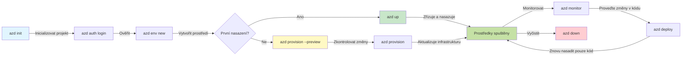
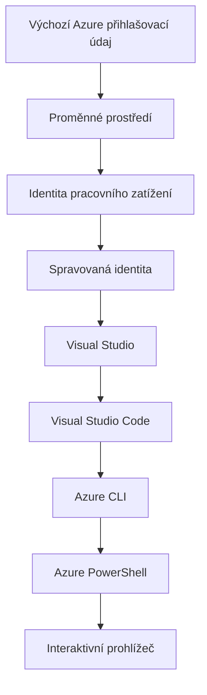

# AZD Základy - Pochopení Azure Developer CLI

# AZD Základy - Hlavní koncepty a základy

**Navigace kapitolou:**
- **📚 Domov kurzu**: [AZD Pro začátečníky](../../README.md)
- **📖 Aktuální kapitola**: Kapitola 1 - Základy & Rychlý start
- **⬅️ Předchozí**: [Přehled kurzu](../../README.md#-chapter-1-foundation--quick-start)
- **➡️ Další**: [Instalace a nastavení](installation.md)
- **🚀 Další kapitola**: [Kapitola 2: Vývoj orientovaný na AI](../chapter-02-ai-development/microsoft-foundry-integration.md)

## Úvod

Tato lekce vás seznámí s Azure Developer CLI (azd), výkonným nástrojem příkazového řádku, který urychluje vaši cestu od lokálního vývoje k nasazení v Azure. Naučíte se základní koncepty, klíčové funkce a pochopíte, jak azd zjednodušuje nasazení cloud-native aplikací.

## Cíle učení

Na konci této lekce budete:
- Pochopit, co je Azure Developer CLI a jeho hlavní účel
- Seznámit se se základními koncepty šablon, prostředí a služeb
- Prozkoumat klíčové funkce včetně vývoje řízeného šablonami a Infrastruktury jako kódu
- Pochopit strukturu projektu azd a pracovní postup
- Být připraven nainstalovat a nakonfigurovat azd pro vaše vývojové prostředí

## Výstupy učení

Po dokončení této lekce budete schopni:
- Vysvětlit roli azd v moderních cloudových pracovních postupech
- Identifikovat komponenty struktury projektu azd
- Popsat, jak šablony, prostředí a služby spolupracují
- Pochopit výhody Infrastruktury jako kódu s azd
- Rozpoznat různé azd příkazy a jejich účel

## Co je Azure Developer CLI (azd)?

Azure Developer CLI (azd) je nástroj příkazového řádku navržený k urychlení vaší cesty od lokálního vývoje k nasazení do Azure. Zjednodušuje proces vytváření, nasazování a správy cloud-native aplikací na Azure.

### Co můžete nasadit pomocí azd?

azd podporuje široké spektrum pracovních zátěží — a seznam stále roste. Dnes můžete pomocí azd nasadit:

| Typ zátěže | Příklady | Stejný pracovní postup? |
|---------------|----------|----------------|
| **Tradiční aplikace** | Webové aplikace, REST API, statické stránky | ✅ `azd up` |
| **Služby a mikroslužby** | Container Apps, Function Apps, backendy s více službami | ✅ `azd up` |
| **Aplikace s podporou AI** | Chatovací aplikace s Microsoft Foundry Models, RAG řešení s AI Search | ✅ `azd up` |
| **Inteligentní agenti** | Agenti hostovaní ve Foundry, orchestrace více agentů | ✅ `azd up` |

Klíčovým poznatkem je, že **životní cyklus azd zůstává stejný bez ohledu na to, co nasazujete**. Inicializujete projekt, připravíte infrastrukturu, nasadíte svůj kód, sledujete aplikaci a uklidíte — ať už se jedná o jednoduchý web nebo sofistikovaného AI agenta.

Tato kontinuita je záměrná. azd považuje AI schopnosti za další druh služby, kterou může vaše aplikace využívat, nikoli za něco fundamentálně odlišného. Chatovací endpoint podporovaný Microsoft Foundry Models je z pohledu azd jen další služba k nakonfigurování a nasazení.

### 🎯 Proč používat AZD? Reálné porovnání

Porovnejme nasazení jednoduché webové aplikace s databází:

#### ❌ BEZ AZD: Manuální nasazení do Azure (30+ minut)

```bash
# Krok 1: Vytvořte skupinu prostředků
az group create --name myapp-rg --location eastus

# Krok 2: Vytvořte plán App Service
az appservice plan create --name myapp-plan \
  --resource-group myapp-rg \
  --sku B1 --is-linux

# Krok 3: Vytvořte webovou aplikaci
az webapp create --name myapp-web-unique123 \
  --resource-group myapp-rg \
  --plan myapp-plan \
  --runtime "NODE:18-lts"

# Krok 4: Vytvořte účet Cosmos DB (10-15 minut)
az cosmosdb create --name myapp-cosmos-unique123 \
  --resource-group myapp-rg \
  --kind MongoDB

# Krok 5: Vytvořte databázi
az cosmosdb mongodb database create \
  --account-name myapp-cosmos-unique123 \
  --resource-group myapp-rg \
  --name tododb

# Krok 6: Vytvořte kolekci
az cosmosdb mongodb collection create \
  --account-name myapp-cosmos-unique123 \
  --resource-group myapp-rg \
  --database-name tododb \
  --name todos

# Krok 7: Získejte řetězec připojení
CONN_STR=$(az cosmosdb keys list \
  --name myapp-cosmos-unique123 \
  --resource-group myapp-rg \
  --type connection-strings \
  --query "connectionStrings[0].connectionString" -o tsv)

# Krok 8: Nakonfigurujte nastavení aplikace
az webapp config appsettings set \
  --name myapp-web-unique123 \
  --resource-group myapp-rg \
  --settings MONGODB_URI="$CONN_STR"

# Krok 9: Povolte protokolování
az webapp log config --name myapp-web-unique123 \
  --resource-group myapp-rg \
  --application-logging filesystem \
  --detailed-error-messages true

# Krok 10: Nastavte Application Insights
az monitor app-insights component create \
  --app myapp-insights \
  --location eastus \
  --resource-group myapp-rg

# Krok 11: Propojte Application Insights s webovou aplikací
INSTRUMENTATION_KEY=$(az monitor app-insights component show \
  --app myapp-insights \
  --resource-group myapp-rg \
  --query "instrumentationKey" -o tsv)

az webapp config appsettings set \
  --name myapp-web-unique123 \
  --resource-group myapp-rg \
  --settings APPINSIGHTS_INSTRUMENTATIONKEY="$INSTRUMENTATION_KEY"

# Krok 12: Sestavte aplikaci lokálně
npm install
npm run build

# Krok 13: Vytvořte nasazovací balíček
zip -r app.zip . -x "*.git*" "node_modules/*"

# Krok 14: Nasaďte aplikaci
az webapp deployment source config-zip \
  --resource-group myapp-rg \
  --name myapp-web-unique123 \
  --src app.zip

# Krok 15: Počkejte a modlete se, aby to fungovalo 🙏
# (Žádné automatizované ověření, vyžaduje se ruční testování)
```

**Problémy:**
- ❌ 15+ příkazů, které si musíte pamatovat a spouštět v pořadí
- ❌ 30–45 minut ruční práce
- ❌ Snadno uděláte chybu (překlepy, špatné parametry)
- ❌ Připojovací řetězce vystavené v historii terminálu
- ❌ Žádné automatické vrácení změn při selhání
- ❌ Těžké replikovat pro členy týmu
- ❌ Pokaždé jiné (nereprodukovatelné)

#### ✅ S AZD: Automatické nasazení (5 příkazů, 10-15 minut)

```bash
# Krok 1: Inicializovat z šablony
azd init --template todo-nodejs-mongo

# Krok 2: Ověřit
azd auth login

# Krok 3: Vytvořit prostředí
azd env new dev

# Krok 4: Náhled změn (volitelné, ale doporučené)
azd provision --preview

# Krok 5: Nasadit vše
azd up

# ✨ Hotovo! Vše je nasazeno, nakonfigurováno a monitorováno
```

**Výhody:**
- ✅ **5 příkazů** vs. 15+ manuálních kroků
- ✅ **10–15 minut** celkově (většinou čekání na Azure)
- ✅ **Žádné chyby** - automatizované a testované
- ✅ **Tajné údaje bezpečně spravovány** pomocí Key Vaultu
- ✅ **Automatické vrácení změn** při selhání
- ✅ **Plně reprodukovatelné** - stejný výsledek pokaždé
- ✅ **Připravené pro tým** - kdokoli může nasadit stejnými příkazy
- ✅ **Infrastruktura jako kód** - Bicep šablony pod verzovací kontrolou
- ✅ **Vestavěné monitorování** - Application Insights nakonfigurován automaticky

### 📊 Snížení času a chybovosti

| Metrika | Manuální nasazení | Nasazení s AZD | Zlepšení |
|:-------|:------------------|:---------------|:------------|
| **Příkazy** | 15+ | 5 | o 67 % méně |
| **Čas** | 30-45 min | 10-15 min | o 60 % rychlejší |
| **Míra chyb** | ~40% | <5% | snížení o 88 % |
| **Konzistence** | Nízká (ruční) | 100% (automatizované) | Dokonalá |
| **Zaškolení týmu** | 2-4 hodiny | 30 minut | o 75 % rychlejší |
| **Čas vrácení změn** | 30+ min (ruční) | 2 min (automatizované) | o 93 % rychlejší |

## Základní koncepty

### Šablony
Šablony jsou základem azd. Obsahují:
- **Kód aplikace** - Váš zdrojový kód a závislosti
- **Definice infrastruktury** - Azure zdroje definované v Bicep nebo Terraformu
- **Konfigurační soubory** - Nastavení a proměnné prostředí
- **Nasazovací skripty** - Automatizované workflow pro nasazení

### Prostředí
Prostředí představují různé cíle nasazení:
- **Development** - Pro testování a vývoj
- **Staging** - Předprodukční prostředí
- **Production** - Živé produkční prostředí

Každé prostředí udržuje své vlastní:
- Skupinu prostředků Azure
- Konfigurační nastavení
- Stav nasazení

### Služby
Služby jsou stavebními kameny vaší aplikace:
- **Frontend** - Webové aplikace, SPA
- **Backend** - API, mikroslužby
- **Databáze** - Řešení pro ukládání dat
- **Úložiště** - Úložiště souborů a blobů

## Klíčové funkce

### 1. Vývoj řízený šablonami
```bash
# Procházet dostupné šablony
azd template list

# Inicializovat ze šablony
azd init --template <template-name>
```

### 2. Infrastruktura jako kód
- **Bicep** - Doménově specifický jazyk Azure
- **Terraform** - Nástroj pro infrastrukturu napříč cloudy
- **ARM Templates** - Šablony Azure Resource Manager

### 3. Integrované workflow
```bash
# Kompletní postup nasazení
azd up            # Provision + Deploy — bezobslužné pro počáteční nastavení

# 🧪 NOVÉ: Náhled změn infrastruktury před nasazením (BEZPEČNÉ)
azd provision --preview    # Simulovat nasazení infrastruktury bez provedení změn

azd provision     # Vytvořte prostředky Azure — pokud aktualizujete infrastrukturu, použijte to
azd deploy        # Nasadit kód aplikace nebo kód znovu nasadit po aktualizaci
azd down          # Vyčistit prostředky
```

#### 🛡️ Bezpečné plánování infrastruktury s náhledem
Příkaz `azd provision --preview` je zásadní pro bezpečné nasazení:
- **Analýza suchého běhu (dry-run)** - Zobrazuje, co bude vytvořeno, upraveno nebo smazáno
- **Bez rizika** - Ve vašem Azure prostředí nejsou provedeny žádné skutečné změny
- **Spolupráce v týmu** - Sdílejte výsledky náhledu před nasazením
- **Odhad nákladů** - Pochopte náklady na zdroje před závazkem

```bash
# Ukázkový náhledový pracovní postup
azd provision --preview           # Podívejte se, co se změní
# Zkontrolujte výstup, prodiskutujte s týmem
azd provision                     # Proveďte změny s jistotou
```

### 📊 Vizualizace: AZD vývojový pracovní postup


**Vysvětlení pracovního postupu:**
1. **Init** - Začněte se šablonou nebo novým projektem
2. **Auth** - Autentizujte se v Azure
3. **Environment** - Vytvořte izolované nasazovací prostředí
4. **Preview** - 🆕 Vždy si nejprve prohlédněte změny infrastruktury (bezpečný postup)
5. **Provision** - Vytvořit/aktualizovat Azure zdroje
6. **Deploy** - Nasadit váš aplikační kód
7. **Monitor** - Sledujte výkon aplikace
8. **Iterate** - Dělejte změny a znovu nasazujte kód
9. **Cleanup** - Odeberte zdroje po dokončení

### 4. Správa prostředí
```bash
# Vytvářejte a spravujte prostředí
azd env new <environment-name>
azd env select <environment-name>
azd env list
```

### 5. Rozšíření a AI příkazy

azd používá systém rozšíření pro přidání funkcí nad rámec jádra CLI. To je obzvlášť užitečné pro AI zátěže:

```bash
# Seznam dostupných rozšíření
azd extension list

# Nainstalovat rozšíření Foundry Agents
azd extension install azure.ai.agents

# Inicializovat projekt AI agenta z manifestu
azd ai agent init -m agent-manifest.yaml

# Spustit MCP server pro vývoj asistovaný umělou inteligencí (Alpha)
azd mcp start
```

> Rozšíření jsou popsána podrobně v [Kapitola 2: Vývoj orientovaný na AI](../chapter-02-ai-development/agents.md) a v referenci [Příkazy AZD AI CLI](../chapter-08-production/production-ai-practices.md#azd-ai-cli-commands-and-extensions).

## 📁 Struktura projektu

Typická struktura projektu azd:
```
my-app/
├── .azd/                    # azd configuration
│   └── config.json
├── .azure/                  # Azure deployment artifacts
├── .devcontainer/          # Development container config
├── .github/workflows/      # GitHub Actions
├── .vscode/               # VS Code settings
├── infra/                 # Infrastructure code
│   ├── main.bicep        # Main infrastructure template
│   ├── main.parameters.json
│   └── modules/          # Reusable modules
├── src/                  # Application source code
│   ├── api/             # Backend services
│   └── web/             # Frontend application
├── azure.yaml           # azd project configuration
└── README.md
```

## 🔧 Konfigurační soubory

### azure.yaml
Hlavní konfigurační soubor projektu:
```yaml
name: my-awesome-app
metadata:
  template: my-template@1.0.0

services:
  web:
    project: ./src/web
    language: js
    host: appservice
  api:
    project: ./src/api
    language: js
    host: appservice

hooks:
  preprovision:
    shell: pwsh
    run: echo "Preparing to provision..."
```

### .azure/config.json
Konfigurace specifická pro prostředí:
```json
{
  "version": 1,
  "defaultEnvironment": "dev",
  "environments": {
    "dev": {
      "subscriptionId": "your-subscription-id",
      "location": "eastus"
    }
  }
}
```

## 🎪 Běžné workflow s praktickými cvičeními

> **💡 Tip pro učení:** Postupujte podle těchto cvičení v pořadí, abyste si postupně vybudovali dovednosti v AZD.

### 🎯 Cvičení 1: Inicializujte svůj první projekt

**Cíl:** Vytvořit AZD projekt a prozkoumat jeho strukturu

**Kroky:**
```bash
# Použijte ověřenou šablonu
azd init --template todo-nodejs-mongo

# Prozkoumejte vygenerované soubory
ls -la  # Zobrazte všechny soubory včetně skrytých

# Vytvořené klíčové soubory:
# - azure.yaml (hlavní konfigurace)
# - infra/ (kód infrastruktury)
# - src/ (kód aplikace)
```

**✅ Úspěch:** Máte soubor azure.yaml a adresáře infra/ a src/

---

### 🎯 Cvičení 2: Nasazení do Azure

**Cíl:** Dokončit end-to-end nasazení

**Kroky:**
```bash
# 1. Ověřit
az login && azd auth login

# 2. Vytvořit prostředí
azd env new dev
azd env set AZURE_LOCATION eastus

# 3. Náhled změn (DOPORUČENO)
azd provision --preview

# 4. Nasadit vše
azd up

# 5. Ověřit nasazení
azd show    # Zobrazit URL vaší aplikace
```

**Odhadovaný čas:** 10-15 minut  
**✅ Úspěch:** URL aplikace se otevře v prohlížeči

---

### 🎯 Cvičení 3: Více prostředí

**Cíl:** Nasadit do dev a staging

**Kroky:**
```bash
# Dev už existuje, vytvořte staging
azd env new staging
azd env set AZURE_LOCATION westus2
azd up

# Přepínejte mezi nimi
azd env list
azd env select dev
```

**✅ Úspěch:** Dvě samostatné skupiny prostředků v Azure Portalu

---

### 🛡️ Čistý start: `azd down --force --purge`

Když potřebujete provést úplné resetování:

```bash
azd down --force --purge
```

**Co to dělá:**
- `--force`: Žádné výzvy k potvrzení
- `--purge`: Maže veškerý lokální stav a Azure zdroje

**Použít když:**
- Nasazení selhalo uprostřed
- Přepínání projektů
- Potřebujete nový začátek

---

## 🎪 Původní referenční pracovní postup

### Zahájení nového projektu
```bash
# Metoda 1: Použít existující šablonu
azd init --template todo-nodejs-mongo

# Metoda 2: Začít od nuly
azd init

# Metoda 3: Použít aktuální adresář
azd init .
```

### Vývojový cyklus
```bash
# Nastavení vývojového prostředí
azd auth login
azd env new dev
azd env select dev

# Nasazení všeho
azd up

# Provedení změn a opětovné nasazení
azd deploy

# Vyčištění po dokončení
azd down --force --purge # Příkaz v Azure Developer CLI je **tvrdý reset** vašeho prostředí — obzvlášť užitečný, když řešíte selhaná nasazení, čistíte opuštělé zdroje nebo se připravujete na nové nasazení.
```

## Pochopení `azd down --force --purge`
Příkaz `azd down --force --purge` je silný způsob, jak úplně rozebrat vaše azd prostředí a všechny související zdroje. Zde je rozpis toho, co každý příznak dělá:
```
--force
```
- Přeskočí výzvy k potvrzení.
- Užitečné pro automatizaci nebo skriptování tam, kde ruční zadání není možné.
- Zajišťuje, že demontáž proběhne bez přerušení, i když CLI detekuje nesrovnalosti.

```
--purge
```
Maže **veškeré související metadata**, včetně:
Stav prostředí
Lokální složka `.azure`
Uložené informace o nasazení
Zabraňuje tomu, aby si azd "pamatoval" předchozí nasazení, což může způsobit problémy jako neshodné skupiny prostředků nebo zastaralé odkazy na registr.

### Proč používat oba?
Když narazíte na problém s `azd up` kvůli přetrvávajícímu stavu nebo částečným nasazením, tato kombinace zajišťuje **čistý start**.

Je to obzvláště užitečné po ručních odstraněních zdrojů v Azure portálu nebo při přepínání šablon, prostředí nebo konvencí pojmenování skupin prostředků.

### Správa více prostředí
```bash
# Vytvořit stagingové prostředí
azd env new staging
azd env select staging
azd up

# Přepnout zpět na dev
azd env select dev

# Porovnat prostředí
azd env list
```

## 🔐 Autentizace a pověření

Pochopení autentizace je zásadní pro úspěšná nasazení azd. Azure používá více metod autentizace a azd využívá stejný řetězec pověření jako ostatní Azure nástroje.

### Autentizace přes Azure CLI (`az login`)

Před použitím azd se musíte autentizovat v Azure. Nejběžnější metodou je použití Azure CLI:

```bash
# Interaktivní přihlášení (otevře prohlížeč)
az login

# Přihlášení s konkrétním tenantem
az login --tenant <tenant-id>

# Přihlášení pomocí service principal
az login --service-principal -u <app-id> -p <password> --tenant <tenant-id>

# Zkontrolovat aktuální stav přihlášení
az account show

# Vypsat dostupná předplatná
az account list --output table

# Nastavit výchozí předplatné
az account set --subscription <subscription-id>
```

### Tok autentizace
1. **Interaktivní přihlášení**: Otevře váš výchozí prohlížeč pro autentizaci
2. **Device Code Flow**: Pro prostředí bez přístupu k prohlížeči
3. **Service Principal**: Pro automatizaci a scénáře CI/CD
4. **Managed Identity**: Pro aplikace hostované v Azure

### Řetězec DefaultAzureCredential

`DefaultAzureCredential` je typ pověření, který poskytuje zjednodušenou zkušenost s autentizací tím, že automaticky zkouší více zdrojů pověření v konkrétním pořadí:

#### Pořadí řetězce pověření

#### 1. Proměnné prostředí
```bash
# Nastavit proměnné prostředí pro identitu služby
export AZURE_CLIENT_ID="<app-id>"
export AZURE_CLIENT_SECRET="<password>"
export AZURE_TENANT_ID="<tenant-id>"
```

#### 2. Workload Identity (Kubernetes/GitHub Actions)
Používá se automaticky v:
- Azure Kubernetes Service (AKS) s Workload Identity
- GitHub Actions s OIDC federací
- Jiné scénáře s federovanou identitou

#### 3. Managed Identity
Pro Azure zdroje jako jsou:
- Virtuální stroje
- App Service
- Azure Functions
- Container Instances

```bash
# Zkontrolovat, zda běží na Azure prostředku s řízenou identitou
az account show --query "user.type" --output tsv
# Vrací: "servicePrincipal", pokud se používá řízená identita
```

#### 4. Integrace s vývojovými nástroji
- **Visual Studio**: Automaticky používá přihlášený účet
- **VS Code**: Používá pověření rozšíření Azure Account
- **Azure CLI**: Používá pověření z `az login` (nejčastější pro lokální vývoj)

### Nastavení autentizace AZD

```bash
# Metoda 1: Použijte Azure CLI (doporučeno pro vývoj)
az login
azd auth login  # Používá stávající přihlašovací údaje Azure CLI

# Metoda 2: Přímé ověření pomocí azd
azd auth login --use-device-code  # Pro prostředí bez uživatelského rozhraní (headless)

# Metoda 3: Zkontrolovat stav ověření
azd auth login --check-status

# Metoda 4: Odhlásit se a znovu se přihlásit
azd auth logout
azd auth login
```

### Nejlepší postupy autentizace

#### Pro lokální vývoj
```bash
# 1. Přihlaste se pomocí Azure CLI
az login

# 2. Ověřte správné předplatné
az account show
az account set --subscription "Your Subscription Name"

# 3. Použijte azd s existujícími přihlašovacími údaji
azd auth login
```

#### Pro CI/CD pipeliny
```yaml
# GitHub Actions example
- name: Azure Login
  uses: azure/login@v1
  with:
    creds: ${{ secrets.AZURE_CREDENTIALS }}

- name: Deploy with azd
  run: |
    azd auth login --client-id ${{ secrets.AZURE_CLIENT_ID }} \
                    --client-secret ${{ secrets.AZURE_CLIENT_SECRET }} \
                    --tenant-id ${{ secrets.AZURE_TENANT_ID }}
    azd up --no-prompt
```

#### Pro produkční prostředí
- Používejte **Managed Identity**, když aplikace běží na Azure zdrojích
- Používejte **Service Principal** pro automatizační scénáře
- Vyvarujte se ukládání pověření v kódu nebo konfiguračních souborech
- Používejte **Azure Key Vault** pro citlivou konfiguraci

### Běžné problémy s autentizací a řešení

#### Problém: "Nebyla nalezena žádná subscription"
```bash
# Řešení: Nastavte výchozí předplatné
az account list --output table
az account set --subscription "<subscription-id>"
azd env set AZURE_SUBSCRIPTION_ID "<subscription-id>"
```

#### Problém: "Nedostatečná oprávnění"
```bash
# Řešení: Zkontrolujte a přiřaďte požadované role
az role assignment list --assignee $(az account show --query user.name --output tsv)

# Běžné požadované role:
# - Contributor (pro správu prostředků)
# - User Access Administrator (pro přiřazování rolí)
```

#### Problém: "Vypršel token"
```bash
# Řešení: Znovu se ověřte
az logout
az login
azd auth logout
azd auth login
```

### Autentizace v různých scénářích

#### Lokální vývoj
```bash
# Účet pro osobní rozvoj
az login
azd auth login
```

#### Týmový vývoj
```bash
# Použijte konkrétního tenanta pro organizaci
az login --tenant contoso.onmicrosoft.com
azd auth login
```

#### Scénáře s více nájemci
```bash
# Přepnout mezi nájemci
az login --tenant tenant1.onmicrosoft.com
# Nasadit do nájemce 1
azd up

az login --tenant tenant2.onmicrosoft.com  
# Nasadit do nájemce 2
azd up
```

### Bezpečnostní úvahy
1. **Ukládání přihlašovacích údajů**: Nikdy neukládejte přihlašovací údaje do zdrojového kódu
2. **Omezení oprávnění**: Používejte zásadu nejmenších oprávnění pro servisní identity
3. **Rotace tokenů**: Pravidelně obnovujte tajné klíče servisních identit
4. **Auditní záznamy**: Monitorujte autentizaci a aktivity nasazování
5. **Síťová bezpečnost**: Používejte soukromé koncové body, kdykoli je to možné

### Řešení problémů s autentizací

```bash
# Ladění problémů s autentizací
azd auth login --check-status
az account show
az account get-access-token

# Běžné diagnostické příkazy
whoami                          # Aktuální kontext uživatele
az ad signed-in-user show      # Podrobnosti o uživateli Azure AD
az group list                  # Test přístupu ke zdroji
```

## Pochopení `azd down --force --purge`

### Zjišťování
```bash
azd template list              # Procházet šablony
azd template show <template>   # Podrobnosti šablony
azd init --help               # Možnosti inicializace
```

### Správa projektu
```bash
azd show                     # Přehled projektu
azd env show                 # Aktuální prostředí
azd config list             # Konfigurační nastavení
```

### Monitorování
```bash
azd monitor                  # Otevřít monitorování v portálu Azure
azd monitor --logs           # Zobrazit protokoly aplikace
azd monitor --live           # Zobrazit živé metriky
azd pipeline config          # Nastavit CI/CD
```

## Doporučené postupy

### 1. Používejte smysluplná jména
```bash
# Dobré
azd env new production-east
azd init --template web-app-secure

# Vyhnout se
azd env new env1
azd init --template template1
```

### 2. Využijte šablony
- Začněte s existujícími šablonami
- Upravte je podle svých potřeb
- Vytvořte znovupoužitelné šablony pro vaši organizaci

### 3. Izolace prostředí
- Používejte oddělená prostředí pro dev/staging/prod
- Nikdy nenasazujte přímo do produkce z lokálního stroje
- Používejte CI/CD pipeline pro nasazení do produkce

### 4. Správa konfigurace
- Používejte proměnné prostředí pro citlivá data
- Ukládejte konfiguraci do verzovacího systému
- Dokumentujte nastavení specifická pro prostředí

## Postup učení

### Začátečník (Týden 1-2)
1. Nainstalujte azd a přihlaste se
2. Nasaďte jednoduchou šablonu
3. Pochopte strukturu projektu
4. Naučte se základní příkazy (up, down, deploy)

### Pokročilý (Týden 3-4)
1. Přizpůsobte šablony
2. Spravujte více prostředí
3. Pochopte kód infrastruktury
4. Nastavte CI/CD pipeline

### Pokročilý (Týden 5+)
1. Vytvořte vlastní šablony
2. Pokročilé vzory infrastruktury
3. Nasazení do více regionů
4. Konfigurace na podnikové úrovni

## Další kroky

**📖 Pokračujte v učení kapitoly 1:**
- [Installation & Setup](installation.md) - Nainstalujte a nakonfigurujte azd
- [Your First Project](first-project.md) - Dokončete praktický tutoriál
- [Configuration Guide](configuration.md) - Pokročilé konfigurační možnosti

**🎯 Připraveno na další kapitolu?**
- [Chapter 2: AI-First Development](../chapter-02-ai-development/microsoft-foundry-integration.md) - Začněte vytvářet AI aplikace

## Další zdroje

- [Azure Developer CLI Overview](https://learn.microsoft.com/en-us/azure/developer/azure-developer-cli/)
- [Template Gallery](https://azure.github.io/awesome-azd/)
- [Community Samples](https://github.com/Azure-Samples)

---

## 🙋 Často kladené dotazy

### Obecné otázky

**Q: Jaký je rozdíl mezi AZD a Azure CLI?**

A: Azure CLI (`az`) slouží k řízení jednotlivých Azure zdrojů. AZD (`azd`) slouží k řízení celých aplikací:

```bash
# Azure CLI - Správa zdrojů na nízké úrovni
az webapp create --name myapp --resource-group rg
az sql server create --name myserver --resource-group rg
# ...je potřeba mnohem více příkazů

# AZD - Správa na úrovni aplikace
azd up  # Nasadí celou aplikaci se všemi prostředky
```

**Myslete na to takto:**
- `az` = Práce s jednotlivými kostičkami Lega
- `azd` = Práce s kompletními sadami Lega

---

**Q: Potřebuji znát Bicep nebo Terraform pro použití AZD?**

A: Ne! Začněte se šablonami:
```bash
# Použijte existující šablonu - není potřeba znalostí IaC
azd init --template todo-nodejs-mongo
azd up
```

Bicep se můžete naučit později pro přizpůsobení infrastruktury. Šablony poskytují funkční příklady, ze kterých se můžete učit.

---

**Q: Kolik stojí provoz šablon AZD?**

A: Náklady se liší podle šablony. Většina vývojových šablon stojí $50-150/month:
```bash
# Náhled nákladů před nasazením
azd provision --preview

# Vždy proveďte úklid, když to nepoužíváte
azd down --force --purge  # Odstraňuje všechny zdroje
```

**Pro tip:** Používejte bezplatné tarify, kde jsou dostupné:
- App Service: stupeň F1 (zdarma)
- Modely Microsoft Foundry: Azure OpenAI 50,000 tokenů/měsíc zdarma
- Cosmos DB: bezplatný stupeň 1000 RU/s

---

**Q: Mohu používat AZD s existujícími Azure zdroji?**

A: Ano, ale je snazší začít od začátku. AZD funguje nejlépe, když spravuje celý životní cyklus. Pro existující zdroje:
```bash
# Možnost 1: Importovat existující zdroje (pokročilé)
azd init
# Poté upravte infra/, aby odkazovalo na existující zdroje

# Možnost 2: Začněte od začátku (doporučeno)
azd init --template matching-your-stack
azd up  # Vytvoří nové prostředí.
```

---

**Q: Jak sdílím svůj projekt s kolegy?**

A: Proveďte commit projektu AZD do Gitu (ale NE složku .azure):
```bash
# Už je ve .gitignore ve výchozím nastavení
.azure/        # Obsahuje tajné údaje a data prostředí
*.env          # Proměnné prostředí

# Tehdejší členové týmu:
git clone <your-repo>
azd auth login
azd env new <their-name>-dev
azd up
```

Všichni získají identickou infrastrukturu ze stejných šablon.

---

### Otázky k řešení problémů

**Q: "azd up" selhal uprostřed. Co mám dělat?**

A: Zkontrolujte chybu, opravte ji a zkuste to znovu:
```bash
# Zobrazit podrobné záznamy
azd show

# Běžné opravy:

# 1. Pokud je kvóta překročena:
azd env set AZURE_LOCATION "westus2"  # Zkuste jiný region

# 2. Pokud dojde ke konfliktu názvu zdroje:
azd down --force --purge  # Začít od nuly
azd up  # Zkusit znovu

# 3. Pokud vypršelo ověření:
az login
azd auth login
azd up
```

**Nejčastější problém:** Je vybráno nesprávné předplatné Azure
```bash
az account list --output table
az account set --subscription "<correct-subscription>"
```

---

**Q: Jak nasadím jen změny v kódu bez opětovného zřizování infrastruktury?**

A: Použijte `azd deploy` místo `azd up`:
```bash
azd up          # Poprvé: nastavení a nasazení (pomalé)

# Proveďte změny v kódu...

azd deploy      # Při dalších spuštěních: pouze nasazení (rychlé)
```

Porovnání rychlosti:
- `azd up`: 10-15 minut (zřizuje infrastrukturu)
- `azd deploy`: 2-5 minut (pouze kód)

---

**Q: Mohu upravit šablony infrastruktury?**

A: Ano! Upravte soubory Bicep v `infra/`:
```bash
# Po spuštění azd init
cd infra/
code main.bicep  # Upravit ve VS Code

# Náhled změn
azd provision --preview

# Použít změny
azd provision
```

**Tip:** Začněte zvolna - nejprve změňte SKU:
```bicep
// infra/main.bicep
sku: {
  name: 'B1'  // Change to 'P1V2' for production
}
```

---

**Q: Jak smažu vše, co AZD vytvořilo?**

A: Jeden příkaz odstraní všechny prostředky:
```bash
azd down --force --purge

# Tímto se odstraní:
# - Všechny prostředky Azure
# - Skupina prostředků
# - Stav lokálního prostředí
# - Data nasazení v mezipaměti
```

**Vždy to spusťte, když:**
- Dokončili jste testování šablony
- Přecházíte na jiný projekt
- Chcete začít znovu

**Úspora nákladů:** Odstraněním nepoužívaných prostředků = $0 poplatků

---

**Q: Co když náhodou smažu prostředky v Azure Portal?**

A: Stav AZD se může dostat mimo synchronizaci. Přístup 'čistý start':
```bash
# 1. Odstraňte lokální stav
azd down --force --purge

# 2. Začněte znovu
azd up

# Alternativa: Nechte AZD detekovat a opravit
azd provision  # Vytvoří chybějící zdroje
```

---

### Pokročilé otázky

**Q: Mohu používat AZD v CI/CD pipeline?**

A: Ano! Příklad pro GitHub Actions:
```yaml
# .github/workflows/deploy.yml
name: Deploy with AZD

on:
  push:
    branches: [main]

jobs:
  deploy:
    runs-on: ubuntu-latest
    steps:
      - uses: actions/checkout@v2
      
      - name: Install azd
        run: curl -fsSL https://aka.ms/install-azd.sh | bash
      
      - name: Azure Login
        run: |
          azd auth login \
            --client-id ${{ secrets.AZURE_CLIENT_ID }} \
            --client-secret ${{ secrets.AZURE_CLIENT_SECRET }} \
            --tenant-id ${{ secrets.AZURE_TENANT_ID }}
      
      - name: Deploy
        run: azd up --no-prompt
```

---

**Q: Jak nakládat s tajnými a citlivými údaji?**

A: AZD se automaticky integruje s Azure Key Vault:
```bash
# Tajné údaje jsou uloženy v Key Vault, ne v kódu
azd env set DATABASE_PASSWORD "$(openssl rand -base64 32)"

# AZD automaticky:
# 1. Vytvoří Key Vault
# 2. Uloží tajemství
# 3. Udělí aplikaci přístup pomocí spravované identity
# 4. Vloží za běhu
```

**Nikdy necommitujte:**
- `.azure/` složka (obsahuje data prostředí)
- `.env` soubory (lokální tajné údaje)
- Připojovací řetězce

---

**Q: Mohu nasadit do více regionů?**

A: Ano, vytvořte prostředí pro každý region:
```bash
# Prostředí východního USA
azd env new prod-eastus
azd env set AZURE_LOCATION eastus
azd up

# Prostředí západní Evropy
azd env new prod-westeurope
azd env set AZURE_LOCATION westeurope
azd up

# Každé prostředí je nezávislé
azd env list
```

Pro skutečné víceregionální aplikace upravte Bicep šablony tak, aby nasazovaly do více regionů současně.

---

**Q: Kde mohu získat pomoc, pokud uvíznu?**

1. **AZD Dokumentace:** https://learn.microsoft.com/azure/developer/azure-developer-cli/
2. **Sledování problémů na GitHubu:** https://github.com/Azure/azure-dev/issues
3. **Discord:** [Azure Discord](https://discord.gg/microsoft-azure) - kanál #azure-developer-cli
4. **Stack Overflow:** Štítek `azure-developer-cli`
5. **Tento kurz:** [Troubleshooting Guide](../chapter-07-troubleshooting/common-issues.md)

**Pro tip:** Než se zeptáte, spusťte:
```bash
azd show       # Zobrazuje aktuální stav
azd version    # Zobrazuje vaši verzi
```
Do své otázky zahrňte tyto informace pro rychlejší pomoc.

---

## 🎓 Co dál?

Nyní rozumíte základům AZD. Zvolte svou cestu:

### 🎯 Pro začátečníky:
1. **Další:** [Installation & Setup](installation.md) - Nainstalujte AZD na svůj počítač
2. **Poté:** [Your First Project](first-project.md) - Nasaďte svou první aplikaci
3. **Procvičování:** Dokončete všech 3 cvičení v této lekci

### 🚀 Pro AI vývojáře:
1. **Přeskočte na:** [Chapter 2: AI-First Development](../chapter-02-ai-development/microsoft-foundry-integration.md)
2. **Nasazení:** Začněte s `azd init --template get-started-with-ai-chat`
3. **Učte se:** Budujte současně s nasazováním

### 🏗️ Pro zkušené vývojáře:
1. **Zkontrolujte:** [Configuration Guide](configuration.md) - Pokročilá nastavení
2. **Prozkoumejte:** [Infrastructure as Code](../chapter-04-infrastructure/provisioning.md) - Hloubkový pohled na Bicep
3. **Vytvořte:** Vytvořte vlastní šablony pro váš stack

---

**Navigace kapitolami:**
- **📚 Domov kurzu**: [AZD For Beginners](../../README.md)
- **📖 Aktuální kapitola**: Kapitola 1 - Foundation & Quick Start  
- **⬅️ Předchozí**: [Course Overview](../../README.md#-chapter-1-foundation--quick-start)
- **➡️ Další**: [Installation & Setup](installation.md)
- **🚀 Další kapitola**: [Chapter 2: AI-First Development](../chapter-02-ai-development/microsoft-foundry-integration.md)

---

<!-- CO-OP TRANSLATOR DISCLAIMER START -->
**Prohlášení o vyloučení odpovědnosti**:
Tento dokument byl přeložen pomocí AI překladové služby [Co-op Translator](https://github.com/Azure/co-op-translator). I když usilujeme o přesnost, mějte prosím na paměti, že automatické překlady mohou obsahovat chyby nebo nepřesnosti. Původní dokument v jeho mateřském jazyce by měl být považován za autoritativní zdroj. Pro zásadní informace se doporučuje profesionální lidský překlad. Nejsme odpovědni za jakékoliv nedorozumění nebo mylné výklady vyplývající z použití tohoto překladu.
<!-- CO-OP TRANSLATOR DISCLAIMER END -->