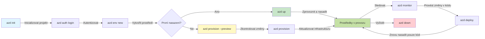
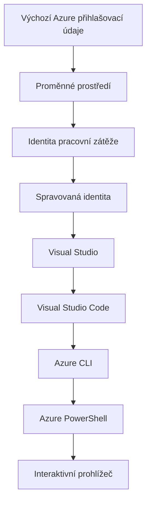

# AZD Basics - Pochopení Azure Developer CLI

# AZD Basics - Základní koncepty a principy

**Chapter Navigation:**
- **📚 Course Home**: [AZD For Beginners](../../README.md)
- **📖 Current Chapter**: Kapitola 1 - Základy & Rychlý start
- **⬅️ Previous**: [Course Overview](../../README.md#-chapter-1-foundation--quick-start)
- **➡️ Next**: [Installation & Setup](installation.md)
- **🚀 Next Chapter**: [Chapter 2: AI-First Development](../chapter-02-ai-development/microsoft-foundry-integration.md)

## Úvod

Tato lekce vás seznámí s Azure Developer CLI (azd), výkonným nástrojem příkazového řádku, který urychluje vaši cestu od lokálního vývoje k nasazení v Azure. Naučíte se základní koncepty, klíčové funkce a pochopíte, jak azd zjednodušuje nasazování cloud-native aplikací.

## Cíle učení

Na konci této lekce budete:
- Rozumět tomu, co je Azure Developer CLI a jaký má primární účel
- Naučit se základní koncepty šablon, prostředí a služeb
- Prozkoumat klíčové funkce včetně vývoje řízeného šablonami a Infrastruktury jako kódu
- Pochopit strukturu projektu azd a pracovní postup
- Být připraveni nainstalovat a nakonfigurovat azd pro vaše vývojové prostředí

## Výsledky učení

Po dokončení této lekce budete schopni:
- Vysvětlit roli azd v moderních cloudových vývojových postupech
- Identifikovat součásti struktury projektu azd
- Popsat, jak šablony, prostředí a služby spolupracují
- Pochopit výhody Infrastruktury jako kódu s azd
- Rozpoznat různé příkazy azd a jejich účel

## Co je Azure Developer CLI (azd)?

Azure Developer CLI (azd) je nástroj příkazového řádku navržený k urychlení vaší cesty od lokálního vývoje k nasazení v Azure. Zjednodušuje proces vytváření, nasazování a správy cloud-native aplikací v Azure.

### 🎯 Proč používat AZD? Porovnání z reálného světa

Porovnejme nasazení jednoduché webové aplikace s databází:

#### ❌ BEZ AZD: Ruční nasazení do Azure (30+ minut)

```bash
# Krok 1: Vytvořte skupinu prostředků
az group create --name myapp-rg --location eastus

# Krok 2: Vytvořte plán App Service
az appservice plan create --name myapp-plan \
  --resource-group myapp-rg \
  --sku B1 --is-linux

# Krok 3: Vytvořte webovou aplikaci
az webapp create --name myapp-web-unique123 \
  --resource-group myapp-rg \
  --plan myapp-plan \
  --runtime "NODE:18-lts"

# Krok 4: Vytvořte účet Cosmos DB (10–15 minut)
az cosmosdb create --name myapp-cosmos-unique123 \
  --resource-group myapp-rg \
  --kind MongoDB

# Krok 5: Vytvořte databázi
az cosmosdb mongodb database create \
  --account-name myapp-cosmos-unique123 \
  --resource-group myapp-rg \
  --name tododb

# Krok 6: Vytvořte kolekci
az cosmosdb mongodb collection create \
  --account-name myapp-cosmos-unique123 \
  --resource-group myapp-rg \
  --database-name tododb \
  --name todos

# Krok 7: Získejte řetězec připojení
CONN_STR=$(az cosmosdb keys list \
  --name myapp-cosmos-unique123 \
  --resource-group myapp-rg \
  --type connection-strings \
  --query "connectionStrings[0].connectionString" -o tsv)

# Krok 8: Nakonfigurujte nastavení aplikace
az webapp config appsettings set \
  --name myapp-web-unique123 \
  --resource-group myapp-rg \
  --settings MONGODB_URI="$CONN_STR"

# Krok 9: Povolte protokolování
az webapp log config --name myapp-web-unique123 \
  --resource-group myapp-rg \
  --application-logging filesystem \
  --detailed-error-messages true

# Krok 10: Nastavte Application Insights
az monitor app-insights component create \
  --app myapp-insights \
  --location eastus \
  --resource-group myapp-rg

# Krok 11: Propojte Application Insights s webovou aplikací
INSTRUMENTATION_KEY=$(az monitor app-insights component show \
  --app myapp-insights \
  --resource-group myapp-rg \
  --query "instrumentationKey" -o tsv)

az webapp config appsettings set \
  --name myapp-web-unique123 \
  --resource-group myapp-rg \
  --settings APPINSIGHTS_INSTRUMENTATIONKEY="$INSTRUMENTATION_KEY"

# Krok 12: Sestavte aplikaci lokálně
npm install
npm run build

# Krok 13: Vytvořte nasazovací balíček
zip -r app.zip . -x "*.git*" "node_modules/*"

# Krok 14: Nasaďte aplikaci
az webapp deployment source config-zip \
  --resource-group myapp-rg \
  --name myapp-web-unique123 \
  --src app.zip

# Krok 15: Počkejte a modlete se, aby to fungovalo 🙏
# (Žádné automatické ověření, vyžaduje se ruční testování)
```

**Problémy:**
- ❌ 15+ příkazů k zapamatování a spuštění ve správném pořadí
- ❌ 30–45 minut ruční práce
- ❌ Snadno se dopustíte chyb (překlepy, špatné parametry)
- ❌ Přihlašovací řetězce vystavené v historii terminálu
- ❌ Žádné automatické vrácení změn při selhání
- ❌ Obtížné replikovat pro členy týmu
- ❌ Každé nasazení je jiné (není reprodukovatelné)

#### ✅ S AZD: Automatizované nasazení (5 příkazů, 10–15 minut)

```bash
# Krok 1: Inicializace z šablony
azd init --template todo-nodejs-mongo

# Krok 2: Autentizace
azd auth login

# Krok 3: Vytvoření prostředí
azd env new dev

# Krok 4: Náhled změn (volitelný, ale doporučený)
azd provision --preview

# Krok 5: Nasazení všeho
azd up

# ✨ Hotovo! Vše je nasazeno, nakonfigurováno a monitorováno
```

**Výhody:**
- ✅ **5 příkazů** vs. 15+ ručních kroků
- ✅ **10–15 minut** celkový čas (většinu času čekáte na Azure)
- ✅ **Žádné chyby** – automatizované a otestované
- ✅ **Tajnosti spravovány bezpečně** přes Key Vault
- ✅ **Automatické vrácení změn** při selhání
- ✅ **Plně reprodukovatelné** – pokaždé stejný výsledek
- ✅ **Připravené pro tým** – kdokoli může nasadit pomocí stejných příkazů
- ✅ **Infrastruktura jako kód** – šablony Bicep pod verzovacím systémem
- ✅ **Vestavěné monitorování** – Application Insights automaticky nakonfigurován

### 📊 Snížení času a chyb

| Metric | Manual Deployment | AZD Deployment | Improvement |
|:-------|:------------------|:---------------|:------------|
| **Commands** | 15+ | 5 | o 67 % méně |
| **Time** | 30-45 min | 10-15 min | o 60 % rychlejší |
| **Error Rate** | ~40% | <5% | o 88 % méně chyb |
| **Consistency** | Low (manual) | 100% (automated) | Perfektní |
| **Team Onboarding** | 2-4 hours | 30 minutes | o 75 % rychlejší |
| **Rollback Time** | 30+ min (manual) | 2 min (automated) | o 93 % rychlejší |

## Základní koncepty

### Šablony
Šablony jsou základem azd. Obsahují:
- **Kód aplikace** - Váš zdrojový kód a závislosti
- **Definice infrastruktury** - Azure prostředky definované v Bicep nebo Terraform
- **Konfigurační soubory** - Nastavení a proměnné prostředí
- **Nasazovací skripty** - Automatizované pracovní postupy nasazení

### Prostředí
Prostředí představují různé cíle nasazení:
- **Development** - Pro testování a vývoj
- **Staging** - Předprodukční prostředí
- **Production** - Živé produkční prostředí

Každé prostředí udržuje vlastní:
- Azure resource group
- Konfigurační nastavení
- Stav nasazení

### Služby
Služby jsou stavební kameny vaší aplikace:
- **Frontend** - Webové aplikace, SPA
- **Backend** - API, mikroservisy
- **Database** - Řešení pro ukládání dat
- **Storage** - Souborové a blob úložiště

## Klíčové vlastnosti

### 1. Vývoj řízený šablonami
```bash
# Procházet dostupné šablony
azd template list

# Inicializovat ze šablony
azd init --template <template-name>
```

### 2. Infrastruktura jako kód
- **Bicep** - Doménově specifický jazyk pro Azure
- **Terraform** - Nástroj pro infrastrukturu napříč cloudy
- **ARM Templates** - Šablony Azure Resource Manager

### 3. Integrované pracovní postupy
```bash
# Kompletní pracovní postup nasazení
azd up            # Zajištění a nasazení — bezobslužné pro počáteční nastavení

# 🧪 NOVÉ: Náhled změn infrastruktury před nasazením (BEZPEČNÉ)
azd provision --preview    # Simulovat nasazení infrastruktury bez provedení změn

azd provision     # Vytvořit zdroje Azure — pokud aktualizujete infrastrukturu, použijte toto
azd deploy        # Nasadit kód aplikace nebo znovu nasadit kód aplikace po aktualizaci
azd down          # Odstranit zdroje
```

#### 🛡️ Bezpečné plánování infrastruktury s náhledem
Příkaz `azd provision --preview` je zásadní pro bezpečná nasazení:
- **Analýza bez provedení** - Zobrazuje, co bude vytvořeno, upraveno nebo smazáno
- **Žádné riziko** - Ve skutečnosti nejsou provedeny žádné změny ve vašem Azure prostředí
- **Spolupráce v týmu** - Sdílejte výsledky náhledu před nasazením
- **Odhad nákladů** - Pochopte náklady na prostředky před závazkem

```bash
# Příklad pracovního postupu pro náhled
azd provision --preview           # Podívejte se, co se změní
# Zkontrolujte výstup, prodiskutujte s týmem
azd provision                     # Proveďte změny s jistotou
```

### 📊 Vizualizace: Vývojový postup AZD


**Vysvětlení pracovního postupu:**
1. **Init** - Začněte se šablonou nebo novým projektem
2. **Auth** - Ověřte se v Azure
3. **Environment** - Vytvořte izolované nasazovací prostředí
4. **Preview** - 🆕 Vždy nejprve zobrazte náhled změn infrastruktury (bezpečný postup)
5. **Provision** - Vytvořte/aktualizujte Azure prostředky
6. **Deploy** - Nasajte kód vaší aplikace
7. **Monitor** - Sledujte výkon aplikace
8. **Iterate** - Proveďte změny a znovu nasaďte kód
9. **Cleanup** - Odstraňte prostředky po dokončení

### 4. Správa prostředí
```bash
# Vytvořit a spravovat prostředí
azd env new <environment-name>
azd env select <environment-name>
azd env list
```

## 📁 Struktura projektu

Typická struktura projektu azd:
```
my-app/
├── .azd/                    # azd configuration
│   └── config.json
├── .azure/                  # Azure deployment artifacts
├── .devcontainer/          # Development container config
├── .github/workflows/      # GitHub Actions
├── .vscode/               # VS Code settings
├── infra/                 # Infrastructure code
│   ├── main.bicep        # Main infrastructure template
│   ├── main.parameters.json
│   └── modules/          # Reusable modules
├── src/                  # Application source code
│   ├── api/             # Backend services
│   └── web/             # Frontend application
├── azure.yaml           # azd project configuration
└── README.md
```

## 🔧 Konfigurační soubory

### azure.yaml
Hlavní konfigurační soubor projektu:
```yaml
name: my-awesome-app
metadata:
  template: my-template@1.0.0

services:
  web:
    project: ./src/web
    language: js
    host: appservice
  api:
    project: ./src/api
    language: js
    host: appservice

hooks:
  preprovision:
    shell: pwsh
    run: echo "Preparing to provision..."
```

### .azure/config.json
Konfigurace specifická pro prostředí:
```json
{
  "version": 1,
  "defaultEnvironment": "dev",
  "environments": {
    "dev": {
      "subscriptionId": "your-subscription-id",
      "location": "eastus"
    }
  }
}
```

## 🎪 Běžné pracovní postupy s praktickými cvičeními

> **💡 Tip pro učení:** Postupujte podle těchto cvičení v pořadí, abyste postupně vybudovali své AZD dovednosti.

### 🎯 Cvičení 1: Inicializujte svůj první projekt

**Cíl:** Vytvořit AZD projekt a prozkoumat jeho strukturu

**Kroky:**
```bash
# Použijte ověřenou šablonu
azd init --template todo-nodejs-mongo

# Prozkoumejte vygenerované soubory
ls -la  # Zobrazit všechny soubory včetně skrytých

# Klíčové vytvořené soubory:
# - azure.yaml (hlavní konfigurace)
# - infra/ (kód infrastruktury)
# - src/ (kód aplikace)
```

**✅ Úspěch:** Máte soubor azure.yaml a adresáře infra/ a src/

---

### 🎯 Cvičení 2: Nasazení do Azure

**Cíl:** Dokončit kompletní end-to-end nasazení

**Kroky:**
```bash
# 1. Přihlásit se
az login && azd auth login

# 2. Vytvořit prostředí
azd env new dev
azd env set AZURE_LOCATION eastus

# 3. Náhled změn (DOPORUČENO)
azd provision --preview

# 4. Nasadit vše
azd up

# 5. Ověřit nasazení
azd show    # Zobrazit URL vaší aplikace
```

**Odhadovaný čas:** 10–15 minut  
**✅ Úspěch:** URL aplikace se otevře v prohlížeči

---

### 🎯 Cvičení 3: Více prostředí

**Cíl:** Nasadit do dev a staging

**Kroky:**
```bash
# Už máme dev, vytvořte staging
azd env new staging
azd env set AZURE_LOCATION westus2
azd up

# Přepínat mezi nimi
azd env list
azd env select dev
```

**✅ Úspěch:** Dvě samostatné skupiny prostředků v Azure Portal

---

### 🛡️ Čistý start: `azd down --force --purge`

Když potřebujete kompletně resetovat:

```bash
azd down --force --purge
```

**Co to dělá:**
- `--force`: Žádné výzvy k potvrzení
- `--purge`: Maže veškerý lokální stav a Azure prostředky

**Použít, když:**
- Nasazení selhalo uprostřed procesu
- Přepínáte mezi projekty
- Potřebujete čerstvý začátek

---

## 🎪 Původní referenční pracovní postup

### Spuštění nového projektu
```bash
# Metoda 1: Použít existující šablonu
azd init --template todo-nodejs-mongo

# Metoda 2: Začít od nuly
azd init

# Metoda 3: Použít aktuální adresář
azd init .
```

### Vývojový cyklus
```bash
# Nastavte vývojové prostředí
azd auth login
azd env new dev
azd env select dev

# Nasaďte vše
azd up

# Proveďte změny a znovu nasaďte
azd deploy

# Ukliďte po dokončení
azd down --force --purge # Příkaz v Azure Developer CLI je **úplné obnovení** vašeho prostředí — obzvlášť užitečné, když řešíte neúspěšná nasazení, uklízíte opuštěné prostředky nebo se připravujete na čisté opětovné nasazení.
```

## Pochopení `azd down --force --purge`
Příkaz `azd down --force --purge` je silný způsob, jak úplně rozebrat vaše azd prostředí a všechny s ním spojené prostředky. Zde je rozpis toho, co každý přepínač dělá:
```
--force
```
- Přeskočí výzvy k potvrzení.
- Uživatelsky užitečné pro automatizaci nebo skriptování, kde manuální vstup není možný.
- Zajišťuje, že teardown proběhne bez přerušení, i když CLI detekuje nekonzistence.

```
--purge
```
Maže **veškeré související metadata**, včetně:
Stav prostředí
Lokální složka `.azure`
Mezipaměť nasazovacích informací
Zabraňuje tomu, aby si azd „pamatoval“ předchozí nasazení, což může způsobovat problémy jako neodpovídající skupiny prostředků nebo zastaralé reference registru.


### Proč používat obojí?
Když narazíte na problém s `azd up` kvůli přetrvávajícímu stavu nebo částečným nasazením, tato kombinace zajistí **čistý start**.

Je to obzvlášť užitečné po ručních mazáních prostředků v Azure portálu nebo při změně šablon, prostředí nebo konvencí pojmenování skupin prostředků.


### Správa více prostředí
```bash
# Vytvořit stagingové prostředí
azd env new staging
azd env select staging
azd up

# Přepnout zpět na vývoj
azd env select dev

# Porovnat prostředí
azd env list
```

## 🔐 Ověřování a přihlašovací údaje

Pochopení ověřování je zásadní pro úspěšná nasazení azd. Azure používá několik metod ověřování a azd využívá stejný řetězec pověření jako ostatní Azure nástroje.

### Ověřování Azure CLI (`az login`)

Před použitím azd se potřebujete přihlásit do Azure. Nejčastější metodou je použití Azure CLI:

```bash
# Interaktivní přihlášení (otevře prohlížeč)
az login

# Přihlášení s konkrétním tenantem
az login --tenant <tenant-id>

# Přihlášení pomocí service principal
az login --service-principal -u <app-id> -p <password> --tenant <tenant-id>

# Zkontrolovat aktuální stav přihlášení
az account show

# Vypsat dostupná předplatná
az account list --output table

# Nastavit výchozí předplatné
az account set --subscription <subscription-id>
```

### Průběh ověřování
1. **Interaktivní přihlášení**: Otevře váš výchozí prohlížeč pro ověření
2. **Device Code Flow**: Pro prostředí bez přístupu k prohlížeči
3. **Service Principal**: Pro automatizaci a scénáře CI/CD
4. **Managed Identity**: Pro aplikace hostované v Azure

### Řetězec DefaultAzureCredential

`DefaultAzureCredential` je typ pověření, který poskytuje zjednodušené ověřování tím, že automaticky zkouší několik zdrojů pověření v určitém pořadí:

#### Pořadí řetězce pověření

#### 1. Proměnné prostředí
```bash
# Nastavit proměnné prostředí pro služební účet
export AZURE_CLIENT_ID="<app-id>"
export AZURE_CLIENT_SECRET="<password>"
export AZURE_TENANT_ID="<tenant-id>"
```

#### 2. Workload Identity (Kubernetes/GitHub Actions)
Používá se automaticky v:
- Azure Kubernetes Service (AKS) s Workload Identity
- GitHub Actions s OIDC federací
- Jiných scénářích s federovanou identitou

#### 3. Managed Identity
Pro Azure prostředky jako:
- Virtuální stroje
- App Service
- Azure Functions
- Container Instances

```bash
# Zkontrolujte, zda běží na zdroji Azure s řízenou identitou
az account show --query "user.type" --output tsv
# Vrací: "servicePrincipal", pokud se používá řízená identita
```

#### 4. Integrace s vývojářskými nástroji
- **Visual Studio**: Automaticky používá přihlášený účet
- **VS Code**: Používá pověření z rozšíření Azure Account
- **Azure CLI**: Používá pověření z `az login` (nejběžnější pro lokální vývoj)

### Nastavení ověřování pro AZD

```bash
# Metoda 1: Použijte Azure CLI (Doporučeno pro vývoj)
az login
azd auth login  # Používá existující přihlašovací údaje Azure CLI

# Metoda 2: Přímé ověřování azd
azd auth login --use-device-code  # Pro bezhlavá prostředí

# Metoda 3: Zkontrolujte stav ověření
azd auth login --check-status

# Metoda 4: Odhlásit se a znovu se přihlásit
azd auth logout
azd auth login
```

### Nejlepší postupy pro ověřování

#### Pro lokální vývoj
```bash
# 1. Přihlaste se pomocí Azure CLI
az login

# 2. Ověřte správné předplatné
az account show
az account set --subscription "Your Subscription Name"

# 3. Použijte azd se stávajícími přihlašovacími údaji
azd auth login
```

#### Pro CI/CD pipeline
```yaml
# GitHub Actions example
- name: Azure Login
  uses: azure/login@v1
  with:
    creds: ${{ secrets.AZURE_CREDENTIALS }}

- name: Deploy with azd
  run: |
    azd auth login --client-id ${{ secrets.AZURE_CLIENT_ID }} \
                    --client-secret ${{ secrets.AZURE_CLIENT_SECRET }} \
                    --tenant-id ${{ secrets.AZURE_TENANT_ID }}
    azd up --no-prompt
```

#### Pro produkční prostředí
- Používejte **Managed Identity**, když běžíte na Azure prostředcích
- Používejte **Service Principal** pro automatizační scénáře
- Vyhněte se ukládání přihlašovacích údajů v kódu nebo konfiguračních souborech
- Používejte **Azure Key Vault** pro citlivou konfiguraci

### Běžné problémy s ověřováním a řešení

#### Problém: "No subscription found"
```bash
# Řešení: Nastavte výchozí předplatné
az account list --output table
az account set --subscription "<subscription-id>"
azd env set AZURE_SUBSCRIPTION_ID "<subscription-id>"
```

#### Problém: "Insufficient permissions"
```bash
# Řešení: Zkontrolujte a přiřaďte požadované role
az role assignment list --assignee $(az account show --query user.name --output tsv)

# Běžné požadované role:
# - Contributor (pro správu prostředků)
# - User Access Administrator (pro přiřazování rolí)
```

#### Problém: "Token expired"
```bash
# Řešení: Znovu se přihlaste
az logout
az login
azd auth logout
azd auth login
```

### Ověřování v různých scénářích

#### Lokální vývoj
```bash
# Účet pro osobní rozvoj
az login
azd auth login
```

#### Týmový vývoj
```bash
# Použijte konkrétního tenanta pro organizaci
az login --tenant contoso.onmicrosoft.com
azd auth login
```

#### Multitenant scénáře
```bash
# Přepnout mezi nájemci
az login --tenant tenant1.onmicrosoft.com
# Nasadit do nájemce 1
azd up

az login --tenant tenant2.onmicrosoft.com  
# Nasadit do nájemce 2
azd up
```

### Bezpečnostní aspekty

1. **Ukládání přihlašovacích údajů**: Nikdy neukládejte přihlašovací údaje v zdrojovém kódu
2. **Omezení rozsahu**: Používejte princip nejmenších oprávnění pro service principals
3. **Rotace tokenů**: Pravidelně rotujte tajemství service principals
4. **Auditní stopa**: Sledujte aktivity ověřování a nasazování
5. **Síťová bezpečnost**: Používejte privátní koncové body, pokud je to možné

### Řešení problémů s ověřováním

```bash
# Ladit problémy s ověřováním
azd auth login --check-status
az account show
az account get-access-token

# Běžné diagnostické příkazy
whoami                          # Aktuální kontext uživatele
az ad signed-in-user show      # Podrobnosti uživatele Azure AD
az group list                  # Otestovat přístup ke zdroji
```

## Pochopení `azd down --force --purge`

### Discovery
```bash
azd template list              # Procházet šablony
azd template show <template>   # Podrobnosti šablony
azd init --help               # Možnosti inicializace
```

### Správa projektů
```bash
azd show                     # Přehled projektu
azd env show                 # Aktuální prostředí
azd config list             # Konfigurační nastavení
```

### Monitorování
```bash
azd monitor                  # Otevřít monitorování v portálu Azure
azd monitor --logs           # Zobrazit protokoly aplikace
azd monitor --live           # Zobrazit metriky v reálném čase
azd pipeline config          # Nastavit CI/CD
```

## Doporučené postupy

### 1. Používejte smysluplná jména
```bash
# Dobré
azd env new production-east
azd init --template web-app-secure

# Vyhnout se
azd env new env1
azd init --template template1
```

### 2. Využívejte šablony
- Začněte s existujícími šablonami
- Přizpůsobte je podle svých potřeb
- Vytvářejte znovupoužitelné šablony pro vaši organizaci

### 3. Izolace prostředí
- Používejte samostatná prostředí pro dev/staging/prod
- Nikdy nenasazujte přímo do produkce z lokálního stroje
- Používejte CI/CD pipeline pro produkční nasazení

### 4. Správa konfigurace
- Používejte proměnné prostředí pro citlivá data
- Uchovávejte konfiguraci pod verzovacím systémem
- Dokumentujte nastavení specifická pro prostředí

## Postup učení

### Začátečník (1.–2. týden)
1. Nainstalujte azd a ověřte se
2. Nasadte jednoduchou šablonu
3. Pochopte strukturu projektu
4. Naučte se základní příkazy (up, down, deploy)

### Středně pokročilý (3.–4. týden)
1. Přizpůsobte šablony
2. Spravujte více prostředí
3. Pochopte infrastrukturu jako kód
4. Nastavte CI/CD pipeline

### Pokročilý (5. týden+)
1. Vytvářejte vlastní šablony
2. Pokročilé vzory infrastruktury
3. Nasazení napříč regiony
4. Konfigurace na podnikové úrovni

## Další kroky

**📖 Pokračujte ve studiu Kapitoly 1:**
- [Instalace a nastavení](installation.md) - Nainstalujte a nakonfigurujte azd
- [Váš první projekt](first-project.md) - Kompletní praktický návod
- [Průvodce konfigurací](configuration.md) - Pokročilé možnosti konfigurace

**🎯 Připraven na další kapitolu?**
- [Kapitola 2: AI-první vývoj](../chapter-02-ai-development/microsoft-foundry-integration.md) - Začněte vytvářet AI aplikace

## Další zdroje

- [Přehled Azure Developer CLI](https://learn.microsoft.com/en-us/azure/developer/azure-developer-cli/)
- [Galerie šablon](https://azure.github.io/awesome-azd/)
- [Ukázky komunity](https://github.com/Azure-Samples)

---

## 🙋 Často kladené otázky

### Obecné otázky

**Q: Jaký je rozdíl mezi AZD a Azure CLI?**

A: Azure CLI (`az`) slouží k řízení jednotlivých Azure prostředků. AZD (`azd`) slouží k řízení celých aplikací:

```bash
# Azure CLI - správa prostředků na nízké úrovni
az webapp create --name myapp --resource-group rg
az sql server create --name myserver --resource-group rg
# ...je potřeba mnoho dalších příkazů

# AZD - správa na úrovni aplikace
azd up  # Nasazuje celou aplikaci se všemi prostředky
```

**Přemýšlejte o tom takto:**
- `az` = Práce s jednotlivými kostičkami Lega
- `azd` = Práce s kompletními sadami Lega

---

**Q: Potřebuji znát Bicep nebo Terraform pro používání AZD?**

A: Ne! Začněte se šablonami:
```bash
# Použijte existující šablonu - nevyžaduje znalosti IaC
azd init --template todo-nodejs-mongo
azd up
```

Bicep se můžete naučit později pro přizpůsobení infrastruktury. Šablony poskytují funkční příklady, ze kterých se můžete učit.

---

**Q: Kolik stojí provozování AZD šablon?**

A: Náklady se liší podle šablony. Většina vývojových šablon stojí 50–150 USD/měsíc:

```bash
# Náhled nákladů před nasazením
azd provision --preview

# Vždy vyčistěte, když to nepoužíváte
azd down --force --purge  # Odstraňuje všechny zdroje
```

**Tip:** Využívejte bezplatné tarify, kde jsou k dispozici:
- App Service: F1 (Free) tarif
- Azure OpenAI: 50 000 tokenů/měsíc zdarma
- Cosmos DB: 1000 RU/s bezplatná úroveň

---

**Q: Mohu použít AZD s existujícími prostředky Azure?**

A: Ano, ale je snadnější začít znovu. AZD funguje nejlépe, když řídí celý životní cyklus. Pro existující prostředky:

```bash
# Možnost 1: Importovat existující zdroje (pokročilé)
azd init
# Poté upravte infra/ tak, aby odkazovala na existující zdroje

# Možnost 2: Začít znovu (doporučeno)
azd init --template matching-your-stack
azd up  # Vytvoří nové prostředí
```

---

**Q: Jak sdílím svůj projekt s kolegy?**

A: Uložte (commit) AZD projekt do Gitu (ale NE adresář .azure):

```bash
# Už je ve .gitignore ve výchozím nastavení
.azure/        # Obsahuje tajné údaje a data prostředí
*.env          # Proměnné prostředí

# Členové týmu tehdy:
git clone <your-repo>
azd auth login
azd env new <their-name>-dev
azd up
```

Všichni získají identickou infrastrukturu ze stejných šablon.

---

### Otázky k řešení problémů

**Q: "azd up" selhalo v polovině. Co mám dělat?**

A: Zkontrolujte chybu, opravte ji a zkuste to znovu:

```bash
# Zobrazit podrobné záznamy
azd show

# Běžné opravy:

# 1. Pokud je kvóta překročena:
azd env set AZURE_LOCATION "westus2"  # Zkuste jiný region

# 2. Pokud dochází ke konfliktu názvů zdrojů:
azd down --force --purge  # Vyčistit prostředí
azd up  # Zkusit znovu

# 3. Pokud vypršela autentizace:
az login
azd auth login
azd up
```

**Nejčastější problém:** Vybráno nesprávné Azure předplatné
```bash
az account list --output table
az account set --subscription "<correct-subscription>"
```

---

**Q: Jak nasadím jen změny kódu bez znovuvytváření infrastruktury?**

A: Použijte `azd deploy` místo `azd up`:

```bash
azd up          # Poprvé: zprovoznění + nasazení (pomalé)

# Proveďte změny v kódu...

azd deploy      # Při dalších spuštěních: pouze nasazení (rychlé)
```

Porovnání rychlosti:
- `azd up`: 10–15 minut (vytváří infrastrukturu)
- `azd deploy`: 2–5 minut (pouze kód)

---

**Q: Mohu přizpůsobit šablony infrastruktury?**

A: Ano! Upravte soubory Bicep v `infra/`:

```bash
# Po příkazu azd init
cd infra/
code main.bicep  # Upravit ve VS Code

# Náhled změn
azd provision --preview

# Použít změny
azd provision
```

**Tip:** Začněte zvolna – nejprve měňte SKUs:
```bicep
// infra/main.bicep
sku: {
  name: 'B1'  // Change to 'P1V2' for production
}
```

---

**Q: Jak smažu vše, co AZD vytvořilo?**

A: Jeden příkaz odstraní všechny prostředky:

```bash
azd down --force --purge

# Toto smaže:
# - Všechny prostředky v Azure
# - Skupina prostředků
# - Lokální stav prostředí
# - Kešovaná data nasazení
```

**Vždy spusťte toto, když:**
- Testování šablony dokončeno
- Přecházíte na jiný projekt
- Chcete začít znovu

**Úspora nákladů:** Smazání nepoužívaných prostředků = 0 USD poplatků

---

**Q: Co když jsem omylem smazal prostředky v Azure Portalu?**

A: Stav AZD se může dostat mimo synchronizaci. Přístup 'čistý start':

```bash
# 1. Odstraňte lokální stav
azd down --force --purge

# 2. Začněte znovu
azd up

# Alternativa: Nechte AZD zjistit a opravit
azd provision  # Vytvoří chybějící zdroje
```

---

### Pokročilé otázky

**Q: Mohu používat AZD v CI/CD pipelinech?**

A: Ano! Příklad pro GitHub Actions:

```yaml
# .github/workflows/deploy.yml
name: Deploy with AZD

on:
  push:
    branches: [main]

jobs:
  deploy:
    runs-on: ubuntu-latest
    steps:
      - uses: actions/checkout@v2
      
      - name: Install azd
        run: curl -fsSL https://aka.ms/install-azd.sh | bash
      
      - name: Azure Login
        run: |
          azd auth login \
            --client-id ${{ secrets.AZURE_CLIENT_ID }} \
            --client-secret ${{ secrets.AZURE_CLIENT_SECRET }} \
            --tenant-id ${{ secrets.AZURE_TENANT_ID }}
      
      - name: Deploy
        run: azd up --no-prompt
```

---

**Q: Jak řeším tajné a citlivé údaje?**

A: AZD se automaticky integruje s Azure Key Vaultem:

```bash
# Tajné údaje jsou uloženy v Key Vault, nikoli v kódu
azd env set DATABASE_PASSWORD "$(openssl rand -base64 32)"

# AZD automaticky:
# 1. Vytvoří Key Vault
# 2. Uloží tajemství
# 3. Udělí aplikaci přístup prostřednictvím spravované identity
# 4. Vloží je za běhu
```

**Nikdy necommitujte:**
- `.azure/` složka (obsahuje data prostředí)
- `.env` soubory (lokální tajné údaje)
- připojovací řetězce

---

**Q: Mohu nasadit do více regionů?**

A: Ano, vytvořte prostředí pro každý region:

```bash
# Prostředí východních USA
azd env new prod-eastus
azd env set AZURE_LOCATION eastus
azd up

# Prostředí západní Evropy
azd env new prod-westeurope
azd env set AZURE_LOCATION westeurope
azd up

# Každé prostředí je nezávislé
azd env list
```

Pro skutečné multi-region aplikace přizpůsobte Bicep šablony tak, aby nasazovaly do více regionů současně.

---

**Q: Kde mohu získat pomoc, když uvíznu?**

1. **Dokumentace AZD:** https://learn.microsoft.com/azure/developer/azure-developer-cli/
2. **GitHub Issues:** https://github.com/Azure/azure-dev/issues
3. **Discord:** [Azure Discord](https://discord.gg/microsoft-azure) - kanál #azure-developer-cli
4. **Stack Overflow:** Tag `azure-developer-cli`
5. **Tento kurz:** [Průvodce řešením problémů](../chapter-07-troubleshooting/common-issues.md)

**Tip:** Před dotazem spusťte:
```bash
azd show       # Zobrazuje aktuální stav
azd version    # Zobrazuje vaši verzi
```
Vložte tyto informace do své otázky pro rychlejší pomoc.

---

## 🎓 Co dál?

Nyní rozumíte základům AZD. Vyberte si cestu:

### 🎯 Pro začátečníky:
1. **Další:** [Instalace a nastavení](installation.md) - Nainstalujte AZD na svůj počítač
2. **Poté:** [Váš první projekt](first-project.md) - Nasaďte svou první aplikaci
3. **Procvičování:** Dokončete všech 3 cvičení v této lekci

### 🚀 Pro AI vývojáře:
1. **Přejít na:** [Kapitola 2: AI-první vývoj](../chapter-02-ai-development/microsoft-foundry-integration.md)
2. **Nasazení:** Začněte s `azd init --template get-started-with-ai-chat`
3. **Učte se:** Budujte při nasazování

### 🏗️ Pro zkušené vývojáře:
1. **Přehled:** [Průvodce konfigurací](configuration.md) - Pokročilá nastavení
2. **Prozkoumat:** [Infrastructure as Code](../chapter-04-infrastructure/provisioning.md) - Hloubkový ponor do Bicepu
3. **Vytvořit:** Vytvořte vlastní šablony pro svůj stack

---

**Navigace kapitolou:**
- **📚 Domů kurzu**: [AZD For Beginners](../../README.md)
- **📖 Aktuální kapitola**: Kapitola 1 - Základy a rychlý start  
- **⬅️ Předchozí**: [Přehled kurzu](../../README.md#-chapter-1-foundation--quick-start)
- **➡️ Další**: [Instalace a nastavení](installation.md)
- **🚀 Další kapitola**: [Kapitola 2: AI-první vývoj](../chapter-02-ai-development/microsoft-foundry-integration.md)

---

<!-- CO-OP TRANSLATOR DISCLAIMER START -->
Prohlášení o vyloučení odpovědnosti:
Tento dokument byl přeložen pomocí služby pro automatizovaný překlad založené na umělé inteligenci [Co-op Translator](https://github.com/Azure/co-op-translator). I když usilujeme o přesnost, mějte prosím na paměti, že automatické překlady mohou obsahovat chyby nebo nepřesnosti. Původní dokument v jeho originálním jazyce by měl být považován za závazný zdroj. Pro důležité informace se doporučuje profesionální lidský překlad. Za jakákoliv nedorozumění nebo chybné výklady vyplývající z použití tohoto překladu nepřebíráme odpovědnost.
<!-- CO-OP TRANSLATOR DISCLAIMER END -->