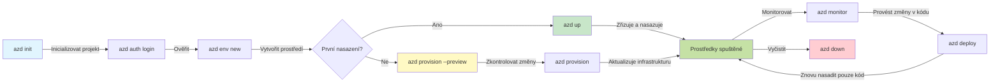
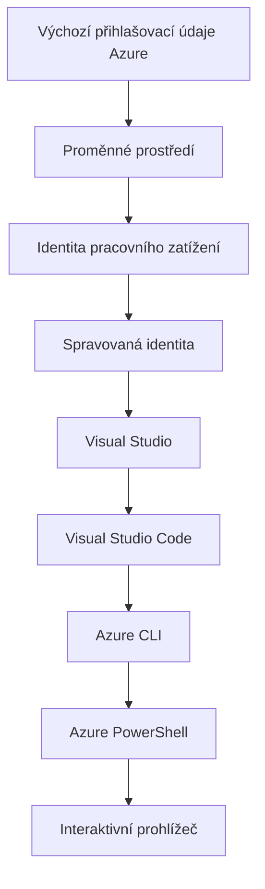

# AZD Základy - Pochopení Azure Developer CLI

# AZD Základy - Jádrové koncepty a základy

**Orientace v kapitole:**
- **📚 Domov kurzu**: [AZD pro začátečníky](../../README.md)
- **📖 Aktuální kapitola**: Kapitola 1 - Základy a rychlý start
- **⬅️ Předchozí**: [Přehled kurzu](../../README.md#-chapter-1-foundation--quick-start)
- **➡️ Další**: [Instalace a nastavení](installation.md)
- **🚀 Další kapitola**: [Kapitola 2: Vývoj orientovaný na AI](../chapter-02-ai-development/microsoft-foundry-integration.md)

## Úvod

Tato lekce vás seznámí s Azure Developer CLI (azd), výkonným nástrojem příkazového řádku, který urychluje vaši cestu od lokálního vývoje k nasazení v Azure. Naučíte se základní koncepty, hlavní funkce a pochopíte, jak azd zjednodušuje nasazování cloud-nativních aplikací.

## Výukové cíle

Na konci této lekce budete:
- Rozumět tomu, co Azure Developer CLI je a jaký je jeho hlavní účel
- Naučit se základní koncepty šablon, prostředí a služeb
- Prozkoumat klíčové funkce včetně vývoje řízeného šablonami a Infrastructure as Code
- Pochopit strukturu projektu azd a pracovní postup
- Být připraveni nainstalovat a nakonfigurovat azd pro vaše vývojové prostředí

## Výsledky učení

Po dokončení této lekce budete schopni:
- Vysvětlit roli azd v moderních cloudových pracovních postupech
- Identifikovat komponenty struktury projektu azd
- Popsat, jak šablony, prostředí a služby spolupracují
- Pochopit přínosy Infrastructure as Code s azd
- Rozpoznat různé příkazy azd a jejich účely

## Co je Azure Developer CLI (azd)?

Azure Developer CLI (azd) je nástroj příkazového řádku navržený k urychlení vaší cesty od lokálního vývoje k nasazení v Azure. Zjednodušuje proces vytváření, nasazení a správy cloud-nativních aplikací v Azure.

### Co můžete nasadit pomocí azd?

azd podporuje široké spektrum pracovních zátěží—a seznam se neustále rozrůstá. Dnes můžete pomocí azd nasadit:

| Typ pracovního zatížení | Příklady | Stejný pracovní postup? |
|------------------------|----------|-------------------------|
| **Tradiční aplikace** | Webové aplikace, REST API, statické stránky | ✅ `azd up` |
| **Služby a mikroservisy** | Container Apps, Function Apps, backendy s více službami | ✅ `azd up` |
| **Aplikace s podporou AI** | Chatovací aplikace s Microsoft Foundry modely, RAG řešení s AI Search | ✅ `azd up` |
| **Inteligentní agenti** | Agenti hostovaní ve Foundry, orchestrace s více agenty | ✅ `azd up` |

Klíčové poznání je, že **životní cyklus azd zůstává stejný bez ohledu na to, co nasazujete**. Inicializujete projekt, zřídíte infrastrukturu, nasadíte svůj kód, sledujete aplikaci a provedete úklid—ať už jde o jednoduchý web nebo sofistikovaného AI agenta.

Tato kontinuita je záměrná. azd vnímá AI schopnosti jako další druh služby, kterou může vaše aplikace používat, nikoli jako něco zásadně odlišného. Chatovací endpoint poháněný Microsoft Foundry modely je z pohledu azd jen další služba, kterou je třeba nakonfigurovat a nasadit.

### 🎯 Proč používat AZD? Porovnání z praxe

Pojďme porovnat nasazení jednoduché webové aplikace s databází:

#### ❌ BEZ AZD: Manuální nasazení v Azure (30+ minut)

```bash
# Krok 1: Vytvořit skupinu prostředků
az group create --name myapp-rg --location eastus

# Krok 2: Vytvořit App Service Plan
az appservice plan create --name myapp-plan \
  --resource-group myapp-rg \
  --sku B1 --is-linux

# Krok 3: Vytvořit Web App
az webapp create --name myapp-web-unique123 \
  --resource-group myapp-rg \
  --plan myapp-plan \
  --runtime "NODE:18-lts"

# Krok 4: Vytvořit účet Cosmos DB (10-15 minut)
az cosmosdb create --name myapp-cosmos-unique123 \
  --resource-group myapp-rg \
  --kind MongoDB

# Krok 5: Vytvořit databázi
az cosmosdb mongodb database create \
  --account-name myapp-cosmos-unique123 \
  --resource-group myapp-rg \
  --name tododb

# Krok 6: Vytvořit kolekci
az cosmosdb mongodb collection create \
  --account-name myapp-cosmos-unique123 \
  --resource-group myapp-rg \
  --database-name tododb \
  --name todos

# Krok 7: Získat řetězec připojení
CONN_STR=$(az cosmosdb keys list \
  --name myapp-cosmos-unique123 \
  --resource-group myapp-rg \
  --type connection-strings \
  --query "connectionStrings[0].connectionString" -o tsv)

# Krok 8: Nakonfigurovat nastavení aplikace
az webapp config appsettings set \
  --name myapp-web-unique123 \
  --resource-group myapp-rg \
  --settings MONGODB_URI="$CONN_STR"

# Krok 9: Povolit logování
az webapp log config --name myapp-web-unique123 \
  --resource-group myapp-rg \
  --application-logging filesystem \
  --detailed-error-messages true

# Krok 10: Nastavit Application Insights
az monitor app-insights component create \
  --app myapp-insights \
  --location eastus \
  --resource-group myapp-rg

# Krok 11: Propojit App Insights s Web App
INSTRUMENTATION_KEY=$(az monitor app-insights component show \
  --app myapp-insights \
  --resource-group myapp-rg \
  --query "instrumentationKey" -o tsv)

az webapp config appsettings set \
  --name myapp-web-unique123 \
  --resource-group myapp-rg \
  --settings APPINSIGHTS_INSTRUMENTATIONKEY="$INSTRUMENTATION_KEY"

# Krok 12: Sestavit aplikaci lokálně
npm install
npm run build

# Krok 13: Vytvořit balík nasazení
zip -r app.zip . -x "*.git*" "node_modules/*"

# Krok 14: Nasadit aplikaci
az webapp deployment source config-zip \
  --resource-group myapp-rg \
  --name myapp-web-unique123 \
  --src app.zip

# Krok 15: Počkejte a modlete se, ať to funguje 🙏
# (Žádné automatické ověřování, vyžaduje se manuální testování)
```

**Problémy:**
- ❌ 15+ příkazů k zapamatování a spuštění ve správném pořadí
- ❌ 30-45 minut ruční práce
- ❌ Snadné udělat chyby (překlepy, špatné parametry)
- ❌ Připojovací řetězce zobrazené v historii terminálu
- ❌ Žádné automatické vrácení změn při selhání
- ❌ Těžké replikovat pro členy týmu
- ❌ Pokaždé jiné (nereprodukovatelné)

#### ✅ S AZD: Automatizované nasazení (5 příkazů, 10-15 minut)

```bash
# Krok 1: Inicializovat ze šablony
azd init --template todo-nodejs-mongo

# Krok 2: Autentizovat
azd auth login

# Krok 3: Vytvořit prostředí
azd env new dev

# Krok 4: Prohlédnout změny (volitelně, ale doporučeno)
azd provision --preview

# Krok 5: Nasadit vše
azd up

# ✨ Hotovo! Vše je nasazeno, nakonfigurováno a monitorováno
```

**Výhody:**
- ✅ **5 příkazů** vs. 15+ ručních kroků
- ✅ **10-15 minut** celkem (většinou čekání na Azure)
- ✅ **Méně ručních chyb** - konzistentní, na šablonách založený pracovní postup
- ✅ **Bezpečné zpracování tajemství** - mnoho šablon používá úložiště tajemství spravované Azure
- ✅ **Opakovatelné nasazení** - stejný pracovní postup pokaždé
- ✅ **Plně reprodukovatelné** - stejný výsledek pokaždé
- ✅ **Připravené pro tým** - kdokoli může nasadit stejnými příkazy
- ✅ **Infrastruktura jako kód** - šablony Bicep pod verzovací kontrolou
- ✅ **Vestavěné monitorování** - Application Insights nakonfigurován automaticky

### 📊 Redukce času a chyb

| Metrika | Manuální nasazení | Nasazení pomocí AZD | Zlepšení |
|:--------|:------------------|:--------------------|:---------|
| **Příkazy** | 15+ | 5 | o 67 % méně |
| **Čas** | 30-45 min | 10-15 min | o 60 % rychlejší |
| **Míra chyb** | ~40% | <5% | o 88 % méně |
| **Konzistence** | Nízká (manuální) | 100% (automatizované) | Perfektní |
| **Zaškolení týmu** | 2-4 hodiny | 30 minut | o 75 % rychlejší |
| **Čas na obnovení** | 30+ min (manuální) | 2 min (automatizované) | o 93 % rychlejší |

## Základní koncepty

### Šablony
Šablony jsou základem azd. Obsahují:
- **Kód aplikace** - Váš zdrojový kód a závislosti
- **Definice infrastruktury** - Azure zdroje definované v Bicep nebo Terraform
- **Konfigurační soubory** - Nastavení a proměnné prostředí
- **Skripty nasazení** - Automatizované pracovní postupy nasazení

### Prostředí
Prostředí představují různé cíle nasazení:
- **Vývoj** - Pro testování a vývoj
- **Staging** - Předprodukční prostředí
- **Production** - Živé produkční prostředí

Každé prostředí má vlastní:
- Skupinu prostředků Azure
- Konfigurační nastavení
- Stav nasazení

### Služby
Služby jsou stavebními kameny vaší aplikace:
- **Frontend** - Webové aplikace, SPAs
- **Backend** - API, mikroservisy
- **Databáze** - Řešení pro ukládání dat
- **Úložiště** - Souborové a blobové úložiště

## Klíčové funkce

### 1. Vývoj řízený šablonami
```bash
# Procházet dostupné šablony
azd template list

# Inicializovat z šablony
azd init --template <template-name>
```

### 2. Infrastruktura jako kód
- **Bicep** - doménově specifický jazyk Azure
- **Terraform** - nástroj pro multi-cloud infrastrukturu
- **ARM Templates** - šablony Azure Resource Manager

### 3. Integrované pracovní postupy
```bash
# Kompletní pracovní postup nasazení
azd up            # Provision + Deploy — toto je bezobslužné pro počáteční nastavení

# 🧪 NOVÉ: Náhled změn infrastruktury před nasazením (BEZPEČNÉ)
azd provision --preview    # Simulovat nasazení infrastruktury bez provádění změn

azd provision     # Vytvořit prostředky Azure — pokud aktualizujete infrastrukturu, použijte toto
azd deploy        # Nasadit kód aplikace nebo znovu nasadit kód aplikace po aktualizaci
azd down          # Vyčistit prostředky
```

#### 🛡️ Bezpečné plánování infrastruktury s náhledem
Příkaz `azd provision --preview` mění hru pro bezpečná nasazení:
- **Analýza bez provedení** - Ukazuje, co bude vytvořeno, upraveno nebo smazáno
- **Žádné riziko** - Skutečné změny v Azure se neprovádějí
- **Týmová spolupráce** - Sdílejte výsledky náhledu před nasazením
- **Odhad nákladů** - Pochopte náklady na zdroje před závazkem

```bash
# Ukázkový náhled pracovního postupu
azd provision --preview           # Podívejte se, co se změní
# Zkontrolujte výstup, prodiskutujte ho s týmem
azd provision                     # Proveďte změny s jistotou
```

### 📊 Vizualizace: AZD vývojový pracovní postup



**Vysvětlení pracovního postupu:**
1. **Init** - Začněte se šablonou nebo novým projektem
2. **Auth** - Autentizujte se v Azure
3. **Environment** - Vytvořte izolované nasazovací prostředí
4. **Preview** - 🆕 Vždy nejdříve prohlédněte změny infrastruktury (bezpečná praxe)
5. **Provision** - Vytvořte/aktualizujte zdroje Azure
6. **Deploy** - Nahrajte kód aplikace
7. **Monitor** - Sledujte výkon aplikace
8. **Iterate** - Proveďte změny a znovu nasaďte kód
9. **Cleanup** - Odstraňte zdroje po dokončení

### 4. Správa prostředí
```bash
# Vytváření a správa prostředí
azd env new <environment-name>
azd env select <environment-name>
azd env list
```

### 5. Rozšíření a AI příkazy

azd používá systém rozšíření k přidání schopností nad rámec jádra CLI. To je obzvlášť užitečné pro AI pracovní zatížení:

```bash
# Vypsat dostupná rozšíření
azd extension list

# Nainstalovat rozšíření Foundry agents
azd extension install azure.ai.agents

# Inicializovat projekt AI agenta z manifestu
azd ai agent init -m agent-manifest.yaml

# Otestovat nasazeného agenta (zobrazuje latenci a čas do prvního bajtu)
azd ai agent invoke

# Spustit MCP server pro vývoj asistovaný AI (Alpha)
azd mcp start
```

**The agent lifecycle, end to end.** Jakmile nainstalujete `azure.ai.agents`, jediný pracovní postup vás zavede od nápadu k běžícímu, monitorovanému agentovi. Na den jedna nepotřebujete vše—stačí vědět, že to existuje:

| Fáze | Příkaz | Co to dělá |
|------|--------|-----------|
| **Scaffold** | `azd ai agent init -m <manifest>` | Vygeneruje projekt agenta z manifestu |
| **Test** | `azd ai agent invoke` | Vyvolejte agenta a sledujte čas odpovědi |
| **Measure** | `azd ai agent eval generate` | Vytvoří evaluační dataset pro agenta |
| **Improve** | `azd ai agent optimize` | Optimalizuje instrukce agenta na základě vašich dat |
| **Inspect** | `azd ai agent endpoint show` | Zobrazí konfiguraci živého endpointu |
| **Clean up** | `azd ai agent delete` | Smaže hostovaného agenta a všechny jeho verze |

> Rozšíření jsou podrobně pokryta v [Kapitola 2: Vývoj orientovaný na AI](../chapter-02-ai-development/agents.md) a referenci [AZD AI CLI příkazy](../chapter-08-production/production-ai-practices.md#azd-ai-cli-commands-and-extensions).

## 📁 Struktura projektu

Typická struktura projektu azd:
```
my-app/
├── .azd/                    # azd configuration
│   └── config.json
├── .azure/                  # Azure deployment artifacts
├── .devcontainer/          # Development container config
├── .github/workflows/      # GitHub Actions
├── .vscode/               # VS Code settings
├── infra/                 # Infrastructure code
│   ├── main.bicep        # Main infrastructure template
│   ├── main.parameters.json
│   └── modules/          # Reusable modules
├── src/                  # Application source code
│   ├── api/             # Backend services
│   └── web/             # Frontend application
├── azure.yaml           # azd project configuration
└── README.md
```

## 🔧 Konfigurační soubory

### azure.yaml
Hlavní konfigurační soubor projektu:
```yaml
name: my-awesome-app
metadata:
  template: my-template@1.0.0

services:
  web:
    project: ./src/web
    language: js
    host: appservice
  api:
    project: ./src/api
    language: js
    host: appservice

hooks:
  preprovision:
    shell: pwsh
    run: echo "Preparing to provision..."
```

### .azure/config.json
Konfigurace specifická pro prostředí:
```json
{
  "version": 1,
  "defaultEnvironment": "dev",
  "environments": {
    "dev": {
      "subscriptionId": "your-subscription-id",
      "location": "eastus"
    }
  }
}
```

## 🎪 Běžné pracovní postupy s praktickými cvičeními

> **💡 Tip pro učení:** Projděte tato cvičení v pořadí, abyste postupně vybudovali své dovednosti v AZD.

### 🎯 Cvičení 1: Inicializujte svůj první projekt

**Cíl:** Vytvořte projekt AZD a prozkoumejte jeho strukturu

**Kroky:**
```bash
# Použijte osvědčenou šablonu
azd init --template todo-nodejs-mongo

# Prozkoumejte vygenerované soubory
ls -la  # Zobrazit všechny soubory včetně skrytých

# Vytvořené klíčové soubory:
# - azure.yaml (hlavní konfigurace)
# - infra/ (kód infrastruktury)
# - src/ (kód aplikace)
```

**✅ Úspěch:** Máte soubor azure.yaml a adresáře infra/ a src/

---

### 🎯 Cvičení 2: Nasadit na Azure

**Cíl:** Dokončit end-to-end nasazení

**Kroky:**
```bash
# 1. Ověřit
az login && azd auth login

# 2. Vytvořit prostředí
azd env new dev
azd env set AZURE_LOCATION eastus

# 3. Náhled změn (DOPORUČENO)
azd provision --preview

# 4. Nasadit vše
azd up

# 5. Ověřit nasazení
azd show    # Zobrazit URL vaší aplikace
```

**Odhadovaný čas:** 10-15 minut  
**✅ Úspěch:** URL aplikace se otevře v prohlížeči

---

### 🎯 Cvičení 3: Více prostředí

**Cíl:** Nasadit do dev a staging

**Kroky:**
```bash
# Už máte dev, vytvořte staging
azd env new staging
azd env set AZURE_LOCATION westus2
azd up

# Přepínejte mezi nimi
azd env list
azd env select dev
```

**✅ Úspěch:** Dvě oddělené skupiny prostředků v Azure Portalu

---

### 🛡️ Čistý start: `azd down --force --purge`

Když potřebujete kompletně resetovat:

```bash
azd down --force --purge
```

**Co to dělá:**
- `--force`: Žádné potvrzovací výzvy
- `--purge`: Maže celý lokální stav a zdroje v Azure

**Použijte když:**
- Nasazení selhalo uprostřed
- Přepínáte projekty
- Potřebujete čistý začátek

---

## 🎪 Původní referenční pracovní postup

### Zahájení nového projektu
```bash
# Metoda 1: Použít existující šablonu
azd init --template todo-nodejs-mongo

# Metoda 2: Začít od nuly
azd init

# Metoda 3: Použít aktuální adresář
azd init .
```

### Vývojový cyklus
```bash
# Nastavit vývojové prostředí
azd auth login
azd env new dev
azd env select dev

# Nasadit vše
azd up

# Provést změny a znovu nasadit
azd deploy

# Vyčistit po dokončení
azd down --force --purge # příkaz v Azure Developer CLI je kompletní reset vašeho prostředí — obzvlášť užitečný, když řešíte neúspěšná nasazení, odstraňujete osiřelé zdroje nebo připravujete prostředí pro nové nasazení.
```

## Pochopení `azd down --force --purge`
Příkaz `azd down --force --purge` je silný způsob, jak kompletně rozebrat vaše azd prostředí a všechny související zdroje. Zde je rozpis, co každý příznak dělá:
```
--force
```
- Přeskočí potvrzovací výzvy.
- Užitečné pro automatizaci nebo skriptování tam, kde není možné manuální zadání.
- Zajišťuje, že demontáž proběhne bez přerušení, i když CLI zaznamená nesrovnalosti.

```
--purge
```
Maže **veškeré související metadata**, včetně:
Stav prostředí
Lokální složka `.azure`
Cacheované informace o nasazení
Zabraňuje, aby si azd "pamatovalo" předchozí nasazení, což může způsobit problémy jako nesoulad skupin prostředků nebo zastaralé reference registru.


### Proč používat oboje?
Když narazíte na problém s `azd up` kvůli zbytkovému stavu nebo částečným nasazením, tato kombinace zajistí **čistý start**.

Je obzvlášť užitečná po ručním smazání zdrojů v Azure portálu nebo při změně šablon, prostředí nebo konvencí pojmenování skupin prostředků.


### Správa více prostředí
```bash
# Vytvořit stagingové prostředí
azd env new staging
azd env select staging
azd up

# Přepnout zpět na vývoj
azd env select dev

# Porovnat prostředí
azd env list
```

## 🔐 Autentizace a přihlašovací údaje

Pochopení autentizace je zásadní pro úspěšná nasazení pomocí azd. Azure používá více metod autentizace a azd využívá stejný řetězec přihlašovacích údajů, jaký používají i jiné nástroje Azure.

### Autentizace pomocí Azure CLI (`az login`)

Před použitím azd se musíte autentizovat v Azure. Nejčastější metoda je použití Azure CLI:

```bash
# Interaktivní přihlášení (otevře se prohlížeč)
az login

# Přihlášení ke konkrétnímu tenantu
az login --tenant <tenant-id>

# Přihlášení pomocí služebního účtu
az login --service-principal -u <app-id> -p <password> --tenant <tenant-id>

# Zkontrolovat aktuální stav přihlášení
az account show

# Vypsat dostupná předplatná
az account list --output table

# Nastavit výchozí předplatné
az account set --subscription <subscription-id>
```

### Průběh autentizace
1. **Interactive Login**: Otevře váš výchozí prohlížeč pro autentizaci
2. **Device Code Flow**: Pro prostředí bez přístupu k prohlížeči
3. **Service Principal**: Pro automatizaci a scénáře CI/CD
4. **Managed Identity**: Pro aplikace hostované v Azure

### Řetězec DefaultAzureCredential

`DefaultAzureCredential` je typ přihlašovacích údajů, který poskytuje zjednodušenou zkušenost s autentizací tím, že automaticky zkouší více zdrojů přihlašovacích údajů v konkrétním pořadí:

#### Pořadí v řetězci přihlašovacích údajů


#### 1. Proměnné prostředí
```bash
# Nastavte proměnné prostředí pro služební identitu
export AZURE_CLIENT_ID="<app-id>"
export AZURE_CLIENT_SECRET="<password>"
export AZURE_TENANT_ID="<tenant-id>"
```

#### 2. Workload Identity (Kubernetes/GitHub Actions)
Používá se automaticky v:
- Azure Kubernetes Service (AKS) s Workload Identity
- GitHub Actions s OIDC federací
- Jiné scénáře federované identity

#### 3. Managed Identity
Pro Azure zdroje jako:
- Virtuální stroje
- App Service
- Azure Functions
- Container Instances

```bash
# Zkontrolovat, zda běží na prostředku Azure s řízenou identitou
az account show --query "user.type" --output tsv
# Vrací: "servicePrincipal" pokud používá řízenou identitu
```

#### 4. Integrace s vývojovými nástroji
- **Visual Studio**: Automaticky používá přihlášený účet
- **VS Code**: Používá přihlašovací údaje rozšíření Azure Account
- **Azure CLI**: Používá přihlašovací údaje z `az login` (nejběžnější pro lokální vývoj)

### Nastavení autentizace AZD

```bash
# Metoda 1: Použijte Azure CLI (doporučeno pro vývoj)
az login
azd auth login  # Používá stávající přihlašovací údaje Azure CLI

# Metoda 2: Přímé ověření pomocí azd
azd auth login --use-device-code  # Pro bezhlavá prostředí

# Metoda 3: Zkontrolujte stav ověření
azd auth login --check-status

# Metoda 4: Odhlaste se a znovu se přihlaste
azd auth logout
azd auth login
```

### Nejlepší postupy pro autentizaci

#### Pro lokální vývoj
```bash
# 1. Přihlaste se pomocí Azure CLI
az login

# 2. Ověřte správné předplatné
az account show
az account set --subscription "Your Subscription Name"

# 3. Použijte azd s existujícími přihlašovacími údaji
azd auth login
```

#### Pro CI/CD pipeline
```yaml
# GitHub Actions example
- name: Azure Login
  uses: azure/login@v1
  with:
    creds: ${{ secrets.AZURE_CREDENTIALS }}

- name: Deploy with azd
  run: |
    azd auth login --client-id ${{ secrets.AZURE_CLIENT_ID }} \
                    --client-secret ${{ secrets.AZURE_CLIENT_SECRET }} \
                    --tenant-id ${{ secrets.AZURE_TENANT_ID }}
    azd up --no-prompt
```

#### Pro produkční prostředí
- Používejte **Managed Identity** při spouštění na Azure prostředcích
- Používejte **Service Principal** pro automatizační scénáře
- Vyhněte se ukládání přihlašovacích údajů do kódu nebo konfiguračních souborů
- Používejte **Azure Key Vault** pro citlivou konfiguraci

### Běžné problémy s ověřováním a řešení

#### Issue: "No subscription found"
```bash
# Řešení: Nastavte výchozí předplatné
az account list --output table
az account set --subscription "<subscription-id>"
azd env set AZURE_SUBSCRIPTION_ID "<subscription-id>"
```

#### Issue: "Insufficient permissions"
```bash
# Řešení: Zkontrolujte a přiřaďte požadované role
az role assignment list --assignee $(az account show --query user.name --output tsv)

# Běžné požadované role:
# - Contributor (pro správu prostředků)
# - User Access Administrator (pro přiřazování rolí)
```

#### Issue: "Token expired"
```bash
# Řešení: znovu se ověřte
az logout
az login
azd auth logout
azd auth login
```

### Ověřování v různých scénářích

#### Lokální vývoj
```bash
# Účet pro osobní rozvoj
az login
azd auth login
```

#### Týmový vývoj
```bash
# Použijte konkrétního tenanta pro organizaci
az login --tenant contoso.onmicrosoft.com
azd auth login
```

#### Scénáře s více nájemci
```bash
# Přepnout mezi nájemci
az login --tenant tenant1.onmicrosoft.com
# Nasadit pro nájemce 1
azd up

az login --tenant tenant2.onmicrosoft.com  
# Nasadit pro nájemce 2
azd up
```

### Bezpečnostní úvahy

1. **Ukládání přihlašovacích údajů**: Nikdy neukládejte přihlašovací údaje ve zdrojovém kódu
2. **Omezení oprávnění**: Používejte princip nejmenších privilegií pro service principaly
3. **Rotace tokenů**: Pravidelně rotujte tajemství service principalů
4. **Auditní záznam**: Sledujte aktivity ověřování a nasazování
5. **Síťová bezpečnost**: Používejte privátní koncové body, kdykoli je to možné

### Řešení problémů s ověřováním

```bash
# Ladit problémy s autentizací
azd auth login --check-status
az account show
az account get-access-token

# Běžné diagnostické příkazy
whoami                          # Kontext aktuálního uživatele
az ad signed-in-user show      # Podrobnosti uživatele Microsoft Entra ID
az group list                  # Ověřit přístup k prostředku
```

## Porozumění `azd down --force --purge`

### Objevování
```bash
azd template list              # Procházet šablony
azd template show <template>   # Detaily šablony
azd init --help               # Možnosti inicializace
```

### Správa projektu
```bash
azd show                     # Přehled projektu
azd env list                # Dostupná prostředí a zvolené výchozí prostředí
azd config show            # Konfigurační nastavení
```

### Monitorování
```bash
azd monitor                  # Otevřít monitorování v portálu Azure
azd monitor --logs           # Zobrazit protokoly aplikace
azd monitor --live           # Zobrazit živé metriky
azd pipeline config          # Nastavit CI/CD
```

## Nejlepší postupy

### 1. Používejte smysluplné názvy
```bash
# Dobré
azd env new production-east
azd init --template web-app-secure

# Vyhnout se
azd env new env1
azd init --template template1
```

### 2. Využívejte šablony
- Začněte s existujícími šablonami
- Přizpůsobte je svým potřebám
- Vytvořte znovupoužitelné šablony pro vaši organizaci

### 3. Izolace prostředí
- Používejte oddělená prostředí pro dev/staging/prod
- Nikdy neprovádějte nasazení přímo do produkce z lokálního stroje
- Používejte CI/CD pipeline pro nasazování do produkce

### 4. Správa konfigurace
- Používejte proměnné prostředí pro citlivá data
- Udržujte konfiguraci ve verzovacím systému
- Dokumentujte nastavení specifická pro prostředí

## Postup učení

### Začátečník (1.–2. týden)
1. Nainstalovat azd a autentizovat se
2. Nasadit jednoduchou šablonu
3. Pochopit strukturu projektu
4. Naučit se základní příkazy (up, down, deploy)

### Středně pokročilý (3.–4. týden)
1. Přizpůsobit šablony
2. Spravovat více prostředí
3. Pochopit infrastrukturu jako kód
4. Nastavit CI/CD pipeline

### Pokročilý (5. týden+)
1. Vytvořit vlastní šablony
2. Pokročilé vzory infrastruktury
3. Nasazování do více regionů
4. Konfigurace na podnikové úrovni

## Další kroky

**📖 Pokračujte v učení kapitoly 1:**
- [Instalace a nastavení](installation.md) - Nainstalujte a nakonfigurujte azd
- [Váš první projekt](first-project.md) - Dokončete praktický návod
- [Průvodce konfigurací](configuration.md) - Pokročilé možnosti konfigurace

**🎯 Připraveno na další kapitolu?**
- [Kapitola 2: Vývoj orientovaný na AI](../chapter-02-ai-development/microsoft-foundry-integration.md) - Začněte vytvářet AI aplikace

## Další zdroje

- [Přehled Azure Developer CLI](https://learn.microsoft.com/en-us/azure/developer/azure-developer-cli/)
- [Galerie šablon](https://azure.github.io/awesome-azd/)
- [Ukázky komunity](https://github.com/Azure-Samples)

---

## 🙋 Nejčastější dotazy

### Obecné otázky

**Otázka: Jaký je rozdíl mezi AZD a Azure CLI?**

Odpověď: Azure CLI (`az`) slouží ke správě jednotlivých Azure prostředků. AZD (`azd`) slouží ke správě celých aplikací:

```bash
# Azure CLI - správa zdrojů na nízké úrovni
az webapp create --name myapp --resource-group rg
az sql server create --name myserver --resource-group rg
# ...je potřeba mnoho dalších příkazů

# AZD - správa na úrovni aplikace
azd up  # Nasadí celou aplikaci se všemi zdroji
```

**Přemýšlejte o tom takto:**
- `az` = Práce s jednotlivými Lego kostkami
- `azd` = Práce s kompletními sadami Lega

---

**Otázka: Potřebuji znát Bicep nebo Terraform pro použití AZD?**

Odpověď: Ne! Začněte se šablonami:
```bash
# Použijte existující šablonu - nejsou potřeba znalosti IaC
azd init --template todo-nodejs-mongo
azd up
```

Bicep se můžete naučit později pro přizpůsobení infrastruktury. Šablony poskytují funkční příklady, ze kterých se můžete učit.

---

**Otázka: Kolik stojí provoz AZD šablon?**

Odpověď: Náklady se liší podle šablony. Většina vývojových šablon stojí 50–150 $/měsíc:

```bash
# Náhled nákladů před nasazením
azd provision --preview

# Vždy uklízejte, když to nepoužíváte
azd down --force --purge  # Odstraňuje všechny zdroje
```

**Tip:** Využijte bezplatné tarify, kde jsou k dispozici:
- App Service: F1 (Free) tier
- Microsoft Foundry Models: Azure OpenAI 50,000 tokens/month free
- Cosmos DB: 1000 RU/s free tier

---

**Otázka: Mohu používat AZD s existujícími Azure prostředky?**

Odpověď: Ano, ale je snazší začít od nuly. AZD funguje nejlépe, když spravuje celý životní cyklus. Pro existující prostředky:

```bash
# Možnost 1: Importovat existující zdroje (pro pokročilé)
azd init
# Poté upravte infra/, aby odkazovala na existující zdroje

# Možnost 2: Začněte znovu (doporučeno)
azd init --template matching-your-stack
azd up  # Vytvoří nové prostředí
```

---

**Otázka: Jak sdílet projekt s kolegy?**

Odpověď: Commitujte AZD projekt do Gitu (ale NE složku .azure):

```bash
# Už je ve .gitignore ve výchozím nastavení
.azure/        # Obsahuje citlivé údaje a informace o prostředí
*.env          # Proměnné prostředí

# Členové týmu pak:
git clone <your-repo>
azd auth login
azd env new <their-name>-dev
azd up
```

Všichni dostanou identickou infrastrukturu ze stejných šablon.

---

### Otázky k řešení problémů

**Otázka: 'azd up' selhalo uprostřed. Co mám dělat?**

Odpověď: Zkontrolujte chybu, opravte ji a zkuste to znovu:

```bash
# Zobrazit podrobné protokoly
azd show

# Časté opravy:

# 1. Pokud je kvóta překročena:
azd env set AZURE_LOCATION "westus2"  # Zkuste jiný region

# 2. Pokud je konflikt názvu zdroje:
azd down --force --purge  # Vyčistit prostředí
azd up  # Zkuste znovu

# 3. Pokud vypršela autentizace:
az login
azd auth login
azd up
```

**Nejčastější problém:** Bylo vybráno špatné předplatné Azure
```bash
az account list --output table
az account set --subscription "<correct-subscription>"
```

---

**Otázka: Jak nasadit jen změny v kódu bez reprovisioningu?**

Odpověď: Použijte `azd deploy` místo `azd up`:

```bash
azd up          # Poprvé: zprovoznění + nasazení (pomalé)

# Proveďte změny v kódu...

azd deploy      # Následně: pouze nasazení (rychlé)
```

Porovnání rychlosti:
- `azd up`: 10–15 minut (vytváří infrastrukturu)
- `azd deploy`: 2–5 minut (pouze kód)

---

**Otázka: Mohu přizpůsobit šablony infrastruktury?**

Odpověď: Ano! Upravte Bicep soubory v `infra/`:

```bash
# Po příkazu azd init
cd infra/
code main.bicep  # Upravit ve VS Code

# Náhled změn
azd provision --preview

# Použít změny
azd provision
```

**Tip:** Začněte zvolna - nejprve změňte SKU:
```bicep
// infra/main.bicep
sku: {
  name: 'B1'  // Change to 'P1V2' for production
}
```

---

**Otázka: Jak odstraním vše, co AZD vytvořilo?**

Odpověď: Jeden příkaz odstraní všechny zdroje:

```bash
azd down --force --purge

# To smaže:
# - Všechny prostředky Azure
# - Skupina prostředků
# - Stav lokálního prostředí
# - Mezipaměť dat nasazení
```

**Vždy spusťte toto, když:**
- Dokončili jste testování šablony
- Přecházíte na jiný projekt
- Chcete začít znovu

**Úspora nákladů:** Odstranění nepoužívaných zdrojů = $0 poplatků

---

**Otázka: Co když jsem omylem smazal zdroje v Azure Portal?**

Odpověď: Stav AZD se může dostat do nesouladu. Přístup: začít od nuly:
```bash
# 1. Odstranit lokální stav
azd down --force --purge

# 2. Začít znovu
azd up

# Alternative: Nechte AZD detekovat a opravit
azd provision  # Vytvoří chybějící prostředky
```

---

### Pokročilé otázky

**Otázka: Mohu používat AZD v CI/CD pipeline?**

Odpověď: Ano! Příklad GitHub Actions:

```yaml
# .github/workflows/deploy.yml
name: Deploy with AZD

on:
  push:
    branches: [main]

jobs:
  deploy:
    runs-on: ubuntu-latest
    steps:
      - uses: actions/checkout@v2
      
      - name: Install azd
        run: curl -fsSL https://aka.ms/install-azd.sh | bash
      
      - name: Azure Login
        run: |
          azd auth login \
            --client-id ${{ secrets.AZURE_CLIENT_ID }} \
            --client-secret ${{ secrets.AZURE_CLIENT_SECRET }} \
            --tenant-id ${{ secrets.AZURE_TENANT_ID }}
      
      - name: Deploy
        run: azd up --no-prompt
```

---

**Otázka: Jak pracovat s tajemstvími a citlivými daty?**

Odpověď: AZD se automaticky integruje s Azure Key Vault:

```bash
# Tajemství jsou uložena v Key Vault, ne v kódu
azd env set DATABASE_PASSWORD "$(openssl rand -base64 32)"

# AZD automaticky:
# 1. Vytvoří Key Vault
# 2. Uloží tajemství
# 3. Udělí aplikaci přístup prostřednictvím spravované identity
# 4. Vloží za běhu
```

**Nikdy necommitujte:**
- `.azure/` složka (obsahuje data o prostředí)
- `.env` soubory (lokální tajemství)
- Connection strings

---

**Otázka: Mohu nasadit do více regionů?**

Odpověď: Ano, vytvořte prostředí pro každý region:

```bash
# Prostředí východních USA
azd env new prod-eastus
azd env set AZURE_LOCATION eastus
azd up

# Prostředí západní Evropy
azd env new prod-westeurope
azd env set AZURE_LOCATION westeurope
azd up

# Každé prostředí je nezávislé
azd env list
```

Pro skutečné multi-region aplikace upravte Bicep šablony tak, aby nasazovaly do více regionů současně.

---

**Otázka: Kde mohu získat pomoc, pokud uvíznu?**

1. **Dokumentace AZD:** https://learn.microsoft.com/azure/developer/azure-developer-cli/
2. **GitHub Issues:** https://github.com/Azure/azure-dev/issues
3. **Discord:** [Azure Discord](https://discord.gg/microsoft-azure) - kanál #azure-developer-cli
4. **Stack Overflow:** Tag `azure-developer-cli`
5. **Tento kurz:** [Průvodce řešením problémů](../chapter-07-troubleshooting/common-issues.md)

**Tip:** Před dotazem spusťte:
```bash
azd show       # Zobrazuje aktuální stav
azd version    # Zobrazuje vaši verzi
```
Uveďte tyto informace ve své otázce pro rychlejší pomoc.

---

## 🎓 Co dál?

Nyní rozumíte základům AZD. Vyberte si svou cestu:

### 🎯 Pro začátečníky:
1. **Další:** [Instalace a nastavení](installation.md) - Nainstalujte AZD do svého počítače
2. **Poté:** [Váš první projekt](first-project.md) - Nasadíte svou první aplikaci
3. **Cvičení:** Dokončete všechna 3 cvičení v této lekci

### 🚀 Pro AI vývojáře:
1. **Přeskočit na:** [Kapitola 2: Vývoj orientovaný na AI](../chapter-02-ai-development/microsoft-foundry-integration.md)
2. **Nasazení:** Začněte s `azd init --template get-started-with-ai-chat`
3. **Učte se:** Budujte během nasazování

### 🏗️ Pro zkušené vývojáře:
1. **Prohlédnout:** [Průvodce konfigurací](configuration.md) - Pokročilá nastavení
2. **Prozkoumejte:** [Infrastructure as Code](../chapter-04-infrastructure/provisioning.md) - Podrobný náhled do Bicepu
3. **Vytvářejte:** Vytvořte vlastní šablony pro svůj stack

---

**Navigace kapitol:**
- **📚 Domov kurzu**: [AZD pro začátečníky](../../README.md)
- **📖 Aktuální kapitola**: Kapitola 1 - Základy a rychlý start  
- **⬅️ Předchozí**: [Přehled kurzu](../../README.md#-chapter-1-foundation--quick-start)
- **➡️ Další**: [Instalace a nastavení](installation.md)
- **🚀 Další kapitola**: [Kapitola 2: Vývoj orientovaný na AI](../chapter-02-ai-development/microsoft-foundry-integration.md)

---

<!-- CO-OP TRANSLATOR DISCLAIMER START -->
**Prohlášení o omezení odpovědnosti**:
Tento dokument byl přeložen pomocí AI překladatelské služby [Co-op Translator](https://github.com/Azure/co-op-translator). Přestože usilujeme o co největší přesnost, mějte prosím na paměti, že automatizované překlady mohou obsahovat chyby nebo nepřesnosti. Originální dokument v jeho mateřském jazyce by měl být považován za autoritativní zdroj. Pro kritické informace se doporučuje profesionální lidský překlad. Nejsme odpovědní za jakékoli nedorozumění nebo nesprávné interpretace vzniklé použitím tohoto překladu.
<!-- CO-OP TRANSLATOR DISCLAIMER END -->