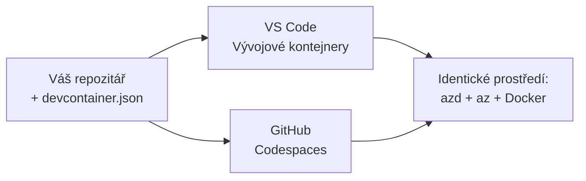

# Dev Containers & GitHub Codespaces for azd

**Chapter Navigation:**
- **📚 Domov kurzu**: [AZD pro začátečníky](../../README.md)
- **📖 Aktuální kapitola**: Kapitola 1 - Základy & Rychlý start
- **⬅️ Předchozí**: [Použijte vlastní aplikaci](bring-your-own-app.md)
- **🚀 Další kapitola**: [Kapitola 2: Vývoj orientovaný na AI](../chapter-02-ai-development/README.md)

> Ověřeno proti `azd 1.25.6` v červnu 2026.

## Introduction

Instalovat azd, správné runtime pro jazyk, Docker a Azure CLI na každém počítači je otrava — a je to hlavní důvod, proč tutoriál, který „funguje na mém počítači“, selže u někoho jiného. Dev kontejner (dev container) to vyřeší tím, že popíše celý váš nástrojový řetězec v jednom souboru. Každý, kdo otevře projekt ve VS Code nebo GitHub Codespaces, dostane přesně stejné prostředí s předinstalovaným azd. Tato lekce vám ukáže, jak ho přidat.

## Learning Goals

Na konci této lekce budete:
- Rozumět tomu, co je dev kontejner a proč pomáhá s azd
- Přidat minimální `.devcontainer/devcontainer.json` do projektu
- Zahrnout azd, Azure CLI a Docker pomocí funkcí Dev Container (*features*)
- Otevřít projekt v GitHub Codespaces nebo VS Code

## Learning Outcomes

Po dokončení této lekce budete umět:
- Vytvořit `devcontainer.json` pro projekt s azd
- Přidat azd a Azure nástroje bez ručních instalací
- Spustit `azd up` uvnitř kontejneru nebo Codespace

---

## What Is a Dev Container?

Dev kontejner je Docker-em založené vývojové prostředí definované souborem `.devcontainer/devcontainer.json` ve vašem repozitáři. Když otevřete projekt:

- **VS Code** (s rozšířením Dev Containers) sestaví kontejner a připojí se k němu.
- **GitHub Codespaces** sestaví ten samý kontejner v cloudu a poskytne editor v prohlížeči.

V obou případech každý přispěvatel dostane identické nástroje — žádné „nainstaloval jsi azd?“ řešení problémů.



---

## Step 1: Create the devcontainer File

Vytvořte `.devcontainer/devcontainer.json` v kořeni vašeho projektu:

```json
{
  "name": "azd-project",
  "image": "mcr.microsoft.com/devcontainers/base:bookworm",
  "features": {
    "ghcr.io/devcontainers/features/azure-cli:1": {},
    "ghcr.io/azure/azure-dev/azd:latest": {},
    "ghcr.io/devcontainers/features/docker-in-docker:2": {},
    "ghcr.io/devcontainers/features/node:1": {}
  },
  "customizations": {
    "vscode": {
      "extensions": [
        "ms-azuretools.azure-dev",
        "ms-azuretools.vscode-bicep"
      ]
    }
  },
  "forwardPorts": [3000],
  "postCreateCommand": "azd version"
}
```

Co která část dělá:

| Key | Purpose |
|-----|---------|
| `image` | Základní OS pro kontejner |
| `features` | Předpřipravené instalátory—zde: Azure CLI, **azd**, Docker a Node.js |
| `customizations.vscode.extensions` | Automaticky nainstaluje rozšíření azd a Bicep pro VS Code |
| `forwardPorts` | Zpřístupní port vaší aplikace v prohlížeči |
| `postCreateCommand` | Spustí se jednou po vytvoření kontejneru (zde, kontrola) |

> Funkce `ghcr.io/azure/azure-dev/azd:latest` je oficiální způsob, jak získat azd v kontejneru. Určete konkrétní verzi (např. `azd:1.25.6`), pokud potřebujete reprodukovatelnost.

---

## Step 2: Match the Feature to Your App's Language

Vyměňte funkci `node` za tu, kterou vaše aplikace používá:

```jsonc
// Python project
"ghcr.io/devcontainers/features/python:1": {},

// .NET project
"ghcr.io/devcontainers/features/dotnet:2": {},

// Java project
"ghcr.io/devcontainers/features/java:1": {},

// Go project
"ghcr.io/devcontainers/features/go:1": {}
```

Ponechte `docker-in-docker`, pokud je váš `host` `containerapp`, `aks` nebo cokoli, co sestavuje obraz kontejneru — azd potřebuje Docker k sestavení a odeslání image.

---

## Step 3: Open It

**In VS Code:**
1. Nainstalujte rozšíření **Dev Containers**.
2. Otevřete složku projektu.
3. Po zobrazení výzvy klikněte na **Reopen in Container** (nebo spusťte *Dev Containers: Reopen in Container*).

**In GitHub Codespaces:**
1. Pushněte repo na GitHub.
2. Klikněte **Code → Codespaces → Create codespace on main**.
3. Počkejte na sestavení kontejneru — azd je připravený v terminálu.

---

## Step 4: Deploy From Inside the Container

Kontejner má azd předinstalovaný, takže běžný workflow prostě funguje:

```bash
azd auth login --use-device-code   # kód zařízení je užitečný uvnitř Codespaces
azd up
```

> **Proč `--use-device-code`?** Ve vzdáleném kontejneru nebo Codespace není lokální prohlížeč, na který by se přesměrovalo, takže přihlášení pomocí device-code je spolehlivá cesta. K dokončení přihlášení vložíte kód do záložky v prohlížeči.

---

## Common Pitfalls

| Pitfall | Fix |
|---------|-----|
| `azd up` can't build an image | Přidejte funkci `docker-in-docker` |
| Browser login hangs in Codespaces | Použijte `azd auth login --use-device-code` |
| Tools differ between teammates | Zafixujte verze funkcí (např. `azd:1.25.6`) |
| App not reachable in browser | Přidejte port do `forwardPorts` |

---

## Summary

- Dev kontejner činí váš azd nástrojový řetězec reprodukovatelným pro každého.
- Přidejte azd, Azure CLI a Docker přes Dev Container *features*.
- Přizpůsobte jazykovou funkci vaší aplikaci a ponechte `docker-in-docker` pro hosty kontejnerů.
- Při běhu v Codespaces použijte přihlášení pomocí device-code.

---

## 🔗 Navigation

| Direction | Resource |
|-----------|----------|
| **Previous** | [Použijte vlastní aplikaci](bring-your-own-app.md) |
| **Chapter Home** | [Kapitola 1: Základy & Rychlý start](README.md) |
| **Next Chapter** | [Kapitola 2: Vývoj orientovaný na AI](../chapter-02-ai-development/README.md) |

## 📖 Related Resources

- [Instalace a nastavení](installation.md)
- [Přehled příkazů](../../resources/cheat-sheet.md)
- [Oficiální specifikace Dev Containers](https://containers.dev/)
- [Funkce Dev Containeru pro azd](https://github.com/Azure/azure-dev/tree/main/ext/devcontainer)

---

<!-- CO-OP TRANSLATOR DISCLAIMER START -->
**Prohlášení o omezení odpovědnosti**:
Tento dokument byl přeložen pomocí AI překladatelské služby [Co-op Translator](https://github.com/Azure/co-op-translator). Přestože usilujeme o co největší přesnost, mějte prosím na paměti, že automatizované překlady mohou obsahovat chyby nebo nepřesnosti. Originální dokument v jeho mateřském jazyce by měl být považován za autoritativní zdroj. Pro kritické informace se doporučuje profesionální lidský překlad. Nejsme odpovědní za jakékoli nedorozumění nebo nesprávné interpretace vzniklé použitím tohoto překladu.
<!-- CO-OP TRANSLATOR DISCLAIMER END -->