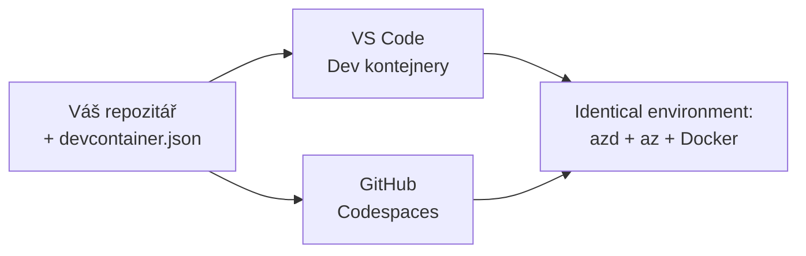

# Vývojové kontejnery & GitHub Codespaces pro azd

**Navigace Kapitoly:**
- **📚 Domů do kurzu**: [AZD pro začátečníky](../../README.md)
- **📖 Aktuální kapitola**: Kapitola 1 - Základy a rychlý start
- **⬅️ Předchozí**: [Přineste vlastní aplikaci](bring-your-own-app.md)
- **🚀 Další kapitola**: [Kapitola 2: Vývoj se zaměřením na AI](../chapter-02-ai-development/README.md)

> Ověřeno s `azd 1.27.1` v červenci 2026.

## Úvod

Instalace azd, správného runtime jazyka, Dockeru a Azure CLI na každý počítač je práce navíc – a je to hlavní důvod, proč tutoriál, který "funguje na mém počítači", selže u někoho jiného. **Vývojový kontejner** to řeší tím, že veškerý váš nástrojový řetězec popíše v jednom souboru. Každý, kdo otevře projekt ve VS Code nebo GitHub Codespaces, dostane přesně stejné prostředí s již nainstalovaným azd. Tato lekce vám ukáže, jak takový kontejner přidat.

## Cíle učení

Na konci této lekce:
- Pochopíte, co je vývojový kontejner a proč pomáhá s azd
- Přidáte minimální `.devcontainer/devcontainer.json` do projektu
- Zahrnete azd, Azure CLI a Docker přes Dev Container *features*
- Otevřete projekt v GitHub Codespaces nebo VS Code

## Výsledky učení

Po dokončení této lekce budete schopni:
- Vytvořit `devcontainer.json` pro projekt s azd
- Přidat azd a Azure nástroje bez ruční instalace
- Spustit `azd up` uvnitř kontejneru nebo Codespace

---

## Co je vývojový kontejner?

Vývojový kontejner je vývojové prostředí založené na Dockeru definované souborem `.devcontainer/devcontainer.json` ve vašem repozitáři. Když otevřete projekt:

- **VS Code** (s rozšířením Dev Containers) vytvoří kontejner a připojí se k němu.
- **GitHub Codespaces** vytvoří stejný kontejner v cloudu a nabídne vám editor v prohlížeči.

V obou případech má každý přispěvatel stejné nástroje – žádné problémové dotazy typu "nainstaloval jsi azd?".



---

## Krok 1: Vytvořte soubor devcontainer

Vytvořte `.devcontainer/devcontainer.json` v kořeni vašeho projektu:

```json
{
  "name": "azd-project",
  "image": "mcr.microsoft.com/devcontainers/base:bookworm",
  "features": {
    "ghcr.io/devcontainers/features/azure-cli:1": {},
    "ghcr.io/azure/azure-dev/azd:latest": {},
    "ghcr.io/devcontainers/features/docker-in-docker:2": {},
    "ghcr.io/devcontainers/features/node:1": {}
  },
  "customizations": {
    "vscode": {
      "extensions": [
        "ms-azuretools.azure-dev",
        "ms-azuretools.vscode-bicep"
      ]
    }
  },
  "forwardPorts": [3000],
  "postCreateCommand": "azd version"
}
```

Co která část dělá:

| Klíč | Účel |
|-----|--------|
| `image` | Základní OS pro kontejner |
| `features` | Předpřipravené instalátory — zde: Azure CLI, **azd**, Docker a Node.js |
| `customizations.vscode.extensions` | Automatická instalace rozšíření azd a Bicep pro VS Code |
| `forwardPorts` | Otevře port vaší aplikace v prohlížeči |
| `postCreateCommand` | Spustí se jednou po vytvoření kontejneru (zde kontrola funkčnosti) |

> Feature `ghcr.io/azure/azure-dev/azd:latest` je oficiální způsob, jak získat azd v kontejneru. Pokud potřebujete opakovatelnost, uzamkněte konkrétní verzi (například `azd:1.27.1`).

---

## Krok 2: Přizpůsobte feature podle jazyka vaší aplikace

Vyměňte feature `node` za ten, který váš projekt používá:

```jsonc
// Python project
"ghcr.io/devcontainers/features/python:1": {},

// .NET project
"ghcr.io/devcontainers/features/dotnet:2": {},

// Java project
"ghcr.io/devcontainers/features/java:1": {},

// Go project
"ghcr.io/devcontainers/features/go:1": {}
```

Zachovejte `docker-in-docker`, pokud je váš `host` `containerapp`, `aks` nebo cokoli, co vytváří kontejnerový image — azd potřebuje Docker k sestavení a pushování image.

---

## Krok 3: Otevřete kontejner

**Ve VS Code:**
1. Nainstalujte rozšíření **Dev Containers**.
2. Otevřete složku projektu.
3. Klikněte na **Reopen in Container** při výzvě (nebo spusťte *Dev Containers: Reopen in Container*).

**V GitHub Codespaces:**
1. Pushněte repozitář na GitHub.
2. Klikněte na **Code → Codespaces → Create codespace on main**.
3. Počkejte, než se kontejner sestaví – azd je připravený v terminálu.

---

## Krok 4: Nasazení z kontejneru

Kontejner má předinstalovaný azd, takže běžný pracovní postup funguje:

```bash
azd auth login --use-device-code   # kód zařízení je užitečný uvnitř Codespaces
azd up
```

> **Proč `--use-device-code`?** V vzdáleném kontejneru nebo Codespace není lokální prohlížeč pro přesměrování, proto je přihlašování pomocí device kodu spolehlivou cestou. Zadáte kód do okna prohlížeče pro dokončení přihlášení.

---

## Běžné problémy

| Problém | Řešení |
|---------|---------|
| `azd up` nemůže sestavit image | Přidejte feature `docker-in-docker` |
| Přihlašování v Codespaces se zasekává | Použijte `azd auth login --use-device-code` |
| Nástroje se liší mezi kolegy | Uzamkněte verze feature (např. `azd:1.27.1`) |
| Aplikaci nelze v prohlížeči dosáhnout | Přidejte port do `forwardPorts` |

---

## Shrnutí

- Vývojový kontejner dělá vaši azd sadu nástrojů opakovatelnou pro všechny.
- Přidejte azd, Azure CLI a Docker přes Dev Container *features*.
- Přizpůsobte feature podle jazyka vaší aplikace a zachovejte `docker-in-docker` pro hostitele kontejnerů.
- Použijte přihlášení přes device-code při běhu v Codespaces.

---

## 🔗 Navigace

| Směr | Zdroj |
|-------|---------|
| **Předchozí** | [Přineste vlastní aplikaci](bring-your-own-app.md) |
| **Domů v kapitole** | [Kapitola 1: Základy a rychlý start](README.md) |
| **Další kapitola** | [Kapitola 2: Vývoj se zaměřením na AI](../chapter-02-ai-development/README.md) |

## 📖 Související zdroje

- [Instalace a nastavení](installation.md)
- [Rychlá nápověda příkazů](../../resources/cheat-sheet.md)
- [Oficiální specifikace Dev Containers](https://containers.dev/)
- [azd Dev Container feature](https://github.com/Azure/azure-dev/tree/main/ext/devcontainer)

---

<!-- CO-OP TRANSLATOR DISCLAIMER START -->
**Prohlášení o omezení odpovědnosti**:
Tento dokument byl přeložen pomocí AI překladatelské služby [Co-op Translator](https://github.com/Azure/co-op-translator). Přestože usilujeme o co největší přesnost, mějte prosím na paměti, že automatizované překlady mohou obsahovat chyby nebo nepřesnosti. Originální dokument v jeho mateřském jazyce by měl být považován za autoritativní zdroj. Pro kritické informace se doporučuje profesionální lidský překlad. Nejsme odpovědní za jakékoli nedorozumění nebo nesprávné interpretace vzniklé použitím tohoto překladu.
<!-- CO-OP TRANSLATOR DISCLAIMER END -->