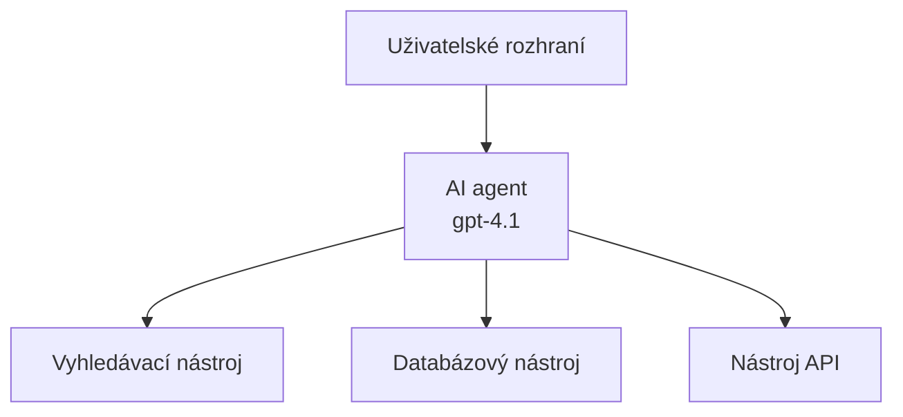
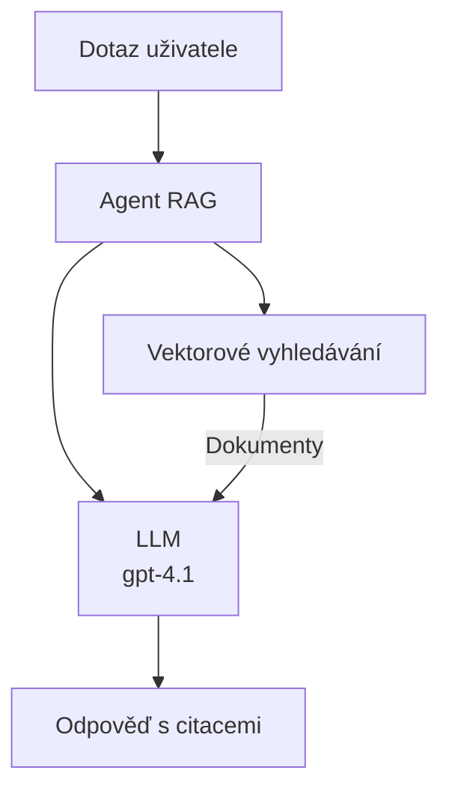
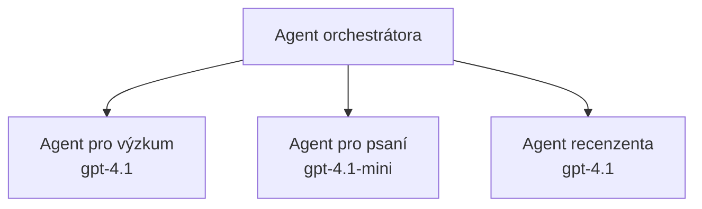

# AI Agenti s Azure Developer CLI

**Navigace kapitoly:**
- **📚 Domov kurzu**: [AZD pro začátečníky](../../README.md)
- **📖 Aktuální kapitola**: Kapitola 2 - AI-prioritní vývoj
- **⬅️ Předchozí**: [Integrace Microsoft Foundry](microsoft-foundry-integration.md)
- **➡️ Další**: [Nasazení AI modelu](ai-model-deployment.md)
- **🚀 Pokročilé**: [Řešení pro více agentů](../../examples/retail-scenario.md)

---

## Úvod

AI agenti jsou autonomní programy, které dokáží vnímat své prostředí, činit rozhodnutí a provádět akce za účelem dosažení konkrétních cílů. Na rozdíl od jednoduchých chatbotů, které odpovídají na dotazy, agenti mohou:

- **Používat nástroje** - Volat API, prohledávat databáze, spouštět kód
- **Plánovat a uvažovat** - Rozdělit složité úkoly na kroky
- **Učit se z kontextu** - Udržovat paměť a přizpůsobovat chování
- **Spolupracovat** - Pracovat s jinými agenty (systémy s více agenty)

Tento průvodce vám ukáže, jak nasadit AI agenty do Azure pomocí Azure Developer CLI (azd).

> **Poznámka ověření (2026-03-25):** Tento průvodce byl přezkoumán proti `azd` `1.23.12` a `azure.ai.agents` `0.1.18-preview`. Zkušenost s `azd ai` je stále v preview, takže zkontrolujte nápovědu rozšíření, pokud se vaše nainstalované příznaky liší.

## Cíle učení

Po dokončení tohoto průvodce budete:
- Rozumět, co jsou AI agenti a čím se liší od chatbotů
- Nasadit předpřipravené šablony AI agentů pomocí AZD
- Nakonfigurovat Foundry Agenty pro vlastní agenty
- Implementovat základní vzory agentů (používání nástrojů, RAG, multi-agent)
- Monitorovat a ladit nasazené agenty

## Výsledky učení

Po dokončení budete schopni:
- Nasadit AI agentní aplikace do Azure jedním příkazem
- Konfigurovat nástroje a schopnosti agentů
- Implementovat retrieval-augmented generation (RAG) s agenty
- Navrhovat architektury s více agenty pro složité pracovní toky
- Řešit běžné problémy při nasazování agentů

---

## 🤖 Co odlišuje agenta od chatbota?

| Funkce | Chatbot | AI agent |
|--------|---------|----------|
| **Chování** | Odpovídá na výzvy | Podniká autonomní akce |
| **Nástroje** | Žádné | Může volat API, vyhledávat, spouštět kód |
| **Paměť** | Pouze v relaci | Trvalá paměť mezi relacemi |
| **Plánování** | Jedna odpověď | Vícekrokové uvažování |
| **Spolupráce** | Jednotný subjekt | Může spolupracovat s jinými agenty |

### Jednoduchá analogie

- **Chatbot** = Užitečná osoba odpovídající na dotazy na informačním pultu
- **AI agent** = Osobní asistent, který dokáže zavolat, objednat schůzky a dokončit úkoly za vás

---

## 🚀 Rychlý start: Nasazení vašeho prvního agenta

### Možnost 1: Šablona Foundry Agents (Doporučeno)

```bash
# Inicializovat šablonu AI agentů
azd init --template get-started-with-ai-agents

# Nasadit na Azure
azd up
```

**Co se nasadí:**
- ✅ Foundry Agents
- ✅ Microsoft Foundry Models (gpt-4.1)
- ✅ Azure AI Search (pro RAG)
- ✅ Azure Container Apps (webové rozhraní)
- ✅ Application Insights (monitorování)

**Doba:** ~15-20 minut
**Cena:** ~$100-150/měsíc (vývoj)

### Možnost 2: OpenAI Agent s Prompty

```bash
# Inicializovat šablonu agenta založeného na Prompty
azd init --template agent-openai-python-prompty

# Nasadit do Azure
azd up
```

**Co se nasadí:**
- ✅ Azure Functions (serverless vykonávání agenta)
- ✅ Microsoft Foundry Models
- ✅ Konfigurační soubory Prompty
- ✅ Vzorová implementace agenta

**Doba:** ~10-15 minut
**Cena:** ~$50-100/měsíc (vývoj)

### Možnost 3: RAG Chat Agent

```bash
# Inicializovat šablonu chatu RAG
azd init --template azure-search-openai-demo

# Nasadit do Azure
azd up
```

**Co se nasadí:**
- ✅ Microsoft Foundry Models
- ✅ Azure AI Search se vzorovými daty
- ✅ Pipeline pro zpracování dokumentů
- ✅ Chat rozhraní s citacemi

**Doba:** ~15-25 minut
**Cena:** ~$80-150/měsíc (vývoj)

### Možnost 4: AZD AI Agent Init (Náhled založený na manifestu nebo šabloně)

Pokud máte soubor s manifestem agenta, můžete použít příkaz `azd ai` k vytvoření projektu Foundry Agent Service přímo. Nedávné preview verze také přidaly podporu inicializace založené na šablonách, takže přesný průběh výzev se může mírně lišit v závislosti na verzi rozšíření, kterou máte nainstalovanou.

```bash
# Nainstalujte rozšíření AI agentů
azd extension install azure.ai.agents

# Volitelné: ověřte nainstalovanou náhledovou verzi
azd extension show azure.ai.agents

# Inicializujte z manifestu agenta
azd ai agent init -m agent-manifest.yaml

# Nasaďte do Azure
azd up

# Otestujte nasazeného agenta (zobrazuje latenci + čas do prvního bajtu)
azd ai agent invoke
```

**Kdy použít `azd ai agent init` vs `azd init --template`:**

| Přístup | Nejvhodnější pro | Jak to funguje |
|---------|------------------|----------------|
| `azd init --template` | Začínáte z funkční ukázkové aplikace | Klonuje celý repozitář šablony s kódem + infrastrukturou |
| `azd ai agent init -m` | Stavění z vlastního manifestu agenta | Vygeneruje strukturu projektu z vašeho definovaného manifestu agenta |

> **Tip:** Použijte `azd init --template`, když se učíte (Možnosti 1–3 výše). Použijte `azd ai agent init`, když stavíte produkční agenty se svými vlastními manifesty.

Po `azd up` vás stejné rozšíření provede zbytkem životního cyklu agenta: `azd ai agent invoke` pro testování, `azd ai agent eval generate` a `azd ai agent optimize` pro měření a zlepšení kvality a `azd ai agent delete` pro vyčištění. Viz [AZD AI CLI Commands](../chapter-08-production/production-ai-practices.md#azd-ai-cli-commands-and-extensions) pro kompletní referenci.

---

## 🏗️ Vzory architektury agentů

### Vzor 1: Jediný agent s nástroji

Nejjednodušší vzor agenta - jeden agent, který může používat více nástrojů.



**Nejvhodnější pro:**
- Chatboty podpory zákazníků
- Výzkumné asistenty
- Agenty pro analýzu dat

**AZD šablona:** `azure-search-openai-demo`

### Vzor 2: RAG agent (Retrieval-Augmented Generation)

Agent, který před generováním odpovědí vyhledává relevantní dokumenty.



**Nejvhodnější pro:**
- Firemní znalostní báze
- Systémy Q&A nad dokumenty
- Soulad a právní výzkum

**AZD šablona:** `azure-search-openai-demo`

### Vzor 3: Systém s více agenty

Více specializovaných agentů pracujících společně na složitých úkolech.



**Nejvhodnější pro:**
- Složité generování obsahu
- Vícekrokové pracovní toky
- Úkoly vyžadující různou odbornost

**Další informace:** [Koordinační vzory pro více agentů](../chapter-06-pre-deployment/coordination-patterns.md)

---

## ⚙️ Konfigurace nástrojů agenta

Agenti získávají sílu, když mohou používat nástroje. Zde je návod, jak nakonfigurovat běžné nástroje:

### Konfigurace nástrojů ve Foundry Agents

```python
# agent_config.py
from azure.ai.projects import AIProjectClient
from azure.ai.projects.models import FunctionTool, CodeInterpreterTool

# Definujte vlastní nástroje
search_tool = FunctionTool(
    name="search_knowledge_base",
    description="Search the company knowledge base for relevant documents",
    parameters={
        "type": "object",
        "properties": {
            "query": {
                "type": "string",
                "description": "The search query"
            }
        },
        "required": ["query"]
    }
)

# Vytvořte agenta s nástroji
agent = project_client.agents.create_agent(
    model="gpt-4.1",
    name="Support Agent",
    instructions="You are a helpful support agent. Use the search tool to find relevant information.",
    tools=[search_tool, CodeInterpreterTool()]
)
```

### Konfigurace prostředí

```bash
# Nastavení proměnných prostředí specifických pro agenta
azd env set AZURE_OPENAI_MODEL "gpt-4.1"
azd env set AGENT_INSTRUCTIONS "You are a helpful assistant..."
azd env set ENABLE_CODE_INTERPRETER "true"
azd env set ENABLE_FILE_SEARCH "true"

# Nasazení s aktualizovanou konfigurací
azd deploy
```

---

## 📊 Monitorování agentů

### Integrace Application Insights

Všechny AZD šablony agentů zahrnují Application Insights pro monitorování:

```bash
# Otevřít monitorovací panel
azd monitor --overview

# Zobrazit živé protokoly
azd monitor --logs

# Zobrazit živé metriky
azd monitor --live
```

### Klíčové metriky k sledování

| Metrika | Popis | Cíl |
|--------|-------|-----|
| Response Latency | Čas k vygenerování odpovědi | < 5 sekund |
| Token Usage | Tokeny na požadavek | Sledujte kvůli nákladům |
| Tool Call Success Rate | % úspěšných volání nástrojů | > 95% |
| Error Rate | Selhané požadavky agenta | < 1% |
| User Satisfaction | Hodnocení uživatelů | > 4,0/5,0 |

### Vlastní protokolování pro agenty

```python
import os
from azure.monitor.opentelemetry import configure_azure_monitor
from opentelemetry import trace

# Nakonfigurujte Azure Monitor pomocí OpenTelemetry
configure_azure_monitor(
    connection_string=os.environ["APPLICATIONINSIGHTS_CONNECTION_STRING"]
)

tracer = trace.get_tracer(__name__)

def log_agent_interaction(user_query, agent_response, tools_used, latency_ms):
    with tracer.start_as_current_span("agent_interaction") as span:
        span.set_attributes({
            "user_query": user_query,
            "response_length": len(agent_response),
            "tools_used": tools_used,
            "latency_ms": latency_ms
        })
```

> **Poznámka:** Nainstalujte požadované balíčky: `pip install azure-monitor-opentelemetry opentelemetry`

---

## 💰 Úvahy o nákladech

### Odhadované měsíční náklady podle vzoru

| Vzor | Vývojové prostředí | Produkce |
|------|--------------------|----------|
| Jediný agent | $50-100 | $200-500 |
| RAG agent | $80-150 | $300-800 |
| Více agentů (2-3 agenty) | $150-300 | $500-1,500 |
| Podnikový systém více agentů | $300-500 | $1,500-5,000+ |

### Tipy pro optimalizaci nákladů

1. **Používejte gpt-4.1-mini pro jednoduché úlohy**
   ```bash
   azd env set AZURE_OPENAI_MODEL "gpt-4.1-mini"
   ```

2. **Implementujte cachování pro opakované dotazy**
   ```python
   from functools import lru_cache
   
   @lru_cache(maxsize=1000)
   def get_cached_response(query_hash):
       return agent.run(query_hash)
   ```

3. **Nastavte limity tokenů na běh**
   ```python
   # Nastavte max_completion_tokens při spuštění agenta, ne při jeho vytváření
   run = project_client.agents.create_run(
       thread_id=thread.id,
       agent_id=agent.id,
       max_completion_tokens=1000  # Omezte délku odpovědi
   )
   ```

4. **Scale to zero, když není v provozu**
   ```bash
   # Container Apps se automaticky škálují na nulu
   azd env set MIN_REPLICAS "0"
   ```

---

## 🔧 Řešení problémů s agenty

### Běžné problémy a řešení

<details>
<summary><strong>❌ Agent neodpovídá na volání nástrojů</strong></summary>

```bash
# Zkontrolujte, zda jsou nástroje správně registrovány
azd show

# Ověřte nasazení OpenAI
az cognitiveservices account deployment list \
  --name $AZURE_OPENAI_NAME \
  --resource-group $RG_NAME

# Zkontrolujte protokoly agenta
azd monitor --logs
```

**Běžné příčiny:**
- Neshoda podpisu funkce nástroje
- Chybějící požadovaná oprávnění
- API koncový bod není dostupný
</details>

<details>
<summary><strong>❌ Vysoká latence v odpovědích agenta</strong></summary>

```bash
# Zkontrolujte v Application Insights úzká místa
azd monitor --live

# Zvažte použití rychlejšího modelu
azd env set AZURE_OPENAI_MODEL "gpt-4.1-mini"
azd deploy
```

**Tipy pro optimalizaci:**
- Používejte streamované odpovědi
- Implementujte cachování odpovědí
- Zmenšete velikost kontextového okna
</details>

<details>
<summary><strong>❌ Agent vrací nesprávné nebo halucinační informace</strong></summary>

```python
# Vylepšit pomocí lepších systémových pokynů
instructions = """
You are a helpful assistant. IMPORTANT:
- Only answer based on provided context
- If you don't know, say "I don't know"
- Always cite your sources
- Never make up information
"""

# Přidat vyhledávání pro ukotvení
agent = project_client.agents.create_agent(
    model="gpt-4.1",
    instructions=instructions,
    tools=[FileSearchTool()]  # Zakotvit odpovědi v dokumentech
)
```
</details>

<details>
<summary><strong>❌ Chyby: překročen limit tokenů</strong></summary>

```python
# Implementovat správu kontextového okna
def truncate_context(messages, max_tokens=8000, model="gpt-4.1"):
    """Keep only recent messages within token limit."""
    import tiktoken
    encoding = tiktoken.encoding_for_model(model)
    total_tokens = 0
    truncated = []
    
    for msg in reversed(messages):
        msg_tokens = len(encoding.encode(msg.content))
        if total_tokens + msg_tokens > max_tokens:
            break
        truncated.insert(0, msg)
        total_tokens += msg_tokens
    
    return truncated
```
</details>

---

## 🎓 Praktická cvičení

### Cvičení 1: Nasazení základního agenta (20 minut)

**Cíl:** Nasadit svého prvního AI agenta pomocí AZD

```bash
# Krok 1: Inicializace šablony
azd init --template get-started-with-ai-agents

# Krok 2: Přihlášení do Azure
azd auth login
# Pokud pracujete napříč tenanty, přidejte --tenant-id <tenant-id>

# Krok 3: Nasazení
azd up

# Krok 4: Testování agenta
# Očekávaný výstup po nasazení:
#   Nasazení dokončeno!
#   Koncový bod: https://<app-name>.<region>.azurecontainerapps.io
# Otevřete adresu URL zobrazenou ve výstupu a zkuste položit otázku

# Krok 5: Zobrazení monitoringu
azd monitor --overview

# Krok 6: Vyčištění
azd down --force --purge
```

**Kritéria úspěchu:**
- [ ] Agent odpovídá na dotazy
- [ ] Má přístup k panelu monitorování přes `azd monitor`
- [ ] Prostředky úspěšně odstraněny

### Cvičení 2: Přidat vlastní nástroj (30 minut)

**Cíl:** Rozšířit agenta o vlastní nástroj

1. Nasadit šablonu agenta:
   ```bash
   azd init --template get-started-with-ai-agents
   azd up
   ```
2. Vytvořte novou funkci nástroje ve vašem kódu agenta:
   ```python
   def get_weather(location: str) -> str:
       """Get current weather for a location."""
       # Volání API na službu počasí
       return f"Weather in {location}: Sunny, 72°F"
   ```
3. Zaregistrujte nástroj u agenta:
   ```python
   from azure.ai.projects.models import FunctionTool

   weather_tool = FunctionTool(
       name="get_weather",
       description="Get current weather for a location",
       parameters={
           "type": "object",
           "properties": {
               "location": {"type": "string", "description": "City name"}
           },
           "required": ["location"]
       }
   )

   agent = project_client.agents.create_agent(
       model="gpt-4.1",
       name="Weather Agent",
       tools=[weather_tool]
   )
   ```
4. Znovu nasaďte a otestujte:
   ```bash
   azd deploy
   # Zeptej se: "Jaké je počasí v Seattlu?"
   # Očekává se: Agent zavolá get_weather("Seattle") a vrátí informace o počasí
   ```

**Kritéria úspěchu:**
- [ ] Agent rozpozná dotazy týkající se počasí
- [ ] Nástroj je volán správně
- [ ] Odpověď obsahuje informace o počasí

### Cvičení 3: Vytvoření RAG agenta (45 minut)

**Cíl:** Vytvořit agenta, který odpovídá na otázky z vašich dokumentů

```bash
# Krok 1: Nasadit šablonu RAG
azd init --template azure-search-openai-demo
azd up

# Krok 2: Nahrajte své dokumenty
# Umístěte soubory PDF/TXT do adresáře data/, poté spusťte:
python scripts/prepdocs.py

# Krok 3: Otestujte pomocí doménově specifických otázek
# Otevřete URL webové aplikace z výstupu příkazu azd up
# Ptejte se na své nahrané dokumenty
# Odpovědi by měly obsahovat citační odkazy, například [doc.pdf]
```

**Kritéria úspěchu:**
- [ ] Agent odpovídá z nahraných dokumentů
- [ ] Odpovědi obsahují citace
- [ ] Žádná halucinace u otázek mimo rozsah

---

## 📚 Další kroky

Nyní, když rozumíte AI agentům, prozkoumejte tyto pokročilé témata:

| Téma | Popis | Odkaz |
|------|-------|------|
| **Systémy s více agenty** | Stavění systémů s více spolupracujícími agenty | [Příklad více agentů v retailu](../../examples/retail-scenario.md) |
| **Koordinační vzory** | Naučte se orchestraci a vzory komunikace | [Koordinační vzory](../chapter-06-pre-deployment/coordination-patterns.md) |
| **Produkční nasazení** | Nasazení agentů připravené pro podnik | [Produkční AI praktiky](../chapter-08-production/production-ai-practices.md) |
| **Hodnocení agentů** | Testujte a vyhodnocujte výkon agentů | [Řešení problémů s AI](../chapter-07-troubleshooting/ai-troubleshooting.md) |
| **AI Workshop Lab** | Prakticky: Připravte své AI řešení pro AZD | [AI Workshop Lab](ai-workshop-lab.md) |

---

## 📖 Další zdroje

### Oficiální dokumentace
- [Microsoft Foundry Agent Service](https://learn.microsoft.com/azure/ai-services/agents/)
- [Microsoft Foundry Agent Service Quickstart](https://learn.microsoft.com/azure/ai-services/agents/quickstart)
- [Semantic Kernel Agent Framework](https://learn.microsoft.com/semantic-kernel/)

### Šablony AZD pro agenty
- [Get Started with AI Agents](https://github.com/Azure-Samples/get-started-with-ai-agents)
- [Agent OpenAI Python Prompty](https://github.com/Azure-Samples/agent-openai-python-prompty)
- [Azure Search OpenAI Demo](https://github.com/Azure-Samples/azure-search-openai-demo)

### Komunitní zdroje
- [Awesome AZD - Agent Templates](https://azure.github.io/awesome-azd/?tags=ai-agents)
- [Azure AI Discord](https://discord.gg/microsoft-azure)
- [Microsoft Foundry Discord](https://discord.gg/nTYy5BXMWG)

### Dovednosti agentů pro váš editor
- [**Microsoft Azure Agent Skills**](https://skills.sh/microsoft/github-copilot-for-azure) - Nainstalujte znovupoužitelné dovednosti AI agentů pro vývoj v Azure v GitHub Copilot, Cursor nebo jakémkoli podporovaném agentu. Obsahuje dovednosti pro [Azure AI](https://skills.sh/microsoft/github-copilot-for-azure/azure-ai), [Microsoft Foundry](https://skills.sh/microsoft/github-copilot-for-azure/microsoft-foundry), [nasazení](https://skills.sh/microsoft/github-copilot-for-azure/azure-deploy) a [diagnostiku](https://skills.sh/microsoft/github-copilot-for-azure/azure-diagnostics):
  ```bash
  npx skills add microsoft/github-copilot-for-azure
  ```

---

**Navigace**
- **Předchozí lekce**: [Integrace Microsoft Foundry](microsoft-foundry-integration.md)
- **Další lekce**: [Nasazení AI modelu](ai-model-deployment.md)

---

<!-- CO-OP TRANSLATOR DISCLAIMER START -->
**Prohlášení o omezení odpovědnosti**:
Tento dokument byl přeložen pomocí AI překladatelské služby [Co-op Translator](https://github.com/Azure/co-op-translator). Přestože usilujeme o co největší přesnost, mějte prosím na paměti, že automatizované překlady mohou obsahovat chyby nebo nepřesnosti. Originální dokument v jeho mateřském jazyce by měl být považován za autoritativní zdroj. Pro kritické informace se doporučuje profesionální lidský překlad. Nejsme odpovědní za jakékoli nedorozumění nebo nesprávné interpretace vzniklé použitím tohoto překladu.
<!-- CO-OP TRANSLATOR DISCLAIMER END -->