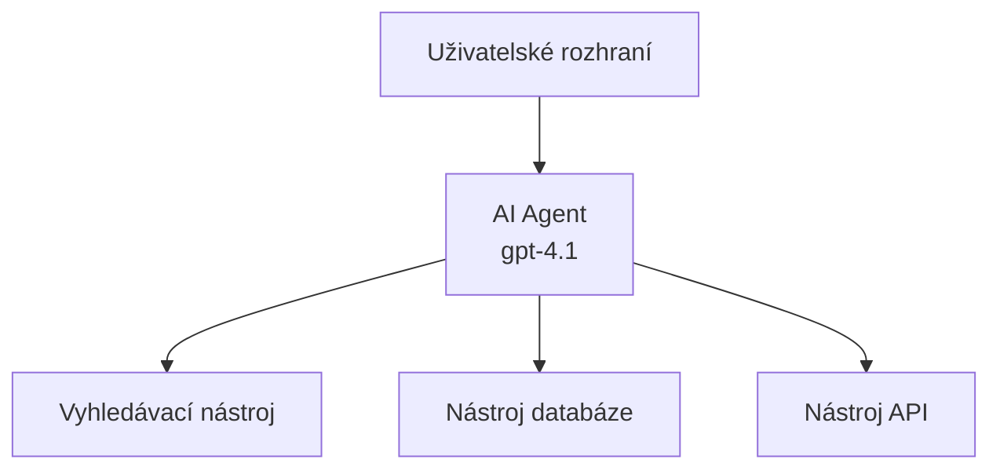
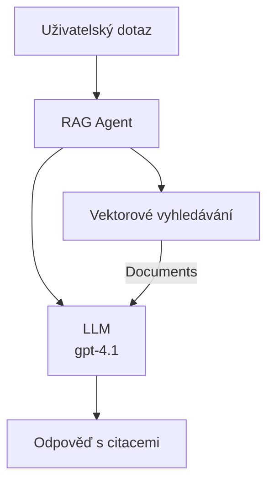
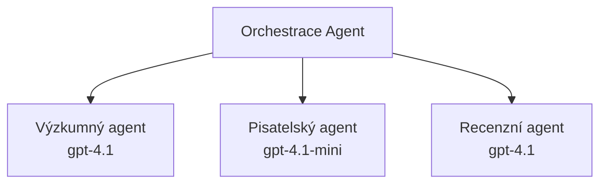

# AI agenti s Azure Developer CLI

**Navigace kapitolou:**
- **📚 Domů ke kurzu**: [AZD pro začátečníky](../../README.md)
- **📖 Aktuální kapitola**: Kapitola 2 - AI-First vývoj
- **⬅️ Předchozí**: [Integrace Microsoft Foundry](microsoft-foundry-integration.md)
- **➡️ Další**: [Nasazení AI modelu](ai-model-deployment.md)
- **🚀 Pokročilé**: [Multi-agentní řešení](../../examples/retail-scenario.md)

---

## Úvod

AI agenti jsou autonomní programy, které dokážou vnímat své prostředí, rozhodovat se a podnikat kroky k dosažení konkrétních cílů. Na rozdíl od jednoduchých chatbotů reagujících na výzvy, agenti mohou:

- **Používat nástroje** - volat API, vyhledávat v databázích, spouštět kód
- **Plánovat a uvažovat** - rozdělit složité úkoly na kroky
- **Učit se z kontextu** - udržovat paměť a přizpůsobovat chování
- **Spolupracovat** - pracovat s dalšími agenty (multi-agentní systémy)

Tento návod vám ukáže, jak nasadit AI agenty do Azure pomocí Azure Developer CLI (azd).

> **Poznámka ke kontrole (2026-07-13):** Tento návod byl ověřen proti `azd` `1.27.1` a `azure.ai.agents` `1.0.0-beta.5`. Zkušenost s `azd ai` je stále ve fázi preview, takže pokud máte jiné nainstalované příznaky, zkontrolujte pomoc rozšíření.

## Výukové cíle

Po dokončení tohoto návodu budete:
- Rozumět tomu, co jsou AI agenti a jak se liší od chatbotů
- Nasazovat připravené šablony AI agentů pomocí AZD
- Konfigurovat Foundry Agenty pro vlastní agenty
- Implementovat základní vzory agentů (použití nástrojů, RAG, multi-agentní)
- Monitorovat a debugovat nasazené agenty

## Výsledky učení

Po dokončení budete schopni:
- Nasadit aplikace AI agentů do Azure jediným příkazem
- Konfigurovat nástroje a schopnosti agentů
- Implementovat Retrieval-Augmented Generation (RAG) s agenty
- Navrhnout multi-agentní architektury pro složité pracovní postupy
- Řešit běžné problémy nasazení agentů

---

## 🤖 Čím se agent liší od chatbotu?

| Vlastnost | Chatbot | AI Agent |
|---------|---------|----------|
| **Chování** | Odpovídá na výzvy | Podniká autonomní akce |
| **Nástroje** | Žádné | Může volat API, vyhledávat, spouštět kód |
| **Paměť** | Pouze na bázi relace | Trvalá paměť mezi relacemi |
| **Plánování** | Jedna odpověď | Vícekrokové uvažování |
| **Spolupráce** | Jednotlivá entita | Může spolupracovat s ostatními agenty |

### Jednoduchá analogie

- **Chatbot** = Užitečná osoba odpovídající na otázky na informačním místě
- **AI agent** = Osobní asistent, který může volat, rezervovat schůzky a plnit úkoly za vás

---

## 🚀 Rychlý start: Nasazení prvního agenta

### Možnost 1: Šablona Foundry Agentů (doporučeno)

```bash
# Inicializovat šablonu AI agentů
azd init --template get-started-with-ai-agents

# Nasadit do Azure
azd up
```

**Co se nasadí:**
- ✅ Foundry Agenti
- ✅ Microsoft Foundry modely (gpt-4.1)
- ✅ Azure AI Search (pro RAG)
- ✅ Azure Container Apps (webové rozhraní)
- ✅ Application Insights (monitorování)

**Čas:** ~15-20 minut
**Cena:** ~$100-150/měsíc (vývoj)

### Možnost 2: OpenAI agent s Prompty

```bash
# Inicializujte šablonu agenta založenou na Prompty
azd init --template agent-openai-python-prompty

# Nasadit do Azure
azd up
```

**Co se nasadí:**
- ✅ Azure Functions (serverless spuštění agenta)
- ✅ Microsoft Foundry modely
- ✅ Konfigurační soubory Prompty
- ✅ Ukázková implementace agenta

**Čas:** ~10-15 minut
**Cena:** ~$50-100/měsíc (vývoj)

### Možnost 3: RAG chat agent

```bash
# Inicializovat šablonu chatu RAG
azd init --template azure-search-openai-demo

# Nasadit do Azure
azd up
```

**Co se nasadí:**
- ✅ Microsoft Foundry modely
- ✅ Azure AI Search s ukázkovými daty
- ✅ Pipeline zpracování dokumentů
- ✅ Chat rozhraní s citacemi

**Čas:** ~15-25 minut
**Cena:** ~$80-150/měsíc (vývoj)

### Možnost 4: AZD AI Agent Init (Preview založený na manifestu nebo šabloně)

Pokud máte soubor s manifestem agenta, můžete pomocí příkazu `azd ai` přímo vytvořit projekt Foundry Agent Služby. Nedávné preview verze přidaly také podporu inicializace založené na šablonách, takže přesný průběh se může mírně lišit podle vaší verze rozšíření.

```bash
# Nainstalujte rozšíření pro AI agenty
azd extension install azure.ai.agents

# Volitelné: ověřte nainstalovanou náhledovou verzi
azd extension show azure.ai.agents

# Inicializujte z manifestu agenta
azd ai agent init -m agent-manifest.yaml

# Nasadit do Azure
azd up

# Otestujte nasazeného agenta (zobrazuje latenci + dobu do prvního byte)
azd ai agent invoke
```

**Kdy použít `azd ai agent init` vs `azd init --template`:**

| Přístup | Nejvhodnější pro | Jak to funguje |
|----------|----------|------|
| `azd init --template` | Začínáte s funkční ukázkovou aplikací | Naklonuje kompletní repozitář šablony s kódem a infrastrukturou |
| `azd ai agent init -m` | Budujete na vlastním manifestu agenta | Vytvoří strukturu projektu podle vaší definice agenta |

> **Tip:** Používejte `azd init --template`, když se učíte (možnosti 1-3 výše). Používejte `azd ai agent init`, když vytváříte produkční agenty se svými manifesty.

Po `azd up` vás stejné rozšíření uvede do zbytku životního cyklu agenta: `azd ai agent invoke` pro testování, `azd ai agent eval generate` a `azd ai agent optimize` pro měření a zlepšování kvality a `azd ai agent delete` pro úklid. Kompletní přehled naleznete v [AZD AI CLI příkazech](../chapter-08-production/production-ai-practices.md#azd-ai-cli-commands-and-extensions).

---

## 🏗️ Vzory architektury agentů

### Vzor 1: Jednotný agent s nástroji

Nejjednodušší vzor agenta – jeden agent, který může používat více nástrojů.



**Nejlepší pro:**
- Zákaznickou podporu
- Výzkumné asistenty
- Agenty pro analýzu dat

**Šablona AZD:** `azure-search-openai-demo`

### Vzor 2: RAG agent (Retrieval-Augmented Generation)

Agent, který před generováním odpovědí vyhledává relevantní dokumenty.



**Nejlepší pro:**
- Firemní znalostní báze
- Q&A systémy nad dokumenty
- Dodržování předpisů a právní výzkum

**Šablona AZD:** `azure-search-openai-demo`

### Vzor 3: Multi-agentní systém

Více specializovaných agentů pracujících společně na složitých úkolech.



**Nejlepší pro:**
- Generování složitého obsahu
- Vícekrokové pracovní postupy
- Úkoly vyžadující různé odbornosti

**Více informací:** [Vzorová koordinace multi-agentů](../chapter-06-pre-deployment/coordination-patterns.md)

---

## ⚙️ Konfigurace nástrojů agenta

Agent se stává mocným, když může používat nástroje. Tady je návod, jak konfigurovat běžné nástroje:

### Konfigurace nástrojů ve Foundry Agentech

```python
# agent_config.py
from azure.ai.projects import AIProjectClient
from azure.ai.projects.models import FunctionTool, CodeInterpreterTool

# Definovat vlastní nástroje
search_tool = FunctionTool(
    name="search_knowledge_base",
    description="Search the company knowledge base for relevant documents",
    parameters={
        "type": "object",
        "properties": {
            "query": {
                "type": "string",
                "description": "The search query"
            }
        },
        "required": ["query"]
    }
)

# Vytvořit agenta s nástroji
agent = project_client.agents.create_agent(
    model="gpt-4.1",
    name="Support Agent",
    instructions="You are a helpful support agent. Use the search tool to find relevant information.",
    tools=[search_tool, CodeInterpreterTool()]
)
```

### Konfigurace prostředí

```bash
# Nastavte proměnné prostředí specifické pro agenta
azd env set AZURE_OPENAI_MODEL "gpt-4.1"
azd env set AGENT_INSTRUCTIONS "You are a helpful assistant..."
azd env set ENABLE_CODE_INTERPRETER "true"
azd env set ENABLE_FILE_SEARCH "true"

# Nasadit s aktualizovanou konfigurací
azd deploy
```

---

## 📊 Monitorování agentů

### Integrace Application Insights

Všechny šablony agentů AZD zahrnují Application Insights pro monitorování:

```bash
# Otevřít monitorovací panel
azd monitor --overview

# Zobrazit živé záznamy
azd monitor --logs

# Zobrazit živé metriky
azd monitor --live
```

### Klíčové metriky k sledování

| Metrika | Popis | Cíl |
|--------|-------------|--------|
| Doba odezvy | Čas na vygenerování odpovědi | < 5 sekund |
| Spotřeba tokenů | Tokeny na požadavek | Sledovat náklady |
| Úspěšnost volání nástrojů | % úspěšných volání nástrojů | > 95 % |
| Chybovost | Neúspěšné požadavky agenta | < 1 % |
| Spokojenost uživatelů | Hodnocení zpětné vazby | > 4.0/5.0 |

### Vlastní logování agentů

```python
import os
from azure.monitor.opentelemetry import configure_azure_monitor
from opentelemetry import trace

# Nakonfigurujte Azure Monitor s OpenTelemetry
configure_azure_monitor(
    connection_string=os.environ["APPLICATIONINSIGHTS_CONNECTION_STRING"]
)

tracer = trace.get_tracer(__name__)

def log_agent_interaction(user_query, agent_response, tools_used, latency_ms):
    with tracer.start_as_current_span("agent_interaction") as span:
        span.set_attributes({
            "user_query": user_query,
            "response_length": len(agent_response),
            "tools_used": tools_used,
            "latency_ms": latency_ms
        })
```

> **Poznámka:** Nainstalujte požadované balíčky: `pip install azure-monitor-opentelemetry opentelemetry`

---

## 💰 Náklady a rozpočet

### Odhadované měsíční náklady podle vzoru

| Vzor | Vývojové prostředí | Produkce |
|---------|-----------------|------------|
| Jednotný agent | 50-100 USD | 200-500 USD |
| RAG agent | 80-150 USD | 300-800 USD |
| Multi-agent (2-3 agenti) | 150-300 USD | 500-1,500 USD |
| Podnikový multi-agent | 300-500 USD | 1,500-5,000+ USD |

### Tipy na optimalizaci nákladů

1. **Používejte gpt-4.1-mini pro jednoduché úkoly**
   ```bash
   azd env set AZURE_OPENAI_MODEL "gpt-4.1-mini"
   ```

2. **Implementujte cache pro opakované dotazy**
   ```python
   from functools import lru_cache
   
   @lru_cache(maxsize=1000)
   def get_cached_response(query_hash):
       return agent.run(query_hash)
   ```

3. **Nastavte limity tokenů pro běh**
   ```python
   # Nastavte max_completion_tokens při spuštění agenta, ne během vytváření
   run = project_client.agents.create_run(
       thread_id=thread.id,
       agent_id=agent.id,
       max_completion_tokens=1000  # Omezit délku odpovědi
   )
   ```

4. **Skalujte na nulu, když se nepoužívá**
   ```bash
   # Container Apps se automaticky škálují na nulu
   azd env set MIN_REPLICAS "0"
   ```

---

## 🔧 Řešení problémů s agenty

### Běžné problémy a řešení

<details>
<summary><strong>❌ Agent nereaguje na volání nástrojů</strong></summary>

```bash
# Zkontrolujte, zda jsou nástroje správně registrovány
azd show

# Ověřte nasazení OpenAI
az cognitiveservices account deployment list \
  --name $AZURE_OPENAI_NAME \
  --resource-group $RG_NAME

# Zkontrolujte protokoly agenta
azd monitor --logs
```

**Běžné příčiny:**
- Nesoulad v podpisu funkce nástroje
- Chybějící potřebná oprávnění
- Nedostupný API endpoint
</details>

<details>
<summary><strong>❌ Vysoká latence u odpovědí agenta</strong></summary>

```bash
# Zkontrolujte Application Insights pro úzká místa
azd monitor --live

# Zvažte použití rychlejšího modelu
azd env set AZURE_OPENAI_MODEL "gpt-4.1-mini"
azd deploy
```

**Tipy na optimalizaci:**
- Používat streamované odpovědi
- Implementovat cache odpovědí
- Zmenšit velikost kontextového okna
</details>

<details>
<summary><strong>❌ Agent vrací nesprávné nebo halucinační informace</strong></summary>

```python
# Vylepšit pomocí lepších systémových výzev
instructions = """
You are a helpful assistant. IMPORTANT:
- Only answer based on provided context
- If you don't know, say "I don't know"
- Always cite your sources
- Never make up information
"""

# Přidat získávání pro uzemnění
agent = project_client.agents.create_agent(
    model="gpt-4.1",
    instructions=instructions,
    tools=[FileSearchTool()]  # Uzemnit odpovědi v dokumentech
)
```
</details>

<details>
<summary><strong>❌ Chyby překročení limitu tokenů</strong></summary>

```python
# Implementovat správu kontextového okna
def truncate_context(messages, max_tokens=8000, model="gpt-4.1"):
    """Keep only recent messages within token limit."""
    import tiktoken
    encoding = tiktoken.encoding_for_model(model)
    total_tokens = 0
    truncated = []
    
    for msg in reversed(messages):
        msg_tokens = len(encoding.encode(msg.content))
        if total_tokens + msg_tokens > max_tokens:
            break
        truncated.insert(0, msg)
        total_tokens += msg_tokens
    
    return truncated
```
</details>

---

## 🎓 Praktické cvičení

### Cvičení 1: Nasazení základního agenta (20 minut)

**Cíl:** Nasadit svého prvního AI agenta pomocí AZD

```bash
# Krok 1: Inicializace šablony
azd init --template get-started-with-ai-agents

# Krok 2: Přihlášení do Azure
azd auth login
# Pokud pracujete přes tenants, přidejte --tenant-id <tenant-id>

# Krok 3: Nasazení
azd up

# Krok 4: Testování agenta
# Očekávaný výstup po nasazení:
#   Nasazení dokončeno!
#   Koncový bod: https://<app-name>.<region>.azurecontainerapps.io
# Otevřete URL zobrazenou ve výstupu a zkuste položit otázku

# Krok 5: Zobrazení monitoringu
azd monitor --overview

# Krok 6: Úklid
azd down --force --purge
```

**Kritéria úspěchu:**
- [ ] Agent odpovídá na otázky
- [ ] Přístup k monitorovacímu panelu přes `azd monitor`
- [ ] Úspěšný úklid zdrojů

### Cvičení 2: Přidání vlastního nástroje (30 minut)

**Cíl:** Rozšířit agenta o vlastní nástroj

1. Nasadit šablonu agenta:
   ```bash
   azd init --template get-started-with-ai-agents
   azd up
   ```
2. Vytvořit novou funkci nástroje v kódu agenta:
   ```python
   def get_weather(location: str) -> str:
       """Get current weather for a location."""
       # Volání API na službu počasí
       return f"Weather in {location}: Sunny, 72°F"
   ```
3. Registrovat nástroj u agenta:
   ```python
   from azure.ai.projects.models import FunctionTool

   weather_tool = FunctionTool(
       name="get_weather",
       description="Get current weather for a location",
       parameters={
           "type": "object",
           "properties": {
               "location": {"type": "string", "description": "City name"}
           },
           "required": ["location"]
       }
   )

   agent = project_client.agents.create_agent(
       model="gpt-4.1",
       name="Weather Agent",
       tools=[weather_tool]
   )
   ```
4. Znovu nasadit a otestovat:
   ```bash
   azd deploy
   # Zeptejte se: "Jaké je počasí v Seattlu?"
   # Očekáváno: Agent zavolá get_weather("Seattle") a vrátí informace o počasí
   ```

**Kritéria úspěchu:**
- [ ] Agent rozpozná dotazy týkající se počasí
- [ ] Nástroj je správně volán
- [ ] Odpověď zahrnuje informace o počasí

### Cvičení 3: Vytvoření RAG agenta (45 minut)

**Cíl:** Vytvořit agenta, který odpovídá na otázky z vašich dokumentů

```bash
# Krok 1: Nasazení šablony RAG
azd init --template azure-search-openai-demo
azd up

# Krok 2: Nahrajte své dokumenty
# Umístěte soubory PDF/TXT do adresáře data/, poté spusťte:
python scripts/prepdocs.py

# Krok 3: Testování s dotazy specifickými pro danou oblast
# Otevřete URL webové aplikace z výstupu azd up
# Pokládejte otázky týkající se vašich nahraných dokumentů
# Odpovědi by měly obsahovat odkazy na citace jako [doc.pdf]
```

**Kritéria úspěchu:**
- [ ] Agent odpovídá z nahraných dokumentů
- [ ] Odpovědi obsahují citace
- [ ] Žádná halucinace u otázek mimo rozsah

---

## 📚 Další kroky

Nyní, když rozumíte AI agentům, prozkoumejte tyto pokročilé témata:

| Téma | Popis | Odkaz |
|-------|-------------|------|
| **Multi-agentní systémy** | Vytvářejte systémy s více spolupracujícími agenty | [Příklad multi-agenta pro retail](../../examples/retail-scenario.md) |
| **Vzorová koordinace** | Naučte se vzory orchestrace a komunikace | [Vzorová koordinace](../chapter-06-pre-deployment/coordination-patterns.md) |
| **Produkční nasazení** | Nasazení agentů připravené pro podniky | [Produkční AI postupy](../chapter-08-production/production-ai-practices.md) |
| **Hodnocení agentů** | Testování a hodnocení výkonu agentů | [Řešení problémů s AI](../chapter-07-troubleshooting/ai-troubleshooting.md) |
| **AI Workshop Lab** | Prakticky: Připravte své AI řešení pro AZD | [AI Workshop Lab](ai-workshop-lab.md) |

---

## 📖 Další zdroje

### Oficiální dokumentace
- [Microsoft Foundry Agent Service](https://learn.microsoft.com/azure/ai-services/agents/)
- [Rychlý start s Microsoft Foundry Agent Service](https://learn.microsoft.com/azure/ai-services/agents/quickstart)
- [Semantic Kernel Agent Framework](https://learn.microsoft.com/semantic-kernel/)

### AZD šablony pro agenty
- [Začněte s AI agenty](https://github.com/Azure-Samples/get-started-with-ai-agents)
- [Agent OpenAI Python Prompty](https://github.com/Azure-Samples/agent-openai-python-prompty)
- [Azure Search OpenAI Demo](https://github.com/Azure-Samples/azure-search-openai-demo)

### Komunitní zdroje
- [Awesome AZD - Agentní šablony](https://azure.github.io/awesome-azd/?tags=ai-agents)
- [Azure AI Discord](https://discord.gg/microsoft-azure)
- [Microsoft Foundry Discord](https://discord.gg/nTYy5BXMWG)

### Dovednosti agentů pro váš editor
- [**Microsoft Azure Agent Skills**](https://skills.sh/microsoft/github-copilot-for-azure) - Nainstalujte znovupoužitelné dovednosti AI agentů pro vývoj v Azure v GitHub Copilotu, Cursoru nebo jakémkoli podporovaném agentu. Obsahuje dovednosti pro [Azure AI](https://skills.sh/microsoft/github-copilot-for-azure/azure-ai), [Microsoft Foundry](https://skills.sh/microsoft/github-copilot-for-azure/microsoft-foundry), [nasazení](https://skills.sh/microsoft/github-copilot-for-azure/azure-deploy) a [diagnostiku](https://skills.sh/microsoft/github-copilot-for-azure/azure-diagnostics):
  ```bash
  npx skills add microsoft/github-copilot-for-azure
  ```

---

**Navigace**
- **Předchozí lekce**: [Integrace Microsoft Foundry](microsoft-foundry-integration.md)
- **Další lekce**: [Nasazení AI modelu](ai-model-deployment.md)

---

<!-- CO-OP TRANSLATOR DISCLAIMER START -->
**Prohlášení o omezení odpovědnosti**:
Tento dokument byl přeložen pomocí AI překladatelské služby [Co-op Translator](https://github.com/Azure/co-op-translator). Přestože usilujeme o co největší přesnost, mějte prosím na paměti, že automatizované překlady mohou obsahovat chyby nebo nepřesnosti. Originální dokument v jeho mateřském jazyce by měl být považován za autoritativní zdroj. Pro kritické informace se doporučuje profesionální lidský překlad. Nejsme odpovědní za jakékoli nedorozumění nebo nesprávné interpretace vzniklé použitím tohoto překladu.
<!-- CO-OP TRANSLATOR DISCLAIMER END -->