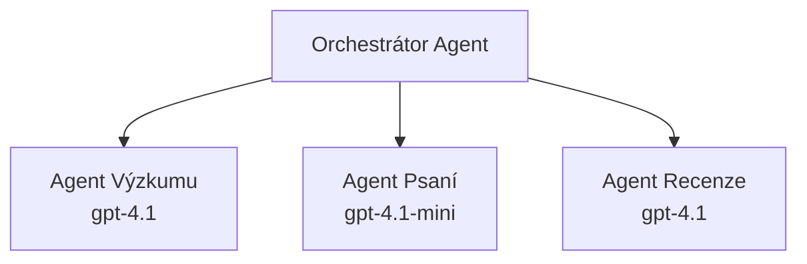

# Agenti AI s Azure Developer CLI

**Navigace kapitolou:**
- **📚 Domovská stránka kurzu**: [AZD pro začátečníky](../../README.md)
- **📖 Aktuální kapitola**: Kapitola 2 - Vývoj orientovaný na AI
- **⬅️ Předchozí**: [Integrace Microsoft Foundry](microsoft-foundry-integration.md)
- **➡️ Další**: [Nasazení AI modelu](ai-model-deployment.md)
- **🚀 Pokročilé**: [Víceagentní řešení](../../examples/retail-scenario.md)

---

## Úvod

Agenti AI jsou autonomní programy, které mohou vnímat své prostředí, rozhodovat se a podnikat kroky k dosažení specifických cílů. Na rozdíl od jednoduchých chatbotů, kteří reagují na podněty, agenti mohou:

- **Používat nástroje** - Volat API, hledat v databázích, vykonávat kód
- **Plánovat a uvažovat** - Rozdělit složité úkoly na kroky
- **Učit se z kontextu** - Udržovat paměť a přizpůsobovat chování
- **Spolupracovat** - Pracovat s jinými agenty (víceagentní systémy)

Tento průvodce vám ukáže, jak nasadit AI agenty do Azure pomocí Azure Developer CLI (azd).

> **Poznámka k validaci (2026-03-25):** Tento průvodce byl ověřen s verzemi `azd` `1.23.12` a `azure.ai.agents` `0.1.18-preview`. Zkušenost s `azd ai` je stále v režimu preview, proto zkontrolujte nápovědu rozšíření, pokud se parametry na vašem zařízení liší.

## Cíle učení

Po dokončení tohoto průvodce budete:
- Rozumět tomu, co jsou AI agenti a jak se liší od chatbotů
- Nasadit předpřipravené šablony AI agentů pomocí AZD
- Konfigurovat Foundry Agenty pro vlastní agenty
- Implementovat základní agentní vzory (použití nástrojů, RAG, víceagentní)
- Monitorovat a ladit nasazené agenty

## Výsledky učení

Po dokončení budete schopni:
- Nasadit aplikace AI agentů do Azure jediným příkazem
- Konfigurovat nástroje a schopnosti agentů
- Implementovat retrieval-augmented generation (RAG) s agenty
- Navrhovat víceagentní architektury pro složité pracovní postupy
- Řešit běžné problémy s nasazením agentů

---

## 🤖 Čím se agent liší od chatbota?

| Vlastnost | Chatbot | AI Agent |
|-----------|---------|----------|
| **Chování** | Reaguje na podněty | Provádí autonomní akce |
| **Nástroje** | Žádné | Může volat API, vyhledávat, spouštět kód |
| **Paměť** | Pouze relace | Trvalá paměť napříč relacemi |
| **Plánování** | Jednorázová odpověď | Vícekrokové uvažování |
| **Spolupráce** | Jednotlivý subjekt | Může spolupracovat s dalšími agenty |

### Jednoduchá analogie

- **Chatbot** = Pomocná osoba odpovídající na otázky na informačním stole
- **AI Agent** = Osobní asistent, který může volat, rezervovat schůzky a plnit úkoly za vás

---

## 🚀 Rychlý start: Nasazení vašeho prvního agenta

### Možnost 1: Šablona Foundry Agentů (doporučeno)

```bash
# Inicializujte šablonu AI agentů
azd init --template get-started-with-ai-agents

# Nasadit do Azure
azd up
```
  
**Co se nasadí:**  
- ✅ Foundry Agenti  
- ✅ Microsoft Foundry modely (gpt-4.1)  
- ✅ Azure AI Search (pro RAG)  
- ✅ Azure Container Apps (webové rozhraní)  
- ✅ Application Insights (monitorování)  

**Čas:** ~15-20 minut  
**Cena:** ~$100-150/měsíc (vývoj)  

### Možnost 2: OpenAI Agent s Prompty

```bash
# Inicializujte šablonu agenta založenou na Prompty
azd init --template agent-openai-python-prompty

# Nasadit do Azure
azd up
```
  
**Co se nasadí:**  
- ✅ Azure Functions (serverless spuštění agenta)  
- ✅ Microsoft Foundry modely  
- ✅ Konfigurační soubory Prompty  
- ✅ Ukázková implementace agenta  

**Čas:** ~10-15 minut  
**Cena:** ~$50-100/měsíc (vývoj)  

### Možnost 3: RAG Chat Agent

```bash
# Inicializovat šablonu RAG chatu
azd init --template azure-search-openai-demo

# Nasadit do Azure
azd up
```
  
**Co se nasadí:**  
- ✅ Microsoft Foundry modely  
- ✅ Azure AI Search s ukázkovými daty  
- ✅ Pipeline pro zpracování dokumentů  
- ✅ Chat rozhraní s citacemi  

**Čas:** ~15-25 minut  
**Cena:** ~$80-150/měsíc (vývoj)  

### Možnost 4: AZD AI Agent Init (Předběžný náhled založený na manifestu nebo šabloně)

Pokud máte manifest agenta, můžete použít příkaz `azd ai` k vytvoření projektu Foundry Agent Service přímo. Nedávné preview verze přidaly také podporu inicializace založené na šablonách, takže přesný způsob průchodu promptem se může mírně lišit v závislosti na vaší verzi rozšíření.

```bash
# Nainstalujte rozšíření pro AI agenty
azd extension install azure.ai.agents

# Volitelné: ověřte nainstalovanou náhledovou verzi
azd extension show azure.ai.agents

# Inicializujte z manifestu agenta
azd ai agent init -m agent-manifest.yaml

# Nasadit do Azure
azd up
```
  
**Kdy použít `azd ai agent init` vs `azd init --template`:**

| Přístup | Nejlepší pro | Jak funguje |
|---------|--------------|-------------|
| `azd init --template` | Začátek s funkční ukázkou | Klonuje kompletní šablonu s kódem + infrastrukturou |
| `azd ai agent init -m` | Vytváření z vlastního manifestu agenta | Vytvoří strukturu projektu z definice agenta |

> **Tip:** Používejte `azd init --template` při učení (možnosti 1-3 výše). Používejte `azd ai agent init` při tvorbě produkčních agentů s vlastními manifesty. Viz [AZD AI CLI příkazy](../chapter-08-production/production-ai-practices.md#azd-ai-cli-commands-and-extensions) pro úplnou referenci.

---

## 🏗️ Vzory architektury agentů

### Vzor 1: Jeden agent s nástroji

Nejjednodušší vzor agenta – jeden agent, který může používat více nástrojů.


**Nejlepší pro:**  
- Zákaznickou podporu  
- Výzkumné asistenty  
- Agenty pro analýzu dat  

**Šablona AZD:** `azure-search-openai-demo`

### Vzor 2: RAG Agent (Retrieval-Augmented Generation)

Agent, který před generováním odpovědí nejprve vyhledá relevantní dokumenty.


**Nejlepší pro:**  
- Podnikové znalostní báze  
- Systémy pro otázky a odpovědi s dokumenty  
- Právní a compliance výzkum  

**Šablona AZD:** `azure-search-openai-demo`

### Vzor 3: Víceagentní systém

Více specializovaných agentů spolupracujících na složitých úkolech.


**Nejlepší pro:**  
- Složité generování obsahu  
- Vícekrokové pracovní postupy  
- Úkoly vyžadující různé expertízy  

**Více informací:** [Víceagentní koordinační vzory](../chapter-06-pre-deployment/coordination-patterns.md)

---

## ⚙️ Konfigurace nástrojů agenta

Agenti jsou silní, když mohou používat nástroje. Takto nakonfigurujete běžné nástroje:

### Konfigurace nástrojů ve Foundry Agentech

```python
# agent_config.py
from azure.ai.projects import AIProjectClient
from azure.ai.projects.models import FunctionTool, CodeInterpreterTool

# Definujte vlastní nástroje
search_tool = FunctionTool(
    name="search_knowledge_base",
    description="Search the company knowledge base for relevant documents",
    parameters={
        "type": "object",
        "properties": {
            "query": {
                "type": "string",
                "description": "The search query"
            }
        },
        "required": ["query"]
    }
)

# Vytvořte agenta s nástroji
agent = project_client.agents.create_agent(
    model="gpt-4.1",
    name="Support Agent",
    instructions="You are a helpful support agent. Use the search tool to find relevant information.",
    tools=[search_tool, CodeInterpreterTool()]
)
```
  
### Konfigurace prostředí

```bash
# Nastavte proměnné prostředí specifické pro agenta
azd env set AZURE_OPENAI_MODEL "gpt-4.1"
azd env set AGENT_INSTRUCTIONS "You are a helpful assistant..."
azd env set ENABLE_CODE_INTERPRETER "true"
azd env set ENABLE_FILE_SEARCH "true"

# Nasadit s aktualizovanou konfigurací
azd deploy
```
  
---

## 📊 Monitorování agentů

### Integrace s Application Insights

Všechny AZD šablony agentů obsahují Application Insights pro monitorování:

```bash
# Otevřít monitorovací panel
azd monitor --overview

# Zobrazit živé záznamy
azd monitor --logs

# Zobrazit živé metriky
azd monitor --live
```
  
### Klíčové metriky ke sledování

| Metrika | Popis | Cíl |
|---------|-------|-----|
| Latence odpovědi | Čas generování odpovědi | < 5 sekund |
| Spotřeba tokenů | Tokeny na požadavek | Sledujte kvůli nákladům |
| Úspěšnost volání nástrojů | % úspěšných vykonání nástrojů | > 95% |
| Míra chyb | Neúspěšné požadavky agenta | < 1% |
| Spokojenost uživatelů | Hodnocení zpětné vazby | > 4.0/5.0 |

### Vlastní logování pro agenty

```python
import os
from azure.monitor.opentelemetry import configure_azure_monitor
from opentelemetry import trace

# Nakonfigurujte Azure Monitor s OpenTelemetry
configure_azure_monitor(
    connection_string=os.environ["APPLICATIONINSIGHTS_CONNECTION_STRING"]
)

tracer = trace.get_tracer(__name__)

def log_agent_interaction(user_query, agent_response, tools_used, latency_ms):
    with tracer.start_as_current_span("agent_interaction") as span:
        span.set_attributes({
            "user_query": user_query,
            "response_length": len(agent_response),
            "tools_used": tools_used,
            "latency_ms": latency_ms
        })
```
  
> **Poznámka:** Nainstalujte požadované balíčky: `pip install azure-monitor-opentelemetry opentelemetry`

---

## 💰 Náklady

### Odhadované měsíční náklady podle vzoru

| Vzor | Vývojové prostředí | Produkce |
|-------|------------------|----------|
| Jeden agent | $50-100 | $200-500 |
| RAG agent | $80-150 | $300-800 |
| Víceagentní (2-3 agenti) | $150-300 | $500-1,500 |
| Podnikový víceagentní | $300-500 | $1,500-5,000+ |

### Tipy na optimalizaci nákladů

1. **Používejte gpt-4.1-mini pro jednoduché úkoly**  
   ```bash
   azd env set AZURE_OPENAI_MODEL "gpt-4.1-mini"
   ```
  
2. **Implementujte cache pro opakované dotazy**  
   ```python
   from functools import lru_cache
   
   @lru_cache(maxsize=1000)
   def get_cached_response(query_hash):
       return agent.run(query_hash)
   ```
  
3. **Nastavte limity tokenů na běh**  
   ```python
   # Nastavte max_completion_tokens při spouštění agenta, ne během tvorby
   run = project_client.agents.create_run(
       thread_id=thread.id,
       agent_id=agent.id,
       max_completion_tokens=1000  # Omezit délku odpovědi
   )
   ```
  
4. **Škálujte na nulu, když agent není používán**  
   ```bash
   # Kontejnerové aplikace se automaticky škálují na nulu
   azd env set MIN_REPLICAS "0"
   ```
  
---

## 🔧 Řešení problémů s agenty

### Běžné problémy a řešení

<details>
<summary><strong>❌ Agent nereaguje na volání nástrojů</strong></summary>

```bash
# Zkontrolujte, zda jsou nástroje správně registrovány
azd show

# Ověřte nasazení OpenAI
az cognitiveservices account deployment list \
  --name $AZURE_OPENAI_NAME \
  --resource-group $RG_NAME

# Zkontrolujte protokoly agenta
azd monitor --logs
```
  
**Běžné příčiny:**  
- Nesoulad ve funkčním podpisu nástroje  
- Chybějící potřebná oprávnění  
- API endpoint není přístupný  
</details>

<details>
<summary><strong>❌ Vysoká latence v odezvách agenta</strong></summary>

```bash
# Zkontrolujte Application Insights kvůli úzkým místům
azd monitor --live

# Zvažte použití rychlejšího modelu
azd env set AZURE_OPENAI_MODEL "gpt-4.1-mini"
azd deploy
```
  
**Tipy na optimalizaci:**  
- Použijte streamování odpovědí  
- Implementujte cache odpovědí  
- Zmenšete velikost kontextového okna  
</details>

<details>
<summary><strong>❌ Agent vrací nesprávné nebo halucinované informace</strong></summary>

```python
# Vylepšit pomocí lepších systémových výzev
instructions = """
You are a helpful assistant. IMPORTANT:
- Only answer based on provided context
- If you don't know, say "I don't know"
- Always cite your sources
- Never make up information
"""

# Přidat vyhledávání pro zakotvení
agent = project_client.agents.create_agent(
    model="gpt-4.1",
    instructions=instructions,
    tools=[FileSearchTool()]  # Zakotvit odpovědi v dokumentech
)
```
</details>

<details>
<summary><strong>❌ Chyby překročení limitu tokenů</strong></summary>

```python
# Implementujte správu kontextového okna
def truncate_context(messages, max_tokens=8000, model="gpt-4.1"):
    """Keep only recent messages within token limit."""
    import tiktoken
    encoding = tiktoken.encoding_for_model(model)
    total_tokens = 0
    truncated = []
    
    for msg in reversed(messages):
        msg_tokens = len(encoding.encode(msg.content))
        if total_tokens + msg_tokens > max_tokens:
            break
        truncated.insert(0, msg)
        total_tokens += msg_tokens
    
    return truncated
```
</details>

---

## 🎓 Praktická cvičení

### Cvičení 1: Nasazení základního agenta (20 minut)

**Cíl:** Nasadit svého prvního AI agenta pomocí AZD

```bash
# Krok 1: Inicializujte šablonu
azd init --template get-started-with-ai-agents

# Krok 2: Přihlaste se do Azure
azd auth login
# Pokud pracujete napříč tenanty, přidejte --tenant-id <tenant-id>

# Krok 3: Nasazení
azd up

# Krok 4: Otestujte agenta
# Očekávaný výstup po nasazení:
#   Nasazení dokončeno!
#   Koncový bod: https://<app-name>.<region>.azurecontainerapps.io
# Otevřete URL zobrazenou ve výstupu a zkuste položit otázku

# Krok 5: Prohlédněte si monitorování
azd monitor --overview

# Krok 6: Úklid
azd down --force --purge
```
  
**Kritéria úspěchu:**  
- [ ] Agent odpovídá na otázky  
- [ ] Přístup k monitorovacímu dashboardu přes `azd monitor`  
- [ ] Zdroje úspěšně vyčištěny  

### Cvičení 2: Přidání vlastního nástroje (30 minut)

**Cíl:** Rozšířit agenta o vlastní nástroj

1. Nasadíte šablonu agenta:  
   ```bash
   azd init --template get-started-with-ai-agents
   azd up
   ```
  
2. Vytvoříte novou funkci nástroje v kódu agenta:  
   ```python
   def get_weather(location: str) -> str:
       """Get current weather for a location."""
       # Volání API na službu počasí
       return f"Weather in {location}: Sunny, 72°F"
   ```
  
3. Zaregistrujete nástroj u agenta:  
   ```python
   from azure.ai.projects.models import FunctionTool

   weather_tool = FunctionTool(
       name="get_weather",
       description="Get current weather for a location",
       parameters={
           "type": "object",
           "properties": {
               "location": {"type": "string", "description": "City name"}
           },
           "required": ["location"]
       }
   )

   agent = project_client.agents.create_agent(
       model="gpt-4.1",
       name="Weather Agent",
       tools=[weather_tool]
   )
   ```
  
4. Znovu nasadíte a otestujete:  
   ```bash
   azd deploy
   # Zeptej se: "Jaké je počasí v Seattlu?"
   # Očekávané: Agent zavolá get_weather("Seattle") a vrátí informace o počasí
   ```
  
**Kritéria úspěchu:**  
- [ ] Agent rozpozná dotazy týkající se počasí  
- [ ] Nástroj je správně volán  
- [ ] Odpověď obsahuje informace o počasí  

### Cvičení 3: Vytvoření RAG agenta (45 minut)

**Cíl:** Vytvořit agenta, který odpovídá na otázky z vašich dokumentů

```bash
# Krok 1: Nasadit šablonu RAG
azd init --template azure-search-openai-demo
azd up

# Krok 2: Nahrajte své dokumenty
# Umístěte soubory PDF/TXT do adresáře data/ a pak spusťte:
python scripts/prepdocs.py

# Krok 3: Testujte s otázkami specifickými pro doménu
# Otevřete URL webové aplikace z výstupu azd up
# Ptejte se na otázky týkající se vašich nahraných dokumentů
# Odpovědi by měly obsahovat odkazy na citace jako [doc.pdf]
```
  
**Kritéria úspěchu:**  
- [ ] Agent odpovídá na základě nahraných dokumentů  
- [ ] Odpovědi obsahují citace  
- [ ] Nedochází k halucinacím na otázky mimo rozsah  

---

## 📚 Další kroky

Nyní, když rozumíte agentům AI, prozkoumejte tyto pokročilé témata:

| Téma | Popis | Odkaz |
|-------|--------|-------|
| **Víceagentní systémy** | Stavba systémů s více spolupracujícími agenty | [Příklad retail víceagentního systému](../../examples/retail-scenario.md) |
| **Koordinační vzory** | Naučte se orchestraci a komunikační vzory | [Koordinační vzory](../chapter-06-pre-deployment/coordination-patterns.md) |
| **Produkční nasazení** | Nasazení agentů připravené pro produkci | [Produkční AI praktiky](../chapter-08-production/production-ai-practices.md) |
| **Hodnocení agentů** | Testování a hodnocení výkonu agenta | [Řešení problémů s AI](../chapter-07-troubleshooting/ai-troubleshooting.md) |
| **AI workshop lab** | Praktické: Připravte své AI řešení pro AZD | [AI workshop lab](ai-workshop-lab.md) |

---

## 📖 Další zdroje

### Oficiální dokumentace
- [Azure AI Agent Service](https://learn.microsoft.com/azure/ai-services/agents/)
- [Azure AI Foundry Agent Service Rychlý start](https://learn.microsoft.com/azure/ai-services/agents/quickstart)
- [Semantic Kernel Agent Framework](https://learn.microsoft.com/semantic-kernel/)

### Šablony AZD pro agenty
- [Začněte s AI agenty](https://github.com/Azure-Samples/get-started-with-ai-agents)
- [Agent OpenAI Python Prompty](https://github.com/Azure-Samples/agent-openai-python-prompty)
- [Azure Search OpenAI Demo](https://github.com/Azure-Samples/azure-search-openai-demo)

### Komunitní zdroje
- [Awesome AZD - Šablony agentů](https://azure.github.io/awesome-azd/?tags=ai-agents)
- [Azure AI Discord](https://discord.gg/microsoft-azure)
- [Microsoft Foundry Discord](https://discord.gg/nTYy5BXMWG)

### Agent Skills pro váš editor
- [**Microsoft Azure Agent Skills**](https://skills.sh/microsoft/github-copilot-for-azure) - Instalujte znovupoužitelné AI agentní dovednosti pro vývoj v Azure v GitHub Copilot, Cursor nebo v libovolném podporovaném agentovi. Obsahuje dovednosti pro [Azure AI](https://skills.sh/microsoft/github-copilot-for-azure/azure-ai), [Microsoft Foundry](https://skills.sh/microsoft/github-copilot-for-azure/microsoft-foundry), [nasazení](https://skills.sh/microsoft/github-copilot-for-azure/azure-deploy) a [diagnostiku](https://skills.sh/microsoft/github-copilot-for-azure/azure-diagnostics):  
  ```bash
  npx skills add microsoft/github-copilot-for-azure
  ```
  
---

**Navigace**  
- **Předchozí lekce**: [Integrace Microsoft Foundry](microsoft-foundry-integration.md)  
- **Další lekce**: [Nasazení AI modelu](ai-model-deployment.md)

---

<!-- CO-OP TRANSLATOR DISCLAIMER START -->
**Prohlášení o omezení odpovědnosti**:
Tento dokument byl přeložen pomocí služby umělé inteligence pro překlad [Co-op Translator](https://github.com/Azure/co-op-translator). I když usilujeme o přesnost, mějte prosím na paměti, že automatické překlady mohou obsahovat chyby nebo nepřesnosti. Originální dokument v jeho původním jazyce by měl být považován za autoritativní zdroj. Pro důležité informace se doporučuje profesionální lidský překlad. Nejsme odpovědní za žádné nedorozumění nebo nesprávné interpretace vzniklé z použití tohoto překladu.
<!-- CO-OP TRANSLATOR DISCLAIMER END -->