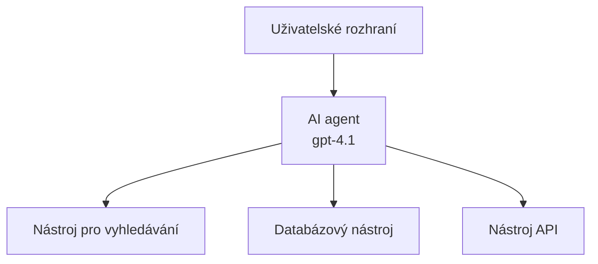
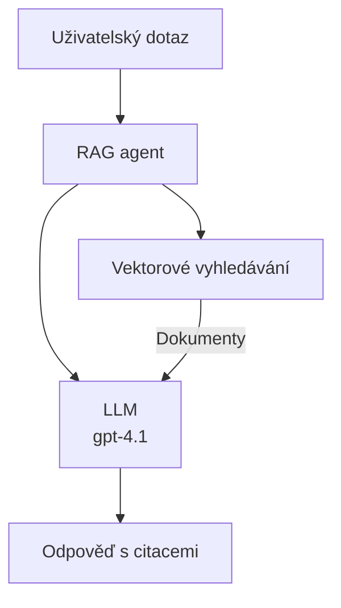
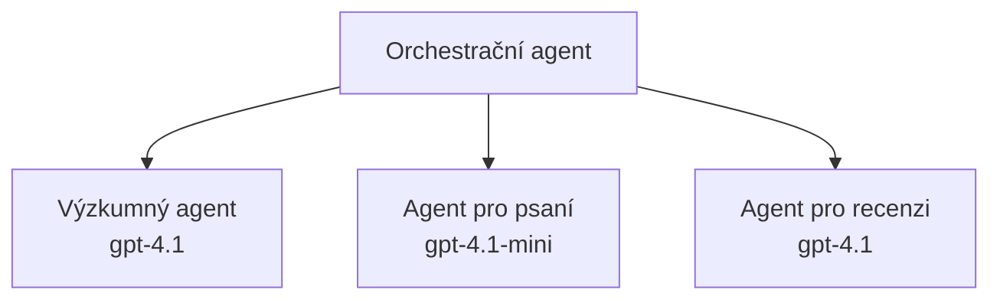

# AI agenti s Azure Developer CLI

**Navigace kapitoly:**
- **📚 Domů kurz**: [AZD For Beginners](../../README.md)
- **📖 Aktuální kapitola**: Kapitola 2 - Vývoj orientovaný na AI
- **⬅️ Předchozí**: [Integrace Microsoft Foundry](microsoft-foundry-integration.md)
- **➡️ Další**: [Nasazení modelu AI](ai-model-deployment.md)
- **🚀 Pokročilé**: [Řešení s více agenty](../../examples/retail-scenario.md)

---

## Úvod

AI agenti jsou autonomní programy, které vnímají své prostředí, činí rozhodnutí a vykonávají akce k dosažení konkrétních cílů. Na rozdíl od jednoduchých chatbotů, které odpovídají na podněty, agenti mohou:

- **Používat nástroje** - volat API, prohledávat databáze, spouštět kód
- **Plánovat a uvažovat** - rozdělit složité úlohy na kroky
- **Učit se z kontextu** - uchovávat paměť a přizpůsobovat chování
- **Spolupracovat** - pracovat s ostatními agenty (systémy s více agenty)

Tento průvodce ukazuje, jak nasadit AI agenty do Azure pomocí Azure Developer CLI (azd).

## Cíle učení

Po dokončení tohoto průvodce budete:
- Rozumět tomu, co jsou AI agenti a jak se liší od chatbotů
- Nasazovat předpřipravené šablony AI agentů pomocí AZD
- Konfigurovat Foundry agenty pro vlastní agenty
- Implementovat základní vzory agentů (použití nástrojů, RAG, multi-agent)
- Monitorovat a ladit nasazené agenty

## Výstupy učení

Po dokončení budete schopni:
- Nasadit aplikace AI agentů do Azure jedním příkazem
- Konfigurovat nástroje a schopnosti agenta
- Implementovat retrieval-augmented generation (RAG) s agenty
- Navrhnout architektury s více agenty pro komplexní pracovní postupy
- Řešit běžné problémy při nasazení agentů

---

## 🤖 Co odlišuje agenta od chatbota?

| Funkce | Chatbot | AI agent |
|---------|---------|----------|
| **Chování** | Odpovídá na podněty | Provádí autonomní akce |
| **Nástroje** | Žádné | Může volat API, vyhledávat, spouštět kód |
| **Paměť** | Pouze v rámci relace | Trvalá paměť napříč relacemi |
| **Plánování** | Jedna odpověď | Vícekrokové uvažování |
| **Spolupráce** | Jeden subjekt | Může spolupracovat s jinými agenty |

### Jednoduchá analogie

- **Chatbot** = Užitečná osoba odpovídající na dotazy u informační přepážky
- **AI agent** = Osobní asistent, který může volat, domluvit schůzky a dokončit úkoly za vás

---

## 🚀 Rychlý start: Nasadíte svého prvního agenta

### Možnost 1: Šablona Foundry agentů (Doporučeno)

```bash
# Inicializovat šablonu AI agentů
azd init --template get-started-with-ai-agents

# Nasadit do Azure
azd up
```

**Co se nasadí:**
- ✅ Foundry Agents
- ✅ Microsoft Foundry Models (gpt-4.1)
- ✅ Azure AI Search (pro RAG)
- ✅ Azure Container Apps (webové rozhraní)
- ✅ Application Insights (monitorování)

**Čas:** ~15-20 minut
**Cena:** ~$100-150/month (vývoj)

### Možnost 2: OpenAI Agent s Prompty

```bash
# Inicializovat šablonu agenta založenou na Prompty
azd init --template agent-openai-python-prompty

# Nasadit do Azure
azd up
```

**Co se nasadí:**
- ✅ Azure Functions (serverless vykonávání agenta)
- ✅ Microsoft Foundry Models
- ✅ Prompty konfigurační soubory
- ✅ Ukázková implementace agenta

**Čas:** ~10-15 minut
**Cena:** ~$50-100/month (vývoj)

### Možnost 3: RAG Chat Agent

```bash
# Inicializovat šablonu RAG chatu
azd init --template azure-search-openai-demo

# Nasadit do Azure
azd up
```

**Co se nasadí:**
- ✅ Microsoft Foundry Models
- ✅ Azure AI Search s ukázkovými daty
- ✅ Pipeline pro zpracování dokumentů
- ✅ Chat rozhraní s citacemi

**Čas:** ~15-25 minut
**Cena:** ~$80-150/month (vývoj)

### Možnost 4: AZD AI Agent Init (na základě manifestu)

Pokud máte soubor s manifestem agenta, můžete použít příkaz `azd ai` pro vygenerování projektu Foundry Agent Service přímo:

```bash
# Nainstalovat rozšíření AI agentů
azd extension install azure.ai.agents

# Inicializovat z manifestu agenta
azd ai agent init -m agent-manifest.yaml

# Nasadit do Azure
azd up
```

**Kdy použít `azd ai agent init` vs `azd init --template`:**

| Přístup | Nejlepší pro | Jak to funguje |
|----------|----------|------|
| `azd init --template` | Zahájení z funkční ukázkové aplikace | Naklonuje celé repozitář šablony s kódem + infrastrukturou |
| `azd ai agent init -m` | Vytváření z vlastního manifestu agenta | Vytvoří strukturu projektu z definice agenta |

> **Tip:** Použijte `azd init --template` při učení (Možnosti 1-3 výše). Použijte `azd ai agent init`, když vytváříte produkční agenty s vlastními manifesty. Viz [AZD AI CLI Commands](../chapter-08-production/production-ai-practices.md#azd-ai-cli-commands-and-extensions) pro kompletní reference.

---

## 🏗️ Vzory architektury agentů

### Vzor 1: Jediný agent s nástroji

Nejjednodušší vzor agenta - jeden agent, který může používat více nástrojů.


**Ideální pro:**
- Zákaznickou podporu
- Výzkumné asistenty
- Agenty pro analýzu dat

**AZD šablona:** `azure-search-openai-demo`

### Vzor 2: RAG Agent (Retrieval-Augmented Generation)

Agent, který před generováním odpovědí vyhledává relevantní dokumenty.


**Ideální pro:**
- Firemní znalostní báze
- Systémy pro dotazy nad dokumenty
- Compliance a právní výzkum

**AZD šablona:** `azure-search-openai-demo`

### Vzor 3: Systém více agentů

Více specializovaných agentů spolupracujících na komplexních úkolech.


**Ideální pro:**
- Generování komplexního obsahu
- Vícekrokové pracovní postupy
- Úkoly vyžadující různou odbornost

**Další informace:** [Multi-Agent Coordination Patterns](../chapter-06-pre-deployment/coordination-patterns.md)

---

## ⚙️ Konfigurace nástrojů agenta

Agentům přidává sílu, když mohou používat nástroje. Zde je návod, jak nakonfigurovat běžné nástroje:

### Konfigurace nástrojů ve Foundry agentech

```python
# agent_config.py
from azure.ai.projects import AIProjectClient
from azure.ai.projects.models import FunctionTool, CodeInterpreterTool

# Definujte vlastní nástroje
search_tool = FunctionTool(
    name="search_knowledge_base",
    description="Search the company knowledge base for relevant documents",
    parameters={
        "type": "object",
        "properties": {
            "query": {
                "type": "string",
                "description": "The search query"
            }
        },
        "required": ["query"]
    }
)

# Vytvořte agenta s nástroji
agent = project_client.agents.create_agent(
    model="gpt-4.1",
    name="Support Agent",
    instructions="You are a helpful support agent. Use the search tool to find relevant information.",
    tools=[search_tool, CodeInterpreterTool()]
)
```

### Konfigurace prostředí

```bash
# Nastavte proměnné prostředí specifické pro agenta
azd env set AZURE_OPENAI_MODEL "gpt-4.1"
azd env set AGENT_INSTRUCTIONS "You are a helpful assistant..."
azd env set ENABLE_CODE_INTERPRETER "true"
azd env set ENABLE_FILE_SEARCH "true"

# Nasadit pomocí aktualizované konfigurace
azd deploy
```

---

## 📊 Monitorování agentů

### Integrace Application Insights

Všechny šablony AZD agentů zahrnují Application Insights pro monitorování:

```bash
# Otevřít monitorovací panel
azd monitor --overview

# Zobrazit živé protokoly
azd monitor --logs

# Zobrazit živé metriky
azd monitor --live
```

### Klíčové metriky k sledování

| Metrika | Popis | Cíl |
|--------|-------------|--------|
| Prodleva odpovědi | Čas k vygenerování odpovědi | < 5 sekund |
| Využití tokenů | Tokeny na požadavek | Sledovat kvůli nákladům |
| Úspěšnost volání nástrojů | % úspěšných volání nástrojů | > 95% |
| Míra chyb | Neúspěšné požadavky agenta | < 1% |
| Spokojenost uživatelů | Hodnocení | > 4.0/5.0 |

### Vlastní logování pro agenty

```python
import os
from azure.monitor.opentelemetry import configure_azure_monitor
from opentelemetry import trace

# Nakonfigurujte Azure Monitor pomocí OpenTelemetry
configure_azure_monitor(
    connection_string=os.environ["APPLICATIONINSIGHTS_CONNECTION_STRING"]
)

tracer = trace.get_tracer(__name__)

def log_agent_interaction(user_query, agent_response, tools_used, latency_ms):
    with tracer.start_as_current_span("agent_interaction") as span:
        span.set_attributes({
            "user_query": user_query,
            "response_length": len(agent_response),
            "tools_used": tools_used,
            "latency_ms": latency_ms
        })
```

> **Poznámka:** Nainstalujte požadované balíčky: `pip install azure-monitor-opentelemetry opentelemetry`

---

## 💰 Úvahy o nákladech

### Odhadované měsíční náklady podle vzoru

| Vzor | Vývojové prostředí | Produkce |
|---------|-----------------|------------|
| Jediný agent | $50-100 | $200-500 |
| RAG agent | $80-150 | $300-800 |
| Multi-agent (2-3 agenti) | $150-300 | $500-1,500 |
| Enterprise multi-agent | $300-500 | $1,500-5,000+ |

### Tipy pro optimalizaci nákladů

1. **Používejte gpt-4.1-mini pro jednoduché úlohy**
   ```bash
   azd env set AZURE_OPENAI_MODEL "gpt-4.1-mini"
   ```

2. **Implementujte cachování pro opakované dotazy**
   ```python
   from functools import lru_cache
   
   @lru_cache(maxsize=1000)
   def get_cached_response(query_hash):
       return agent.run(query_hash)
   ```

3. **Nastavte limity tokenů na spuštění**
   ```python
   # Nastavte max_completion_tokens při spuštění agenta, nikoli při jeho vytváření
   run = project_client.agents.create_run(
       thread_id=thread.id,
       agent_id=agent.id,
       max_completion_tokens=1000  # Omezte délku odpovědi
   )
   ```

4. **Škálujte na nulu, když není v použití**
   ```bash
   # Container Apps se automaticky škálují na nulu
   azd env set MIN_REPLICAS "0"
   ```

---

## 🔧 Řešení problémů s agenty

### Běžné problémy a řešení

<details>
<summary><strong>❌ Agent neodpovídá na volání nástrojů</strong></summary>

```bash
# Zkontrolujte, zda jsou nástroje správně zaregistrovány
azd show

# Ověřte nasazení OpenAI
az cognitiveservices account deployment list \
  --name $AZURE_OPENAI_NAME \
  --resource-group $RG_NAME

# Zkontrolujte protokoly agenta
azd monitor --logs
```

**Běžné příčiny:**
- Nesoulad v signatuře funkce nástroje
- Chybějící požadovaná oprávnění
- API endpoint není dostupný
</details>

<details>
<summary><strong>❌ Vysoká latence v odpovědích agenta</strong></summary>

```bash
# Zkontrolujte Application Insights kvůli úzkým místům
azd monitor --live

# Zvažte použití rychlejšího modelu
azd env set AZURE_OPENAI_MODEL "gpt-4.1-mini"
azd deploy
```

**Tipy pro optimalizaci:**
- Používejte streamované odpovědi
- Implementujte cachování odpovědí
- Snižte velikost kontextového okna
</details>

<details>
<summary><strong>❌ Agent vrací nepřesné nebo vymyšlené informace</strong></summary>

```python
# Vylepšit pomocí lepších systémových promptů
instructions = """
You are a helpful assistant. IMPORTANT:
- Only answer based on provided context
- If you don't know, say "I don't know"
- Always cite your sources
- Never make up information
"""

# Přidat vyhledávání pro zakotvení
agent = project_client.agents.create_agent(
    model="gpt-4.1",
    instructions=instructions,
    tools=[FileSearchTool()]  # Zakotvit odpovědi v dokumentech
)
```
</details>

<details>
<summary><strong>❌ Překročeny limity tokenů (token limit exceeded)</strong></summary>

```python
# Implementovat správu kontextového okna
def truncate_context(messages, max_tokens=8000, model="gpt-4.1"):
    """Keep only recent messages within token limit."""
    import tiktoken
    encoding = tiktoken.encoding_for_model(model)
    total_tokens = 0
    truncated = []
    
    for msg in reversed(messages):
        msg_tokens = len(encoding.encode(msg.content))
        if total_tokens + msg_tokens > max_tokens:
            break
        truncated.insert(0, msg)
        total_tokens += msg_tokens
    
    return truncated
```
</details>

---

## 🎓 Praktická cvičení

### Cvičení 1: Nasadit základního agenta (20 minut)

**Cíl:** Nasadit svého prvního AI agenta pomocí AZD

```bash
# Krok 1: Inicializujte šablonu
azd init --template get-started-with-ai-agents

# Krok 2: Přihlaste se do Azure
azd auth login

# Krok 3: Proveďte nasazení
azd up

# Krok 4: Otestujte agenta
# Očekávaný výstup po nasazení:
#   Nasazení dokončeno!
#   Koncový bod: https://<app-name>.<region>.azurecontainerapps.io
# Otevřete adresu URL zobrazenou ve výstupu a zkuste položit otázku

# Krok 5: Zobrazit monitorování
azd monitor --overview

# Krok 6: Úklid
azd down --force --purge
```

**Kritéria úspěchu:**
- [ ] Agent odpovídá na dotazy
- [ ] Má přístup k monitorovacímu panelu přes `azd monitor`
- [ ] Prostředky byly úspěšně odstraněny

### Cvičení 2: Přidat vlastní nástroj (30 minut)

**Cíl:** Rozšířit agenta o vlastní nástroj

1. Nasadit šablonu agenta:
   ```bash
   azd init --template get-started-with-ai-agents
   azd up
   ```
2. Vytvořte novou funkci nástroje ve svém kódu agenta:
   ```python
   def get_weather(location: str) -> str:
       """Get current weather for a location."""
       # Volání API na službu počasí
       return f"Weather in {location}: Sunny, 72°F"
   ```
3. Zaregistrujte nástroj u agenta:
   ```python
   from azure.ai.projects.models import FunctionTool

   weather_tool = FunctionTool(
       name="get_weather",
       description="Get current weather for a location",
       parameters={
           "type": "object",
           "properties": {
               "location": {"type": "string", "description": "City name"}
           },
           "required": ["location"]
       }
   )

   agent = project_client.agents.create_agent(
       model="gpt-4.1",
       name="Weather Agent",
       tools=[weather_tool]
   )
   ```
4. Znovu nasadit a otestovat:
   ```bash
   azd deploy
   # Zeptej se: "Jaké je počasí v Seattlu?"
   # Očekává se: Agent zavolá get_weather("Seattle") a vrátí informace o počasí
   ```

**Kritéria úspěchu:**
- [ ] Agent rozpozná dotazy týkající se počasí
- [ ] Nástroj je volán správně
- [ ] Odpověď obsahuje informace o počasí

### Cvičení 3: Vytvořit RAG agenta (45 minut)

**Cíl:** Vytvořit agenta, který odpovídá na otázky z vašich dokumentů

```bash
# Krok 1: Nasadit RAG šablonu
azd init --template azure-search-openai-demo
azd up

# Krok 2: Nahrajte své dokumenty
# Umístěte soubory PDF/TXT do adresáře data/ a pak spusťte:
python scripts/prepdocs.py

# Krok 3: Otestujte pomocí doménově specifických otázek
# Otevřete URL webové aplikace z výstupu azd up
# Pokládejte otázky o svých nahraných dokumentech
# Odpovědi by měly obsahovat citace jako [doc.pdf]
```

**Kritéria úspěchu:**
- [ ] Agent odpovídá z nahraných dokumentů
- [ ] Odpovědi obsahují citace
- [ ] Žádné vymyšlené informace u otázek mimo rozsah

---

## 📚 Další kroky

Nyní, když rozumíte AI agentům, prozkoumejte tyto pokročilé témata:

| Téma | Popis | Odkaz |
|-------|-------------|------|
| **Multi-Agent Systems** | Vytvářejte systémy s více spolupracujícími agenty | [Retail Multi-Agent Example](../../examples/retail-scenario.md) |
| **Coordination Patterns** | Naučte se vzory orchestrací a komunikace | [Coordination Patterns](../chapter-06-pre-deployment/coordination-patterns.md) |
| **Production Deployment** | Nasazení agentů připravené pro produkci | [Production AI Practices](../chapter-08-production/production-ai-practices.md) |
| **Agent Evaluation** | Testujte a vyhodnocujte výkonnost agentů | [AI Troubleshooting](../chapter-07-troubleshooting/ai-troubleshooting.md) |
| **AI Workshop Lab** | Prakticky: Připravte své AI řešení pro AZD | [AI Workshop Lab](ai-workshop-lab.md) |

---

## 📖 Další zdroje

### Oficiální dokumentace
- [Azure AI Agent Service](https://learn.microsoft.com/azure/ai-services/agents/)
- [Azure AI Foundry Agent Service Quickstart](https://learn.microsoft.com/azure/ai-services/agents/quickstart)
- [Semantic Kernel Agent Framework](https://learn.microsoft.com/semantic-kernel/)

### Šablony AZD pro agenty
- [Get Started with AI Agents](https://github.com/Azure-Samples/get-started-with-ai-agents)
- [Agent OpenAI Python Prompty](https://github.com/Azure-Samples/agent-openai-python-prompty)
- [Azure Search OpenAI Demo](https://github.com/Azure-Samples/azure-search-openai-demo)

### Komunitní zdroje
- [Awesome AZD - Agent Templates](https://azure.github.io/awesome-azd/?tags=ai-agents)
- [Azure AI Discord](https://discord.gg/microsoft-azure)
- [Microsoft Foundry Discord](https://discord.gg/nTYy5BXMWG)

### Dovednosti agentů pro váš editor
- [**Microsoft Azure Agent Skills**](https://skills.sh/microsoft/github-copilot-for-azure) - Nainstalujte znovupoužitelné dovednosti AI agentů pro vývoj v Azure v GitHub Copilot, Cursor nebo jakémkoli podporovaném agentovi. Obsahuje dovednosti pro [Azure AI](https://skills.sh/microsoft/github-copilot-for-azure/azure-ai), [Microsoft Foundry](https://skills.sh/microsoft/github-copilot-for-azure/microsoft-foundry), [nasazení](https://skills.sh/microsoft/github-copilot-for-azure/azure-deploy) a [diagnostiku](https://skills.sh/microsoft/github-copilot-for-azure/azure-diagnostics):
  ```bash
  npx skills add microsoft/github-copilot-for-azure
  ```

---

**Navigace**
- **Předchozí lekce**: [Integrace Microsoft Foundry](microsoft-foundry-integration.md)
- **Další lekce**: [Nasazení modelu AI](ai-model-deployment.md)

---

<!-- CO-OP TRANSLATOR DISCLAIMER START -->
**Prohlášení o vyloučení odpovědnosti**:
Tento dokument byl přeložen pomocí AI překladatelské služby [Co-op Translator](https://github.com/Azure/co-op-translator). Ačkoli usilujeme o přesnost, mějte prosím na paměti, že automatizované překlady mohou obsahovat chyby nebo nepřesnosti. Původní dokument v jeho původním jazyce by měl být považován za autoritativní zdroj. Pro kritické informace se doporučuje profesionální lidský překlad. Nejsme odpovědní za jakákoliv nedorozumění nebo chybné výklady vyplývající z použití tohoto překladu.
<!-- CO-OP TRANSLATOR DISCLAIMER END -->