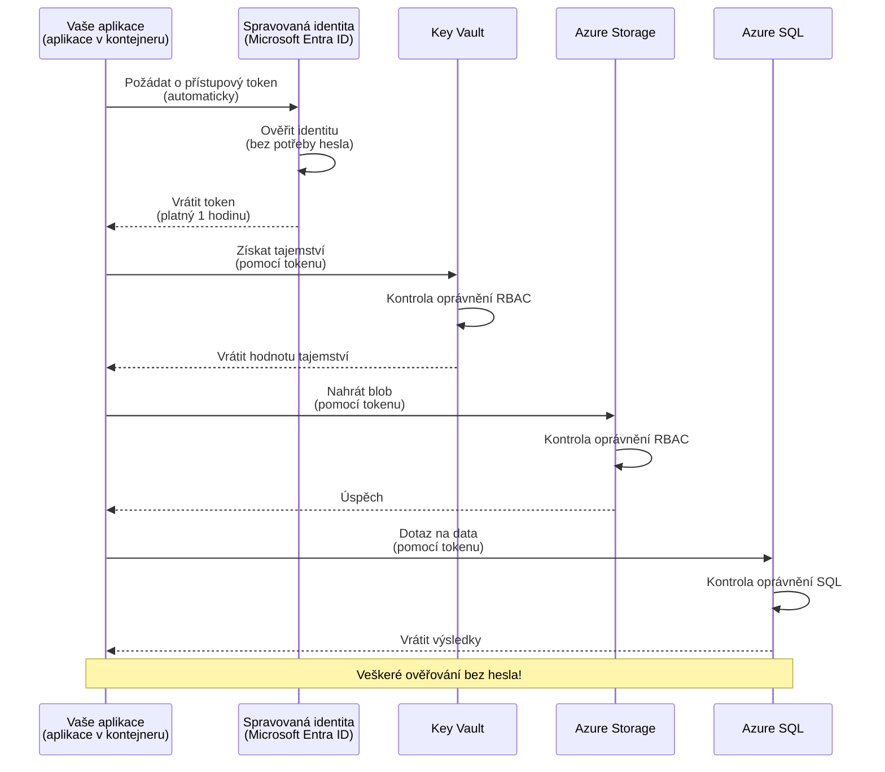
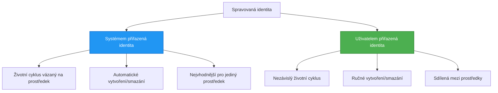

# Autentizační vzory a spravovaná identita

⏱️ **Odhadovaný čas**: 45–60 minut | 💰 **Dopad na náklady**: Zdarma (žádné další poplatky) | ⭐ **Složitost**: Středně náročné

**📚 Vzdělávací cesta:**
- ← Předchozí: [Configuration Management](configuration.md) - Správa proměnných prostředí a tajemství
- 🎯 **Jste zde**: Autentizace a zabezpečení (spravovaná identita, Key Vault, bezpečné vzory)
- → Další: [First Project](first-project.md) - Vytvořte svou první AZD aplikaci
- 🏠 [Course Home](../../README.md)

---

## Co se naučíte

Po dokončení této lekce budete:
- Rozumět autentizačním vzorům v Azure (klíče, connection stringy, spravovaná identita)
- Implementovat **spravovanou identitu** pro autentizaci bez hesel
- Zabezpečit tajemství integrací s **Azure Key Vault**
- Nakonfigurovat **role-based access control (RBAC)** pro nasazení AZD
- Aplikovat bezpečnostní osvědčené postupy v Container Apps a službách Azure
- Migrovat z autentizace založené na klíčích na autentizaci založenou na identitě

## Proč má spravovaná identita význam

### Problém: Tradiční autentizace

**Před spravovanou identitou:**
```javascript
// ❌ BEZPEČNOSTNÍ RIZIKO: Napevno v kódu uložená tajemství
const connectionString = "Server=mydb.database.windows.net;User=admin;Password=P@ssw0rd123";
const storageKey = "xK7mN9pQ2wR5tY8uI0oP3aS6dF1gH4jK...";
const cosmosKey = "C2x7B9n4M1p8Q5w3E6r0T2y5U8i1O4p7...";
```

**Problémy:**
- 🔴 **Odhalená tajemství** v kódu, konfiguračních souborech, proměnných prostředí
- 🔴 **Rotace přihlašovacích údajů** vyžaduje změny v kódu a redeploy
- 🔴 **Hlavobol auditů** – kdo co kdy přistupoval?
- 🔴 **Rozptýlení** – tajemství roztroušena napříč systémy
- 🔴 **Rizika souladu** – nevyhovuje bezpečnostním auditům

### Řešení: Spravovaná identita

**Po zavedení spravované identity:**
```javascript
// ✅ BEZPEČNÉ: Žádné tajné údaje v kódu
const credential = new DefaultAzureCredential();
const client = new BlobServiceClient(
  "https://mystorageaccount.blob.core.windows.net",
  credential  // Azure automaticky zajišťuje ověřování
);
```

**Výhody:**
- ✅ **Žádná tajemství** v kódu nebo konfiguraci
- ✅ **Automatická rotace** – za to se stará Azure
- ✅ **Úplný auditní záznam** v Microsoft Entra ID logech
- ✅ **Centralizované zabezpečení** – spravujte v Azure Portalu
- ✅ **Připravené na compliance** – splňuje bezpečnostní standardy

**Analogie**: Tradiční autentizace je jako nošení více fyzických klíčů pro různé dveře. Spravovaná identita je jako průkazka, která automaticky poskytuje přístup podle toho, kdo jste — žádné klíče, které by bylo možné ztratit, kopírovat nebo rotovat.

---

## Přehled architektury

### Autentizační tok se spravovanou identitou



### Typy spravovaných identit



| Vlastnost | Systémově přiřazená | Uživatelem přiřazená |
|---------|----------------|---------------|
| **Životní cyklus** | Vázaná na prostředek | Nezávislá |
| **Vytvoření** | Automaticky s prostředkem | Ruční vytvoření |
| **Smazání** | Smazána s prostředkem | Přetrvává po smazání prostředku |
| **Sdílení** | Pouze jeden prostředek | Více prostředků |
| **Použití** | Jednoduché scénáře | Složitější multi-prostředkové scénáře |
| **AZD výchozí** | ✅ Doporučeno | Volitelné |

---

## Požadavky

### Vyžadované nástroje

Měli byste mít tyto nástroje nainstalované z předchozích lekcí:

```bash
# Ověřte Azure Developer CLI
azd version
# ✅ Očekává se: azd verze 1.0.0 nebo vyšší

# Ověřte Azure CLI
az --version
# ✅ Očekává se: azure-cli 2.50.0 nebo vyšší
```

### Požadavky na Azure

- Aktivní předplatné Azure
- Oprávnění k:
  - Vytváření spravovaných identit
  - Přiřazování RBAC rolí
  - Vytváření Key Vault zdrojů
  - Nasazení Container Apps

### Požadavky na znalosti

Měli byste mít dokončeno:
- [Installation Guide](installation.md) - Nastavení AZD
- [AZD Basics](azd-basics.md) - Základní koncepty
- [Configuration Management](configuration.md) - Proměnné prostředí

---

## Lekce 1: Pochopení autentizačních vzorů

### Vzor 1: Connection strings (Zastaralé - vyhnout se)

**Jak to funguje:**
```bash
# Řetězec připojení obsahuje přihlašovací údaje
STORAGE_CONNECTION_STRING="DefaultEndpointsProtocol=https;AccountName=myaccount;AccountKey=xK7mN9pQ2wR5..."
COSMOS_CONNECTION_STRING="AccountEndpoint=https://myaccount.documents.azure.com:443/;AccountKey=C2x7..."
SQL_CONNECTION_STRING="Server=myserver.database.windows.net;User=admin;Password=P@ssw0rd..."
```

**Problémy:**
- ❌ Tajemství viditelná v proměnných prostředí
- ❌ Logována v nasazovacích systémech
- ❌ Obtížná rotace
- ❌ Žádný auditní záznam přístupů

**Kdy použít:** Pouze pro lokální vývoj, nikdy do produkce.

---

### Vzor 2: Key Vault reference (Lepší)

**Jak to funguje:**
```bicep
// Store secret in Key Vault
resource keyVault 'Microsoft.KeyVault/vaults@2023-02-01' = {
  name: 'mykv'
  properties: {
    enableRbacAuthorization: true
  }
}

// Reference in Container App
env: [
  {
    name: 'STORAGE_KEY'
    secretRef: 'storage-key'  // References Key Vault
  }
]
```

**Výhody:**
- ✅ Tajemství bezpečně uložená v Key Vault
- ✅ Centralizovaná správa tajemství
- ✅ Rotace bez změn v kódu

**Omezení:**
- ⚠️ Stále se používají klíče/hesla
- ⚠️ Je třeba spravovat přístup k Key Vault

**Kdy použít:** Přechodný krok z connection strings na spravovanou identitu.

---

### Vzor 3: Spravovaná identita (Nejlepší postup)

**Jak to funguje:**
```bicep
// Enable managed identity
resource containerApp 'Microsoft.App/containerApps@2023-05-01' = {
  name: 'myapp'
  identity: {
    type: 'SystemAssigned'  // Automatically creates identity
  }
}

// Grant permissions
resource roleAssignment 'Microsoft.Authorization/roleAssignments@2022-04-01' = {
  scope: storageAccount
  properties: {
    roleDefinitionId: storageBlobDataContributorRole
    principalId: containerApp.identity.principalId
  }
}
```

**Kód aplikace:**
```javascript
// Nejsou potřeba žádná tajemství!
const { DefaultAzureCredential } = require('@azure/identity');
const { BlobServiceClient } = require('@azure/storage-blob');

const credential = new DefaultAzureCredential();
const blobServiceClient = new BlobServiceClient(
  'https://mystorageaccount.blob.core.windows.net',
  credential
);
```

**Výhody:**
- ✅ Žádná tajemství v kódu/konfiguraci
- ✅ Automatická rotace přihlašovacích údajů
- ✅ Úplný auditní záznam
- ✅ Oprávnění založená na RBAC
- ✅ Připravené na compliance

**Kdy použít:** Vždy, pro produkční aplikace.

---

### Vzor 4: Service Principals (CI/CD & automatizace)

Spravovaná identita je zlatý standard *pro prostředky běžící v Azure*. Ale co věci běžící **mimo** Azure — jako CI/CD pipeline na build agentovi, nebo skript na vašem notebooku, které nemohou použít interaktivní přihlášení? Tam přichází na řadu **service principal**: ne-lidská identita s vlastními přihlašovacími údaji, pod kterou se může automatizovaný proces přihlásit.

**Jak to funguje:**

Vytvořte service principal s rozsahem na resource group (princip nejmenších oprávnění):

```bash
az ad sp create-for-rbac \
  --name "myapp-cicd" \
  --role contributor \
  --scopes /subscriptions/<sub-id>/resourceGroups/<rg-name>
```

To vytiskne client ID, client secret a tenant ID. azd se může přihlásit pomocí nich bez interakce:

```bash
azd auth login \
  --client-id "<appId>" \
  --client-secret "<password>" \
  --tenant-id "<tenant>"
```

**Preferujte federované přihlašovací údaje (OIDC) před tajnými klíči.** Místo dlouhodobého client secretu nakonfigurujte federované přihlašovací údaje, aby pipeline vyměnila krátkodobý token — žádné tajemství k úniku nebo rotaci:

```bash
azd auth login \
  --client-id "<appId>" \
  --federated-credential-provider "github" \
  --tenant-id "<tenant>"
```

> `azd pipeline config` to pro vás automaticky nastaví. Viz průvodce CI/CD v [Chapter 8](../chapter-08-production/production-ai-practices.md).

**Výhody:**
- ✅ Funguje mimo Azure (build agenty, on-prem, jiné cloudy)
- ✅ Lze omezit na jednu resource group s jednou rolí
- ✅ Federovaná (OIDC) varianta nepoužívá uložené tajemství

**Kompenzace:**
- ⚠️ Varianta založená na tajných klíčích vyžaduje pečlivé uložení a rotaci
- ⚠️ Uniklé tajemství poskytuje vše, co může SP dělat — držte rozsahy úzké

**Kdy použít:** CI/CD pipelines a automatizace, které nemohou použít spravovanou identitu. Vždy preferujte **federovanou/OIDC** variantu před client secret, a preferujte spravovanou identitu, kdykoli běží pracovní zátěž v Azure.

**Bezpečné ukládání přihlašovacích údajů:**
- Nikdy neusazujte tajemství do repozitáře — použijte úložiště tajemství vaší pipeline (GitHub Actions secrets, Azure DevOps variable groups / Key Vault).
- Omezte SP na nejmenší roli a resource group, kterou potřebuje.
- Nastavte vypršení platnosti a rotujte, nebo eliminujte tajemství úplně pomocí OIDC.

---

## Lekce 2: Implementace spravované identity s AZD

### Krok za krokem implementace

Postavme bezpečný Container App, který používá spravovanou identitu pro přístup k Azure Storage a Key Vault.

### Struktura projektu

```
secure-app/
├── azure.yaml                 # AZD configuration
├── infra/
│   ├── main.bicep            # Main infrastructure
│   ├── core/
│   │   ├── identity.bicep    # Managed identity setup
│   │   ├── keyvault.bicep    # Key Vault configuration
│   │   └── storage.bicep     # Storage with RBAC
│   └── app/
│       └── container-app.bicep
└── src/
    ├── app.js                # Application code
    ├── package.json
    └── Dockerfile
```

### 1. Konfigurace AZD (azure.yaml)

```yaml
name: secure-app
metadata:
  template: secure-app@1.0.0

services:
  api:
    project: ./src
    language: js
    host: containerapp

# Enable managed identity (AZD handles this automatically)
```

### 2. Infrastruktura: Povolit spravovanou identitu

**Soubor: `infra/main.bicep`**

```bicep
targetScope = 'subscription'

param environmentName string
param location string = 'eastus'

var tags = { 'azd-env-name': environmentName }

// Resource group
resource rg 'Microsoft.Resources/resourceGroups@2021-04-01' = {
  name: 'rg-${environmentName}'
  location: location
  tags: tags
}

// Storage Account
module storage './core/storage.bicep' = {
  name: 'storage'
  scope: rg
  params: {
    name: 'st${uniqueString(rg.id)}'
    location: location
    tags: tags
  }
}

// Key Vault
module keyVault './core/keyvault.bicep' = {
  name: 'keyvault'
  scope: rg
  params: {
    name: 'kv-${uniqueString(rg.id)}'
    location: location
    tags: tags
  }
}

// Container App with Managed Identity
module containerApp './app/container-app.bicep' = {
  name: 'container-app'
  scope: rg
  params: {
    name: 'ca-${environmentName}'
    location: location
    tags: tags
    storageAccountName: storage.outputs.name
    keyVaultName: keyVault.outputs.name
  }
}

// Grant Container App access to Storage
module storageRoleAssignment './core/role-assignment.bicep' = {
  name: 'storage-role'
  scope: rg
  params: {
    principalId: containerApp.outputs.identityPrincipalId
    roleDefinitionId: 'ba92f5b4-2d11-453d-a403-e96b0029c9fe'  // Storage Blob Data Contributor
    targetResourceId: storage.outputs.id
  }
}

// Grant Container App access to Key Vault
module kvRoleAssignment './core/role-assignment.bicep' = {
  name: 'kv-role'
  scope: rg
  params: {
    principalId: containerApp.outputs.identityPrincipalId
    roleDefinitionId: '4633458b-17de-408a-b874-0445c86b69e6'  // Key Vault Secrets User
    targetResourceId: keyVault.outputs.id
  }
}

// Outputs
output AZURE_STORAGE_ACCOUNT_NAME string = storage.outputs.name
output AZURE_KEY_VAULT_NAME string = keyVault.outputs.name
output APP_URL string = containerApp.outputs.url
```

### 3. Container App se systémově přiřazenou identitou

**Soubor: `infra/app/container-app.bicep`**

```bicep
param name string
param location string
param tags object = {}
param storageAccountName string
param keyVaultName string

resource containerApp 'Microsoft.App/containerApps@2023-05-01' = {
  name: name
  location: location
  tags: tags
  identity: {
    type: 'SystemAssigned'  // 🔑 Enable managed identity
  }
  properties: {
    configuration: {
      ingress: {
        external: true
        targetPort: 3000
      }
    }
    template: {
      containers: [
        {
          name: 'api'
          image: 'myregistry.azurecr.io/api:latest'
          resources: {
            cpu: json('0.5')
            memory: '1Gi'
          }
          env: [
            {
              name: 'AZURE_STORAGE_ACCOUNT_NAME'
              value: storageAccountName
            }
            {
              name: 'AZURE_KEY_VAULT_NAME'
              value: keyVaultName
            }
            // 🔑 No secrets - managed identity handles authentication!
          ]
        }
      ]
    }
  }
}

// Output the identity for RBAC assignments
output identityPrincipalId string = containerApp.identity.principalId
output id string = containerApp.id
output url string = 'https://${containerApp.properties.configuration.ingress.fqdn}'
```

### 4. Modul pro přiřazení RBAC rolí

**Soubor: `infra/core/role-assignment.bicep`**

```bicep
param principalId string
param roleDefinitionId string  // Azure built-in role ID
param targetResourceId string

resource roleAssignment 'Microsoft.Authorization/roleAssignments@2022-04-01' = {
  name: guid(principalId, roleDefinitionId, targetResourceId)
  scope: resourceId('Microsoft.Resources/resourceGroups', resourceGroup().name)
  properties: {
    roleDefinitionId: subscriptionResourceId('Microsoft.Authorization/roleDefinitions', roleDefinitionId)
    principalId: principalId
    principalType: 'ServicePrincipal'
  }
}

output id string = roleAssignment.id
```

### 5. Kód aplikace se spravovanou identitou

**Soubor: `src/app.js`**

```javascript
const express = require('express');
const { DefaultAzureCredential } = require('@azure/identity');
const { BlobServiceClient } = require('@azure/storage-blob');
const { SecretClient } = require('@azure/keyvault-secrets');

const app = express();
const PORT = process.env.PORT || 3000;

// 🔑 Inicializovat přihlašovací údaje (funguje automaticky s řízenou identitou)
const credential = new DefaultAzureCredential();

// Nastavení Azure Storage
const storageAccountName = process.env.AZURE_STORAGE_ACCOUNT_NAME;
const blobServiceClient = new BlobServiceClient(
  `https://${storageAccountName}.blob.core.windows.net`,
  credential  // Žádné klíče nejsou potřeba!
);

// Nastavení Key Vaultu
const keyVaultName = process.env.AZURE_KEY_VAULT_NAME;
const secretClient = new SecretClient(
  `https://${keyVaultName}.vault.azure.net`,
  credential  // Žádné klíče nejsou potřeba!
);

// Kontrola stavu
app.get('/health', (req, res) => {
  res.json({ status: 'healthy', authentication: 'managed-identity' });
});

// Nahrát soubor do Blob Storage
app.post('/upload', async (req, res) => {
  try {
    const containerClient = blobServiceClient.getContainerClient('uploads');
    await containerClient.createIfNotExists();
    
    const blobName = `file-${Date.now()}.txt`;
    const blockBlobClient = containerClient.getBlockBlobClient(blobName);
    
    await blockBlobClient.upload('Hello from managed identity!', 30);
    
    res.json({
      success: true,
      blobName: blobName,
      message: 'File uploaded using managed identity!'
    });
  } catch (error) {
    console.error('Upload error:', error);
    res.status(500).json({ error: error.message });
  }
});

// Získat tajemství z Key Vaultu
app.get('/secret/:name', async (req, res) => {
  try {
    const secretName = req.params.name;
    const secret = await secretClient.getSecret(secretName);
    
    res.json({
      name: secretName,
      value: secret.value,
      message: 'Secret retrieved using managed identity!'
    });
  } catch (error) {
    console.error('Secret error:', error);
    res.status(500).json({ error: error.message });
  }
});

// Vypsat kontejnery blobů (demonstruje přístup pro čtení)
app.get('/containers', async (req, res) => {
  try {
    const containers = [];
    for await (const container of blobServiceClient.listContainers()) {
      containers.push(container.name);
    }
    
    res.json({
      containers: containers,
      count: containers.length,
      message: 'Containers listed using managed identity!'
    });
  } catch (error) {
    console.error('List error:', error);
    res.status(500).json({ error: error.message });
  }
});

app.listen(PORT, () => {
  console.log(`Secure API listening on port ${PORT}`);
  console.log('Authentication: Managed Identity (passwordless)');
});
```

**Soubor: `src/package.json`**

```json
{
  "name": "secure-app",
  "version": "1.0.0",
  "dependencies": {
    "express": "^4.18.2",
    "@azure/identity": "^4.0.0",
    "@azure/storage-blob": "^12.17.0",
    "@azure/keyvault-secrets": "^4.7.0"
  },
  "scripts": {
    "start": "node app.js"
  }
}
```

### 6. Nasazení a testování

```bash
# Inicializovat prostředí AZD
azd init

# Nasadit infrastrukturu a aplikaci
azd up

# Získat URL aplikace
APP_URL=$(azd env get-values | grep APP_URL | cut -d '=' -f2 | tr -d '"')

# Otestovat kontrolu stavu
curl $APP_URL/health
```

**✅ Očekávaný výstup:**
```json
{
  "status": "healthy",
  "authentication": "managed-identity"
}
```

**Test nahrání blobu:**
```bash
curl -X POST $APP_URL/upload
```

**✅ Očekávaný výstup:**
```json
{
  "success": true,
  "blobName": "file-1700404800000.txt",
  "message": "File uploaded using managed identity!"
}
```

**Test výpisu kontejnerů:**
```bash
curl $APP_URL/containers
```

**✅ Očekávaný výstup:**
```json
{
  "containers": ["uploads"],
  "count": 1,
  "message": "Containers listed using managed identity!"
}
```

---

## Běžné role Azure RBAC

### Vestavěná Role ID pro spravovanou identitu

| Služba | Název role | Role ID | Oprávnění |
|---------|-----------|---------|-------------|
| **Storage** | Storage Blob Data Reader | `2a2b9908-6b94-4a3d-8e5a-a7d8f8cc8a12` | Čtení blobů a kontejnerů |
| **Storage** | Storage Blob Data Contributor | `ba92f5b4-2d11-453d-a403-e96b0029c9fe` | Čtení, zápis, mazání blobů |
| **Storage** | Storage Queue Data Contributor | `974c5e8b-45b9-4653-ba55-5f855dd0fb88` | Čtení, zápis, mazání zpráv fronty |
| **Key Vault** | Key Vault Secrets User | `4633458b-17de-408a-b874-0445c86b69e6` | Čtení tajemství |
| **Key Vault** | Key Vault Secrets Officer | `b86a8fe4-44ce-4948-aee5-eccb2c155cd7` | Čtení, zápis, mazání tajemství |
| **Cosmos DB** | Cosmos DB Built-in Data Reader | `00000000-0000-0000-0000-000000000001` | Čtení dat Cosmos DB |
| **Cosmos DB** | Cosmos DB Built-in Data Contributor | `00000000-0000-0000-0000-000000000002` | Čtení, zápis dat Cosmos DB |
| **SQL Database** | SQL DB Contributor | `9b7fa17d-e63e-47b0-bb0a-15c516ac86ec` | Správa SQL databází |
| **Service Bus** | Azure Service Bus Data Owner | `090c5cfd-751d-490a-894a-3ce6f1109419` | Odesílání, přijímání, správa zpráv |

### Jak najít ID rolí

```bash
# Vypsat všechny vestavěné role
az role definition list --query "[].{Name:roleName, ID:name}" --output table

# Vyhledat konkrétní roli
az role definition list --query "[?contains(roleName, 'Storage Blob')].{Name:roleName, ID:name}" --output table

# Získat podrobnosti o roli
az role definition list --name "Storage Blob Data Contributor"
```

---

## Praktická cvičení

### Cvičení 1: Povolit spravovanou identitu pro existující aplikaci ⭐⭐ (Střední)

**Cíl**: Přidat spravovanou identitu k existujícímu nasazení Container App

**Scénář**: Máte Container App používající connection stringy. Převeďte ji na spravovanou identitu.

**Výchozí stav**: Container App s touto konfigurací:

```bicep
// ❌ Current: Using connection string
env: [
  {
    name: 'STORAGE_CONNECTION_STRING'
    secretRef: 'storage-connection'
  }
]
```

**Kroky**:

1. **Povolit spravovanou identitu v Bicep:**

```bicep
resource containerApp 'Microsoft.App/containerApps@2023-05-01' = {
  name: 'myapp'
  identity: {
    type: 'SystemAssigned'  // Add this
  }
  // ... rest of configuration
}
```

2. **Udělit přístup ke Storage:**

```bicep
// Get storage account reference
resource storageAccount 'Microsoft.Storage/storageAccounts@2023-01-01' existing = {
  name: storageAccountName
}

// Assign role
resource roleAssignment 'Microsoft.Authorization/roleAssignments@2022-04-01' = {
  name: guid(containerApp.id, 'ba92f5b4-2d11-453d-a403-e96b0029c9fe', storageAccount.id)
  scope: storageAccount
  properties: {
    roleDefinitionId: subscriptionResourceId('Microsoft.Authorization/roleDefinitions', 'ba92f5b4-2d11-453d-a403-e96b0029c9fe')
    principalId: containerApp.identity.principalId
    principalType: 'ServicePrincipal'
  }
}
```

3. **Aktualizovat kód aplikace:**

**Před (připojovací řetězec):**
```javascript
const { BlobServiceClient } = require('@azure/storage-blob');

const blobServiceClient = BlobServiceClient.fromConnectionString(
  process.env.STORAGE_CONNECTION_STRING
);
```

**Po (spravovaná identita):**
```javascript
const { DefaultAzureCredential } = require('@azure/identity');
const { BlobServiceClient } = require('@azure/storage-blob');

const credential = new DefaultAzureCredential();
const blobServiceClient = new BlobServiceClient(
  `https://${process.env.STORAGE_ACCOUNT_NAME}.blob.core.windows.net`,
  credential
);
```

4. **Aktualizovat proměnné prostředí:**

```bicep
env: [
  {
    name: 'STORAGE_ACCOUNT_NAME'
    value: storageAccountName  // Just the name, no secrets!
  }
  // Remove STORAGE_CONNECTION_STRING
]
```

5. **Nasadit a otestovat:**

```bash
# Znovu nasadit
azd up

# Ověřte, že to stále funguje
curl https://myapp.azurecontainerapps.io/upload
```

**✅ Kritéria úspěchu:**
- ✅ Aplikace se nasadí bez chyb
- ✅ Operace se Storage fungují (upload, výpis, stažení)
- ✅ Žádné connection stringy v proměnných prostředí
- ✅ Identita viditelná v Azure Portalu pod částí "Identity"

**Verifikace:**

```bash
# Zkontrolujte, zda je spravovaná identita povolena
az containerapp show \
  --name myapp \
  --resource-group rg-myapp \
  --query "identity.type"
# ✅ Očekává se: "SystemAssigned"

# Zkontrolujte přiřazení role
az role assignment list \
  --assignee $(az containerapp show --name myapp --resource-group rg-myapp --query "identity.principalId" -o tsv) \
  --scope /subscriptions/{sub-id}/resourceGroups/rg-myapp/providers/Microsoft.Storage/storageAccounts/mystorageaccount
# ✅ Očekává se: Zobrazuje roli "Storage Blob Data Contributor"
```

**Čas**: 20–30 minut

---

### Cvičení 2: Přístup více služeb pomocí uživatelem přiřazené identity ⭐⭐⭐ (Pokročilé)

**Cíl**: Vytvořit uživatelem přiřazenou identitu sdílenou mezi více Container Apps

**Scénář**: Máte 3 mikroservisy, které všechny potřebují přístup ke stejnému Storage účtu a Key Vault.

**Kroky**:

1. **Vytvořit uživatelem přiřazenou identitu:**

**Soubor: `infra/core/identity.bicep`**

```bicep
param name string
param location string
param tags object = {}

resource userAssignedIdentity 'Microsoft.ManagedIdentity/userAssignedIdentities@2023-01-31' = {
  name: name
  location: location
  tags: tags
}

output id string = userAssignedIdentity.id
output principalId string = userAssignedIdentity.properties.principalId
output clientId string = userAssignedIdentity.properties.clientId
```

2. **Přiřadit role uživatelem přiřazené identitě:**

```bicep
// In main.bicep
module userIdentity './core/identity.bicep' = {
  name: 'user-identity'
  scope: rg
  params: {
    name: 'id-${environmentName}'
    location: location
    tags: tags
  }
}

// Grant Storage access
resource storageRoleAssignment 'Microsoft.Authorization/roleAssignments@2022-04-01' = {
  name: guid(userIdentity.outputs.principalId, 'storage-contributor')
  scope: storageAccount
  properties: {
    roleDefinitionId: subscriptionResourceId('Microsoft.Authorization/roleDefinitions', 'ba92f5b4-2d11-453d-a403-e96b0029c9fe')
    principalId: userIdentity.outputs.principalId
    principalType: 'ServicePrincipal'
  }
}

// Grant Key Vault access
resource kvRoleAssignment 'Microsoft.Authorization/roleAssignments@2022-04-01' = {
  name: guid(userIdentity.outputs.principalId, 'kv-secrets-user')
  scope: keyVault
  properties: {
    roleDefinitionId: subscriptionResourceId('Microsoft.Authorization/roleDefinitions', '4633458b-17de-408a-b874-0445c86b69e6')
    principalId: userIdentity.outputs.principalId
    principalType: 'ServicePrincipal'
  }
}
```

3. **Přiřadit identitu více Container Apps:**

```bicep
resource apiGateway 'Microsoft.App/containerApps@2023-05-01' = {
  name: 'api-gateway'
  identity: {
    type: 'UserAssigned'
    userAssignedIdentities: {
      '${userIdentity.outputs.id}': {}
    }
  }
  // ... rest of config
}

resource productService 'Microsoft.App/containerApps@2023-05-01' = {
  name: 'product-service'
  identity: {
    type: 'UserAssigned'
    userAssignedIdentities: {
      '${userIdentity.outputs.id}': {}
    }
  }
  // ... rest of config
}

resource orderService 'Microsoft.App/containerApps@2023-05-01' = {
  name: 'order-service'
  identity: {
    type: 'UserAssigned'
    userAssignedIdentities: {
      '${userIdentity.outputs.id}': {}
    }
  }
  // ... rest of config
}
```

4. **Kód aplikace (všechny služby používají stejný vzor):**

```javascript
const { DefaultAzureCredential, ManagedIdentityCredential } = require('@azure/identity');

// Pro uživatelem přiřazenou identitu zadejte ID klienta
const credential = new ManagedIdentityCredential(
  process.env.AZURE_CLIENT_ID  // ID klienta uživatelem přiřazené identity
);

// Nebo použijte DefaultAzureCredential (automaticky detekuje)
const credential = new DefaultAzureCredential();

const blobServiceClient = new BlobServiceClient(
  `https://${process.env.STORAGE_ACCOUNT_NAME}.blob.core.windows.net`,
  credential
);
```

5. **Nasadit a ověřit:**

```bash
azd up

# Ověřte, že všechny služby mohou přistupovat k úložišti
curl https://api-gateway.azurecontainerapps.io/upload
curl https://product-service.azurecontainerapps.io/upload
curl https://order-service.azurecontainerapps.io/upload
```

**✅ Kritéria úspěchu:**
- ✅ Jedna identita sdílená mezi 3 službami
- ✅ Všechny služby mohou přistupovat ke Storage a Key Vault
- ✅ Identita přetrvává po smazání jedné služby
- ✅ Centralizovaná správa oprávnění

**Výhody uživatelem přiřazené identity:**
- Jedna identita ke správě
- Konzistentní oprávnění napříč službami
- Přetrvává po smazání služby
- Vhodnější pro složité architektury

**Čas**: 30–40 minut

---

### Cvičení 3: Implementace rotace tajemství v Key Vault ⭐⭐⭐ (Pokročilé)

**Cíl**: Uložit API klíče třetích stran v Key Vault a přistupovat k nim pomocí spravované identity

**Scénář**: Vaše aplikace potřebuje volat externí API (OpenAI, Stripe, SendGrid), které vyžaduje API klíče.

**Kroky**:

1. **Vytvořit Key Vault s RBAC:**

**Soubor: `infra/core/keyvault.bicep`**

```bicep
param name string
param location string
param tags object = {}

resource keyVault 'Microsoft.KeyVault/vaults@2023-02-01' = {
  name: name
  location: location
  tags: tags
  properties: {
    enableRbacAuthorization: true  // Use RBAC instead of access policies
    sku: {
      family: 'A'
      name: 'standard'
    }
    tenantId: subscription().tenantId
    enableSoftDelete: true
    softDeleteRetentionInDays: 90
  }
}

// Allow Container App to read secrets
output id string = keyVault.id
output name string = keyVault.name
output uri string = keyVault.properties.vaultUri
```

2. **Uložit tajemství v Key Vault:**

```bash
# Získat název Key Vaultu
KV_NAME=$(azd env get-values | grep AZURE_KEY_VAULT_NAME | cut -d '=' -f2 | tr -d '"')

# Uložit API klíče třetích stran
az keyvault secret set \
  --vault-name $KV_NAME \
  --name "OpenAI-ApiKey" \
  --value "sk-proj-xxxxxxxxxxxxx"

az keyvault secret set \
  --vault-name $KV_NAME \
  --name "Stripe-ApiKey" \
  --value "sk_live_xxxxxxxxxxxxx"

az keyvault secret set \
  --vault-name $KV_NAME \
  --name "SendGrid-ApiKey" \
  --value "SG.xxxxxxxxxxxxx"
```

3. **Kód aplikace pro načítání tajemství:**

**Soubor: `src/config.js`**

```javascript
const { DefaultAzureCredential } = require('@azure/identity');
const { SecretClient } = require('@azure/keyvault-secrets');

class Config {
  constructor() {
    this.credential = new DefaultAzureCredential();
    this.secretClient = new SecretClient(
      `https://${process.env.AZURE_KEY_VAULT_NAME}.vault.azure.net`,
      this.credential
    );
    this.cache = {};
  }

  async getSecret(secretName) {
    // Nejprve zkontrolujte mezipaměť
    if (this.cache[secretName]) {
      return this.cache[secretName];
    }

    try {
      const secret = await this.secretClient.getSecret(secretName);
      this.cache[secretName] = secret.value;
      console.log(`✅ Retrieved secret: ${secretName}`);
      return secret.value;
    } catch (error) {
      console.error(`❌ Failed to get secret ${secretName}:`, error.message);
      throw error;
    }
  }

  async getOpenAIKey() {
    return this.getSecret('OpenAI-ApiKey');
  }

  async getStripeKey() {
    return this.getSecret('Stripe-ApiKey');
  }

  async getSendGridKey() {
    return this.getSecret('SendGrid-ApiKey');
  }
}

module.exports = new Config();
```

4. **Použití tajemství v aplikaci:**

**Soubor: `src/app.js`**

```javascript
const express = require('express');
const config = require('./config');
const { OpenAI } = require('openai');

const app = express();

// Inicializovat OpenAI pomocí klíče z Key Vaultu
let openaiClient;

async function initializeServices() {
  const openaiKey = await config.getOpenAIKey();
  openaiClient = new OpenAI({ apiKey: openaiKey });
  console.log('✅ Services initialized with secrets from Key Vault');
}

// Zavolat při spuštění
initializeServices().catch(console.error);

app.post('/chat', async (req, res) => {
  try {
    const completion = await openaiClient.chat.completions.create({
      model: 'gpt-4.1',
      messages: [{ role: 'user', content: 'Hello!' }]
    });
    
    res.json({
      response: completion.choices[0].message.content,
      authentication: 'Key from Key Vault via Managed Identity'
    });
  } catch (error) {
    res.status(500).json({ error: error.message });
  }
});

app.listen(3000, () => {
  console.log('Secure API with Key Vault integration running');
});
```

5. **Nasadit a otestovat:**

```bash
azd up

# Ověřte, že API klíče fungují
curl -X POST https://myapp.azurecontainerapps.io/chat \
  -H "Content-Type: application/json" \
  -d '{"message":"Hello AI"}'
```

**✅ Kritéria úspěchu:**
- ✅ Žádné API klíče v kódu nebo v proměnných prostředí
- ✅ Aplikace načítá klíče z Key Vaultu
- ✅ API třetích stran fungují správně
- ✅ Lze rotovat klíče bez změn v kódu

**Rotace tajemství:**

```bash
# Aktualizujte tajemství v Key Vault
az keyvault secret set \
  --vault-name $KV_NAME \
  --name "OpenAI-ApiKey" \
  --value "sk-proj-NEW_KEY_HERE"

# Restartujte aplikaci, aby se použil nový klíč
az containerapp revision restart \
  --name myapp \
  --resource-group rg-myapp
```

**Čas**: 25-35 minut

---

## Kontrolní bod znalostí

### 1. Vzory autentizace ✓

Otestujte své porozumění:

- [ ] **Q1**: Jaké jsou tři hlavní vzory autentizace? 
  - **A**: Připojovací řetězce (legacy), odkazy na Key Vault (přechod), spravovaná identita (nejlepší)

- [ ] **Q2**: Proč je spravovaná identita lepší než připojovací řetězce?
  - **A**: Žádná tajemství v kódu, automatická rotace, úplný auditní záznam, oprávnění RBAC

- [ ] **Q3**: Kdy byste použili uživatelem přiřazenou identitu místo systémově přiřazené?
  - **A**: Když identity sdílíte mezi více zdroji nebo když je životní cyklus identity nezávislý na životním cyklu zdroje

**Praktická ověření:**
```bash
# Zkontrolujte, jaký typ identity vaše aplikace používá
az containerapp show \
  --name myapp \
  --resource-group rg-myapp \
  --query "identity.type"

# Vypište všechna přiřazení rolí pro identitu
az role assignment list \
  --assignee $(az containerapp show --name myapp --resource-group rg-myapp --query "identity.principalId" -o tsv)
```

---

### 2. RBAC a oprávnění ✓

Otestujte své porozumění:

- [ ] **Q1**: Jaké je ID role pro "Storage Blob Data Contributor"?
  - **A**: `ba92f5b4-2d11-453d-a403-e96b0029c9fe`

- [ ] **Q2**: Jaká oprávnění poskytuje "Key Vault Secrets User"?
  - **A**: Přístup pouze pro čtení k tajemstvím (nelze vytvářet, aktualizovat ani mazat)

- [ ] **Q3**: Jak udělíte Container App přístup k Azure SQL?
  - **A**: Přiřaďte roli "SQL DB Contributor" nebo nakonfigurujte autentizaci Microsoft Entra ID pro SQL

**Praktická ověření:**
```bash
# Najít konkrétní roli
az role definition list --name "Storage Blob Data Contributor"

# Zkontrolovat, jaké role jsou přiřazeny vaší identitě
PRINCIPAL_ID=$(az containerapp show --name myapp --resource-group rg-myapp --query "identity.principalId" -o tsv)
az role assignment list --assignee $PRINCIPAL_ID --output table
```

---

### 3. Integrace Key Vault ✓

Otestujte své porozumění:

- [ ] **Q1**: Jak povolíte RBAC pro Key Vault místo přístupových politik?
  - **A**: Nastavte `enableRbacAuthorization: true` v Bicep

- [ ] **Q2**: Knihovna Azure SDK, která zpracovává autentizaci spravované identity?
  - **A**: `@azure/identity` s třídou `DefaultAzureCredential`

- [ ] **Q3**: Jak dlouho zůstávají tajemství z Key Vaultu v cache?
  - **A**: Záleží na aplikaci; implementujte vlastní strategii kešování

**Praktická ověření:**
```bash
# Ověřit přístup k Key Vaultu
az keyvault secret show \
  --vault-name $KV_NAME \
  --name "OpenAI-ApiKey" \
  --query "value"

# Zkontrolovat, zda je RBAC povoleno
az keyvault show \
  --name $KV_NAME \
  --query "properties.enableRbacAuthorization"
# ✅ Očekává se: true
```

---

## Nejlepší bezpečnostní postupy

### ✅ DĚLAT:

1. **V produkci vždy používejte spravovanou identitu**
   ```bicep
   identity: {
     type: 'SystemAssigned'
   }
   ```

2. **Používejte RBAC role s nejmenšími potřebnými právy**
   - Používejte role "Reader" kdykoli je to možné
   - Vyhněte se rolím "Owner" nebo "Contributor", pokud to není nutné

3. **Ukládejte klíče třetích stran v Key Vaultu**
   ```javascript
   const apiKey = await secretClient.getSecret('ThirdPartyApiKey');
   ```

4. **Povolte auditní protokolování**
   ```bicep
   diagnosticSettings: {
     logs: [{ category: 'AuditEvent', enabled: true }]
   }
   ```

5. **Používejte různé identity pro dev/staging/prod**
   ```bash
   azd env new dev
   azd env new staging
   azd env new prod
   ```

6. **Pravidelně rotujte tajemství**
   - Nastavte expiraci u tajemství v Key Vaultu
   - Automatizujte rotaci pomocí Azure Functions

### ❌ NEDĚLAT:

1. **Nikdy nezakódovávejte tajemství napevno**
   ```javascript
   // ❌ ŠPATNÉ
   const apiKey = "sk-proj-xxxxxxxxxxxxx";
   ```

2. **Nepoužívejte připojovací řetězce v produkci**
   ```javascript
   // ❌ ŠPATNÉ
   BlobServiceClient.fromConnectionString(process.env.STORAGE_CONNECTION_STRING)
   ```

3. **Nedávejte nadměrná oprávnění**
   ```bicep
   // ❌ BAD - too much access
   roleDefinitionId: 'Owner'
   
   // ✅ GOOD - least privilege
   roleDefinitionId: 'Storage Blob Data Reader'
   ```

4. **Nezapisujte tajemství do logů**
   ```javascript
   // ❌ ŠPATNÉ
   console.log('API Key:', apiKey);
   
   // ✅ DOBRÉ
   console.log('API Key retrieved successfully');
   ```

5. **Nesdílejte produkční identity mezi prostředími**
   ```bicep
   // ❌ BAD - same identity for dev and prod
   // ✅ GOOD - separate identities per environment
   ```

---

## Návod pro řešení problémů

### Problém: "Unauthorized" při přístupu k Azure Storage

**Příznaky:**
```
Error: Unauthorized (403)
AuthorizationPermissionMismatch: This request is not authorized to perform this operation
```

**Diagnóza:**

```bash
# Zkontrolujte, zda je spravovaná identita povolena
az containerapp show \
  --name myapp \
  --resource-group rg-myapp \
  --query "identity.type"
# ✅ Očekává se: "SystemAssigned" nebo "UserAssigned"

# Zkontrolujte přiřazení rolí
PRINCIPAL_ID=$(az containerapp show --name myapp --resource-group rg-myapp --query "identity.principalId" -o tsv)
az role assignment list --assignee $PRINCIPAL_ID

# Očekává se: Měli byste vidět "Storage Blob Data Contributor" nebo podobnou roli
```

**Řešení:**

1. **Přiřaďte správnou RBAC roli:**
```bash
STORAGE_ID=$(az storage account show --name mystorageaccount --resource-group rg-myapp --query "id" -o tsv)
az role assignment create \
  --assignee $PRINCIPAL_ID \
  --role "Storage Blob Data Contributor" \
  --scope $STORAGE_ID
```

2. **Počkejte na propagaci (může trvat 5–10 minut):**
```bash
# Zkontrolovat stav přiřazení role
az role assignment list --assignee $PRINCIPAL_ID --scope $STORAGE_ID
```

3. **Ověřte, že kód aplikace používá správné přihlašovací údaje:**
```javascript
// Ujistěte se, že používáte DefaultAzureCredential
const credential = new DefaultAzureCredential();
```

---

### Problém: Přístup k Key Vaultu odepřen

**Příznaky:**
```
Error: Forbidden (403)
The user, group or application does not have secrets get permission
```

**Diagnóza:**

```bash
# Zkontrolovat, že je pro Key Vault povoleno RBAC
az keyvault show \
  --name $KV_NAME \
  --query "properties.enableRbacAuthorization"
# ✅ Očekává se: true

# Zkontrolovat přiřazení rolí
az role assignment list \
  --assignee $PRINCIPAL_ID \
  --scope /subscriptions/{sub-id}/resourceGroups/rg-myapp/providers/Microsoft.KeyVault/vaults/$KV_NAME
```

**Řešení:**

1. **Povolte RBAC na Key Vaultu:**
```bash
az keyvault update \
  --name $KV_NAME \
  --enable-rbac-authorization true
```

2. **Přiřaďte roli Key Vault Secrets User:**
```bash
KV_ID=$(az keyvault show --name $KV_NAME --query "id" -o tsv)
az role assignment create \
  --assignee $PRINCIPAL_ID \
  --role "Key Vault Secrets User" \
  --scope $KV_ID
```

---

### Problém: DefaultAzureCredential selhává lokálně

**Příznaky:**
```
Error: DefaultAzureCredential failed to retrieve a token
CredentialUnavailableError: No credential available
```

**Diagnóza:**

```bash
# Zkontrolujte, zda jste přihlášeni
az account show

# Zkontrolujte ověření Azure CLI
az ad signed-in-user show
```

**Řešení:**

1. **Přihlaste se do Azure CLI:**
```bash
az login
```

2. **Nastavte Azure subscription:**
```bash
az account set --subscription "Your Subscription Name"
```

3. **Pro lokální vývoj použijte proměnné prostředí:**
```bash
export AZURE_TENANT_ID="your-tenant-id"
export AZURE_CLIENT_ID="your-client-id"
export AZURE_CLIENT_SECRET="your-client-secret"
```

4. **Nebo použijte jiný credential lokálně:**
```javascript
const { DefaultAzureCredential, AzureCliCredential } = require('@azure/identity');

// Použijte AzureCliCredential pro lokální vývoj
const credential = process.env.NODE_ENV === 'production' 
  ? new DefaultAzureCredential()
  : new AzureCliCredential();
```

---

### Problém: Přiřazení role se špatně propaguje

**Příznaky:**
- Role byla úspěšně přiřazena
- Stále dostáváte chyby 403
- Příležitostný přístup (někdy funguje, někdy ne)

**Vysvětlení:**
Změny v Azure RBAC mohou trvat 5–10 minut, než se globálně projeví.

**Řešení:**

```bash
# Počkejte a zkuste to znovu
echo "Waiting for RBAC propagation..."
sleep 300  # Počkejte 5 minut

# Otestujte přístup
curl https://myapp.azurecontainerapps.io/upload

# Pokud to stále selhává, restartujte aplikaci
az containerapp revision restart \
  --name myapp \
  --resource-group rg-myapp
```

---

## Nákladové aspekty

### Náklady na spravovanou identitu

| Resource | Cost |
|----------|------|
| **Spravovaná identita** | 🆓 **ZDARMA** - Bez poplatku |
| **RBAC přiřazení rolí** | 🆓 **ZDARMA** - Bez poplatku |
| **Microsoft Entra ID Token Requests** | 🆓 **ZDARMA** - Součást služby |
| **Operace Key Vault** | $0.03 per 10,000 operations |
| **Úložiště Key Vault** | $0.024 per secret per month |

**Spravovaná identita šetří peníze tím, že:**
- ✅ Eliminuje operace Key Vault pro autentizaci služba-ke-službě
- ✅ Snižuje bezpečnostní incidenty (žádné uniklé pověření)
- ✅ Snižuje provozní režii (žádná ruční rotace)

**Příklad srovnání nákladů (měsíčně):**

| Scenario | Connection Strings | Managed Identity | Savings |
|----------|-------------------|-----------------|---------|
| Malá aplikace (1M požadavků) | ~$50 (Key Vault + ops) | ~$0 | $50/month |
| Střední aplikace (10M požadavků) | ~$200 | ~$0 | $200/month |
| Velká aplikace (100M požadavků) | ~$1,500 | ~$0 | $1,500/month |

---

## Další informace

### Oficiální dokumentace
- [Azure Managed Identity](https://learn.microsoft.com/entra/identity/managed-identities-azure-resources/overview)
- [Azure RBAC](https://learn.microsoft.com/azure/role-based-access-control/overview)
- [Azure Key Vault](https://learn.microsoft.com/azure/key-vault/general/overview)
- [DefaultAzureCredential](https://learn.microsoft.com/dotnet/api/azure.identity.defaultazurecredential)

### Dokumentace SDK
- [@azure/identity (Node.js)](https://www.npmjs.com/package/@azure/identity)
- [Azure.Identity (C#)](https://www.nuget.org/packages/Azure.Identity/)
- [azure-identity (Python)](https://pypi.org/project/azure-identity/)

### Další kroky v tomto kurzu
- ← Předchozí: [Správa konfigurace](configuration.md)
- → Další: [První projekt](first-project.md)
- 🏠 [Domovská stránka kurzu](../../README.md)

### Související příklady
- [Microsoft Foundry Models Chat Example](../../../../examples/azure-openai-chat) - Používá spravovanou identitu pro Microsoft Foundry Models
- [Microservices Example](../../../../examples/microservices) - Vzory autentizace v multi‑servisním prostředí

---

## Shrnutí

**Naučili jste se:**
- ✅ Tři vzory autentizace (připojovací řetězce, Key Vault, spravovaná identita)
- ✅ Jak povolit a nakonfigurovat spravovanou identitu v AZD
- ✅ Přiřazení RBAC rolí pro Azure služby
- ✅ Integraci Key Vault pro klíče třetích stran
- ✅ Uživatelem přiřazené vs systémově přiřazené identity
- ✅ Bezpečnostní osvědčené postupy a řešení problémů

**Klíčové poznatky:**
1. **V produkci vždy používejte spravovanou identitu** - Žádná tajemství, automatická rotace
2. **Používejte RBAC role s nejmenšími právy** - Udělujte pouze nezbytná oprávnění
3. **Ukládejte klíče třetích stran v Key Vaultu** - Centralizovaná správa tajemství
4. **Oddělte identity podle prostředí** - Izolace dev, staging, prod
5. **Povolte auditní protokolování** - Sledujte, kdo co přistupoval

**Další kroky:**
1. Dokončete praktické cvičení výše
2. Migrujte existující aplikaci z připojovacích řetězců na spravovanou identitu
3. Vytvořte svůj první projekt AZD se zabezpečením od první chvíle: [První projekt](first-project.md)

---

<!-- CO-OP TRANSLATOR DISCLAIMER START -->
**Prohlášení o omezení odpovědnosti**:
Tento dokument byl přeložen pomocí AI překladatelské služby [Co-op Translator](https://github.com/Azure/co-op-translator). Přestože usilujeme o co největší přesnost, mějte prosím na paměti, že automatizované překlady mohou obsahovat chyby nebo nepřesnosti. Originální dokument v jeho mateřském jazyce by měl být považován za autoritativní zdroj. Pro kritické informace se doporučuje profesionální lidský překlad. Nejsme odpovědní za jakékoli nedorozumění nebo nesprávné interpretace vzniklé použitím tohoto překladu.
<!-- CO-OP TRANSLATOR DISCLAIMER END -->