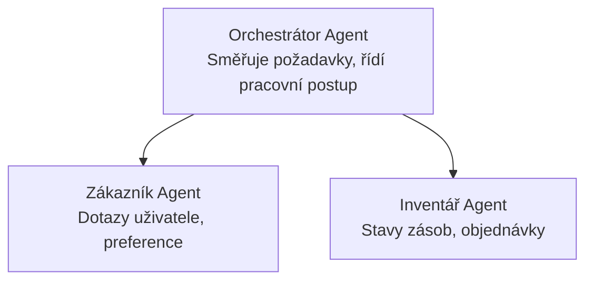

# Kapitola 5: Řešení AI s více agenty

**📚 Kurz**: [AZD pro začátečníky](../../README.md) | **⏱️ Doba trvání**: 2-3 hodiny | **⭐ Složitost**: Pokročilá

---

## Přehled

Tato kapitola pokrývá pokročilé vzory architektury pro více agentů, orchestraci agentů a produkční nasazení AI pro složité scénáře.

## Cíle učení

Po dokončení této kapitoly budete:
- Porozumět vzorům architektury více agentů
- Nasadit koordinované systémy agentů AI
- Implementovat komunikaci mezi agenty
- Vytvořit produkčně připravená řešení s více agenty

---

## 📚 Lekce

| # | Lekce | Popis | Čas |
|---|--------|-------------|------|
| 1 | [Maloobchodní řešení s více agenty](../../examples/retail-scenario.md) | Kompletní průvodce implementací | 90 min |
| 2 | [Koordinační vzory](../chapter-06-pre-deployment/coordination-patterns.md) | Strategie orchestrace agentů | 30 min |
| 3 | [Nasazení ARM šablony](../../examples/retail-multiagent-arm-template/README.md) | Nasazení jedním kliknutím | 30 min |

---

## 🚀 Rychlý start

```bash
# Možnost 1: Nasadit z šablony
azd init --template agent-openai-python-prompty
azd up

# Možnost 2: Nasadit z manifestu agenta (vyžaduje rozšíření azure.ai.agents)
azd extension install azure.ai.agents
azd ai agent init -m agent-manifest.yaml
azd up
```

> **Který přístup?** Použijte `azd init --template` pro začátek z funkční ukázky. Použijte `azd ai agent init`, když máte vlastní manifest agenta. Viz [Referenční příručka AZD AI CLI](../chapter-08-production/production-ai-practices.md#azd-ai-cli-commands-and-extensions) pro podrobnosti.

---

## 🤖 Architektura více agentů


---

## 🎯 Představené řešení: Maloobchodní řešení s více agenty

The [Retail Multi-Agent Solution](../../examples/retail-scenario.md) demonstrates:

- **Zákaznický agent**: Zpracovává interakce s uživatelem a preference
- **Agenta pro inventář**: Spravuje zásoby a zpracování objednávek
- **Orchestrátor**: Koordinuje mezi agenty
- **Sdílená paměť**: Správa kontextu napříč agenty

### Použité služby

| Služba | Účel |
|---------|---------|
| Microsoft Foundry Models | Porozumění přirozenému jazyku |
| Azure AI Search | Katalog produktů |
| Cosmos DB | Stav a paměť agentů |
| Container Apps | Hostování agentů |
| Application Insights | Monitoring |

---

## 🔗 Navigace

| Směr | Kapitola |
|-----------|---------|
| **Předchozí** | [Kapitola 4: Infrastruktura](../chapter-04-infrastructure/README.md) |
| **Další** | [Kapitola 6: Před nasazením](../chapter-06-pre-deployment/README.md) |

---

## 📖 Související zdroje

- [Průvodce AI agenty](../chapter-02-ai-development/agents.md)
- [Praktiky pro produkční AI](../chapter-08-production/production-ai-practices.md)
- [Odstraňování problémů AI](../chapter-07-troubleshooting/ai-troubleshooting.md)

---

<!-- CO-OP TRANSLATOR DISCLAIMER START -->
**Prohlášení o vyloučení odpovědnosti**:
Tento dokument byl přeložen pomocí AI překladatelské služby [Co-op Translator](https://github.com/Azure/co-op-translator). Ačkoli usilujeme o přesnost, mějte prosím na paměti, že automatizované překlady mohou obsahovat chyby nebo nepřesnosti. Původní dokument v jeho mateřském jazyce by měl být považován za rozhodující zdroj. U kritických informací se doporučuje profesionální lidský překlad. Nejsme odpovědní za žádná nedorozumění nebo chybné výklady vyplývající z použití tohoto překladu.
<!-- CO-OP TRANSLATOR DISCLAIMER END -->