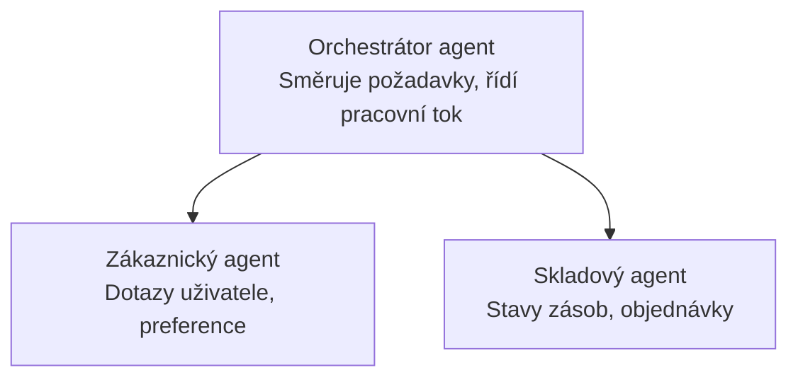

# Kapitola 5: Řešení AI s více agenty

**📚 Kurz**: [AZD For Beginners](../../README.md) | **⏱️ Doba trvání**: 2-3 hodiny | **⭐ Složitost**: Pokročilá

---

## Přehled

Tato kapitola pokrývá pokročilé vzory architektury více agentů, orchestraci agentů a nasazení AI připravené pro produkci pro složité scénáře.

> Ověřeno proti `azd 1.25.6` v červnu 2026.

## Výukové cíle

Po dokončení této kapitoly budete:
- Pochopit vzory víceagentní architektury
- Nasadit koordinované systémy AI agentů
- Implementovat komunikaci mezi agenty
- Postavit produkčně připravená víceagentní řešení

---

## 📚 Lekce

| # | Lekce | Popis | Doba |
|---|--------|-------------|------|
| 1 | [Multi-Agent Basics](multi-agent-basics.md) | Prakticky: nasadit funkční víceagentní aplikaci pomocí `azd up` | 45 min |
| 2 | [Coordination Patterns](../chapter-06-pre-deployment/coordination-patterns.md) | Strategie orchestrace agentů (pokračuje v kapitole 6) | 30 min |
| 3 | [ARM Template Deployment](../../examples/retail-multiagent-arm-template/README.md) | Příklad nasazení jedním kliknutím | 30 min |

> **Začněte Lekcí 1.** Je to jediná zcela praktická lekce, kterou lze nasadit. Lekce 2 je v kapitole 6 (sdílí se s plánováním před nasazením) a [Řešení pro maloobchod s více agenty](../../examples/retail-scenario.md) je architektonický nákres — návrhová reference, nikoli šablona pro jediné příkazové nasazení.

---

## 🚀 Rychlý start

```bash
# Možnost 1: Nasadit ze šablony
azd init --template agent-openai-python-prompty
azd up

# Možnost 2: Nasadit z manifestu agenta (vyžaduje rozšíření azure.ai.agents)
azd extension install azure.ai.agents
azd ai agent init -m agent-manifest.yaml
azd up
```

> **Který přístup?** Použijte `azd init --template` pro zahájení z pracovního vzorku. Použijte `azd ai agent init`, když máte vlastní manifest agenta. Viz [Referenční příručka AZD AI CLI](../chapter-08-production/production-ai-practices.md#azd-ai-cli-commands-and-extensions) pro úplné informace.

---

## 🤖 Architektura víceagentních systémů



---

## 🎯 Vybrané řešení: Maloobchodní víceagentní řešení

The [Retail Multi-Agent Solution](../../examples/retail-scenario.md) demonstrates:

- **Customer Agent**: Zpracovává uživatelské interakce a preference
- **Inventory Agent**: Spravuje zásoby a zpracování objednávek
- **Orchestrator**: Koordinuje mezi agenty
- **Shared Memory**: Správa kontextu napříč agenty

### Použité služby

| Služba | Účel |
|---------|---------|
| Microsoft Foundry Models | Porozumění jazyku |
| Azure AI Search | Katalog produktů |
| Cosmos DB | Stav a paměť agentů |
| Container Apps | Hostování agentů |
| Application Insights | Monitorování |

---

## 🔗 Navigace

| Směr | Kapitola |
|-----------|---------|
| **Předchozí** | [Kapitola 4: Infrastructure](../chapter-04-infrastructure/README.md) |
| **Další** | [Kapitola 6: Před nasazením](../chapter-06-pre-deployment/README.md) |

---

## 📖 Související zdroje

- [Průvodce AI agenty](../chapter-02-ai-development/agents.md)
- [Postupy pro produkční AI](../chapter-08-production/production-ai-practices.md)
- [Řešení problémů s AI](../chapter-07-troubleshooting/ai-troubleshooting.md)

---

<!-- CO-OP TRANSLATOR DISCLAIMER START -->
**Prohlášení o omezení odpovědnosti**:
Tento dokument byl přeložen pomocí AI překladatelské služby [Co-op Translator](https://github.com/Azure/co-op-translator). Přestože usilujeme o co největší přesnost, mějte prosím na paměti, že automatizované překlady mohou obsahovat chyby nebo nepřesnosti. Originální dokument v jeho mateřském jazyce by měl být považován za autoritativní zdroj. Pro kritické informace se doporučuje profesionální lidský překlad. Nejsme odpovědní za jakékoli nedorozumění nebo nesprávné interpretace vzniklé použitím tohoto překladu.
<!-- CO-OP TRANSLATOR DISCLAIMER END -->