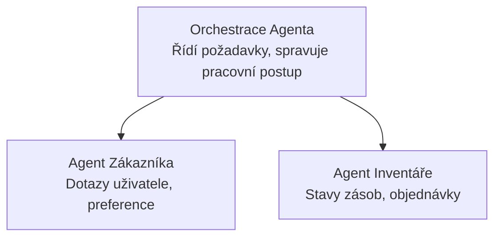

# Kapitola 5: Řešení s více agenty v AI

**📚 Kurz**: [AZD pro začátečníky](../../README.md) | **⏱️ Doba trvání**: 2-3 hodiny | **⭐ Složitost**: Pokročilá

---

## Přehled

Tato kapitola pokrývá pokročilé vzory architektury více agentů, orchestraci agentů a produkční nasazení AI pro složité scénáře.

> Ověřeno s verzí `azd 1.27.1` v červenci 2026.

## Cíle učení

Dokončením této kapitoly budete:
- Rozumět vzorům architektury více agentů
- Nasazovat koordinované systémy AI agentů
- Implementovat komunikaci agent-agent
- Vytvářet produkčně připravená řešení více agentů

---

## 📚 Lekce

| # | Lekce | Popis | Čas |
|---|--------|-------------|------|
| 1 | [Základy více agentů](multi-agent-basics.md) | Praktické: nasazení funkční aplikace s více agenty pomocí `azd up` | 45 min |
| 2 | [Koordinační vzory](../chapter-06-pre-deployment/coordination-patterns.md) | Strategie orchestrací agentů (pokračování v kapitole 6) | 30 min |
| 3 | [Nasazení šablony ARM](../../examples/retail-multiagent-arm-template/README.md) | Příklad nasazení jedním kliknutím | 30 min |

> **Začněte lekcí 1.** Je to jediná plně praktická a nasaditelná lekce v této kapitole. Lekce 2 je v kapitole 6 (je sdílená s přednasazením) a [Retail Multi-Agent Solution](../../examples/retail-scenario.md) je architektonický vzor – designová reference, ne šablona na jedno příkazové nasazení.

---

## 🚀 Rychlý start

```bash
# Možnost 1: Nasadit z šablony
azd init --template agent-openai-python-prompty
azd up

# Možnost 2: Nasadit z manifestu agenta (vyžaduje rozšíření azure.ai.agents)
azd extension install azure.ai.agents
azd ai agent init -m agent-manifest.yaml
azd up
```

> **Který přístup?** Použijte `azd init --template` pro start z fungujícího vzoru. Použijte `azd ai agent init`, pokud máte vlastní manifest agenta. Kompletní detaily najdete v [referenci AZD AI CLI](../chapter-08-production/production-ai-practices.md#azd-ai-cli-commands-and-extensions).

---

## 🤖 Architektura více agentů



---

## 🎯 Vybrané řešení: Retail Multi-Agent

[Retail Multi-Agent Solution](../../examples/retail-scenario.md) předvádí:

- **Agent zákazníka**: Spravuje interakce s uživateli a preference
- **Agent skladu**: Řídí zásoby a zpracování objednávek
- **Orchestrátor**: Koordinuje mezi agenty
- **Sdílená paměť**: Správa kontextu mezi agenty

### Použité služby

| Služba | Účel |
|---------|---------|
| Microsoft Foundry Models | Porozumění jazyku |
| Azure AI Search | Produktový katalog |
| Cosmos DB | Stav a paměť agenta |
| Container Apps | Hostování agenta |
| Application Insights | Monitorování |

---

## 🔗 Navigace

| Směr | Kapitola |
|-----------|---------|
| **Předchozí** | [Kapitola 4: Infrastruktura](../chapter-04-infrastructure/README.md) |
| **Další** | [Kapitola 6: Přednasazení](../chapter-06-pre-deployment/README.md) |

---

## 📖 Související zdroje

- [Průvodce AI agenty](../chapter-02-ai-development/agents.md)
- [Produkční AI praktiky](../chapter-08-production/production-ai-practices.md)
- [Řešení problémů AI](../chapter-07-troubleshooting/ai-troubleshooting.md)

---

<!-- CO-OP TRANSLATOR DISCLAIMER START -->
**Prohlášení o omezení odpovědnosti**:
Tento dokument byl přeložen pomocí AI překladatelské služby [Co-op Translator](https://github.com/Azure/co-op-translator). Přestože usilujeme o co největší přesnost, mějte prosím na paměti, že automatizované překlady mohou obsahovat chyby nebo nepřesnosti. Originální dokument v jeho mateřském jazyce by měl být považován za autoritativní zdroj. Pro kritické informace se doporučuje profesionální lidský překlad. Nejsme odpovědní za jakékoli nedorozumění nebo nesprávné interpretace vzniklé použitím tohoto překladu.
<!-- CO-OP TRANSLATOR DISCLAIMER END -->