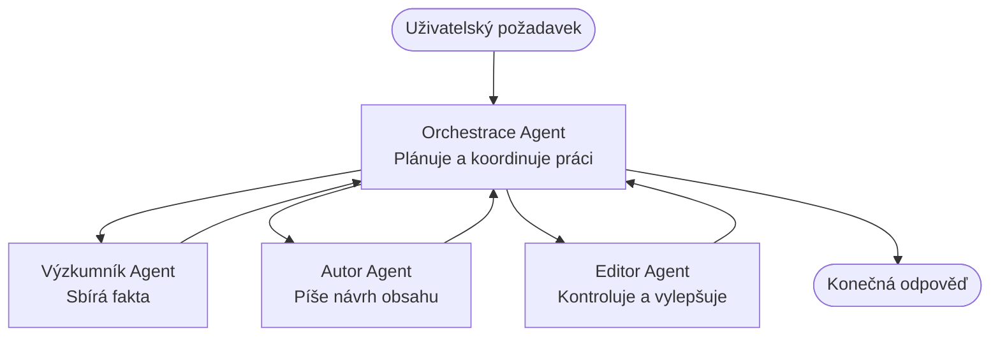

# Základy víceagentních systémů – Nasazení prvního koordinovaného AI systému

**Navigace kapitolou:**
- **📚 Domů ke kurzu**: [AZD pro začátečníky](../../README.md)
- **📖 Aktuální kapitola**: Kapitola 5 – Víceagentní AI řešení
- **⬅️ Předchozí**: [Kapitola 4: Infrastruktura](../chapter-04-infrastructure/README.md)
- **➡️ Další**: [Koordinační vzory](../chapter-06-pre-deployment/coordination-patterns.md)

> Validováno pomocí `azd 1.27.1` v červenci 2026.

## Úvod

V předchozích kapitolách jste nasadili jednu aplikaci—v kapitole 2 jste nasadili jednoho AI agenta. Tato lekce podniká další krok: nasazení **víceagentního systému**, kde několik specializovaných agentů spolupracuje na řešení problému, který by sám jeden agent nezvládl dobře.

Dobrá zpráva pro začátečníky: **nepotřebujete žádné nové příkazy.** Víceagentní řešení je stále azd projekt. Budete `azd init`, `azd up`, testovat a `azd down`—přesně ten pracovní postup, který již znáte. Co se mění, je *tvar* aplikace uvnitř.

## Cíle učení

Do konce této lekce:
- Pochopíte, co znamená „víceagentní“ a kdy se vyplatí složitější přístup
- Rozpoznáte běžné role ve víceagentním systému (orchestrátor + specialisté)
- Nasadíte skutečnou, funkční víceagentní šablonu pomocí `azd up`
- Pochopíte Azure zdroje, které stojí za víceagentní aplikací
- Budete umět ověřit, přizpůsobit a bezpečně zrušit řešení

## Výsledky učení

Po dokončení lekce budete schopni:
- Vysvětlit rozdíl mezi jednolivým agentem a víceagentním systémem
- Vybrat mezi jedním agentem s nástroji a skutečným víceagentním designem
- End-to-end nasadit a testovat víceagentní šablonu s azd
- Identifikovat, kde který agent běží a jak spolu komunikují
- Vyčistit všechny zdroje, abyste předešli průběžným nákladům

---

## Co je víceagentní systém?

Jeden AI agent je jeden model s danou sadou instrukcí a (volitelně) několika nástroji. To dobře funguje pro zaměřené úkoly. Ale jak úkol roste—výzkum, pak psaní, pak editace, pak ověřování faktů—integration všeho do jednoho promptu způsobuje, že agent je pomalejší, méně spolehlivý a těžší na debugování.

**Víceagentní systém** rozdělí práci mezi specialisty, kteří každý dobře zvládnou jednu část, koordinované orchestrátorem:



### Dvě role, které vždy uvidíte

| Role | Úkol | Příklad |
|------|------|---------|
| **Orchestrátor** | Rozhoduje, *co bude dál* a přerozděluje práci mezi agenty | „Nejprve výzkum, pak psaní, nakonec editace“ |
| **Specialista** | Dělá jeden zaměřený úkol a vrací výsledek | „výzkumník“, který pouze shromažďuje fakta |

### Opravdu potřebujete víc agentů?

Začněte jednoduše. Použijte více agentů **pouze** pokud platí některá z těchto podmínek:

- ✅ Úkol má **jasně rozlišitelné fáze**, které vyžadují různé instrukce (výzkum vs. psaní vs. revize)
- ✅ Chcete specialisty běžící **současně**, abyste ušetřili čas
- ✅ Různé kroky vyžadují **různé nástroje nebo zdroje dat**
- ✅ Každý krok je potřeba **samostatně testovat a ladit**

Pokud je váš úkol jednoduchá otázka a odpověď nebo volání jednoduchého nástroje, **jeden agent s nástroji** (kapitola 2) je jednodušší, levnější a snadněji provozovatelný.

> **Tip pro začátečníky:** „Více agentů“ není „lepší.“ Každý agent přidává zpoždění, náklady a další věc k monitorování. Přidávejte agenty jen když je problém jasně rozdělen na části.

---

## Dva způsoby, jak postavit víceagentní systém na Azure

| Přístup | Co to je | Nejlepší použití |
|----------|----------|----------|
| **Jeden agent + nástroje** | Jeden Foundry agent, který volá funkce/nástroje | Jednoduché pracovní postupy, začátečníci |
| **Více koordinovaných agentů** | Několik agentů s orchestrátorem | Jasné fáze, paralelní práce, specializace |

Tato lekce se zaměřuje na druhý přístup s použitím **hotové šablony**, abyste viděli skutečný víceagentní systém v akci, než si postavíte vlastní.

---

## Prakticky: Nasazení funkční víceagentní aplikace

Nasadíme **Contoso Creative Writer**, oficiální ukázku Azure, která používá více agentů (výzkumník, spisovatel, editor) koordinovaných k vytvoření článku. Je to skvělá první víceagentní appka, protože role jsou snadno pochopitelné.

### Krok 1: Inicializace šablony

```bash
# Vytvořit pracovní složku
mkdir creative-writer && cd creative-writer

# Inicializovat z oficiálního šablony pro více agentů
azd init --template contoso-creative-writer
```

> Prohlédněte si kdykoli více víceagentních šablon v [Awesome AZD AI galerii](https://azure.github.io/awesome-azd/?tags=ai). Další možnosti pro začátečníky jsou `get-started-with-ai-agents` a `azure-ai-travel-agents`.

### Krok 2: Autentizace

```bash
# Vyžadováno pro azd pracovní postupy
azd auth login
```

### Krok 3: Vytvoření prostředí

```bash
azd env new dev
```

### Krok 4: Náhled a poté nasazení

```bash
# Podívejte se, co bude vytvořeno, než něco utratíte (doporučeno)
azd provision --preview

# Zajistěte infrastrukturu a nasazujte všechny agenty v jednom kroku
azd up
```

`azd up` vás požádá o předplatné a oblast, pak připraví Azure zdroje a nasadí aplikaci. AI nasazení může trvat déle než jednoduchá webová aplikace—pokud nasazujete větší modely, můžete prodloužit timeout nasazení:

```bash
azd deploy --timeout 1800
```

> **Pozor na náklady a kapacitu:** Víceagentní aplikace nasazují AI modely, které vybírají kvótu a způsobují náklady. Pokud `azd up` selže kvůli kvótě modelu, viz [AI Řešení problémů](../chapter-07-troubleshooting/ai-troubleshooting.md) pro opravu oblasti a kvót, a kapitola 6 [Plánování kapacity](../chapter-06-pre-deployment/capacity-planning.md).

---

## Porozumění tomu, co jste nasadili

Typická víceagentní aplikace jako tato nasazuje sadu Azure zdrojů, které přímo odpovídají odpovědnostem na výše uvedeném diagramu:

| Zdroj | Proč je tam |
|----------|-------------|
| **Microsoft Foundry / Modely** | Hostuje jazykové modely, které každý agent používá |
| **Azure AI Search** | Dává výzkumnému agentovi podložená data k hledání |
| **Container Apps** (nebo App Service) | Hostí kód orchestrátora a agentů |
| **Cosmos DB** (v některých příkladech) | Ukládá sdílený stav/paměť mezi agenty |
| **Application Insights** | Sleduje požadavky *mezi* agenty, aby bylo možné ladit průběh |

### Jak si agenti mezi sebou komunikují

Ve většině azd víceagentních příkladů **orchestrátor běží ve vašem aplikačním kódu** (například pomocí frameworku Semantic Kernel nebo Microsoft Agent Framework). Orchestrátor volá jednotlivé specialisty po řadě, předává výsledky a sestavuje finální odpověď. Agenti sdílejí kontext prostřednictvím:

- **Volání funkcí/nástrojů** — orchestrátor vyvolá specialistu a získá zpět výsledek
- **Sdílená paměť** — databáze (často Cosmos DB), která drží stav čitelný oběma agenty
- **Zprávy/události** — pro volnější svázání komunikují agenti přes frontu nebo Service Bus

> **Proč je to důležité pro ladění:** protože každý krok je samostatný, Application Insights vám ukáže, *který* agent byl pomalý nebo selhal. To je hlavní důvod rozdělení práce mezi agentů.

---

## Ověřte nasazení

Potvrďte, že systém skutečně funguje, než budete pokračovat:

```bash
# Zobrazit nasazené koncové body
azd show

# Otevřít monitorovací panel aplikace
azd monitor

# Sledovat výstup logů, pokud něco vypadá podezřele
azd monitor --logs
```

Pak otevřete URL aplikace z `azd show` a vyzkoušejte požadavek, který využije všechny agenty (u Creative Writer požádejte o napsání krátkého článku na téma). V Application Insights **transaction search** byste měli vidět, jak se požadavek rozpadá přes kroky výzkumník, spisovatel a editor.

**Kritéria úspěchu:**
- ✅ `azd show` vypíše dosažitelný endpoint
- ✅ Požadavek vytvoří výsledek, který jasně prošel několika fázemi
- ✅ Application Insights ukazuje stopy pro více než jeden krok agenta

---

## Přizpůsobení: Přidání nebo úprava agenta

Protože každý agent je jen instrukce plus nástroje, přizpůsobení je přístupné:

1. **Najděte definice agentů** ve šabloně (často sada souborů `prompts/`, `agents/` nebo `*.prompty`).
2. **Doladění instrukcí agenta** — např. řekněte editorovi vynucovat specifický tón nebo počet slov.
3. **Znovu nasadit pouze kód** (infrastruktura zůstává beze změny):

   ```bash
   azd deploy
   ```

Pro další kroky a tvorbu agentů z *vlastního* manifestu použijte rozšíření agenta a jeho kompletní životní cyklus:

```bash
azd extension install azure.ai.agents
azd ai agent init -m agent-manifest.yaml
azd up
azd ai agent invoke      # test, s časováním odpovědi
```

Viz [Kapitola 2: Agenti](../chapter-02-ai-development/agents.md) a [AZD AI CLI reference](../chapter-08-production/production-ai-practices.md#azd-ai-cli-commands-and-extensions) pro kompletní životní cyklus agenta (`invoke`, `eval generate`, `optimize`, `delete`).

---

## Úklid

Víceagentní aplikace provozují více zpoplatněných služeb. Po dokončení vše odstraňte:

```bash
azd down --force --purge
```

Přepínač `--purge` také odstraní soft-deleteované AI zdroje (jako Foundry/Azure AI Services účty), aby neblokovaly budoucí nasazení a nepřinášely další náklady.

---

## Poznámka k produkčním víceagentním systémům

[Retail Multi-Agent Solution](../../examples/retail-scenario.md) v tomto repozitáři je **architektonický plán**, ne šablona na jedno kliknutí—dokumentuje, jak by se produkční maloobchodní systém postavil (a je explicitní, že kompletní stavba je značný úkol). Použijte ji jako návrhovou pomůcku *poté*, co nasadíte funkční vzorek zde. Pro produkční otázky (odolnost, náklady, monitoring, správa) pokračujte do [Kapitola 8: Produkční AI praktiky](../chapter-08-production/production-ai-practices.md).

---

## Shrnutí

- Víceagentní systém rozděluje práci mezi specialisty koordinované orchestrátorem.
- Používejte jej pouze, když úkol má jasné fáze, paralelismus nebo různé nástroje pro každý krok—jinak upřednostněte jednoho agenta.
- Workflow azd se nemění: `azd init` → `azd up` → test → `azd down`.
- Skutečná šablona jako `contoso-creative-writer` vám dnes umožní vidět a přizpůsobit funkční víceagentní aplikaci.
- Sledování v Application Insights napříč agenty je jednou z největších praktických výhod víceagentního designu.

---

## 🔗 Navigace

| Směr | Lekce |
|-------|--------|
| **Předchozí** | [Kapitola 4: Infrastruktura](../chapter-04-infrastructure/README.md) |
| **Další** | [Koordinační vzory](../chapter-06-pre-deployment/coordination-patterns.md) |

## 📖 Související zdroje

- [Průvodce AI agenty](../chapter-02-ai-development/agents.md)
- [Koordinační vzory](../chapter-06-pre-deployment/coordination-patterns.md)
- [Produkční AI praktiky](../chapter-08-production/production-ai-practices.md)
- [AI Řešení problémů](../chapter-07-troubleshooting/ai-troubleshooting.md)

---

<!-- CO-OP TRANSLATOR DISCLAIMER START -->
**Prohlášení o omezení odpovědnosti**:
Tento dokument byl přeložen pomocí AI překladatelské služby [Co-op Translator](https://github.com/Azure/co-op-translator). Přestože usilujeme o co největší přesnost, mějte prosím na paměti, že automatizované překlady mohou obsahovat chyby nebo nepřesnosti. Originální dokument v jeho mateřském jazyce by měl být považován za autoritativní zdroj. Pro kritické informace se doporučuje profesionální lidský překlad. Nejsme odpovědní za jakékoli nedorozumění nebo nesprávné interpretace vzniklé použitím tohoto překladu.
<!-- CO-OP TRANSLATOR DISCLAIMER END -->