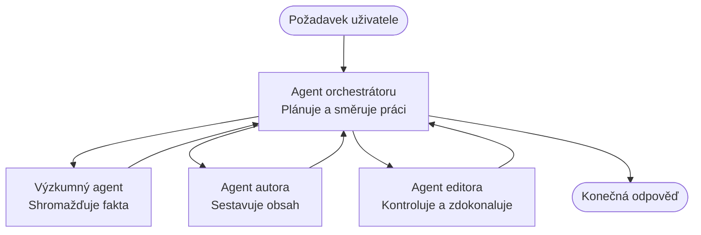

# Základy multiagentních systémů - Nasazení vašeho prvního koordinovaného AI systému

**Navigace kapitol:**
- **📚 Domov kurzu**: [AZD For Beginners](../../README.md)
- **📖 Aktuální kapitola**: Chapter 5 - Multi-Agent AI Solutions
- **⬅️ Předchozí**: [Chapter 4: Infrastructure](../chapter-04-infrastructure/README.md)
- **➡️ Další**: [Coordination Patterns](../chapter-06-pre-deployment/coordination-patterns.md)

> Validováno proti `azd 1.25.6` v červnu 2026.

## Úvod

V předchozích kapitolách jste nasadili jednu aplikaci—a v kapitole 2 jste nasadili jednoho AI agenta. Tato lekce jde o krok dál: nasazení **multiagentního systému**, kde několik specializovaných agentů spolupracuje na řešení problému, který by jeden agent sám nedokázal dobře zvládnout.

Dobrá zpráva pro začátečníky: **nepotřebujete nové příkazy.** Multiagentní řešení je stále azd projekt. Budete dělat `azd init`, `azd up`, testovat a `azd down`—přesně ten pracovní postup, který už znáte. Co se mění, je *podoba* aplikace uvnitř.

## Cíle učení

Na konci této lekce budete:
- Rozumět, co znamená „multiagentní“ a kdy se vyplatí přidat složitost navíc
- Rozpoznat běžné role v multiagentním systému (orchestrátor + specialisté)
- Nasadit reálnou, fungující multiagentní šablonu pomocí `azd up`
- Pochopit Azure zdroje, které stojí za multiagentní aplikací
- Vědět, jak ověřit, upravit a bezpečně odstranit řešení

## Výstupy učení

Po dokončení této lekce budete schopni:
- Vysvětlit rozdíl mezi jedním agentem a multiagentním systémem
- Vybrat mezi jedním agentem s nástroji a skutečným multiagentním návrhem
- Nasadit a otestovat multiagentní šablonu end-to-end pomocí azd
- Určit, kde každý agent běží a jak spolu komunikují
- Odstranit všechny zdroje, aby nevznikaly průběžné poplatky

---

## Co je multiagentní systém?

Jeden AI agent je jeden model s množinou instrukcí a (volitelně) některými nástroji. To funguje dobře pro cílené úkoly. Ale jak úkol roste—výzkum, pak psaní, pak editace, pak kontrola faktů—narávání všeho do jednoho promptu zpomaluje agenta, snižuje spolehlivost a ztěžuje ladění.

**Multiagentní systém** rozdělí práci na specialisty, z nichž každý dělá jednu věc dobře, koordinované orchestrátorem:



### Dvě role, které uvidíte vždy

| Role | Úkol | Příklad |
|------|------|---------|
| **Orchestrátor** | Rozhoduje *co se stane dál* a směruje práci mezi agenty | „Nejprve výzkum, pak psaní, pak editace“ |
| **Specialista** | Dělá jednu zaměřenou práci a vrací výsledek | „výzkumník“, který pouze shromažďuje fakta |

### Potřebujete skutečně více agentů?

Začněte jednoduše. Sáhněte po multiagentním řešení **pouze** když platí některé z těchto podmínek:

- ✅ Úkol má **oddělené fáze**, které profitují z různých instrukcí (výzkum vs. psaní vs. kontrola)
- ✅ Chcete, aby specialisté běželi **paralelně**, aby ušetřili čas
- ✅ Různé kroky potřebují **různé nástroje nebo zdroje dat**
- ✅ Potřebujete, aby každý krok byl **nezávisle testovatelný a laditelný**

Pokud je váš úkol jednoduchá otázka a odpověď nebo jednoduché volání nástroje, **jeden agent s nástroji** (Kapitola 2) je jednodušší, levnější a snadněji spravovatelný.

> **Tip pro začátečníky:** „Více agentů“ není vždy „lepší“. Každý agent přidává latenci, náklady a novou věc k monitorování. Přidejte agenty pouze tehdy, když se problém jasně dělí na části.

---

## Dva způsoby, jak postavit multiagentní řešení na Azure

| Přístup | Co to je | Vhodné pro |
|---------|----------|------------|
| **Jeden agent + nástroje** | Jeden Foundry agent, který volá funkce/nástroje | Jednoduché toky práce, začátečníci |
| **Více koordinovaných agentů** | Několik agentů s orchestrátorem | Oddělené fáze, paralelní práce, specializace |

Tato lekce se zaměřuje na druhý přístup pomocí **připravené šablony**, abyste viděli reálný multiagentní systém v provozu dříve, než si postavíte vlastní.

---

## Prakticky: Nasazení fungující multiagentní aplikace

Nasadíme **Contoso Creative Writer**, oficiální ukázku Azure, která používá více agentů (výzkumník, spisovatel, editor) koordinovaných k vytvoření článku. Je to skvělá první multiagentní aplikace, protože role jsou snadno pochopitelné.

### Krok 1: Inicializujte šablonu

```bash
# Vytvořte pracovní složku
mkdir creative-writer && cd creative-writer

# Inicializujte z oficiální šablony pro více agentů
azd init --template contoso-creative-writer
```

> Prohlédněte si další multiagentní šablony kdykoli v [Awesome AZD AI gallery](https://azure.github.io/awesome-azd/?tags=ai). Další přívětivé možnosti pro začátečníky zahrnují `get-started-with-ai-agents` a `azure-ai-travel-agents`.

### Krok 2: Autentizace

```bash
# Vyžadováno pro azd pracovní postupy
azd auth login
```

### Krok 3: Vytvoření prostředí

```bash
azd env new dev
```

### Krok 4: Náhled a poté nasazení

```bash
# Podívejte se, co bude vytvořeno, než něco utratíte (doporučeno)
azd provision --preview

# Zajistit infrastrukturu a nasadit všechny agenty v jednom kroku
azd up
```

`azd up` vás vyzve k výběru subscription a regionu, poté vytvoří Azure zdroje a nasadí aplikaci. AI nasazení mohou trvat déle než jednoduchá webová aplikace—pokud nasazujete větší modely, můžete prodloužit timeout nasazení:

```bash
azd deploy --timeout 1800
```

> **Pozor na náklady a kapacitu:** Multiagentní aplikace nasazují AI modely, které spotřebovávají kvótu a způsobují náklady. Pokud `azd up` selže kvůli kvótě modelu, viz [AI Troubleshooting](../chapter-07-troubleshooting/ai-troubleshooting.md) pro opravy regionů a kvót a Kapitolu 6 [Capacity Planning](../chapter-06-pre-deployment/capacity-planning.md).

---

## Pochopení toho, co jste nasadili

Typická multiagentní aplikace jako tato zřídí soubor Azure zdrojů, které se přímo mapují na odpovědnosti v diagramu výše:

| Zdroj | Proč tu je |
|-------|-----------|
| **Microsoft Foundry / Models** | Hostuje jazykové modely, které každý agent používá |
| **Azure AI Search** | Dává výzkumnému agentovi podkladová data k prohledávání |
| **Container Apps** (nebo App Service) | Hostuje orchestrátora a kód agentů |
| **Cosmos DB** (v některých ukázkách) | Ukládá sdílený stav/paměť předávanou mezi agenty |
| **Application Insights** | Sledování požadavků *napříč* agenty, abyste mohli ladit tok |

### Jak spolu agenti komunikují

Ve většině azd multiagentních ukázek **orchestrátor běží ve vašem aplikačním kódu** (například pomocí frameworku jako Semantic Kernel nebo Microsoft Agent Framework). Orchestrátor volá každého specializovaného agenta postupně, předává výsledky a sestavuje finální odpověď. Agenti sdílí kontext prostřednictvím:

- **Volání funkcí/nástrojů** — orchestrátor zavolá specialistu a získá výsledek zpět
- **Sdílené paměti** — databáze (často Cosmos DB) uchovává stav, který oba agenti mohou číst
- **Zpráv/událostí** — pro volnější vazbu komunikují agenti přes frontu nebo Service Bus

> **Proč je to důležité pro ladění:** protože každý krok je oddělený, Application Insights vám ukáže *který* agent byl pomalý nebo selhal. To je hlavní důvod, proč rozdělit práci mezi agenty.

---

## Ověření nasazení

Ověřte, že systém skutečně funguje, než budete pokračovat:

```bash
# Zobrazit nasazené koncové body
azd show

# Otevřít monitorovací panel aplikace
azd monitor

# Sledovat logy, pokud něco nevypadá v pořádku
azd monitor --logs
```

Pak otevřete URL aplikace z `azd show` a vyzkoušejte požadavek, který prověří všechny agenty (pro Creative Writer požádejte o napsání krátkého článku na téma). V Application Insights v **transaction search** byste měli vidět, jak se požadavek rozvětvuje přes kroky výzkumníka, spisovatele a editora.

**Kritéria úspěchu:**
- ✅ `azd show` vypíše dosažitelný endpoint
- ✅ Požadavek vygeneruje výsledek, který jasně prošel více fázemi
- ✅ Application Insights ukazuje trace pro více než jeden krok agenta

---

## Přizpůsobení: Přidat nebo upravit agenta

Protože každý agent je jen sada instrukcí plus nástroje, úpravy jsou přístupné:

1. **Najděte definice agentů** ve šabloně (často `prompts/`, `agents/` nebo `*.prompty` sady souborů).
2. **Doladěte instrukce agenta** — například řekněte editorovi, aby vynucoval konkrétní tón nebo rozsah slov.
3. **Znovu nasadíte pouze kód** (infrastruktura zůstává beze změny):

   ```bash
   azd deploy
   ```

Chcete-li jít dále a vytvářet agenty z *vlastního* manifestu, použijte agent extension a jeho plný životní cyklus:

```bash
azd extension install azure.ai.agents
azd ai agent init -m agent-manifest.yaml
azd up
azd ai agent invoke      # test, s časováním odpovědi
```

Viz [Chapter 2: Agents](../chapter-02-ai-development/agents.md) a [AZD AI CLI reference](../chapter-08-production/production-ai-practices.md#azd-ai-cli-commands-and-extensions) pro kompletní životní cyklus agentů (`invoke`, `eval generate`, `optimize`, `delete`).

---

## Úklid

Multiagentní aplikace provozují více služeb, za které se platí. Odstraňte vše, když skončíte:

```bash
azd down --force --purge
```

Přepínač `--purge` také odstraní soft-deleted AI zdroje (jako Foundry/Azure AI Services účty), aby nezablokovaly budoucí redeploy nebo nadále nezpůsobovaly náklady.

---

## Poznámka k produkčním multiagentním systémům

[Retail Multi-Agent Solution](../../examples/retail-scenario.md) v tomto repu je **architektonická šablona**, nikoli šablona pro jeden příkaz—dokumentuje, jak by byl produkční retail systém *postaven* (a explicitně uvádí, že plná realizace je značný úkol). Použijte ji jako návrhovou referenci *poté*, co nasadíte fungující ukázku zde. Pro produkční záležitosti (odolnost, náklady, monitorování, správa) pokračujte do [Chapter 8: Production AI Practices](../chapter-08-production/production-ai-practices.md).

---

## Shrnutí

- Multiagentní systém rozděluje práci mezi specialisty koordinované orchestrátorem.
- Použijte jej pouze, když úkol má oddělené fáze, paralelismus nebo různé nástroje pro jednotlivé kroky—jinak preferujte jediného agenta.
- Pracovní postup azd se nemění: `azd init` → `azd up` → test → `azd down`.
- Reálná šablona jako `contoso-creative-writer` vám umožní dnes vidět a přizpůsobit fungující multiagentní aplikaci.
- Sledování Application Insights napříč agenty je jedním z největších praktických přínosů multiagentního návrhu.

---

## 🔗 Navigace

| Směr | Lekce |
|------|-------|
| **Předchozí** | [Chapter 4: Infrastructure](../chapter-04-infrastructure/README.md) |
| **Další** | [Coordination Patterns](../chapter-06-pre-deployment/coordination-patterns.md) |

## 📖 Související zdroje

- [Průvodce AI agenty](../chapter-02-ai-development/agents.md)
- [Koordinační vzory](../chapter-06-pre-deployment/coordination-patterns.md)
- [Produkční AI praktiky](../chapter-08-production/production-ai-practices.md)
- [Řešení problémů s AI](../chapter-07-troubleshooting/ai-troubleshooting.md)

---

<!-- CO-OP TRANSLATOR DISCLAIMER START -->
**Prohlášení o omezení odpovědnosti**:
Tento dokument byl přeložen pomocí AI překladatelské služby [Co-op Translator](https://github.com/Azure/co-op-translator). Přestože usilujeme o co největší přesnost, mějte prosím na paměti, že automatizované překlady mohou obsahovat chyby nebo nepřesnosti. Originální dokument v jeho mateřském jazyce by měl být považován za autoritativní zdroj. Pro kritické informace se doporučuje profesionální lidský překlad. Nejsme odpovědní za jakékoli nedorozumění nebo nesprávné interpretace vzniklé použitím tohoto překladu.
<!-- CO-OP TRANSLATOR DISCLAIMER END -->