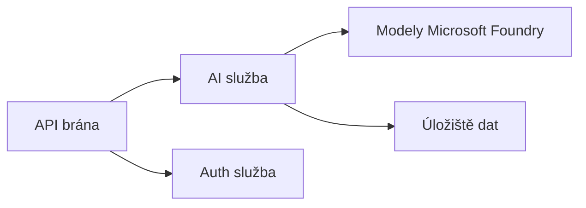

# Kapitola 8: Produkční a podnikové vzory

**📚 Kurz**: [AZD pro začátečníky](../../README.md) | **⏱️ Doba trvání**: 2-3 hodiny | **⭐ Složitost**: Pokročilá

---

## Přehled

Tato kapitola pokrývá podnikové vzory pro nasazení, zabezpečení, monitorování a optimalizaci nákladů produkčních AI úloh.

> Ověřeno na `azd 1.27.1` v červenci 2026.

## Výukové cíle

Po dokončení této kapitoly budete:
- Nasazovat aplikace odolné v několika regionech
- Implementovat podnikové vzory zabezpečení
- Nakonfigurovat komplexní monitorování
- Optimalizovat náklady ve velkém měřítku
- Nastavit CI/CD pipeline s AZD

---

## 📚 Lekce

| # | Lekce | Popis | Čas |
|---|--------|-------------|------|
| 1 | [Produkční AI praktiky](production-ai-practices.md) | Podnikové vzory nasazení | 90 min |

---

## 🚀 Produkční kontrolní seznam

- [ ] Nasazení v několika regionech pro odolnost
- [ ] Spravovaná identita pro autentizaci (bez klíčů)
- [ ] Application Insights pro monitorování
- [ ] Nastavení rozpočtů a upozornění na náklady
- [ ] Povolené skenování zabezpečení
- [ ] Integrace CI/CD pipeline
- [ ] Plán obnovy po havárii

---

## 🏗️ Architektonické vzory

### Vzor 1: Microservices AI



### Vzor 2: Událostmi řízené AI


---

## 🔐 Nejlepší bezpečnostní praktiky

```bicep
// Use managed identity
identity: {
  type: 'SystemAssigned'
}

// Private endpoints for AI services
properties: {
  publicNetworkAccess: 'Disabled'
  networkAcls: {
    defaultAction: 'Deny'
  }
}
```

---

## 💰 Optimalizace nákladů

| Strategie | Úspory |
|----------|---------|
| Škálování na nulu (Container Apps) | 60-80 % |
| Použití režimů spotřeby pro vývoj | 50-70 % |
| Plánované škálování | 30-50 % |
| Rezervovaná kapacita | 20-40 % |

```bash
# Nastavit upozornění rozpočtu
az consumption budget create \
  --budget-name "AI-Budget" \
  --amount 500 \
  --category Cost \
  --time-grain Monthly
```

---

## 📊 Nastavení monitorování

```bash
# Streamujte protokoly
azd monitor --logs

# Zkontrolujte Application Insights
azd monitor --overview

# Zobrazit metriky
az monitor metrics list --resource <resource-id>
```

---

## 🔗 Navigace

| Směr | Kapitola |
|-----------|---------|
| **Předchozí** | [Kapitola 7: Odstraňování problémů](../chapter-07-troubleshooting/README.md) |
| **Kurz dokončen** | [Domů kurzu](../../README.md) |

---

## 📖 Související zdroje

- [Průvodce AI agenty](../chapter-02-ai-development/agents.md)
- [Application Insights](../chapter-06-pre-deployment/application-insights.md)
- [Řešení s více agenty](../chapter-05-multi-agent/README.md)
- [Příklad microservices](../../examples/microservices/README.md)

---

<!-- CO-OP TRANSLATOR DISCLAIMER START -->
**Prohlášení o omezení odpovědnosti**:
Tento dokument byl přeložen pomocí AI překladatelské služby [Co-op Translator](https://github.com/Azure/co-op-translator). Přestože usilujeme o co největší přesnost, mějte prosím na paměti, že automatizované překlady mohou obsahovat chyby nebo nepřesnosti. Originální dokument v jeho mateřském jazyce by měl být považován za autoritativní zdroj. Pro kritické informace se doporučuje profesionální lidský překlad. Nejsme odpovědní za jakékoli nedorozumění nebo nesprávné interpretace vzniklé použitím tohoto překladu.
<!-- CO-OP TRANSLATOR DISCLAIMER END -->