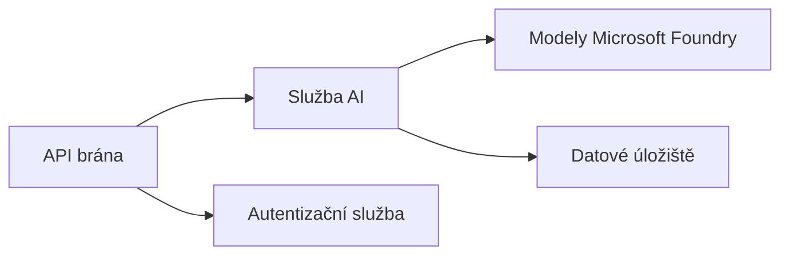

# Kapitola 8: Produkční a podnikové vzory

**📚 Kurz**: [AZD For Beginners](../../README.md) | **⏱️ Doba trvání**: 2-3 hodiny | **⭐ Složitost**: Pokročilá

---

## Přehled

Tato kapitola pokrývá podnikové vzory nasazení připravené do produkce, zpevnění zabezpečení, monitorování a optimalizaci nákladů pro produkční AI zátěže.

## Výukové cíle

Po dokončení této kapitoly budete:
- Nasadit víceregionální odolné aplikace
- Implementovat podnikové bezpečnostní vzory
- Nakonfigurovat komplexní monitorování
- Optimalizovat náklady ve velkém měřítku
- Nastavit CI/CD pipeline s AZD

---

## 📚 Lekce

| # | Lekce | Popis | Čas |
|---|--------|-------------|------|
| 1 | [Production AI Practices](production-ai-practices.md) | Podnikové vzory nasazení | 90 min |

---

## 🚀 Produkční kontrolní seznam

- [ ] Víceregionální nasazení pro odolnost
- [ ] Spravovaná identita pro autentizaci (bez klíčů)
- [ ] Application Insights pro monitorování
- [ ] Rozpočty nákladů a upozornění nakonfigurovány
- [ ] Skenování bezpečnosti povoleno
- [ ] Integrace CI/CD pipeline
- [ ] Plán obnovy po havárii

---

## 🏗️ Architektonické vzory

### Vzor 1: AI založená na mikroslužbách


### Vzor 2: AI založená na událostech


---

## 🔐 Nejlepší bezpečnostní postupy

```bicep
// Use managed identity
identity: {
  type: 'SystemAssigned'
}

// Private endpoints for AI services
properties: {
  publicNetworkAccess: 'Disabled'
  networkAcls: {
    defaultAction: 'Deny'
  }
}
```

---

## 💰 Optimalizace nákladů

| Strategie | Úspory |
|----------|---------|
| Škálování na nulu (Container Apps) | 60-80% |
| Použít spotřební tarify pro vývoj | 50-70% |
| Plánované škálování | 30-50% |
| Rezervovaná kapacita | 20-40% |

```bash
# Nastavit rozpočtová upozornění
az consumption budget create \
  --budget-name "AI-Budget" \
  --amount 500 \
  --category Cost \
  --time-grain Monthly
```

---

## 📊 Nastavení monitorování

```bash
# Sledovat protokoly
azd monitor --logs

# Zkontrolovat Application Insights
azd monitor

# Zobrazit metriky
az monitor metrics list --resource <resource-id>
```

---

## 🔗 Navigace

| Směr | Kapitola |
|-----------|---------|
| **Předchozí** | [Kapitola 7: Řešení problémů](../chapter-07-troubleshooting/README.md) |
| **Kurz dokončen** | [Domov kurzu](../../README.md) |

---

## 📖 Související zdroje

- [AI Agents Guide](../chapter-02-ai-development/agents.md)
- [Application Insights](../chapter-06-pre-deployment/application-insights.md)
- [Víceagentní řešení](../chapter-05-multi-agent/README.md)
- [Příklad mikroslužeb](../../examples/microservices/README.md)

---

<!-- CO-OP TRANSLATOR DISCLAIMER START -->
**Prohlášení o vyloučení odpovědnosti**:
Tento dokument byl přeložen pomocí služby pro automatický překlad [Co-op Translator](https://github.com/Azure/co-op-translator). I když usilujeme o přesnost, mějte prosím na paměti, že automatické překlady mohou obsahovat chyby nebo nepřesnosti. Původní dokument v jeho původním jazyce by měl být považován za autoritativní zdroj. Pro kritické informace se doporučuje profesionální lidský překlad. Za žádná nedorozumění nebo mylné výklady vyplývající z použití tohoto překladu neneseme odpovědnost.
<!-- CO-OP TRANSLATOR DISCLAIMER END -->