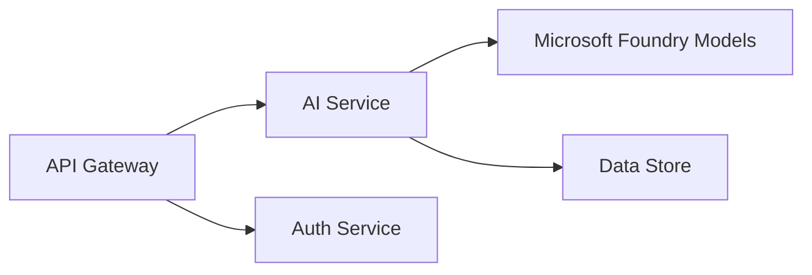
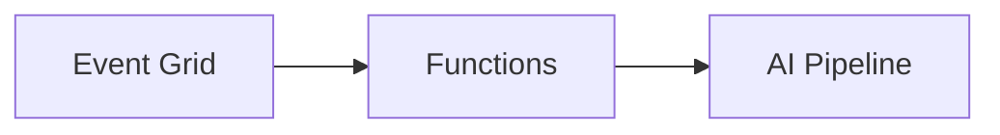

# Kapitola 8: Produkční a podnikové vzory

**📚 Kurz**: [AZD pro začátečníky](../../README.md) | **⏱️ Doba trvání**: 2-3 hodiny | **⭐ Složitost**: Pokročilá

---

## Přehled

Tato kapitola pokrývá podnikové nasazovací vzory, zabezpečení, monitorování a optimalizaci nákladů pro produkční AI zátěže.

Jedná se o architektonickou referenci, nikoli kompletní šablonu pro produkční nasazení. Příklady neobsahují detaily integrace, které musíte dodat a otestovat ve vaší vlastní aplikaci; přečtení kontrolního seznamu nezaručuje produkční připravenost.

> **Přehled vydání (2026-11-04):** Pokyny AI CLI byly zkontrolovány vůči dokumentaci/zdroji `azd 1.37.2`, agentům `1.0.0-beta.23` a evaluacím `1.0.0-beta.2`. Viz [změny a opravy vydání](production-ai-practices.md#recent-release-changes-and-fixes) pro požadavky kompatibility a podrobnosti migrace; toto není validace živého nasazení.

## Výukové cíle

Po dokončení této kapitoly budete schopni:
- Nasadit víceregionální odolné aplikace
- Implementovat podnikové bezpečnostní vzory
- Konfigurovat komplexní monitorování
- Optimalizovat náklady v měřítku
- Nastavit CI/CD pipeline pomocí AZD

---

## 📚 Lekce

| # | Lekce | Popis | Čas |
|---|--------|-------------|------|
| 1 | [Produkční AI praktiky](production-ai-practices.md) | Podnikové nasazovací vzory | 90 min |

---

## 🚀 Produkční kontrolní seznam

- [ ] Víceregionální nasazení pro odolnost
- [ ] Spravovaná identita pro autentizaci (bez klíčů)
- [ ] Application Insights pro monitorování
- [ ] Nastavený rozpočet nákladů a upozornění
- [ ] Povolené zabezpečovací skenování
- [ ] Integrace CI/CD pipeline
- [ ] Plán obnovy při havárii

---

## 🏗️ Vzorce architektury

### Vzorec 1: Mikroservisní AI


```mermaid
graph LR
    Gateway[API Gateway] --> AI[AI Service] --> Models[Microsoft Foundry Models]
    Gateway --> Auth[Auth Service]
    AI --> Data[Data Store]
```

### Vzorec 2: Událostmi řízená AI


```mermaid
graph LR
    EventGrid[Event Grid] --> Functions[Functions] --> Pipeline[AI Pipeline]
```

---

## 🔐 Nejlepší bezpečnostní postupy

```bicep
// Illustrative properties from different resources, NOT a standalone Bicep file.
// Attach identity to the application host:
identity: {
  type: 'SystemAssigned'
}

// AI account properties (also require private endpoints, DNS and app connectivity):
properties: {
  publicNetworkAccess: 'Disabled'
  networkAcls: {
    defaultAction: 'Deny'
  }
}
```

---

## 💰 Optimalizace nákladů

| Strategie | Hlavní omezení |
|----------|---------|
| Škálování na nulu (Container Apps) | Vyžaduje vhodný spouštěč; jiné služby stále generují náklady |
| Použití spotřebních úrovní pro vývoj | Porovnat ceny vybrané služby a zatížení |
| Plánované škálování | Škálování přes podporovanou infrastrukturu/automatizaci |
| Rezervace/provízená kapacita | Pouze pokud je podporována; závazky mohou zvýšit neaktivní náklady |

Použijte [kompletní vzorec rozpočtového zdroje](production-ai-practices.md#2-cost-monitoring-and-budgets) s platným datem zahájení, rozsahem vyúčtování, příjemci a oprávněními. Rozpočet posílá upozornění; neomezuje výdaje. Úspory závisí na měřeném využití a nejsou zaručenými procenty.

---

## 📊 Nastavení monitorování

```bash
# Open the Application Insights logs view (requires configured monitoring)
azd monitor --logs

# Check Application Insights
azd monitor --overview

# View metrics
az monitor metrics list --resource <resource-id>
```

---

## 🔗 Navigace

| Směr | Kapitola |
|-----------|---------|
| **Předchozí** | [Kapitola 7: Řešení problémů](../chapter-07-troubleshooting/README.md) |
| **Kurz dokončen** | [Domů kurzu](../../README.md) |

---

## 📖 Související zdroje

- [Průvodce AI agentů](../chapter-02-ai-development/agents.md)
- [Application Insights](../chapter-06-pre-deployment/application-insights.md)
- [Víceagentní řešení](../chapter-05-multi-agent/README.md)
- [Příklad mikroservisů](../../examples/microservices/README.md)

---

<!-- CO-OP TRANSLATOR DISCLAIMER START -->
**Prohlášení o omezení odpovědnosti**:
Tento dokument byl přeložen pomocí AI překladatelské služby [Co-op Translator](https://github.com/Azure/co-op-translator). Přestože usilujeme o co největší přesnost, mějte prosím na paměti, že automatizované překlady mohou obsahovat chyby nebo nepřesnosti. Originální dokument v jeho mateřském jazyce by měl být považován za autoritativní zdroj. Pro kritické informace se doporučuje profesionální lidský překlad. Nejsme odpovědní za jakékoli nedorozumění nebo nesprávné interpretace vzniklé použitím tohoto překladu.
<!-- CO-OP TRANSLATOR DISCLAIMER END -->