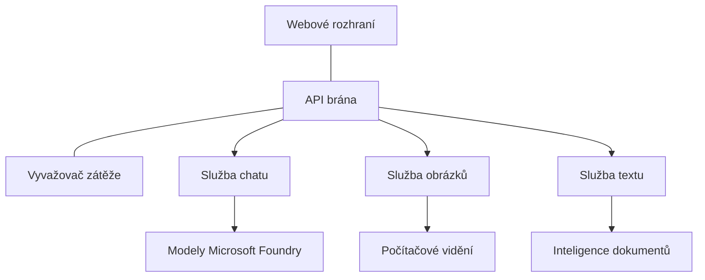

# Nejlepší postupy pro produkční AI pracovní zatížení s AZD

**Navigace kapitolou:**
- **📚 Domů kurzu**: [AZD pro začátečníky](../../README.md)
- **📖 Aktuální kapitola**: Kapitola 8 - Produkční a podnikové vzory
- **⬅️ Předchozí kapitola**: [Kapitola 7: Řešení problémů](../chapter-07-troubleshooting/debugging.md)
- **⬅️ Také relevantní**: [AI Workshop Lab](ai-workshop-lab.md)
- **🎯 Dokončení kurzu**: [AZD pro začátečníky](../../README.md)

## Přehled

Tento průvodce poskytuje komplexní nejlepší postupy pro nasazení produkčně připravených AI pracovních zatížení pomocí Azure Developer CLI (AZD). Na základě zpětné vazby komunity Microsoft Foundry Discord a reálných zákaznických nasazení jsou zde řešeny nejčastější výzvy v produkčních AI systémech.

## Klíčové řešené výzvy

Na základě výsledků našeho komunitního průzkumu jsou to nejčastější problémy, kterým vývojáři čelí:

- **45 %** mají potíže s nasazením AI více služeb
- **38 %** mají problémy se správou přihlašovacích údajů a tajemství  
- **35 %** je obtížné zajistit produkční připravenost a škálování
- **32 %** potřebují lepší strategie optimalizace nákladů
- **29 %** vyžadují zlepšený monitoring a řešení problémů

## Architektonické vzory pro produkční AI

### Vzor 1: Architektura AI na bázi mikroslužeb

**Kdy používat**: Komplexní AI aplikace s více funkcionalitami


**Implementace AZD**:

```yaml
# azure.yaml
name: enterprise-ai-platform
services:
  web:
    project: ./web
    host: staticwebapp
  api-gateway:
    project: ./api-gateway
    host: containerapp
  chat-service:
    project: ./services/chat
    host: containerapp
  vision-service:
    project: ./services/vision
    host: containerapp
  text-service:
    project: ./services/text
    host: containerapp
```

### Vzor 2: AI zpracování řízené událostmi

**Kdy používat**: Batching, analýza dokumentů, asynchronní workflow

```bicep
// Event Hub for AI processing pipeline
resource eventHub 'Microsoft.EventHub/namespaces@2023-01-01-preview' = {
  name: eventHubNamespaceName
  location: location
  sku: {
    name: 'Standard'
    tier: 'Standard'
    capacity: 1
  }
}

// Service Bus for reliable message processing
resource serviceBus 'Microsoft.ServiceBus/namespaces@2022-10-01-preview' = {
  name: serviceBusNamespaceName
  location: location
  sku: {
    name: 'Premium'
    tier: 'Premium'
    capacity: 1
  }
}

// Function App for processing
resource functionApp 'Microsoft.Web/sites@2023-01-01' = {
  name: functionAppName
  location: location
  kind: 'functionapp,linux'
  properties: {
    siteConfig: {
      appSettings: [
        {
          name: 'FUNCTIONS_EXTENSION_VERSION'
          value: '~4'
        }
        {
          name: 'AZURE_OPENAI_ENDPOINT'
          value: '@Microsoft.KeyVault(VaultName=${keyVault.name};SecretName=openai-endpoint)'
        }
      ]
    }
  }
}
```

## Přemýšlení o stavu AI agenta

Když se tradiční webová aplikace pokazí, příznaky jsou známé: stránka se nenačte, API vrátí chybu nebo se nepodaří nasazení. AI aplikace mohou selhat stejnými způsoby—ale také se mohou chovat jemněji problematicky, aniž by se objevily zjevné chybové zprávy.

Tato část vám pomůže vybudovat mentální model pro monitorování AI pracovních zatížení, abyste věděli, kam se podívat, když něco nebude v pořádku.

### Jak se stav agenta liší od tradičního stavu aplikace

Tradiční aplikace buď funguje, nebo ne. AI agent může vypadat, že funguje, ale produkovat slabé výsledky. Stav agenta vnímejte ve dvou vrstvách:

| Vrstva | Co sledovat | Kde hledat |
|--------|-------------|------------|
| **Stav infrastruktury** | Běží služba? Jsou zdroje přiděleny? Jsou koncové body dostupné? | `azd monitor`, stav zdrojů v Azure Portal, logy kontejnerů/aplikace |
| **Stav chování** | Agent reaguje správně? Jsou odpovědi včasné? Je model volán správně? | Traces v Application Insights, metriky latence volání modelu, logy kvality odpovědí |

Stav infrastruktury je známý—je stejný pro jakoukoliv azd aplikaci. Stav chování je nová vrstva, kterou AI pracovní zatížení přináší.

### Kam se dívat, když se AI aplikace nechovají podle očekávání

Pokud vaše AI aplikace nevytváří očekávané výsledky, zde je konceptuální checklist:

1. **Začněte u základů.** Aplikace běží? Dosáhne na své závislosti? Zkontrolujte `azd monitor` a stav zdrojů jako u běžných aplikací.
2. **Zkontrolujte připojení k modelu.** Volá vaše aplikace úspěšně AI model? Neúspěšné či timeoutované volání modelu jsou nejčastější příčinou problémů AI aplikací a objeví se v logu aplikace.
3. **Podívejte se, co model obdržel.** AI odpovědi závisí na vstupu (prompt a získaný kontext). Pokud je výstup chybný, vstup je obvykle chybný. Ověřte, zda aplikace posílá modelu správná data.
4. **Zkontrolujte latenci odpovědi.** Volání AI modelů jsou pomalejší než běžná API volání. Pokud je aplikace pomalá, podívejte se, zda se nezvýšila doba odezvy modelu—a to může indikovat omezení, kapacitní limity nebo zatížení regionu.
5. **Sledujte signály nákladů.** Neočekávané výkyvy ve využití tokenů nebo API voláních mohou znamenat smyčku, špatně nakonfigurovaný prompt nebo nadměrné pokusy o opakování.

Nemusíte hned ovládat pozorovací nástroje. Klíčové je, že AI aplikace mají další vrstvu chování k monitorování, a zabudovaný monitoring azd (`azd monitor`) vám dá výchozí bod pro zkoumání obou vrstev.

---

## Bezpečnostní nejlepší postupy

### 1. Zero-Trust bezpečnostní model

**Strategie implementace**:
- Žádná komunikace mezi službami bez autentizace
- Všechna API volání používají spravované identity
- Síťová izolace s privátními koncovými body
- Princip minimálních oprávnění

```bicep
// Managed Identity for each service
resource chatServiceIdentity 'Microsoft.ManagedIdentity/userAssignedIdentities@2023-01-31' = {
  name: 'chat-service-identity'
  location: location
}

// Role assignments with minimal permissions
resource openAIUserRole 'Microsoft.Authorization/roleAssignments@2022-04-01' = {
  scope: openAIAccount
  name: guid(openAIAccount.id, chatServiceIdentity.id, openAIUserRoleDefinitionId)
  properties: {
    roleDefinitionId: subscriptionResourceId('Microsoft.Authorization/roleDefinitions', '5e0bd9bd-7b93-4f28-af87-19fc36ad61bd')
    principalId: chatServiceIdentity.properties.principalId
    principalType: 'ServicePrincipal'
  }
}
```

### 2. Bezpečné řízení tajemství

**Vzor integrace Key Vault**:

```bicep
// Key Vault with proper access policies
resource keyVault 'Microsoft.KeyVault/vaults@2023-02-01' = {
  name: keyVaultName
  location: location
  properties: {
    tenantId: tenant().tenantId
    sku: {
      family: 'A'
      name: 'premium'  // Use premium for production
    }
    enableRbacAuthorization: true  // Use RBAC instead of access policies
    enablePurgeProtection: true    // Prevent accidental deletion
    enableSoftDelete: true
    softDeleteRetentionInDays: 90
  }
}

// Store all AI service credentials
resource openAIKeySecret 'Microsoft.KeyVault/vaults/secrets@2023-02-01' = {
  parent: keyVault
  name: 'openai-api-key'
  properties: {
    value: openAIAccount.listKeys().key1
    attributes: {
      enabled: true
    }
  }
}
```

### 3. Síťová bezpečnost

**Konfigurace privátních koncových bodů**:

```bicep
// Virtual Network for AI services
resource virtualNetwork 'Microsoft.Network/virtualNetworks@2023-04-01' = {
  name: vnetName
  location: location
  properties: {
    addressSpace: {
      addressPrefixes: ['10.0.0.0/16']
    }
    subnets: [
      {
        name: 'ai-services-subnet'
        properties: {
          addressPrefix: '10.0.1.0/24'
          privateEndpointNetworkPolicies: 'Disabled'
        }
      }
      {
        name: 'app-services-subnet'
        properties: {
          addressPrefix: '10.0.2.0/24'
          delegations: [
            {
              name: 'Microsoft.Web/serverFarms'
              properties: {
                serviceName: 'Microsoft.Web/serverFarms'
              }
            }
          ]
        }
      }
    ]
  }
}

// Private endpoints for all AI services
resource openAIPrivateEndpoint 'Microsoft.Network/privateEndpoints@2023-04-01' = {
  name: '${openAIAccountName}-pe'
  location: location
  properties: {
    subnet: {
      id: virtualNetwork.properties.subnets[0].id
    }
    privateLinkServiceConnections: [
      {
        name: 'openai-connection'
        properties: {
          privateLinkServiceId: openAIAccount.id
          groupIds: ['account']
        }
      }
    ]
  }
}
```

## Výkon a škálování

### 1. Strategie automatického škálování

**Automatické škálování Container Apps**:

```bicep
resource containerApp 'Microsoft.App/containerApps@2023-05-01' = {
  name: containerAppName
  location: location
  properties: {
    configuration: {
      ingress: {
        external: true
        targetPort: 8000
        transport: 'http'
      }
    }
    template: {
      scale: {
        minReplicas: 2  // Always have 2 instances minimum
        maxReplicas: 50 // Scale up to 50 for high load
        rules: [
          {
            name: 'http-scaling'
            http: {
              metadata: {
                concurrentRequests: '20'  // Scale when >20 concurrent requests
              }
            }
          }
          {
            name: 'cpu-scaling'
            custom: {
              type: 'cpu'
              metadata: {
                type: 'Utilization'
                value: '70'  // Scale when CPU >70%
              }
            }
          }
        ]
      }
    }
  }
}
```

### 2. Strategie kešování

**Redis Cache pro AI odpovědi**:

```bicep
// Redis Premium for production workloads
resource redisCache 'Microsoft.Cache/redis@2023-04-01' = {
  name: redisCacheName
  location: location
  properties: {
    sku: {
      name: 'Premium'
      family: 'P'
      capacity: 1
    }
    enableNonSslPort: false
    minimumTlsVersion: '1.2'
    redisConfiguration: {
      'maxmemory-policy': 'allkeys-lru'
    }
    // Enable clustering for high availability
    redisVersion: '6.0'
    shardCount: 2
  }
}

// Cache configuration in application
var cacheConnectionString = '${redisCache.properties.hostName}:6380,password=${redisCache.listKeys().primaryKey},ssl=True,abortConnect=False'
```

### 3. Vyrovnávání zátěže a řízení provozu

**Application Gateway s WAF**:

```bicep
// Application Gateway with Web Application Firewall
resource applicationGateway 'Microsoft.Network/applicationGateways@2023-04-01' = {
  name: appGatewayName
  location: location
  properties: {
    sku: {
      name: 'WAF_v2'
      tier: 'WAF_v2'
      capacity: 2
    }
    webApplicationFirewallConfiguration: {
      enabled: true
      firewallMode: 'Prevention'
      ruleSetType: 'OWASP'
      ruleSetVersion: '3.2'
    }
    // Backend pools for AI services
    backendAddressPools: [
      {
        name: 'ai-services-pool'
        properties: {
          backendAddresses: [
            {
              fqdn: '${containerApp.properties.configuration.ingress.fqdn}'
            }
          ]
        }
      }
    ]
  }
}
```

## 💰 Optimalizace nákladů

### 1. Správné dimenzování zdrojů

**Konfigurace pro různá prostředí**:

```bash
# Vývojové prostředí
azd env new development
azd env set AZURE_OPENAI_SKU "S0"
azd env set AZURE_OPENAI_CAPACITY 10
azd env set AZURE_SEARCH_SKU "basic"
azd env set CONTAINER_CPU 0.5
azd env set CONTAINER_MEMORY 1.0

# Produkční prostředí
azd env new production
azd env set AZURE_OPENAI_SKU "S0"
azd env set AZURE_OPENAI_CAPACITY 100
azd env set AZURE_SEARCH_SKU "standard"
azd env set CONTAINER_CPU 2.0
azd env set CONTAINER_MEMORY 4.0
```

### 2. Monitorování nákladů a rozpočty

```bicep
// Cost management and budgets
resource budget 'Microsoft.Consumption/budgets@2023-05-01' = {
  name: 'ai-workload-budget'
  properties: {
    timePeriod: {
      startDate: '2024-01-01'
      endDate: '2024-12-31'
    }
    timeGrain: 'Monthly'
    amount: 2000  // $2000 monthly budget
    category: 'Cost'
    notifications: {
      warning: {
        enabled: true
        operator: 'GreaterThan'
        threshold: 80
        contactEmails: [
          'finance@company.com'
          'engineering@company.com'
        ]
        contactRoles: [
          'Owner'
          'Contributor'
        ]
      }
      critical: {
        enabled: true
        operator: 'GreaterThan'
        threshold: 95
        contactEmails: [
          'cto@company.com'
        ]
      }
    }
  }
}
```

### 3. Optimalizace využití tokenů

**Správa nákladů OpenAI**:

```typescript
// Optimalizace tokenů na úrovni aplikace
class TokenOptimizer {
  private readonly maxTokens = 4000;
  private readonly reserveTokens = 500;
  
  optimizePrompt(userInput: string, context: string): string {
    const availableTokens = this.maxTokens - this.reserveTokens;
    const estimatedTokens = this.estimateTokens(userInput + context);
    
    if (estimatedTokens > availableTokens) {
      // Zkrátit kontext, ne vstup uživatele
      context = this.truncateContext(context, availableTokens - this.estimateTokens(userInput));
    }
    
    return `${context}\n\nUser: ${userInput}`;
  }
  
  private estimateTokens(text: string): number {
    // Hrubý odhad: 1 token ≈ 4 znaky
    return Math.ceil(text.length / 4);
  }
}
```

## Monitorování a pozorovatelnost

### 1. Komplexní Application Insights

```bicep
// Application Insights with advanced features
resource applicationInsights 'Microsoft.Insights/components@2020-02-02' = {
  name: applicationInsightsName
  location: location
  kind: 'web'
  properties: {
    Application_Type: 'web'
    WorkspaceResourceId: logAnalyticsWorkspace.id
    SamplingPercentage: 100  // Full sampling for AI apps
    DisableIpMasking: false  // Enable for security
  }
}

// Custom metrics for AI operations
resource aiMetricAlerts 'Microsoft.Insights/metricAlerts@2018-03-01' = {
  name: 'ai-high-error-rate'
  location: 'global'
  properties: {
    description: 'Alert when AI service error rate is high'
    severity: 2
    enabled: true
    scopes: [
      applicationInsights.id
    ]
    evaluationFrequency: 'PT1M'
    windowSize: 'PT5M'
    criteria: {
      'odata.type': 'Microsoft.Azure.Monitor.SingleResourceMultipleMetricCriteria'
      allOf: [
        {
          name: 'high-error-rate'
          metricName: 'requests/failed'
          operator: 'GreaterThan'
          threshold: 10
          timeAggregation: 'Count'
        }
      ]
    }
  }
}
```

### 2. AI-specifické monitorování

**Vlastní dashboardy pro AI metriky**:

```json
// Dashboard configuration for AI workloads
{
  "dashboard": {
    "name": "AI Application Monitoring",
    "tiles": [
      {
        "name": "OpenAI Request Volume",
        "query": "requests | where name contains 'openai' | summarize count() by bin(timestamp, 5m)"
      },
      {
        "name": "AI Response Latency",
        "query": "requests | where name contains 'openai' | summarize avg(duration) by bin(timestamp, 5m)"
      },
      {
        "name": "Token Usage",
        "query": "customMetrics | where name == 'openai_tokens_used' | summarize sum(value) by bin(timestamp, 1h)"
      },
      {
        "name": "Cost per Hour",
        "query": "customMetrics | where name == 'openai_cost' | summarize sum(value) by bin(timestamp, 1h)"
      }
    ]
  }
}
```

### 3. Kontroly zdraví a monitoring dostupnosti

```bicep
// Application Insights availability tests
resource availabilityTest 'Microsoft.Insights/webtests@2022-06-15' = {
  name: 'ai-app-availability-test'
  location: location
  tags: {
    'hidden-link:${applicationInsights.id}': 'Resource'
  }
  properties: {
    SyntheticMonitorId: 'ai-app-availability-test'
    Name: 'AI Application Availability Test'
    Description: 'Tests AI application endpoints'
    Enabled: true
    Frequency: 300  // 5 minutes
    Timeout: 120    // 2 minutes
    Kind: 'ping'
    Locations: [
      {
        Id: 'us-east-2-azr'
      }
      {
        Id: 'us-west-2-azr'
      }
    ]
    Configuration: {
      WebTest: '''
        <WebTest Name="AI Health Check" 
                 Id="8d2de8d2-a2b0-4c2e-9a0d-8f9c9a0b8c8d" 
                 Enabled="True" 
                 CssProjectStructure="" 
                 CssIteration="" 
                 Timeout="120" 
                 WorkItemIds="" 
                 xmlns="http://microsoft.com/schemas/VisualStudio/TeamTest/2010" 
                 Description="" 
                 CredentialUserName="" 
                 CredentialPassword="" 
                 PreAuthenticate="True" 
                 Proxy="default" 
                 StopOnError="False" 
                 RecordedResultFile="" 
                 ResultsLocale="">
          <Items>
            <Request Method="GET" 
                     Guid="a5f10126-e4cd-570d-961c-cea43999a200" 
                     Version="1.1" 
                     Url="${webApp.properties.defaultHostName}/health" 
                     ThinkTime="0" 
                     Timeout="120" 
                     ParseDependentRequests="True" 
                     FollowRedirects="True" 
                     RecordResult="True" 
                     Cache="False" 
                     ResponseTimeGoal="0" 
                     Encoding="utf-8" 
                     ExpectedHttpStatusCode="200" 
                     ExpectedResponseUrl="" 
                     ReportingName="" 
                     IgnoreHttpStatusCode="False" />
          </Items>
        </WebTest>
      '''
    }
  }
}
```

## Obnova po havárii a vysoká dostupnost

### 1. Nasazení do více regionů

```yaml
# azure.yaml - Multi-region configuration
name: ai-app-multiregion
services:
  api-primary:
    project: ./api
    host: containerapp
    env:
      - AZURE_REGION=eastus
  api-secondary:
    project: ./api
    host: containerapp
    env:
      - AZURE_REGION=westus2
```

```bicep
// Traffic Manager for global load balancing
resource trafficManager 'Microsoft.Network/trafficManagerProfiles@2022-04-01' = {
  name: trafficManagerProfileName
  location: 'global'
  properties: {
    profileStatus: 'Enabled'
    trafficRoutingMethod: 'Priority'
    dnsConfig: {
      relativeName: trafficManagerProfileName
      ttl: 30
    }
    monitorConfig: {
      protocol: 'HTTPS'
      port: 443
      path: '/health'
      intervalInSeconds: 30
      toleratedNumberOfFailures: 3
      timeoutInSeconds: 10
    }
    endpoints: [
      {
        name: 'primary-endpoint'
        type: 'Microsoft.Network/trafficManagerProfiles/azureEndpoints'
        properties: {
          targetResourceId: primaryAppService.id
          endpointStatus: 'Enabled'
          priority: 1
        }
      }
      {
        name: 'secondary-endpoint'
        type: 'Microsoft.Network/trafficManagerProfiles/azureEndpoints'
        properties: {
          targetResourceId: secondaryAppService.id
          endpointStatus: 'Enabled'
          priority: 2
        }
      }
    ]
  }
}
```

### 2. Zálohování a obnova dat

```bicep
// Backup configuration for critical data
resource backupVault 'Microsoft.DataProtection/backupVaults@2023-05-01' = {
  name: backupVaultName
  location: location
  identity: {
    type: 'SystemAssigned'
  }
  properties: {
    storageSettings: [
      {
        datastoreType: 'VaultStore'
        type: 'LocallyRedundant'
      }
    ]
  }
}

// Backup policy for AI models and data
resource backupPolicy 'Microsoft.DataProtection/backupVaults/backupPolicies@2023-05-01' = {
  parent: backupVault
  name: 'ai-data-backup-policy'
  properties: {
    policyRules: [
      {
        backupParameters: {
          backupType: 'Full'
          objectType: 'AzureBackupParams'
        }
        trigger: {
          schedule: {
            repeatingTimeIntervals: [
              'R/2024-01-01T02:00:00+00:00/P1D'  // Daily at 2 AM
            ]
          }
          objectType: 'ScheduleBasedTriggerContext'
        }
        dataStore: {
          datastoreType: 'VaultStore'
          objectType: 'DataStoreInfoBase'
        }
        name: 'BackupDaily'
        objectType: 'AzureBackupRule'
      }
    ]
  }
}
```

## DevOps a CI/CD integrace

### 1. GitHub Actions workflow

```yaml
# .github/workflows/deploy-ai-app.yml
name: Deploy AI Application

on:
  push:
    branches: [main]
  pull_request:
    branches: [main]

jobs:
  test:
    runs-on: ubuntu-latest
    steps:
      - uses: actions/checkout@v4
      
      - name: Setup Python
        uses: actions/setup-python@v4
        with:
          python-version: '3.11'
          
      - name: Install dependencies
        run: |
          pip install -r requirements.txt
          pip install pytest
          
      - name: Run tests
        run: pytest tests/
        
      - name: AI Safety Tests
        run: |
          python scripts/test_ai_safety.py
          python scripts/validate_prompts.py

  deploy-staging:
    needs: test
    if: github.event_name == 'pull_request'
    runs-on: ubuntu-latest
    steps:
      - uses: actions/checkout@v4
      
      - name: Setup AZD
        uses: Azure/setup-azd@v2
        
      - name: Login to Azure
        uses: azure/login@v1
        with:
          creds: ${{ secrets.AZURE_CREDENTIALS }}
          
      - name: Deploy to Staging
        run: |
          azd env select staging
          azd deploy

  deploy-production:
    needs: test
    if: github.ref == 'refs/heads/main'
    runs-on: ubuntu-latest
    steps:
      - uses: actions/checkout@v4
      
      - name: Setup AZD
        uses: Azure/setup-azd@v2
        
      - name: Login to Azure
        uses: azure/login@v1
        with:
          creds: ${{ secrets.AZURE_CREDENTIALS }}
          
      - name: Deploy to Production
        run: |
          azd env select production
          azd deploy
          
      - name: Run Production Health Checks
        run: |
          python scripts/health_check.py --env production
```

### 2. Validace infrastruktury

```bash
# scripts/validate_infrastructure.sh
#!/bin/bash

echo "Validating AI infrastructure deployment..."

# Zkontrolujte, zda všechny požadované služby běží
services=("openai" "search" "storage" "keyvault")
for service in "${services[@]}"; do
    echo "Checking $service..."
    if ! az resource list --resource-type "Microsoft.CognitiveServices/accounts" --query "[?contains(name, '$service')]" -o tsv; then
        echo "ERROR: $service not found"
        exit 1
    fi
done

# Ověřte nasazení modelů OpenAI
echo "Validating OpenAI model deployments..."
models=$(az cognitiveservices account deployment list --name $AZURE_OPENAI_NAME --resource-group $AZURE_RESOURCE_GROUP --query "[].name" -o tsv)
if [[ ! $models == *"gpt-4.1-mini"* ]]; then
  echo "ERROR: Required model gpt-4.1-mini not deployed"
    exit 1
fi

# Otestujte konektivitu AI služby
echo "Testing AI service connectivity..."
python scripts/test_connectivity.py

echo "Infrastructure validation completed successfully!"
```

## Kontrolní seznam připravenosti do produkce

### Bezpečnost ✅
- [ ] Všechny služby používají spravované identity
- [ ] Tajemství uložená v Key Vault
- [ ] Nakonfigurovány privátní koncové body
- [ ] Implementovány síťové bezpečnostní skupiny
- [ ] RBAC s principem minimálních oprávnění
- [ ] WAF povolen na veřejných koncových bodech

### Výkon ✅
- [ ] Nastaveno automatické škálování
- [ ] Implementováno kešování
- [ ] Nastaveno vyrovnávání zátěže
- [ ] CDN pro statický obsah
- [ ] Pooling připojení k databázi
- [ ] Optimalizace využití tokenů

### Monitorování ✅
- [ ] Konfigurováno Application Insights
- [ ] Definovány vlastní metriky
- [ ] Nastaveny pravidla pro upozornění
- [ ] Vytvořen dashboard
- [ ] Implementovány kontroly zdraví
- [ ] Politiky uchování logů

### Spolehlivost ✅
- [ ] Multi-region nasazení
- [ ] Plán zálohování a obnovy
- [ ] Implementovány circuit breakers
- [ ] Nakonfigurovány retry politiky
- [ ] Hladké snižování funkcionality
- [ ] Koncové body pro kontroly zdraví

### Řízení nákladů ✅
- [ ] Nastaveny výstrahy na rozpočty
- [ ] Správné dimenzování zdrojů
- [ ] Aplikovány slevy pro vývoj/testování
- [ ] Zakoupeny rezervované instance
- [ ] Dashboard pro sledování nákladů
- [ ] Pravidelné revize nákladů

### Soulad ✅
- [ ] Splněny požadavky na umístění dat
- [ ] Zapnuté auditní logování
- [ ] Uplatněné politiky souladu
- [ ] Implementovány bezpečnostní základny
- [ ] Pravidelné bezpečnostní audity
- [ ] Plán reakce na incidenty

## Výkonnostní benchmarky

### Typické produkční metriky

| Metoda | Cíl | Monitorování |
|--------|-----|--------------|
| **Doba odezvy** | < 2 sekundy | Application Insights |
| **Dostupnost** | 99,9 % | Monitoring uptime |
| **Chybovost** | < 0,1 % | Logy aplikace |
| **Využití tokenů** | < 500 $/měsíc | Správa nákladů |
| **Současní uživatelé** | 1000+ | Load testing |
| **Doba obnovy** | < 1 hodina | Testy obnovy po havárii |

### Load testing

```bash
# Testovací skript zatížení pro aplikace AI
python scripts/load_test.py \
  --endpoint https://your-ai-app.azurewebsites.net \
  --concurrent-users 100 \
  --duration 300 \
  --ramp-up 60
```

## 🤝 Nejlepší komunitní postupy

Na základě zpětné vazby komunity Microsoft Foundry na Discordu:

### Nejlepší doporučení od komunity:

1. **Začněte malými kroky, škálujte postupně**: Začněte s základními SKU a škálujte podle skutečného využití
2. **Sledujte všechno**: Zavedete komplexní monitoring od prvního dne
3. **Automatizujte bezpečnost**: Používejte infrastrukturu jako kód pro konzistentní bezpečnost
4. **Testujte důkladně**: Zahrňte AI-specifické testy do vašeho pipeline
5. **Plánujte náklady**: Sledujte využití tokenů a nastavujte rozpočtové výstrahy včas

### Časté chyby, kterým se vyhnout:

- ❌ Hardcoding API klíčů v kódu
- ❌ Nepovolování správného monitoringu
- ❌ Ignorování optimalizace nákladů
- ❌ Netestování selhání scénářů
- ❌ Nasazování bez kontrol zdraví

## AZD AI CLI příkazy a rozšíření

AZD zahrnuje rozšiřující sadu AI-specifických příkazů a rozšíření, které zjednodušují produkční AI workflow. Tyto nástroje propojují lokální vývoj a produkční nasazení AI pracovních zatížení.

### AZD rozšíření pro AI

AZD používá systém rozšíření pro přidání AI-specifických funkcí. Instalujte a spravujte rozšíření pomocí:

```bash
# Vypsat všechny dostupné rozšíření (včetně AI)
azd extension list

# Zkontrolovat podrobnosti nainstalovaného rozšíření
azd extension show azure.ai.agents

# Nainstalovat rozšíření agentů Foundry
azd extension install azure.ai.agents

# Nainstalovat rozšíření pro doladění
azd extension install azure.ai.finetune

# Nainstalovat rozšíření pro vlastní modely
azd extension install azure.ai.models

# Aktualizovat všechna nainstalovaná rozšíření
azd extension upgrade --all
```

**Dostupná AI rozšíření:**

| Rozšíření | Účel | Stav |
|-----------|-------|-------|
| `azure.ai.agents` | Správa Foundry Agent služby | Preview |
| `azure.ai.finetune` | Fine-tuning Foundry modelů | Preview |
| `azure.ai.models` | Vlastní Foundry modely | Preview |
| `azure.coding-agent` | Konfigurace kódovacího agenta | K dispozici |

### Inicializace agentních projektů pomocí `azd ai agent init`

Příkaz `azd ai agent init` vytvoří projekt produkčně připraveného AI agenta integrovaného s Microsoft Foundry Agent Service:

```bash
# Inicializovat nový agentní projekt z agentního manifestu
azd ai agent init -m <manifest-path-or-uri>

# Inicializovat a cílit na konkrétní Foundry projekt
azd ai agent init -m agent-manifest.yaml --project-id <foundry-project-id>

# Inicializovat s vlastní zdrojovou složkou
azd ai agent init -m agent-manifest.yaml --src ./agents/my-agent

# Cílit na Container Apps jako hostitele
azd ai agent init -m agent-manifest.yaml --host containerapp
```

**Klíčové přepínače:**

| Přepínač | Popis |
|----------|-------|
| `-m, --manifest` | Cesta nebo URI k manifestu agenta, který má být přidán do projektu |
| `-p, --project-id` | Existující Microsoft Foundry Project ID pro azd prostředí |
| `-s, --src` | Adresář pro stažení definice agenta (výchozí `src/<agent-id>`) |
| `--host` | Přepsání výchozího hostitele (např. `containerapp`) |
| `-e, --environment` | Použité azd prostředí |

**Tip pro produkci**: Použijte `--project-id` pro přímé připojení k existujícímu Foundry projektu, aby byl váš agentní kód a cloudové zdroje od začátku propojené.

### Model Context Protocol (MCP) s `azd mcp`

AZD obsahuje zabudovanou podporu MCP serveru (Alpha), který umožňuje AI agentům a nástrojům interagovat s vašimi Azure zdroji prostřednictvím standardizovaného protokolu:

```bash
# Spusťte MCP server pro váš projekt
azd mcp start

# Zkontrolujte aktuální pravidla souhlasu Copilota pro spuštění nástroje
azd copilot consent list
```

MCP server zpřístupňuje kontext vašeho azd projektu—prostředí, služby a Azure zdroje—AI-poháněným vývojovým nástrojům. To umožňuje:

- **AI asistované nasazení**: Nechte kódovací agenty dotazovat se na stav projektu a spouštět nasazení
- **Objevování zdrojů**: AI nástroje mohou zjistit, jaké Azure zdroje projekt využívá
- **Správa prostředí**: Agenti mohou přepínat mezi dev/staging/produkčními prostředími

### Generování infrastruktury s `azd infra generate`

Pro produkční AI pracovní zatížení můžete generovat a přizpůsobovat infrastrukturu jako kód, místo spoléhání na automatické poskytování:

```bash
# Generujte soubory Bicep/Terraform z definice vašeho projektu
azd infra generate
```

Tento příkaz zapíše IaC na disk, abyste mohli:
- Prozkoumat a auditovat infrastrukturu před nasazením
- Přidat vlastní bezpečnostní politiky (síťová pravidla, privátní koncové body)
- Integrovat se s existujícími procesy revize IaC
- Verzionovat změny infrastruktury odděleně od aplikačního kódu

### Produkční lifecycle hooky

AZD hooky vám umožňují vložit vlastní logiku do každé fáze životního cyklu nasazení—kritické pro produkční AI workflow:

```yaml
# azure.yaml - Production hooks example
name: ai-production-app
hooks:
  preprovision:
    shell: sh
    run: scripts/validate-quotas.sh    # Check AI model quota before provisioning
  postprovision:
    shell: sh
    run: scripts/configure-networking.sh  # Set up private endpoints
  predeploy:
    shell: sh
    run: scripts/run-ai-safety-tests.sh  # Run prompt safety checks
  postdeploy:
    shell: sh
    run: scripts/smoke-test.sh           # Verify agent responses post-deploy
services:
  agent-api:
    project: ./src/agent
    host: containerapp
    hooks:
      predeploy:
        shell: sh
        run: scripts/validate-model-access.sh  # Per-service hook
```

```bash
# Spusťte konkrétní háček ručně během vývoje
azd hooks run predeploy
```

**Doporučené produkční hooky pro AI workloady:**

| Hook | Použití |
|-------|---------|
| `preprovision` | Ověření kvót předplatného pro kapacitu AI modelů |
| `postprovision` | Konfigurace privátních koncových bodů, nasazení modelových vah |
| `predeploy` | Spuštění AI bezpečnostních testů, validace prompt šablon |
| `postdeploy` | Smoke testy odpovědí agenta, ověření konektivity modelu |

### Konfigurace CI/CD pipeline

Použijte `azd pipeline config` k propojení projektu s GitHub Actions nebo Azure Pipelines se zabezpečenou autentizací Azure:

```bash
# Nakonfigurujte CI/CD pipeline (interaktivně)
azd pipeline config

# Nakonfigurujte se specifickým poskytovatelem
azd pipeline config --provider github
```

Tento příkaz:
- Vytvoří služební principál s minimálními oprávněními
- Nakonfiguruje federované přihlašovací údaje (bez uložených tajemství)
- Vygeneruje nebo aktualizuje definici pipeline souboru
- Nastaví požadované proměnné prostředí ve vašem CI/CD systému

**Produkční workflow s pipeline config:**

```bash
# 1. Nastavte produkční prostředí
azd env new production
azd env set AZURE_OPENAI_CAPACITY 100

# 2. Nakonfigurujte pipeline
azd pipeline config --provider github

# 3. Pipeline spustí azd deploy při každém pushnutí do větve main
```

### Přidávání komponent pomocí `azd add`

Postupně přidávejte Azure služby do existujícího projektu:

```bash
# Přidejte novou komponentu služby interaktivně
azd add
```

Toto je zvláště užitečné pro rozšíření produkčních AI aplikací—například přidání vektorové vyhledávací služby, nového agentního koncového bodu nebo monitorovací komponenty k existujícímu nasazení.

## Další zdroje
- **Azure Well-Architected Framework**: [Pokyny pro AI pracovní zátěže](https://learn.microsoft.com/azure/well-architected/ai/)
- **Microsoft Foundry Dokumentace**: [Oficiální dokumenty](https://learn.microsoft.com/azure/ai-studio/)
- **Komunitní šablony**: [Azure Samples](https://github.com/Azure-Samples)
- **Komunita na Discordu**: [#Azure kanál](https://discord.gg/microsoft-azure)
- **Agent Skills pro Azure**: [microsoft/github-copilot-for-azure na skills.sh](https://skills.sh/microsoft/github-copilot-for-azure) - 37 otevřených agent skills pro Azure AI, Foundry, nasazení, optimalizaci nákladů a diagnostiku. Nainstalujte si do svého editoru:
  ```bash
  npx skills add microsoft/github-copilot-for-azure
  ```

---

**Navigace kapitol:**
- **📚 Domovská stránka kurzu**: [AZD Pro začátečníky](../../README.md)
- **📖 Aktuální kapitola**: Kapitola 8 - Produkční a podnikové vzory
- **⬅️ Předchozí kapitola**: [Kapitola 7: Řešení problémů](../chapter-07-troubleshooting/debugging.md)
- **⬅️ Také související**: [AI Workshop Lab](ai-workshop-lab.md)
- **� Kurz dokončen**: [AZD Pro začátečníky](../../README.md)

**Pamatujte**: Produkční AI pracovní zátěže vyžadují pečlivé plánování, monitorování a kontinuální optimalizaci. Začněte s těmito vzory a přizpůsobte je svým specifickým požadavkům.

---

<!-- CO-OP TRANSLATOR DISCLAIMER START -->
**Prohlášení o vyloučení odpovědnosti**:
Tento dokument byl přeložen pomocí AI překladatelské služby [Co-op Translator](https://github.com/Azure/co-op-translator). I když usilujeme o přesnost, mějte prosím na paměti, že automatizované překlady mohou obsahovat chyby nebo nepřesnosti. Původní dokument v jeho rodném jazyce by měl být považován za autoritativní zdroj. Pro důležité informace se doporučuje profesionální lidský překlad. Nejsme odpovědní za jakékoliv nedorozumění nebo nesprávné výklady vyplývající z použití tohoto překladu.
<!-- CO-OP TRANSLATOR DISCLAIMER END -->