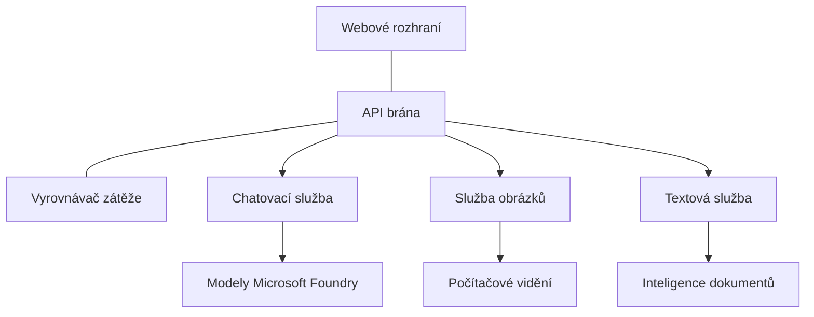

# Production AI Workload Best Practices with AZD

**Chapter Navigation:**
- **📚 Course Home**: [AZD For Beginners](../../README.md)
- **📖 Current Chapter**: Chapter 8 - Production & Enterprise Patterns
- **⬅️ Previous Chapter**: [Chapter 7: Troubleshooting](../chapter-07-troubleshooting/debugging.md)
- **⬅️ Also Related**: [AI Workshop Lab](ai-workshop-lab.md)
- **🎯 Course Complete**: [AZD For Beginners](../../README.md)

## Overview

Tento průvodce poskytuje komplexní osvědčené postupy pro nasazování produkčních AI zátěží pomocí Azure Developer CLI (AZD). Na základě zpětné vazby z komunity Microsoft Foundry Discord a reálných zákaznických nasazení tato doporučení řeší nejčastější problémy v produkčních AI systémech.

## Key Challenges Addressed

Na základě výsledků našeho komunitního průzkumu jsou to hlavní výzvy, kterým vývojáři čelí:

- **45%** mají problém s nasazením více služeb AI
- **38%** řeší problémy se správou pověření a tajemství  
- **35%** považuje za obtížnou připravenost pro produkci a škálování
- **32%** potřebuje lepší strategie optimalizace nákladů
- **29%** vyžaduje zlepšené monitorování a odstraňování problémů

## Architecture Patterns for Production AI

### Pattern 1: Microservices AI Architecture

**When to use**: Komplexní AI aplikace s více schopnostmi


**AZD Implementation**:

```yaml
# azure.yaml
name: enterprise-ai-platform
services:
  web:
    project: ./web
    host: staticwebapp
  api-gateway:
    project: ./api-gateway
    host: containerapp
  chat-service:
    project: ./services/chat
    host: containerapp
  vision-service:
    project: ./services/vision
    host: containerapp
  text-service:
    project: ./services/text
    host: containerapp
```

### Pattern 2: Event-Driven AI Processing

**When to use**: Hromadné zpracování, analýza dokumentů, asynchronní workflowy

```bicep
// Event Hub for AI processing pipeline
resource eventHub 'Microsoft.EventHub/namespaces@2023-01-01-preview' = {
  name: eventHubNamespaceName
  location: location
  sku: {
    name: 'Standard'
    tier: 'Standard'
    capacity: 1
  }
}

// Service Bus for reliable message processing
resource serviceBus 'Microsoft.ServiceBus/namespaces@2022-10-01-preview' = {
  name: serviceBusNamespaceName
  location: location
  sku: {
    name: 'Premium'
    tier: 'Premium'
    capacity: 1
  }
}

// Function App for processing
resource functionApp 'Microsoft.Web/sites@2023-01-01' = {
  name: functionAppName
  location: location
  kind: 'functionapp,linux'
  properties: {
    siteConfig: {
      appSettings: [
        {
          name: 'FUNCTIONS_EXTENSION_VERSION'
          value: '~4'
        }
        {
          name: 'AZURE_OPENAI_ENDPOINT'
          value: '@Microsoft.KeyVault(VaultName=${keyVault.name};SecretName=openai-endpoint)'
        }
      ]
    }
  }
}
```

## Thinking About AI Agent Health

Když se rozbije tradiční webová aplikace, příznaky jsou známé: stránka se nenačte, API vrátí chybu nebo nasazení selže. AI poháněné aplikace se mohou rozbít stejnými způsoby—ale mohou se také chovat subtilnějším způsobem, který nevytváří zjevné chybové zprávy.

Tato sekce vám pomůže vytvořit mentální model pro monitorování AI zátěží, abyste věděli, kde hledat, když něco nevypadá správně.

### How Agent Health Differs from Traditional App Health

Tradiční aplikace buď funguje, nebo ne. AI agent může vypadat, že funguje, ale poskytovat špatné výsledky. Pohlížejte na stav agenta ve dvou vrstvách:

| Layer | What to Watch | Where to Look |
|-------|--------------|---------------|
| **Infrastructure health** | Běží služba? Jsou prostředky poskytovány? Jsou koncové body dosažitelné? | `azd monitor`, stav prostředků v Azure Portal, protokoly kontejneru/aplikace |
| **Behavior health** | Odpovídá agent přesně? Jsou odpovědi včasné? Je model volán správně? | Application Insights traces, metriky latence volání modelu, protokoly kvality odpovědí |

Stav infrastruktury je známý—je stejný pro jakoukoli azd aplikaci. Stav chování je nová vrstva, kterou do AI zátěží zavádíme.

### Where to Look When AI Apps Don't Behave as Expected

Pokud vaše AI aplikace nevytváří očekávané výsledky, zde je koncepční kontrolní seznam:

1. **Začněte základy.** Běží aplikace? Dokáže dosáhnout na závislosti? Zkontrolujte `azd monitor` a stav prostředků stejně jako u jakékoli jiné aplikace.
2. **Zkontrolujte připojení k modelu.** Volá vaše aplikace úspěšně AI model? Neúspěšná nebo vypršením časového limitu ukončená volání modelu jsou nejčastější příčinou problémů u AI aplikací a objeví se v protokolech aplikace.
3. **Podívejte se, co model obdržel.** AI odpovědi závisí na vstupu (prompt a jakýkoli získaný kontext). Pokud je výstup špatný, obvykle je špatný vstup. Zkontrolujte, zda vaše aplikace posílá modelu správná data.
4. **Zkontrolujte latenci odpovědí.** Volání AI modelů jsou pomalejší než typická API volání. Pokud se aplikace zdá pomalá, ověřte, zda se nezvýšily doby odezvy modelu—může to indikovat omezování, kapacitní limity nebo zatížení na úrovni regionu.
5. **Dávejte pozor na signály související s náklady.** Neočekávané výkyvy ve využití tokenů nebo v počtu API volání mohou indikovat smyčku, špatně nakonfigurovaný prompt nebo nadměrné opakování.

Nemusíte hned ovládat nástroje pro observabilitu. Hlavní závěr je, že AI aplikace mají další vrstvu chování ke sledování a vestavěné monitorování azd (`azd monitor`) vám poskytne výchozí bod pro vyšetřování obou vrstev.

---

## Security Best Practices

### 1. Zero-Trust Security Model

**Implementation Strategy**:
- Žádná komunikace mezi službami bez autentizace
- Všechna API volání používají spravované identity
- Izolace sítě pomocí soukromých koncových bodů
- Přístupy na principu nejmenších práv

```bicep
// Managed Identity for each service
resource chatServiceIdentity 'Microsoft.ManagedIdentity/userAssignedIdentities@2023-01-31' = {
  name: 'chat-service-identity'
  location: location
}

// Role assignments with minimal permissions
resource openAIUserRole 'Microsoft.Authorization/roleAssignments@2022-04-01' = {
  scope: openAIAccount
  name: guid(openAIAccount.id, chatServiceIdentity.id, openAIUserRoleDefinitionId)
  properties: {
    roleDefinitionId: subscriptionResourceId('Microsoft.Authorization/roleDefinitions', '5e0bd9bd-7b93-4f28-af87-19fc36ad61bd')
    principalId: chatServiceIdentity.properties.principalId
    principalType: 'ServicePrincipal'
  }
}
```

### 2. Secure Secret Management

**Key Vault Integration Pattern**:

```bicep
// Key Vault with proper access policies
resource keyVault 'Microsoft.KeyVault/vaults@2023-02-01' = {
  name: keyVaultName
  location: location
  properties: {
    tenantId: tenant().tenantId
    sku: {
      family: 'A'
      name: 'premium'  // Use premium for production
    }
    enableRbacAuthorization: true  // Use RBAC instead of access policies
    enablePurgeProtection: true    // Prevent accidental deletion
    enableSoftDelete: true
    softDeleteRetentionInDays: 90
  }
}

// Store all AI service credentials
resource openAIKeySecret 'Microsoft.KeyVault/vaults/secrets@2023-02-01' = {
  parent: keyVault
  name: 'openai-api-key'
  properties: {
    value: openAIAccount.listKeys().key1
    attributes: {
      enabled: true
    }
  }
}
```

### 3. Network Security

**Private Endpoint Configuration**:

```bicep
// Virtual Network for AI services
resource virtualNetwork 'Microsoft.Network/virtualNetworks@2023-04-01' = {
  name: vnetName
  location: location
  properties: {
    addressSpace: {
      addressPrefixes: ['10.0.0.0/16']
    }
    subnets: [
      {
        name: 'ai-services-subnet'
        properties: {
          addressPrefix: '10.0.1.0/24'
          privateEndpointNetworkPolicies: 'Disabled'
        }
      }
      {
        name: 'app-services-subnet'
        properties: {
          addressPrefix: '10.0.2.0/24'
          delegations: [
            {
              name: 'Microsoft.Web/serverFarms'
              properties: {
                serviceName: 'Microsoft.Web/serverFarms'
              }
            }
          ]
        }
      }
    ]
  }
}

// Private endpoints for all AI services
resource openAIPrivateEndpoint 'Microsoft.Network/privateEndpoints@2023-04-01' = {
  name: '${openAIAccountName}-pe'
  location: location
  properties: {
    subnet: {
      id: virtualNetwork.properties.subnets[0].id
    }
    privateLinkServiceConnections: [
      {
        name: 'openai-connection'
        properties: {
          privateLinkServiceId: openAIAccount.id
          groupIds: ['account']
        }
      }
    ]
  }
}
```

## Performance and Scaling

### 1. Auto-Scaling Strategies

**Container Apps Auto-scaling**:

```bicep
resource containerApp 'Microsoft.App/containerApps@2023-05-01' = {
  name: containerAppName
  location: location
  properties: {
    configuration: {
      ingress: {
        external: true
        targetPort: 8000
        transport: 'http'
      }
    }
    template: {
      scale: {
        minReplicas: 2  // Always have 2 instances minimum
        maxReplicas: 50 // Scale up to 50 for high load
        rules: [
          {
            name: 'http-scaling'
            http: {
              metadata: {
                concurrentRequests: '20'  // Scale when >20 concurrent requests
              }
            }
          }
          {
            name: 'cpu-scaling'
            custom: {
              type: 'cpu'
              metadata: {
                type: 'Utilization'
                value: '70'  // Scale when CPU >70%
              }
            }
          }
        ]
      }
    }
  }
}
```

### 2. Caching Strategies

**Redis Cache for AI Responses**:

```bicep
// Redis Premium for production workloads
resource redisCache 'Microsoft.Cache/redis@2023-04-01' = {
  name: redisCacheName
  location: location
  properties: {
    sku: {
      name: 'Premium'
      family: 'P'
      capacity: 1
    }
    enableNonSslPort: false
    minimumTlsVersion: '1.2'
    redisConfiguration: {
      'maxmemory-policy': 'allkeys-lru'
    }
    // Enable clustering for high availability
    redisVersion: '6.0'
    shardCount: 2
  }
}

// Cache configuration in application
var cacheConnectionString = '${redisCache.properties.hostName}:6380,password=${redisCache.listKeys().primaryKey},ssl=True,abortConnect=False'
```

### 3. Load Balancing and Traffic Management

**Application Gateway with WAF**:

```bicep
// Application Gateway with Web Application Firewall
resource applicationGateway 'Microsoft.Network/applicationGateways@2023-04-01' = {
  name: appGatewayName
  location: location
  properties: {
    sku: {
      name: 'WAF_v2'
      tier: 'WAF_v2'
      capacity: 2
    }
    webApplicationFirewallConfiguration: {
      enabled: true
      firewallMode: 'Prevention'
      ruleSetType: 'OWASP'
      ruleSetVersion: '3.2'
    }
    // Backend pools for AI services
    backendAddressPools: [
      {
        name: 'ai-services-pool'
        properties: {
          backendAddresses: [
            {
              fqdn: '${containerApp.properties.configuration.ingress.fqdn}'
            }
          ]
        }
      }
    ]
  }
}
```

## 💰 Cost Optimization

### 1. Resource Right-Sizing

**Environment-Specific Configurations**:

```bash
# Vývojové prostředí
azd env new development
azd env set AZURE_OPENAI_SKU "S0"
azd env set AZURE_OPENAI_CAPACITY 10
azd env set AZURE_SEARCH_SKU "basic"
azd env set CONTAINER_CPU 0.5
azd env set CONTAINER_MEMORY 1.0

# Produkční prostředí
azd env new production
azd env set AZURE_OPENAI_SKU "S0"
azd env set AZURE_OPENAI_CAPACITY 100
azd env set AZURE_SEARCH_SKU "standard"
azd env set CONTAINER_CPU 2.0
azd env set CONTAINER_MEMORY 4.0
```

### 2. Cost Monitoring and Budgets

```bicep
// Cost management and budgets
resource budget 'Microsoft.Consumption/budgets@2023-05-01' = {
  name: 'ai-workload-budget'
  properties: {
    timePeriod: {
      startDate: '2024-01-01'
      endDate: '2024-12-31'
    }
    timeGrain: 'Monthly'
    amount: 2000  // $2000 monthly budget
    category: 'Cost'
    notifications: {
      warning: {
        enabled: true
        operator: 'GreaterThan'
        threshold: 80
        contactEmails: [
          'finance@company.com'
          'engineering@company.com'
        ]
        contactRoles: [
          'Owner'
          'Contributor'
        ]
      }
      critical: {
        enabled: true
        operator: 'GreaterThan'
        threshold: 95
        contactEmails: [
          'cto@company.com'
        ]
      }
    }
  }
}
```

### 3. Token Usage Optimization

**OpenAI Cost Management**:

```typescript
// Optimalizace tokenů na úrovni aplikace
class TokenOptimizer {
  private readonly maxTokens = 4000;
  private readonly reserveTokens = 500;
  
  optimizePrompt(userInput: string, context: string): string {
    const availableTokens = this.maxTokens - this.reserveTokens;
    const estimatedTokens = this.estimateTokens(userInput + context);
    
    if (estimatedTokens > availableTokens) {
      // Zkraťte kontext, ne vstup uživatele
      context = this.truncateContext(context, availableTokens - this.estimateTokens(userInput));
    }
    
    return `${context}\n\nUser: ${userInput}`;
  }
  
  private estimateTokens(text: string): number {
    // Hrubý odhad: 1 token ≈ 4 znaky
    return Math.ceil(text.length / 4);
  }
}
```

## Monitoring and Observability

### 1. Comprehensive Application Insights

```bicep
// Application Insights with advanced features
resource applicationInsights 'Microsoft.Insights/components@2020-02-02' = {
  name: applicationInsightsName
  location: location
  kind: 'web'
  properties: {
    Application_Type: 'web'
    WorkspaceResourceId: logAnalyticsWorkspace.id
    SamplingPercentage: 100  // Full sampling for AI apps
    DisableIpMasking: false  // Enable for security
  }
}

// Custom metrics for AI operations
resource aiMetricAlerts 'Microsoft.Insights/metricAlerts@2018-03-01' = {
  name: 'ai-high-error-rate'
  location: 'global'
  properties: {
    description: 'Alert when AI service error rate is high'
    severity: 2
    enabled: true
    scopes: [
      applicationInsights.id
    ]
    evaluationFrequency: 'PT1M'
    windowSize: 'PT5M'
    criteria: {
      'odata.type': 'Microsoft.Azure.Monitor.SingleResourceMultipleMetricCriteria'
      allOf: [
        {
          name: 'high-error-rate'
          metricName: 'requests/failed'
          operator: 'GreaterThan'
          threshold: 10
          timeAggregation: 'Count'
        }
      ]
    }
  }
}
```

### 2. AI-Specific Monitoring

**Custom Dashboards for AI Metrics**:

```json
// Dashboard configuration for AI workloads
{
  "dashboard": {
    "name": "AI Application Monitoring",
    "tiles": [
      {
        "name": "OpenAI Request Volume",
        "query": "requests | where name contains 'openai' | summarize count() by bin(timestamp, 5m)"
      },
      {
        "name": "AI Response Latency",
        "query": "requests | where name contains 'openai' | summarize avg(duration) by bin(timestamp, 5m)"
      },
      {
        "name": "Token Usage",
        "query": "customMetrics | where name == 'openai_tokens_used' | summarize sum(value) by bin(timestamp, 1h)"
      },
      {
        "name": "Cost per Hour",
        "query": "customMetrics | where name == 'openai_cost' | summarize sum(value) by bin(timestamp, 1h)"
      }
    ]
  }
}
```

### 3. Health Checks and Uptime Monitoring

```bicep
// Application Insights availability tests
resource availabilityTest 'Microsoft.Insights/webtests@2022-06-15' = {
  name: 'ai-app-availability-test'
  location: location
  tags: {
    'hidden-link:${applicationInsights.id}': 'Resource'
  }
  properties: {
    SyntheticMonitorId: 'ai-app-availability-test'
    Name: 'AI Application Availability Test'
    Description: 'Tests AI application endpoints'
    Enabled: true
    Frequency: 300  // 5 minutes
    Timeout: 120    // 2 minutes
    Kind: 'ping'
    Locations: [
      {
        Id: 'us-east-2-azr'
      }
      {
        Id: 'us-west-2-azr'
      }
    ]
    Configuration: {
      WebTest: '''
        <WebTest Name="AI Health Check" 
                 Id="8d2de8d2-a2b0-4c2e-9a0d-8f9c9a0b8c8d" 
                 Enabled="True" 
                 CssProjectStructure="" 
                 CssIteration="" 
                 Timeout="120" 
                 WorkItemIds="" 
                 xmlns="http://microsoft.com/schemas/VisualStudio/TeamTest/2010" 
                 Description="" 
                 CredentialUserName="" 
                 CredentialPassword="" 
                 PreAuthenticate="True" 
                 Proxy="default" 
                 StopOnError="False" 
                 RecordedResultFile="" 
                 ResultsLocale="">
          <Items>
            <Request Method="GET" 
                     Guid="a5f10126-e4cd-570d-961c-cea43999a200" 
                     Version="1.1" 
                     Url="${webApp.properties.defaultHostName}/health" 
                     ThinkTime="0" 
                     Timeout="120" 
                     ParseDependentRequests="True" 
                     FollowRedirects="True" 
                     RecordResult="True" 
                     Cache="False" 
                     ResponseTimeGoal="0" 
                     Encoding="utf-8" 
                     ExpectedHttpStatusCode="200" 
                     ExpectedResponseUrl="" 
                     ReportingName="" 
                     IgnoreHttpStatusCode="False" />
          </Items>
        </WebTest>
      '''
    }
  }
}
```

## Disaster Recovery and High Availability

### 1. Multi-Region Deployment

```yaml
# azure.yaml - Multi-region configuration
name: ai-app-multiregion
services:
  api-primary:
    project: ./api
    host: containerapp
    env:
      - AZURE_REGION=eastus
  api-secondary:
    project: ./api
    host: containerapp
    env:
      - AZURE_REGION=westus2
```

```bicep
// Traffic Manager for global load balancing
resource trafficManager 'Microsoft.Network/trafficManagerProfiles@2022-04-01' = {
  name: trafficManagerProfileName
  location: 'global'
  properties: {
    profileStatus: 'Enabled'
    trafficRoutingMethod: 'Priority'
    dnsConfig: {
      relativeName: trafficManagerProfileName
      ttl: 30
    }
    monitorConfig: {
      protocol: 'HTTPS'
      port: 443
      path: '/health'
      intervalInSeconds: 30
      toleratedNumberOfFailures: 3
      timeoutInSeconds: 10
    }
    endpoints: [
      {
        name: 'primary-endpoint'
        type: 'Microsoft.Network/trafficManagerProfiles/azureEndpoints'
        properties: {
          targetResourceId: primaryAppService.id
          endpointStatus: 'Enabled'
          priority: 1
        }
      }
      {
        name: 'secondary-endpoint'
        type: 'Microsoft.Network/trafficManagerProfiles/azureEndpoints'
        properties: {
          targetResourceId: secondaryAppService.id
          endpointStatus: 'Enabled'
          priority: 2
        }
      }
    ]
  }
}
```

### 2. Data Backup and Recovery

```bicep
// Backup configuration for critical data
resource backupVault 'Microsoft.DataProtection/backupVaults@2023-05-01' = {
  name: backupVaultName
  location: location
  identity: {
    type: 'SystemAssigned'
  }
  properties: {
    storageSettings: [
      {
        datastoreType: 'VaultStore'
        type: 'LocallyRedundant'
      }
    ]
  }
}

// Backup policy for AI models and data
resource backupPolicy 'Microsoft.DataProtection/backupVaults/backupPolicies@2023-05-01' = {
  parent: backupVault
  name: 'ai-data-backup-policy'
  properties: {
    policyRules: [
      {
        backupParameters: {
          backupType: 'Full'
          objectType: 'AzureBackupParams'
        }
        trigger: {
          schedule: {
            repeatingTimeIntervals: [
              'R/2024-01-01T02:00:00+00:00/P1D'  // Daily at 2 AM
            ]
          }
          objectType: 'ScheduleBasedTriggerContext'
        }
        dataStore: {
          datastoreType: 'VaultStore'
          objectType: 'DataStoreInfoBase'
        }
        name: 'BackupDaily'
        objectType: 'AzureBackupRule'
      }
    ]
  }
}
```

## DevOps and CI/CD Integration

### 1. GitHub Actions Workflow

```yaml
# .github/workflows/deploy-ai-app.yml
name: Deploy AI Application

on:
  push:
    branches: [main]
  pull_request:
    branches: [main]

jobs:
  test:
    runs-on: ubuntu-latest
    steps:
      - uses: actions/checkout@v4
      
      - name: Setup Python
        uses: actions/setup-python@v4
        with:
          python-version: '3.11'
          
      - name: Install dependencies
        run: |
          pip install -r requirements.txt
          pip install pytest
          
      - name: Run tests
        run: pytest tests/
        
      - name: AI Safety Tests
        run: |
          python scripts/test_ai_safety.py
          python scripts/validate_prompts.py

  deploy-staging:
    needs: test
    if: github.event_name == 'pull_request'
    runs-on: ubuntu-latest
    steps:
      - uses: actions/checkout@v4
      
      - name: Setup AZD
        uses: Azure/setup-azd@v1.0.0
        
      - name: Login to Azure
        uses: azure/login@v1
        with:
          creds: ${{ secrets.AZURE_CREDENTIALS }}
          
      - name: Deploy to Staging
        run: |
          azd env select staging
          azd deploy

  deploy-production:
    needs: test
    if: github.ref == 'refs/heads/main'
    runs-on: ubuntu-latest
    steps:
      - uses: actions/checkout@v4
      
      - name: Setup AZD
        uses: Azure/setup-azd@v1.0.0
        
      - name: Login to Azure
        uses: azure/login@v1
        with:
          creds: ${{ secrets.AZURE_CREDENTIALS }}
          
      - name: Deploy to Production
        run: |
          azd env select production
          azd deploy
          
      - name: Run Production Health Checks
        run: |
          python scripts/health_check.py --env production
```

### 2. Infrastructure Validation

```bash
# scripts/validate_infrastructure.sh
#!/bin/bash

echo "Validating AI infrastructure deployment..."

# Zkontrolujte, zda všechny požadované služby běží
services=("openai" "search" "storage" "keyvault")
for service in "${services[@]}"; do
    echo "Checking $service..."
    if ! az resource list --resource-type "Microsoft.CognitiveServices/accounts" --query "[?contains(name, '$service')]" -o tsv; then
        echo "ERROR: $service not found"
        exit 1
    fi
done

# Ověřit nasazení modelů OpenAI
echo "Validating OpenAI model deployments..."
models=$(az cognitiveservices account deployment list --name $AZURE_OPENAI_NAME --resource-group $AZURE_RESOURCE_GROUP --query "[].name" -o tsv)
if [[ ! $models == *"gpt-35-turbo"* ]]; then
    echo "ERROR: Required model gpt-35-turbo not deployed"
    exit 1
fi

# Otestovat připojení k AI službě
echo "Testing AI service connectivity..."
python scripts/test_connectivity.py

echo "Infrastructure validation completed successfully!"
```

## Production Readiness Checklist

### Security ✅
- [ ] Všechny služby používají spravované identity
- [ ] Tajemství uložena v Key Vaultu
- [ ] Nakonfigurované soukromé koncové body
- [ ] Implementované síťové bezpečnostní skupiny
- [ ] RBAC s nejmenšími právy
- [ ] WAF povoleno na veřejných koncových bodech

### Performance ✅
- [ ] Nakonfigurováno automatické škálování
- [ ] Implementované kešování
- [ ] Nastaveno vyvažování zátěže
- [ ] CDN pro statický obsah
- [ ] Poolování databázových připojení
- [ ] Optimalizace využití tokenů

### Monitoring ✅
- [ ] Konfigurované Application Insights
- [ ] Definované vlastní metriky
- [ ] Nastavená upozornění
- [ ] Vytvořený dashboard
- [ ] Implementované health checky
- [ ] Zásady uchovávání logů

### Reliability ✅
- [ ] Nasazení do více regionů
- [ ] Plán zálohování a obnovy
- [ ] Implementované circuit breakery
- [ ] Nakonfigurované retry politiky
- [ ] Graceful degradation
- [ ] Endpoints pro kontrolu stavu

### Cost Management ✅
- [ ] Nastavená upozornění na rozpočet
- [ ] Správné dimenzování zdrojů
- [ ] Aplikovány slevy pro vývoj/test
- [ ] Zakoupené rezervované instance
- [ ] Dashboard pro sledování nákladů
- [ ] Pravidelné revize nákladů

### Compliance ✅
- [ ] Splněny požadavky na umístění dat
- [ ] Povolené auditní záznamy
- [ ] Aplikované politiky souladu
- [ ] Implementované bezpečnostní baseline
- [ ] Pravidelné bezpečnostní audity
- [ ] Plán reakce na incidenty

## Performance Benchmarks

### Typical Production Metrics

| Metric | Target | Monitoring |
|--------|--------|------------|
| **Response Time** | < 2 seconds | Application Insights |
| **Availability** | 99.9% | Uptime monitoring |
| **Error Rate** | < 0.1% | Application logs |
| **Token Usage** | < $500/month | Cost management |
| **Concurrent Users** | 1000+ | Load testing |
| **Recovery Time** | < 1 hour | Disaster recovery tests |

### Load Testing

```bash
# Skript pro zátěžové testování AI aplikací
python scripts/load_test.py \
  --endpoint https://your-ai-app.azurewebsites.net \
  --concurrent-users 100 \
  --duration 300 \
  --ramp-up 60
```

## 🤝 Community Best Practices

Na základě zpětné vazby komunity Microsoft Foundry Discord:

### Top Recommendations from the Community:

1. **Start Small, Scale Gradually**: Začněte s jednoduchými SKU a škálujte na základě skutečného využití
2. **Monitor Everything**: Nastavte komplexní monitorování od prvního dne
3. **Automate Security**: Používejte infrastrukturu jako kód pro konzistentní zabezpečení
4. **Test Thoroughly**: Zahrňte testování specifické pro AI do svého pipeline
5. **Plan for Costs**: Sledujte využití tokenů a včas nastavte upozornění na rozpočet

### Common Pitfalls to Avoid:

- ❌ Pevné vložení API klíčů do kódu
- ❌ Nenastavení řádného monitorování
- ❌ Ignorování optimalizace nákladů
- ❌ Netestování scénářů selhání
- ❌ Nasazování bez health checků

## AZD AI CLI Commands and Extensions

AZD obsahuje rostoucí sadu příkazů a rozšíření specifických pro AI, které zjednodušují produkční AI workflowy. Tyto nástroje překlenou propast mezi lokálním vývojem a produkčním nasazením AI zátěží.

### AZD Extensions for AI

AZD používá systém rozšíření pro přidání AI-specifických schopností. Nainstalujte a spravujte rozšíření pomocí:

```bash
# Vypsat všechna dostupná rozšíření (včetně AI)
azd extension list

# Nainstalovat rozšíření Foundry agents
azd extension install azure.ai.agents

# Nainstalovat rozšíření pro doladění
azd extension install azure.ai.finetune

# Nainstalovat rozšíření pro vlastní modely
azd extension install azure.ai.models

# Aktualizovat všechna nainstalovaná rozšíření
azd extension upgrade --all
```

**Available AI extensions:**

| Extension | Purpose | Status |
|-----------|---------|--------|
| `azure.ai.agents` | Správa Foundry Agent Service | Náhled |
| `azure.ai.finetune` | Doladění modelu Foundry | Náhled |
| `azure.ai.models` | Vlastní modely Foundry | Náhled |
| `azure.coding-agent` | Konfigurace kódovacího agenta | Dostupné |

### Initializing Agent Projects with `azd ai agent init`

The `azd ai agent init` command scaffolds a production-ready AI agent project integrated with Microsoft Foundry Agent Service:

```bash
# Inicializovat nový agentní projekt z manifestu agenta
azd ai agent init -m <manifest-path-or-uri>

# Inicializovat a zacílit na konkrétní projekt Foundry
azd ai agent init -m agent-manifest.yaml --project-id <foundry-project-id>

# Inicializovat s vlastním zdrojovým adresářem
azd ai agent init -m agent-manifest.yaml --src ./agents/my-agent

# Cílit na Container Apps jako hostitele
azd ai agent init -m agent-manifest.yaml --host containerapp
```

**Key flags:**

| Flag | Description |
|------|-------------|
| `-m, --manifest` | Cesta nebo URI k manifestu agenta, který se přidá do vašeho projektu |
| `-p, --project-id` | Existující Microsoft Foundry Project ID pro vaše azd prostředí |
| `-s, --src` | Adresář pro stažení definice agenta (výchozí: `src/<agent-id>`) |
| `--host` | Přepsat výchozí hostitele (např. `containerapp`) |
| `-e, --environment` | Azd prostředí, které se má použít |

**Production tip**: Použijte `--project-id` pro přímé připojení k existujícímu Foundry projektu a udržování provázání kódu agenta a cloudových prostředků od začátku.

### Model Context Protocol (MCP) with `azd mcp`

AZD includes built-in MCP server support (Alpha), enabling AI agents and tools to interact with your Azure resources through a standardized protocol:

```bash
# Spusťte MCP server pro váš projekt
azd mcp start

# Spravujte souhlasy nástrojů pro operace MCP
azd mcp consent
```

MCP server vystavuje kontext vašeho azd projektu—prostředí, služby a Azure zdroje—AI-nástrojům. To umožňuje:

- **AI-assisted deployment**: Nechte kódovací agenty dotazovat se na stav projektu a spouštět nasazení
- **Resource discovery**: AI nástroje mohou objevit, jaké Azure zdroje váš projekt používá
- **Environment management**: Agenti mohou přepínat mezi dev/staging/production prostředími

### Infrastructure Generation with `azd infra generate`

Pro produkční AI zátěže můžete generovat a přizpůsobovat Infrastructure as Code místo spoléhání se na automatické provisionování:

```bash
# Vygenerovat soubory Bicep/Terraform z definice vašeho projektu
azd infra generate
```

Tímto se zapíše IaC na disk, takže můžete:
- Zkontrolovat a auditovat infrastrukturu před nasazením
- Přidat vlastní bezpečnostní politiky (síťová pravidla, soukromé koncové body)
- Integrovat se stávajícími procesy kontroly IaC
- Verzovat změny infrastruktury odděleně od aplikačního kódu

### Production Lifecycle Hooks

AZD hooky vám umožňují vložit vlastní logiku v každé fázi životního cyklu nasazení—kritické pro produkční AI workflowy:

```yaml
# azure.yaml - Production hooks example
name: ai-production-app
hooks:
  preprovision:
    shell: sh
    run: scripts/validate-quotas.sh    # Check AI model quota before provisioning
  postprovision:
    shell: sh
    run: scripts/configure-networking.sh  # Set up private endpoints
  predeploy:
    shell: sh
    run: scripts/run-ai-safety-tests.sh  # Run prompt safety checks
  postdeploy:
    shell: sh
    run: scripts/smoke-test.sh           # Verify agent responses post-deploy
services:
  agent-api:
    project: ./src/agent
    host: containerapp
    hooks:
      predeploy:
        shell: sh
        run: scripts/validate-model-access.sh  # Per-service hook
```

```bash
# Spusťte konkrétní hook ručně během vývoje
azd hooks run predeploy
```

**Recommended production hooks for AI workloads:**

| Hook | Use Case |
|------|----------|
| `preprovision` | Ověřit kvóty předplatného pro kapacitu AI modelů |
| `postprovision` | Konfigurovat soukromé koncové body, nasadit váhy modelu |
| `predeploy` | Spustit AI bezpečnostní testy, ověřit šablony promptů |
| `postdeploy` | Smoke testovat odpovědi agenta, ověřit konektivitu modelu |

### CI/CD Pipeline Configuration

Use `azd pipeline config` to connect your project to GitHub Actions or Azure Pipelines with secure Azure authentication:

```bash
# Nakonfigurovat CI/CD pipeline (interaktivně)
azd pipeline config

# Nakonfigurovat s konkrétním poskytovatelem
azd pipeline config --provider github
```

Tento příkaz:
- Vytvoří service principal s nejmenšími oprávněními
- Nakonfiguruje federované přihlašovací údaje (žádné uložené tajemství)
- Vygeneruje nebo aktualizuje definici pipeline
- Nastaví požadované proměnné prostředí ve vašem CI/CD systému

**Production workflow with pipeline config:**

```bash
# 1. Nastavte produkční prostředí
azd env new production
azd env set AZURE_OPENAI_CAPACITY 100

# 2. Nakonfigurujte pipeline
azd pipeline config --provider github

# 3. Pipeline spouští příkaz azd deploy při každém pushi do větve main.
```

### Adding Components with `azd add`

Postupně přidávejte Azure služby do stávajícího projektu:

```bash
# Přidejte novou komponentu služby interaktivně
azd add
```

To je obzvláště užitečné pro rozšiřování produkčních AI aplikací—například přidání služby pro vektorové vyhledávání, nové agentní endpointy nebo monitorovací komponenty k existujícímu nasazení.

## Additional Resources
- **Azure Well-Architected Framework**: [Pokyny pro AI pracovní zátěže](https://learn.microsoft.com/azure/well-architected/ai/)
- **Microsoft Foundry Documentation**: [Oficiální dokumentace](https://learn.microsoft.com/azure/ai-studio/)
- **Komunitní šablony**: [Azure Samples](https://github.com/Azure-Samples)
- **Komunita na Discordu**: [kanál #Azure](https://discord.gg/microsoft-azure)
- **Dovednosti agentů pro Azure**: [microsoft/github-copilot-for-azure on skills.sh](https://skills.sh/microsoft/github-copilot-for-azure) - 37 otevřených dovedností agentů pro Azure AI, Foundry, nasazení, optimalizaci nákladů a diagnostiku. Nainstalujte do svého editoru:
  ```bash
  npx skills add microsoft/github-copilot-for-azure
  ```

---

**Navigace kapitol:**
- **📚 Domov kurzu**: [AZD For Beginners](../../README.md)
- **📖 Aktuální kapitola**: Kapitola 8 - Produkční a podnikové vzory
- **⬅️ Předchozí kapitola**: [Kapitola 7: Řešení problémů](../chapter-07-troubleshooting/debugging.md)
- **⬅️ Také související**: [AI Workshop Lab](ai-workshop-lab.md)
- **� Kurz dokončen**: [AZD For Beginners](../../README.md)

**Pamatujte**: Produkční AI pracovní zatížení vyžadují pečlivé plánování, monitorování a průběžnou optimalizaci. Začněte s těmito vzory a přizpůsobte je svým konkrétním požadavkům.

---

<!-- CO-OP TRANSLATOR DISCLAIMER START -->
**Prohlášení**:
Tento dokument byl přeložen pomocí AI překladatelské služby [Co-op Translator](https://github.com/Azure/co-op-translator). Přestože usilujeme o přesnost, vezměte prosím na vědomí, že automatické překlady mohou obsahovat chyby nebo nepřesnosti. Původní dokument v jeho mateřském jazyce by měl být považován za autoritativní zdroj. Pro kritické informace se doporučuje profesionální lidský překlad. Nejsme odpovědní za žádná nedorozumění nebo mylné výklady vzniklé použitím tohoto překladu.
<!-- CO-OP TRANSLATOR DISCLAIMER END -->