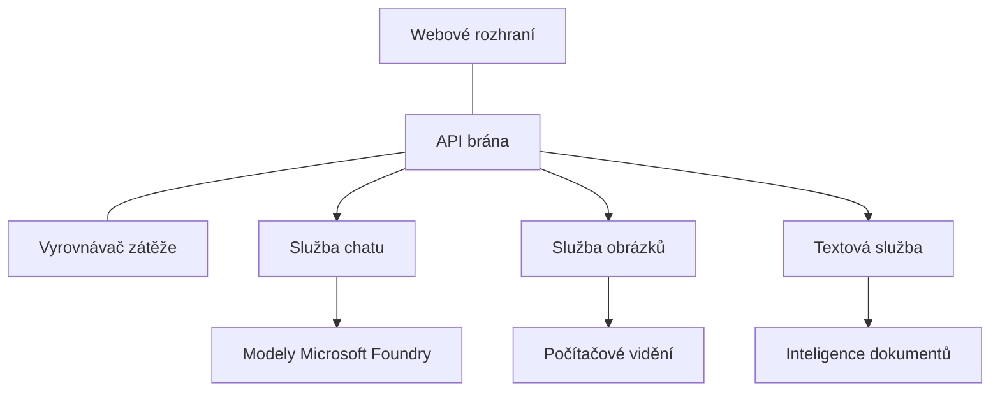

# Nejlepší postupy pro produkční AI workloady s AZD

**Navigace kapitolou:**
- **📚 Domů kurzu**: [AZD For Beginners](../../README.md)
- **📖 Aktuální kapitola**: Kapitola 8 - Produkční & Enterprise vzory
- **⬅️ Předchozí kapitola**: [Chapter 7: Troubleshooting](../chapter-07-troubleshooting/debugging.md)
- **⬅️ Také související**: [AI Workshop Lab](ai-workshop-lab.md)
- **🎯 Dokončení kurzu**: [AZD For Beginners](../../README.md)

## Přehled

Tento průvodce poskytuje komplexní doporučené postupy pro nasazení produkčně připravených AI workloadů pomocí Azure Developer CLI (AZD). Na základě zpětné vazby z komunity Microsoft Foundry Discord a skutečných zákaznických nasazení tato doporučení řeší nejběžnější výzvy v produkčních AI systémech.

## Hlavní řešené výzvy

Na základě výsledků našeho komunitního průzkumu jsou to největší problémy, kterým vývojáři čelí:

- **45 %** mají problém s nasazením více služeb AI
- **38 %** mají potíže s řízením přihlašovacích údajů a tajemství  
- **35 %** považuje připravenost na produkci a škálování za obtížné
- **32 %** potřebuje lepší strategie optimalizace nákladů
- **29 %** vyžaduje zlepšené monitorování a odstraňování problémů

## Architektonické vzory pro produkční AI

### Vzor 1: Mikroservisní AI architektura

**Kdy použít**: Složité AI aplikace s více schopnostmi



**Implementace v AZD**:

```yaml
# azure.yaml
name: enterprise-ai-platform
services:
  web:
    project: ./web
    host: staticwebapp
  api-gateway:
    project: ./api-gateway
    host: containerapp
  chat-service:
    project: ./services/chat
    host: containerapp
  vision-service:
    project: ./services/vision
    host: containerapp
  text-service:
    project: ./services/text
    host: containerapp
```

### Vzor 2: Událostmi řízené zpracování AI

**Kdy použít**: Hromadné zpracování, analýza dokumentů, asynchronní workflowy

```bicep
// Event Hub for AI processing pipeline
resource eventHub 'Microsoft.EventHub/namespaces@2023-01-01-preview' = {
  name: eventHubNamespaceName
  location: location
  sku: {
    name: 'Standard'
    tier: 'Standard'
    capacity: 1
  }
}

// Service Bus for reliable message processing
resource serviceBus 'Microsoft.ServiceBus/namespaces@2022-10-01-preview' = {
  name: serviceBusNamespaceName
  location: location
  sku: {
    name: 'Premium'
    tier: 'Premium'
    capacity: 1
  }
}

// Function App for processing
resource functionApp 'Microsoft.Web/sites@2023-01-01' = {
  name: functionAppName
  location: location
  kind: 'functionapp,linux'
  properties: {
    siteConfig: {
      appSettings: [
        {
          name: 'FUNCTIONS_EXTENSION_VERSION'
          value: '~4'
        }
        {
          name: 'AZURE_OPENAI_ENDPOINT'
          value: '@Microsoft.KeyVault(VaultName=${keyVault.name};SecretName=openai-endpoint)'
        }
      ]
    }
  }
}
```

## Posuzování stavu AI agenta

Když se tradiční webová aplikace porouchá, příznaky jsou známé: stránka se nenačte, API vrátí chybu nebo nasazení selže. AI-poháněné aplikace se mohou porouchat stejnými způsoby — ale mohou se také chovat jemněji chybně, aniž by vznikaly zjevné chybové zprávy.

Tato sekce vám pomůže vybudovat mentální model pro monitorování AI workloadů, abyste věděli, kde hledat, když něco nefunguje podle očekávání.

### Jak se zdraví agenta liší od zdraví tradiční aplikace

Tradiční aplikace buď funguje, nebo ne. AI agent může vypadat, že funguje, ale produkovat špatné výsledky. Považujte zdraví agenta za dvě vrstvy:

| Vrstva | Co sledovat | Kde hledat |
|-------|--------------|---------------|
| **Stav infrastruktury** | Běží služba? Jsou prostředky přiděleny? Jsou koncové body dosažitelné? | `azd monitor`, Azure Portal resource health, container/app logs |
| **Stav chování** | Odpovídá agent přesně? Jsou odpovědi včasné? Je model volán správně? | Application Insights traces, metriky latence volání modelu, protokoly kvality odpovědí |

Stav infrastruktury je známý — je stejný pro jakoukoli azd aplikaci. Stav chování je nová vrstva, kterou AI workloady zavádějí.

### Kde hledat, když se AI aplikace nechovají podle očekávání

Pokud vaše AI aplikace negeneruje očekávané výsledky, zde je konceptuální kontrolní seznam:

1. **Začněte od základů.** Běží aplikace? Může dosáhnout svých závislostí? Zkontrolujte `azd monitor` a stav prostředků stejně jako u jakékoli jiné aplikace.
2. **Zkontrolujte připojení k modelu.** Volá vaše aplikace úspěšně AI model? Selhávající nebo časově vypršená volání modelu jsou nejčastější příčinou problémů a objeví se ve vašich aplikačních logech.
3. **Podívejte se na to, co model obdržel.** AI odpovědi závisí na vstupu (prompt a jakýkoli získaný kontext). Pokud je výstup špatný, vstup je obvykle špatný. Zkontrolujte, jestli aplikace posílá modelu správná data.
4. **Prověřte latenci odpovědí.** Volání modelu AI jsou pomalejší než běžná API volání. Pokud se aplikace zdá pomalá, zkontrolujte, zda se nezvýšily doby odezvy modelu — to může naznačovat omezování, kapacitní limity nebo přetížení na úrovni regionu.
5. **Sledujte signály nákladů.** Neočekávané skoky ve využití tokenů nebo API voláních mohou naznačovat smyčku, špatně nakonfigurovaný prompt nebo nadměrné opakování.

Nemusíte se hned stát expertem na observabilní nástroje. Hlavní poznatek je, že AI aplikace mají další vrstvu chování, kterou je třeba sledovat, a vestavěné monitorování azd (`azd monitor`) vám dává výchozí bod pro vyšetřování obou vrstev.

---

## Nejlepší postupy zabezpečení

### 1. Zero-Trust model zabezpečení

**Strategie implementace**:
- Žádná komunikace služba-ke-službě bez autentizace
- Všechna API volání používají spravované identity
- Izolace sítě pomocí privátních koncových bodů
- Přístupy podle principu nejmenších oprávnění

```bicep
// Managed Identity for each service
resource chatServiceIdentity 'Microsoft.ManagedIdentity/userAssignedIdentities@2023-01-31' = {
  name: 'chat-service-identity'
  location: location
}

// Role assignments with minimal permissions
resource openAIUserRole 'Microsoft.Authorization/roleAssignments@2022-04-01' = {
  scope: openAIAccount
  name: guid(openAIAccount.id, chatServiceIdentity.id, openAIUserRoleDefinitionId)
  properties: {
    roleDefinitionId: subscriptionResourceId('Microsoft.Authorization/roleDefinitions', '5e0bd9bd-7b93-4f28-af87-19fc36ad61bd')
    principalId: chatServiceIdentity.properties.principalId
    principalType: 'ServicePrincipal'
  }
}
```

### 2. Bezpečná správa tajemství

**Vzor integrace s Key Vault**:

```bicep
// Key Vault with proper access policies
resource keyVault 'Microsoft.KeyVault/vaults@2023-02-01' = {
  name: keyVaultName
  location: location
  properties: {
    tenantId: tenant().tenantId
    sku: {
      family: 'A'
      name: 'premium'  // Use premium for production
    }
    enableRbacAuthorization: true  // Use RBAC instead of access policies
    enablePurgeProtection: true    // Prevent accidental deletion
    enableSoftDelete: true
    softDeleteRetentionInDays: 90
  }
}

// Store all AI service credentials
resource openAIKeySecret 'Microsoft.KeyVault/vaults/secrets@2023-02-01' = {
  parent: keyVault
  name: 'openai-api-key'
  properties: {
    value: openAIAccount.listKeys().key1
    attributes: {
      enabled: true
    }
  }
}
```

### 3. Síťová bezpečnost

**Konfigurace privátních koncových bodů**:

```bicep
// Virtual Network for AI services
resource virtualNetwork 'Microsoft.Network/virtualNetworks@2023-04-01' = {
  name: vnetName
  location: location
  properties: {
    addressSpace: {
      addressPrefixes: ['10.0.0.0/16']
    }
    subnets: [
      {
        name: 'ai-services-subnet'
        properties: {
          addressPrefix: '10.0.1.0/24'
          privateEndpointNetworkPolicies: 'Disabled'
        }
      }
      {
        name: 'app-services-subnet'
        properties: {
          addressPrefix: '10.0.2.0/24'
          delegations: [
            {
              name: 'Microsoft.Web/serverFarms'
              properties: {
                serviceName: 'Microsoft.Web/serverFarms'
              }
            }
          ]
        }
      }
    ]
  }
}

// Private endpoints for all AI services
resource openAIPrivateEndpoint 'Microsoft.Network/privateEndpoints@2023-04-01' = {
  name: '${openAIAccountName}-pe'
  location: location
  properties: {
    subnet: {
      id: virtualNetwork.properties.subnets[0].id
    }
    privateLinkServiceConnections: [
      {
        name: 'openai-connection'
        properties: {
          privateLinkServiceId: openAIAccount.id
          groupIds: ['account']
        }
      }
    ]
  }
}
```

## Výkon a škálování

### 1. Strategie automatického škálování

**Automatické škálování Container Apps**:

```bicep
resource containerApp 'Microsoft.App/containerApps@2023-05-01' = {
  name: containerAppName
  location: location
  properties: {
    configuration: {
      ingress: {
        external: true
        targetPort: 8000
        transport: 'http'
      }
    }
    template: {
      scale: {
        minReplicas: 2  // Always have 2 instances minimum
        maxReplicas: 50 // Scale up to 50 for high load
        rules: [
          {
            name: 'http-scaling'
            http: {
              metadata: {
                concurrentRequests: '20'  // Scale when >20 concurrent requests
              }
            }
          }
          {
            name: 'cpu-scaling'
            custom: {
              type: 'cpu'
              metadata: {
                type: 'Utilization'
                value: '70'  // Scale when CPU >70%
              }
            }
          }
        ]
      }
    }
  }
}
```

### 2. Strategie cachování

**Redis Cache pro AI odpovědi**:

```bicep
// Redis Premium for production workloads
resource redisCache 'Microsoft.Cache/redis@2023-04-01' = {
  name: redisCacheName
  location: location
  properties: {
    sku: {
      name: 'Premium'
      family: 'P'
      capacity: 1
    }
    enableNonSslPort: false
    minimumTlsVersion: '1.2'
    redisConfiguration: {
      'maxmemory-policy': 'allkeys-lru'
    }
    // Enable clustering for high availability
    redisVersion: '6.0'
    shardCount: 2
  }
}

// Cache configuration in application
var cacheConnectionString = '${redisCache.properties.hostName}:6380,password=${redisCache.listKeys().primaryKey},ssl=True,abortConnect=False'
```

### 3. Vyrovnávání zátěže a řízení provozu

**Application Gateway s WAF**:

```bicep
// Application Gateway with Web Application Firewall
resource applicationGateway 'Microsoft.Network/applicationGateways@2023-04-01' = {
  name: appGatewayName
  location: location
  properties: {
    sku: {
      name: 'WAF_v2'
      tier: 'WAF_v2'
      capacity: 2
    }
    webApplicationFirewallConfiguration: {
      enabled: true
      firewallMode: 'Prevention'
      ruleSetType: 'OWASP'
      ruleSetVersion: '3.2'
    }
    // Backend pools for AI services
    backendAddressPools: [
      {
        name: 'ai-services-pool'
        properties: {
          backendAddresses: [
            {
              fqdn: '${containerApp.properties.configuration.ingress.fqdn}'
            }
          ]
        }
      }
    ]
  }
}
```

## 💰 Optimalizace nákladů

### 1. Správné dimenzování prostředků

**Konfigurace specifické pro prostředí**:

```bash
# Vývojové prostředí
azd env new development
azd env set AZURE_OPENAI_SKU "S0"
azd env set AZURE_OPENAI_CAPACITY 10
azd env set AZURE_SEARCH_SKU "basic"
azd env set CONTAINER_CPU 0.5
azd env set CONTAINER_MEMORY 1.0

# Produkční prostředí
azd env new production
azd env set AZURE_OPENAI_SKU "S0"
azd env set AZURE_OPENAI_CAPACITY 100
azd env set AZURE_SEARCH_SKU "standard"
azd env set CONTAINER_CPU 2.0
azd env set CONTAINER_MEMORY 4.0
```

### 2. Sledování nákladů a rozpočty

```bicep
// Cost management and budgets
resource budget 'Microsoft.Consumption/budgets@2023-05-01' = {
  name: 'ai-workload-budget'
  properties: {
    timePeriod: {
      startDate: '2024-01-01'
      endDate: '2024-12-31'
    }
    timeGrain: 'Monthly'
    amount: 2000  // $2000 monthly budget
    category: 'Cost'
    notifications: {
      warning: {
        enabled: true
        operator: 'GreaterThan'
        threshold: 80
        contactEmails: [
          'finance@company.com'
          'engineering@company.com'
        ]
        contactRoles: [
          'Owner'
          'Contributor'
        ]
      }
      critical: {
        enabled: true
        operator: 'GreaterThan'
        threshold: 95
        contactEmails: [
          'cto@company.com'
        ]
      }
    }
  }
}
```

### 3. Optimalizace využití tokenů

**Řízení nákladů OpenAI**:

```typescript
// Optimalizace tokenů na úrovni aplikace
class TokenOptimizer {
  private readonly maxTokens = 4000;
  private readonly reserveTokens = 500;
  
  optimizePrompt(userInput: string, context: string): string {
    const availableTokens = this.maxTokens - this.reserveTokens;
    const estimatedTokens = this.estimateTokens(userInput + context);
    
    if (estimatedTokens > availableTokens) {
      // Zkracujte kontext, ne uživatelský vstup
      context = this.truncateContext(context, availableTokens - this.estimateTokens(userInput));
    }
    
    return `${context}\n\nUser: ${userInput}`;
  }
  
  private estimateTokens(text: string): number {
    // Hrubý odhad: 1 token ≈ 4 znaky
    return Math.ceil(text.length / 4);
  }
}
```

## Monitorování a observabilita

### 1. Komplexní Application Insights

```bicep
// Application Insights with advanced features
resource applicationInsights 'Microsoft.Insights/components@2020-02-02' = {
  name: applicationInsightsName
  location: location
  kind: 'web'
  properties: {
    Application_Type: 'web'
    WorkspaceResourceId: logAnalyticsWorkspace.id
    SamplingPercentage: 100  // Full sampling for AI apps
    DisableIpMasking: false  // Enable for security
  }
}

// Custom metrics for AI operations
resource aiMetricAlerts 'Microsoft.Insights/metricAlerts@2018-03-01' = {
  name: 'ai-high-error-rate'
  location: 'global'
  properties: {
    description: 'Alert when AI service error rate is high'
    severity: 2
    enabled: true
    scopes: [
      applicationInsights.id
    ]
    evaluationFrequency: 'PT1M'
    windowSize: 'PT5M'
    criteria: {
      'odata.type': 'Microsoft.Azure.Monitor.SingleResourceMultipleMetricCriteria'
      allOf: [
        {
          name: 'high-error-rate'
          metricName: 'requests/failed'
          operator: 'GreaterThan'
          threshold: 10
          timeAggregation: 'Count'
        }
      ]
    }
  }
}
```

### 2. Monitorování specifické pro AI

**Vlastní dashboardy pro metriky AI**:

```json
// Dashboard configuration for AI workloads
{
  "dashboard": {
    "name": "AI Application Monitoring",
    "tiles": [
      {
        "name": "OpenAI Request Volume",
        "query": "requests | where name contains 'openai' | summarize count() by bin(timestamp, 5m)"
      },
      {
        "name": "AI Response Latency",
        "query": "requests | where name contains 'openai' | summarize avg(duration) by bin(timestamp, 5m)"
      },
      {
        "name": "Token Usage",
        "query": "customMetrics | where name == 'openai_tokens_used' | summarize sum(value) by bin(timestamp, 1h)"
      },
      {
        "name": "Cost per Hour",
        "query": "customMetrics | where name == 'openai_cost' | summarize sum(value) by bin(timestamp, 1h)"
      }
    ]
  }
}
```

### 3. Kontroly zdraví a monitorování dostupnosti

```bicep
// Application Insights availability tests
resource availabilityTest 'Microsoft.Insights/webtests@2022-06-15' = {
  name: 'ai-app-availability-test'
  location: location
  tags: {
    'hidden-link:${applicationInsights.id}': 'Resource'
  }
  properties: {
    SyntheticMonitorId: 'ai-app-availability-test'
    Name: 'AI Application Availability Test'
    Description: 'Tests AI application endpoints'
    Enabled: true
    Frequency: 300  // 5 minutes
    Timeout: 120    // 2 minutes
    Kind: 'ping'
    Locations: [
      {
        Id: 'us-east-2-azr'
      }
      {
        Id: 'us-west-2-azr'
      }
    ]
    Configuration: {
      WebTest: '''
        <WebTest Name="AI Health Check" 
                 Id="8d2de8d2-a2b0-4c2e-9a0d-8f9c9a0b8c8d" 
                 Enabled="True" 
                 CssProjectStructure="" 
                 CssIteration="" 
                 Timeout="120" 
                 WorkItemIds="" 
                 xmlns="http://microsoft.com/schemas/VisualStudio/TeamTest/2010" 
                 Description="" 
                 CredentialUserName="" 
                 CredentialPassword="" 
                 PreAuthenticate="True" 
                 Proxy="default" 
                 StopOnError="False" 
                 RecordedResultFile="" 
                 ResultsLocale="">
          <Items>
            <Request Method="GET" 
                     Guid="a5f10126-e4cd-570d-961c-cea43999a200" 
                     Version="1.1" 
                     Url="${webApp.properties.defaultHostName}/health" 
                     ThinkTime="0" 
                     Timeout="120" 
                     ParseDependentRequests="True" 
                     FollowRedirects="True" 
                     RecordResult="True" 
                     Cache="False" 
                     ResponseTimeGoal="0" 
                     Encoding="utf-8" 
                     ExpectedHttpStatusCode="200" 
                     ExpectedResponseUrl="" 
                     ReportingName="" 
                     IgnoreHttpStatusCode="False" />
          </Items>
        </WebTest>
      '''
    }
  }
}
```

## Obnova po havárii a vysoká dostupnost

### 1. Nasazení do více regionů

```yaml
# azure.yaml - Multi-region configuration
name: ai-app-multiregion
services:
  api-primary:
    project: ./api
    host: containerapp
    env:
      - AZURE_REGION=eastus
  api-secondary:
    project: ./api
    host: containerapp
    env:
      - AZURE_REGION=westus2
```

```bicep
// Traffic Manager for global load balancing
resource trafficManager 'Microsoft.Network/trafficManagerProfiles@2022-04-01' = {
  name: trafficManagerProfileName
  location: 'global'
  properties: {
    profileStatus: 'Enabled'
    trafficRoutingMethod: 'Priority'
    dnsConfig: {
      relativeName: trafficManagerProfileName
      ttl: 30
    }
    monitorConfig: {
      protocol: 'HTTPS'
      port: 443
      path: '/health'
      intervalInSeconds: 30
      toleratedNumberOfFailures: 3
      timeoutInSeconds: 10
    }
    endpoints: [
      {
        name: 'primary-endpoint'
        type: 'Microsoft.Network/trafficManagerProfiles/azureEndpoints'
        properties: {
          targetResourceId: primaryAppService.id
          endpointStatus: 'Enabled'
          priority: 1
        }
      }
      {
        name: 'secondary-endpoint'
        type: 'Microsoft.Network/trafficManagerProfiles/azureEndpoints'
        properties: {
          targetResourceId: secondaryAppService.id
          endpointStatus: 'Enabled'
          priority: 2
        }
      }
    ]
  }
}
```

### 2. Zálohování a obnova dat

```bicep
// Backup configuration for critical data
resource backupVault 'Microsoft.DataProtection/backupVaults@2023-05-01' = {
  name: backupVaultName
  location: location
  identity: {
    type: 'SystemAssigned'
  }
  properties: {
    storageSettings: [
      {
        datastoreType: 'VaultStore'
        type: 'LocallyRedundant'
      }
    ]
  }
}

// Backup policy for AI models and data
resource backupPolicy 'Microsoft.DataProtection/backupVaults/backupPolicies@2023-05-01' = {
  parent: backupVault
  name: 'ai-data-backup-policy'
  properties: {
    policyRules: [
      {
        backupParameters: {
          backupType: 'Full'
          objectType: 'AzureBackupParams'
        }
        trigger: {
          schedule: {
            repeatingTimeIntervals: [
              'R/2024-01-01T02:00:00+00:00/P1D'  // Daily at 2 AM
            ]
          }
          objectType: 'ScheduleBasedTriggerContext'
        }
        dataStore: {
          datastoreType: 'VaultStore'
          objectType: 'DataStoreInfoBase'
        }
        name: 'BackupDaily'
        objectType: 'AzureBackupRule'
      }
    ]
  }
}
```

## DevOps a integrace CI/CD

### 1. Pracovní postup GitHub Actions

```yaml
# .github/workflows/deploy-ai-app.yml
name: Deploy AI Application

on:
  push:
    branches: [main]
  pull_request:
    branches: [main]

jobs:
  test:
    runs-on: ubuntu-latest
    steps:
      - uses: actions/checkout@v4
      
      - name: Setup Python
        uses: actions/setup-python@v4
        with:
          python-version: '3.11'
          
      - name: Install dependencies
        run: |
          pip install -r requirements.txt
          pip install pytest
          
      - name: Run tests
        run: pytest tests/
        
      - name: AI Safety Tests
        run: |
          python scripts/test_ai_safety.py
          python scripts/validate_prompts.py

  deploy-staging:
    needs: test
    if: github.event_name == 'pull_request'
    runs-on: ubuntu-latest
    steps:
      - uses: actions/checkout@v4
      
      - name: Setup AZD
        uses: Azure/setup-azd@v2
        
      - name: Login to Azure
        uses: azure/login@v1
        with:
          creds: ${{ secrets.AZURE_CREDENTIALS }}
          
      - name: Deploy to Staging
        run: |
          azd env select staging
          azd deploy

  deploy-production:
    needs: test
    if: github.ref == 'refs/heads/main'
    runs-on: ubuntu-latest
    steps:
      - uses: actions/checkout@v4
      
      - name: Setup AZD
        uses: Azure/setup-azd@v2
        
      - name: Login to Azure
        uses: azure/login@v1
        with:
          creds: ${{ secrets.AZURE_CREDENTIALS }}
          
      - name: Deploy to Production
        run: |
          azd env select production
          azd deploy
          
      - name: Run Production Health Checks
        run: |
          python scripts/health_check.py --env production
```

### 2. Validace infrastruktury

```bash
# scripts/validate_infrastructure.sh
#!/bin/bash

echo "Validating AI infrastructure deployment..."

# Zkontrolujte, zda všechny požadované služby běží
services=("openai" "search" "storage" "keyvault")
for service in "${services[@]}"; do
    echo "Checking $service..."
    if ! az resource list --resource-type "Microsoft.CognitiveServices/accounts" --query "[?contains(name, '$service')]" -o tsv; then
        echo "ERROR: $service not found"
        exit 1
    fi
done

# Ověřte nasazení modelů OpenAI
echo "Validating OpenAI model deployments..."
models=$(az cognitiveservices account deployment list --name $AZURE_OPENAI_NAME --resource-group $AZURE_RESOURCE_GROUP --query "[].name" -o tsv)
if [[ ! $models == *"gpt-4.1-mini"* ]]; then
  echo "ERROR: Required model gpt-4.1-mini not deployed"
    exit 1
fi

# Otestujte připojení ke službě AI
echo "Testing AI service connectivity..."
python scripts/test_connectivity.py

echo "Infrastructure validation completed successfully!"
```

## Kontrolní seznam pro produkční připravenost

### Bezpečnost ✅
- [ ] Všechny služby používají spravované identity
- [ ] Tajemství uložená v Key Vault
- [ ] Konfigurace privátních koncových bodů
- [ ] Implementovány bezpečnostní skupiny sítě
- [ ] RBAC s principem nejmenších oprávnění
- [ ] WAF povolen na veřejných koncových bodech

### Výkon ✅
- [ ] Automatické škálování nakonfigurováno
- [ ] Implementováno cachování
- [ ] Nastaveno vyrovnávání zátěže
- [ ] CDN pro statický obsah
- [ ] Poolování připojení k databázi
- [ ] Optimalizace využití tokenů

### Monitorování ✅
- [ ] Application Insights nakonfigurováno
- [ ] Definovány vlastní metriky
- [ ] Nastaveny pravidla alertů
- [ ] Vytvořen dashboard
- [ ] Implementovány health checky
- [ ] Politiky uchovávání logů

### Spolehlivost ✅
- [ ] Nasazení do více regionů
- [ ] Plán zálohování a obnovy
- [ ] Implementovány circuit-breakery
- [ ] Nakonfigurovány retry politiky
- [ ] Graceful degradation
- [ ] Konečné body health checků

### Řízení nákladů ✅
- [ ] Nastaveny upozornění rozpočtu
- [ ] Správné dimenzování prostředků
- [ ] Aplikovány slevy pro vývoj/test
- [ ] Zakoupené rezervované instance
- [ ] Dashboard pro sledování nákladů
- [ ] Pravidelné revize nákladů

### Soulad (Compliance) ✅
- [ ] Splněny požadavky na umístění dat
- [ ] Auditní logování povoleno
- [ ] Aplikovány compliance politiky
- [ ] Implementovány bezpečnostní baseline
- [ ] Pravidelné bezpečnostní hodnocení
- [ ] Plán reakce na incidenty

## Výkonové benchmarky

### Typické produkční metriky

| Metrika | Cíl | Sledování |
|--------|--------|------------|
| **Doba odezvy** | < 2 sekundy | Application Insights |
| **Dostupnost** | 99.9% | Monitorování dostupnosti |
| **Míra chyb** | < 0.1% | Aplikační logy |
| **Využití tokenů** | < $500/month | Řízení nákladů |
| **Současní uživatelé** | 1000+ | Zátěžové testování |
| **Doba obnovy** | < 1 hodina | Testy obnovy po havárii |

### Zátěžové testování

```bash
# Skript pro zátěžové testování AI aplikací
python scripts/load_test.py \
  --endpoint https://your-ai-app.azurewebsites.net \
  --concurrent-users 100 \
  --duration 300 \
  --ramp-up 60
```

## 🤝 Osvědčené postupy komunity

Na základě zpětné vazby komunity Microsoft Foundry Discord:

### Hlavní doporučení od komunity:

1. **Začněte malě, škálujte postupně**: Začněte se základními SKU a škálujte podle skutečného využití
2. **Monitorujte vše**: Nastavte komplexní monitorování od prvního dne
3. **Automatizujte zabezpečení**: Používejte infrastrukturu jako kód pro konzistentní zabezpečení
4. **Důkladně testujte**: Zahrňte testování specifické pro AI do vašeho pipeline
5. **Plánujte náklady**: Sledujte využití tokenů a nastavte upozornění rozpočtu brzy

### Běžné úskalí, kterým se vyvarovat:

- ❌ Vkládání API klíčů přímo do kódu
- ❌ Nezprovoznění správného monitorování
- ❌ Ignorování optimalizace nákladů
- ❌ Netestování scénářů selhání
- ❌ Nasazení bez health checků

## Příkazy AZD AI CLI a rozšíření

AZD obsahuje rostoucí sadu AI-specifických příkazů a rozšíření, které zjednodušují produkční AI workflowy. Tyto nástroje přemostí propast mezi lokálním vývojem a produkčním nasazením AI workloadů.

### Rozšíření AZD pro AI

AZD používá systém rozšíření pro přidání AI-specifických schopností. Rozšíření nainstalujete a spravujete pomocí:

```bash
# Vypsat všechna dostupná rozšíření (včetně AI)
azd extension list

# Zobrazit podrobnosti nainstalovaných rozšíření
azd extension show azure.ai.agents

# Nainstalovat rozšíření Foundry Agents
azd extension install azure.ai.agents

# Nainstalovat rozšíření pro doladění
azd extension install azure.ai.finetune

# Nainstalovat rozšíření pro vlastní modely
azd extension install azure.ai.models

# Aktualizovat všechna nainstalovaná rozšíření
azd extension upgrade --all
```

**Dostupná AI rozšíření:**

| Rozšíření | Účel | Stav |
|-----------|---------|--------|
| `azure.ai.agents` | Správa Foundry Agent Service | Preview |
| `azure.ai.skills` | Znovupoužitelné agentní dovednosti | Preview |
| `azure.ai.connections` | Foundry připojení (zdroje dat, nástroje) | Preview |
| `azure.ai.finetune` | Doladění modelů ve Foundry | Preview |
| `azure.ai.models` | Vlastní modely ve Foundry | Preview |
| `azure.coding-agent` | Konfigurace coding agenta | Available |

> Rozšíření `azure.ai.agents` se rychle vyvíjí. Tento kurz je validován proti verzi `0.1.40-preview`. Spusťte `azd extension upgrade --all` pro získání nejnovější sady příkazů a `azd extension show azure.ai.agents` pro potvrzení nainstalované verze.

**Co jsou novější rozšíření `skills` a `connections`?**

Dva náhledová rozšíření se objevila spolu s nástroji pro agenty a stojí za to je pochopit i pro začátečníka:

- **`azure.ai.skills`** — **skill** je znovupoužitelná schopnost (zabalený nástroj nebo chování), kterou můžete připojit k jednomu nebo více agentům místo opětovné implementace pokaždé. Představte si to jako sdílený stavební blok: definujte jednou „hledání v dokumentaci“ nebo „vyhledání objednávky“ a znovu jej použijte napříč agenty. To udržuje multi-agentní systémy (Kapitola 5) konzistentní a zabraňuje kopírování kódu.
- **`azure.ai.connections`** — **connection** je spravované propojení z vašeho Foundry projektu na externí zdroj, který agenti potřebují — zdroj dat (např. Azure AI Search), endpoint nástroje nebo jiná služba. Connections centralizují *kde* a *jak* agenti přistupují k datům, takže přihlašovací údaje a koncové body žijí na jednom řízeném místě místo toho, aby byly rozházené v kódu.

Pro první nasazení agentů tato rozšíření nepotřebujete — při učení zůstaňte u `azure.ai.agents`. Pořiďte si `skills`, když začnete duplikovat stejný nástroj mezi agenty, a `connections`, když více agentů sdílí stejný zdroj dat.

### Inicializace projektu agenta pomocí `azd ai agent init`

Příkaz `azd ai agent init` vygeneruje kostru produkčně připraveného projektu AI agenta integrovaného s Microsoft Foundry Agent Service:

```bash
# Inicializovat nový projekt agenta z manifestu agenta
azd ai agent init -m <manifest-path-or-uri>

# Inicializovat a zacílit na konkrétní projekt Foundry
azd ai agent init -m agent-manifest.yaml --project-id <foundry-project-id>

# Inicializovat s vlastním zdrojovým adresářem
azd ai agent init -m agent-manifest.yaml --src ./agents/my-agent

# Zacílit na Container Apps jako hostitele
azd ai agent init -m agent-manifest.yaml --host containerapp
```

**Klíčové přepínače:**

| Přepínač | Popis |
|------|-------------|
| `-m, --manifest` | Cesta nebo URI k agent manifestu, který chcete přidat do projektu |
| `-p, --project-id` | Existující Microsoft Foundry Project ID pro vaše azd prostředí |
| `-s, --src` | Adresář pro stažení definice agenta (výchozí `src/<agent-id>`) |
| `--host` | Přepsat výchozí hostitele (např. `containerapp`) |
| `-e, --environment` | Azd prostředí, které se má použít |

**Tip pro produkci**: Použijte `--project-id` pro přímé připojení k existujícímu Foundry projektu, čímž udržíte kód agenta a cloudové prostředky propojené od začátku.

### Správa životního cyklu agenta

Kromě `init` rozšíření `azure.ai.agents` poskytuje příkazy pro celý životní cyklus hostovaného agenta — testování, hodnocení, optimalizaci a vyřazení:

```bash
# Vyvolejte nasazeného agenta a zobrazte časování odpovědí serveru
# (celková latence a doba do prvního bajtu)
azd ai agent invoke

# Zobrazte konfiguraci živého koncového bodu před jejím změněním
azd ai agent endpoint show

# Vygenerujte evaluační datovou sadu pro agenta
azd ai agent eval generate --dataset ./eval/dataset.jsonl

# Optimalizujte pokyny agenta podle vašich evaluačních dat
# (vyžaduje optimization_model v projektu agenta)
azd ai agent optimize

# Stáhněte nasazený zdroj hostovaného agenta založeného na kódu
# (s ověřením SHA-256)
azd ai agent code download

# Odstraňte hostovaného agenta a všechny jeho verze
# (--force ukončí aktivní relace)
azd ai agent delete --force
```

**Životní cyklus přehledně:**

| Fáze | Příkaz | Použití v produkci |
|-------|---------|----------------|
| Test | `azd ai agent invoke` | Ověřit odpovědi a změřit latenci před vydáním |
| Inspekce | `azd ai agent endpoint show` | Zkontrolovat auth/konfiguraci endpointu; odhalit rozbíjející změny brzy |
| Měření | `azd ai agent eval generate` | Vytvořit opakovatelné evaluační sady z reálných trace |
| Zlepšení | `azd ai agent optimize` | Ladit instrukce proti změřené kvalitě |
| Obnova | `azd ai agent code download` | Získat přesný nasazený zdroj pro audit/rollback |
| Vyřazení | `azd ai agent delete --force` | Čistě odstranit agenta a jeho verze |

> Jedná se o příkazy v náhledu a mohou se mezi verzemi rozšíření měnit. Spusťte `azd ai agent --help` pro zobrazení přesných podpříkazů dostupných ve vaší nainstalované verzi.

### Model Context Protocol (MCP) s `azd mcp`
AZD includes built-in MCP server support (Alpha), enabling AI agents and tools to interact with your Azure resources through a standardized protocol:

```bash
# Spusťte MCP server pro váš projekt
azd mcp start

# Zkontrolujte aktuální pravidla souhlasu Copilota pro spouštění nástrojů
azd copilot consent list
```

MCP server vystavuje kontext vašeho azd projektu—prostředí, služby a Azure zdroje—pro nástroje pro vývoj s podporou AI. To umožňuje:

- **Nasazování s asistencí AI**: Umožněte kódovacím agentům dotazovat stav projektu a spouštět nasazení
- **Objevování zdrojů**: Nástroje AI mohou zjistit, jaké Azure zdroje váš projekt používá
- **Správa prostředí**: Agenti mohou přepínat mezi prostředími dev/staging/production

### Generování infrastruktury pomocí `azd infra generate`

Pro produkční AI pracovní zátěže můžete generovat a přizpůsobit infrastrukturu jako kód místo spoléhání se na automatické provisionování:

```bash
# Vygenerovat soubory Bicep/Terraform z definice projektu
azd infra generate
```

To zapíše IaC na disk, díky čemuž můžete:
- Prohlédnout a auditovat infrastrukturu před nasazením
- Přidat vlastní bezpečnostní politiky (síťová pravidla, privátní koncové body)
- Integrovat do stávajících procesů kontroly IaC
- Verzovat změny infrastruktury samostatně od aplikačního kódu

### Produkční hooky životního cyklu

AZD hooky vám umožňují vložit vlastní logiku do každé fáze životního cyklu nasazení—kritické pro produkční AI pracovní postupy:

```yaml
# azure.yaml - Production hooks example
name: ai-production-app
hooks:
  preprovision:
    shell: sh
    run: scripts/validate-quotas.sh    # Check AI model quota before provisioning
  postprovision:
    shell: sh
    run: scripts/configure-networking.sh  # Set up private endpoints
  predeploy:
    shell: sh
    run: scripts/run-ai-safety-tests.sh  # Run prompt safety checks
  postdeploy:
    shell: sh
    run: scripts/smoke-test.sh           # Verify agent responses post-deploy
services:
  agent-api:
    project: ./src/agent
    host: containerapp
    hooks:
      predeploy:
        shell: sh
        run: scripts/validate-model-access.sh  # Per-service hook
```

```bash
# Ručně spusťte konkrétní hook během vývoje
azd hooks run predeploy
```

**Doporučené produkční hooky pro AI pracovní zátěže:**

| Hook | Použití |
|------|----------|
| `preprovision` | Ověřit kvóty předplatného pro kapacitu AI modelu |
| `postprovision` | Konfigurovat privátní koncové body, nasadit váhy modelu |
| `predeploy` | Spustit AI bezpečnostní testy, ověřit šablony promptů |
| `postdeploy` | Provest smoke test odpovědí agentů, ověřit konektivitu modelu |

### Konfigurace CI/CD pipeline

Použijte `azd pipeline config` k připojení vašeho projektu k GitHub Actions nebo Azure Pipelines se zabezpečenou autentizací Azure:

```bash
# Nakonfigurujte CI/CD pipeline (interaktivně)
azd pipeline config

# Nakonfigurujte s konkrétním poskytovatelem
azd pipeline config --provider github
```

Tento příkaz:
- Vytvoří service principal s nejmenším nutným oprávněním
- Konfiguruje federované přihlašovací údaje (žádné uložené tajné klíče)
- Vygeneruje nebo aktualizuje soubor definice pipeline
- Nastaví požadované proměnné prostředí ve vašem CI/CD systému

#### Krok za krokem: váš první GitHub Actions pipeline

Zde je kompletní průvodce od funkčního azd projektu po automatická nasazení při každém pushi.

**1. Ujistěte se, že váš projekt je na GitHubu**

```bash
git init
git add .
git commit -m "Initial azd project"
gh repo create my-ai-app --private --source=. --push
```

**2. Spusťte pipeline config**

```bash
azd pipeline config --provider github
```

azd interaktivně:
- Zeptá se, které Azure předplatné a prostředí chcete použít
- Vytvoří Entra **registraci aplikace + service principal** pro pipeline
- Nastaví **federované přihlašovací údaje (OIDC)**—takže GitHub se autentizuje do Azure s krátkodobými tokeny a **žádná tajemství nejsou uložena**
- Nahraje požadované **proměnné** do vašeho GitHub repozitáře (`AZURE_CLIENT_ID`, `AZURE_TENANT_ID`, `AZURE_SUBSCRIPTION_ID`, `AZURE_ENV_NAME`, `AZURE_LOCATION`)

**3. Pochopte vygenerovaný workflow**

azd přidá `.github/workflows/azure-dev.yml`. Klíčové části vypadají takto:

```yaml
# .github/workflows/azure-dev.yml
on:
  push:
    branches: [ main ]
  workflow_dispatch:        # lets you run it manually too

permissions:
  id-token: write           # required for OIDC federated login
  contents: read

jobs:
  build:
    runs-on: ubuntu-latest
    env:
      AZURE_CLIENT_ID: ${{ vars.AZURE_CLIENT_ID }}
      AZURE_TENANT_ID: ${{ vars.AZURE_TENANT_ID }}
      AZURE_SUBSCRIPTION_ID: ${{ vars.AZURE_SUBSCRIPTION_ID }}
      AZURE_ENV_NAME: ${{ vars.AZURE_ENV_NAME }}
      AZURE_LOCATION: ${{ vars.AZURE_LOCATION }}
    steps:
      - uses: actions/checkout@v4
      - name: Install azd
        uses: Azure/setup-azd@v2
      - name: Log in with OIDC
        run: azd auth login --client-id "$AZURE_CLIENT_ID" --federated-credential-provider "github" --tenant-id "$AZURE_TENANT_ID"
      - name: Provision infrastructure
        run: azd provision --no-prompt
      - name: Deploy application
        run: azd deploy --no-prompt
```

**4. Ověřte, že funguje**

```bash
# Pro spuštění pipeline proveďte push změny.
git commit -am "Trigger pipeline" --allow-empty
git push
```

Otevřete kartu **Actions** ve vašem GitHub repozitáři a sledujte, jak workflow automaticky spouští `azd provision` a `azd deploy`.

> **Proč jsou federované přihlašovací údaje důležité:** starší pipeline ukládaly klientské tajemství v GitHubu. OIDC federované přihlašovací údaje toto tajemství zcela odstraňují—GitHub si při běhu vyžádá krátkodobý token, což je bezpečnější a není co rotovat nebo zveřejnit. Toto je výchozí nastavení `azd pipeline config`.

> **Tajemství vs. proměnné:** necitlivé identifikátory (`AZURE_CLIENT_ID`, atd.) patří do repozitáře jako **proměnné**. Pokud vaše aplikace skutečně potřebuje tajemství při sestavení, přidejte ho jako GitHub **secret** a odkažte se na něj pomocí `${{ secrets.NAME }}`—ale preferujte Key Vault + spravovanou identitu v runtime (viz [Chapter 3](../chapter-03-configuration/authsecurity.md)).

**Produkční workflow s pipeline config:**

```bash
# 1. Nastavte produkční prostředí
azd env new production
azd env set AZURE_OPENAI_CAPACITY 100

# 2. Nakonfigurujte pipeline
azd pipeline config --provider github

# 3. Pipeline spouští azd deploy při každém pushi do větve main
```

#### Krok za krokem: Azure DevOps Pipelines

Dáváte přednost Azure DevOps před GitHub Actions? azd to nativně podporuje pomocí poskytovatele `azdo`. Průběh je téměř totožný—azd vygeneruje soubor pipeline, vytvoří service connection a nastaví autentizaci.

**1. Ujistěte se, že máte Azure DevOps projekt**

Potřebujete organizaci a projekt na `https://dev.azure.com/<your-org>`. Vygenerujte Personal Access Token (PAT) s oprávněními **Build (Read & execute)**, **Code (Read & write)** a **Service Connections (Read, query & manage)**—azd vás na něj vyzve.

**2. Nakonfigurujte pipeline**

```bash
azd pipeline config --provider azdo
```

azd provede:
- Zeptá se na vaši Azure DevOps organizaci a projekt
- Vytvoří (nebo znovu použije) **service connection** do Azure pomocí service principala
- Nakonfiguruje **workload identity federation (OIDC)** tak, aby nebylo uloženo žádné klientské tajemství
- Commitne definici pipeline `azure-dev.yml` do vašeho repozitáře

**3. Zkontrolujte vygenerovaný `azure-dev.yml`**

azd vytvoří pipeline, která provádí provisioning a nasazení při každém pushi do `main`:

```yaml
# azure-dev.yml
trigger:
  - main

pool:
  vmImage: ubuntu-latest

steps:
  - task: setup-azd@1
    displayName: Install azd

  - script: azd provision --no-prompt
    displayName: Provision Infrastructure
    env:
      AZURE_SUBSCRIPTION_ID: $(AZURE_SUBSCRIPTION_ID)
      AZURE_ENV_NAME: $(AZURE_ENV_NAME)
      AZURE_LOCATION: $(AZURE_LOCATION)

  - script: azd deploy --no-prompt
    displayName: Deploy Application
    env:
      AZURE_SUBSCRIPTION_ID: $(AZURE_SUBSCRIPTION_ID)
      AZURE_ENV_NAME: $(AZURE_ENV_NAME)
      AZURE_LOCATION: $(AZURE_LOCATION)
```

**4. Odkud proměnné pocházejí**

azd ukládá hodnoty prostředí (`AZURE_ENV_NAME`, `AZURE_LOCATION`, `AZURE_SUBSCRIPTION_ID`) jako **variable group** v Azure DevOps, aby je pipeline mohla číst. Můžete je zobrazit a upravit pod **Pipelines → Library**.

> **Stejný přínos OIDC jako u GitHubu:** poskytovatel `azdo` také výchozně konfiguruje workload identity federation, takže v service connection není uloženo žádné klientské tajemství—Azure DevOps vymění krátkodobý token při běhu. Předávejte `--auth-type client-credentials` pouze pokud vaše organizace zatím nemůže používat OIDC.

**5. Spusťte to**

```bash
git commit -am "Add Azure DevOps pipeline" --allow-empty
git push
```

Otevřete **Pipelines** v Azure DevOps a sledujte spuštění `azd provision` a `azd deploy`.

### Přidávání komponent pomocí `azd add`

Inkrementálně přidávejte Azure služby do existujícího projektu:

```bash
# Přidejte novou komponentu služby interaktivně
azd add
```

To je obzvlášť užitečné pro rozšiřování produkčních AI aplikací—například přidání služby pro vektorové vyhledávání, nového agentního endpointu nebo monitorovací komponenty do stávajícího nasazení.

## Další zdroje

- **Azure Well-Architected Framework**: [Pokyny pro AI pracovní zátěže](https://learn.microsoft.com/azure/well-architected/ai/)
- **Dokumentace Microsoft Foundry**: [Oficiální dokumentace](https://learn.microsoft.com/azure/ai-studio/)
- **Komunitní šablony**: [Azure Samples](https://github.com/Azure-Samples)
- **Komunita na Discordu**: [#Azure channel](https://discord.gg/microsoft-azure)
- **Agent Skills for Azure**: [microsoft/github-copilot-for-azure on skills.sh](https://skills.sh/microsoft/github-copilot-for-azure) - 37 otevřených agentních dovedností pro Azure AI, Foundry, nasazení, optimalizaci nákladů a diagnostiku. Nainstalujte do svého editoru:
  ```bash
  npx skills add microsoft/github-copilot-for-azure
  ```

---

**Navigace kapitol:**
- **📚 Domov kurzu**: [AZD For Beginners](../../README.md)
- **📖 Aktuální kapitola**: Kapitola 8 - Produkční a podnikové vzory
- **⬅️ Předchozí kapitola**: [Kapitola 7: Řešení problémů](../chapter-07-troubleshooting/debugging.md)
- **⬅️ Také související**: [AI Workshop Lab](ai-workshop-lab.md)
- **� Kurz dokončen**: [AZD For Beginners](../../README.md)

**Pamatujte**: Produkční AI zátěže vyžadují pečlivé plánování, monitorování a nepřetržitou optimalizaci. Začněte s těmito vzory a upravte je podle vašich konkrétních požadavků.

---

<!-- CO-OP TRANSLATOR DISCLAIMER START -->
**Prohlášení o omezení odpovědnosti**:
Tento dokument byl přeložen pomocí AI překladatelské služby [Co-op Translator](https://github.com/Azure/co-op-translator). Přestože usilujeme o co největší přesnost, mějte prosím na paměti, že automatizované překlady mohou obsahovat chyby nebo nepřesnosti. Originální dokument v jeho mateřském jazyce by měl být považován za autoritativní zdroj. Pro kritické informace se doporučuje profesionální lidský překlad. Nejsme odpovědní za jakékoli nedorozumění nebo nesprávné interpretace vzniklé použitím tohoto překladu.
<!-- CO-OP TRANSLATOR DISCLAIMER END -->