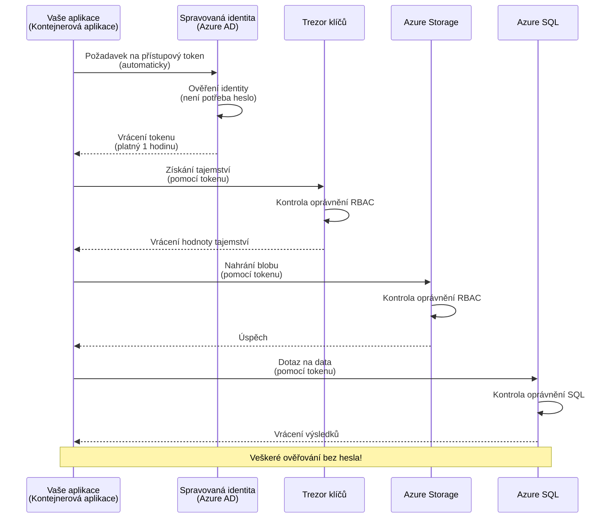
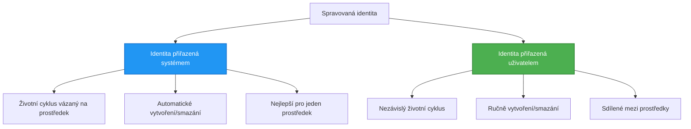

# Vzory autentizace a spravovaná identita

⏱️ **Odhadovaný čas**: 45-60 minut | 💰 **Dopad na náklady**: Zdarma (bez dalších poplatků) | ⭐ **Složitost**: Střední

**📚 Studijní cesta:**
- ← Předchozí: [Správa konfigurace](configuration.md) - Správa proměnných prostředí a tajemství
- 🎯 **Jste zde**: Autentizace a bezpečnost (Spravovaná identita, Key Vault, bezpečné vzory)
- → Další: [První projekt](first-project.md) - Vytvořte svou první aplikaci AZD
- 🏠 [Domov kurzu](../../README.md)

---

## Co se naučíte

Po dokončení této lekce:
- Porozumíte vzorům autentizace v Azure (klíče, připojovací řetězce, spravovaná identita)
- Implementujete **Spravovanou identitu** pro autentizaci bez hesel
- Zabezpečíte tajemství pomocí integrace **Azure Key Vault**
- Nakonfigurujete **řízení přístupu na základě rolí (RBAC)** pro nasazení AZD
- Aplikujete nejlepší bezpečnostní postupy v Container Apps a službách Azure
- Přesunete se od autentizace založené na klíčích k autentizaci založené na identitě

## Proč je spravovaná identita důležitá

### Problém: Tradiční autentizace

**Před spravovanou identitou:**
```javascript
// ❌ BEZPEČNOSTNÍ RIZIKO: Pevně zakódovaná tajemství v kódu
const connectionString = "Server=mydb.database.windows.net;User=admin;Password=P@ssw0rd123";
const storageKey = "xK7mN9pQ2wR5tY8uI0oP3aS6dF1gH4jK...";
const cosmosKey = "C2x7B9n4M1p8Q5w3E6r0T2y5U8i1O4p7...";
```

**Problémy:**
- 🔴 **Odhalená tajemství** v kódu, konfiguračních souborech, proměnných prostředí
- 🔴 **Rotace přihlašovacích údajů** vyžaduje změny kódu a opětovné nasazení
- 🔴 **Noční můry při auditu** - kdo k čemu přistupoval a kdy?
- 🔴 **Rozptýlení** - tajemství roztroušená po různých systémech
- 🔴 **Rizika souladu** - neprojde bezpečnostními audity

### Řešení: Spravovaná identita

**Po spravované identitě:**
```javascript
// ✅ BEZPEČNÉ: Žádná tajemství v kódu
const credential = new DefaultAzureCredential();
const client = new BlobServiceClient(
  "https://mystorageaccount.blob.core.windows.net",
  credential  // Azure automaticky zpracovává autentizaci
);
```

**Výhody:**
- ✅ **Žádná tajemství** v kódu nebo konfiguraci
- ✅ **Automatická rotace** - Azure se o to postará
- ✅ **Kompletní auditní stopa** v logech Azure AD
- ✅ **Centralizovaná bezpečnost** - správa v Azure Portal
- ✅ **Připraveno na soulad** - splňuje bezpečnostní standardy

**Přirovnání**: Tradiční autentizace je jako nosit více fyzických klíčů pro různé dveře. Spravovaná identita je jako mít bezpečnostní kartu, která automaticky poskytuje přístup na základě vaší identity—žádné klíče k ztrátě, kopírování nebo rotaci.

---

## Přehled architektury

### Tok autentizace se spravovanou identitou


### Typy spravovaných identit


| Funkce | Systémově přiřazená | Uživatelsky přiřazená |
|--------|---------------------|-----------------------|
| **Životní cyklus** | Vázán na zdroj | Nezávislý |
| **Vytvoření** | Automaticky se zdrojem | Manuální vytvoření |
| **Smazání** | Smazáno se zdrojem | Přetrvává po smazání zdroje |
| **Sdílení** | Pouze jeden zdroj | Více zdrojů |
| **Použití** | Jednoduché scénáře | Komplexní scénáře s více zdroji |
| **Výchozí v AZD** | ✅ Doporučeno | Volitelné |

---

## Předpoklady

### Požadované nástroje

Tyto byste již měli mít nainstalované z předchozích lekcí:

```bash
# Ověřte Azure Developer CLI
azd version
# ✅ Očekáváno: azd verze 1.0.0 nebo vyšší

# Ověřte Azure CLI
az --version
# ✅ Očekáváno: azure-cli 2.50.0 nebo vyšší
```

### Požadavky na Azure

- Aktivní předplatné Azure
- Oprávnění k:
  - Vytváření spravovaných identit
  - Přiřazování rolí RBAC
  - Vytváření zdrojů Key Vault
  - Nasazování Container Apps

### Požadavky na znalosti

Měli byste mít dokončeno:
- [Průvodce instalací](installation.md) - Nastavení AZD
- [Základy AZD](azd-basics.md) - Základní koncepty
- [Správa konfigurace](configuration.md) - Proměnné prostředí

---

## Lekce 1: Porozumění vzorům autentizace

### Vzor 1: Připojovací řetězce (zastaralé - vyhněte se)

**Jak to funguje:**
```bash
# Řetězec připojení obsahuje přihlašovací údaje
STORAGE_CONNECTION_STRING="DefaultEndpointsProtocol=https;AccountName=myaccount;AccountKey=xK7mN9pQ2wR5..."
COSMOS_CONNECTION_STRING="AccountEndpoint=https://myaccount.documents.azure.com:443/;AccountKey=C2x7..."
SQL_CONNECTION_STRING="Server=myserver.database.windows.net;User=admin;Password=P@ssw0rd..."
```

**Problémy:**
- ❌ Tajemství viditelná v proměnných prostředí
- ❌ Zaznamenána v systémech nasazení
- ❌ Obtížná rotace
- ❌ Žádná auditní stopa přístupu

**Kdy použít:** Pouze pro lokální vývoj, nikdy v produkci.

---

### Vzor 2: Reference Key Vault (lepší)

**Jak to funguje:**
```bicep
// Store secret in Key Vault
resource keyVault 'Microsoft.KeyVault/vaults@2023-02-01' = {
  name: 'mykv'
  properties: {
    enableRbacAuthorization: true
  }
}

// Reference in Container App
env: [
  {
    name: 'STORAGE_KEY'
    secretRef: 'storage-key'  // References Key Vault
  }
]
```

**Výhody:**
- ✅ Tajemství bezpečně uložena v Key Vault
- ✅ Centralizovaná správa tajemství
- ✅ Rotace bez změn kódu

**Omezení:**
- ⚠️ Stále používá klíče/hesla
- ⚠️ Nutnost spravovat přístup k Key Vault

**Kdy použít:** Přechodný krok od připojovacích řetězců ke spravované identitě.

---

### Vzor 3: Spravovaná identita (nejlepší praxe)

**Jak to funguje:**
```bicep
// Enable managed identity
resource containerApp 'Microsoft.App/containerApps@2023-05-01' = {
  name: 'myapp'
  identity: {
    type: 'SystemAssigned'  // Automatically creates identity
  }
}

// Grant permissions
resource roleAssignment 'Microsoft.Authorization/roleAssignments@2022-04-01' = {
  scope: storageAccount
  properties: {
    roleDefinitionId: storageBlobDataContributorRole
    principalId: containerApp.identity.principalId
  }
}
```

**Kód aplikace:**
```javascript
// Žádná tajemství nejsou potřeba!
const { DefaultAzureCredential } = require('@azure/identity');
const { BlobServiceClient } = require('@azure/storage-blob');

const credential = new DefaultAzureCredential();
const blobServiceClient = new BlobServiceClient(
  'https://mystorageaccount.blob.core.windows.net',
  credential
);
```

**Výhody:**
- ✅ Žádná tajemství v kódu/konfiguraci
- ✅ Automatická rotace přihlašovacích údajů
- ✅ Kompletní auditní stopa
- ✅ Oprávnění na základě RBAC
- ✅ Připraveno na soulad

**Kdy použít:** Vždy, pro produkční aplikace.

---

## Lekce 2: Implementace spravované identity s AZD

### Postupná implementace

Vytvořme bezpečnou Container App, která používá spravovanou identitu pro přístup k Azure Storage a Key Vault.

### Struktura projektu

```
secure-app/
├── azure.yaml                 # AZD configuration
├── infra/
│   ├── main.bicep            # Main infrastructure
│   ├── core/
│   │   ├── identity.bicep    # Managed identity setup
│   │   ├── keyvault.bicep    # Key Vault configuration
│   │   └── storage.bicep     # Storage with RBAC
│   └── app/
│       └── container-app.bicep
└── src/
    ├── app.js                # Application code
    ├── package.json
    └── Dockerfile
```

### 1. Konfigurace AZD (azure.yaml)

```yaml
name: secure-app
metadata:
  template: secure-app@1.0.0

services:
  api:
    project: ./src
    language: js
    host: containerapp

# Enable managed identity (AZD handles this automatically)
```

### 2. Infrastruktura: Povolení spravované identity

**Soubor: `infra/main.bicep`**

```bicep
targetScope = 'subscription'

param environmentName string
param location string = 'eastus'

var tags = { 'azd-env-name': environmentName }

// Resource group
resource rg 'Microsoft.Resources/resourceGroups@2021-04-01' = {
  name: 'rg-${environmentName}'
  location: location
  tags: tags
}

// Storage Account
module storage './core/storage.bicep' = {
  name: 'storage'
  scope: rg
  params: {
    name: 'st${uniqueString(rg.id)}'
    location: location
    tags: tags
  }
}

// Key Vault
module keyVault './core/keyvault.bicep' = {
  name: 'keyvault'
  scope: rg
  params: {
    name: 'kv-${uniqueString(rg.id)}'
    location: location
    tags: tags
  }
}

// Container App with Managed Identity
module containerApp './app/container-app.bicep' = {
  name: 'container-app'
  scope: rg
  params: {
    name: 'ca-${environmentName}'
    location: location
    tags: tags
    storageAccountName: storage.outputs.name
    keyVaultName: keyVault.outputs.name
  }
}

// Grant Container App access to Storage
module storageRoleAssignment './core/role-assignment.bicep' = {
  name: 'storage-role'
  scope: rg
  params: {
    principalId: containerApp.outputs.identityPrincipalId
    roleDefinitionId: 'ba92f5b4-2d11-453d-a403-e96b0029c9fe'  // Storage Blob Data Contributor
    targetResourceId: storage.outputs.id
  }
}

// Grant Container App access to Key Vault
module kvRoleAssignment './core/role-assignment.bicep' = {
  name: 'kv-role'
  scope: rg
  params: {
    principalId: containerApp.outputs.identityPrincipalId
    roleDefinitionId: '4633458b-17de-408a-b874-0445c86b69e6'  // Key Vault Secrets User
    targetResourceId: keyVault.outputs.id
  }
}

// Outputs
output AZURE_STORAGE_ACCOUNT_NAME string = storage.outputs.name
output AZURE_KEY_VAULT_NAME string = keyVault.outputs.name
output APP_URL string = containerApp.outputs.url
```

### 3. Container App se systémově přiřazenou identitou

**Soubor: `infra/app/container-app.bicep`**

```bicep
param name string
param location string
param tags object = {}
param storageAccountName string
param keyVaultName string

resource containerApp 'Microsoft.App/containerApps@2023-05-01' = {
  name: name
  location: location
  tags: tags
  identity: {
    type: 'SystemAssigned'  // 🔑 Enable managed identity
  }
  properties: {
    configuration: {
      ingress: {
        external: true
        targetPort: 3000
      }
    }
    template: {
      containers: [
        {
          name: 'api'
          image: 'myregistry.azurecr.io/api:latest'
          resources: {
            cpu: json('0.5')
            memory: '1Gi'
          }
          env: [
            {
              name: 'AZURE_STORAGE_ACCOUNT_NAME'
              value: storageAccountName
            }
            {
              name: 'AZURE_KEY_VAULT_NAME'
              value: keyVaultName
            }
            // 🔑 No secrets - managed identity handles authentication!
          ]
        }
      ]
    }
  }
}

// Output the identity for RBAC assignments
output identityPrincipalId string = containerApp.identity.principalId
output id string = containerApp.id
output url string = 'https://${containerApp.properties.configuration.ingress.fqdn}'
```

### 4. Modul přiřazení rolí RBAC

**Soubor: `infra/core/role-assignment.bicep`**

```bicep
param principalId string
param roleDefinitionId string  // Azure built-in role ID
param targetResourceId string

resource roleAssignment 'Microsoft.Authorization/roleAssignments@2022-04-01' = {
  name: guid(principalId, roleDefinitionId, targetResourceId)
  scope: resourceId('Microsoft.Resources/resourceGroups', resourceGroup().name)
  properties: {
    roleDefinitionId: subscriptionResourceId('Microsoft.Authorization/roleDefinitions', roleDefinitionId)
    principalId: principalId
    principalType: 'ServicePrincipal'
  }
}

output id string = roleAssignment.id
```

### 5. Kód aplikace se spravovanou identitou

**Soubor: `src/app.js`**

```javascript
const express = require('express');
const { DefaultAzureCredential } = require('@azure/identity');
const { BlobServiceClient } = require('@azure/storage-blob');
const { SecretClient } = require('@azure/keyvault-secrets');

const app = express();
const PORT = process.env.PORT || 3000;

// 🔑 Inicializace přihlašovacích údajů (funguje automaticky s řízenou identitou)
const credential = new DefaultAzureCredential();

// Nastavení Azure Storage
const storageAccountName = process.env.AZURE_STORAGE_ACCOUNT_NAME;
const blobServiceClient = new BlobServiceClient(
  `https://${storageAccountName}.blob.core.windows.net`,
  credential  // Klíče nejsou potřeba!
);

// Nastavení Key Vault
const keyVaultName = process.env.AZURE_KEY_VAULT_NAME;
const secretClient = new SecretClient(
  `https://${keyVaultName}.vault.azure.net`,
  credential  // Klíče nejsou potřeba!
);

// Kontrola stavu
app.get('/health', (req, res) => {
  res.json({ status: 'healthy', authentication: 'managed-identity' });
});

// Nahrání souboru do blob storage
app.post('/upload', async (req, res) => {
  try {
    const containerClient = blobServiceClient.getContainerClient('uploads');
    await containerClient.createIfNotExists();
    
    const blobName = `file-${Date.now()}.txt`;
    const blockBlobClient = containerClient.getBlockBlobClient(blobName);
    
    await blockBlobClient.upload('Hello from managed identity!', 30);
    
    res.json({
      success: true,
      blobName: blobName,
      message: 'File uploaded using managed identity!'
    });
  } catch (error) {
    console.error('Upload error:', error);
    res.status(500).json({ error: error.message });
  }
});

// Získání tajemství z Key Vault
app.get('/secret/:name', async (req, res) => {
  try {
    const secretName = req.params.name;
    const secret = await secretClient.getSecret(secretName);
    
    res.json({
      name: secretName,
      value: secret.value,
      message: 'Secret retrieved using managed identity!'
    });
  } catch (error) {
    console.error('Secret error:', error);
    res.status(500).json({ error: error.message });
  }
});

// Seznam blob kontejnerů (ukazuje přístup ke čtení)
app.get('/containers', async (req, res) => {
  try {
    const containers = [];
    for await (const container of blobServiceClient.listContainers()) {
      containers.push(container.name);
    }
    
    res.json({
      containers: containers,
      count: containers.length,
      message: 'Containers listed using managed identity!'
    });
  } catch (error) {
    console.error('List error:', error);
    res.status(500).json({ error: error.message });
  }
});

app.listen(PORT, () => {
  console.log(`Secure API listening on port ${PORT}`);
  console.log('Authentication: Managed Identity (passwordless)');
});
```

**Soubor: `src/package.json`**

```json
{
  "name": "secure-app",
  "version": "1.0.0",
  "dependencies": {
    "express": "^4.18.2",
    "@azure/identity": "^4.0.0",
    "@azure/storage-blob": "^12.17.0",
    "@azure/keyvault-secrets": "^4.7.0"
  },
  "scripts": {
    "start": "node app.js"
  }
}
```

### 6. Nasazení a testování

```bash
# Inicializovat prostředí AZD
azd init

# Nasadit infrastrukturu a aplikaci
azd up

# Získat URL aplikace
APP_URL=$(azd env get-values | grep APP_URL | cut -d '=' -f2 | tr -d '"')

# Otestovat kontrolu stavu
curl $APP_URL/health
```

**✅ Očekávaný výstup:**
```json
{
  "status": "healthy",
  "authentication": "managed-identity"
}
```

**Test nahrání blobu:**
```bash
curl -X POST $APP_URL/upload
```

**✅ Očekávaný výstup:**
```json
{
  "success": true,
  "blobName": "file-1700404800000.txt",
  "message": "File uploaded using managed identity!"
}
```

**Test seznamu kontejnerů:**
```bash
curl $APP_URL/containers
```

**✅ Očekávaný výstup:**
```json
{
  "containers": ["uploads"],
  "count": 1,
  "message": "Containers listed using managed identity!"
}
```

---

## Běžné role RBAC v Azure

### Vestavěné ID rolí pro spravovanou identitu

| Služba | Název role | ID role | Oprávnění |
|--------|------------|---------|-----------|
| **Storage** | Storage Blob Data Reader | `2a2b9908-6b94-4a3d-8e5a-a7d8f8cc8a12` | Čtení blobů a kontejnerů |
| **Storage** | Storage Blob Data Contributor | `ba92f5b4-2d11-453d-a403-e96b0029c9fe` | Čtení, zápis, mazání blobů |
| **Storage** | Storage Queue Data Contributor | `974c5e8b-45b9-4653-ba55-5f855dd0fb88` | Čtení, zápis, mazání zpráv fronty |
| **Key Vault** | Key Vault Secrets User | `4633458b-17de-408a-b874-0445c86b69e6` | Čtení tajemství |
| **Key Vault** | Key Vault Secrets Officer | `b86a8fe4-44ce-4948-aee5-eccb2c155cd7` | Čtení, zápis, mazání tajemství |
| **Cosmos DB** | Cosmos DB Built-in Data Reader | `00000000-0000-0000-0000-000000000001` | Čtení dat Cosmos DB |
| **Cosmos DB** | Cosmos DB Built-in Data Contributor | `00000000-0000-0000-0000-000000000002` | Čtení, zápis dat Cosmos DB |
| **SQL Database** | SQL DB Contributor | `9b7fa17d-e63e-47b0-bb0a-15c516ac86ec` | Správa SQL databází |
| **Service Bus** | Azure Service Bus Data Owner | `090c5cfd-751d-490a-894a-3ce6f1109419` | Odesílání, přijímání, správa zpráv |

### Jak najít ID rolí

```bash
# Vypsat všechny vestavěné role
az role definition list --query "[].{Name:roleName, ID:name}" --output table

# Vyhledat konkrétní roli
az role definition list --query "[?contains(roleName, 'Storage Blob')].{Name:roleName, ID:name}" --output table

# Získat podrobnosti o roli
az role definition list --name "Storage Blob Data Contributor"
```

---

## Praktická cvičení

### Cvičení 1: Povolení spravované identity pro existující aplikaci ⭐⭐ (Střední)

**Cíl**: Přidat spravovanou identitu k existujícímu nasazení Container App

**Scénář**: Máte Container App používající připojovací řetězce. Převést ji na spravovanou identitu.

**Výchozí bod**: Container App s touto konfigurací:

```bicep
// ❌ Current: Using connection string
env: [
  {
    name: 'STORAGE_CONNECTION_STRING'
    secretRef: 'storage-connection'
  }
]
```

**Kroky**:

1. **Povolení spravované identity v Bicep:**

```bicep
resource containerApp 'Microsoft.App/containerApps@2023-05-01' = {
  name: 'myapp'
  identity: {
    type: 'SystemAssigned'  // Add this
  }
  // ... rest of configuration
}
```

2. **Přiřazení přístupu ke Storage:**

```bicep
// Get storage account reference
resource storageAccount 'Microsoft.Storage/storageAccounts@2023-01-01' existing = {
  name: storageAccountName
}

// Assign role
resource roleAssignment 'Microsoft.Authorization/roleAssignments@2022-04-01' = {
  name: guid(containerApp.id, 'ba92f5b4-2d11-453d-a403-e96b0029c9fe', storageAccount.id)
  scope: storageAccount
  properties: {
    roleDefinitionId: subscriptionResourceId('Microsoft.Authorization/roleDefinitions', 'ba92f5b4-2d11-453d-a403-e96b0029c9fe')
    principalId: containerApp.identity.principalId
    principalType: 'ServicePrincipal'
  }
}
```

3. **Aktualizace kódu aplikace:**

**Před (připojovací řetězec):**
```javascript
const { BlobServiceClient } = require('@azure/storage-blob');

const blobServiceClient = BlobServiceClient.fromConnectionString(
  process.env.STORAGE_CONNECTION_STRING
);
```

**Po (spravovaná identita):**
```javascript
const { DefaultAzureCredential } = require('@azure/identity');
const { BlobServiceClient } = require('@azure/storage-blob');

const credential = new DefaultAzureCredential();
const blobServiceClient = new BlobServiceClient(
  `https://${process.env.STORAGE_ACCOUNT_NAME}.blob.core.windows.net`,
  credential
);
```

4. **Aktualizace proměnných prostředí:**

```bicep
env: [
  {
    name: 'STORAGE_ACCOUNT_NAME'
    value: storageAccountName  // Just the name, no secrets!
  }
  // Remove STORAGE_CONNECTION_STRING
]
```

5. **Nasazení a testování:**

```bash
# Znovu nasadit
azd up

# Otestujte, zda to stále funguje
curl https://myapp.azurecontainerapps.io/upload
```

**✅ Kritéria úspěchu:**
- ✅ Aplikace se nasadí bez chyb
- ✅ Operace Storage fungují (nahrání, seznam, stažení)
- ✅ Žádné připojovací řetězce v proměnných prostředí
- ✅ Identita viditelná v Azure Portal pod záložkou "Identity"

**Ověření:**

```bash
# Zkontrolujte, zda je povolena spravovaná identita
az containerapp show \
  --name myapp \
  --resource-group rg-myapp \
  --query "identity.type"
# ✅ Očekáváno: "SystemAssigned"

# Zkontrolujte přiřazení role
az role assignment list \
  --assignee $(az containerapp show --name myapp --resource-group rg-myapp --query "identity.principalId" -o tsv) \
  --scope /subscriptions/{sub-id}/resourceGroups/rg-myapp/providers/Microsoft.Storage/storageAccounts/mystorageaccount
# ✅ Očekáváno: Zobrazuje roli "Storage Blob Data Contributor"
```

**Čas**: 20-30 minut

---

### Cvičení 2: Přístup k více službám s uživatelsky přiřazenou identitou ⭐⭐⭐ (Pokročilé)

**Cíl**: Vytvořit uživatelsky přiřazenou identitu sdílenou mezi více Container Apps

**Scénář**: Máte 3 mikroslužby, které všechny potřebují přístup ke stejnému Storage účtu a Key Vault.

**Kroky**:

1. **Vytvoření uživatelsky přiřazené identity:**

**Soubor: `infra/core/identity.bicep`**

```bicep
param name string
param location string
param tags object = {}

resource userAssignedIdentity 'Microsoft.ManagedIdentity/userAssignedIdentities@2023-01-31' = {
  name: name
  location: location
  tags: tags
}

output id string = userAssignedIdentity.id
output principalId string = userAssignedIdentity.properties.principalId
output clientId string = userAssignedIdentity.properties.clientId
```

2. **Přiřazení rolí uživatelsky přiřazené identitě:**

```bicep
// In main.bicep
module userIdentity './core/identity.bicep' = {
  name: 'user-identity'
  scope: rg
  params: {
    name: 'id-${environmentName}'
    location: location
    tags: tags
  }
}

// Grant Storage access
resource storageRoleAssignment 'Microsoft.Authorization/roleAssignments@2022-04-01' = {
  name: guid(userIdentity.outputs.principalId, 'storage-contributor')
  scope: storageAccount
  properties: {
    roleDefinitionId: subscriptionResourceId('Microsoft.Authorization/roleDefinitions', 'ba92f5b4-2d11-453d-a403-e96b0029c9fe')
    principalId: userIdentity.outputs.principalId
    principalType: 'ServicePrincipal'
  }
}

// Grant Key Vault access
resource kvRoleAssignment 'Microsoft.Authorization/roleAssignments@2022-04-01' = {
  name: guid(userIdentity.outputs.principalId, 'kv-secrets-user')
  scope: keyVault
  properties: {
    roleDefinitionId: subscriptionResourceId('Microsoft.Authorization/roleDefinitions', '4633458b-17de-408a-b874-0445c86b69e6')
    principalId: userIdentity.outputs.principalId
    principalType: 'ServicePrincipal'
  }
}
```

3. **Přiřazení identity více Container Apps:**

```bicep
resource apiGateway 'Microsoft.App/containerApps@2023-05-01' = {
  name: 'api-gateway'
  identity: {
    type: 'UserAssigned'
    userAssignedIdentities: {
      '${userIdentity.outputs.id}': {}
    }
  }
  // ... rest of config
}

resource productService 'Microsoft.App/containerApps@2023-05-01' = {
  name: 'product-service'
  identity: {
    type: 'UserAssigned'
    userAssignedIdentities: {
      '${userIdentity.outputs.id}': {}
    }
  }
  // ... rest of config
}

resource orderService 'Microsoft.App/containerApps@2023-05-01' = {
  name: 'order-service'
  identity: {
    type: 'UserAssigned'
    userAssignedIdentities: {
      '${userIdentity.outputs.id}': {}
    }
  }
  // ... rest of config
}
```

4. **Kód aplikace (všechny služby používají stejný vzor):**

```javascript
const { DefaultAzureCredential, ManagedIdentityCredential } = require('@azure/identity');

// Pro uživatelem přiřazenou identitu zadejte ID klienta
const credential = new ManagedIdentityCredential(
  process.env.AZURE_CLIENT_ID  // ID klienta uživatelem přiřazené identity
);

// Nebo použijte DefaultAzureCredential (automaticky detekuje)
const credential = new DefaultAzureCredential();

const blobServiceClient = new BlobServiceClient(
  `https://${process.env.STORAGE_ACCOUNT_NAME}.blob.core.windows.net`,
  credential
);
```

5. **Nasazení a ověření:**

```bash
azd up

# Otestujte, zda všechny služby mají přístup k úložišti
curl https://api-gateway.azurecontainerapps.io/upload
curl https://product-service.azurecontainerapps.io/upload
curl https://order-service.azurecontainerapps.io/upload
```

**✅ Kritéria úspěchu:**
- ✅ Jedna identita sdílená mezi 3 službami
- ✅ Všechny služby mají přístup ke Storage a Key Vault
- ✅ Identita přetrvává, pokud smažete jednu službu
- ✅ Centralizovaná správa oprávnění

**Výhody uživatelsky přiřazené identity:**
- Jedna identita ke správě
- Konzistentní oprávnění mezi službami
- Přetrvává po smazání služby
- Vhodné pro komplexní architektury

**Čas**: 30-40 minut

---

### Cvičení 3: Implementace rotace tajemství v Key Vault ⭐⭐⭐ (Pokročilé)

**Cíl**: Uložit API klíče třetích stran do Key Vault a přistupovat k nim pomocí spravované identity

**Scénář**: Vaše aplikace potřebuje volat externí API (OpenAI, Stripe, SendGrid), které vyžaduje API klíče.

**Kroky**:

1. **Vytvoření Key Vault s RBAC:**

**Soubor: `infra/core/keyvault.bicep`**

```bicep
param name string
param location string
param tags object = {}

resource keyVault 'Microsoft.KeyVault/vaults@2023-02-01' = {
  name: name
  location: location
  tags: tags
  properties: {
    enableRbacAuthorization: true  // Use RBAC instead of access policies
    sku: {
      family: 'A'
      name: 'standard'
    }
    tenantId: subscription().tenantId
    enableSoftDelete: true
    softDeleteRetentionInDays: 90
  }
}

// Allow Container App to read secrets
output id string = keyVault.id
output name string = keyVault.name
output uri string = keyVault.properties.vaultUri
```

2. **Uložení tajemství do Key Vault:**

```bash
# Získejte název Key Vault
KV_NAME=$(azd env get-values | grep AZURE_KEY_VAULT_NAME | cut -d '=' -f2 | tr -d '"')

# Uložte klíče API třetích stran
az keyvault secret set \
  --vault-name $KV_NAME \
  --name "OpenAI-ApiKey" \
  --value "sk-proj-xxxxxxxxxxxxx"

az keyvault secret set \
  --vault-name $KV_NAME \
  --name "Stripe-ApiKey" \
  --value "sk_live_xxxxxxxxxxxxx"

az keyvault secret set \
  --vault-name $KV_NAME \
  --name "SendGrid-ApiKey" \
  --value "SG.xxxxxxxxxxxxx"
```

3. **Kód aplikace pro získání tajemství:**

**Soubor: `src/config.js`**

```javascript
const { DefaultAzureCredential } = require('@azure/identity');
const { SecretClient } = require('@azure/keyvault-secrets');

class Config {
  constructor() {
    this.credential = new DefaultAzureCredential();
    this.secretClient = new SecretClient(
      `https://${process.env.AZURE_KEY_VAULT_NAME}.vault.azure.net`,
      this.credential
    );
    this.cache = {};
  }

  async getSecret(secretName) {
    // Nejprve zkontrolujte mezipaměť
    if (this.cache[secretName]) {
      return this.cache[secretName];
    }

    try {
      const secret = await this.secretClient.getSecret(secretName);
      this.cache[secretName] = secret.value;
      console.log(`✅ Retrieved secret: ${secretName}`);
      return secret.value;
    } catch (error) {
      console.error(`❌ Failed to get secret ${secretName}:`, error.message);
      throw error;
    }
  }

  async getOpenAIKey() {
    return this.getSecret('OpenAI-ApiKey');
  }

  async getStripeKey() {
    return this.getSecret('Stripe-ApiKey');
  }

  async getSendGridKey() {
    return this.getSecret('SendGrid-ApiKey');
  }
}

module.exports = new Config();
```

4. **Použití tajemství v aplikaci:**

**Soubor: `src/app.js`**

```javascript
const express = require('express');
const config = require('./config');
const { OpenAI } = require('openai');

const app = express();

// Inicializujte OpenAI pomocí klíče z Key Vault
let openaiClient;

async function initializeServices() {
  const openaiKey = await config.getOpenAIKey();
  openaiClient = new OpenAI({ apiKey: openaiKey });
  console.log('✅ Services initialized with secrets from Key Vault');
}

// Zavolejte při spuštění
initializeServices().catch(console.error);

app.post('/chat', async (req, res) => {
  try {
    const completion = await openaiClient.chat.completions.create({
      model: 'gpt-4',
      messages: [{ role: 'user', content: 'Hello!' }]
    });
    
    res.json({
      response: completion.choices[0].message.content,
      authentication: 'Key from Key Vault via Managed Identity'
    });
  } catch (error) {
    res.status(500).json({ error: error.message });
  }
});

app.listen(3000, () => {
  console.log('Secure API with Key Vault integration running');
});
```

5. **Nasazení a testování:**

```bash
azd up

# Otestujte, zda API klíče fungují
curl -X POST https://myapp.azurecontainerapps.io/chat \
  -H "Content-Type: application/json" \
  -d '{"message":"Hello AI"}'
```

**✅ Kritéria úspěchu:**
- ✅ Žádné API klíče v kódu nebo proměnných prostředí
- ✅ Aplikace získává klíče z Key Vault
- ✅ Externí API fungují správně
- ✅ Možnost rotace klíčů bez změn kódu

**Rotace tajemství:**

```bash
# Aktualizovat tajemství v Key Vault
az keyvault secret set \
  --vault-name $KV_NAME \
  --name "OpenAI-ApiKey" \
  --value "sk-proj-NEW_KEY_HERE"

# Restartovat aplikaci, aby načetla nový klíč
az containerapp revision restart \
  --name myapp \
  --resource-group rg-myapp
```

**Čas**: 25-35 minut

---

## Kontrolní bod znalostí

### 1. Vzory autentizace ✓

Otestujte své znalosti:

- [ ] **Q1**: Jaké jsou tři hlavní vzory autentizace? 
  - **A**: Připojovací řetězce (zastaralé), Reference Key Vault (přechodné), Spravovaná identita (nejlepší)

- [ ] **Q2**: Proč je spravovaná identita lepší než připojovací řetězce?
  - **A**: Žádná tajemství v kódu, automatická rotace, kompletní auditní stopa, oprávnění na základě RBAC

- [ ] **Q3**: Kdy byste použili uživatelsky přiřazenou identitu místo systémově přiřazené?
  - **A**: Při sdílení identity mezi více zdroji nebo když je životní cyklus identity nezávislý na životním cyklu zdroje

**Praktické ověření:**
```bash
# Zkontrolujte, jaký typ identity vaše aplikace používá
az containerapp show \
  --name myapp \
  --resource-group rg-myapp \
  --query "identity.type"

# Vypsat všechna přiřazení rolí pro identitu
az role assignment list \
  --assignee $(az containerapp show --name myapp --resource-group rg-myapp --query "identity.principalId" -o tsv)
```

---

### 2. RBAC a oprávnění ✓

Otestujte své znalosti:

- [ ] **Q1**: Jaké je ID role pro "Storage Blob Data Contributor"?
  - **A**: `ba92f5b4-2d11-453d-a403-e96b0029c9fe`

- [ ] **Q2**: Jaká oprávnění poskytuje "Key Vault Secrets User"?
  - **A**: Pouze čtení tajemství (nelze vytvářet, aktualizovat ani mazat)

- [ ] **Q3**: Jak přiřadíte Container App přístup k Azure SQL?
  - **A**: Přiřaďte roli "SQL DB Contributor" nebo nakonfigurujte autentizaci Azure AD pro SQL

**Praktické ověření:**
```bash
# Najít konkrétní roli
az role definition list --name "Storage Blob Data Contributor"

# Zkontrolovat, jaké role jsou přiřazeny vaší identitě
PRINCIPAL_ID=$(az containerapp show --name myapp --resource-group rg-myapp --query "identity.principalId" -o tsv)
az role assignment list --assignee $PRINCIPAL_ID --output table
```

---

### 3. Integrace Key Vault ✓

Otestujte své znalosti:
- [ ] **Q1**: Jak povolit RBAC pro Key Vault místo přístupových politik?
  - **A**: Nastavte `enableRbacAuthorization: true` v Bicep

- [ ] **Q2**: Která knihovna Azure SDK zajišťuje autentizaci pomocí spravované identity?
  - **A**: `@azure/identity` s třídou `DefaultAzureCredential`

- [ ] **Q3**: Jak dlouho zůstávají tajemství Key Vaultu v cache?
  - **A**: Závisí na aplikaci; implementujte vlastní strategii ukládání do cache

**Praktické ověření:**
```bash
# Otestujte přístup k Key Vault
az keyvault secret show \
  --vault-name $KV_NAME \
  --name "OpenAI-ApiKey" \
  --query "value"

# Zkontrolujte, zda je RBAC povolen
az keyvault show \
  --name $KV_NAME \
  --query "properties.enableRbacAuthorization"
# ✅ Očekáváno: pravda
```

---

## Nejlepší bezpečnostní postupy

### ✅ DĚLEJTE:

1. **V produkci vždy používejte spravovanou identitu**
   ```bicep
   identity: {
     type: 'SystemAssigned'
   }
   ```

2. **Používejte role RBAC s minimálními oprávněními**
   - Používejte role "Reader", kdykoli je to možné
   - Vyhněte se rolím "Owner" nebo "Contributor", pokud nejsou nezbytné

3. **Ukládejte klíče třetích stran v Key Vaultu**
   ```javascript
   const apiKey = await secretClient.getSecret('ThirdPartyApiKey');
   ```

4. **Povolte auditní logování**
   ```bicep
   diagnosticSettings: {
     logs: [{ category: 'AuditEvent', enabled: true }]
   }
   ```

5. **Používejte různé identity pro vývoj/staging/produkci**
   ```bash
   azd env new dev
   azd env new staging
   azd env new prod
   ```

6. **Pravidelně otáčejte tajemství**
   - Nastavte data expirace pro tajemství Key Vaultu
   - Automatizujte rotaci pomocí Azure Functions

### ❌ NEDĚLEJTE:

1. **Nikdy neukládejte tajemství přímo do kódu**
   ```javascript
   // ❌ ŠPATNÉ
   const apiKey = "sk-proj-xxxxxxxxxxxxx";
   ```

2. **Nepoužívejte connection strings v produkci**
   ```javascript
   // ❌ ŠPATNÉ
   BlobServiceClient.fromConnectionString(process.env.STORAGE_CONNECTION_STRING)
   ```

3. **Nepřidělujte nadměrná oprávnění**
   ```bicep
   // ❌ BAD - too much access
   roleDefinitionId: 'Owner'
   
   // ✅ GOOD - least privilege
   roleDefinitionId: 'Storage Blob Data Reader'
   ```

4. **Nezaznamenávejte tajemství**
   ```javascript
   // ❌ ŠPATNÉ
   console.log('API Key:', apiKey);
   
   // ✅ DOBRÉ
   console.log('API Key retrieved successfully');
   ```

5. **Nesdílejte produkční identity mezi prostředími**
   ```bicep
   // ❌ BAD - same identity for dev and prod
   // ✅ GOOD - separate identities per environment
   ```

---

## Průvodce řešením problémů

### Problém: "Unauthorized" při přístupu k Azure Storage

**Příznaky:**
```
Error: Unauthorized (403)
AuthorizationPermissionMismatch: This request is not authorized to perform this operation
```

**Diagnóza:**

```bash
# Zkontrolujte, zda je spravovaná identita povolena
az containerapp show \
  --name myapp \
  --resource-group rg-myapp \
  --query "identity.type"
# ✅ Očekáváno: "SystemAssigned" nebo "UserAssigned"

# Zkontrolujte přiřazení rolí
PRINCIPAL_ID=$(az containerapp show --name myapp --resource-group rg-myapp --query "identity.principalId" -o tsv)
az role assignment list --assignee $PRINCIPAL_ID

# Očekáváno: Mělo by být vidět "Storage Blob Data Contributor" nebo podobná role
```

**Řešení:**

1. **Přidělte správnou roli RBAC:**
```bash
STORAGE_ID=$(az storage account show --name mystorageaccount --resource-group rg-myapp --query "id" -o tsv)
az role assignment create \
  --assignee $PRINCIPAL_ID \
  --role "Storage Blob Data Contributor" \
  --scope $STORAGE_ID
```

2. **Počkejte na propagaci (může trvat 5-10 minut):**
```bash
# Zkontrolujte stav přiřazení role
az role assignment list --assignee $PRINCIPAL_ID --scope $STORAGE_ID
```

3. **Ověřte, že aplikace používá správné přihlašovací údaje:**
```javascript
// Ujistěte se, že používáte DefaultAzureCredential
const credential = new DefaultAzureCredential();
```

---

### Problém: Přístup k Key Vaultu byl odepřen

**Příznaky:**
```
Error: Forbidden (403)
The user, group or application does not have secrets get permission
```

**Diagnóza:**

```bash
# Zkontrolujte, zda je povoleno RBAC pro Key Vault
az keyvault show \
  --name $KV_NAME \
  --query "properties.enableRbacAuthorization"
# ✅ Očekáváno: pravda

# Zkontrolujte přiřazení rolí
az role assignment list \
  --assignee $PRINCIPAL_ID \
  --scope /subscriptions/{sub-id}/resourceGroups/rg-myapp/providers/Microsoft.KeyVault/vaults/$KV_NAME
```

**Řešení:**

1. **Povolte RBAC na Key Vaultu:**
```bash
az keyvault update \
  --name $KV_NAME \
  --enable-rbac-authorization true
```

2. **Přidělte roli Key Vault Secrets User:**
```bash
KV_ID=$(az keyvault show --name $KV_NAME --query "id" -o tsv)
az role assignment create \
  --assignee $PRINCIPAL_ID \
  --role "Key Vault Secrets User" \
  --scope $KV_ID
```

---

### Problém: DefaultAzureCredential selhává lokálně

**Příznaky:**
```
Error: DefaultAzureCredential failed to retrieve a token
CredentialUnavailableError: No credential available
```

**Diagnóza:**

```bash
# Zkontrolujte, zda jste přihlášeni
az account show

# Zkontrolujte ověření Azure CLI
az ad signed-in-user show
```

**Řešení:**

1. **Přihlaste se do Azure CLI:**
```bash
az login
```

2. **Nastavte Azure subscription:**
```bash
az account set --subscription "Your Subscription Name"
```

3. **Pro lokální vývoj použijte proměnné prostředí:**
```bash
export AZURE_TENANT_ID="your-tenant-id"
export AZURE_CLIENT_ID="your-client-id"
export AZURE_CLIENT_SECRET="your-client-secret"
```

4. **Nebo použijte jiný přihlašovací údaj lokálně:**
```javascript
const { DefaultAzureCredential, AzureCliCredential } = require('@azure/identity');

// Použijte AzureCliCredential pro lokální vývoj
const credential = process.env.NODE_ENV === 'production' 
  ? new DefaultAzureCredential()
  : new AzureCliCredential();
```

---

### Problém: Propagace přiřazení role trvá příliš dlouho

**Příznaky:**
- Role byla úspěšně přiřazena
- Stále se objevují chyby 403
- Přístup je občasný (někdy funguje, někdy ne)

**Vysvětlení:**
Změny Azure RBAC mohou trvat 5-10 minut, než se globálně propagují.

**Řešení:**

```bash
# Počkejte a zkuste znovu
echo "Waiting for RBAC propagation..."
sleep 300  # Počkejte 5 minut

# Otestujte přístup
curl https://myapp.azurecontainerapps.io/upload

# Pokud stále selhává, restartujte aplikaci
az containerapp revision restart \
  --name myapp \
  --resource-group rg-myapp
```

---

## Náklady

### Náklady na spravovanou identitu

| Zdroj | Náklady |
|-------|---------|
| **Spravovaná identita** | 🆓 **ZDARMA** - Bez poplatků |
| **Přiřazení rolí RBAC** | 🆓 **ZDARMA** - Bez poplatků |
| **Požadavky na token Azure AD** | 🆓 **ZDARMA** - Zahrnuto |
| **Operace Key Vaultu** | $0.03 za 10 000 operací |
| **Úložiště Key Vaultu** | $0.024 za tajemství za měsíc |

**Spravovaná identita šetří peníze díky:**
- ✅ Eliminaci operací Key Vaultu pro autentizaci mezi službami
- ✅ Snížení bezpečnostních incidentů (žádné uniklé přihlašovací údaje)
- ✅ Snížení provozní zátěže (žádná manuální rotace)

**Příklad porovnání nákladů (měsíčně):**

| Scénář | Connection Strings | Spravovaná identita | Úspora |
|--------|--------------------|---------------------|--------|
| Malá aplikace (1M požadavků) | ~$50 (Key Vault + operace) | ~$0 | $50/měsíc |
| Střední aplikace (10M požadavků) | ~$200 | ~$0 | $200/měsíc |
| Velká aplikace (100M požadavků) | ~$1,500 | ~$0 | $1,500/měsíc |

---

## Další informace

### Oficiální dokumentace
- [Azure Managed Identity](https://learn.microsoft.com/entra/identity/managed-identities-azure-resources/overview)
- [Azure RBAC](https://learn.microsoft.com/azure/role-based-access-control/overview)
- [Azure Key Vault](https://learn.microsoft.com/azure/key-vault/general/overview)
- [DefaultAzureCredential](https://learn.microsoft.com/dotnet/api/azure.identity.defaultazurecredential)

### Dokumentace SDK
- [@azure/identity (Node.js)](https://www.npmjs.com/package/@azure/identity)
- [Azure.Identity (C#)](https://www.nuget.org/packages/Azure.Identity/)
- [azure-identity (Python)](https://pypi.org/project/azure-identity/)

### Další kroky v tomto kurzu
- ← Předchozí: [Správa konfigurace](configuration.md)
- → Další: [První projekt](first-project.md)
- 🏠 [Domovská stránka kurzu](../../README.md)

### Související příklady
- [Příklad Azure OpenAI Chat](../../../../examples/azure-openai-chat) - Používá spravovanou identitu pro Azure OpenAI
- [Příklad mikroservis](../../../../examples/microservices) - Vzory autentizace pro více služeb

---

## Shrnutí

**Naučili jste se:**
- ✅ Tři vzory autentizace (connection strings, Key Vault, spravovaná identita)
- ✅ Jak povolit a konfigurovat spravovanou identitu v AZD
- ✅ Přiřazení rolí RBAC pro služby Azure
- ✅ Integraci Key Vaultu pro tajemství třetích stran
- ✅ Rozdíly mezi uživatelsky přiřazenými a systémově přiřazenými identitami
- ✅ Nejlepší bezpečnostní postupy a řešení problémů

**Klíčové poznatky:**
1. **V produkci vždy používejte spravovanou identitu** - Žádná tajemství, automatická rotace
2. **Používejte role RBAC s minimálními oprávněními** - Přidělujte pouze nezbytná oprávnění
3. **Ukládejte klíče třetích stran v Key Vaultu** - Centralizovaná správa tajemství
4. **Oddělte identity podle prostředí** - Izolace vývoje, stagingu a produkce
5. **Povolte auditní logování** - Sledujte, kdo k čemu přistupoval

**Další kroky:**
1. Dokončete praktická cvičení výše
2. Migrujte existující aplikaci z connection strings na spravovanou identitu
3. Vytvořte svůj první projekt AZD s bezpečností od prvního dne: [První projekt](first-project.md)

---

<!-- CO-OP TRANSLATOR DISCLAIMER START -->
**Prohlášení**:  
Tento dokument byl přeložen pomocí služby AI pro překlad [Co-op Translator](https://github.com/Azure/co-op-translator). I když se snažíme o přesnost, mějte prosím na paměti, že automatizované překlady mohou obsahovat chyby nebo nepřesnosti. Původní dokument v jeho původním jazyce by měl být považován za autoritativní zdroj. Pro důležité informace se doporučuje profesionální lidský překlad. Neodpovídáme za žádná nedorozumění nebo nesprávné interpretace vyplývající z použití tohoto překladu.
<!-- CO-OP TRANSLATOR DISCLAIMER END -->