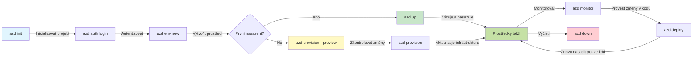
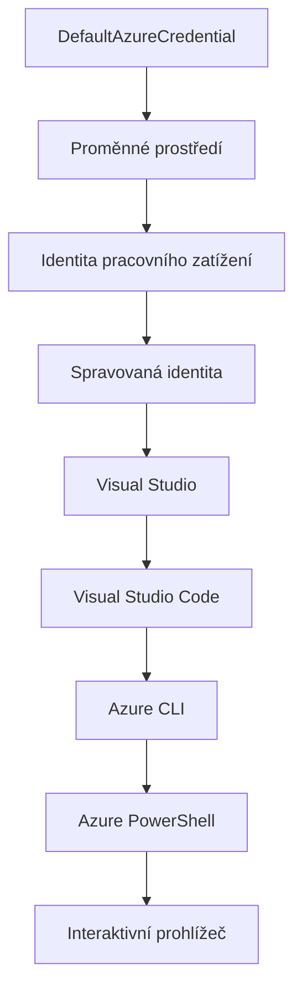

<!--
CO_OP_TRANSLATOR_METADATA:
{
  "original_hash": "e855e899d2705754fe85b04190edd0f0",
  "translation_date": "2025-11-23T11:16:44+00:00",
  "source_file": "docs/getting-started/azd-basics.md",
  "language_code": "cs"
}
-->
# Základy AZD - Pochopení Azure Developer CLI

# Základy AZD - Klíčové koncepty a základy

**Navigace kapitolou:**
- **📚 Domov kurzu**: [AZD pro začátečníky](../../README.md)
- **📖 Aktuální kapitola**: Kapitola 1 - Základy a rychlý start
- **⬅️ Předchozí**: [Přehled kurzu](../../README.md#-chapter-1-foundation--quick-start)
- **➡️ Další**: [Instalace a nastavení](installation.md)
- **🚀 Další kapitola**: [Kapitola 2: Vývoj zaměřený na AI](../microsoft-foundry/microsoft-foundry-integration.md)

## Úvod

Tato lekce vás seznámí s Azure Developer CLI (azd), výkonným nástrojem příkazového řádku, který urychluje cestu od lokálního vývoje k nasazení na Azure. Naučíte se základní koncepty, klíčové funkce a pochopíte, jak azd zjednodušuje nasazení cloud-native aplikací.

## Cíle učení

Na konci této lekce budete:
- Rozumět, co je Azure Developer CLI a jaký je jeho hlavní účel
- Seznámeni se základními koncepty šablon, prostředí a služeb
- Prozkoumávat klíčové funkce, včetně vývoje řízeného šablonami a Infrastructure as Code
- Rozumět struktuře a workflow projektů azd
- Připraveni nainstalovat a nakonfigurovat azd pro své vývojové prostředí

## Výstupy učení

Po dokončení této lekce budete schopni:
- Vysvětlit roli azd v moderních pracovních postupech cloudového vývoje
- Identifikovat komponenty struktury projektu azd
- Popsat, jak šablony, prostředí a služby spolupracují
- Pochopit výhody Infrastructure as Code s azd
- Rozpoznat různé příkazy azd a jejich účely

## Co je Azure Developer CLI (azd)?

Azure Developer CLI (azd) je nástroj příkazového řádku navržený k urychlení cesty od lokálního vývoje k nasazení na Azure. Zjednodušuje proces vytváření, nasazování a správy cloud-native aplikací na Azure.

### 🎯 Proč používat AZD? Srovnání z reálného světa

Porovnejme nasazení jednoduché webové aplikace s databází:

#### ❌ BEZ AZD: Manuální nasazení na Azure (30+ minut)

```bash
# Krok 1: Vytvořte skupinu prostředků
az group create --name myapp-rg --location eastus

# Krok 2: Vytvořte plán služby App Service
az appservice plan create --name myapp-plan \
  --resource-group myapp-rg \
  --sku B1 --is-linux

# Krok 3: Vytvořte webovou aplikaci
az webapp create --name myapp-web-unique123 \
  --resource-group myapp-rg \
  --plan myapp-plan \
  --runtime "NODE:18-lts"

# Krok 4: Vytvořte účet Cosmos DB (10-15 minut)
az cosmosdb create --name myapp-cosmos-unique123 \
  --resource-group myapp-rg \
  --kind MongoDB

# Krok 5: Vytvořte databázi
az cosmosdb mongodb database create \
  --account-name myapp-cosmos-unique123 \
  --resource-group myapp-rg \
  --name tododb

# Krok 6: Vytvořte kolekci
az cosmosdb mongodb collection create \
  --account-name myapp-cosmos-unique123 \
  --resource-group myapp-rg \
  --database-name tododb \
  --name todos

# Krok 7: Získejte připojovací řetězec
CONN_STR=$(az cosmosdb keys list \
  --name myapp-cosmos-unique123 \
  --resource-group myapp-rg \
  --type connection-strings \
  --query "connectionStrings[0].connectionString" -o tsv)

# Krok 8: Nakonfigurujte nastavení aplikace
az webapp config appsettings set \
  --name myapp-web-unique123 \
  --resource-group myapp-rg \
  --settings MONGODB_URI="$CONN_STR"

# Krok 9: Aktivujte protokolování
az webapp log config --name myapp-web-unique123 \
  --resource-group myapp-rg \
  --application-logging filesystem \
  --detailed-error-messages true

# Krok 10: Nastavte Application Insights
az monitor app-insights component create \
  --app myapp-insights \
  --location eastus \
  --resource-group myapp-rg

# Krok 11: Propojte App Insights s webovou aplikací
INSTRUMENTATION_KEY=$(az monitor app-insights component show \
  --app myapp-insights \
  --resource-group myapp-rg \
  --query "instrumentationKey" -o tsv)

az webapp config appsettings set \
  --name myapp-web-unique123 \
  --resource-group myapp-rg \
  --settings APPINSIGHTS_INSTRUMENTATIONKEY="$INSTRUMENTATION_KEY"

# Krok 12: Sestavte aplikaci lokálně
npm install
npm run build

# Krok 13: Vytvořte balíček pro nasazení
zip -r app.zip . -x "*.git*" "node_modules/*"

# Krok 14: Nasazení aplikace
az webapp deployment source config-zip \
  --resource-group myapp-rg \
  --name myapp-web-unique123 \
  --src app.zip

# Krok 15: Počkejte a modlete se, aby to fungovalo 🙏
# (Žádná automatizovaná validace, vyžadováno ruční testování)
```

**Problémy:**
- ❌ 15+ příkazů, které je třeba si zapamatovat a spustit ve správném pořadí
- ❌ 30-45 minut manuální práce
- ❌ Snadné udělat chybu (překlepy, špatné parametry)
- ❌ Přístupové řetězce viditelné v historii terminálu
- ❌ Žádné automatické vrácení zpět v případě chyby
- ❌ Těžko replikovatelné pro členy týmu
- ❌ Každé nasazení je jiné (není reprodukovatelné)

#### ✅ S AZD: Automatizované nasazení (5 příkazů, 10-15 minut)

```bash
# Krok 1: Inicializace ze šablony
azd init --template todo-nodejs-mongo

# Krok 2: Autentizace
azd auth login

# Krok 3: Vytvoření prostředí
azd env new dev

# Krok 4: Náhled změn (volitelné, ale doporučené)
azd provision --preview

# Krok 5: Nasazení všeho
azd up

# ✨ Hotovo! Vše je nasazeno, nakonfigurováno a monitorováno
```

**Výhody:**
- ✅ **5 příkazů** oproti 15+ manuálním krokům
- ✅ **10-15 minut** celkového času (většinou čekání na Azure)
- ✅ **Žádné chyby** - automatizované a otestované
- ✅ **Bezpečná správa tajemství** přes Key Vault
- ✅ **Automatické vrácení zpět** při selhání
- ✅ **Plně reprodukovatelné** - stejný výsledek pokaždé
- ✅ **Připraveno pro tým** - kdokoli může nasadit pomocí stejných příkazů
- ✅ **Infrastructure as Code** - šablony Bicep pod verzovací kontrolou
- ✅ **Integrované monitorování** - Application Insights automaticky nakonfigurováno

### 📊 Snížení času a chybovosti

| Metrika | Manuální nasazení | Nasazení s AZD | Zlepšení |
|:--------|:------------------|:---------------|:---------|
| **Příkazy** | 15+ | 5 | O 67 % méně |
| **Čas** | 30-45 min | 10-15 min | O 60 % rychlejší |
| **Chybovost** | ~40 % | <5 % | O 88 % méně |
| **Konzistence** | Nízká (manuální) | 100 % (automatizovaná) | Perfektní |
| **Zaškolení týmu** | 2-4 hodiny | 30 minut | O 75 % rychlejší |
| **Čas na vrácení zpět** | 30+ min (manuální) | 2 min (automatizované) | O 93 % rychlejší |

## Klíčové koncepty

### Šablony
Šablony jsou základem azd. Obsahují:
- **Kód aplikace** - váš zdrojový kód a závislosti
- **Definice infrastruktury** - Azure zdroje definované v Bicep nebo Terraform
- **Konfigurační soubory** - nastavení a proměnné prostředí
- **Skripty nasazení** - automatizované pracovní postupy nasazení

### Prostředí
Prostředí představují různé cíle nasazení:
- **Vývoj** - pro testování a vývoj
- **Staging** - předprodukční prostředí
- **Produkce** - živé produkční prostředí

Každé prostředí udržuje své vlastní:
- Skupiny zdrojů Azure
- Konfigurační nastavení
- Stav nasazení

### Služby
Služby jsou stavebními bloky vaší aplikace:
- **Frontend** - webové aplikace, SPAs
- **Backend** - API, mikroslužby
- **Databáze** - řešení pro ukládání dat
- **Úložiště** - úložiště souborů a blobů

## Klíčové funkce

### 1. Vývoj řízený šablonami
```bash
# Procházet dostupné šablony
azd template list

# Inicializovat ze šablony
azd init --template <template-name>
```

### 2. Infrastructure as Code
- **Bicep** - Doménově specifický jazyk Azure
- **Terraform** - Nástroj pro multi-cloud infrastrukturu
- **ARM Templates** - Šablony Azure Resource Manager

### 3. Integrované pracovní postupy
```bash
# Dokončit pracovní postup nasazení
azd up            # Zajištění + Nasazení, toto je bez zásahu pro první nastavení

# 🧪 NOVÉ: Náhled změn infrastruktury před nasazením (BEZPEČNÉ)
azd provision --preview    # Simulovat nasazení infrastruktury bez provádění změn

azd provision     # Vytvořit Azure zdroje, pokud aktualizujete infrastrukturu, použijte toto
azd deploy        # Nasadit aplikační kód nebo znovu nasadit aplikační kód po aktualizaci
azd down          # Vyčistit zdroje
```

#### 🛡️ Bezpečné plánování infrastruktury s náhledem
Příkaz `azd provision --preview` je revoluční pro bezpečné nasazení:
- **Analýza nanečisto** - Ukazuje, co bude vytvořeno, upraveno nebo smazáno
- **Žádné riziko** - Nedochází k žádným skutečným změnám ve vašem prostředí Azure
- **Spolupráce v týmu** - Sdílení výsledků náhledu před nasazením
- **Odhad nákladů** - Pochopení nákladů na zdroje před závazkem

```bash
# Ukázkový pracovní postup náhledu
azd provision --preview           # Podívejte se, co se změní
# Zkontrolujte výstup, diskutujte s týmem
azd provision                     # Proveďte změny s jistotou
```

### 📊 Vizualizace: Pracovní postup vývoje s AZD


**Vysvětlení pracovního postupu:**
1. **Init** - Začněte se šablonou nebo novým projektem
2. **Auth** - Autentizace s Azure
3. **Prostředí** - Vytvoření izolovaného prostředí pro nasazení
4. **Preview** - 🆕 Vždy nejprve zobrazte náhled změn infrastruktury (bezpečná praxe)
5. **Provision** - Vytvoření/aktualizace zdrojů Azure
6. **Deploy** - Nahrání kódu aplikace
7. **Monitor** - Sledování výkonu aplikace
8. **Iterate** - Provádění změn a opětovné nasazení kódu
9. **Cleanup** - Odstranění zdrojů po dokončení

### 4. Správa prostředí
```bash
# Vytvořit a spravovat prostředí
azd env new <environment-name>
azd env select <environment-name>
azd env list
```

## 📁 Struktura projektu

Typická struktura projektu azd:
```
my-app/
├── .azd/                    # azd configuration
│   └── config.json
├── .azure/                  # Azure deployment artifacts
├── .devcontainer/          # Development container config
├── .github/workflows/      # GitHub Actions
├── .vscode/               # VS Code settings
├── infra/                 # Infrastructure code
│   ├── main.bicep        # Main infrastructure template
│   ├── main.parameters.json
│   └── modules/          # Reusable modules
├── src/                  # Application source code
│   ├── api/             # Backend services
│   └── web/             # Frontend application
├── azure.yaml           # azd project configuration
└── README.md
```

## 🔧 Konfigurační soubory

### azure.yaml
Hlavní konfigurační soubor projektu:
```yaml
name: my-awesome-app
metadata:
  template: my-template@1.0.0

services:
  web:
    project: ./src/web
    language: js
    host: appservice
  api:
    project: ./src/api
    language: js
    host: appservice

hooks:
  preprovision:
    shell: pwsh
    run: echo "Preparing to provision..."
```

### .azure/config.json
Konfigurace specifická pro prostředí:
```json
{
  "version": 1,
  "defaultEnvironment": "dev",
  "environments": {
    "dev": {
      "subscriptionId": "your-subscription-id",
      "location": "eastus"
    }
  }
}
```

## 🎪 Běžné pracovní postupy s praktickými cvičeními

> **💡 Tip pro učení:** Postupujte podle těchto cvičení, abyste si postupně osvojili dovednosti s AZD.

### 🎯 Cvičení 1: Inicializace vašeho prvního projektu

**Cíl:** Vytvořit projekt AZD a prozkoumat jeho strukturu

**Kroky:**
```bash
# Použijte osvědčenou šablonu
azd init --template todo-nodejs-mongo

# Prozkoumejte vygenerované soubory
ls -la  # Zobrazte všechny soubory včetně skrytých

# Klíčové vytvořené soubory:
# - azure.yaml (hlavní konfigurace)
# - infra/ (kód infrastruktury)
# - src/ (kód aplikace)
```

**✅ Úspěch:** Máte adresáře azure.yaml, infra/ a src/

---

### 🎯 Cvičení 2: Nasazení na Azure

**Cíl:** Dokončit nasazení od začátku do konce

**Kroky:**
```bash
# 1. Ověřit
az login && azd auth login

# 2. Vytvořit prostředí
azd env new dev
azd env set AZURE_LOCATION eastus

# 3. Náhled změn (DOPORUČENO)
azd provision --preview

# 4. Nasadit vše
azd up

# 5. Ověřit nasazení
azd show    # Zobrazit URL vaší aplikace
```

**Očekávaný čas:** 10-15 minut  
**✅ Úspěch:** Otevře se URL aplikace v prohlížeči

---

### 🎯 Cvičení 3: Více prostředí

**Cíl:** Nasadit do dev a staging

**Kroky:**
```bash
# Již máme vývoj, vytvořte staging
azd env new staging
azd env set AZURE_LOCATION westus2
azd up

# Přepínejte mezi nimi
azd env list
azd env select dev
```

**✅ Úspěch:** Dvě samostatné skupiny zdrojů v Azure Portálu

---

### 🛡️ Čistý start: `azd down --force --purge`

Když potřebujete kompletně resetovat:

```bash
azd down --force --purge
```

**Co dělá:**
- `--force`: Žádné potvrzovací výzvy
- `--purge`: Smaže veškerý lokální stav a zdroje Azure

**Použijte, když:**
- Nasazení selhalo v polovině
- Přepínáte projekty
- Potřebujete nový začátek

---

## 🎪 Odkaz na původní pracovní postup

### Zahájení nového projektu
```bash
# Metoda 1: Použijte existující šablonu
azd init --template todo-nodejs-mongo

# Metoda 2: Začněte od začátku
azd init

# Metoda 3: Použijte aktuální adresář
azd init .
```

### Vývojový cyklus
```bash
# Nastavte vývojové prostředí
azd auth login
azd env new dev
azd env select dev

# Nasazení všeho
azd up

# Proveďte změny a znovu nasazení
azd deploy

# Uklidit po dokončení
azd down --force --purge # příkaz v Azure Developer CLI je **tvrdý reset** pro vaše prostředí—zejména užitečný při řešení problémů s neúspěšnými nasazeními, čištění osiřelých zdrojů nebo přípravě na nové nasazení.
```

## Pochopení `azd down --force --purge`
Příkaz `azd down --force --purge` je mocný nástroj pro kompletní odstranění prostředí azd a všech souvisejících zdrojů. Zde je rozpis, co jednotlivé příznaky znamenají:
```
--force
```
- Přeskočí potvrzovací výzvy.
- Užitečné pro automatizaci nebo skriptování, kde není možné manuální zadávání.
- Zajišťuje, že odstranění proběhne bez přerušení, i když CLI detekuje nesrovnalosti.

```
--purge
```
Smaže **veškerá související metadata**, včetně:
Stavu prostředí
Lokální složky `.azure`
Informací o uloženém nasazení
Zabraňuje azd "pamatovat si" předchozí nasazení, což může způsobit problémy, jako jsou nesprávné skupiny zdrojů nebo zastaralé odkazy na registry.

### Proč používat obojí?
Když narazíte na problém s `azd up` kvůli přetrvávajícímu stavu nebo částečným nasazením, tato kombinace zajistí **čistý start**.

Je to obzvláště užitečné po manuálním odstranění zdrojů v Azure portálu nebo při přepínání šablon, prostředí nebo konvencí pojmenování skupin zdrojů.

### Správa více prostředí
```bash
# Vytvořit testovací prostředí
azd env new staging
azd env select staging
azd up

# Přepnout zpět na vývoj
azd env select dev

# Porovnat prostředí
azd env list
```

## 🔐 Autentizace a přihlašovací údaje

Pochopení autentizace je klíčové pro úspěšná nasazení s azd. Azure používá různé metody autentizace a azd využívá stejný řetězec přihlašovacích údajů jako ostatní nástroje Azure.

### Autentizace Azure CLI (`az login`)

Před použitím azd se musíte autentizovat s Azure. Nejčastější metodou je použití Azure CLI:

```bash
# Interaktivní přihlášení (otevře prohlížeč)
az login

# Přihlášení s konkrétním nájemcem
az login --tenant <tenant-id>

# Přihlášení pomocí servisního principu
az login --service-principal -u <app-id> -p <password> --tenant <tenant-id>

# Zkontrolovat aktuální stav přihlášení
az account show

# Vypsat dostupné předplatné
az account list --output table

# Nastavit výchozí předplatné
az account set --subscription <subscription-id>
```

### Průběh autentizace
1. **Interaktivní přihlášení**: Otevře váš výchozí prohlížeč pro autentizaci
2. **Flow s kódem zařízení**: Pro prostředí bez přístupu k prohlížeči
3. **Service Principal**: Pro automatizaci a scénáře CI/CD
4. **Spravovaná identita**: Pro aplikace hostované na Azure

### DefaultAzureCredential Chain

`DefaultAzureCredential` je typ přihlašovacích údajů, který poskytuje zjednodušený zážitek z autentizace tím, že automaticky zkouší více zdrojů přihlašovacích údajů v konkrétním pořadí:

#### Pořadí řetězce přihlašovacích údajů

#### 1. Proměnné prostředí
```bash
# Nastavte proměnné prostředí pro servisního principála
export AZURE_CLIENT_ID="<app-id>"
export AZURE_CLIENT_SECRET="<password>"
export AZURE_TENANT_ID="<tenant-id>"
```

#### 2. Workload Identity (Kubernetes/GitHub Actions)
Automaticky používáno v:
- Azure Kubernetes Service (AKS) s Workload Identity
- GitHub Actions s OIDC federací
- Další scénáře federované identity

#### 3. Spravovaná identita
Pro Azure zdroje jako:
- Virtuální stroje
- App Service
- Azure Functions
- Container Instances

```bash
# Zkontrolujte, zda běží na Azure prostředku s řízenou identitou
az account show --query "user.type" --output tsv
# Vrací: "servicePrincipal", pokud používá řízenou identitu
```

#### 4. Integrace vývojářských nástrojů
- **Visual Studio**: Automaticky používá přihlášený účet
- **VS Code**: Používá přihlašovací údaje z rozšíření Azure Account
- **Azure CLI**: Používá přihlašovací údaje z `az login` (nejběžnější pro lokální vývoj)

### Nastavení autentizace AZD

```bash
# Metoda 1: Použijte Azure CLI (Doporučeno pro vývoj)
az login
azd auth login  # Používá existující přihlašovací údaje Azure CLI

# Metoda 2: Přímé ověření azd
azd auth login --use-device-code  # Pro bezhlavé prostředí

# Metoda 3: Zkontrolujte stav ověření
azd auth login --check-status

# Metoda 4: Odhlášení a opětovné ověření
azd auth logout
azd auth login
```

### Nejlepší praktiky autentizace

#### Pro lokální vývoj
```bash
# 1. Přihlaste se pomocí Azure CLI
az login

# 2. Ověřte správné předplatné
az account show
az account set --subscription "Your Subscription Name"

# 3. Použijte azd s existujícími přihlašovacími údaji
azd auth login
```

#### Pro CI/CD pipelines
```yaml
# GitHub Actions example
- name: Azure Login
  uses: azure/login@v1
  with:
    creds: ${{ secrets.AZURE_CREDENTIALS }}

- name: Deploy with azd
  run: |
    azd auth login --client-id ${{ secrets.AZURE_CLIENT_ID }} \
                    --client-secret ${{ secrets.AZURE_CLIENT_SECRET }} \
                    --tenant-id ${{ secrets.AZURE_TENANT_ID }}
    azd up --no-prompt
```

#### Pro produkční prostředí
- Používejte **spravovanou identitu**, pokud běžíte na Azure zdrojích
- Používejte **Service Principal** pro automatizaci
- Vyhněte se ukládání přihlašovacích údajů do kódu nebo konfiguračních souborů
- Používejte **Azure Key Vault** pro citlivou konfiguraci

### Běžné problémy s autentizací a jejich řešení

#### Problém: "Nebyla nalezena žádná předplatná"
```bash
# Řešení: Nastavte výchozí předplatné
az account list --output table
az account set --subscription "<subscription-id>"
azd env set AZURE_SUBSCRIPTION_ID "<subscription-id>"
```

#### Problém: "Nedostatečná oprávnění"
```bash
# Řešení: Zkontrolujte a přiřaďte požadované role
az role assignment list --assignee $(az account show --query user.name --output tsv)

# Běžné požadované role:
# - Přispěvatel (pro správu zdrojů)
# - Správce přístupu uživatelů (pro přiřazování rolí)
```

#### Problém: "Token vypršel"
```bash
# Řešení: Znovu se ověřte
az logout
az login
azd auth logout
azd auth login
```

### Autentizace v různých scénářích

#### Lokální vývoj
```bash
# Osobní rozvojový účet
az login
azd auth login
```

#### Týmový vývoj
```bash
# Použijte konkrétního nájemce pro organizaci
az login --tenant contoso.onmicrosoft.com
azd auth login
```

#### Scénáře s více tenanty
```bash
# Přepnout mezi nájemci
az login --tenant tenant1.onmicrosoft.com
# Nasadit na nájemce 1
azd up

az login --tenant tenant2.onmicrosoft.com  
# Nasadit na nájemce 2
azd up
```

### Bezpečnostní úvahy

1. **Ukládání přihlašovacích údajů**: Nikdy neukládejte přihlašovací údaje do zdrojového kódu
2. **Omezení rozsahu**: Používejte princip nejmenších oprávnění pro Service Principals
3. **Rotace tokenů**: Pravidelně měňte tajemství Service Principals
4. **Auditní stopa**: Sledujte aktivity autentizace a nasazení
5. **Síťová bezpečnost**: Používejte soukromé koncové body, pokud je to možné

### Řešení problémů s autentizací

```bash
# Ladit problémy s ověřováním
azd auth login --check-status
az account show
az account get-access-token

# Běžné diagnostické příkazy
whoami                          # Aktuální kontext uživatele
az ad signed-in-user show      # Podrobnosti o uživateli Azure AD
az group list                  # Otestovat přístup k prostředkům
```

## Pochopení `azd down --force --purge`

### Objevování
```bash
azd template list              # Procházet šablony
azd template show <template>   # Podrobnosti šablony
azd init --help               # Možnosti inicializace
```

### Správa projektů
```bash
azd show                     # Přehled projektu
azd env show                 # Aktuální prostředí
azd config list             # Nastavení konfigurace
```

### Monitorování
```bash
azd monitor                  # Otevřít Azure portál
azd pipeline config          # Nastavit CI/CD
azd logs                     # Zobrazit logy aplikace
```

## Nejlepší praktiky

### 1. Používejte smysluplné názvy
```bash
# Dobré
azd env new production-east
azd init --template web-app-secure

# Vyhnout se
azd env new env1
azd init --template template1
```

### 2. Využívejte šablony
- Začněte s existujícími šablonami
- Přizpůsobte je svým potřebám
- Vytvářejte znovu použitelné šablony pro vaši organizaci

### 3. Izolace prostředí
- Používejte samostatná prostředí pro vývoj/staging/produkci
- Nikdy nenasazujte přímo do produkce z lokálního počítače
- Používejte CI/CD pipelines pro nasazení do produkce

### 4. Správa konfigurace
- Používejte proměnné prostředí pro citlivá data
- Uchovávejte konfiguraci pod verzovací kontrolou
- Dokumentujte nastavení specifická pro prostředí

## Postup učení

### Začátečník (1.-2. týden)
1. Nainstalujte azd a autentizujte se
2. Nasazení jednoduché šablony
3. Pochopení struktury projektu
4. Nau
- [Instalace a nastavení](installation.md) - Nainstalujte a nakonfigurujte azd
- [Váš první projekt](first-project.md) - Praktický tutoriál
- [Průvodce konfigurací](configuration.md) - Pokročilé možnosti konfigurace

**🎯 Připraven/a na další kapitolu?**
- [Kapitola 2: Vývoj zaměřený na AI](../microsoft-foundry/microsoft-foundry-integration.md) - Začněte vytvářet AI aplikace

## Další zdroje

- [Přehled Azure Developer CLI](https://learn.microsoft.com/en-us/azure/developer/azure-developer-cli/)
- [Galerie šablon](https://azure.github.io/awesome-azd/)
- [Ukázky od komunity](https://github.com/Azure-Samples)

---

## 🙋 Často kladené otázky

### Obecné dotazy

**Otázka: Jaký je rozdíl mezi AZD a Azure CLI?**

Odpověď: Azure CLI (`az`) slouží ke správě jednotlivých Azure zdrojů. AZD (`azd`) slouží ke správě celých aplikací:

```bash
# Azure CLI - Správa zdrojů na nízké úrovni
az webapp create --name myapp --resource-group rg
az sql server create --name myserver --resource-group rg
# ...potřeba mnohem více příkazů

# AZD - Správa na úrovni aplikace
azd up  # Nasazuje celou aplikaci se všemi zdroji
```

**Představte si to takto:**
- `az` = Práce s jednotlivými Lego kostkami
- `azd` = Práce s kompletními Lego sadami

---

**Otázka: Musím znát Bicep nebo Terraform, abych mohl/a používat AZD?**

Odpověď: Ne! Začněte se šablonami:
```bash
# Použijte existující šablonu - není potřeba znalost IaC
azd init --template todo-nodejs-mongo
azd up
```

Bicep se můžete naučit později pro přizpůsobení infrastruktury. Šablony poskytují funkční příklady, ze kterých se můžete učit.

---

**Otázka: Kolik stojí provozování šablon AZD?**

Odpověď: Náklady se liší podle šablony. Většina vývojových šablon stojí 50-150 USD/měsíc:

```bash
# Zobrazit náklady před nasazením
azd provision --preview

# Vždy uklízejte, když nepoužíváte
azd down --force --purge  # Odstraní všechny zdroje
```

**Tip:** Využívejte bezplatné tarify, kde je to možné:
- App Service: F1 (bezplatný) tarif
- Azure OpenAI: 50 000 tokenů/měsíc zdarma
- Cosmos DB: 1000 RU/s bezplatný tarif

---

**Otázka: Mohu používat AZD s existujícími Azure zdroji?**

Odpověď: Ano, ale je jednodušší začít od začátku. AZD funguje nejlépe, když spravuje celý životní cyklus. Pro existující zdroje:

```bash
# Možnost 1: Importovat existující zdroje (pokročilé)
azd init
# Poté upravte infra/ tak, aby odkazovalo na existující zdroje

# Možnost 2: Začít od začátku (doporučeno)
azd init --template matching-your-stack
azd up  # Vytvoří nové prostředí
```

---

**Otázka: Jak mohu sdílet svůj projekt s kolegy?**

Odpověď: Nahrajte AZD projekt do Git (ale NE složku .azure):

```bash
# Již ve výchozím nastavení v .gitignore
.azure/        # Obsahuje tajné informace a data prostředí
*.env          # Proměnné prostředí

# Členové týmu tehdy:
git clone <your-repo>
azd auth login
azd env new <their-name>-dev
azd up
```

Každý získá identickou infrastrukturu ze stejných šablon.

---

### Dotazy k řešení problémů

**Otázka: "azd up" selhalo v polovině. Co mám dělat?**

Odpověď: Zkontrolujte chybu, opravte ji a zkuste to znovu:

```bash
# Zobrazit podrobné logy
azd show

# Běžné opravy:

# 1. Pokud byla překročena kvóta:
azd env set AZURE_LOCATION "westus2"  # Zkuste jiný region

# 2. Pokud došlo ke konfliktu názvu zdroje:
azd down --force --purge  # Vyčistit
azd up  # Zkusit znovu

# 3. Pokud vypršela autorizace:
az login
azd auth login
azd up
```

**Nejčastější problém:** Špatně vybrané Azure předplatné
```bash
az account list --output table
az account set --subscription "<correct-subscription>"
```

---

**Otázka: Jak nasadím pouze změny v kódu bez reprovizování?**

Odpověď: Použijte `azd deploy` místo `azd up`:

```bash
azd up          # Poprvé: zajištění + nasazení (pomalé)

# Proveďte změny kódu...

azd deploy      # Následující časy: pouze nasazení (rychlé)
```

Porovnání rychlosti:
- `azd up`: 10-15 minut (provizování infrastruktury)
- `azd deploy`: 2-5 minut (pouze kód)

---

**Otázka: Mohu přizpůsobit šablony infrastruktury?**

Odpověď: Ano! Upravte Bicep soubory ve složce `infra/`:

```bash
# Po azd init
cd infra/
code main.bicep  # Upravit ve VS Code

# Náhled změn
azd provision --preview

# Použít změny
azd provision
```

**Tip:** Začněte s malými změnami - například změnou SKU:
```bicep
// infra/main.bicep
sku: {
  name: 'B1'  // Change to 'P1V2' for production
}
```

---

**Otázka: Jak smažu vše, co AZD vytvořilo?**

Odpověď: Jeden příkaz odstraní všechny zdroje:

```bash
azd down --force --purge

# Toto smaže:
# - Všechny Azure prostředky
# - Skupinu prostředků
# - Stav místního prostředí
# - Uložená data nasazení
```

**Vždy spusťte tento příkaz, když:**
- Dokončíte testování šablony
- Přecházíte na jiný projekt
- Chcete začít znovu

**Úspora nákladů:** Odstranění nepoužívaných zdrojů = $0 poplatky

---

**Otázka: Co když jsem omylem smazal/a zdroje v Azure Portálu?**

Odpověď: Stav AZD může být nesynchronizovaný. Použijte přístup "čistý štít":

```bash
# 1. Odstraňte místní stav
azd down --force --purge

# 2. Začněte znovu
azd up

# Alternativa: Nechte AZD detekovat a opravit
azd provision  # Vytvoří chybějící zdroje
```

---

### Pokročilé dotazy

**Otázka: Mohu používat AZD v CI/CD pipelines?**

Odpověď: Ano! Příklad s GitHub Actions:

```yaml
# .github/workflows/deploy.yml
name: Deploy with AZD

on:
  push:
    branches: [main]

jobs:
  deploy:
    runs-on: ubuntu-latest
    steps:
      - uses: actions/checkout@v2
      
      - name: Install azd
        run: curl -fsSL https://aka.ms/install-azd.sh | bash
      
      - name: Azure Login
        run: |
          azd auth login \
            --client-id ${{ secrets.AZURE_CLIENT_ID }} \
            --client-secret ${{ secrets.AZURE_CLIENT_SECRET }} \
            --tenant-id ${{ secrets.AZURE_TENANT_ID }}
      
      - name: Deploy
        run: azd up --no-prompt
```

---

**Otázka: Jak mám pracovat s tajemstvími a citlivými daty?**

Odpověď: AZD se automaticky integruje s Azure Key Vault:

```bash
# Tajemství jsou uložena v Key Vault, nikoli v kódu
azd env set DATABASE_PASSWORD "$(openssl rand -base64 32)"

# AZD automaticky:
# 1. Vytvoří Key Vault
# 2. Uloží tajemství
# 3. Udělí aplikaci přístup prostřednictvím spravované identity
# 4. Vloží při běhu
```

**Nikdy neukládejte:**
- Složku `.azure/` (obsahuje data prostředí)
- Soubory `.env` (lokální tajemství)
- Připojovací řetězce

---

**Otázka: Mohu nasazovat do více regionů?**

Odpověď: Ano, vytvořte prostředí pro každý region:

```bash
# Východní prostředí USA
azd env new prod-eastus
azd env set AZURE_LOCATION eastus
azd up

# Západní evropské prostředí
azd env new prod-westeurope
azd env set AZURE_LOCATION westeurope
azd up

# Každé prostředí je nezávislé
azd env list
```

Pro skutečné aplikace s více regiony přizpůsobte Bicep šablony pro nasazení do více regionů současně.

---

**Otázka: Kde mohu získat pomoc, pokud se zaseknu?**

1. **Dokumentace AZD:** https://learn.microsoft.com/azure/developer/azure-developer-cli/
2. **GitHub Issues:** https://github.com/Azure/azure-dev/issues
3. **Discord:** [Azure Discord](https://discord.gg/microsoft-azure) - kanál #azure-developer-cli
4. **Stack Overflow:** Tag `azure-developer-cli`
5. **Tento kurz:** [Průvodce řešením problémů](../troubleshooting/common-issues.md)

**Tip:** Před položením dotazu spusťte:
```bash
azd show       # Zobrazuje aktuální stav
azd version    # Zobrazuje vaši verzi
```
Přiložte tyto informace ke svému dotazu pro rychlejší pomoc.

---

## 🎓 Co dál?

Nyní rozumíte základům AZD. Vyberte si svou cestu:

### 🎯 Pro začátečníky:
1. **Další:** [Instalace a nastavení](installation.md) - Nainstalujte AZD na svůj počítač
2. **Poté:** [Váš první projekt](first-project.md) - Nasazení vaší první aplikace
3. **Procvičte si:** Dokončete všechny 3 cvičení v této lekci

### 🚀 Pro vývojáře AI:
1. **Přeskočte na:** [Kapitola 2: Vývoj zaměřený na AI](../microsoft-foundry/microsoft-foundry-integration.md)
2. **Nasazení:** Začněte s `azd init --template get-started-with-ai-chat`
3. **Učte se:** Stavte, zatímco nasazujete

### 🏗️ Pro zkušené vývojáře:
1. **Projděte si:** [Průvodce konfigurací](configuration.md) - Pokročilá nastavení
2. **Prozkoumejte:** [Infrastruktura jako kód](../deployment/provisioning.md) - Hlubší pohled na Bicep
3. **Vytvářejte:** Vytvořte vlastní šablony pro svůj stack

---

**Navigace kapitol:**
- **📚 Domov kurzu**: [AZD pro začátečníky](../../README.md)
- **📖 Aktuální kapitola**: Kapitola 1 - Základy a rychlý start  
- **⬅️ Předchozí**: [Přehled kurzu](../../README.md#-chapter-1-foundation--quick-start)
- **➡️ Další**: [Instalace a nastavení](installation.md)
- **🚀 Další kapitola**: [Kapitola 2: Vývoj zaměřený na AI](../microsoft-foundry/microsoft-foundry-integration.md)

---

<!-- CO-OP TRANSLATOR DISCLAIMER START -->
**Prohlášení**:  
Tento dokument byl přeložen pomocí služby AI pro překlady [Co-op Translator](https://github.com/Azure/co-op-translator). I když se snažíme o přesnost, mějte prosím na paměti, že automatické překlady mohou obsahovat chyby nebo nepřesnosti. Původní dokument v jeho rodném jazyce by měl být považován za autoritativní zdroj. Pro důležité informace se doporučuje profesionální lidský překlad. Neodpovídáme za žádná nedorozumění nebo nesprávné interpretace vyplývající z použití tohoto překladu.
<!-- CO-OP TRANSLATOR DISCLAIMER END -->