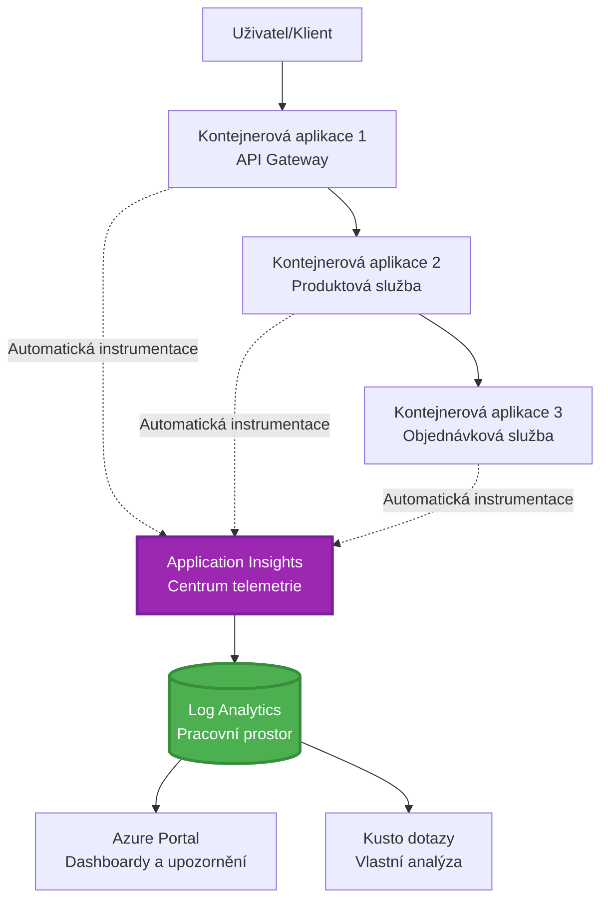
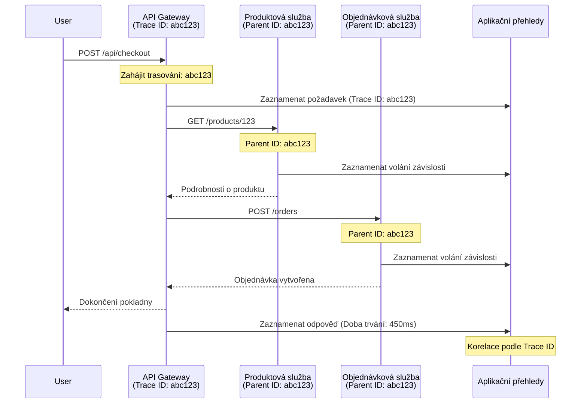

<!--
CO_OP_TRANSLATOR_METADATA:
{
  "original_hash": "e5aa37cdb6378c09099500ac31600b8c",
  "translation_date": "2025-11-23T12:59:38+00:00",
  "source_file": "docs/pre-deployment/application-insights.md",
  "language_code": "cs"
}
-->
# Integrace Application Insights s AZD

⏱️ **Odhadovaný čas**: 40-50 minut | 💰 **Náklady**: ~5-15 USD/měsíc | ⭐ **Složitost**: Střední

**📚 Studijní cesta:**
- ← Předchozí: [Kontroly před spuštěním](preflight-checks.md) - Validace před nasazením
- 🎯 **Jste zde**: Integrace Application Insights (monitoring, telemetrie, ladění)
- → Další: [Průvodce nasazením](../deployment/deployment-guide.md) - Nasazení do Azure
- 🏠 [Domovská stránka kurzu](../../README.md)

---

## Co se naučíte

Po dokončení této lekce budete schopni:
- Automaticky integrovat **Application Insights** do projektů AZD
- Konfigurovat **distribuované trasování** pro mikroslužby
- Implementovat **vlastní telemetrii** (metriky, události, závislosti)
- Nastavit **živé metriky** pro monitoring v reálném čase
- Vytvářet **výstrahy a dashboardy** z nasazení AZD
- Ladit problémy v produkci pomocí **dotazů na telemetrii**
- Optimalizovat **náklady a strategie vzorkování**
- Monitorovat **AI/LLM aplikace** (tokeny, latence, náklady)

## Proč je Application Insights s AZD důležité

### Výzva: Pozorovatelnost v produkci

**Bez Application Insights:**
```
❌ No visibility into production behavior
❌ Manual log aggregation across services
❌ Reactive debugging (wait for customer complaints)
❌ No performance metrics
❌ Cannot trace requests across services
❌ Unknown failure rates and bottlenecks
```

**S Application Insights + AZD:**
```
✅ Automatic telemetry collection
✅ Centralized logs from all services
✅ Proactive issue detection
✅ End-to-end request tracing
✅ Performance metrics and insights
✅ Real-time dashboards
✅ AZD provisions everything automatically
```

**Přirovnání**: Application Insights je jako mít "černou skříňku" a palubní desku pro vaši aplikaci. Vidíte vše, co se děje v reálném čase, a můžete přehrát jakýkoli incident.

---

## Přehled architektury

### Application Insights v architektuře AZD


### Co se monitoruje automaticky

| Typ telemetrie | Co zachycuje | Použití |
|----------------|--------------|---------|
| **Požadavky** | HTTP požadavky, stavové kódy, trvání | Monitoring výkonu API |
| **Závislosti** | Externí volání (DB, API, úložiště) | Identifikace úzkých míst |
| **Výjimky** | Neošetřené chyby s trasováním zásobníku | Ladění chyb |
| **Vlastní události** | Obchodní události (registrace, nákup) | Analýza a trychtýře |
| **Metriky** | Výkonové čítače, vlastní metriky | Plánování kapacity |
| **Trasování** | Zprávy logů s úrovní závažnosti | Ladění a auditování |
| **Dostupnost** | Testy dostupnosti a doby odezvy | Monitoring SLA |

---

## Předpoklady

### Požadované nástroje

```bash
# Ověřte Azure Developer CLI
azd version
# ✅ Očekáváno: azd verze 1.0.0 nebo vyšší

# Ověřte Azure CLI
az --version
# ✅ Očekáváno: azure-cli 2.50.0 nebo vyšší
```

### Požadavky na Azure

- Aktivní předplatné Azure
- Oprávnění k vytvoření:
  - Zdroje Application Insights
  - Pracovní prostory Log Analytics
  - Kontejnerové aplikace
  - Skupiny zdrojů

### Požadované znalosti

Měli byste mít dokončeno:
- [Základy AZD](../getting-started/azd-basics.md) - Základní koncepty AZD
- [Konfigurace](../getting-started/configuration.md) - Nastavení prostředí
- [První projekt](../getting-started/first-project.md) - Základní nasazení

---

## Lekce 1: Automatické Application Insights s AZD

### Jak AZD zajišťuje Application Insights

AZD automaticky vytváří a konfiguruje Application Insights při nasazení. Podívejme se, jak to funguje.

### Struktura projektu

```
monitored-app/
├── azure.yaml                     # AZD configuration
├── infra/
│   ├── main.bicep                # Main infrastructure
│   ├── core/
│   │   └── monitoring.bicep      # Application Insights + Log Analytics
│   └── app/
│       └── api.bicep             # Container App with monitoring
└── src/
    ├── app.py                    # Application with telemetry
    ├── requirements.txt
    └── Dockerfile
```

---

### Krok 1: Konfigurace AZD (azure.yaml)

**Soubor: `azure.yaml`**

```yaml
name: monitored-app
metadata:
  template: monitored-app@1.0.0

services:
  api:
    project: ./src
    language: python
    host: containerapp

# AZD automatically provisions monitoring!
```

**To je vše!** AZD vytvoří Application Insights automaticky. Pro základní monitoring není potřeba žádná další konfigurace.

---

### Krok 2: Monitoring infrastruktury (Bicep)

**Soubor: `infra/core/monitoring.bicep`**

```bicep
param logAnalyticsName string
param applicationInsightsName string
param location string = resourceGroup().location
param tags object = {}

// Log Analytics Workspace (required for Application Insights)
resource logAnalytics 'Microsoft.OperationalInsights/workspaces@2022-10-01' = {
  name: logAnalyticsName
  location: location
  tags: tags
  properties: {
    sku: {
      name: 'PerGB2018'  // Pay-as-you-go pricing
    }
    retentionInDays: 30  // Keep logs for 30 days
    features: {
      enableLogAccessUsingOnlyResourcePermissions: true
    }
  }
}

// Application Insights
resource applicationInsights 'Microsoft.Insights/components@2020-02-02' = {
  name: applicationInsightsName
  location: location
  tags: tags
  kind: 'web'
  properties: {
    Application_Type: 'web'
    WorkspaceResourceId: logAnalytics.id
    IngestionMode: 'LogAnalytics'
    publicNetworkAccessForIngestion: 'Enabled'
    publicNetworkAccessForQuery: 'Enabled'
  }
}

// Outputs for Container Apps
output logAnalyticsWorkspaceId string = logAnalytics.id
output logAnalyticsWorkspaceName string = logAnalytics.name
output applicationInsightsConnectionString string = applicationInsights.properties.ConnectionString
output applicationInsightsInstrumentationKey string = applicationInsights.properties.InstrumentationKey
output applicationInsightsName string = applicationInsights.name
```

---

### Krok 3: Připojení kontejnerové aplikace k Application Insights

**Soubor: `infra/app/api.bicep`**

```bicep
param name string
param location string
param tags object = {}
param containerAppsEnvironmentName string
param applicationInsightsConnectionString string

resource containerApp 'Microsoft.App/containerApps@2023-05-01' = {
  name: name
  location: location
  tags: tags
  properties: {
    configuration: {
      ingress: {
        external: true
        targetPort: 8000
      }
      secrets: [
        {
          name: 'appinsights-connection-string'
          value: applicationInsightsConnectionString
        }
      ]
    }
    template: {
      containers: [
        {
          name: 'api'
          image: 'myregistry.azurecr.io/api:latest'
          resources: {
            cpu: json('0.5')
            memory: '1Gi'
          }
          env: [
            {
              name: 'APPLICATIONINSIGHTS_CONNECTION_STRING'
              secretRef: 'appinsights-connection-string'
            }
            {
              name: 'APPLICATIONINSIGHTS_ENABLED'
              value: 'true'
            }
          ]
        }
      ]
    }
  }
}

output uri string = 'https://${containerApp.properties.configuration.ingress.fqdn}'
```

---

### Krok 4: Aplikační kód s telemetrií

**Soubor: `src/app.py`**

```python
from flask import Flask, request, jsonify
from opencensus.ext.azure.log_exporter import AzureLogHandler
from opencensus.ext.azure.trace_exporter import AzureExporter
from opencensus.ext.flask.flask_middleware import FlaskMiddleware
from opencensus.trace.samplers import ProbabilitySampler
import logging
import os

app = Flask(__name__)

# Získejte připojovací řetězec Application Insights
connection_string = os.environ.get('APPLICATIONINSIGHTS_CONNECTION_STRING')

if connection_string:
    # Nakonfigurujte distribuované trasování
    middleware = FlaskMiddleware(
        app,
        exporter=AzureExporter(connection_string=connection_string),
        sampler=ProbabilitySampler(rate=1.0)  # 100% vzorkování pro vývoj
    )
    
    # Nakonfigurujte protokolování
    logger = logging.getLogger(__name__)
    logger.addHandler(AzureLogHandler(connection_string=connection_string))
    logger.setLevel(logging.INFO)
    
    print("✅ Application Insights enabled")
else:
    logger = logging.getLogger(__name__)
    logger.setLevel(logging.INFO)
    print("⚠️ Application Insights not configured")

@app.route('/health')
def health():
    logger.info('Health check endpoint called')
    return jsonify({'status': 'healthy', 'monitoring': 'enabled'})

@app.route('/api/products')
def get_products():
    logger.info('Fetching products')
    
    # Simulujte volání databáze (automaticky sledováno jako závislost)
    products = [
        {'id': 1, 'name': 'Laptop', 'price': 999.99},
        {'id': 2, 'name': 'Mouse', 'price': 29.99},
        {'id': 3, 'name': 'Keyboard', 'price': 79.99}
    ]
    
    logger.info(f'Returned {len(products)} products')
    return jsonify(products)

@app.route('/api/error-test')
def error_test():
    """Test error tracking"""
    logger.error('Testing error tracking')
    try:
        raise ValueError('This is a test exception')
    except Exception as e:
        logger.exception('Exception occurred in error-test endpoint')
        return jsonify({'error': str(e)}), 500

@app.route('/api/slow')
def slow_endpoint():
    """Test performance tracking"""
    import time
    logger.info('Slow endpoint called')
    time.sleep(3)  # Simulujte pomalou operaci
    logger.warning('Endpoint took 3 seconds to respond')
    return jsonify({'message': 'Slow operation completed'})

if __name__ == '__main__':
    app.run(host='0.0.0.0', port=8000)
```

**Soubor: `src/requirements.txt`**

```txt
Flask==3.0.0
opencensus-ext-azure==1.1.13
opencensus-ext-flask==0.8.1
gunicorn==21.2.0
```

---

### Krok 5: Nasazení a ověření

```bash
# Inicializovat AZD
azd init

# Nasadit (automaticky zajišťuje Application Insights)
azd up

# Získat URL aplikace
APP_URL=$(azd env get-values | grep API_URL | cut -d '=' -f2 | tr -d '"')

# Generovat telemetrii
curl $APP_URL/health
curl $APP_URL/api/products
curl $APP_URL/api/error-test
curl $APP_URL/api/slow
```

**✅ Očekávaný výstup:**
```json
{
  "status": "healthy",
  "monitoring": "enabled"
}
```

---

### Krok 6: Zobrazení telemetrie v Azure Portal

```bash
# Získat podrobnosti o Application Insights
azd env get-values | grep APPLICATIONINSIGHTS

# Otevřít v Azure Portálu
az monitor app-insights component show \
  --app $(azd env get-values | grep APPLICATIONINSIGHTS_NAME | cut -d '=' -f2 | tr -d '"') \
  --resource-group $(azd env get-values | grep AZURE_RESOURCE_GROUP | cut -d '=' -f2 | tr -d '"') \
  --query "appId" -o tsv
```

**Přejděte na Azure Portal → Application Insights → Transaction Search**

Měli byste vidět:
- ✅ HTTP požadavky se stavovými kódy
- ✅ Doba trvání požadavků (3+ sekundy pro `/api/slow`)
- ✅ Podrobnosti o výjimkách z `/api/error-test`
- ✅ Vlastní logovací zprávy

---

## Lekce 2: Vlastní telemetrie a události

### Sledování obchodních událostí

Přidejme vlastní telemetrii pro obchodně kritické události.

**Soubor: `src/telemetry.py`**

```python
from opencensus.ext.azure import metrics_exporter
from opencensus.stats import aggregation as aggregation_module
from opencensus.stats import measure as measure_module
from opencensus.stats import stats as stats_module
from opencensus.stats import view as view_module
from opencensus.tags import tag_map as tag_map_module
from opencensus.ext.azure.log_exporter import AzureLogHandler
from opencensus.ext.azure.trace_exporter import AzureExporter
from opencensus.trace import tracer as tracer_module
import logging
import os

class TelemetryClient:
    """Custom telemetry client for Application Insights"""
    
    def __init__(self, connection_string=None):
        self.connection_string = connection_string or os.environ.get('APPLICATIONINSIGHTS_CONNECTION_STRING')
        
        if not self.connection_string:
            print("⚠️ Application Insights connection string not found")
            return
        
        # Nastavení loggeru
        self.logger = logging.getLogger(__name__)
        self.logger.addHandler(AzureLogHandler(connection_string=self.connection_string))
        self.logger.setLevel(logging.INFO)
        
        # Nastavení exportéru metrik
        self.stats = stats_module.stats
        self.view_manager = self.stats.view_manager
        self.stats_recorder = self.stats.stats_recorder
        
        exporter = metrics_exporter.new_metrics_exporter(
            connection_string=self.connection_string
        )
        self.view_manager.register_exporter(exporter)
        
        # Nastavení trasovače
        self.tracer = tracer_module.Tracer(
            exporter=AzureExporter(connection_string=self.connection_string)
        )
        
        print("✅ Custom telemetry client initialized")
    
    def track_event(self, event_name: str, properties: dict = None):
        """Track custom business event"""
        properties = properties or {}
        self.logger.info(
            f"CustomEvent: {event_name}",
            extra={
                'custom_dimensions': {
                    'event_name': event_name,
                    **properties
                }
            }
        )
    
    def track_metric(self, metric_name: str, value: float, properties: dict = None):
        """Track custom metric"""
        properties = properties or {}
        self.logger.info(
            f"CustomMetric: {metric_name} = {value}",
            extra={
                'custom_dimensions': {
                    'metric_name': metric_name,
                    'value': value,
                    **properties
                }
            }
        )
    
    def track_dependency(self, name: str, dependency_type: str, duration: float, success: bool):
        """Track external dependency call"""
        with self.tracer.span(name=name) as span:
            span.add_attribute('dependency.type', dependency_type)
            span.add_attribute('duration', duration)
            span.add_attribute('success', success)

# Globální klient telemetrie
telemetry = TelemetryClient()
```

### Aktualizace aplikace s vlastními událostmi

**Soubor: `src/app.py` (rozšířený)**

```python
from flask import Flask, request, jsonify
from telemetry import telemetry
import time
import random

app = Flask(__name__)

@app.route('/api/purchase', methods=['POST'])
def purchase():
    """Track purchase event with custom telemetry"""
    data = request.json
    product_id = data.get('product_id')
    quantity = data.get('quantity', 1)
    price = data.get('price', 0)
    
    # Sledovat obchodní událost
    telemetry.track_event('Purchase', {
        'product_id': product_id,
        'quantity': quantity,
        'total_amount': price * quantity,
        'user_id': request.headers.get('X-User-Id', 'anonymous')
    })
    
    # Sledovat metriky příjmů
    telemetry.track_metric('Revenue', price * quantity, {
        'product_id': product_id,
        'currency': 'USD'
    })
    
    return jsonify({
        'order_id': f'ORD-{random.randint(1000, 9999)}',
        'status': 'confirmed',
        'total': price * quantity
    })

@app.route('/api/search')
def search():
    """Track search queries"""
    query = request.args.get('q', '')
    
    start_time = time.time()
    
    # Simulovat vyhledávání (byl by to skutečný dotaz na databázi)
    results = [{'id': 1, 'name': f'Result for {query}'}]
    
    duration = (time.time() - start_time) * 1000  # Převést na ms
    
    # Sledovat událost vyhledávání
    telemetry.track_event('Search', {
        'query': query,
        'results_count': len(results),
        'duration_ms': duration
    })
    
    # Sledovat metriky výkonu vyhledávání
    telemetry.track_metric('SearchDuration', duration, {
        'query_length': len(query)
    })
    
    return jsonify({'results': results, 'count': len(results)})

@app.route('/api/external-call')
def external_call():
    """Track external API dependency"""
    import requests
    
    start_time = time.time()
    success = True
    
    try:
        # Simulovat externí API volání
        response = requests.get('https://api.example.com/data', timeout=5)
        result = response.json()
    except Exception as e:
        success = False
        result = {'error': str(e)}
    
    duration = (time.time() - start_time) * 1000
    
    # Sledovat závislost
    telemetry.track_dependency(
        name='ExternalAPI',
        dependency_type='HTTP',
        duration=duration,
        success=success
    )
    
    return jsonify(result)

if __name__ == '__main__':
    app.run(host='0.0.0.0', port=8000)
```

### Testování vlastní telemetrie

```bash
# Sledovat událost nákupu
curl -X POST $APP_URL/api/purchase \
  -H "Content-Type: application/json" \
  -H "X-User-Id: user123" \
  -d '{"product_id": 1, "quantity": 2, "price": 29.99}'

# Sledovat událost vyhledávání
curl "$APP_URL/api/search?q=laptop"

# Sledovat externí závislost
curl $APP_URL/api/external-call
```

**Zobrazení v Azure Portal:**

Přejděte na Application Insights → Logs a spusťte:

```kusto
// View purchase events
traces
| where customDimensions.event_name == "Purchase"
| project 
    timestamp,
    product_id = tostring(customDimensions.product_id),
    total_amount = todouble(customDimensions.total_amount),
    user_id = tostring(customDimensions.user_id)
| order by timestamp desc

// View revenue metrics
traces
| where customDimensions.metric_name == "Revenue"
| summarize TotalRevenue = sum(todouble(customDimensions.value)) by bin(timestamp, 1h)
| render timechart

// View search performance
traces
| where customDimensions.event_name == "Search"
| summarize 
    AvgDuration = avg(todouble(customDimensions.duration_ms)),
    SearchCount = count()
  by bin(timestamp, 5m)
| render timechart
```

---

## Lekce 3: Distribuované trasování pro mikroslužby

### Aktivace trasování mezi službami

Pro mikroslužby Application Insights automaticky koreluje požadavky mezi službami.

**Soubor: `infra/main.bicep`**

```bicep
targetScope = 'subscription'

param environmentName string
param location string = 'eastus'

var tags = { 'azd-env-name': environmentName }

resource rg 'Microsoft.Resources/resourceGroups@2021-04-01' = {
  name: 'rg-${environmentName}'
  location: location
  tags: tags
}

// Monitoring (shared by all services)
module monitoring './core/monitoring.bicep' = {
  name: 'monitoring'
  scope: rg
  params: {
    logAnalyticsName: 'log-${environmentName}'
    applicationInsightsName: 'appi-${environmentName}'
    location: location
    tags: tags
  }
}

// API Gateway
module apiGateway './app/api-gateway.bicep' = {
  name: 'api-gateway'
  scope: rg
  params: {
    name: 'ca-gateway-${environmentName}'
    location: location
    tags: union(tags, { 'azd-service-name': 'gateway' })
    applicationInsightsConnectionString: monitoring.outputs.applicationInsightsConnectionString
  }
}

// Product Service
module productService './app/product-service.bicep' = {
  name: 'product-service'
  scope: rg
  params: {
    name: 'ca-products-${environmentName}'
    location: location
    tags: union(tags, { 'azd-service-name': 'products' })
    applicationInsightsConnectionString: monitoring.outputs.applicationInsightsConnectionString
  }
}

// Order Service
module orderService './app/order-service.bicep' = {
  name: 'order-service'
  scope: rg
  params: {
    name: 'ca-orders-${environmentName}'
    location: location
    tags: union(tags, { 'azd-service-name': 'orders' })
    applicationInsightsConnectionString: monitoring.outputs.applicationInsightsConnectionString
  }
}

output APPLICATIONINSIGHTS_CONNECTION_STRING string = monitoring.outputs.applicationInsightsConnectionString
output GATEWAY_URL string = apiGateway.outputs.uri
```

### Zobrazení transakce od začátku do konce


**Dotaz na trasování od začátku do konce:**

```kusto
// Find complete request flow
let traceId = "abc123...";  // Get from response header
dependencies
| union requests
| where operation_Id == traceId
| project 
    timestamp,
    type = itemType,
    name,
    duration,
    success,
    cloud_RoleName
| order by timestamp asc
```

---

## Lekce 4: Živé metriky a monitoring v reálném čase

### Aktivace streamu živých metrik

Živé metriky poskytují telemetrii v reálném čase s latencí <1 sekundy.

**Přístup k živým metrikám:**

```bash
# Získat prostředek Application Insights
APPI_NAME=$(azd env get-values | grep APPLICATIONINSIGHTS_NAME | cut -d '=' -f2 | tr -d '"')

# Získat skupinu prostředků
RG_NAME=$(azd env get-values | grep AZURE_RESOURCE_GROUP | cut -d '=' -f2 | tr -d '"')

echo "Navigate to: Azure Portal → Resource Groups → $RG_NAME → $APPI_NAME → Live Metrics"
```

**Co vidíte v reálném čase:**
- ✅ Rychlost příchozích požadavků (požadavky/sekundu)
- ✅ Odchozí volání závislostí
- ✅ Počet výjimek
- ✅ Využití CPU a paměti
- ✅ Počet aktivních serverů
- ✅ Ukázková telemetrie

### Generování zátěže pro testování

```bash
# Generujte zátěž, abyste viděli živé metriky
for i in {1..100}; do
  curl $APP_URL/api/products &
  curl $APP_URL/api/search?q=test$i &
done

# Sledujte živé metriky v Azure Portálu
# Měli byste vidět nárůst rychlosti požadavků
```

---

## Praktická cvičení

### Cvičení 1: Nastavení výstrah ⭐⭐ (Střední)

**Cíl**: Vytvořit výstrahy pro vysokou míru chyb a pomalé odpovědi.

**Kroky:**

1. **Vytvoření výstrahy pro míru chyb:**

```bash
# Získejte ID prostředku Application Insights
APPI_ID=$(az monitor app-insights component show \
  --app $APPI_NAME \
  --resource-group $RG_NAME \
  --query "id" -o tsv)

# Vytvořte metrický alert pro neúspěšné požadavky
az monitor metrics alert create \
  --name "High-Error-Rate" \
  --resource-group $RG_NAME \
  --scopes $APPI_ID \
  --condition "count requests/failed > 10" \
  --window-size 5m \
  --evaluation-frequency 1m \
  --description "Alert when error rate exceeds 10 per 5 minutes"
```

2. **Vytvoření výstrahy pro pomalé odpovědi:**

```bash
az monitor metrics alert create \
  --name "Slow-Responses" \
  --resource-group $RG_NAME \
  --scopes $APPI_ID \
  --condition "avg requests/duration > 3000" \
  --window-size 5m \
  --evaluation-frequency 1m \
  --description "Alert when average response time exceeds 3 seconds"
```

3. **Vytvoření výstrahy pomocí Bicep (preferováno pro AZD):**

**Soubor: `infra/core/alerts.bicep`**

```bicep
param applicationInsightsId string
param actionGroupId string = ''
param location string = resourceGroup().location

// High error rate alert
resource errorRateAlert 'Microsoft.Insights/metricAlerts@2018-03-01' = {
  name: 'high-error-rate'
  location: 'global'
  properties: {
    description: 'Alert when error rate exceeds threshold'
    severity: 2
    enabled: true
    scopes: [
      applicationInsightsId
    ]
    evaluationFrequency: 'PT1M'
    windowSize: 'PT5M'
    criteria: {
      'odata.type': 'Microsoft.Azure.Monitor.SingleResourceMultipleMetricCriteria'
      allOf: [
        {
          name: 'Error rate'
          metricName: 'requests/failed'
          operator: 'GreaterThan'
          threshold: 10
          timeAggregation: 'Count'
        }
      ]
    }
    actions: actionGroupId != '' ? [
      {
        actionGroupId: actionGroupId
      }
    ] : []
  }
}

// Slow response alert
resource slowResponseAlert 'Microsoft.Insights/metricAlerts@2018-03-01' = {
  name: 'slow-responses'
  location: 'global'
  properties: {
    description: 'Alert when response time is too high'
    severity: 3
    enabled: true
    scopes: [
      applicationInsightsId
    ]
    evaluationFrequency: 'PT1M'
    windowSize: 'PT5M'
    criteria: {
      'odata.type': 'Microsoft.Azure.Monitor.SingleResourceMultipleMetricCriteria'
      allOf: [
        {
          name: 'Response duration'
          metricName: 'requests/duration'
          operator: 'GreaterThan'
          threshold: 3000
          timeAggregation: 'Average'
        }
      ]
    }
  }
}

output errorAlertId string = errorRateAlert.id
output slowResponseAlertId string = slowResponseAlert.id
```

4. **Testování výstrah:**

```bash
# Generovat chyby
for i in {1..20}; do
  curl $APP_URL/api/error-test
done

# Generovat pomalé odpovědi
for i in {1..10}; do
  curl $APP_URL/api/slow
done

# Zkontrolovat stav upozornění (počkat 5-10 minut)
az monitor metrics alert list \
  --resource-group $RG_NAME \
  --query "[].{Name:name, Enabled:enabled, State:properties.enabled}" \
  --output table
```

**✅ Kritéria úspěchu:**
- ✅ Výstrahy úspěšně vytvořeny
- ✅ Výstrahy se aktivují při překročení prahových hodnot
- ✅ Historii výstrah lze zobrazit v Azure Portal
- ✅ Integrované s nasazením AZD

**Čas**: 20-25 minut

---

### Cvičení 2: Vytvoření vlastního dashboardu ⭐⭐ (Střední)

**Cíl**: Vytvořit dashboard zobrazující klíčové metriky aplikace.

**Kroky:**

1. **Vytvoření dashboardu přes Azure Portal:**

Přejděte na: Azure Portal → Dashboards → New Dashboard

2. **Přidání dlaždic pro klíčové metriky:**

- Počet požadavků (posledních 24 hodin)
- Průměrná doba odezvy
- Míra chyb
- 5 nejpomalejších operací
- Geografické rozložení uživatelů

3. **Vytvoření dashboardu pomocí Bicep:**

**Soubor: `infra/core/dashboard.bicep`**

```bicep
param dashboardName string
param applicationInsightsId string
param location string = resourceGroup().location

resource dashboard 'Microsoft.Portal/dashboards@2020-09-01-preview' = {
  name: dashboardName
  location: location
  properties: {
    lenses: [
      {
        order: 0
        parts: [
          // Request count
          {
            position: { x: 0, y: 0, rowSpan: 4, colSpan: 6 }
            metadata: {
              type: 'Extension/Microsoft_OperationsManagementSuite_Workspace/PartType/LogsDashboardPart'
              inputs: [
                {
                  name: 'resourceId'
                  value: applicationInsightsId
                }
                {
                  name: 'query'
                  value: '''
                    requests
                    | summarize RequestCount = count() by bin(timestamp, 1h)
                    | render timechart
                  '''
                }
              ]
            }
          }
          // Error rate
          {
            position: { x: 6, y: 0, rowSpan: 4, colSpan: 6 }
            metadata: {
              type: 'Extension/Microsoft_OperationsManagementSuite_Workspace/PartType/LogsDashboardPart'
              inputs: [
                {
                  name: 'resourceId'
                  value: applicationInsightsId
                }
                {
                  name: 'query'
                  value: '''
                    requests
                    | summarize 
                        Total = count(),
                        Failed = countif(success == false)
                    | extend ErrorRate = (Failed * 100.0) / Total
                    | project ErrorRate
                  '''
                }
              ]
            }
          }
        ]
      }
    ]
  }
}

output dashboardId string = dashboard.id
```

4. **Nasazení dashboardu:**

```bash
# Přidat do main.bicep
module dashboard './core/dashboard.bicep' = {
  name: 'dashboard'
  scope: rg
  params: {
    dashboardName: 'dashboard-${environmentName}'
    applicationInsightsId: monitoring.outputs.applicationInsightsId
    location: location
  }
}

# Nasadit
azd up
```

**✅ Kritéria úspěchu:**
- ✅ Dashboard zobrazuje klíčové metriky
- ✅ Lze připnout na domovskou stránku Azure Portal
- ✅ Aktualizace v reálném čase
- ✅ Nasaditelné přes AZD

**Čas**: 25-30 minut

---

### Cvičení 3: Monitorování AI/LLM aplikace ⭐⭐⭐ (Pokročilé)

**Cíl**: Sledovat využití Azure OpenAI (tokeny, náklady, latence).

**Kroky:**

1. **Vytvoření wrapperu pro monitoring AI:**

**Soubor: `src/ai_telemetry.py`**

```python
from telemetry import telemetry
from openai import AzureOpenAI
import time

class MonitoredAzureOpenAI:
    """Azure OpenAI client with automatic telemetry"""
    
    def __init__(self, api_key, endpoint, api_version="2024-02-01"):
        self.client = AzureOpenAI(
            api_key=api_key,
            api_version=api_version,
            azure_endpoint=endpoint
        )
    
    def chat_completion(self, model: str, messages: list, **kwargs):
        """Track chat completion with telemetry"""
        start_time = time.time()
        
        try:
            # Zavolat Azure OpenAI
            response = self.client.chat.completions.create(
                model=model,
                messages=messages,
                **kwargs
            )
            
            duration = (time.time() - start_time) * 1000  # ms
            
            # Extrahovat využití
            usage = response.usage
            prompt_tokens = usage.prompt_tokens
            completion_tokens = usage.completion_tokens
            total_tokens = usage.total_tokens
            
            # Vypočítat náklady (ceny GPT-4)
            prompt_cost = (prompt_tokens / 1000) * 0.03  # $0.03 za 1K tokenů
            completion_cost = (completion_tokens / 1000) * 0.06  # $0.06 za 1K tokenů
            total_cost = prompt_cost + completion_cost
            
            # Sledovat vlastní událost
            telemetry.track_event('OpenAI_Request', {
                'model': model,
                'prompt_tokens': prompt_tokens,
                'completion_tokens': completion_tokens,
                'total_tokens': total_tokens,
                'duration_ms': duration,
                'cost_usd': total_cost,
                'success': True
            })
            
            # Sledovat metriky
            telemetry.track_metric('OpenAI_Tokens', total_tokens, {
                'model': model,
                'type': 'total'
            })
            
            telemetry.track_metric('OpenAI_Cost', total_cost, {
                'model': model,
                'currency': 'USD'
            })
            
            telemetry.track_metric('OpenAI_Duration', duration, {
                'model': model
            })
            
            return response
            
        except Exception as e:
            duration = (time.time() - start_time) * 1000
            
            telemetry.track_event('OpenAI_Request', {
                'model': model,
                'duration_ms': duration,
                'success': False,
                'error': str(e)
            })
            
            raise
```

2. **Použití monitorovaného klienta:**

```python
from flask import Flask, request, jsonify
from ai_telemetry import MonitoredAzureOpenAI
import os

app = Flask(__name__)

# Inicializovat monitorovaného klienta OpenAI
openai_client = MonitoredAzureOpenAI(
    api_key=os.environ['AZURE_OPENAI_API_KEY'],
    endpoint=os.environ['AZURE_OPENAI_ENDPOINT']
)

@app.route('/api/chat', methods=['POST'])
def chat():
    data = request.json
    user_message = data.get('message')
    
    # Volání s automatickým monitorováním
    response = openai_client.chat_completion(
        model='gpt-4',
        messages=[
            {'role': 'user', 'content': user_message}
        ]
    )
    
    return jsonify({
        'response': response.choices[0].message.content,
        'tokens': response.usage.total_tokens
    })
```

3. **Dotaz na metriky AI:**

```kusto
// Total AI spend over time
traces
| where customDimensions.event_name == "OpenAI_Request"
| where customDimensions.success == "True"
| summarize TotalCost = sum(todouble(customDimensions.cost_usd)) by bin(timestamp, 1h)
| render timechart

// Token usage by model
traces
| where customDimensions.event_name == "OpenAI_Request"
| summarize 
    TotalTokens = sum(toint(customDimensions.total_tokens)),
    RequestCount = count()
  by Model = tostring(customDimensions.model)

// Average latency
traces
| where customDimensions.event_name == "OpenAI_Request"
| summarize AvgDuration = avg(todouble(customDimensions.duration_ms))
| project AvgDurationSeconds = AvgDuration / 1000

// Cost per request
traces
| where customDimensions.event_name == "OpenAI_Request"
| extend Cost = todouble(customDimensions.cost_usd)
| summarize 
    TotalCost = sum(Cost),
    RequestCount = count(),
    AvgCostPerRequest = avg(Cost)
```

**✅ Kritéria úspěchu:**
- ✅ Každé volání OpenAI automaticky sledováno
- ✅ Viditelné využití tokenů a náklady
- ✅ Monitorována latence
- ✅ Možnost nastavení výstrah na rozpočet

**Čas**: 35-45 minut

---

## Optimalizace nákladů

### Strategie vzorkování

Kontrola nákladů pomocí vzorkování telemetrie:

```python
from opencensus.trace.samplers import ProbabilitySampler

# Vývoj: 100% vzorkování
sampler = ProbabilitySampler(rate=1.0)

# Produkce: 10% vzorkování (snížení nákladů o 90%)
sampler = ProbabilitySampler(rate=0.1)

# Adaptivní vzorkování (automaticky se přizpůsobuje)
from opencensus.trace.samplers import AdaptiveSampler
sampler = AdaptiveSampler()
```

**V Bicep:**

```bicep
resource applicationInsights 'Microsoft.Insights/components@2020-02-02' = {
  name: applicationInsightsName
  properties: {
    SamplingPercentage: 10  // 10% sampling
  }
}
```

### Uchovávání dat

```bicep
resource logAnalytics 'Microsoft.OperationalInsights/workspaces@2022-10-01' = {
  name: logAnalyticsName
  properties: {
    retentionInDays: 30  // Minimum (cheapest)
    // Options: 30, 31, 60, 90, 120, 180, 270, 365, 550, 730
  }
}
```

### Odhady měsíčních nákladů

| Objem dat | Uchovávání | Měsíční náklady |
|-----------|------------|-----------------|
| 1 GB/měsíc | 30 dní | ~2-5 USD |
| 5 GB/měsíc | 30 dní | ~10-15 USD |
| 10 GB/měsíc | 90 dní | ~25-40 USD |
| 50 GB/měsíc | 90 dní | ~100-150 USD |

**Bezplatná úroveň**: 5 GB/měsíc zahrnuto

---

## Kontrolní bod znalostí

### 1. Základní integrace ✓

Otestujte své znalosti:

- [ ] **Q1**: Jak AZD zajišťuje Application Insights?
  - **A**: Automaticky pomocí Bicep šablon v `infra/core/monitoring.bicep`

- [ ] **Q2**: Jaká proměnná prostředí umožňuje Application Insights?
  - **A**: `APPLICATIONINSIGHTS_CONNECTION_STRING`

- [ ] **Q3**: Jaké jsou tři hlavní typy telemetrie?
  - **A**: Požadavky (HTTP volání), Závislosti (externí volání), Výjimky (chyby)

**Praktické ověření:**
```bash
# Zkontrolujte, zda je Application Insights nakonfigurován
azd env get-values | grep APPLICATIONINSIGHTS

# Ověřte, zda telemetrie funguje
az monitor app-insights metrics show \
  --app $APPI_NAME \
  --resource-group $RG_NAME \
  --metric "requests/count"
```

---

### 2. Vlastní telemetrie ✓

Otestujte své znalosti:

- [ ] **Q1**: Jak sledovat vlastní obchodní události?
  - **A**: Použijte logger s `custom_dimensions` nebo `TelemetryClient.track_event()`

- [ ] **Q2**: Jaký je rozdíl mezi událostmi a metrikami?
  - **A**: Události jsou diskrétní výskyty, metriky jsou číselná měření

- [ ] **Q3**: Jak korelovat telemetrii mezi službami?
  - **A**: Application Insights automaticky používá `operation_Id` pro korelaci

**Praktické ověření:**
```kusto
// Verify custom events
traces
| where customDimensions.event_name != ""
| summarize count() by tostring(customDimensions.event_name)
```

---

### 3. Monitoring v produkci ✓

Otestujte své znalosti:

- [ ] **Q1**: Co je vzorkování a proč ho používat?
  - **A**: Vzorkování snižuje objem dat (a náklady) tím, že zachycuje pouze procento telemetrie

- [ ] **Q2**: Jak nastavit výstrahy?
  - **A**: Použijte metrické výstrahy v Bicep nebo Azure Portal na základě metrik Application Insights

- [ ] **Q3**: Jaký je rozdíl mezi Log Analytics a Application Insights?
  - **A**: Application Insights ukládá data do pracovního prostoru Log Analytics; App Insights poskytuje specifické pohledy na aplikaci

**Praktické ověření:**
```bash
# Zkontrolujte konfiguraci vzorkování
az monitor app-insights component show \
  --app $APPI_NAME \
  --resource-group $RG_NAME \
  --query "properties.SamplingPercentage"
```

---

## Nejlepší postupy

### ✅ DĚLEJTE:

1. **Používejte korelační ID**
   ```python
   logger.info('Processing order', extra={
       'custom_dimensions': {
           'order_id': order_id,
           'user_id': user_id
       }
   })
   ```

2. **Nastavte výstrahy pro kritické metriky**
   ```bicep
   // Error rate, slow responses, availability
   ```

3. **Používejte strukturované logování**
   ```python
   # ✅ DOBRÉ: Strukturované
   logger.info('User signup', extra={'custom_dimensions': {'user_id': 123}})
   
   # ❌ ŠPATNÉ: Nestrukturované
   logger.info(f'User 123 signed up')
   ```

4. **Monitorujte závislosti**
   ```python
   # Automaticky sledovat volání databáze, HTTP požadavky, atd.
   ```

5. **Používejte živé metriky během nasazení**

### ❌ NEDĚLEJTE:

1. **Nezaznamenávejte citlivá data**
   ```python
   # ❌ ŠPATNÉ
   logger.info(f'Login: {username}:{password}')
   
   # ✅ DOBRÉ
   logger.info('Login attempt', extra={'custom_dimensions': {'username': username}})
   ```

2. **Nepoužívejte 100% vzorkování v produkci**
   ```python
   # ❌ Drahé
   sampler = ProbabilitySampler(rate=1.0)
   
   # ✅ Nákladově efektivní
   sampler = ProbabilitySampler(rate=0.1)
   ```

3. **Neignorujte fronty mrtvých dopisů**

4. **Nezapomeňte nastavit limity uchovávání dat**

---

## Řešení problémů

### Problém: Žádná telemetrie se nezobrazuje

**Diagnóza:**
```bash
# Zkontrolujte, zda je nastavena připojovací řetězec
azd env get-values | grep APPLICATIONINSIGHTS

# Zkontrolujte logy aplikace
azd logs api --tail 50
```

**Řešení:**
```bash
# Ověřte připojovací řetězec v aplikaci Container
az containerapp show \
  --name $APP_NAME \
  --resource-group $RG_NAME \
  --query "properties.template.containers[0].env" \
  | grep -i applicationinsights
```

---

### Problém: Vysoké náklady

**Diagnóza:**
```bash
# Zkontrolujte příjem dat
az monitor app-insights metrics show \
  --app $APPI_NAME \
  --resource-group $RG_NAME \
  --metric "availabilityResults/count"
```

**Řešení:**
- Snižte míru vzorkování
- Zkraťte dobu uchovávání
- Odstraňte podrobné logování

---

## Další informace

### Oficiální dokumentace
- [Přehled Application Insights](https://learn.microsoft.com/azure/azure-monitor/app/app-insights-overview)
- [Application Insights pro Python](https://learn.microsoft.com/azure/azure-monitor/app/opencensus-python)
- [Kusto Query Language](https://learn.microsoft.com/azure/data-explorer/kusto/query/)
- [Monitoring AZD](https://learn.microsoft.com/azure/developer/azure-developer-cli/monitor-your-app)

### Další kroky v tomto kurzu
- ← Předchozí: [Kontroly před spuštěním](preflight-checks.md)
- → Další: [Průvodce nasazením](../deployment/deployment-guide.md)
- 🏠 [Domovská stránka kurzu](../../README.md)

### Související příklady
- [Příklad Azure OpenAI](../../../../examples/azure-openai-chat) - Telemetrie AI
- [Příklad mikroslužeb](../../../../examples/microservices) - Distribuované trasování

---

## Shrnutí

**Naučili jste se:**
- ✅ Automatické zajištění Application Insights s AZD
- ✅ Vlastní telemetrii (události, metriky, závislosti)
- ✅ Distribuované trasování mezi mikroslužbami
- ✅ Živé metriky a monitoring v reálném čase
- ✅ Výstrahy a dashboardy
- ✅ Monitorování aplikací AI/LLM
- ✅ Strategie optimalizace nákladů

**Hlavní poznatky:**
1. **AZD automaticky nastavuje monitorování** - Žádné manuální nastavení
2. **Používejte strukturované logování** - Usnadňuje dotazování
3. **Sledujte obchodní události** - Nejen technické metriky
4. **Monitorujte náklady na AI** - Sledujte tokeny a výdaje
5. **Nastavte upozornění** - Buďte proaktivní, ne reaktivní
6. **Optimalizujte náklady** - Používejte vzorkování a limity uchovávání

**Další kroky:**
1. Dokončete praktická cvičení
2. Přidejte Application Insights do svých projektů AZD
3. Vytvořte vlastní dashboardy pro svůj tým
4. Naučte se [Průvodce nasazením](../deployment/deployment-guide.md)

---

<!-- CO-OP TRANSLATOR DISCLAIMER START -->
**Prohlášení**:  
Tento dokument byl přeložen pomocí služby AI pro překlad [Co-op Translator](https://github.com/Azure/co-op-translator). Ačkoli se snažíme o přesnost, mějte prosím na paměti, že automatizované překlady mohou obsahovat chyby nebo nepřesnosti. Původní dokument v jeho rodném jazyce by měl být považován za autoritativní zdroj. Pro důležité informace se doporučuje profesionální lidský překlad. Neodpovídáme za žádná nedorozumění nebo nesprávné interpretace vyplývající z použití tohoto překladu.
<!-- CO-OP TRANSLATOR DISCLAIMER END -->