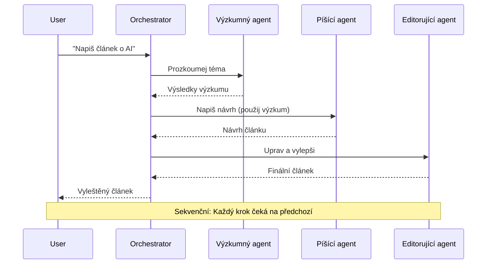
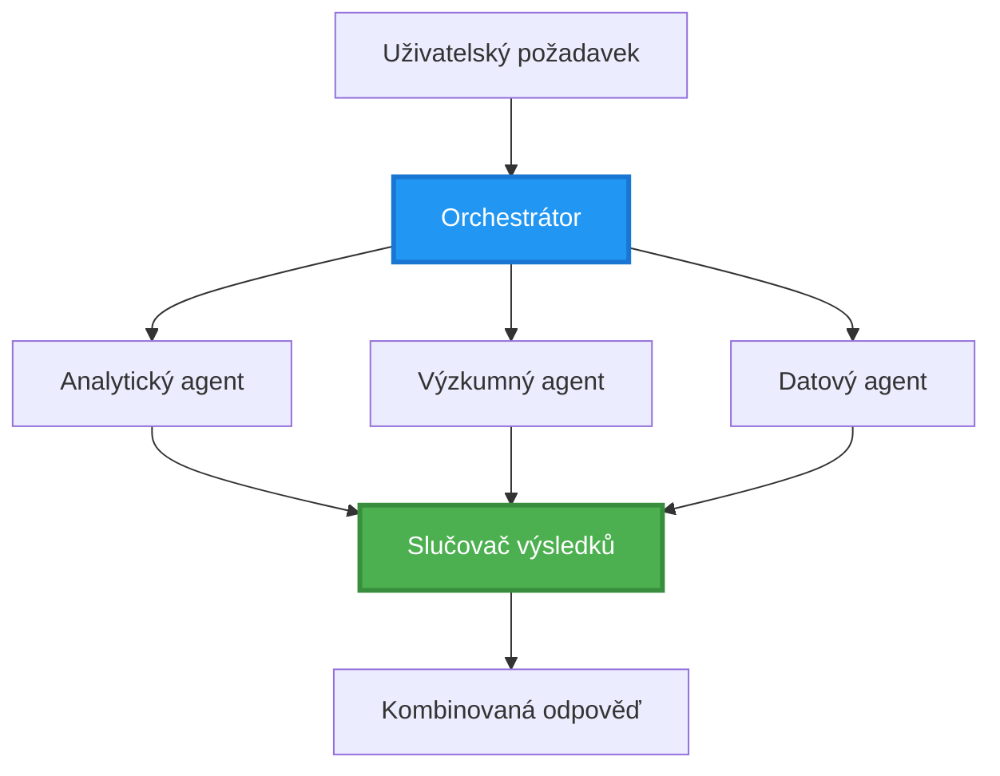
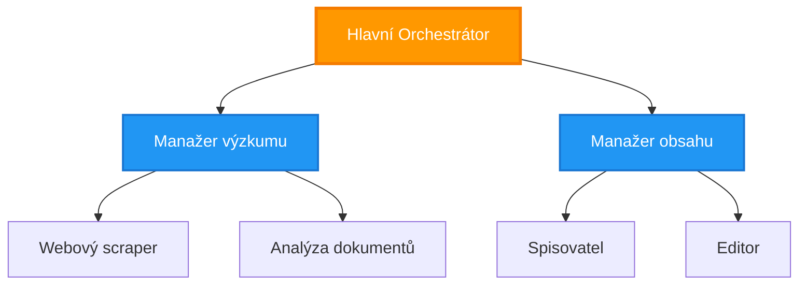
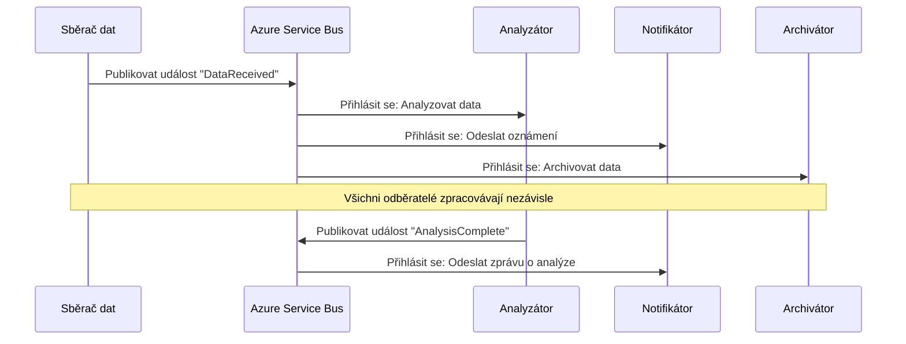
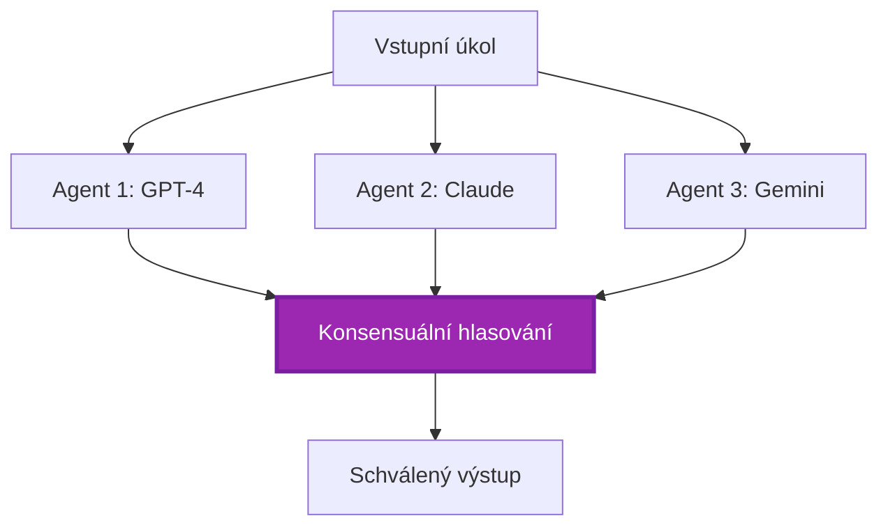
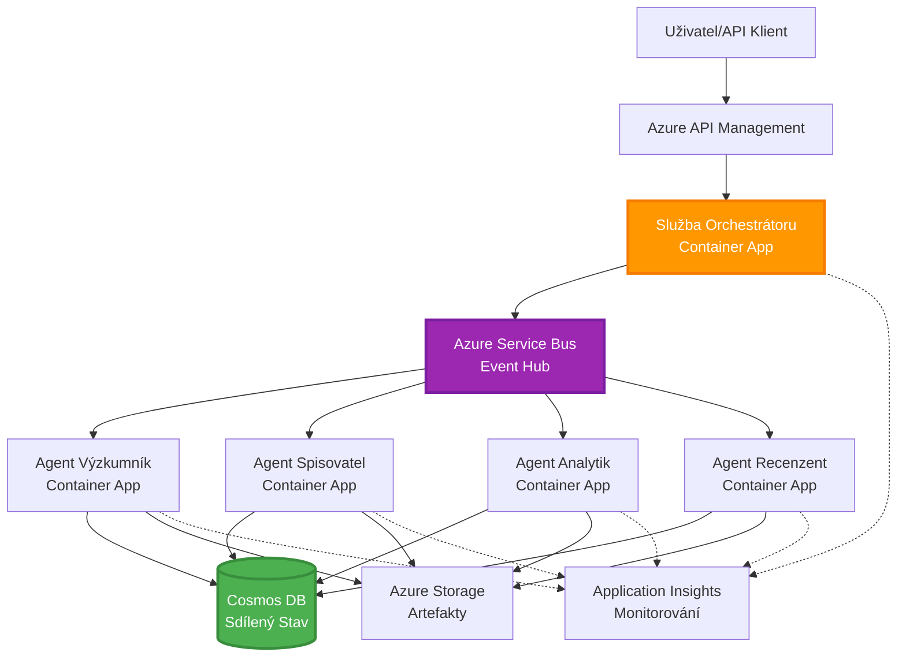

# Vzory koordinace více agentů

⏱️ **Odhadovaný čas**: 60-75 minut | 💰 **Odhadované náklady**: ~$100-300/měsíc | ⭐ **Složitost**: Pokročilá

**📚 Vzdělávací cesta:**
- ← Předchozí: [Plánování kapacity](capacity-planning.md) - Strategie dimenzování a škálování zdrojů
- 🎯 **Jste zde**: Vzory koordinace více agentů (Orchestrace, komunikace, správa stavu)
- → Další: [Výběr SKU](sku-selection.md) - Výběr správných služeb Azure
- 🏠 [Domov kurzu](../../README.md)

---

## Co se naučíte

Po dokončení této lekce:
- Pochopíte vzory **architektury více agentů** a kdy je použít
- Implementujete **orchestrační vzory** (centralizované, decentralizované, hierarchické)
- Navrhnete strategie **komunikace agentů** (synchronní, asynchronní, řízené událostmi)
- Budete spravovat **sdílený stav** mezi distribuovanými agenty
- Nasadíte **systémy více agentů** na Azure s AZD
- Aplikujete **koordinační vzory** na reálné scénáře AI
- Budete monitorovat a ladit distribuované systémy agentů

## Proč je koordinace více agentů důležitá

### Vývoj: Od jednoho agenta k více agentům

**Jeden agent (jednoduchý):**
```
User → Agent → Response
```
- ✅ Snadno pochopitelný a implementovatelný
- ✅ Rychlý pro jednoduché úkoly
- ❌ Omezený schopnostmi jednoho modelu
- ❌ Nelze paralelizovat složité úkoly
- ❌ Žádná specializace

**Systém více agentů (pokročilý):**
```
           ┌─────────────┐
           │ Orchestrator│
           └──────┬──────┘
        ┌─────────┼─────────┐
        │         │         │
    ┌───▼──┐  ┌──▼───┐  ┌──▼────┐
    │Agent1│  │Agent2│  │Agent3 │
    │(Plan)│  │(Code)│  │(Review)│
    └──────┘  └──────┘  └───────┘
```
- ✅ Specializovaní agenti pro konkrétní úkoly
- ✅ Paralelní provádění pro rychlost
- ✅ Modulární a snadno udržovatelný
- ✅ Lepší při složitých pracovních postupech
- ⚠️ Vyžaduje logiku koordinace

**Přirovnání**: Jeden agent je jako jedna osoba, která dělá všechny úkoly. Systém více agentů je jako tým, kde má každý člen specializované dovednosti (výzkumník, programátor, recenzent, spisovatel) a pracují společně.

---

## Základní vzory koordinace

### Vzor 1: Sekvenční koordinace (Řetězec odpovědnosti)

**Kdy použít**: Úkoly musí být dokončeny ve specifickém pořadí, každý agent staví na výstupu předchozího.


**Výhody:**
- ✅ Jasný tok dat
- ✅ Snadné ladění
- ✅ Předvídatelné pořadí provádění

**Omezení:**
- ❌ Pomalejší (žádná paralelizace)
- ❌ Jedno selhání blokuje celý řetězec
- ❌ Nelze zvládnout vzájemně závislé úkoly

**Příklady použití:**
- Proces tvorby obsahu (výzkum → psaní → úpravy → publikace)
- Generování kódu (plán → implementace → testování → nasazení)
- Generování zpráv (sběr dat → analýza → vizualizace → shrnutí)

---

### Vzor 2: Paralelní koordinace (Fan-Out/Fan-In)

**Kdy použít**: Nezávislé úkoly mohou běžet současně, výsledky se kombinují na konci.


**Výhody:**
- ✅ Rychlé (paralelní provádění)
- ✅ Odolné vůči chybám (částečné výsledky jsou přijatelné)
- ✅ Horizontálně škálovatelné

**Omezení:**
- ⚠️ Výsledky mohou dorazit v nesprávném pořadí
- ⚠️ Potřeba logiky agregace
- ⚠️ Složitá správa stavu

**Příklady použití:**
- Sběr dat z více zdrojů (API + databáze + web scraping)
- Konkurenční analýza (více modelů generuje řešení, nejlepší je vybráno)
- Překladové služby (překlad do více jazyků současně)

---

### Vzor 3: Hierarchická koordinace (Manažer-pracovník)

**Kdy použít**: Složité pracovní postupy s dílčími úkoly, potřeba delegace.


**Výhody:**
- ✅ Zvládá složité pracovní postupy
- ✅ Modulární a snadno udržovatelný
- ✅ Jasné hranice odpovědnosti

**Omezení:**
- ⚠️ Složitější architektura
- ⚠️ Vyšší latence (více vrstev koordinace)
- ⚠️ Vyžaduje sofistikovanou orchestraci

**Příklady použití:**
- Zpracování podnikových dokumentů (klasifikace → směrování → zpracování → archivace)
- Vícefázové datové toky (příjem → čištění → transformace → analýza → zpráva)
- Složité automatizační pracovní postupy (plánování → přidělení zdrojů → provedení → monitorování)

---

### Vzor 4: Koordinace řízená událostmi (Publish-Subscribe)

**Kdy použít**: Agenti musí reagovat na události, požadováno volné propojení.


**Výhody:**
- ✅ Volné propojení mezi agenty
- ✅ Snadné přidání nových agentů (stačí se přihlásit)
- ✅ Asynchronní zpracování
- ✅ Odolné (perzistence zpráv)

**Omezení:**
- ⚠️ Eventuální konzistence
- ⚠️ Složitější ladění
- ⚠️ Problémy s pořadím zpráv

**Příklady použití:**
- Systémy monitorování v reálném čase (upozornění, panely, logy)
- Vícekanálová oznámení (e-mail, SMS, push, Slack)
- Datové toky (více spotřebitelů stejného datového zdroje)

---

### Vzor 5: Koordinace založená na konsensu (Hlasování/Kvorum)

**Kdy použít**: Potřeba shody od více agentů před pokračováním.


**Výhody:**
- ✅ Vyšší přesnost (více názorů)
- ✅ Odolné vůči chybám (přijatelné menšinové selhání)
- ✅ Vestavěná kontrola kvality

**Omezení:**
- ❌ Nákladné (více volání modelu)
- ❌ Pomalejší (čekání na všechny agenty)
- ⚠️ Potřeba řešení konfliktů

**Příklady použití:**
- Moderace obsahu (více modelů kontroluje obsah)
- Kontrola kódu (více linterů/analyzátorů)
- Lékařská diagnostika (více AI modelů, validace odborníkem)

---

## Přehled architektury

### Kompletní systém více agentů na Azure


**Klíčové komponenty:**

| Komponenta | Účel | Služba Azure |
|------------|------|--------------|
| **API Gateway** | Vstupní bod, omezení rychlosti, autentizace | API Management |
| **Orchestrátor** | Koordinuje pracovní postupy agentů | Container Apps |
| **Fronta zpráv** | Asynchronní komunikace | Service Bus / Event Hubs |
| **Agenti** | Specializovaní AI pracovníci | Container Apps / Functions |
| **Úložiště stavu** | Sdílený stav, sledování úkolů | Cosmos DB |
| **Úložiště artefaktů** | Dokumenty, výsledky, logy | Blob Storage |
| **Monitorování** | Distribuované trasování, logy | Application Insights |

---

## Předpoklady

### Požadované nástroje

```bash
# Ověřte Azure Developer CLI
azd version
# ✅ Očekáváno: azd verze 1.0.0 nebo vyšší

# Ověřte Azure CLI
az --version
# ✅ Očekáváno: azure-cli verze 2.50.0 nebo vyšší

# Ověřte Docker (pro lokální testování)
docker --version
# ✅ Očekáváno: Docker verze 20.10 nebo vyšší
```

### Požadavky na Azure

- Aktivní předplatné Azure
- Oprávnění k vytvoření:
  - Container Apps
  - Namespace Service Bus
  - Účty Cosmos DB
  - Účty úložiště
  - Application Insights

### Požadované znalosti

Měli byste mít dokončeno:
- [Správa konfigurace](../getting-started/configuration.md)
- [Autentizace a bezpečnost](../getting-started/authsecurity.md)
- [Příklad mikroservis](../../../../examples/microservices)

---

## Průvodce implementací

### Struktura projektu

```
multi-agent-system/
├── azure.yaml                    # AZD configuration
├── infra/
│   ├── main.bicep               # Main infrastructure
│   ├── core/
│   │   ├── servicebus.bicep     # Message queue
│   │   ├── cosmos.bicep         # State store
│   │   ├── storage.bicep        # Artifact storage
│   │   └── monitoring.bicep     # Application Insights
│   └── app/
│       ├── orchestrator.bicep   # Orchestrator service
│       └── agent.bicep          # Agent template
└── src/
    ├── orchestrator/            # Orchestration logic
    │   ├── app.py
    │   ├── workflows.py
    │   └── Dockerfile
    ├── agents/
    │   ├── research/            # Research agent
    │   ├── writer/              # Writer agent
    │   ├── analyst/             # Analyst agent
    │   └── reviewer/            # Reviewer agent
    └── shared/
        ├── state_manager.py     # Shared state logic
        └── message_handler.py   # Message handling
```

---

## Lekce 1: Sekvenční koordinační vzor

### Implementace: Proces tvorby obsahu

Postavme sekvenční pipeline: Výzkum → Psaní → Úpravy → Publikace

### 1. Konfigurace AZD

**Soubor: `azure.yaml`**

```yaml
name: content-pipeline
metadata:
  template: multi-agent-sequential@1.0.0

services:
  orchestrator:
    project: ./src/orchestrator
    language: python
    host: containerapp
  
  research-agent:
    project: ./src/agents/research
    language: python
    host: containerapp
  
  writer-agent:
    project: ./src/agents/writer
    language: python
    host: containerapp
  
  editor-agent:
    project: ./src/agents/editor
    language: python
    host: containerapp
```

### 2. Infrastruktura: Service Bus pro koordinaci

**Soubor: `infra/core/servicebus.bicep`**

```bicep
param name string
param location string
param tags object = {}

resource serviceBusNamespace 'Microsoft.ServiceBus/namespaces@2022-10-01-preview' = {
  name: name
  location: location
  tags: tags
  sku: {
    name: 'Standard'
    tier: 'Standard'
  }
  properties: {
    minimumTlsVersion: '1.2'
  }
}

// Queue for orchestrator → research agent
resource researchQueue 'Microsoft.ServiceBus/namespaces/queues@2022-10-01-preview' = {
  parent: serviceBusNamespace
  name: 'research-tasks'
  properties: {
    maxDeliveryCount: 3
    lockDuration: 'PT5M'
    deadLetteringOnMessageExpiration: true
  }
}

// Queue for research agent → writer agent
resource writerQueue 'Microsoft.ServiceBus/namespaces/queues@2022-10-01-preview' = {
  parent: serviceBusNamespace
  name: 'writer-tasks'
  properties: {
    maxDeliveryCount: 3
    lockDuration: 'PT5M'
  }
}

// Queue for writer agent → editor agent
resource editorQueue 'Microsoft.ServiceBus/namespaces/queues@2022-10-01-preview' = {
  parent: serviceBusNamespace
  name: 'editor-tasks'
  properties: {
    maxDeliveryCount: 3
    lockDuration: 'PT5M'
  }
}

output namespace string = serviceBusNamespace.name
output connectionString string = listKeys('${serviceBusNamespace.id}/AuthorizationRules/RootManageSharedAccessKey', serviceBusNamespace.apiVersion).primaryConnectionString
```

### 3. Správce sdíleného stavu

**Soubor: `src/shared/state_manager.py`**

```python
from azure.cosmos import CosmosClient, PartitionKey
from datetime import datetime
import os

class StateManager:
    """Manages shared state across agents using Cosmos DB"""
    
    def __init__(self):
        endpoint = os.environ['COSMOS_ENDPOINT']
        key = os.environ['COSMOS_KEY']
        
        self.client = CosmosClient(endpoint, key)
        self.database = self.client.get_database_client('agent-state')
        self.container = self.database.get_container_client('tasks')
    
    def create_task(self, task_id: str, task_type: str, input_data: dict):
        """Create a new task"""
        task = {
            'id': task_id,
            'type': task_type,
            'status': 'pending',
            'input': input_data,
            'created_at': datetime.utcnow().isoformat(),
            'steps': []
        }
        self.container.create_item(task)
        return task
    
    def update_task_step(self, task_id: str, step_name: str, result: dict):
        """Update task with completed step"""
        task = self.container.read_item(task_id, partition_key=task_id)
        
        task['steps'].append({
            'name': step_name,
            'completed_at': datetime.utcnow().isoformat(),
            'result': result
        })
        
        self.container.replace_item(task_id, task)
        return task
    
    def complete_task(self, task_id: str, final_result: dict):
        """Mark task as complete"""
        task = self.container.read_item(task_id, partition_key=task_id)
        task['status'] = 'completed'
        task['result'] = final_result
        task['completed_at'] = datetime.utcnow().isoformat()
        self.container.replace_item(task_id, task)
        return task
    
    def get_task(self, task_id: str):
        """Retrieve task state"""
        return self.container.read_item(task_id, partition_key=task_id)
```

### 4. Služba orchestrátoru

**Soubor: `src/orchestrator/app.py`**

```python
from flask import Flask, request, jsonify
from azure.servicebus import ServiceBusClient, ServiceBusMessage
import json
import uuid
import os
from shared.state_manager import StateManager

app = Flask(__name__)
state_manager = StateManager()

# Připojení k Service Bus
servicebus_connection_str = os.environ['SERVICEBUS_CONNECTION_STRING']
servicebus_client = ServiceBusClient.from_connection_string(servicebus_connection_str)

@app.route('/health', methods=['GET'])
def health():
    return jsonify({'status': 'healthy', 'service': 'orchestrator'})

@app.route('/create-content', methods=['POST'])
def create_content():
    """
    Sequential workflow: Research → Write → Edit → Publish
    """
    data = request.json
    topic = data.get('topic')
    
    if not topic:
        return jsonify({'error': 'Topic required'}), 400
    
    # Vytvořit úkol v úložišti stavu
    task_id = str(uuid.uuid4())
    task = state_manager.create_task(
        task_id=task_id,
        task_type='content_creation',
        input_data={'topic': topic}
    )
    
    # Odeslat zprávu výzkumnému agentovi (první krok)
    sender = servicebus_client.get_queue_sender('research-tasks')
    message = ServiceBusMessage(
        body=json.dumps({
            'task_id': task_id,
            'topic': topic,
            'next_queue': 'writer-tasks'  # Kam odeslat výsledky
        }),
        content_type='application/json'
    )
    
    with sender:
        sender.send_messages(message)
    
    return jsonify({
        'task_id': task_id,
        'status': 'started',
        'workflow': 'sequential',
        'steps': ['research', 'write', 'edit', 'publish'],
        'message': 'Content creation pipeline initiated'
    }), 202

@app.route('/task/<task_id>', methods=['GET'])
def get_task_status(task_id):
    """Check task status"""
    try:
        task = state_manager.get_task(task_id)
        return jsonify(task)
    except Exception as e:
        return jsonify({'error': str(e)}), 404

if __name__ == '__main__':
    app.run(host='0.0.0.0', port=8080)
```

### 5. Agent pro výzkum

**Soubor: `src/agents/research/app.py`**

```python
from azure.servicebus import ServiceBusClient, ServiceBusMessage
from openai import AzureOpenAI
import json
import os
import time
from shared.state_manager import StateManager

# Inicializovat klienty
state_manager = StateManager()
servicebus_client = ServiceBusClient.from_connection_string(
    os.environ['SERVICEBUS_CONNECTION_STRING']
)

openai_client = AzureOpenAI(
    api_key=os.environ['AZURE_OPENAI_API_KEY'],
    api_version="2024-02-01",
    azure_endpoint=os.environ['AZURE_OPENAI_ENDPOINT']
)

def process_research_task(message_data):
    """Process research request and pass to writer"""
    task_id = message_data['task_id']
    topic = message_data['topic']
    next_queue = message_data['next_queue']
    
    print(f"🔬 Researching: {topic}")
    
    # Zavolat Azure OpenAI pro výzkum
    response = openai_client.chat.completions.create(
        model="gpt-4",
        messages=[
            {"role": "system", "content": "You are a research assistant. Provide comprehensive research on the given topic."},
            {"role": "user", "content": f"Research this topic thoroughly: {topic}"}
        ],
        max_tokens=1500
    )
    
    research_results = response.choices[0].message.content
    
    # Aktualizovat stav
    state_manager.update_task_step(
        task_id=task_id,
        step_name='research',
        result={'research': research_results}
    )
    
    # Odeslat dalšímu agentovi (autorovi)
    sender = servicebus_client.get_queue_sender(next_queue)
    message = ServiceBusMessage(
        body=json.dumps({
            'task_id': task_id,
            'topic': topic,
            'research': research_results,
            'next_queue': 'editor-tasks'
        }),
        content_type='application/json'
    )
    
    with sender:
        sender.send_messages(message)
    
    print(f"✅ Research complete for task {task_id}")

def main():
    """Listen to research queue"""
    receiver = servicebus_client.get_queue_receiver('research-tasks')
    
    print("🔬 Research Agent started, listening for tasks...")
    
    with receiver:
        while True:
            messages = receiver.receive_messages(max_wait_time=5)
            for message in messages:
                try:
                    message_data = json.loads(str(message))
                    process_research_task(message_data)
                    receiver.complete_message(message)
                except Exception as e:
                    print(f"❌ Error processing message: {e}")
                    receiver.abandon_message(message)

if __name__ == '__main__':
    main()
```

### 6. Agent pro psaní

**Soubor: `src/agents/writer/app.py`**

```python
from azure.servicebus import ServiceBusClient, ServiceBusMessage
from openai import AzureOpenAI
import json
import os
from shared.state_manager import StateManager

state_manager = StateManager()
servicebus_client = ServiceBusClient.from_connection_string(
    os.environ['SERVICEBUS_CONNECTION_STRING']
)

openai_client = AzureOpenAI(
    api_key=os.environ['AZURE_OPENAI_API_KEY'],
    api_version="2024-02-01",
    azure_endpoint=os.environ['AZURE_OPENAI_ENDPOINT']
)

def process_writing_task(message_data):
    """Write article based on research"""
    task_id = message_data['task_id']
    topic = message_data['topic']
    research = message_data['research']
    next_queue = message_data['next_queue']
    
    print(f"✍️ Writing article: {topic}")
    
    # Zavolejte Azure OpenAI k napsání článku
    response = openai_client.chat.completions.create(
        model="gpt-4",
        messages=[
            {"role": "system", "content": "You are a professional writer. Write engaging, well-structured articles."},
            {"role": "user", "content": f"Based on this research:\n\n{research}\n\nWrite a comprehensive article about: {topic}"}
        ],
        max_tokens=2000
    )
    
    article_draft = response.choices[0].message.content
    
    # Aktualizovat stav
    state_manager.update_task_step(
        task_id=task_id,
        step_name='writing',
        result={'draft': article_draft}
    )
    
    # Odeslat editorovi
    sender = servicebus_client.get_queue_sender(next_queue)
    message = ServiceBusMessage(
        body=json.dumps({
            'task_id': task_id,
            'topic': topic,
            'draft': article_draft
        }),
        content_type='application/json'
    )
    
    with sender:
        sender.send_messages(message)
    
    print(f"✅ Article draft complete for task {task_id}")

def main():
    """Listen to writer queue"""
    receiver = servicebus_client.get_queue_receiver('writer-tasks')
    
    print("✍️ Writer Agent started, listening for tasks...")
    
    with receiver:
        while True:
            messages = receiver.receive_messages(max_wait_time=5)
            for message in messages:
                try:
                    message_data = json.loads(str(message))
                    process_writing_task(message_data)
                    receiver.complete_message(message)
                except Exception as e:
                    print(f"❌ Error: {e}")
                    receiver.abandon_message(message)

if __name__ == '__main__':
    main()
```

### 7. Agent pro úpravy

**Soubor: `src/agents/editor/app.py`**

```python
from azure.servicebus import ServiceBusClient
from openai import AzureOpenAI
import json
import os
from shared.state_manager import StateManager

state_manager = StateManager()
servicebus_client = ServiceBusClient.from_connection_string(
    os.environ['SERVICEBUS_CONNECTION_STRING']
)

openai_client = AzureOpenAI(
    api_key=os.environ['AZURE_OPENAI_API_KEY'],
    api_version="2024-02-01",
    azure_endpoint=os.environ['AZURE_OPENAI_ENDPOINT']
)

def process_editing_task(message_data):
    """Edit and finalize article"""
    task_id = message_data['task_id']
    topic = message_data['topic']
    draft = message_data['draft']
    
    print(f"📝 Editing article: {topic}")
    
    # Zavolejte Azure OpenAI k úpravě
    response = openai_client.chat.completions.create(
        model="gpt-4",
        messages=[
            {"role": "system", "content": "You are an expert editor. Improve grammar, clarity, and structure."},
            {"role": "user", "content": f"Edit and improve this article:\n\n{draft}"}
        ],
        max_tokens=2000
    )
    
    final_article = response.choices[0].message.content
    
    # Označte úkol jako dokončený
    state_manager.complete_task(
        task_id=task_id,
        final_result={
            'topic': topic,
            'final_article': final_article,
            'word_count': len(final_article.split())
        }
    )
    
    print(f"✅ Article finalized for task {task_id}")

def main():
    """Listen to editor queue"""
    receiver = servicebus_client.get_queue_receiver('editor-tasks')
    
    print("📝 Editor Agent started, listening for tasks...")
    
    with receiver:
        while True:
            messages = receiver.receive_messages(max_wait_time=5)
            for message in messages:
                try:
                    message_data = json.loads(str(message))
                    process_editing_task(message_data)
                    receiver.complete_message(message)
                except Exception as e:
                    print(f"❌ Error: {e}")
                    receiver.abandon_message(message)

if __name__ == '__main__':
    main()
```

### 8. Nasazení a testování

```bash
# Inicializovat a nasadit
azd init
azd up

# Získat URL orchestrátoru
ORCHESTRATOR_URL=$(azd env get-values | grep ORCHESTRATOR_URL | cut -d '=' -f2 | tr -d '"')

# Vytvořit obsah
curl -X POST $ORCHESTRATOR_URL/create-content \
  -H "Content-Type: application/json" \
  -d '{"topic": "The Future of AI in Healthcare"}'
```

**✅ Očekávaný výstup:**
```json
{
  "task_id": "a1b2c3d4-e5f6-7890-abcd-ef1234567890",
  "status": "started",
  "workflow": "sequential",
  "steps": ["research", "write", "edit", "publish"],
  "message": "Content creation pipeline initiated"
}
```

**Kontrola průběhu úkolu:**
```bash
TASK_ID="a1b2c3d4-e5f6-7890-abcd-ef1234567890"
curl $ORCHESTRATOR_URL/task/$TASK_ID
```

**✅ Očekávaný výstup (dokončeno):**
```json
{
  "id": "a1b2c3d4-e5f6-7890-abcd-ef1234567890",
  "type": "content_creation",
  "status": "completed",
  "steps": [
    {
      "name": "research",
      "completed_at": "2025-11-19T10:30:00Z",
      "result": {"research": "..."}
    },
    {
      "name": "writing",
      "completed_at": "2025-11-19T10:32:00Z",
      "result": {"draft": "..."}
    }
  ],
  "result": {
    "topic": "The Future of AI in Healthcare",
    "final_article": "...",
    "word_count": 1500
  }
}
```

---

## Lekce 2: Paralelní koordinační vzor

### Implementace: Agregátor výzkumu z více zdrojů

Postavme paralelní systém, který současně shromažďuje informace z více zdrojů.

### Paralelní orchestrátor

**Soubor: `src/orchestrator/parallel_workflow.py`**

```python
from flask import Flask, request, jsonify
from azure.servicebus import ServiceBusClient, ServiceBusMessage
import json
import uuid
import os
from shared.state_manager import StateManager

app = Flask(__name__)
state_manager = StateManager()

servicebus_client = ServiceBusClient.from_connection_string(
    os.environ['SERVICEBUS_CONNECTION_STRING']
)

@app.route('/research-parallel', methods=['POST'])
def research_parallel():
    """
    Parallel workflow: Multiple agents work simultaneously
    """
    data = request.json
    query = data.get('query')
    
    task_id = str(uuid.uuid4())
    task = state_manager.create_task(
        task_id=task_id,
        task_type='parallel_research',
        input_data={
            'query': query,
            'agents': ['web', 'academic', 'news', 'social']
        }
    )
    
    # Rozeslání: Odeslat všem agentům současně
    agents = [
        ('web-research-queue', 'web'),
        ('academic-research-queue', 'academic'),
        ('news-research-queue', 'news'),
        ('social-research-queue', 'social')
    ]
    
    for queue_name, agent_type in agents:
        sender = servicebus_client.get_queue_sender(queue_name)
        message = ServiceBusMessage(
            body=json.dumps({
                'task_id': task_id,
                'query': query,
                'agent_type': agent_type,
                'result_queue': 'aggregation-queue'
            }),
            content_type='application/json'
        )
        
        with sender:
            sender.send_messages(message)
    
    return jsonify({
        'task_id': task_id,
        'status': 'started',
        'workflow': 'parallel',
        'agents_dispatched': 4,
        'message': 'Parallel research initiated'
    }), 202

if __name__ == '__main__':
    app.run(host='0.0.0.0', port=8080)
```

### Logika agregace

**Soubor: `src/agents/aggregator/app.py`**

```python
from azure.servicebus import ServiceBusClient
import json
import os
from collections import defaultdict
from shared.state_manager import StateManager

state_manager = StateManager()
servicebus_client = ServiceBusClient.from_connection_string(
    os.environ['SERVICEBUS_CONNECTION_STRING']
)

# Sledovat výsledky podle úkolu
task_results = defaultdict(list)
expected_agents = 4  # web, akademický, zprávy, sociální

def process_result(message_data):
    """Aggregate results from parallel agents"""
    task_id = message_data['task_id']
    agent_type = message_data['agent_type']
    result = message_data['result']
    
    # Uložit výsledek
    task_results[task_id].append({
        'agent': agent_type,
        'data': result
    })
    
    print(f"📊 Received result from {agent_type} agent ({len(task_results[task_id])}/{expected_agents})")
    
    # Zkontrolovat, zda všichni agenti dokončili (fan-in)
    if len(task_results[task_id]) == expected_agents:
        print(f"✅ All agents completed for task {task_id}. Aggregating...")
        
        # Kombinovat výsledky
        aggregated = {
            'query': message_data['query'],
            'sources': task_results[task_id],
            'summary': generate_summary(task_results[task_id])
        }
        
        # Označit jako dokončené
        state_manager.complete_task(task_id, aggregated)
        
        # Vyčistit
        del task_results[task_id]
        
        print(f"✅ Aggregation complete for task {task_id}")

def generate_summary(results):
    """Generate summary from all sources"""
    summaries = [r['data'].get('summary', '') for r in results]
    return '\n\n'.join(summaries)

def main():
    """Listen to aggregation queue"""
    receiver = servicebus_client.get_queue_receiver('aggregation-queue')
    
    print("📊 Aggregator started, listening for results...")
    
    with receiver:
        while True:
            messages = receiver.receive_messages(max_wait_time=5)
            for message in messages:
                try:
                    message_data = json.loads(str(message))
                    process_result(message_data)
                    receiver.complete_message(message)
                except Exception as e:
                    print(f"❌ Error: {e}")
                    receiver.abandon_message(message)

if __name__ == '__main__':
    main()
```

**Výhody paralelního vzoru:**
- ⚡ **4x rychlejší** (agenti běží současně)
- 🔄 **Odolné vůči chybám** (částečné výsledky jsou přijatelné)
- 📈 **Škálovatelné** (snadné přidání dalších agentů)

---

## Praktická cvičení

### Cvičení 1: Přidání zpracování časového limitu ⭐⭐ (Střední)

**Cíl**: Implementovat logiku časového limitu, aby agregátor nečekal věčně na pomalé agenty.

**Kroky**:

1. **Přidejte sledování časového limitu do agregátoru:**

```python
from datetime import datetime, timedelta

task_timeouts = {}  # task_id -> čas vypršení

def process_result(message_data):
    task_id = message_data['task_id']
    
    # Nastavit časový limit na první výsledek
    if task_id not in task_timeouts:
        task_timeouts[task_id] = datetime.utcnow() + timedelta(seconds=30)
    
    task_results[task_id].append({
        'agent': message_data['agent_type'],
        'data': message_data['result']
    })
    
    # Zkontrolovat, zda je dokončeno NEBO vypršel čas
    if len(task_results[task_id]) == expected_agents or \
       datetime.utcnow() > task_timeouts[task_id]:
        
        print(f"📊 Aggregating with {len(task_results[task_id])}/{expected_agents} results")
        
        aggregated = {
            'query': message_data['query'],
            'sources': task_results[task_id],
            'completed_agents': len(task_results[task_id]),
            'timed_out': len(task_results[task_id]) < expected_agents
        }
        
        state_manager.complete_task(task_id, aggregated)
        
        # Úklid
        del task_results[task_id]
        del task_timeouts[task_id]
```

2. **Otestujte s umělými zpožděními:**

```python
# V jednom agentovi přidejte zpoždění pro simulaci pomalého zpracování
import time
time.sleep(35)  # Překračuje 30sekundový časový limit
```

3. **Nasazení a ověření:**

```bash
azd deploy aggregator

# Odeslat úkol
curl -X POST $ORCHESTRATOR_URL/research-parallel \
  -H "Content-Type: application/json" \
  -d '{"query": "AI safety research"}'

# Zkontrolujte výsledky po 30 sekundách
curl $ORCHESTRATOR_URL/task/$TASK_ID
```

**✅ Kritéria úspěchu:**
- ✅ Úkol se dokončí po 30 sekundách, i když agenti nejsou hotovi
- ✅ Odpověď indikuje částečné výsledky (`"timed_out": true`)
- ✅ Dostupné výsledky jsou vráceny (3 z 4 agentů)

**Čas**: 20-25 minut

---

### Cvičení 2: Implementace logiky opakování ⭐⭐⭐ (Pokročilé)

**Cíl**: Automaticky opakovat neúspěšné úkoly agentů před jejich ukončením.

**Kroky**:

1. **Přidejte sledování opakování do orchestrátoru:**

```python
from dataclasses import dataclass
from typing import Dict

@dataclass
class RetryConfig:
    max_retries: int = 3
    backoff_seconds: int = 5

retry_counts: Dict[str, int] = {}  # message_id -> počet_pokusů

def send_with_retry(queue_name: str, message_data: dict, retry_config: RetryConfig):
    """Send message with retry metadata"""
    message_id = message_data.get('message_id', str(uuid.uuid4()))
    message_data['message_id'] = message_id
    message_data['retry_count'] = retry_counts.get(message_id, 0)
    message_data['max_retries'] = retry_config.max_retries
    
    sender = servicebus_client.get_queue_sender(queue_name)
    message = ServiceBusMessage(
        body=json.dumps(message_data),
        content_type='application/json',
        message_id=message_id
    )
    
    with sender:
        sender.send_messages(message)
```

2. **Přidejte obsluhu opakování do agentů:**

```python
def process_with_retry(message, receiver, process_func):
    """Process message with automatic retry on failure"""
    try:
        message_data = json.loads(str(message))
        
        # Zpracovat zprávu
        process_func(message_data)
        
        # Úspěch - dokončeno
        receiver.complete_message(message)
        
    except Exception as e:
        message_id = message.message_id
        retry_count = message_data.get('retry_count', 0)
        max_retries = message_data.get('max_retries', 3)
        
        if retry_count < max_retries:
            # Znovu: opustit a znovu zařadit s navýšeným počtem
            print(f"⚠️ Retry {retry_count + 1}/{max_retries} for message {message_id}")
            
            message_data['retry_count'] = retry_count + 1
            
            # Poslat zpět do stejné fronty s prodlevou
            time.sleep(5 * (retry_count + 1))  # Exponenciální zpoždění
            send_with_retry(queue_name, message_data, RetryConfig())
            
            receiver.complete_message(message)  # Odstranit originál
        else:
            # Překročen maximální počet pokusů - přesunout do fronty nevyřízených zpráv
            print(f"❌ Max retries exceeded for message {message_id}")
            receiver.dead_letter_message(
                message,
                reason="MaxRetriesExceeded",
                error_description=str(e)
            )
```

3. **Monitorujte frontu mrtvých zpráv:**

```python
def monitor_dead_letters():
    """Check dead letter queue for failed messages"""
    receiver = servicebus_client.get_queue_receiver(
        'research-queue',
        sub_queue='deadletter'
    )
    
    with receiver:
        messages = receiver.receive_messages(max_wait_time=5)
        for message in messages:
            print(f"☠️ Dead letter: {message.message_id}")
            print(f"Reason: {message.dead_letter_reason}")
            print(f"Description: {message.dead_letter_error_description}")
```

**✅ Kritéria úspěchu:**
- ✅ Neúspěšné úkoly se automaticky opakují (až 3x)
- ✅ Exponenciální zpoždění mezi opakováními (5s, 10s, 15s)
- ✅ Po maximálním počtu opakování zprávy přejdou do fronty mrtvých zpráv
- ✅ Fronta mrtvých zpráv může být monitorována a znovu přehrána

**Čas**: 30-40 minut

---

### Cvičení 3: Implementace obvodu přerušení ⭐⭐⭐ (Pokročilé)

**Cíl**: Zabránit kaskádovým selháním zastavením požadavků na selhávající agenty.

**Kroky**:

1. **Vytvořte třídu obvodu přerušení:**

```python
from enum import Enum
from datetime import datetime, timedelta

class CircuitState(Enum):
    CLOSED = "closed"      # Normální provoz
    OPEN = "open"          # Selhání, odmítnout požadavky
    HALF_OPEN = "half_open"  # Testování, zda se obnovilo

class CircuitBreaker:
    def __init__(self, failure_threshold=5, timeout_seconds=60):
        self.failure_threshold = failure_threshold
        self.timeout_seconds = timeout_seconds
        self.failure_count = 0
        self.last_failure_time = None
        self.state = CircuitState.CLOSED
    
    def call(self, func):
        """Execute function with circuit breaker protection"""
        if self.state == CircuitState.OPEN:
            # Zkontrolujte, zda vypršel časový limit
            if datetime.utcnow() - self.last_failure_time > timedelta(seconds=self.timeout_seconds):
                self.state = CircuitState.HALF_OPEN
                print("🔄 Circuit breaker: HALF_OPEN (testing)")
            else:
                raise Exception(f"Circuit breaker OPEN for agent. Try again in {self.timeout_seconds}s")
        
        try:
            result = func()
            
            # Úspěch
            if self.state == CircuitState.HALF_OPEN:
                self.state = CircuitState.CLOSED
                self.failure_count = 0
                print("✅ Circuit breaker: CLOSED (recovered)")
            
            return result
            
        except Exception as e:
            self.failure_count += 1
            self.last_failure_time = datetime.utcnow()
            
            if self.failure_count >= self.failure_threshold:
                self.state = CircuitState.OPEN
                print(f"🔴 Circuit breaker: OPEN (too many failures)")
            
            raise e
```

2. **Aplikujte na volání agentů:**

```python
# V orchestrátoru
agent_circuits = {
    'web': CircuitBreaker(failure_threshold=5, timeout_seconds=60),
    'academic': CircuitBreaker(failure_threshold=5, timeout_seconds=60),
    'news': CircuitBreaker(failure_threshold=5, timeout_seconds=60),
    'social': CircuitBreaker(failure_threshold=5, timeout_seconds=60)
}

def send_to_agent(agent_type, message_data):
    """Send with circuit breaker protection"""
    circuit = agent_circuits[agent_type]
    
    try:
        circuit.call(lambda: send_message(agent_type, message_data))
    except Exception as e:
        print(f"⚠️ Skipping {agent_type} agent: {e}")
        # Pokračujte s ostatními agenty
```

3. **Otestujte obvod přerušení:**

```bash
# Simulovat opakované selhání (zastavit jednoho agenta)
az containerapp stop --name web-research-agent --resource-group rg-agents

# Odeslat více požadavků
for i in {1..10}; do
  curl -X POST $ORCHESTRATOR_URL/research-parallel \
    -H "Content-Type: application/json" \
    -d '{"query": "test query '$i'"}'
  sleep 2
done

# Zkontrolovat logy - po 5 selháních by měl být obvod otevřen
azd logs orchestrator --tail 50
```

**✅ Kritéria úspěchu:**
- ✅ Po 5 selháních se obvod otevře (odmítá požadavky)
- ✅ Po 60 sekundách se obvod přepne do polootvoreného stavu (testuje obnovu)
- ✅ Ostatní agenti pokračují v práci normálně
- ✅ Obvod se automaticky uzavře, když se agent zotaví

**Čas**: 40-50 minut

---

## Monitorování a ladění

### Distribuované trasování s Application Insights

**Soubor: `src/shared/tracing.py`**

```python
from opencensus.ext.azure.log_exporter import AzureLogHandler
from opencensus.ext.azure.trace_exporter import AzureExporter
from opencensus.trace import config_integration
from opencensus.trace.tracer import Tracer
from opencensus.trace.samplers import AlwaysOnSampler
import logging
import os

# Nakonfigurujte trasování
config_integration.trace_integrations(['requests', 'logging'])

connection_string = os.environ.get('APPLICATIONINSIGHTS_CONNECTION_STRING')

# Vytvořte trasovač
tracer = Tracer(
    exporter=AzureExporter(connection_string=connection_string),
    sampler=AlwaysOnSampler()
)

# Nakonfigurujte protokolování
logger = logging.getLogger(__name__)
logger.addHandler(AzureLogHandler(connection_string=connection_string))
logger.setLevel(logging.INFO)

def trace_agent_call(agent_name, task_id, operation):
    """Trace agent operations"""
    with tracer.span(name=f'{agent_name}.{operation}') as span:
        span.add_attribute('agent', agent_name)
        span.add_attribute('task_id', task_id)
        span.add_attribute('operation', operation)
        
        try:
            result = operation()
            span.add_attribute('status', 'success')
            return result
        except Exception as e:
            span.add_attribute('status', 'error')
            span.add_attribute('error', str(e))
            raise
```

### Dotazy Application Insights

**Sledování pracovních postupů více agentů:**

```kusto
// Trace complete workflow for a task
traces
| where customDimensions.task_id == "a1b2c3d4-..."
| project timestamp, message, customDimensions.agent, customDimensions.operation
| order by timestamp asc
```

**Porovnání výkonu agentů:**

```kusto
// Compare agent execution times
dependencies
| where name contains "agent"
| summarize 
    avg_duration = avg(duration),
    p95_duration = percentile(duration, 95),
    count = count()
  by agent = tostring(customDimensions.agent)
| order by avg_duration desc
```

**Analýza selhání:**

```kusto
// Find which agents fail most
exceptions
| where customDimensions.agent != ""
| summarize 
    failure_count = count(),
    unique_errors = dcount(outerMessage)
  by agent = tostring(customDimensions.agent)
| order by failure_count desc
```

---

## Analýza nákladů

### Náklady na systém více agentů (měsíční odhady)

| Komponenta | Konfigurace | Náklady |
|------------|-------------|---------|
| **Orchestrátor** | 1 Container App (1 vCPU, 2GB) | $30-50 |
| **4 Agenti** | 4 Container Apps (0.5 vCPU, 1GB každý) | $60-120 |
| **Service Bus** | Standardní úroveň, 10M zpráv | $10-20 |
| **Cosmos DB** | Serverless, 5GB úložiště, 1M RUs | $25-50 |
| **Blob Storage** | 10GB úložiště, 100K operací | $5-10 |
| **Application Insights** | 5GB ingestace | $10-15 |
| **Azure OpenAI** | GPT-4, 10M tokenů | $100-300 |
| **Celkem** | | **$240-565/měsíc** |

### Strategie optimalizace nákladů

1. **Používejte serverless, kde je to možné:**
   ```bicep
   // Cosmos DB serverless (no minimum cost)
   properties: {
     databaseAccountOfferType: 'Standard'
     capabilities: [{ name: 'EnableServerless' }]
   }
   ```

2. **Škálujte agenty na nulu, když jsou nečinní:**
   ```bicep
   scale: {
     minReplicas: 0  // Scale to zero when no messages
     maxReplicas: 10
   }
   ```

3. **Používejte dávkování pro Service Bus:**
   ```python
   # Odesílejte zprávy v dávkách (levnější)
   sender.send_messages([message1, message2, message3])
   ```

4. **Ukládejte často používané výsledky do mezipaměti:**
   ```python
   # Použijte Azure Cache pro Redis
   if cache.exists(query_hash):
       return cache.get(query_hash)
   ```

---

## Nejlepší postupy

### ✅ DĚLEJTE:

1. **Používejte idempotentní operace**
   ```python
   # Agent může bezpečně zpracovat stejnou zprávu vícekrát
   def process_task(task_id):
       if state_manager.task_exists(task_id):
           print(f"Task {task_id} already processed, skipping")
           return
       # Zpracování úkolu...
   ```

2. **Implementujte komplexní logování**
   ```python
   logger.info(f"Agent: {agent_name}, Task: {task_id}, Action: {action}")
   ```

3. **Používejte korelační ID**
   ```python
   # Předat task_id celým pracovním postupem
   message_data = {
       'task_id': task_id,  # ID korelace
       'timestamp': datetime.utcnow().isoformat()
   }
   ```

4. **Nastavte TTL (čas života) zpráv**
   ```bicep
   properties: {
     defaultMessageTimeToLive: 'PT1H'  // 1 hour max
   }
   ```

5. **Monitorujte fronty mrtvých zpráv**
   ```python
   # Pravidelné sledování neúspěšných zpráv
   monitor_dead_letters()
   ```

### ❌ NEDĚLEJTE:

1. **Nevytvářejte kruhové závislosti**
   ```python
   # ❌ ŠPATNÉ: Agent A → Agent B → Agent A (nekonečná smyčka)
   # ✅ DOBRÉ: Definujte jasný orientovaný acyklický graf (DAG)
   ```

2. **Nezablokujte vlákna agentů**
   ```python
   # ❌ ŠPATNÉ: Synchronní čekání
   while not task_complete:
       time.sleep(1)
   
   # ✅ DOBRÉ: Použijte zpětné volání fronty zpráv
   ```

3. **Neignorujte částečná selhání**
   ```python
   # ❌ ŠPATNÉ: Selhat celý pracovní postup, pokud jeden agent selže
   # ✅ DOBRÉ: Vrátit částečné výsledky s indikátory chyb
   ```

4. **Nepoužívejte nekonečné opakování**
   ```python
   # ❌ ŠPATNÉ: opakovat navždy
   # ✅ DOBRÉ: max_retries = 3, poté dead letter
   ```

---
## Průvodce řešením problémů

### Problém: Zprávy uvízlé ve frontě

**Příznaky:**
- Zprávy se hromadí ve frontě
- Agenti nezpracovávají
- Stav úkolu uvízl na "čeká se"

**Diagnóza:**
```bash
# Zkontrolujte hloubku fronty
az servicebus queue show \
  --namespace-name mybus \
  --name research-tasks \
  --query "countDetails"

# Zkontrolujte stav agenta
azd logs research-agent --tail 50
```

**Řešení:**

1. **Zvyšte počet replik agentů:**
   ```bash
   az containerapp update \
     --name research-agent \
     --min-replicas 3 \
     --max-replicas 10
   ```

2. **Zkontrolujte frontu mrtvých dopisů:**
   ```bash
   az servicebus queue show \
     --namespace-name mybus \
     --name research-tasks \
     --query "countDetails.deadLetterMessageCount"
   ```

---

### Problém: Časový limit úkolu/úkol se nikdy nedokončí

**Příznaky:**
- Stav úkolu zůstává "probíhá"
- Někteří agenti dokončí, jiní ne
- Žádné chybové zprávy

**Diagnóza:**
```bash
# Zkontrolujte stav úkolu
curl $ORCHESTRATOR_URL/task/$TASK_ID

# Zkontrolujte Application Insights
# Spusťte dotaz: traces | where customDimensions.task_id == "..."
```

**Řešení:**

1. **Implementujte časový limit v agregátoru (Cvičení 1)**

2. **Zkontrolujte selhání agentů:**
   ```bash
   azd logs --follow | grep "ERROR\|FAIL"
   ```

3. **Ověřte, že všichni agenti běží:**
   ```bash
   az containerapp list \
     --resource-group rg-agents \
     --query "[].{name:name, status:properties.runningStatus}"
   ```

---

## Další informace

### Oficiální dokumentace
- [Azure Service Bus](https://learn.microsoft.com/azure/service-bus-messaging/service-bus-messaging-overview)
- [Cosmos DB](https://learn.microsoft.com/azure/cosmos-db/introduction)
- [Container Apps DAPR](https://learn.microsoft.com/azure/container-apps/dapr-overview)
- [Multi-Agent Design Patterns](https://learn.microsoft.com/azure/architecture/guide/ai/multi-agent-systems)

### Další kroky v tomto kurzu
- ← Předchozí: [Plánování kapacity](capacity-planning.md)
- → Další: [Výběr SKU](sku-selection.md)
- 🏠 [Domovská stránka kurzu](../../README.md)

### Související příklady
- [Příklad mikroservis](../../../../examples/microservices) - Vzory komunikace služeb
- [Příklad Azure OpenAI](../../../../examples/azure-openai-chat) - Integrace AI

---

## Shrnutí

**Naučili jste se:**
- ✅ Pět koordinačních vzorů (sekvenční, paralelní, hierarchický, událostmi řízený, konsenzus)
- ✅ Architekturu multi-agentů na Azure (Service Bus, Cosmos DB, Container Apps)
- ✅ Správu stavu napříč distribuovanými agenty
- ✅ Řešení časových limitů, opakování a přerušovačů obvodů
- ✅ Monitorování a ladění distribuovaných systémů
- ✅ Strategie optimalizace nákladů

**Klíčové poznatky:**
1. **Vyberte správný vzor** - Sekvenční pro uspořádané pracovní postupy, paralelní pro rychlost, událostmi řízený pro flexibilitu
2. **Spravujte stav pečlivě** - Použijte Cosmos DB nebo podobné pro sdílený stav
3. **Řešte selhání elegantně** - Časové limity, opakování, přerušovače obvodů, fronty mrtvých dopisů
4. **Monitorujte vše** - Distribuované trasování je nezbytné pro ladění
5. **Optimalizujte náklady** - Škálování na nulu, využití serverless, implementace cache

**Další kroky:**
1. Dokončete praktická cvičení
2. Vytvořte systém multi-agentů pro váš případ použití
3. Prostudujte [Výběr SKU](sku-selection.md) pro optimalizaci výkonu a nákladů

---

<!-- CO-OP TRANSLATOR DISCLAIMER START -->
**Prohlášení**:  
Tento dokument byl přeložen pomocí služby AI pro překlad [Co-op Translator](https://github.com/Azure/co-op-translator). Ačkoli se snažíme o přesnost, mějte prosím na paměti, že automatizované překlady mohou obsahovat chyby nebo nepřesnosti. Původní dokument v jeho rodném jazyce by měl být považován za autoritativní zdroj. Pro důležité informace se doporučuje profesionální lidský překlad. Neodpovídáme za žádná nedorozumění nebo nesprávné interpretace vyplývající z použití tohoto překladu.
<!-- CO-OP TRANSLATOR DISCLAIMER END -->