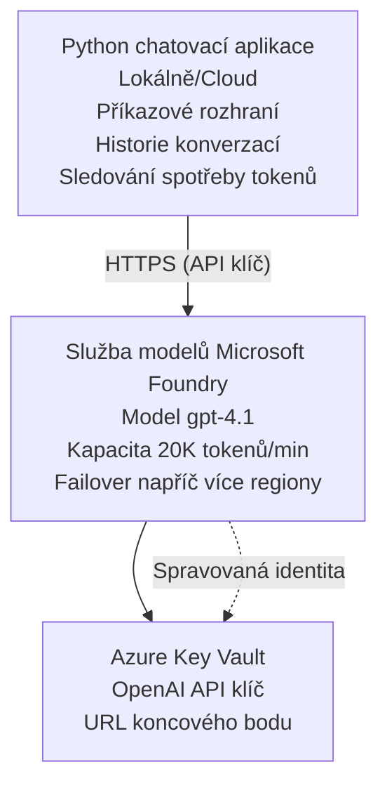

# Microsoft Foundry Models Chatovací aplikace

**Studijní cesta:** Středně pokročilý ⭐⭐ | **Čas:** 35-45 minut | **Cena:** $50-200/měsíc

Kompletní chatovací aplikace Microsoft Foundry Models nasazená pomocí Azure Developer CLI (azd). Tento příklad demonstruje nasazení gpt-4.1, zabezpečený přístup k API a jednoduché chatovací rozhraní.

## 🎯 Co se naučíte

- Nasadit službu Microsoft Foundry Models s modelem gpt-4.1
- Zabezpečit OpenAI API klíče pomocí Key Vaultu
- Vytvořit jednoduché chatovací rozhraní v Pythonu
- Sledovat využití tokenů a náklady
- Implementovat omezení rychlosti a zpracování chyb

## 📦 Co je součástí

✅ **Microsoft Foundry Models Service** - nasazení modelu gpt-4.1  
✅ **Python Chat App** - Jednoduché chatovací rozhraní v příkazovém řádku  
✅ **Key Vault Integration** - Bezpečné ukládání API klíčů  
✅ **ARM Templates** - Kompletní infrastruktura jako kód  
✅ **Cost Monitoring** - Sledování využití tokenů  
✅ **Rate Limiting** - Zabránit vyčerpání kvóty  

## Architektura



## Předpoklady

### Vyžadováno

- **Azure Developer CLI (azd)** - [Návod k instalaci](https://learn.microsoft.com/azure/developer/azure-developer-cli/install-azd)
- **Předplatné Azure** s přístupem k OpenAI - [Požádat o přístup](https://aka.ms/oai/access)
- **Python 3.9+** - [Nainstalujte Python](https://www.python.org/downloads/)

### Ověření předpokladů

```bash
# Zkontrolujte verzi azd (potřebujete 1.5.0 nebo novější)
azd version

# Ověřte přihlášení do Azure
azd auth login

# Zkontrolujte verzi Pythonu
python --version  # nebo python3 --version

# Ověřte přístup k OpenAI (zkontrolujte v Azure portálu)
az cognitiveservices account list-skus \
  --kind OpenAI \
  --location eastus
```

> **⚠️ Důležité:** Microsoft Foundry Models vyžaduje schválení žádosti. Pokud jste nepožádali, navštivte [aka.ms/oai/access](https://aka.ms/oai/access). Schválení obvykle trvá 1-2 pracovní dny.

## ⏱️ Harmonogram nasazení

| Fáze | Doba trvání | Co se děje |
|-------|----------|--------------|
| Kontrola předpokladů | 2-3 minuty | Ověřit dostupnost kvóty OpenAI |
| Nasadit infrastrukturu | 8-12 minut | Vytvořit OpenAI, Key Vault, nasazení modelu |
| Konfigurace aplikace | 2-3 minuty | Nastavit prostředí a závislosti |
| **Celkem** | **12-18 minut** | Připraveno ke konverzaci s gpt-4.1 |

**Poznámka:** První nasazení OpenAI může trvat déle kvůli zprovoznění modelu.

## Rychlý start

```bash
# Přejděte na příklad
cd examples/azure-openai-chat

# Inicializujte prostředí
azd env new myopenai

# Nasaďte vše (infrastruktura + konfigurace)
azd up
# Budete vyzváni k:
# 1. Vyberte předplatné Azure
# 2. Zvolte lokaci s dostupností OpenAI (např. eastus, eastus2, westus)
# 3. Počkejte 12–18 minut na nasazení

# Nainstalujte závislosti Pythonu
pip install -r requirements.txt

# Začněte chatovat!
python chat.py
```

**Očekávaný výstup:**
```
🤖 Microsoft Foundry Models Chat Application
Connected to: gpt-4.1 (eastus)
Type your message (or 'quit' to exit)

You: Hello! Tell me about Microsoft Foundry Models.
Assistant: Microsoft Foundry Models Service provides REST API access to OpenAI's powerful language models including gpt-4.1, GPT-3.5-Turbo, and Embeddings...

[Tokens used: 145 | Estimated cost: $0.0044]
```

## ✅ Ověření nasazení

### Krok 1: Zkontrolujte prostředky Azure

```bash
# Zobrazit nasazené prostředky
azd show

# Očekávaný výstup ukazuje:
# - Služba OpenAI: (název prostředku)
# - Key Vault: (název prostředku)
# - Nasazení: gpt-4.1
# - Umístění: eastus (nebo vámi vybraný region)
```

### Krok 2: Otestujte OpenAI API

```bash
# Získat OpenAI endpoint a klíč
OPENAI_ENDPOINT=$(azd env get-value AZURE_OPENAI_ENDPOINT)
OPENAI_KEY=$(azd env get-value AZURE_OPENAI_API_KEY)

# Otestovat volání API
curl "$OPENAI_ENDPOINT/openai/deployments/gpt-4.1/chat/completions?api-version=2024-08-01-preview" \
  -H "Content-Type: application/json" \
  -H "api-key: $OPENAI_KEY" \
  -d '{
    "messages": [{"role": "user", "content": "Say hello!"}],
    "max_tokens": 50
  }'
```

**Očekávaná odpověď:**
```json
{
  "choices": [
    {
      "message": {
        "role": "assistant",
        "content": "Hello! How can I assist you today?"
      }
    }
  ],
  "usage": {
    "prompt_tokens": 8,
    "completion_tokens": 9,
    "total_tokens": 17
  }
}
```

### Krok 3: Ověřte přístup k Key Vaultu

```bash
# Vypsat tajemství v Key Vaultu
KV_NAME=$(azd env get-value AZURE_KEY_VAULT_NAME)

az keyvault secret list \
  --vault-name $KV_NAME \
  --query "[].name" \
  --output table
```

**Očekávané tajné hodnoty:**
- `openai-api-key`
- `openai-endpoint`

**Kritéria úspěchu:**
- ✅ Služba OpenAI nasazena s gpt-4.1
- ✅ Volání API vrací platné dokončení
- ✅ Tajné hodnoty uloženy v Key Vaultu
- ✅ Sledování využití tokenů funguje

## Struktura projektu

```
azure-openai-chat/
├── README.md                   ✅ This guide
├── azure.yaml                  ✅ AZD configuration
├── infra/                      ✅ Infrastructure as Code
│   ├── main.bicep             ✅ Main Bicep template
│   ├── main.parameters.json   ✅ Parameters
│   └── openai.bicep           ✅ OpenAI resource definition
├── src/                        ✅ Application code
│   ├── chat.py                ✅ Chat interface
│   ├── config.py              ✅ Configuration loader
│   └── requirements.txt       ✅ Python dependencies
└── .gitignore                  ✅ Git ignore rules
```

## Funkce aplikace

### Chatovací rozhraní (`chat.py`)

Chatovací aplikace obsahuje:

- **Historie konverzace** - Zachovává kontext mezi zprávami
- **Počítání tokenů** - Sleduje využití a odhaduje náklady
- **Zpracování chyb** - Elegantní řešení omezení rychlosti a chyb API
- **Odhad nákladů** - Reálný výpočet nákladů za zprávu
- **Podpora streamování** - Volitelné streamované odpovědi

### Příkazy

Během chatu můžete použít:
- `quit` nebo `exit` - Ukončit relaci
- `clear` - Vyčistit historii konverzace
- `tokens` - Zobrazit celkové využití tokenů
- `cost` - Zobrazit odhadované celkové náklady

### Konfigurace (`config.py`)

Načte konfiguraci z proměnných prostředí:
```python
AZURE_OPENAI_ENDPOINT  # Z Key Vaultu
AZURE_OPENAI_API_KEY   # Z Key Vaultu
AZURE_OPENAI_MODEL     # Výchozí: gpt-4.1
AZURE_OPENAI_MAX_TOKENS # Výchozí: 800
```

## Příklady použití

### Základní chat

```bash
python chat.py
```

### Chat s vlastním modelem

```bash
export AZURE_OPENAI_MODEL=gpt-35-turbo
python chat.py
```

### Chat se streamováním

```bash
python chat.py --stream
```

### Ukázková konverzace

```
You: Explain Microsoft Foundry Models Service in 3 sentences.
Assistant: Microsoft Foundry Models Service is Microsoft Azure's cloud platform offering 
that provides access to OpenAI's powerful language models. It enables developers 
to integrate capabilities like gpt-4.1 into their applications with enterprise-grade 
security and compliance. The service includes features for content filtering, 
abuse monitoring, and responsible AI practices.

[Tokens used: 89 | Estimated cost: $0.0027]

You: What models are available?
Assistant: Microsoft Foundry Models Service offers several model families including gpt-4.1 
(most capable), GPT-3.5-Turbo (faster and cost-effective), and Embeddings models 
for vector search. Each model has different capabilities, pricing, and token limits.

[Tokens used: 67 | Estimated cost: $0.0020]

Total session: 156 tokens | $0.0047
```

## Správa nákladů

### Ceny za tokeny (gpt-4.1)

| Model | Vstup (za 1K tokenů) | Výstup (za 1K tokenů) |
|-------|----------------------|------------------------|
| gpt-4.1 | $0.03 | $0.06 |
| GPT-3.5-Turbo | $0.0015 | $0.002 |

### Odhadované měsíční náklady

Na základě vzorců používání:

| Úroveň využití | Zpráv/den | Tokenů/den | Měsíční náklady |
|-------------|--------------|------------|--------------|
| **Nízká** | 20 zpráv | 3,000 tokenů | $3-5 |
| **Střední** | 100 zpráv | 15,000 tokenů | $15-25 |
| **Vysoká** | 500 zpráv | 75,000 tokenů | $75-125 |

**Základní náklady na infrastrukturu:** $1-2/měsíc (Key Vault + minimální výpočetní prostředky)

### Tipy pro optimalizaci nákladů

```bash
# 1. Použijte GPT-3.5-Turbo pro jednodušší úkoly (20× levnější)
export AZURE_OPENAI_MODEL=gpt-35-turbo

# 2. Snižte maximální počet tokenů pro kratší odpovědi
export AZURE_OPENAI_MAX_TOKENS=400

# 3. Sledujte využití tokenů
python chat.py --show-tokens

# 4. Nastavte rozpočtová upozornění
az consumption budget create \
  --budget-name "openai-budget" \
  --amount 50 \
  --time-grain Monthly
```

## Monitorování

### Zobrazit využití tokenů

```bash
# V Azure portálu:
# OpenAI Resource → Metrics → Vyberte "Token Transaction"

# Nebo přes Azure CLI:
az monitor metrics list \
  --resource $(azd env get-value AZURE_OPENAI_RESOURCE_ID) \
  --metric "TokenTransaction" \
  --start-time $(date -u -d '1 hour ago' '+%Y-%m-%dT%H:%M:%S') \
  --interval PT1M
```

### Zobrazit logy API

```bash
# Přenos diagnostických protokolů
az monitor diagnostic-settings create \
  --resource $(azd env get-value AZURE_OPENAI_RESOURCE_ID) \
  --name openai-logs \
  --logs '[{"category": "Audit", "enabled": true}]' \
  --workspace $(azd env get-value LOG_ANALYTICS_WORKSPACE_ID)

# Protokoly dotazů
az monitor log-analytics query \
  --workspace $(azd env get-value LOG_ANALYTICS_WORKSPACE_ID) \
  --analytics-query "AzureDiagnostics | where Category == 'Audit' | top 10 by TimeGenerated"
```

## Řešení problémů

### Problém: Chyba "Access Denied"

**Příznaky:** 403 Forbidden při volání API

**Řešení:**
```bash
# 1. Ověřte, že přístup k OpenAI je schválen
az cognitiveservices account show \
  --name $(azd env get-value AZURE_OPENAI_NAME) \
  --resource-group $(azd env get-value AZURE_RESOURCE_GROUP)

# 2. Zkontrolujte, zda je API klíč správný
azd env get-value AZURE_OPENAI_API_KEY

# 3. Ověřte formát URL koncového bodu
azd env get-value AZURE_OPENAI_ENDPOINT
# Mělo by být: https://[name].openai.azure.com/
```

### Problém: "Rate Limit Exceeded"

**Příznaky:** 429 Too Many Requests

**Řešení:**
```bash
# 1. Zkontrolujte aktuální kvótu
az cognitiveservices account deployment show \
  --name $(azd env get-value AZURE_OPENAI_NAME) \
  --resource-group $(azd env get-value AZURE_RESOURCE_GROUP) \
  --deployment-name gpt-4.1

# 2. Požádejte o navýšení kvóty (pokud je to potřeba)
# Přejděte do Azure Portal → OpenAI Resource → Quotas → Request Increase

# 3. Implementujte logiku opakovaných pokusů (již v chat.py)
# Aplikace automaticky opakuje pokusy s exponenciálním zpožděním
```

### Problém: "Model Not Found"

**Příznaky:** 404 chyba při nasazení

**Řešení:**
```bash
# 1. Vypište dostupná nasazení
az cognitiveservices account deployment list \
  --name $(azd env get-value AZURE_OPENAI_NAME) \
  --resource-group $(azd env get-value AZURE_RESOURCE_GROUP)

# 2. Ověřte název modelu v prostředí
echo $AZURE_OPENAI_MODEL

# 3. Aktualizujte na správný název nasazení
export AZURE_OPENAI_MODEL=gpt-4.1  # nebo gpt-35-turbo
```

### Problém: Vysoká latence

**Příznaky:** Pomalé časy odezvy (>5 sekund)

**Řešení:**
```bash
# 1. Zkontrolujte regionální latenci
# Nasadit do regionu nejblíže uživatelům

# 2. Snižte max_tokens pro rychlejší odpovědi
export AZURE_OPENAI_MAX_TOKENS=400

# 3. Použijte streamování pro lepší uživatelský zážitek
python chat.py --stream
```

## Nejlepší bezpečnostní postupy

### 1. Chraňte API klíče

```bash
# Nikdy neukládejte klíče do systému správy zdrojového kódu
# Použijte Key Vault (již nakonfigurováno)

# Pravidelně obměňujte klíče
az cognitiveservices account keys regenerate \
  --name $(azd env get-value AZURE_OPENAI_NAME) \
  --resource-group $(azd env get-value AZURE_RESOURCE_GROUP) \
  --key-name key1
```

### 2. Implementujte filtrování obsahu

```python
# Microsoft Foundry Models obsahuje vestavěné filtrování obsahu
# Nastavte v Azure portálu:
# OpenAI prostředek → Filtry obsahu → Vytvořit vlastní filtr

# Kategorie: Nenávist, Sexuální, Násilí, Sebepoškozování
# Úrovně: Nízké, Střední, Vysoké filtrování
```

### 3. Používejte spravovanou identitu (v produkci)

```bash
# Pro produkční nasazení používejte spravovanou identitu
# místo API klíčů (vyžaduje hostování aplikace na Azure)

# Aktualizujte infra/openai.bicep tak, aby obsahoval:
# identity: { type: 'SystemAssigned' }
```

## Vývoj

### Spustit lokálně

```bash
# Nainstalujte závislosti
pip install -r src/requirements.txt

# Nastavte proměnné prostředí
export AZURE_OPENAI_ENDPOINT="https://[name].openai.azure.com/"
export AZURE_OPENAI_API_KEY="your-api-key"
export AZURE_OPENAI_MODEL="gpt-4.1"

# Spusťte aplikaci
python src/chat.py
```

### Spustit testy

```bash
# Nainstalovat závislosti pro testy
pip install pytest pytest-cov

# Spustit testy
pytest tests/ -v

# S pokrytím kódu
pytest tests/ --cov=src --cov-report=html
```

### Aktualizovat nasazení modelu

```bash
# Nasadit jinou verzi modelu
az cognitiveservices account deployment create \
  --name $(azd env get-value AZURE_OPENAI_NAME) \
  --resource-group $(azd env get-value AZURE_RESOURCE_GROUP) \
  --deployment-name gpt-35-turbo \
  --model-name gpt-35-turbo \
  --model-version "0613" \
  --model-format OpenAI \
  --sku-capacity 20 \
  --sku-name "Standard"
```

## Úklid

```bash
# Odstranit všechny prostředky Azure
azd down --force --purge

# To odstraní:
# - Služba OpenAI
# - Key Vault (s 90denním měkkým smazáním)
# - Skupina prostředků
# - Všechny nasazení a konfigurace
```

## Další kroky

### Rozšiřte tento příklad

1. **Přidat webové rozhraní** - Vytvořit frontend v React/Vue
   ```bash
   # Přidat frontend službu do azure.yaml
   # Nasadit do Azure Static Web Apps
   ```

2. **Implementovat RAG** - Přidat vyhledávání dokumentů s Azure AI Search
   ```python
   # Integrovat Azure AI Search
   # Nahrát dokumenty a vytvořit vektorový index
   ```

3. **Přidat volání funkcí** - Umožnit použití nástrojů
   ```python
   # Definujte funkce v chat.py
   # Umožněte gpt-4.1 volat externí API
   ```

4. **Podpora více modelů** - Nasadit více modelů
   ```bash
   # Přidat modely gpt-35-turbo a embeddings
   # Implementovat logiku směrování modelů
   ```

### Související příklady

- **[Retail Multi-Agent](../retail-scenario.md)** - Pokročilá architektura více agentů
- **[Databázová aplikace](../../../../examples/database-app)** - Přidat trvalé úložiště
- **[Container Apps](../../../../examples/container-app)** - Nasadit jako kontejnerovou službu

### Vzdělávací zdroje

- 📚 [AZD pro začátečníky](../../README.md) - Hlavní stránka kurzu
- 📚 [Dokumentace Microsoft Foundry Models](https://learn.microsoft.com/azure/ai-services/openai/) - Oficiální dokumentace
- 📚 [Reference OpenAI API](https://platform.openai.com/docs/api-reference) - Podrobnosti API
- 📚 [Odpovědná AI](https://www.microsoft.com/ai/responsible-ai) - Doporučené postupy

## Další zdroje

### Dokumentace
- **[Microsoft Foundry Models Service](https://learn.microsoft.com/azure/ai-services/openai/)** - Kompletní průvodce
- **[gpt-4.1 Models](https://learn.microsoft.com/azure/ai-services/openai/concepts/models)** - Schopnosti modelu
- **[Filtrování obsahu](https://learn.microsoft.com/azure/ai-services/openai/concepts/content-filter)** - Bezpečnostní funkce
- **[Azure Developer CLI](https://learn.microsoft.com/azure/developer/azure-developer-cli/)** - Reference azd

### Tutoriály
- **[OpenAI Quickstart](https://learn.microsoft.com/azure/ai-services/openai/quickstart)** - První nasazení
- **[Chat Completions](https://learn.microsoft.com/azure/ai-services/openai/how-to/chatgpt)** - Vytváření chatovacích aplikací
- **[Function Calling](https://learn.microsoft.com/azure/ai-services/openai/how-to/function-calling)** - Pokročilé funkce

### Nástroje
- **[Microsoft Foundry Models Studio](https://oai.azure.com/)** - Webové prostředí pro testování
- **[Příručka pro návrh promptů](https://platform.openai.com/docs/guides/prompt-engineering)** - Jak psát lepší prompty
- **[Kalkulátor tokenů](https://platform.openai.com/tokenizer)** - Odhad využití tokenů

### Komunita
- **[Azure AI Discord](https://discord.gg/azure)** - Získejte pomoc od komunity
- **[GitHub Discussions](https://github.com/Azure-Samples/openai/discussions)** - Fórum otázek a odpovědí
- **[Azure Blog](https://azure.microsoft.com/blog/tag/azure-openai-service/)** - Nejnovější aktualizace

---

**🎉 Úspěch!** Nasadili jste Microsoft Foundry Models a vytvořili funkční chatovací aplikaci. Začněte zkoumat schopnosti gpt-4.1 a experimentujte s různými promptami a případy použití.

**Máte dotazy?** [Otevřít issue](https://github.com/microsoft/AZD-for-beginners/issues) nebo si přečtěte [Často kladené otázky](../../resources/faq.md)

**Upozornění na náklady:** Nezapomeňte spustit `azd down` po dokončení testování, abyste se vyhnuli průběžným poplatkům (~$50-100/měsíc za aktivní používání).

---

<!-- CO-OP TRANSLATOR DISCLAIMER START -->
**Prohlášení o omezení odpovědnosti**:
Tento dokument byl přeložen pomocí AI překladatelské služby [Co-op Translator](https://github.com/Azure/co-op-translator). Přestože usilujeme o co největší přesnost, mějte prosím na paměti, že automatizované překlady mohou obsahovat chyby nebo nepřesnosti. Originální dokument v jeho mateřském jazyce by měl být považován za autoritativní zdroj. Pro kritické informace se doporučuje profesionální lidský překlad. Nejsme odpovědní za jakékoli nedorozumění nebo nesprávné interpretace vzniklé použitím tohoto překladu.
<!-- CO-OP TRANSLATOR DISCLAIMER END -->