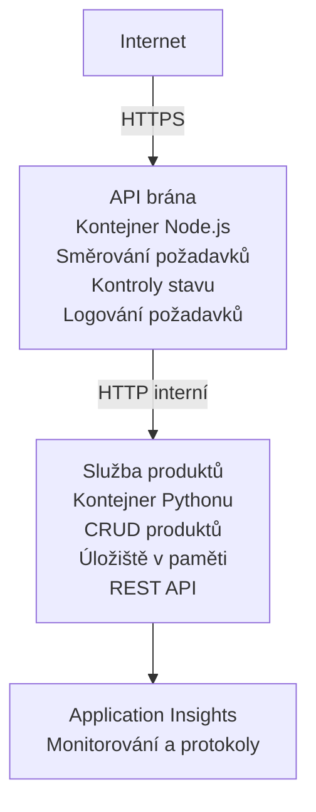

# Architektura mikroslužeb - Příklad Container App

⏱️ **Odhadovaný čas**: 25-35 minut | 💰 **Odhadované náklady**: ~$50-100/month | ⭐ **Složitost**: Pokročilá

Jednoduchá, ale funkční architektura mikroslužeb nasazená do Azure Container Apps pomocí AZD CLI. Tento příklad demonstruje komunikaci mezi službami, orchestraci kontejnerů a monitorování na praktickém nastavení se 2 službami.

> **📚 Přístup k učení**: Tento příklad začíná s minimální architekturou se 2 službami (API Gateway + Backend Service), kterou si můžete skutečně nasadit a z ní se učit. Po osvojení tohoto základu poskytujeme pokyny pro rozšíření do plnohodnotného ekosystému mikroslužeb.

## Co se naučíte

Po dokončení tohoto příkladu:
- Nasadíte více kontejnerů do Azure Container Apps
- Implementujete komunikaci mezi službami pomocí interní sítě
- Nakonfigurujete škálování na základě prostředí a kontroly stavu
- Monitorujete distribuované aplikace pomocí Application Insights
- Pochopíte vzory nasazení mikroslužeb a doporučené postupy
- Naučíte se postupné rozšiřování od jednoduchých k složitějším architekturám

## Architektura

### Fáze 1: Co stavíme (součást tohoto příkladu)


**Proč začít jednoduše?**
- ✅ Rychlé nasazení a pochopení (25-35 minut)
- ✅ Naučíte se základní vzory mikroslužeb bez složitosti
- ✅ Funkční kód, který můžete upravovat a experimentovat s ním
- ✅ Nižší náklady na učení (~$50-100/month vs $300-1400/month)
- ✅ Získáte jistotu před přidáním databází a front zpráv

**Analogie**: Představte si to jako učení se řídit. Začnete na prázdném parkovišti (2 služby), osvojíte si základy a pak přejdete do městského provozu (5+ služeb s databázemi).

### Fáze 2: Budoucí rozšíření (referenční architektura)

Po zvládnutí architektury se 2 službami můžete rozšířit na:

```
Full Architecture (Not Included - For Reference)
├── API Gateway (✅ Included)
├── Product Service (✅ Included)
├── Order Service (🔜 Add next)
├── User Service (🔜 Add next)
├── Notification Service (🔜 Add last)
├── Azure Service Bus (🔜 For async communication)
├── Cosmos DB (🔜 For product persistence)
├── Azure SQL (🔜 For order management)
└── Azure Storage (🔜 For file storage)
```

Viz sekce "Expansion Guide" na konci pro krok za krokem instrukce.

## Zahrnuté funkce

✅ **Objevování služeb**: Automatické objevování přes DNS mezi kontejnery  
✅ **Vyrovnávání zátěže**: Vestavěné vyrovnávání zátěže mezi replikami  
✅ **Automatické škálování**: Nezávislé škálování pro každou službu na základě HTTP požadavků  
✅ **Monitorování stavu**: Liveness a readiness kontroly pro obě služby  
✅ **Distribuované logování**: Centralizované logování pomocí Application Insights  
✅ **Interní síťování**: Bezpečná komunikace mezi službami  
✅ **Orchestrace kontejnerů**: Automatické nasazení a škálování  
✅ **Aktualizace bez výpadku**: Postupné aktualizace s řízením revizí  

## Předpoklady

### Požadované nástroje

Než začnete, ověřte, že máte nainstalované tyto nástroje:

1. **[Azure Developer CLI (azd)](https://learn.microsoft.com/azure/developer/azure-developer-cli/install-azd)** (verze 1.0.0 nebo novější)
   ```bash
   azd version
   # Očekávaný výstup: azd verze 1.0.0 nebo vyšší
   ```

2. **[Azure CLI](https://learn.microsoft.com/cli/azure/install-azure-cli)** (verze 2.50.0 nebo novější)
   ```bash
   az --version
   # Očekávaný výstup: azure-cli 2.50.0 nebo vyšší
   ```

3. **[Docker](https://www.docker.com/get-started)** (pro lokální vývoj/testování - nepovinné)
   ```bash
   docker --version
   # Očekávaný výstup: Docker verze 20.10 nebo vyšší
   ```

### Požadavky Azure

- Aktivní **Azure předplatné** ([vytvořte si bezplatný účet](https://azure.microsoft.com/free/))
- Oprávnění k vytváření prostředků ve vašem předplatném
- Role **Contributor** na předplatném nebo skupině prostředků

### Požadované znalosti

Toto je příklad na **pokročilé úrovni**. Měli byste mít:
- Dokončený [Jednoduchý příklad Flask API](../../../../../examples/container-app/simple-flask-api) 
- Základní porozumění architektuře mikroslužeb
- Znalost REST API a HTTP
- Pochopení konceptů kontejnerů

**Nováček v Container Apps?** Začněte nejprve s [Jednoduchý příklad Flask API](../../../../../examples/container-app/simple-flask-api), abyste se naučili základy.

## Rychlý start (krok za krokem)

### Krok 1: Klonovat a přejít do adresáře

```bash
git clone https://github.com/microsoft/AZD-for-beginners.git
cd AZD-for-beginners/examples/container-app/microservices
```

**✓ Kontrola úspěchu**: Ověřte, že vidíte `azure.yaml`:
```bash
ls
# Očekává se: README.md, azure.yaml, infra/, src/
```

### Krok 2: Autentizace v Azure

```bash
azd auth login
```

Toto otevře váš prohlížeč pro přihlášení do Azure. Přihlaste se pomocí svých Azure přihlašovacích údajů.

**✓ Kontrola úspěchu**: Měli byste vidět:
```
Logged in to Azure.
```

### Krok 3: Inicializace prostředí

```bash
azd init
```

**Výzvy, které uvidíte**:
- **Název prostředí**: Zadejte krátký název (např. `microservices-dev`)
- **Azure předplatné**: Vyberte své předplatné
- **Umístění Azure**: Vyberte region (např. `eastus`, `westeurope`)

**✓ Kontrola úspěchu**: Měli byste vidět:
```
SUCCESS: New project initialized!
```

### Krok 4: Nasazení infrastruktury a služeb

```bash
azd up
```

**Co se stane** (trvá 8-12 minut):
1. Vytvoří prostředí Container Apps
2. Vytvoří Application Insights pro monitorování
3. Sestaví kontejner API Gateway (Node.js)
4. Sestaví kontejner Product Service (Python)
5. Nasadí oba kontejnery do Azure
6. Nakonfiguruje síťování a kontroly stavu
7. Nastaví monitorování a logování

**✓ Kontrola úspěchu**: Měli byste vidět:
```
SUCCESS: Your application was deployed to Azure in X minutes Y seconds.
Endpoint: https://api-gateway-<unique-id>.azurecontainerapps.io
```

**⏱️ Čas**: 8-12 minut

### Krok 5: Otestujte nasazení

```bash
# Získejte koncový bod brány API
GATEWAY_URL=$(azd env get-values | grep API_GATEWAY_URL | cut -d '=' -f2 | tr -d '"')

# Otestujte zdraví brány API
curl $GATEWAY_URL/health

# Očekávaný výstup:
# {"status":"zdravý","service":"api-brána","timestamp":"2025-11-19T10:30:00Z"}
```

**Otestujte produktovou službu přes API Gateway**:
```bash
# Seznam produktů
curl $GATEWAY_URL/api/products

# Očekávaný výstup:
# [
#   {"id":1,"name":"Notebook","price":999.99,"stock":50},
#   {"id":2,"name":"Myš","price":29.99,"stock":200},
#   {"id":3,"name":"Klávesnice","price":79.99,"stock":150}
# ]
```

**✓ Kontrola úspěchu**: Obě koncové body vrací JSON data bez chyb.

---

**🎉 Gratulujeme!** Nasadili jste architekturu mikroslužeb do Azure!

## Struktura projektu

Všechny implementační soubory jsou zahrnuty—jedná se o kompletní, funkční příklad:

```
microservices/
│
├── README.md                         # This file
├── azure.yaml                        # AZD configuration
├── .gitignore                        # Git ignore patterns
│
├── infra/                           # Infrastructure as Code (Bicep)
│   ├── main.bicep                   # Main orchestration
│   ├── abbreviations.json           # Naming conventions
│   ├── core/                        # Shared infrastructure
│   │   ├── container-apps-environment.bicep  # Container environment + registry
│   │   └── monitor.bicep            # Application Insights + Log Analytics
│   └── app/                         # Service definitions
│       ├── api-gateway.bicep        # API Gateway container app
│       └── product-service.bicep    # Product Service container app
│
└── src/                             # Application source code
    ├── api-gateway/                 # Node.js API Gateway
    │   ├── app.js                   # Express server with routing
    │   ├── package.json             # Node dependencies
    │   └── Dockerfile               # Container definition
    └── product-service/             # Python Product Service
        ├── main.py                  # Flask API with product data
        ├── requirements.txt         # Python dependencies
        └── Dockerfile               # Container definition
```

**Co každý komponent dělá:**

**Infrastruktura (infra/)**:
- `main.bicep`: Orchestrace všech Azure prostředků a jejich závislostí
- `core/container-apps-environment.bicep`: Vytvoří prostředí Container Apps a Azure Container Registry
- `core/monitor.bicep`: Nastaví Application Insights pro distribuované logování
- `app/*.bicep`: Individuální definice container apps s nastavením škálování a kontrolami stavu

**API Gateway (src/api-gateway/)**:
- Veřejně přístupná služba, která směruje požadavky na backend služby
- Implementuje logování, zpracování chyb a přesměrování požadavků
- Demonstruje HTTP komunikaci mezi službami

**Product Service (src/product-service/)**:
- Interní služba s katalogem produktů (v paměti pro jednoduchost)
- REST API s kontrolami stavu
- Příklad vzoru backend mikroslužby

## Přehled služeb

### API Gateway (Node.js/Express)

**Port**: 8080  
**Přístup**: Veřejný (externí ingress)  
**Účel**: Směruje příchozí požadavky na příslušné backend služby  

**Koncové body**:
- `GET /` - Informace o službě
- `GET /health` - Kontrola stavu
- `GET /api/products` - Přepošle na Product Service (vypsat vše)
- `GET /api/products/:id` - Přepošle na Product Service (získat podle ID)

**Klíčové vlastnosti**:
- Směrování požadavků pomocí axios
- Centralizované logování
- Zpracování chyb a řízení timeoutů
- Objevování služeb přes proměnné prostředí
- Integrace s Application Insights

**Ukázka kódu** (`src/api-gateway/app.js`):
```javascript
// Interní komunikace služby
app.get('/api/products', async (req, res) => {
  const response = await axios.get(`${PRODUCT_SERVICE_URL}/products`);
  res.json(response.data);
});
```

### Product Service (Python/Flask)

**Port**: 8000  
**Přístup**: Pouze interní (žádný externí ingress)  
**Účel**: Spravuje katalog produktů s daty v paměti  

**Koncové body**:
- `GET /` - Informace o službě
- `GET /health` - Kontrola stavu
- `GET /products` - Vypsat všechny produkty
- `GET /products/<id>` - Získat produkt podle ID

**Klíčové vlastnosti**:
- RESTful API s Flask
- Úložiště produktů v paměti (jednoduché, není potřeba databáze)
- Monitorování zdravotního stavu pomocí liveness a readiness kontrol
- Strukturované logování
- Integrace s Application Insights

**Datový model**:
```python
{
  "id": 1,
  "name": "Laptop",
  "description": "High-performance laptop",
  "price": 999.99,
  "stock": 50
}
```

**Proč pouze interní?**
Produktová služba není veřejně přístupná. Všechny požadavky musí projít přes API Gateway, která poskytuje:
- Bezpečnost: Řízený přístupový bod
- Flexibilita: Backend lze měnit, aniž by to ovlivnilo klienty
- Monitorování: Centralizované logování požadavků

## Pochopení komunikace mezi službami

### Jak si služby vzájemně komunikují

V tomto příkladu API Gateway komunikuje s Product Service pomocí **interních HTTP volání**:

```javascript
// API brána (src/api-gateway/app.js)
const PRODUCT_SERVICE_URL = process.env.PRODUCT_SERVICE_URL;

// Proveď interní HTTP požadavek
const response = await axios.get(`${PRODUCT_SERVICE_URL}/products`);
```

**Klíčové body**:

1. **Objevování založené na DNS**: Container Apps automaticky poskytuje DNS pro interní služby
   - FQDN služby Product Service: `product-service.internal.<environment>.azurecontainerapps.io`
   - Zjednodušeně jako: `http://product-service` (Container Apps to vyřeší)

2. **Žádné veřejné vystavení**: Product Service má v Bicep `external: false`
   - Přístupná pouze v rámci prostředí Container Apps
   - Nedostupná z internetu

3. **Proměnné prostředí**: URL služeb jsou vkládány při nasazení
   - Bicep předává interní FQDN do brány
   - Žádné pevně zadané URL v kódu aplikace

**Analogie**: Představte si to jako kancelářské místnosti. API Gateway je recepce (veřejně přístupná) a Product Service je kancelář (pouze interní). Návštěvníci musí projít recepcí, aby se dostali do jakékoli kanceláře.

## Možnosti nasazení

### Plné nasazení (doporučeno)

```bash
# Nasadit infrastrukturu a obě služby
azd up
```

To nasadí:
1. Prostředí Container Apps
2. Application Insights
3. Container Registry
4. Kontejner API Gateway
5. Kontejner Product Service

**Čas**: 8-12 minut

### Nasadit jednotlivou službu

```bash
# Nasadit pouze jednu službu (po počátečním azd up)
azd deploy api-gateway

# Nebo nasadit službu product
azd deploy product-service
```

**Použití**: Když jste aktualizovali kód v jedné službě a chcete znovu nasadit pouze tu službu.

### Aktualizovat konfiguraci

```bash
# Změnit parametry škálování
azd env set GATEWAY_MAX_REPLICAS 30

# Znovu nasadit s novou konfigurací
azd up
```

## Konfigurace

### Konfigurace škálování

Obě služby jsou v jejich Bicep souborech nakonfigurovány s automatickým škálováním založeným na HTTP:

**API Gateway**:
- Min replik: 2 (vždy alespoň 2 pro dostupnost)
- Max replik: 20
- Spouštěč škálování: 50 souběžných požadavků na repliku

**Product Service**:
- Min replik: 1 (může se podle potřeby škálovat na nulu)
- Max replik: 10
- Spouštěč škálování: 100 souběžných požadavků na repliku

**Přizpůsobit škálování** (v `infra/app/*.bicep`):
```bicep
scale: {
  minReplicas: 1
  maxReplicas: 10
  rules: [
    {
      name: 'http-scale-rule'
      http: {
        metadata: {
          concurrentRequests: '100'  // Adjust this
        }
      }
    }
  ]
}
```

### Přiřazení zdrojů

**API Gateway**:
- CPU: 1.0 vCPU
- Paměť: 2 GiB
- Důvod: Zpracovává veškerý externí provoz

**Product Service**:
- CPU: 0.5 vCPU
- Paměť: 1 GiB
- Důvod: Lehká operace v paměti

### Kontroly stavu

Obě služby zahrnují liveness a readiness kontroly:

```bicep
probes: [
  {
    type: 'Liveness'
    httpGet: {
      path: '/health'
      port: 8080
    }
    initialDelaySeconds: 10
    periodSeconds: 30
  }
  {
    type: 'Readiness'
    httpGet: {
      path: '/health'
      port: 8080
    }
    initialDelaySeconds: 5
    periodSeconds: 10
  }
]
```

**Co to znamená**:
- **Liveness**: Pokud kontrola stavu selže, Container Apps restartuje kontejner
- **Readiness**: Pokud není připravená, Container Apps přestane směrovat provoz na tuto repliku


## Monitorování a pozorovatelnost

### Zobrazit logy služby

```bash
# Zobrazte protokoly pomocí azd monitor
azd monitor --logs

# Nebo použijte Azure CLI pro konkrétní Container Apps:
# Streamujte protokoly z API Gateway
az containerapp logs show --name api-gateway --resource-group $RG_NAME --follow

# Zobrazte nedávné protokoly služby produktu
az containerapp logs show --name product-service --resource-group $RG_NAME --tail 100
```

**Očekávaný výstup**:
```
[api-gateway] API Gateway listening on port 8080
[api-gateway] Product Service URL: http://product-service
[api-gateway] GET /api/products 200 - 45ms
[product-service] Retrieved 5 products
```

### Dotazy v Application Insights

Otevřete Application Insights v Azure Portal a poté spusťte tyto dotazy:

**Najít pomalé požadavky**:
```kusto
requests
| where timestamp > ago(1h)
| where duration > 1000  // Requests taking >1 second
| summarize count() by name, cloud_RoleName
| order by count_ desc
```

**Sledovat volání mezi službami**:
```kusto
dependencies
| where timestamp > ago(1h)
| where type == "Http"
| project timestamp, name, target, duration, success
| order by timestamp desc
```

**Míra chyb podle služby**:
```kusto
exceptions
| where timestamp > ago(24h)
| summarize errorCount = count() by cloud_RoleName, type
| order by errorCount desc
```

**Objem požadavků v čase**:
```kusto
requests
| where timestamp > ago(1h)
| summarize requestCount = count() by bin(timestamp, 5m), cloud_RoleName
| render timechart
```

### Přístup k monitorovacímu panelu

```bash
# Získat podrobnosti o Application Insights
azd env get-values | grep APPLICATIONINSIGHTS

# Otevřít monitorování v portálu Azure
az monitor app-insights component show \
  --app $(azd env get-values | grep APPLICATIONINSIGHTS_CONNECTION_STRING | cut -d '=' -f2) \
  --resource-group $(azd env get-values | grep AZURE_RESOURCE_GROUP | cut -d '=' -f2) \
  --query "appId" -o tsv
```

### Živé metriky

1. Přejděte do Application Insights v Azure Portal
2. Klikněte na "Live Metrics"
3. Zobrazí se požadavky v reálném čase, selhání a výkon
4. Otestujte spuštěním: `curl $(azd env get-values | grep API_GATEWAY_URL | cut -d '=' -f2 | tr -d '"')/api/products`

## Praktická cvičení

[Poznámka: Podívejte se na kompletní cvičení výše v sekci „Praktická cvičení“ pro podrobné kroky včetně ověření nasazení, úpravy dat, testů autoskalování, zpracování chyb a přidání třetí služby.]

## Analýza nákladů

### Odhadované měsíční náklady (pro tento příklad se 2 službami)

| Resource | Configuration | Estimated Cost |
|----------|--------------|----------------|
| API Gateway | 2-20 replik, 1 vCPU, 2GB RAM | $30-150 |
| Product Service | 1-10 replik, 0.5 vCPU, 1GB RAM | $15-75 |
| Container Registry | Basic tier | $5 |
| Application Insights | 1-2 GB/month | $5-10 |
| Log Analytics | 1 GB/month | $3 |
| **Celkem** | | **$58-243/měsíc** |

Rozpis nákladů podle využití:
- **Nízký provoz** (testování/učení): ~$60/měsíc
- **Střední provoz** (malá produkce): ~$120/měsíc
- **Vysoký provoz** (vytížená období): ~$240/měsíc

### Tipy pro optimalizaci nákladů

1. **Škálovat na nulu pro vývoj**:
   ```bicep
   scale: {
     minReplicas: 0  // Save $30-40/month when not in use
     maxReplicas: 10
   }
   ```

2. **Použijte Consumption plán pro Cosmos DB** (až jej přidáte):
   - Platíte jen za to, co používáte
   - Žádný minimální poplatek

3. **Nastavte sampling v Application Insights**:
   ```javascript
   appInsights.defaultClient.config.samplingPercentage = 50; // Vzorkovat 50 % požadavků
   ```

4. **Uklidit, když není potřeba**:
   ```bash
   azd down
   ```

### Možnosti bezplatné úrovně

Pro učení/testování zvažte:
- Použijte bezplatné kredity Azure (prvních 30 dní)
- Držte počet replik na minimu
- Smažte po testování (žádné průběžné poplatky)

---

## Vyčištění

Aby se předešlo průběžným poplatkům, smažte všechny prostředky:

```bash
azd down --force --purge
```

**Potvrzovací výzva**:
```
? Total resources to delete: 6, are you sure you want to continue? (y/N)
```

Zadejte `y` pro potvrzení.

**Co bude smazáno**:
- Container Apps Environment
- Obě Container Apps (gateway & product service)
- Container Registry
- Application Insights
- Log Analytics Workspace
- Resource Group

**✓ Ověřit vyčištění**:
```bash
az group list --query "[?starts_with(name,'rg-microservices')]" --output table
```

Mělo by vrátit prázdné výsledky.

---

## Průvodce rozšířením: z 2 na 5+ služeb

Jakmile zvládnete tuto architekturu se dvěma službami, zde je postup rozšíření:

### Fáze 1: Přidat perzistenci databáze (další krok)

**Přidat Cosmos DB pro produktovou službu**:

1. Create `infra/core/cosmos.bicep`:
   ```bicep
   resource cosmosAccount 'Microsoft.DocumentDB/databaseAccounts@2023-04-15' = {
     name: name
     location: location
     kind: 'GlobalDocumentDB'
     properties: {
       databaseAccountOfferType: 'Standard'
       locations: [{ locationName: location, failoverPriority: 0 }]
     }
   }
   ```

2. Aktualizujte produktovou službu tak, aby používala Cosmos DB místo dat v paměti

3. Odhadované dodatečné náklady: ~$25/měsíc (serverless)

### Fáze 2: Přidat třetí službu (správa objednávek)

**Vytvoření služby objednávek**:

1. Nová složka: `src/order-service/` (Python/Node.js/C#)
2. Nový Bicep: `infra/app/order-service.bicep`
3. Aktualizujte API Gateway tak, aby směroval na `/api/orders`
4. Přidejte Azure SQL Database pro perzistenci objednávek

**Architektura bude**:
```
API Gateway → Product Service (Cosmos DB)
           → Order Service (Azure SQL)
```

### Fáze 3: Přidat asynchronní komunikaci (Service Bus)

**Implementujte architekturu řízenou událostmi**:

1. Přidejte Azure Service Bus: `infra/core/servicebus.bicep`
2. Produktová služba publikuje "ProductCreated" události
3. Služba objednávek odebírá události produktů
4. Přidejte notifikační službu pro zpracování událostí

**Vzor**: Požadavek/Odpověď (HTTP) + Řízeno událostmi (Service Bus)

### Fáze 4: Přidat autentizaci uživatelů

**Implementace uživatelské služby**:

1. Vytvořte `src/user-service/` (Go/Node.js)
2. Přidejte Azure AD B2C nebo vlastní JWT autentizaci
3. API Gateway validuje tokeny
4. Služby kontrolují oprávnění uživatele

### Fáze 5: Příprava na provoz

**Přidejte tyto komponenty**:
- Azure Front Door (globální vyrovnávání zátěže)
- Azure Key Vault (správa tajemství)
- Azure Monitor Workbooks (vlastní panely)
- CI/CD pipeline (GitHub Actions)
- Blue-green nasazení
- Spravovaná identita pro všechny služby

**Celkové náklady produkční architektury**: ~$300-1,400/měsíc

---

## Další informace

### Související dokumentace
- [Dokumentace Azure Container Apps](https://learn.microsoft.com/azure/container-apps/)
- [Průvodce architekturou mikroservis](https://learn.microsoft.com/azure/architecture/guide/architecture-styles/microservices)
- [Application Insights pro distribuované trasování](https://learn.microsoft.com/azure/azure-monitor/app/distributed-tracing)
- [Dokumentace Azure Developer CLI](https://learn.microsoft.com/azure/developer/azure-developer-cli/)

### Další kroky v tomto kurzu
- ← Předchozí: [Simple Flask API](../../../../../examples/container-app/simple-flask-api) - Začátečnický příklad s jedním kontejnerem
- → Další: [Průvodce integrací AI](../../../../../examples/docs/ai-foundry) - Přidat funkce AI
- 🏠 [Domov kurzu](../../README.md)

### Srovnání: Kdy co použít

**Aplikace v jednom kontejneru** (příklad Simple Flask API):
- ✅ Jednoduché aplikace
- ✅ Monolitická architektura
- ✅ Rychlé nasazení
- ❌ Omezená škálovatelnost
- **Cena**: ~$15-50/měsíc

**Mikroservisy** (tento příklad):
- ✅ Složitější aplikace
- ✅ Nezávislé škálování pro službu
- ✅ Autonomie týmů (různé služby, různé týmy)
- ❌ Složitější správa
- **Cena**: ~$60-250/měsíc

**Kubernetes (AKS)**:
- ✅ Maximální kontrola a flexibilita
- ✅ Přenositelnost mezi cloudy
- ✅ Pokročilé síťování
- ❌ Vyžaduje znalosti Kubernetes
- **Cena**: ~$150-500/měsíc minimálně

**Doporučení**: Začněte s Container Apps (tento příklad), přejděte na AKS jen pokud potřebujete funkce specifické pro Kubernetes.

---

## Často kladené otázky

**Q: Proč jen 2 služby místo 5+?**  
A: Vzdělávací postup. Ovládněte základy (komunikace služeb, monitorování, škálování) na jednoduchém příkladu před přidáním složitosti. Vzory, které se zde naučíte, platí i pro architektury se stovkou služeb.

**Q: Můžu si přidat více služeb sám?**  
A: Určitě! Řiďte se průvodcem rozšířením výše. Každá nová služba dodržuje stejný vzor: vytvořte složku src, vytvořte Bicep soubor, aktualizujte azure.yaml, nasadíte.

**Q: Je to připravené pro produkci?**  
A: Je to pevný základ. Pro produkci přidejte: spravovanou identitu, Key Vault, trvalé databáze, CI/CD pipeline, monitorovací upozornění a strategii zálohování.

**Q: Proč nepoužít Dapr nebo jiný service mesh?**  
A: Pro učení zachovejte jednoduchost. Jakmile pochopíte nativní síťování Container Apps, můžete pro pokročilé scénáře přidat Dapr.

**Q: Jak ladím lokálně?**  
A: Spusťte služby lokálně pomocí Dockeru:
```bash
cd src/api-gateway
docker build -t local-gateway .
docker run -p 8080:8080 -e PRODUCT_SERVICE_URL=http://localhost:8000 local-gateway
```

**Q: Můžu použít různé programovací jazyky?**  
A: Ano! Tento příklad ukazuje Node.js (gateway) + Python (produktová služba). Můžete kombinovat jakékoliv jazyky, které běží v kontejnerech.

**Q: Co když nemám kredity Azure?**  
A: Využijte bezplatný tarif Azure (prvních 30 dní pro nové účty) nebo nasazujte na krátké testovací období a okamžitě smažte.

---

> **🎓 Shrnutí učební cesty**: Naučili jste se nasadit více-službovou architekturu s automatickým škálováním, interním síťováním, centralizovaným monitorováním a vzory připravenými pro produkci. Tento základ vás připraví na složité distribuované systémy a podnikové mikroservisní architektury.

**📚 Navigace kurzem:**
- ← Předchozí: [Jednoduché Flask API](../../../../../examples/container-app/simple-flask-api)
- → Další: [Příklad integrace databáze](../../../../../examples/database-app)
- 🏠 [Domov kurzu](../../../README.md)
- 📖 [Osvědčené postupy Container Apps](../../../docs/chapter-04-infrastructure/deployment-guide.md)

---

<!-- CO-OP TRANSLATOR DISCLAIMER START -->
**Prohlášení o vyloučení odpovědnosti**:
Tento dokument byl přeložen pomocí AI překladatelské služby [Co-op Translator](https://github.com/Azure/co-op-translator). Snažíme se o přesnost, nicméně mějte prosím na paměti, že automatické překlady mohou obsahovat chyby nebo nepřesnosti. Původní dokument v jeho mateřském jazyce by měl být považován za autoritativní zdroj. Pro kritické informace se doporučuje profesionální lidský překlad. Nezodpovídáme za jakákoli nedorozumění nebo chybné interpretace vyplývající z použití tohoto překladu.
<!-- CO-OP TRANSLATOR DISCLAIMER END -->