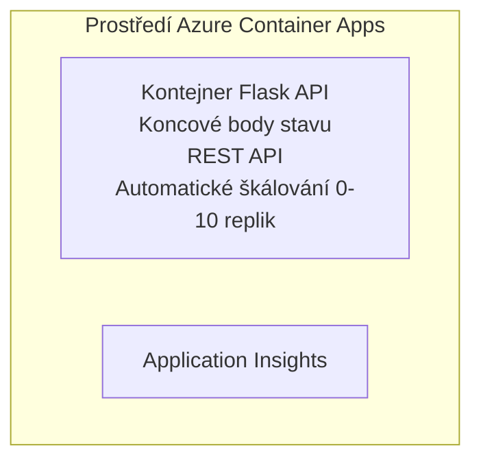

# Jednoduché Flask API - Příklad Container App

**Learning Path:** Beginner ⭐ | **Time:** 25-35 minutes | **Cost:** $0-15/month

Plně funkční Python Flask REST API nasazené do Azure Container Apps pomocí Azure Developer CLI (azd). Tento příklad demonstruje nasazení kontejneru, automatické škálování a základy monitorování.

## 🎯 Co se naučíte

- Nasadit kontejnerizovanou Python aplikaci do Azure
- Nakonfigurovat automatické škálování se scale-to-zero
- Implementovat health proby a readiness kontroly
- Monitorovat logy a metriky aplikace
- Použít Azure Developer CLI pro rychlé nasazení

## 📦 Co je součástí

✅ **Flask Application** - Kompletní REST API s CRUD operacemi (`src/app.py`)  
✅ **Dockerfile** - Produkční konfigurace kontejneru  
✅ **Bicep Infrastructure** - Prostředí Container Apps a nasazení API  
✅ **AZD Configuration** - Jednopříkazové nastavení nasazení  
✅ **Health Probes** - Konfigurované liveness a readiness kontroly  
✅ **Auto-scaling** - 0-10 replik podle HTTP zatížení  

## Architektura


## Požadavky

### Nutné
- **Azure Developer CLI (azd)** - [Install guide](https://learn.microsoft.com/azure/developer/azure-developer-cli/install-azd)
- **Azure subscription** - [Free account](https://azure.microsoft.com/free/)
- **Docker Desktop** - [Install Docker](https://www.docker.com/products/docker-desktop/) (pro lokální testování)

### Ověření požadavků

```bash
# Zkontrolujte verzi azd (potřebujete 1.5.0 nebo novější)
azd version

# Ověřte přihlášení do Azure
azd auth login

# Zkontrolujte Docker (volitelné, pro lokální testování)
docker --version
```

## ⏱️ Harmonogram nasazení

| Phase | Duration | What Happens |
|-------|----------|--------------||
| Environment setup | 30 seconds | Create azd environment |
| Build container | 2-3 minutes | Docker build Flask app |
| Provision infrastructure | 3-5 minutes | Create Container Apps, registry, monitoring |
| Deploy application | 2-3 minutes | Push image and deploy to Container Apps |
| **Total** | **8-12 minutes** | Complete deployment ready |

## Rychlý start

```bash
# Přejděte na příklad
cd examples/container-app/simple-flask-api

# Inicializujte prostředí (zvolte jedinečný název)
azd env new myflaskapi

# Nasaďte vše (infrastrukturu + aplikaci)
azd up
# Budete vyzváni k:
# 1. Vyberte předplatné Azure
# 2. Zvolte umístění (např. eastus2)
# 3. Počkejte 8-12 minut na nasazení

# Získejte svůj koncový bod API
azd env get-values

# Otestujte API
curl $(azd env get-value API_ENDPOINT)/health
```

**Očekávaný výstup:**
```json
{
  "status": "healthy",
  "timestamp": "2025-11-19T10:30:00Z",
  "service": "simple-flask-api",
  "version": "1.0.0"
}
```

## ✅ Ověření nasazení

### Krok 1: Zkontrolujte stav nasazení

```bash
# Zobrazit nasazené služby
azd show

# Očekávaný výstup ukazuje:
# - Služba: api
# - Koncový bod: https://ca-api-[env].xxx.azurecontainerapps.io
# - Stav: Běží
```

### Krok 2: Otestujte koncové body API

```bash
# Získat API koncový bod
API_URL=$(azd env get-value API_ENDPOINT)

# Otestovat stav
curl $API_URL/health

# Otestovat kořenový koncový bod
curl $API_URL/

# Vytvořit položku
curl -X POST $API_URL/api/items \
  -H "Content-Type: application/json" \
  -d '{"name": "Test Item", "description": "My first item"}'

# Získat všechny položky
curl $API_URL/api/items
```

**Kritéria úspěchu:**
- ✅ Koncový bod /health vrací HTTP 200
- ✅ Kořenový koncový bod zobrazuje informace o API
- ✅ POST vytvoří položku a vrátí HTTP 201
- ✅ GET vrátí vytvořené položky

### Krok 3: Zobrazit protokoly

```bash
# Streamujte živé logy pomocí azd monitor
azd monitor --logs

# Nebo použijte Azure CLI:
az containerapp logs show --name api --resource-group $RG_NAME --follow

# Měli byste vidět:
# - Zprávy o spuštění Gunicornu
# - Protokoly HTTP požadavků
# - Informační logy aplikace
```

## Struktura projektu

```
simple-flask-api/
├── azure.yaml              # AZD configuration
├── infra/
│   ├── main.bicep         # Main infrastructure
│   ├── main.parameters.json
│   └── app/
│       ├── container-env.bicep
│       └── api.bicep
└── src/
    ├── app.py             # Flask application
    ├── requirements.txt
    └── Dockerfile
```

## Koncové body API

| Endpoint | Method | Description |
|----------|--------|-------------|
| `/health` | GET | Kontrola stavu |
| `/api/items` | GET | Seznam všech položek |
| `/api/items` | POST | Vytvořit novou položku |
| `/api/items/{id}` | GET | Získat konkrétní položku |
| `/api/items/{id}` | PUT | Aktualizovat položku |
| `/api/items/{id}` | DELETE | Smazat položku |

## Konfigurace

### Proměnné prostředí

```bash
# Nastavit vlastní konfiguraci
azd env set PORT 8000
azd env set LOG_LEVEL info
azd env set MAX_REPLICAS 20
```

### Konfigurace škálování

API se automaticky škáluje podle HTTP provozu:
- **Min Replicas**: 0 (škáluje na nulu když je nečinné)
- **Max Replicas**: 10
- **Concurrent Requests per Replica**: 50

## Vývoj

### Spustit lokálně

```bash
# Nainstalujte závislosti
cd src
pip install -r requirements.txt

# Spusťte aplikaci
python app.py

# Otestujte lokálně
curl http://localhost:8000/health
```

### Sestavit a otestovat kontejner

```bash
# Sestavit obraz Dockeru
docker build -t flask-api:local ./src

# Spustit kontejner lokálně
docker run -p 8000:8000 flask-api:local

# Otestovat kontejner
curl http://localhost:8000/health
```

## Nasazení

### Kompletní nasazení

```bash
# Nasadit infrastrukturu a aplikaci
azd up
```

### Nasazení pouze kódu

```bash
# Nasadit pouze aplikační kód (infrastruktura beze změny)
azd deploy api
```

### Aktualizace konfigurace

```bash
# Aktualizovat proměnné prostředí
azd env set API_KEY "new-api-key"

# Znovu nasadit s novou konfigurací
azd deploy api
```

## Monitorování

### Zobrazit protokoly

```bash
# Streamujte živé logy pomocí azd monitor
azd monitor --logs

# Nebo použijte Azure CLI pro Container Apps:
az containerapp logs show --name api --resource-group $RG_NAME --follow

# Zobrazit posledních 100 řádků
az containerapp logs show --name api --resource-group $RG_NAME --tail 100
```

### Sledovat metriky

```bash
# Otevřít řídicí panel Azure Monitoru
azd monitor --overview

# Zobrazit konkrétní metriky
az monitor metrics list \
  --resource $(azd show --output json | jq -r '.services.api.resourceId') \
  --metric "Requests,ResponseTime"
```

## Testování

### Kontrola stavu

```bash
curl $(azd show --output json | jq -r '.services.api.endpoint')/health
```

Očekávaná odpověď:
```json
{
  "status": "healthy",
  "timestamp": "2025-11-19T10:30:00Z"
}
```

### Vytvořit položku

```bash
curl -X POST $(azd show --output json | jq -r '.services.api.endpoint')/api/items \
  -H "Content-Type: application/json" \
  -d '{"name": "Test Item", "description": "A test item"}'
```

### Získat všechny položky

```bash
curl $(azd show --output json | jq -r '.services.api.endpoint')/api/items
```

## Optimalizace nákladů

Toto nasazení využívá scale-to-zero, takže platíte pouze když API zpracovává požadavky:

- **Náklady v nečinnosti**: ~$0/month (škáluje na nulu)
- **Aktivní náklady**: ~$0.000024/second per replica
- **Odhadované měsíční náklady** (nízké zatížení): $5-15

### Další snížení nákladů

```bash
# Snížit maximální počet replik pro vývoj
azd env set MAX_REPLICAS 3

# Použít kratší časový limit nečinnosti
azd env set SCALE_TO_ZERO_TIMEOUT 300  # 5 minut
```

## Řešení problémů

### Kontejner se nespouští

```bash
# Zkontrolujte protokoly kontejneru pomocí Azure CLI
az containerapp logs show --name api --resource-group $RG_NAME --tail 100

# Ověřte, že se Docker image sestaví lokálně
docker build -t test ./src
```

### API není dostupné

```bash
# Ověřte, že ingress je externí
az containerapp show --name api --resource-group rg-simple-flask-api \
  --query properties.configuration.ingress.external
```

### Vysoké doby odezvy

```bash
# Zkontrolujte využití CPU/paměti
az monitor metrics list \
  --resource $(azd show --output json | jq -r '.services.api.resourceId') \
  --metric "CPUPercentage,MemoryPercentage"

# Zvyšte zdroje v případě potřeby
az containerapp update --name api --resource-group rg-simple-flask-api \
  --cpu 1.0 --memory 2Gi
```

## Vyčištění

```bash
# Odstraňte všechny zdroje
azd down --force --purge
```

## Další kroky

### Rozšíření tohoto příkladu

1. **Přidat databázi** - Integrovat Azure Cosmos DB nebo SQL Database
   ```bash
   # Přidat modul Cosmos DB do infra/main.bicep
   # Aktualizovat app.py s připojením k databázi
   ```

2. **Přidat autentizaci** - Implementujte Azure AD nebo API klíče
   ```python
   # Přidejte autentizační middleware do app.py
   from functools import wraps
   ```

3. **Nastavit CI/CD** - GitHub Actions workflow
   ```yaml
   # Create .github/workflows/deploy.yml
   name: Deploy to Azure
   on: [push]
   ```

4. **Přidat spravovanou identitu** - Zabezpečit přístup k Azure službám
   ```bicep
   # Update infra/app/api.bicep
   identity: { type: 'SystemAssigned' }
   ```

### Příbuzné příklady

- **[Database App](../../../../../examples/database-app)** - Kompletní příklad s SQL Database
- **[Microservices](../../../../../examples/container-app/microservices)** - Architektura více služeb
- **[Container Apps Master Guide](../README.md)** - Všechny vzory kontejnerů

### Výukové zdroje

- 📚 [AZD For Beginners Course](../../../README.md) - Hlavní stránka kurzu
- 📚 [Container Apps Patterns](../README.md) - Další vzory nasazení
- 📚 [AZD Templates Gallery](https://azure.github.io/awesome-azd/) - Galerie komunitních šablon

## Další zdroje

### Dokumentace
- **[Flask Documentation](https://flask.palletsprojects.com/)** - Průvodce frameworkem Flask
- **[Azure Container Apps](https://learn.microsoft.com/azure/container-apps/)** - Oficiální dokumentace Azure
- **[Azure Developer CLI](https://learn.microsoft.com/azure/developer/azure-developer-cli/)** - Referenční příkazy azd

### Tutoriály
- **[Container Apps Quickstart](https://learn.microsoft.com/azure/container-apps/quickstart-portal)** - Nasadíte svou první aplikaci
- **[Python on Azure](https://learn.microsoft.com/azure/developer/python/)** - Průvodce vývojem v Pythonu pro Azure
- **[Bicep Language](https://learn.microsoft.com/azure/azure-resource-manager/bicep/)** - Infrastruktura jako kód

### Nástroje
- **[Azure Portal](https://portal.azure.com)** - Správa prostředí přes grafické rozhraní
- **[VS Code Azure Extension](https://marketplace.visualstudio.com/items?itemName=ms-azuretools.vscode-azurecontainerapps)** - Integrace do IDE

---

**🎉 Gratulujeme!** Nasadili jste produkčně připravené Flask API do Azure Container Apps s automatickým škálováním a monitorováním.

**Máte otázky?** [Otevřete issue](https://github.com/microsoft/AZD-for-beginners/issues) nebo zkontrolujte [FAQ](../../../resources/faq.md)

---

<!-- CO-OP TRANSLATOR DISCLAIMER START -->
**Vyloučení odpovědnosti**:
Tento dokument byl přeložen pomocí AI překladatelské služby [Co-op Translator](https://github.com/Azure/co-op-translator). I když usilujeme o přesnost, vezměte prosím na vědomí, že automatické překlady mohou obsahovat chyby nebo nepřesnosti. Původní dokument v jeho originálním jazyce by měl být považován za rozhodující zdroj. Pro kritické informace se doporučuje profesionální lidský překlad. Nejsme odpovědní za žádné nedorozumění nebo chybné výklady vyplývající z použití tohoto překladu.
<!-- CO-OP TRANSLATOR DISCLAIMER END -->